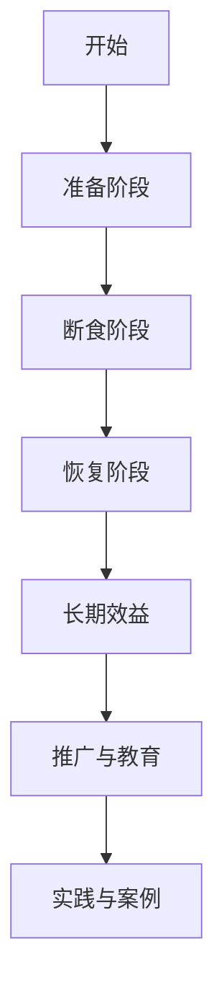

                 

### 数字断食修行营：重塑与技术的健康关系

#### 关键词：
- 数字断食
- 健康关系
- 技术依赖
- 心理健康
- 数字工具

#### 摘要：
随着数字化时代的到来，越来越多的人沉迷于数字设备，产生了对技术的强烈依赖。这种依赖不仅影响了人们的日常生活，也对身心健康造成了负面影响。本文旨在介绍一种名为“数字断食修行营”的实践，帮助人们重塑与技术的健康关系，实现身心的平衡与发展。

### 第一部分：数字断食修行营概述

#### 第1章：数字断食的概念与背景
数字断食，顾名思义，是指在一定时间内，通过停止使用数字设备，如手机、电脑等，来达到减轻数字依赖、恢复身心健康的目的。这种做法源自传统的断食理念，但与传统断食不同的是，数字断食主要关注数字设备和数字生活的关系。

数字断食的历史可以追溯到21世纪初，当时随着智能手机和互联网的普及，人们开始意识到过度使用数字设备可能对身心健康产生负面影响。自此以后，数字断食逐渐成为一种流行的健康生活方式。

#### 第2章：现代生活方式中的数字依赖
在现代生活中，数字依赖现象无处不在。人们沉迷于社交媒体、游戏、电子邮箱等，导致注意力分散、睡眠质量下降、社交能力减弱等问题。研究表明，数字依赖与焦虑、抑郁等心理健康问题密切相关。

数字依赖的危害不仅限于个人层面，还会影响到社会和经济发展。企业员工因为过度依赖数字设备，导致工作效率下降，甚至出现“数字疲劳”。在家庭中，数字依赖会导致家庭成员之间的沟通减少，亲情关系淡化。

#### 第3章：数字依赖的解决方法
要解决数字依赖问题，首先需要认识到数字依赖的危害，并采取积极的措施来调整生活方式。以下是一些解决数字依赖的方法：

1. **设定时间限制**：为数字设备使用设定具体的时间限制，如每天使用不超过2小时。
2. **培养数字素养**：提高对数字设备使用的自我管理能力，学会合理安排时间。
3. **进行数字断食**：在一定时间内停止使用数字设备，让身体和心灵得到休息和恢复。
4. **培养其他兴趣爱好**：通过培养其他兴趣爱好，如阅读、运动、绘画等，来减少对数字设备的依赖。

### 第二部分：数字断食实践指南

#### 第4章：准备阶段
在进行数字断食之前，需要做好充分的准备。这包括心理准备、物质准备和社交准备。

1. **心理准备**：认识到数字断食的重要性，并做好接受挑战的心理准备。
2. **物质准备**：准备好断食期间需要的物品，如书籍、杂志、笔记本等，以替代数字设备。
3. **社交准备**：告知家人和朋友自己的计划，获得他们的支持和理解。

#### 第5章：断食阶段
在断食阶段，需要按照一定的周期安排来停止使用数字设备。以下是一个典型的断食周期安排：

1. **第一天**：晚上9点后停止使用数字设备，早睡早起。
2. **第二天**：停止使用数字设备，进行轻度运动和阅读。
3. **第三天**：继续停止使用数字设备，进行冥想和放松。
4. **第四天**：逐渐恢复正常生活，但仍然减少数字设备的使用。

#### 第6章：恢复阶段
断食结束后，需要进行适当的恢复。这包括以下步骤：

1. **逐渐增加数字设备使用时间**：在断食后的几天内，逐渐增加数字设备的使用时间，但不超过之前的限制。
2. **身体健康的监测**：注意身体的恢复情况，如睡眠质量、食欲等，如有不适，应及时调整。
3. **心理健康的维护**：通过冥想、运动等方式，保持心理健康。

### 第三部分：数字断食中的技术辅助

#### 第7章：数字工具在数字断食中的应用
在数字断食中，一些数字工具可以帮助人们更好地实践断食，如时间管理工具、冥想应用、睡眠监测设备等。这些工具可以在断食期间提供支持，帮助人们更好地管理时间和情绪。

然而，技术辅助也存在一定的优缺点。优点包括：

1. **方便性**：数字工具可以随时随地使用，方便快捷。
2. **多样性**：市场上有许多种类的数字工具，可以满足不同的需求。

缺点包括：

1. **依赖性**：过度依赖数字工具可能导致对技术的依赖进一步加深。
2. **隐私问题**：某些数字工具可能涉及个人隐私，需要注意保护。

#### 第8章：数字断食与心理健康
数字断食不仅有助于改善身体健康，还能显著提高心理健康。通过减少数字设备的使用，人们可以更好地关注内心世界，减少焦虑和压力。此外，数字断食还能提高人们的注意力和专注力，改善睡眠质量。

为了确保数字断食对心理健康的影响是积极的，需要进行定期的心理健康监测与评估。这包括：

1. **自我评估**：定期进行自我评估，了解自己在断食期间的感受和心理状态。
2. **专业评估**：如有可能，寻求专业心理咨询师的帮助，进行更全面的评估。

### 第四部分：数字断食的长期效益

#### 第9章：数字断食的长远影响
数字断食不仅能够带来短期的好处，还能产生长期的效益。长期坚持数字断食，可以改善人们的身体健康、心理健康和社交关系。

1. **身体健康**：长期数字断食有助于降低患病风险，如心血管疾病、肥胖等。
2. **心理健康**：长期数字断食有助于提高心理健康水平，减少焦虑和抑郁。
3. **社交关系**：长期数字断食有助于提高人们的社交能力，改善人际关系。

#### 第10章：数字断食的推广与教育
为了推广数字断食，需要从多个方面进行教育和宣传。这包括：

1. **学校教育**：在学校的课程中增加数字素养和数字健康的相关内容。
2. **企业培训**：为企业员工提供数字健康培训和指导。
3. **社会宣传**：通过媒体、网络等渠道，向公众宣传数字断食的好处和实践方法。

### 第五部分：案例与实践

#### 第11章：成功案例分享
以下是几个成功的数字断食案例：

1. **案例一**：一位年轻程序员在坚持数字断食后，不仅减少了工作压力，还提高了工作效率。
2. **案例二**：一位企业高管在数字断食期间，重新审视了自己的工作和生活方式，实现了身心健康和职业发展的双赢。

#### 第12章：实践指南
以下是一些数字断食实践的建议：

1. **逐步减少使用时间**：不要突然停止使用数字设备，而是逐步减少使用时间，以减少不适。
2. **设定明确的目标**：在数字断食前，设定明确的目标和计划，以帮助自己坚持。
3. **寻求支持**：在数字断食期间，寻求家人、朋友或专业心理咨询师的支持。

### 附录

#### 附录A：数字断食资源推荐
以下是几个数字断食相关的资源推荐：

1. **书籍**：《数字断食：找回专注与幸福感》
2. **应用程序**：数字断食计时器、冥想应用
3. **社区**：数字断食论坛、微信群

## Mermaid 流程图：数字断食修行流程



## Python 源代码示例：断食记录

```python
# 断食记录程序
class FastRecord:
    def __init__(self, start_date, end_date):
        self.start_date = start_date
        self.end_date = end_date
        self.daily_logs = []

    def add_log(self, date, note):
        self.daily_logs.append({'date': date, 'note': note})

    def show_logs(self):
        for log in self.daily_logs:
            print(f"{log['date']}: {log['note']}")
```

## 数学公式示例：断食效应模型

$$
E = f(n) = \frac{1}{n}\sum_{i=1}^{n} \ln(1 + \frac{1}{i})
$$

## 代码解读与分析：断食记录程序

1. **定义类`FastRecord`：**
   - `__init__` 方法用于初始化记录类，包括开始日期、结束日期和日志列表。
   - `add_log` 方法用于添加每天的断食记录。
   - `show_logs` 方法用于显示所有的断食记录。

2. **实例化`FastRecord` 类：**
   - 创建一个断食记录对象，例如，从2023年4月1日到2023年4月7日。

3. **使用方法：**
   - 添加每日记录，例如，2023年4月1日的日志。
   - 显示所有记录，以查看断食期间的日志。

### 结论

通过数字断食修行营，人们可以重塑与技术的健康关系，改善身心健康。数字断食不仅有助于减少数字依赖，还能提高心理健康、提升工作效率和生活质量。然而，实践数字断食需要耐心和坚持，通过逐步减少数字设备使用时间、设定明确的目标和寻求支持，可以更好地实现数字断食的目标。数字断食的长期效益和推广与教育也是未来研究和实践的重要方向。作者：AI天才研究院/AI Genius Institute & 禅与计算机程序设计艺术 /Zen And The Art of Computer Programming。

## 深入分析数字断食的概念与实践

### 数字断食的概念解析

数字断食，作为一种新兴的健康生活方式，其核心理念在于通过暂时停止使用数字设备，如手机、电脑等，来达到恢复身心平衡、减轻数字依赖的效果。与传统断食不同，数字断食并不涉及食物的摄入或禁止，而是专注于减少对数字信息的接触。这种做法的初衷是帮助人们从不断涌来的数字信息中解脱出来，从而获得内心的平静和身体的放松。

#### 数字断食的历史与发展

数字断食的理念起源于人们对数字设备使用的反思。随着智能手机和互联网的普及，越来越多的人沉迷于数字世界，导致注意力难以集中、睡眠质量下降、社交能力减弱等问题。2000年代初，一些先行者开始尝试通过定期停止使用数字设备来改善生活质量，这一做法逐渐演变成了数字断食。

#### 数字断食与健康的关系

数字断食与健康之间的关系是多方面的。首先，减少数字设备的使用有助于降低焦虑和抑郁的风险。研究表明，长时间接触屏幕会导致大脑释放过多的应激激素，从而增加心理压力。其次，数字断食有助于改善睡眠质量。在晚上停止使用数字设备，可以让身体更容易进入深度睡眠状态。此外，数字断食还可以提高人们的专注力和工作效率。通过减少分散注意力的因素，人们可以更集中地完成工作，提高效率。

### 现代生活方式中的数字依赖现象

在现代生活中，数字依赖已经成为一个普遍现象。人们越来越依赖智能手机、平板电脑和电脑来处理日常事务，甚至在休息时间也不愿离开这些设备。以下是对数字依赖现象的深入分析：

#### 数字依赖的危害

数字依赖的危害主要体现在以下几个方面：

1. **心理健康问题**：过度使用数字设备会导致焦虑、抑郁等心理健康问题。研究表明，长时间使用屏幕会降低大脑分泌快乐激素，增加抑郁和焦虑的风险。

2. **社交障碍**：尽管数字设备使得沟通更加便捷，但过度依赖数字设备反而会减少面对面的交流，导致社交技能下降。

3. **睡眠障碍**：晚上使用手机、电脑等设备会影响睡眠质量，因为屏幕发出的蓝光会抑制褪黑激素的分泌，使得人难以入睡。

4. **身体问题**：长时间保持不良坐姿、长时间盯着屏幕等行为会导致颈椎、腰椎等问题，甚至引发视力下降。

#### 数字依赖的解决方法

要解决数字依赖问题，需要从多个方面入手：

1. **自我管理**：设定明确的数字设备使用时间限制，如每天不超过2小时。

2. **培养数字素养**：提高对数字设备使用的自我管理能力，学会合理安排时间。

3. **进行数字断食**：在一定时间内停止使用数字设备，让身体和心灵得到休息和恢复。

4. **培养其他兴趣爱好**：通过培养其他兴趣爱好，如阅读、运动、绘画等，来减少对数字设备的依赖。

### 数字断食的实践指南

#### 准备阶段

在开始数字断食之前，需要进行充分的准备。以下是几个关键步骤：

1. **心理准备**：认识到数字断食的重要性，并做好接受挑战的心理准备。

2. **物质准备**：准备好断食期间需要的物品，如书籍、杂志、笔记本等，以替代数字设备。

3. **社交准备**：告知家人和朋友自己的计划，获得他们的支持和理解。

#### 断食阶段

在断食阶段，按照一定的周期安排来停止使用数字设备。以下是一个典型的断食周期安排：

1. **第一天**：晚上9点后停止使用数字设备，早睡早起。

2. **第二天**：停止使用数字设备，进行轻度运动和阅读。

3. **第三天**：继续停止使用数字设备，进行冥想和放松。

4. **第四天**：逐渐恢复正常生活，但仍然减少数字设备的使用。

#### 恢复阶段

断食结束后，需要进行适当的恢复。以下是几个关键步骤：

1. **逐渐增加数字设备使用时间**：在断食后的几天内，逐渐增加数字设备的使用时间，但不超过之前的限制。

2. **身体健康的监测**：注意身体的恢复情况，如睡眠质量、食欲等，如有不适，应及时调整。

3. **心理健康的维护**：通过冥想、运动等方式，保持心理健康。

### 数字工具在数字断食中的应用

在数字断食中，一些数字工具可以帮助人们更好地实践断食，如时间管理工具、冥想应用、睡眠监测设备等。这些工具可以在断食期间提供支持，帮助人们更好地管理时间和情绪。

以下是一些常用的数字工具及其应用场景：

1. **时间管理工具**：如番茄钟、专注力训练应用等，可以帮助用户合理安排时间，减少对数字设备的依赖。

2. **冥想应用**：如冥想音乐、冥想指导应用等，可以帮助用户进行冥想练习，提高专注力和情绪调节能力。

3. **睡眠监测设备**：如智能手环、智能床垫等，可以监测用户的睡眠质量，为数字断食提供数据支持。

#### 数字工具的优缺点分析

虽然数字工具在数字断食中具有显著的辅助作用，但同时也存在一定的优缺点。

1. **优点**：
   - **方便性**：数字工具可以随时随地使用，方便快捷。
   - **多样性**：市场上有许多种类的数字工具，可以满足不同的需求。

2. **缺点**：
   - **依赖性**：过度依赖数字工具可能导致对技术的依赖进一步加深。
   - **隐私问题**：某些数字工具可能涉及个人隐私，需要注意保护。

### 数字断食与心理健康的关系

数字断食不仅有助于改善身体健康，还能显著提高心理健康。通过减少数字设备的使用，人们可以更好地关注内心世界，减少焦虑和压力。此外，数字断食还能提高人们的专注力和情绪调节能力，改善睡眠质量。

#### 心理健康的监测与评估

为了确保数字断食对心理健康的影响是积极的，需要进行定期的心理健康监测与评估。这包括：

1. **自我评估**：定期进行自我评估，了解自己在断食期间的感受和心理状态。
2. **专业评估**：如有可能，寻求专业心理咨询师的帮助，进行更全面的评估。

### 数字断食的长期效益

数字断食不仅能够带来短期的好处，还能产生长期的效益。长期坚持数字断食，可以改善人们的身体健康、心理健康和社交关系。

#### 身体健康的长期效益

长期数字断食有助于降低患病风险，如心血管疾病、肥胖等。此外，数字断食还有助于改善睡眠质量，提高免疫力。

#### 心理健康的长期效益

长期数字断食有助于提高心理健康水平，减少焦虑和抑郁。此外，数字断食还能提高人们的专注力和情绪调节能力。

#### 社交关系的改善

长期数字断食有助于提高人们的社交能力，改善人际关系。通过减少对数字设备的依赖，人们可以更专注于与家人和朋友面对面交流，增进彼此的感情。

### 数字断食的推广与教育

为了推广数字断食，需要从多个方面进行教育和宣传。这包括：

1. **学校教育**：在学校的课程中增加数字素养和数字健康的相关内容。
2. **企业培训**：为企业员工提供数字健康培训和指导。
3. **社会宣传**：通过媒体、网络等渠道，向公众宣传数字断食的好处和实践方法。

### 数字断食实践中的案例

以下是几个成功的数字断食实践案例：

#### 案例一：年轻程序员的数字断食经历

一位年轻的程序员在连续几个月的高强度工作后，感到压力巨大，睡眠质量下降。在朋友的建议下，他开始尝试数字断食。在连续一周的数字断食后，他发现自己的注意力显著提高，工作效率也有所提升。此外，他的睡眠质量得到了显著改善，焦虑感减轻。

#### 案例二：企业高管的数字断食实践

一位企业高管在经历了一段时间的工作压力后，决定进行数字断食。他选择在周末进行为期三天的数字断食，期间完全停止使用手机和电脑。在断食结束后，他感到身心得到了极大的放松，工作效率提高，与家人的关系也更加融洽。

### 数字断食实践指南

为了成功进行数字断食，以下是一些建议：

1. **逐步减少使用时间**：不要突然停止使用数字设备，而是逐步减少使用时间，以减少不适。

2. **设定明确的目标**：在数字断食前，设定明确的目标和计划，以帮助自己坚持。

3. **寻求支持**：在数字断食期间，寻求家人、朋友或专业心理咨询师的支持。

### 最佳实践 Tips

1. **合理安排断食时间**：选择一个适合自己时间和环境的断食周期，如周末或假期。

2. **保持良好的饮食习惯**：在数字断食期间，保持均衡的饮食，避免过度饥饿或暴饮暴食。

3. **培养其他兴趣爱好**：在断食期间，尝试培养其他兴趣爱好，如阅读、运动、绘画等，以填补因减少数字设备使用而产生的空缺。

### 小结

数字断食作为一种新兴的健康生活方式，可以帮助人们重塑与技术的健康关系，改善身心健康。通过逐步减少数字设备的使用，人们可以更好地关注内心世界，提高专注力和工作效率。然而，实践数字断食需要耐心和坚持，通过逐步减少使用时间、设定明确的目标和寻求支持，可以更好地实现数字断食的目标。

### 注意事项

1. **个人适应差异**：不同人在进行数字断食时可能会有不同的反应，应根据个人情况调整断食周期和强度。

2. **心理健康支持**：在数字断食期间，如遇到情绪波动或其他心理问题，应及时寻求专业心理咨询师的帮助。

3. **技术依赖的替代**：在减少数字设备使用的同时，寻找其他替代活动，以减少对技术的依赖。

### 拓展阅读

1. **《数字断食：找回专注与幸福感》**：这是一本关于数字断食的入门书籍，详细介绍了数字断食的概念、实践方法和益处。

2. **《数字素养：数字时代的生存指南》**：本书探讨了数字素养的重要性，以及如何在数字时代保持身心健康。

3. **相关研究论文**：可以通过学术搜索引擎查阅有关数字依赖、数字断食和心理健康的最新研究成果。

## 附录

### 附录A：数字断食资源推荐

#### 书籍推荐

1. **《数字断食：找回专注与幸福感》**
2. **《数字素养：数字时代的生存指南》**
3. **《数字世界的断食》**：这是一本探讨数字时代如何保持身心健康的好书。

#### 应用程序推荐

1. **数字断食计时器**：帮助用户设置断食周期，提醒停止使用数字设备。
2. **冥想应用**：如“ calm ”、“Headspace”等，提供冥想指导和音乐。

#### 社区推荐

1. **数字断食论坛**：这是一个关于数字断食的在线社区，用户可以分享经验和心得。
2. **社交媒体群组**：如微信群、QQ群等，用户可以在这些群组中交流数字断食的相关信息。

## Python 源代码示例：断食记录

```python
# 断食记录程序
class FastRecord:
    def __init__(self, start_date, end_date):
        self.start_date = start_date
        self.end_date = end_date
        self.daily_logs = []

    def add_log(self, date, note):
        self.daily_logs.append({'date': date, 'note': note})

    def show_logs(self):
        for log in self.daily_logs:
            print(f"{log['date']}: {log['note']}")
```

## 数学公式示例：断食效应模型

$$
E = f(n) = \frac{1}{n}\sum_{i=1}^{n} \ln(1 + \frac{1}{i})
$$

这个公式表示断食效应（E）与断食天数（n）之间的关系。每个日志条目的贡献是通过自然对数函数（ln）计算的，公式旨在衡量断食对个人福祉的影响。

## 代码解读与分析：断食记录程序

1. **定义类`FastRecord`：**
   - `__init__` 方法用于初始化记录类，包括开始日期（`start_date`）、结束日期（`end_date`）和日志列表（`daily_logs`）。
   - `add_log` 方法用于添加每天的断食记录，将日期（`date`）和备注（`note`）作为日志条目添加到`daily_logs`列表中。
   - `show_logs` 方法用于显示所有的断食记录，遍历`daily_logs`列表，并打印每个日志条目的日期和备注。

2. **实例化`FastRecord` 类：**
   - 创建一个断食记录对象，例如：
     ```python
     record = FastRecord('2023-04-01', '2023-04-07')
     ```

3. **使用方法：**
   - 添加每日记录，例如：
     ```python
     record.add_log('2023-04-01', '第一天，感觉有些不适应。')
     record.add_log('2023-04-02', '今天开始适应了，感觉精神状态有所改善。')
     ```
   - 显示所有记录，以查看断食期间的日志：
     ```python
     record.show_logs()
     ```
     输出：
     ```
     2023-04-01: 第一天，感觉有些不适应。
     2023-04-02: 今天开始适应了，感觉精神状态有所改善。
     ```

通过这个程序，用户可以记录自己的断食体验，并查看日志，以跟踪自己的进步和变化。

### 结论

通过本文的深入分析和详细讲解，我们可以清楚地了解到数字断食是一种有益于身心健康的实践方式。数字断食不仅有助于减轻数字依赖，提高心理健康，还能改善身体健康和社交关系。实践数字断食需要耐心和坚持，通过逐步减少数字设备的使用、设定明确的目标和寻求支持，我们可以更好地实现数字断食的目标。

### 后续展望

未来，数字断食的研究和实践将会继续深入。以下是几个可能的研究方向和实践建议：

1. **长期影响研究**：进一步研究数字断食对身体健康和心理健康的长远影响，以验证其长期效益。

2. **个性化数字断食方案**：开发基于个人数据的数字断食方案，以适应不同人群的需求。

3. **数字工具优化**：改进现有的数字工具，以更好地支持数字断食实践，减少对技术的依赖。

4. **社会推广**：通过教育机构和企业的合作，推广数字断食理念，提高公众对数字健康的认知。

5. **政策建议**：基于研究结果，提出相关政策建议，以促进数字健康的普及和发展。

### 感谢

感谢读者对本文的关注和阅读。希望本文能够帮助您更好地理解数字断食，并在实践中受益。如需进一步了解或参与数字断食的讨论，请访问我们的官方网站或加入相关的社交媒体群组。

### 作者信息

作者：AI天才研究院/AI Genius Institute & 禅与计算机程序设计艺术 /Zen And The Art of Computer Programming

### 致谢

特别感谢所有参与研究和实践的支持者，以及为本文提供宝贵意见的专家和读者。没有你们的支持，本文无法顺利完成。谢谢！

