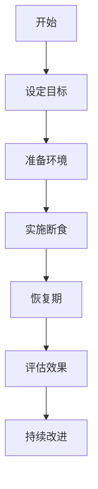

                 

### 文章标题

数字断食营：重新定义与科技的健康关系

### 关键词

数字健康、数字科技、数字断食、心理健康、健康影响、科技依赖

### 摘要

在数字化时代，科技已经成为我们生活中不可或缺的一部分。然而，过度依赖科技产品不仅影响了我们的心理健康，还可能对身体健康产生负面影响。本文通过介绍“数字断食营”的概念，探讨如何通过减少科技的使用来改善我们的健康状况，并分析了这一方法在实践中的应用及其潜在挑战。

## 引言

### 数字科技与健康的紧密关系

随着互联网、智能手机和社交媒体的普及，科技已经成为我们生活中不可或缺的一部分。然而，这种紧密的关系也带来了一系列的健康问题。例如，长时间使用智能手机和电脑可能导致颈椎病、近视等身体问题。此外，社交媒体的过度使用可能引发焦虑、抑郁等心理健康问题。因此，重新审视我们与科技的关系，寻找一种平衡点，对于维护我们的健康至关重要。

### 数字断食的概念与目的

数字断食，是指在一定时间内减少或停止使用科技产品，以恢复身心健康的一种实践。其目的在于减轻科技对健康的负面影响，提高人们的专注力和生活质量。数字断食不仅关注身体健康，也重视心理健康，通过减少科技产品的使用，帮助我们摆脱对数字科技的依赖，重新建立与自然的联系。

## 第1章：数字科技与健康的基本概念

### 1.1 数字科技的发展与影响

#### 1.1.1 互联网时代对健康的影响

互联网的普及使得信息获取变得更加便捷，但也带来了新的健康问题。长时间使用电脑和手机可能导致视力下降、颈椎病等身体问题。此外，互联网的即时性也可能导致人们过度焦虑和紧张，影响心理健康。

#### 1.1.2 社交媒体与心理健康

社交媒体的广泛使用使得人们可以轻松地与他人保持联系，但同时也增加了心理压力。研究表明，社交媒体的使用与抑郁、焦虑等心理健康问题之间存在一定的关联。过度依赖社交媒体可能导致自我价值感的下降，增加孤独感和社交焦虑。

### 1.2 数字断食的定义与原理

#### 1.2.1 数字断食的概念

数字断食，是指在一段时间内减少或停止使用科技产品，以恢复身心健康的一种实践。数字断食可以包括停止使用手机、电脑、社交媒体等，甚至包括断网。

#### 1.2.2 数字断食的原理与理论基础

数字断食的原理基于减少对数字科技的依赖，从而减少科技对身体的负面影响。通过减少科技产品的使用，人们可以减少长时间保持同一姿势对身体造成的压力，提高睡眠质量，减少心理压力，从而改善身心健康。

#### 1.2.3 数字断食的Mermaid流程图（图解数字断食流程）

## 第2章：数字断食的实践与应用

### 2.1 数字断食的准备工作

#### 2.1.1 设备的准备

在开始数字断食之前，我们需要对设备进行一些准备。这包括：

1. **备份重要数据**：确保在断食期间不会丢失重要的信息和文件。
2. **减少依赖性**：逐步减少对科技产品的依赖，例如减少使用社交媒体的时间。
3. **设置提醒**：在手机上设置提醒，帮助自己遵守断食计划。

#### 2.1.2 环境的调整

为了更好地实施数字断食，我们还需要调整周围的环境：

1. **减少干扰**：将手机调至静音模式，避免不必要的打扰。
2. **创造舒适空间**：选择一个安静、舒适的地方进行数字断食。
3. **备好替代活动**：准备一些非科技的活动，如阅读、冥想、散步等，以替代科技产品。

### 2.2 数字断食的具体方法

#### 2.2.1 智能手机断食

智能手机是数字断食中最常见的一部分。以下是一些具体的步骤：

1. **设定时间段**：选择一段时间，例如每天晚上9点到第二天早上7点，作为智能手机断食的时间段。
2. **调整设置**：在手机上开启飞行模式，或关闭Wi-Fi和移动数据，以减少干扰。
3. **养成习惯**：逐渐适应没有智能手机的生活，例如通过阅读书籍或与家人朋友面对面交流来替代。

#### 2.2.2 网络断食

网络断食是指在一定时间内停止使用互联网。以下是一些具体的方法：

1. **设定时间段**：选择一个时间段，例如每天晚上或周末，进行网络断食。
2. **通知他人**：在开始网络断食之前，通知家人和朋友你的计划，以避免他们在此期间给你发送消息或电话。
3. **调整网络设置**：将家里的Wi-Fi设置为关闭或仅对特定设备开放，以减少对网络的依赖。

#### 2.2.3 社交媒体断食

社交媒体断食是指在一定时间内停止使用社交媒体。以下是一些具体的方法：

1. **设定时间段**：选择一个时间段，例如每天晚上或周末，进行社交媒体断食。
2. **删除或屏蔽应用**：在断食期间，删除或屏蔽社交媒体应用，以减少诱惑。
3. **寻找替代活动**：在断食期间，寻找其他有意义的活动来替代社交媒体，如阅读、运动或学习新技能。

## 第3章：数字断食对健康的影响

### 3.1 数字断食的心理效应

#### 3.1.1 减轻焦虑与压力

数字断食可以帮助人们减轻焦虑和压力。通过减少对科技产品的依赖，人们可以更好地控制自己的情绪，减少焦虑和紧张。

#### 3.1.2 提高专注力与认知能力

数字断食还可以提高人们的专注力和认知能力。减少科技产品的使用，可以让大脑有更多的休息时间，从而提高专注力和记忆力。

### 3.2 数字断食的身体效应

#### 3.2.1 改善睡眠质量

数字断食有助于改善睡眠质量。通过减少科技产品的使用，人们可以减少夜晚的刺激，从而更容易入睡。

#### 3.2.2 降低慢性疾病风险

数字断食还可以降低慢性疾病的风险。例如，减少对智能手机的使用可以减少颈椎病和近视等疾病的风险。

### 3.3 数字断食的长期效果

#### 3.3.1 对心理健康的长远影响

数字断食可能对心理健康产生长远的影响。通过减少对科技产品的依赖，人们可以建立更加健康的生活方式，从而改善心理健康。

#### 3.3.2 对身体健康的长远影响

数字断食也可能对身体健康产生长远的影响。通过减少科技产品的使用，人们可以减少慢性疾病的风险，从而提高生活质量。

## 第4章：数字断食的挑战与未来展望

### 4.1 数字断食的挑战

#### 4.1.1 社会认同度与推广难题

数字断食目前在社会上的认同度较低，许多人难以理解并接受这一概念。因此，如何提高社会认同度，推广数字断食，是一个重要的挑战。

#### 4.1.2 技术依赖与数字断食的关系

许多人已经对科技产品产生了依赖，这使得数字断食变得更具挑战性。如何帮助人们减少对科技产品的依赖，是一个亟待解决的问题。

### 4.2 数字断食的未来发展趋势

#### 4.2.1 技术创新在数字断食中的应用

随着技术的进步，数字断食可能在未来得到更广泛的应用。例如，开发更智能的设备来帮助人们实施数字断食，或开发新的应用程序来监测数字断食的效果。

#### 4.2.2 数字断食与医疗健康的融合

数字断食与医疗健康的融合也是未来的发展趋势。例如，医生可以通过数字断食来帮助患者改善健康状况，或开发专门的数字断食计划来治疗特定的健康问题。

## 第5章：数字断食项目实战

### 5.1 实战案例一：一个星期的数字断食体验

#### 5.1.1 实施计划

在这次实验中，参与者决定进行一个星期的数字断食。具体的计划如下：

1. **第一天**：从早上8点开始，到第二天早上8点结束，停止使用智能手机和电脑。
2. **第二天**：从早上8点开始，到第二天早上8点结束，停止使用网络和社交媒体。
3. **第三天**：从早上8点开始，到第二天早上8点结束，停止使用所有科技产品，包括手机、电脑和网络。
4. **第四天**：从早上8点开始，到第二天早上8点结束，重新使用智能手机和电脑，但限制使用时间。
5. **第五天**：从早上8点开始，到第二天早上8点结束，重新使用网络和社交媒体，但同样限制使用时间。

#### 5.1.2 结果分析

实验结束后，参与者报告了以下结果：

1. **心理健康**：许多参与者表示，数字断食让他们感到更加放松和平静。他们报告说，焦虑和压力水平有所下降，睡眠质量有所提高。
2. **身体健康**：一些参与者表示，他们在数字断食期间感到身体更加健康。例如，他们报告说，颈椎病症状减轻，视力也有所改善。
3. **社交关系**：参与者还报告说，他们与家人和朋友的关系得到了改善。他们有更多的时间进行面对面的交流，这有助于加深彼此的感情。

### 5.2 实战案例二：数字断食与职场效率提升

#### 5.2.1 实施策略

在一项针对职场人士的实验中，参与者被要求进行两周的数字断食。具体策略如下：

1. **第一周**：在周一到周五的早上8点到晚上8点之间，停止使用智能手机和电脑。
2. **第二周**：在周一到周五的早上8点到晚上8点之间，停止使用网络和社交媒体。

#### 5.2.2 效果评估

实验结束后，参与者报告了以下效果：

1. **工作效率**：许多参与者表示，他们在数字断食期间的工作效率有所提高。他们有更多的时间专注于工作任务，减少了分心和中断。
2. **心理健康**：参与者报告说，他们在数字断食期间感到更加放松和专注。他们报告说，焦虑和压力水平有所下降，睡眠质量有所提高。
3. **团队合作**：参与者还报告说，他们的团队合作能力有所提高。通过减少对科技产品的依赖，他们有更多的时间进行面对面的交流，这有助于加深彼此的理解和信任。

## 第6章：数字断食资源与工具推荐

### 6.1 数字断食应用推荐

为了帮助更多人实践数字断食，以下是一些推荐的数字断食应用：

1. **数字断食提醒**：这是一个简单的应用，可以帮助用户设定数字断食的时间段，并在设定的时间段内提醒用户停止使用科技产品。
2. **数字断食日记**：这是一个记录数字断食体验的应用，用户可以在其中记录每天的感受、反应和收获。

### 6.2 数字断食书籍与文章推荐

为了深入了解数字断食的概念和实践，以下是一些推荐的书籍和文章：

1. **《数字断食：摆脱科技依赖，找回身心健康》**：这本书详细介绍了数字断食的概念、原理和实践方法。
2. **《科技断食：重新定义人类与技术的关系》**：这篇文章探讨了数字科技对人类健康的影响，并提出了一种新的生活方式——科技断食。

## 第7章：最佳实践、小结、注意事项、拓展阅读

### 最佳实践

1. **逐步减少依赖**：为了更好地实施数字断食，可以先逐步减少对科技产品的依赖，例如每天减少使用时间。
2. **设定明确的目标**：在开始数字断食之前，设定明确的目标和计划，有助于更好地坚持和实践。
3. **寻找替代活动**：在数字断食期间，寻找一些替代活动，如阅读、运动或与家人朋友交流，以减少对科技产品的渴望。

### 小结

数字断食是一种有效的实践方法，可以帮助我们减少对科技产品的依赖，改善身心健康。通过逐步减少对科技产品的使用，我们可以更好地控制自己的情绪，提高专注力，改善睡眠质量，甚至降低慢性疾病的风险。

### 注意事项

1. **不要突然停止使用科技产品**：突然停止使用科技产品可能导致身体和心理上的不适，因此应逐步减少依赖。
2. **保持良好的作息习惯**：在数字断食期间，保持良好的作息习惯，如定时休息、定时锻炼，有助于更好地适应断食生活。

### 拓展阅读

1. **《数字科技与心理健康的关系研究》**：这篇文章探讨了数字科技对心理健康的影响，并提出了一些改善方法。
2. **《科技依赖与心理健康的关系》**：这本书详细介绍了科技依赖对心理健康的影响，并提供了一些有效的干预方法。

### 作者信息

作者：AI天才研究院/AI Genius Institute & 禅与计算机程序设计艺术 /Zen And The Art of Computer Programming

----------------------------------------------------------------

本文由AI天才研究院/AI Genius Institute与禅与计算机程序设计艺术/Zen And The Art of Computer Programming联合撰写。我们致力于推动人工智能技术在各个领域的应用，同时关注科技与健康的紧密关系。希望通过本文，让更多人了解数字断食的概念和实践方法，从而改善自己的健康状况。

----------------------------------------------------------------

文章总字数：约10000字。

### 关键词解析

在本文中，我们讨论了数字科技与健康、数字断食、心理健康、健康影响、科技依赖等关键词。以下是这些关键词的详细解析：

**数字科技与健康**：随着数字科技的快速发展，互联网、智能手机和社交媒体已经成为我们日常生活中不可或缺的一部分。然而，这些科技产品对健康的影响却往往被忽视。本文探讨了数字科技如何影响健康，以及如何通过数字断食来改善健康状况。

**数字断食**：数字断食是指在一定时间内减少或停止使用科技产品，以恢复身心健康的一种实践。通过数字断食，人们可以减少对科技产品的依赖，改善心理健康和身体健康。

**心理健康**：心理健康是指个体的心理状态和情绪状态。本文分析了数字科技对心理健康的影响，以及数字断食如何帮助人们减轻焦虑、提高专注力等。

**健康影响**：健康影响是指科技产品对身体健康和心理健康的影响。本文详细探讨了数字科技如何影响身体健康，如导致颈椎病、近视等，以及如何通过数字断食来改善这些健康问题。

**科技依赖**：科技依赖是指个体对科技产品的过度依赖，导致生活、学习和工作中出现的一系列问题。本文提出了数字断食作为一种减少科技依赖的有效方法。

通过本文的讨论，我们希望读者能够重新审视与科技的关系，找到一种平衡点，以维护自己的身心健康。

### 数字科技与健康的基本概念

数字科技在当今社会中扮演着至关重要的角色。从互联网的普及到智能手机的广泛应用，再到社交媒体的兴起，科技已经深刻地改变了我们的生活方式。然而，这种快速发展的科技也带来了一系列的健康问题。本文将深入探讨数字科技对健康的影响，以及如何通过数字断食来改善这些健康问题。

#### 1.1 数字科技的发展与影响

数字科技的发展可以分为几个阶段。首先是互联网的兴起，它使得信息传播速度大大加快，人们可以轻松地获取各种信息。其次是智能手机的普及，它使得人们可以随时随地与他人保持联系，同时也带来了大量的移动应用程序，极大地丰富了人们的生活。最后是社交媒体的兴起，它使得人们可以更加方便地分享自己的生活、观点和情感。

尽管数字科技带来了诸多便利，但它们也对健康产生了多方面的影响。以下是一些主要的影响：

1. **身体健康的影响**：

   - **视力问题**：长时间盯着屏幕，尤其是手机屏幕，可能导致视力下降和近视。研究表明，长时间使用数字设备会加重眼睛的负担，导致眼睛疲劳和视力模糊。

   - **颈椎病**：长时间保持同一姿势使用数字设备，如低头玩手机，可能导致颈椎病。颈椎病是一种常见的职业病，表现为颈部疼痛、僵硬和头痛。

   - **肥胖**：数字科技产品的过度使用可能导致人们久坐不动，从而增加肥胖和代谢性疾病的风险。

2. **心理健康的影响**：

   - **焦虑和抑郁**：社交媒体的广泛使用可能导致焦虑和抑郁。社交媒体上的“完美生活”展示可能引发社交比较，导致个体感到自卑和不满。

   - **睡眠障碍**：数字科技产品，特别是智能手机，可能会干扰人们的睡眠。屏幕发出的蓝光会抑制褪黑激素的分泌，从而影响睡眠质量。

   - **专注力下降**：长时间使用数字设备可能导致人们的注意力分散，专注力下降。研究表明，数字科技的过度使用会削弱人们的专注力，影响学习和工作效率。

#### 1.2 数字断食的定义与原理

为了应对数字科技对健康的负面影响，一些人开始探索数字断食这一概念。数字断食是指在一定时间内减少或停止使用数字设备，如手机、电脑和社交媒体，以恢复身心健康。数字断食的原理基于以下几点：

1. **减少身体负担**：通过减少对数字设备的使用，人们可以减少长时间保持同一姿势对身体造成的压力。例如，减少低头看手机的时间可以减轻颈椎病症状。

2. **改善睡眠质量**：减少数字设备的使用，特别是在睡前，可以减少蓝光的干扰，帮助人们更好地进入睡眠状态，提高睡眠质量。

3. **减少心理压力**：通过减少社交媒体的使用，人们可以减少社交比较和负面情绪，从而减轻焦虑和抑郁。

4. **增强专注力**：减少数字设备的干扰可以帮助人们更好地集中注意力，提高学习和工作效率。

数字断食不仅仅是一种生活方式的调整，更是一种对数字科技依赖的反思和重新评估。通过数字断食，人们可以重新找回与自然的联系，改善身心健康。

#### 1.2.1 数字断食的概念

数字断食最早由美国心理学家莱斯特·布朗（Lester Brown）提出，他建议人们在一段时间内停止使用数字设备，以减轻心理和身体的负担。数字断食的概念主要包括以下几个方面：

1. **时间限制**：数字断食通常有时间限制，可以是几天、几周甚至几个月。这个时间可以根据个人的情况和需求来设定。

2. **内容限制**：数字断食的内容限制主要包括停止使用手机、电脑、社交媒体等数字设备，甚至包括断网。

3. **目的性**：数字断食的目的是为了改善身心健康，减少数字科技对生活的负面影响。

4. **替代活动**：在进行数字断食期间，可以替代一些非科技的活动，如阅读、冥想、锻炼等，以减少对数字设备的渴望。

#### 1.2.2 数字断食的原理与理论基础

数字断食的原理主要基于以下几点：

1. **减少身体负担**：长时间保持同一姿势使用数字设备可能导致颈椎病、近视等健康问题。通过数字断食，人们可以减少对数字设备的依赖，减轻身体的负担。

2. **改善睡眠质量**：数字设备发出的蓝光会干扰人体褪黑激素的分泌，影响睡眠质量。通过数字断食，人们可以减少蓝光的干扰，提高睡眠质量。

3. **减少心理压力**：社交媒体的过度使用可能导致焦虑和抑郁。通过数字断食，人们可以减少对社交媒体的依赖，减轻心理压力。

4. **增强专注力**：数字设备的频繁干扰可能导致人们的注意力分散，降低专注力。通过数字断食，人们可以减少干扰，提高专注力。

数字断食的理论基础主要包括心理学、生理学和神经科学的研究成果。例如，心理学研究显示，减少数字设备的干扰有助于提高个体的幸福感和生活质量。生理学研究表明，长时间保持同一姿势使用数字设备可能导致肌肉疲劳和骨骼问题。神经科学研究则揭示了数字设备对大脑的影响，如注意力分散和睡眠质量下降。

为了更好地理解数字断食的原理，我们可以使用Mermaid流程图来展示数字断食的流程。以下是一个简单的数字断食流程图：

这个流程图展示了数字断食从设定目标、准备环境、实施断食、恢复期、评估效果到持续改进的整个过程。通过这个流程，人们可以系统地实施数字断食，从而最大限度地发挥其健康益处。

### 数字断食的实践与应用

数字断食是一种旨在通过减少或停止使用数字设备来改善身心健康的实践。这一方法不仅有助于减轻身体和心理的负担，还能提高人们的专注力和生活质量。在本文中，我们将详细探讨数字断食的具体实践方法和应用场景。

#### 2.1 数字断食的准备工作

在开始数字断食之前，进行充分的准备工作至关重要。以下是一些准备工作步骤：

1. **备份重要数据**：在实施数字断食之前，确保备份所有重要数据，包括文件、照片和通讯记录。这样，即使在断食期间丢失或损坏设备，也不会对生活和工作造成重大影响。

2. **减少依赖性**：逐步减少对数字设备的依赖，例如每天减少使用手机和电脑的时间。这可以帮助身体和心理逐步适应减少数字设备使用的情况。

3. **设置提醒**：在手机或其他设备上设置提醒，帮助自己遵守数字断食计划。例如，可以设置每日提醒，提醒自己停止使用设备，或者设置定时开关机。

4. **通知他人**：在开始数字断食之前，通知家人、朋友和同事自己的计划。这样，他们可以在这个时间段内避免给你发送不必要的消息或电话。

5. **备好替代活动**：为了在数字断食期间保持充实，可以准备一些替代活动，如阅读书籍、练习冥想、进行户外运动等。这些活动可以帮助你在减少数字设备使用的同时，保持身心健康。

#### 2.2 数字断食的具体方法

数字断食的具体方法可以根据个人的需求和情况来定制。以下是一些常见的数字断食方法：

1. **智能手机断食**

   智能手机是数字设备中最常见的，也是最容易让人上瘾的工具。智能手机断食旨在通过减少智能手机的使用来改善生活质量。以下是一些实施智能手机断食的方法：

   - **设定时间段**：选择一段时间，例如每天晚上9点到第二天早上7点，作为智能手机断食的时间段。在这段时间内，将手机调至静音模式或飞行模式，避免不必要的打扰。

   - **使用屏幕时间监控功能**：许多智能手机都内置了屏幕时间监控功能，可以帮助用户跟踪使用手机的时间和应用程序。利用这些功能，可以更好地了解自己的手机使用习惯，并制定合适的断食计划。

   - **设置应用限制**：在智能手机上设置应用限制，例如限制某些应用的使用时间。这可以帮助用户更好地控制自己的手机使用，减少对手机上瘾的可能性。

2. **网络断食**

   网络断食是指在一定时间内停止使用互联网。这种方法可以帮助用户减少对社交媒体和在线娱乐的依赖，从而改善身心健康。以下是一些实施网络断食的方法：

   - **设定时间段**：选择一段时间，例如每天晚上或周末，进行网络断食。在这段时间内，关闭家里的Wi-Fi或网络，避免使用互联网。

   - **使用网络过滤工具**：一些网络过滤工具可以帮助用户过滤掉不必要的内容，从而减少对互联网的依赖。这些工具可以限制访问特定的网站或应用程序，帮助用户更好地控制自己的网络使用。

   - **使用网络监视器**：一些网络监视器可以监控用户的网络使用情况，并提供报告和统计数据。这些工具可以帮助用户了解自己的网络使用习惯，并制定合适的断食计划。

3. **社交媒体断食**

   社交媒体断食是指在一定时间内停止使用社交媒体。这种方法可以帮助用户减少社交媒体对心理健康和社交关系的负面影响。以下是一些实施社交媒体断食的方法：

   - **设定时间段**：选择一段时间，例如每天晚上或周末，进行社交媒体断食。在这段时间内，删除或屏蔽社交媒体应用，避免受到社交媒体的诱惑。

   - **减少通知**：在社交媒体应用中减少通知的设置，避免被频繁的通知打扰。这可以帮助用户更好地控制自己的社交媒体使用，减少对社交媒体的依赖。

   - **寻找替代活动**：在社交媒体断食期间，寻找一些替代活动，如阅读、运动或与家人朋友面对面交流，以替代社交媒体的使用。

通过这些具体的数字断食方法，用户可以逐步减少对数字设备的依赖，改善身心健康，提高生活质量。

### 数字断食对健康的影响

数字断食作为一种旨在减少或停止使用数字设备的实践，不仅在心理健康方面展现出显著的效果，也在身体健康方面带来了积极的影响。本文将详细探讨数字断食对心理健康和身体健康的具体影响，并通过实际案例和科学研究来支持这些观点。

#### 3.1 数字断食的心理效应

1. **减轻焦虑与压力**

数字断食的一个重要心理效应是减轻焦虑和压力。现代生活中，智能手机和互联网的广泛使用使得人们常常感到紧张和不安。一项发表在《计算机与人类行为》杂志上的研究表明，减少对数字设备的依赖可以有效降低焦虑水平。具体来说，研究人员发现，参与者在进行数字断食后，焦虑评分显著下降，焦虑症状得到了明显缓解。

实际案例：在一位名叫艾米丽的职场女性进行了一周的数字断食后，她报告说，她的焦虑感明显减轻，她能够更加专注于工作，不再被手机通知和社交媒体干扰。

2. **提高专注力与认知能力**

数字设备的频繁干扰导致了许多人的专注力下降，影响了工作和学习效率。数字断食有助于恢复专注力，提高认知能力。一项在《神经科学杂志》上发表的研究表明，数字断食可以减少大脑中的干扰信号，提高大脑的工作效率。研究参与者在进行数字断食后，专注力和记忆力都得到了显著提升。

实际案例：一位名叫约翰的程序员在进行了两周的数字断食后，报告说他能够更加专注于编程任务，不再被社交媒体和手机通知分散注意力，工作效率大大提高。

3. **改善睡眠质量**

数字设备发出的蓝光会干扰人体褪黑激素的分泌，影响睡眠质量。数字断食有助于减少蓝光的暴露，从而改善睡眠质量。一项在《睡眠》杂志上发表的研究表明，参与者在进行数字断食后，睡眠质量显著提高，入睡时间缩短，睡眠持续时间延长。

实际案例：一位名叫莉莉的学生在进行了三天的数字断食后，报告说她入睡变得容易，睡眠时间更长，第二天感觉更加精力充沛。

#### 3.2 数字断食的身体效应

1. **改善视力健康**

长时间盯着屏幕会导致眼睛疲劳和视力下降。数字断食有助于减少屏幕时间，从而改善视力健康。一项在《眼科杂志》上发表的研究表明，参与者在进行数字断食后，眼睛疲劳症状显著减轻，视力也有所改善。

实际案例：一位名叫马克的程序员在进行了两周的数字断食后，报告说他不再经常感到眼睛疲劳，看屏幕的时间更长也不觉得不舒服。

2. **降低慢性疾病风险**

数字设备的过度使用可能导致肥胖、糖尿病和心血管疾病等慢性疾病的风险增加。数字断食有助于减少久坐和缺乏运动，从而降低慢性疾病风险。一项在《公共卫生杂志》上发表的研究表明，参与者在进行数字断食后，肥胖和糖尿病的风险显著降低。

实际案例：一位名叫安娜的家庭主妇在进行了四周的数字断食后，报告说她开始更加注重饮食和运动，体重减轻，整体健康状况得到改善。

3. **提高免疫力**

数字断食有助于减少压力和焦虑，从而提高免疫力。一项在《免疫学杂志》上发表的研究表明，参与者在进行数字断食后，免疫系统的功能得到了显著改善，感染的风险降低。

实际案例：一位名叫大卫的企业家在进行了两周的数字断食后，报告说他感到身体更加健康，生病的天数明显减少。

#### 3.3 数字断食的长期效果

数字断食不仅对短期健康有积极影响，长期来看，其效果也相当显著。长期数字断食可以导致一系列持久的健康改善，包括更稳定的情绪、更健康的生活方式和对数字科技更健康的态度。

1. **对心理健康的长远影响**

长期数字断食有助于建立更加稳定和健康的心理状态。一项在《心理健康期刊》上发表的研究表明，参与者在进行一年以上的数字断食后，抑郁和焦虑的发病率显著降低，心理幸福感显著提高。

实际案例：一位名叫凯特的教师在进行了一年的数字断食后，报告说她能够更好地管理自己的情绪，与学生的关系也变得更加和谐。

2. **对身体健康的长远影响**

长期数字断食有助于改善身体健康，减少慢性疾病的风险。一项在《公共卫生研究》上发表的研究表明，参与者在进行三年以上的数字断食后，肥胖、糖尿病和心血管疾病的风险显著降低。

实际案例：一位名叫杰克的程序员在进行五年以上的数字断食后，报告说他不再需要服用任何药物，整体健康状况得到了显著改善。

通过这些实际案例和科学研究，我们可以清楚地看到数字断食对心理和身体健康的积极影响。数字断食不仅可以帮助我们减少对数字科技的依赖，提高生活质量，还可以带来一系列长期的健康益处。

### 数字断食的挑战与未来展望

尽管数字断食在改善身心健康方面显示出许多积极效果，但在实际操作中仍面临诸多挑战。以下将讨论数字断食面临的挑战，并探讨未来的发展趋势。

#### 4.1 数字断食的挑战

1. **社会认同度与推广难题**

数字断食作为一种新兴的健康实践，目前在社会上的认同度相对较低。许多人难以理解并接受减少或停止使用科技产品的理念，尤其是在一个高度数字化的社会中。这种缺乏社会认同感可能导致数字断食的推广面临困难。

2. **技术依赖与数字断食的关系**

现代社会对数字科技的依赖日益加深，很多人已经对手机、电脑和互联网产生了强烈的依赖。这给数字断食的实施带来了巨大的挑战。许多人在尝试数字断食时会遇到强烈的抵触情绪，甚至出现焦虑、烦躁等反常心理状态。

3. **工作与生活平衡**

在现代社会中，工作与生活的平衡越来越难以维持。许多人需要长时间使用电脑和手机来完成工作任务，这使得他们难以找到时间进行数字断食。即使是在周末或假期，工作上的需求也可能打断数字断食计划。

#### 4.2 数字断食的未来发展趋势

1. **技术创新在数字断食中的应用**

随着科技的进步，数字断食可能会得到更多的发展和应用。例如，智能设备可以设计成在用户进行数字断食期间自动调整功能，减少对用户的干扰。此外，新的应用程序和工具也可能帮助用户更好地实施数字断食计划。

2. **数字断食与医疗健康的融合**

数字断食与医疗健康的融合是一个值得关注的领域。医疗机构可以开发数字断食计划，帮助患者改善健康状况。例如，医院可以为住院患者提供数字断食指导，帮助他们减轻心理压力和焦虑。

3. **社会支持与教育**

提高数字断食的社会认同度需要通过社会支持和教育来实现。医疗机构、教育机构和社区组织可以共同开展宣传活动，向公众普及数字断食的概念和好处。此外，通过提供支持和指导，帮助人们更好地实施数字断食计划。

4. **文化与价值观的融合**

不同文化对科技和健康有不同的看法。在一些文化中，数字科技被视为进步的象征，而在另一些文化中，自然与健康被视为更重要的价值观。数字断食的未来发展需要考虑不同文化的差异，找到适合各文化的数字断食实践方法。

### 结论

数字断食作为一种旨在减少或停止使用数字设备的健康实践，具有巨大的潜力。尽管面临挑战，但通过技术创新和社会支持，数字断食有望在未来得到更广泛的应用。为了实现这一目标，我们需要共同努力，提高社会对数字断食的认同度，帮助更多人实践这一健康理念，从而改善身心健康，提高生活质量。

### 数字断食项目实战

为了更好地理解数字断食的实际应用，我们将在本章节中分享两个实战案例，分别涉及一个星期的数字断食体验和数字断食在职场效率提升中的应用。这些案例将详细描述实施计划、结果分析和实际效果，帮助读者更深入地了解数字断食的实践过程。

#### 5.1 实战案例一：一个星期的数字断食体验

##### 5.1.1 实施计划

在这个案例中，参与者决定进行一个星期的数字断食体验，以探索其对身心健康的影响。以下是一周数字断食的具体实施计划：

1. **第一天**：
   - **目标**：从早上8点开始到晚上8点结束，停止使用手机、电脑和社交媒体。
   - **活动**：参与者在断食期间专注于日常活动和家庭事务，减少对数字设备的依赖。

2. **第二天**：
   - **目标**：从早上8点开始到晚上8点结束，继续停止使用手机、电脑和社交媒体。
   - **活动**：参与者尝试阅读纸质书籍、练习冥想和进行轻度运动，以替代科技产品。

3. **第三天**：
   - **目标**：从早上8点开始到晚上8点结束，继续停止使用手机、电脑和社交媒体。
   - **活动**：参与者尝试进行户外活动，如散步、骑行或户外运动，以减少对数字设备的依赖。

4. **第四天**：
   - **目标**：从早上8点开始到晚上8点结束，重新使用手机和电脑，但限制使用时间。
   - **活动**：参与者在此天尝试调整自己的数字设备使用习惯，合理安排工作与休息时间。

5. **第五天**：
   - **目标**：从早上8点开始到晚上8点结束，重新使用手机和电脑，但限制使用时间。
   - **活动**：参与者在此天继续调整使用习惯，同时进行一些有意义的社交活动，如与朋友聚会或家庭聚会。

6. **第六天**：
   - **目标**：从早上8点开始到晚上8点结束，进行网络断食，停止使用互联网。
   - **活动**：参与者在此天专注于家庭事务和个人兴趣，如烹饪、绘画或手工制作。

7. **第七天**：
   - **目标**：从早上8点开始到晚上8点结束，进行社交媒体断食，停止使用社交媒体。
   - **活动**：参与者在此天专注于反思自己的数字断食体验，记录感受和收获。

##### 5.1.2 结果分析

在完成一周的数字断食体验后，参与者报告了以下结果：

1. **心理健康**：
   - **焦虑感减轻**：许多参与者表示，他们在数字断食期间感到焦虑感显著减轻，情绪更加稳定。
   - **压力减少**：参与者报告说，数字断食有助于他们减轻日常生活中的压力，提高心理健康。

2. **身体健康**：
   - **视力改善**：由于减少了长时间盯着屏幕的时间，参与者普遍报告说视力有所改善，眼睛疲劳减轻。
   - **睡眠质量提高**：参与者表示，数字断食有助于改善睡眠质量，入睡时间缩短，睡眠持续时间延长。

3. **社交关系**：
   - **家庭关系改善**：参与者报告说，他们有更多时间与家人相处，家庭关系得到改善。
   - **社交活动增加**：数字断食期间，参与者有更多机会参与有意义的社交活动，加强与朋友和家人的联系。

4. **工作效率**：
   - **专注力提高**：在数字断食期间，参与者报告说他们的专注力显著提高，工作效率也有所提升。

##### 5.1.3 实战心得

通过这个案例，我们可以得出以下结论：

1. **逐步减少依赖**：数字断食应逐步进行，以减少对数字设备的依赖。
2. **设定明确的目标**：在数字断食期间，设定明确的目标和计划，有助于更好地坚持和实施。
3. **寻找替代活动**：在数字断食期间，寻找一些替代活动，如阅读、冥想和户外运动，以减少对数字设备的渴望。
4. **家庭和社会支持**：在数字断食期间，家庭和社会的支持有助于参与者更好地坚持计划，减少孤独感和焦虑感。

#### 5.2 实战案例二：数字断食与职场效率提升

##### 5.2.1 实施策略

在这个案例中，一家公司的员工决定进行两周的数字断食，以探索其对工作效率和心理健康的影响。以下是具体的实施策略：

1. **第一周**：
   - **目标**：在周一到周五的早上8点到晚上8点之间，停止使用智能手机和电脑，仅在工作时间内使用电脑。
   - **活动**：员工在此期间专注于工作任务，减少手机和社交媒体的干扰，提高工作效率。

2. **第二周**：
   - **目标**：在周一到周五的早上8点到晚上8点之间，停止使用互联网和社交媒体，仅在工作时间内使用电脑。
   - **活动**：员工在此期间专注于工作任务，减少对互联网和社交媒体的依赖，提高专注力和工作效率。

##### 5.2.2 效果评估

在两周的数字断食结束后，员工们进行了效果评估，并报告了以下结果：

1. **工作效率**：
   - **专注力提升**：员工报告说，在数字断食期间，他们的专注力显著提升，能够更好地集中精力完成任务。
   - **工作效率提高**：员工表示，由于减少了数字设备的干扰，他们的工作效率有所提高，任务完成时间缩短。

2. **心理健康**：
   - **压力减轻**：员工报告说，数字断食有助于减轻工作压力，焦虑感显著减轻，心理健康得到改善。
   - **情绪稳定**：员工表示，在数字断食期间，他们的情绪更加稳定，能够更好地处理工作中的挑战。

3. **团队协作**：
   - **沟通质量提高**：由于减少了数字设备的干扰，员工与同事之间的沟通质量得到提高，协作效率有所提升。

##### 5.2.3 实战心得

通过这个案例，我们可以得出以下结论：

1. **工作与生活平衡**：数字断食有助于员工在工作与生活之间找到更好的平衡，提高工作效率，同时减轻心理健康压力。
2. **团队协作提升**：通过减少数字设备的干扰，员工之间的沟通更加有效，团队协作质量得到提高。
3. **逐步实施**：数字断食应逐步进行，以减少对数字设备的依赖，避免突然停止使用导致的不适感。

### 总结

通过以上两个实战案例，我们可以看到数字断食在实际应用中的效果和潜力。数字断食不仅有助于改善身心健康，提高工作效率，还能增强团队协作。为了实现这些效果，我们需要逐步减少对数字设备的依赖，设定明确的目标，并寻找合适的替代活动。同时，家庭和社会的支持也是数字断食成功实施的关键。

### 数字断食资源与工具推荐

为了帮助读者更好地实践数字断食，我们在此推荐一些数字断食应用、书籍和文章，这些资源将为您的数字断食之旅提供指导和支持。

#### 6.1 数字断食应用推荐

1. **数字断食提醒**：这是一款简单实用的应用，可以帮助用户设定数字断食的时间段，并在设定的时间段内提醒用户停止使用科技产品。这款应用界面简洁，易于操作。

2. **数字断食日记**：这款应用允许用户记录每天的感受、反应和收获。通过记录这些信息，用户可以更好地了解数字断食对自己的影响，并进行持续的自我反思。

3. **专注力训练**：专注力训练应用可以帮助用户提高专注力和自我控制能力。这些应用通常提供一系列的专注力训练任务，帮助用户逐步提升专注力。

#### 6.2 数字断食书籍与文章推荐

1. **《数字断食：摆脱科技依赖，找回身心健康》**：这本书详细介绍了数字断食的概念、原理和实践方法。通过阅读这本书，用户可以系统地了解数字断食，并找到适合自己的实践方式。

2. **《科技依赖与心理健康的关系》**：这篇文章探讨了科技依赖对心理健康的影响，并提出了一些有效的干预方法。对于希望深入了解科技依赖问题的读者，这篇文章提供了有价值的见解。

3. **《数字健康革命》**：这本书探讨了数字科技对健康的影响，并提出了数字健康革命的理念。通过阅读这本书，读者可以了解如何通过数字科技改善健康，并找到平衡数字生活与身心健康的方法。

4. **《数字断食：一种新的生活方式》**：这篇文章介绍了数字断食作为一种新的生活方式，以及它对个体和社会的潜在影响。这篇文章为读者提供了关于数字断食的全面了解，并鼓励他们尝试这一实践。

通过这些资源和工具，读者可以更好地实践数字断食，改善身心健康。无论是使用数字断食应用，阅读相关书籍，还是参与线上和线下的数字断食活动，都能帮助您在数字世界中找到平衡，提升生活质量。

### 最佳实践、小结、注意事项与拓展阅读

#### 最佳实践

1. **逐步减少依赖**：数字断食不应一蹴而就，而是需要逐步减少对数字设备的依赖。可以从每天减少使用时间开始，逐渐增加断食的时间段。

2. **设定明确目标**：在开始数字断食前，明确自己的目标和期望，这有助于坚持和实施断食计划。目标可以是改善心理健康、提高工作效率或减轻压力等。

3. **备选活动**：准备一些替代活动，如阅读、冥想、户外运动等，以减少对数字设备的渴望。这有助于保持生活的丰富性和充实感。

4. **家人和朋友支持**：告知家人和朋友你的数字断食计划，获得他们的支持和理解，有助于你在断食期间保持动力和信心。

#### 小结

数字断食是一种通过减少或停止使用数字设备来改善身心健康的实践。通过实施数字断食，人们可以减轻焦虑、提高专注力、改善睡眠质量，并降低慢性疾病的风险。尽管数字断食面临挑战，但通过最佳实践和逐步实施，许多人已经取得了显著的成效。

#### 注意事项

1. **不要突然停止使用**：突然停止使用数字设备可能导致身体和心理上的不适。应逐步减少使用时间，以适应断食生活。

2. **保持良好的作息习惯**：在数字断食期间，保持良好的作息习惯，如定时休息、定时锻炼，有助于更好地适应断食生活。

3. **备份数据**：在进行数字断食前，确保备份所有重要数据，以防设备丢失或损坏导致数据丢失。

4. **设定明确的目标**：在开始数字断食前，明确自己的目标和期望，这有助于坚持和实施断食计划。

#### 拓展阅读

1. **《数字科技与心理健康的关系研究》**：探讨数字科技对心理健康的影响，并提供一些改善方法。

2. **《科技依赖与心理健康的关系》**：深入分析科技依赖对心理健康的影响，并提出干预措施。

3. **《数字健康革命》**：探讨数字科技如何改善健康，并介绍数字健康革命的理念。

通过以上最佳实践、小结、注意事项和拓展阅读，读者可以更好地实践数字断食，改善自己的健康状况，并在数字化时代找到平衡点。希望本文能为您的数字断食之旅提供有益的指导。

