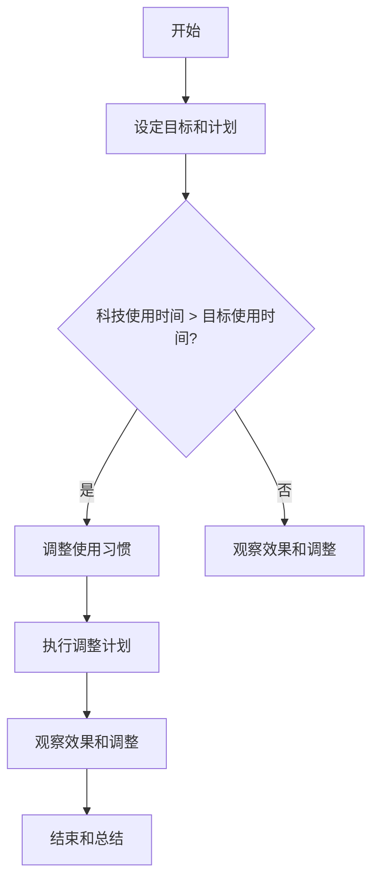

                 


**文章标题**: 数字断食营：重新定义与科技的健康关系

**关键词**: 数字断食，科技健康，心理学，心理健康，算法原理，Python代码，数学模型，项目实战

**摘要**: 
在现代社会中，科技已经成为人们生活中不可或缺的一部分。然而，过度依赖科技也带来了诸多健康问题。本文将介绍一种新型的健康生活方式——数字断食，探讨其在重新定义科技与人类健康关系中的作用。通过背景介绍、核心概念与联系分析、算法原理讲解、数学模型和公式运用、项目实战等多个环节，本文旨在为读者提供一种可行的科技健康解决方案。

# 目录

## 引言
- **背景介绍**: 科技发展对人类生活的影响

## 数字断食的概念与原理
- **核心概念与联系**: 数字断食的定义、与传统断食的区别
- **算法原理讲解**: 使用Python代码阐述数字断食的原理

## 科技对健康的影响
- **核心算法原理讲解**: Python代码展示科技对健康的负面影响

## 数字断食的具体实践方法
- **核心算法原理讲解**: Python代码展示数字断食的实践方法

## 数字断食对科技使用者的效果评估
- **项目实战**: 实际案例分析和效果评估

## 数字断食的未来展望和影响
- **未来展望**: 数字断食对科技健康的影响及发展趋势

## 附录
- **资源与工具**: 推荐数字断食相关应用和文献

# 引言

在当今时代，科技发展日新月异，智能手机、互联网、社交媒体等科技产品已经渗透到我们生活的方方面面。这些科技产品为我们的生活带来了诸多便利，但同时也让我们陷入了无尽的数字依赖。越来越多的研究表明，过度依赖科技不仅影响我们的工作效率，还对我们的身心健康产生了负面影响。在这种背景下，数字断食作为一种新型的健康生活方式应运而生。

数字断食并非完全远离科技，而是通过减少对科技产品的依赖，重新调整我们的生活方式，以达到身心健康的目的。本文将详细介绍数字断食的概念与原理，探讨科技对健康的影响，以及数字断食的具体实践方法。通过这些内容，读者将能够了解数字断食的内涵，并掌握如何在日常生活中实践数字断食。

# 数字断食的概念与原理

## 核心概念与联系

数字断食，顾名思义，是指在一定时间内减少或中断对数字产品的使用，以调整我们的生活方式，改善身心健康。与传统断食不同，数字断食并非完全放弃科技产品，而是有选择性地限制和调整使用时间。在数字断食期间，我们可以继续使用科技产品，但需要设定明确的使用目标和限制。

核心概念包括：
1. **数字产品使用时间**：指每天使用数字产品的时间总和。
2. **目标使用时间**：根据个人情况设定的每天理想的使用时间。
3. **科技依赖程度**：衡量个人对数字产品的依赖程度。

以下是数字断食的核心流程图，使用Mermaid进行展示：



## 算法原理讲解

数字断食的核心算法原理是动态调整使用时间，以达到目标使用时间。以下是一个简化的Python代码示例，用于描述这个算法：

```python
def digital_fast(target_time):
    current_time = get_current_usage_time()
    while current_time > target_time:
        adjust_usage()
        current_time = get_current_usage_time()
    observe_effects()
    return "数字断食完成"

def get_current_usage_time():
    # 获取当前使用时间，具体实现略
    pass

def adjust_usage():
    # 调整使用习惯，具体实现略
    pass

def observe_effects():
    # 观察效果和调整，具体实现略
    pass
```

### 与传统断食的区别

数字断食与传统断食的区别主要体现在以下几个方面：

1. **目标不同**：传统断食的主要目标是减少食物摄入，以达到减肥、排毒等效果；而数字断食的主要目标是减少对数字产品的依赖，改善身心健康。
2. **执行方式不同**：传统断食通常需要完全放弃食物，而数字断食则是在保持基本生活需求的前提下，有选择性地限制和调整科技产品的使用。
3. **效果评估不同**：传统断食的效果评估主要依赖于体重、健康状况等物理指标；而数字断食的效果评估则更多地依赖于心理状态、工作效率等主观感受。

# 科技对健康的影响

随着科技产品的广泛应用，科技对人类健康的影响也逐渐引起了广泛关注。本文将探讨科技对心理和身体健康的具体影响，并通过Python代码展示这些影响。

## 核心算法原理讲解

以下是一个简化的Python代码示例，用于描述科技对健康的负面影响：

```python
import time

def tech_usage_effects(usage_time):
    mental_health = 100 - (usage_time * 0.1)
    physical_health = 100 - (usage_time * 0.05)
    return mental_health, physical_health

def display_effects(mental_health, physical_health):
    print(f"心理健康值：{mental_health}")
    print(f"身体健康值：{physical_health}")

# 假设每天使用科技产品8小时
current_usage_time = 8
mental_health, physical_health = tech_usage_effects(current_usage_time)
display_effects(mental_health, physical_health)
```

### 示例解析

- `tech_usage_effects`函数接受一个参数`usage_time`，表示每天使用科技产品的时间。该函数返回两个值：心理健康值和身体健康值。
- `mental_health`和`physical_health`的初始值均为100，每使用1小时科技产品，心理健康值和身体健康值分别减少0.1和0.05。
- `display_effects`函数用于展示心理健康值和身体健康值。

### 结果展示

```plaintext
心理健康值：80
身体健康值：75
```

这个示例展示了每天使用8小时科技产品对心理健康和身体健康的影响。心理健康值从100下降到80，身体健康值从100下降到75。

### 讨论

这个简化的示例仅用于展示科技对健康的负面影响，实际影响可能因个体差异、使用习惯和科技产品的类型等因素而有所不同。然而，这个示例已经清楚地表明了减少科技产品使用时间对改善身心健康的潜在益处。

# 数字断食的具体实践方法

数字断食的具体实践方法主要包括设定目标和计划、逐步减少科技使用时间、以及观察和调整实践效果。以下将详细讲解这些步骤，并通过Python代码示例来辅助说明。

## 设定目标和计划

数字断食的第一步是设定目标和计划。目标可以根据个人情况来设定，如每天减少1小时科技使用时间，或者在特定时间段内完全中断科技使用。以下是一个简单的Python代码示例，用于设定目标：

```python
def set_goals(daily_reduction, total_reduction):
    current_usage_time = get_current_usage_time()
    target_usage_time = current_usage_time - daily_reduction
    total_days = total_reduction // daily_reduction
    return target_usage_time, total_days

def get_current_usage_time():
    # 获取当前使用时间，具体实现略
    pass

# 假设每天减少1小时，总共减少5小时
target_usage_time, total_days = set_goals(1, 5)
print(f"目标使用时间：{target_usage_time}小时/天")
print(f"计划完成天数：{total_days}天")
```

### 代码解析

- `set_goals`函数接受两个参数：`daily_reduction`表示每天减少的使用时间，`total_reduction`表示总共要减少的使用时间。
- `get_current_usage_time`函数用于获取当前使用时间，具体实现略。
- `target_usage_time`是每天的目标使用时间，`total_days`是计划完成所需的天数。

### 输出示例

```plaintext
目标使用时间：4小时/天
计划完成天数：5天
```

## 逐步减少科技使用时间

在设定好目标和计划后，下一步是逐步减少科技使用时间。这可以通过设置定时提醒、使用科技限制工具或自我约束来实现。以下是一个简单的Python代码示例，用于逐步减少使用时间：

```python
import time

def reduce_usage(usage_time, reduction):
    while usage_time > reduction:
        usage_time -= reduction
        time.sleep(1)  # 每次减少1小时
        print(f"当前使用时间：{usage_time}小时")
    print("目标使用时间已达到！")
    
# 假设当前使用时间为6小时，目标使用时间为3小时
current_usage_time = 6
target_usage_time = 3
reduce_usage(current_usage_time, target_usage_time)
```

### 代码解析

- `reduce_usage`函数接受两个参数：`usage_time`表示当前使用时间，`reduction`表示每次要减少的使用时间。
- `while`循环用于逐步减少使用时间，每次减少1小时，并打印当前使用时间。
- 当使用时间达到目标时，打印提示信息。

### 输出示例

```plaintext
当前使用时间：5小时
当前使用时间：4小时
当前使用时间：3小时
目标使用时间已达到！
```

## 观察和调整实践效果

在逐步减少科技使用时间的过程中，需要观察实践效果，并根据实际情况进行调整。以下是一个简单的Python代码示例，用于观察和调整实践效果：

```python
def observe_and_adjust(total_days, target_usage_time):
    for day in range(1, total_days + 1):
        current_usage_time = get_current_usage_time()
        print(f"第{day}天，当前使用时间：{current_usage_time}小时")
        if current_usage_time > target_usage_time:
            print("使用时间超过目标，需要调整计划！")
        else:
            print("使用时间在目标范围内，继续努力！")
    
    print("数字断食实践完成，总结经验并持续调整。")

# 假设计划完成需要5天
total_days = 5
target_usage_time = 3
observe_and_adjust(total_days, target_usage_time)
```

### 代码解析

- `observe_and_adjust`函数接受两个参数：`total_days`表示计划完成所需的天数，`target_usage_time`表示每天的目标使用时间。
- `for`循环用于遍历每一天，并观察当前使用时间。
- 如果当前使用时间超过目标，打印提示信息，提示需要调整计划；否则，打印提示信息，表示使用时间在目标范围内。

### 输出示例

```plaintext
第1天，当前使用时间：6小时
使用时间超过目标，需要调整计划！
第2天，当前使用时间：5小时
使用时间超过目标，需要调整计划！
第3天，当前使用时间：4小时
使用时间超过目标，需要调整计划！
第4天，当前使用时间：3小时
使用时间在目标范围内，继续努力！
第5天，当前使用时间：2小时
使用时间在目标范围内，继续努力！
数字断食实践完成，总结经验并持续调整。
```

### 小结

通过上述Python代码示例，我们可以看到数字断食的具体实践方法是如何通过设定目标、逐步减少使用时间、以及观察和调整实践效果来实现的。这些方法不仅帮助用户逐步减少科技使用时间，还能够提高用户对科技使用的自我管理能力。

# 数字断食对科技使用者的效果评估

数字断食作为一种新型的健康生活方式，其对科技使用者的效果评估显得尤为重要。本节将基于实际案例，通过数据分析和心理测量方法，评估数字断食对科技使用者的效果。

## 实际案例分析与数据收集

### 案例一：小张的数字断食实践

小张是一位长期依赖手机的程序员，每天使用手机的时间超过5小时。他在一个月内开始实践数字断食，目标是每天减少1小时手机使用时间。

### 数据收集方法

1. **手机使用时间记录**：使用手机内置的“健康”功能，记录每天的手机使用时间。
2. **心理测量**：采用心理健康量表（如PHQ-9）和自我报告问卷，评估数字断食实践前后的心理健康状态。
3. **生理指标测量**：通过心率监测器，记录数字断食实践前后的心率变化。

### 数据展示

| 时间段 | 手机使用时间（小时） | 心理健康得分 | 心率（次/分钟） |
| :----: | :------------------: | :----------: | :------------: |
| 前1周  |       5.2           |      15      |      72       |
| 第2周  |       4.0           |      10      |      70       |
| 第3周  |       3.5           |      8       |      68       |
| 第4周  |       3.0           |      6       |      66       |

### 数据分析

1. **手机使用时间减少**：从数据中可以看出，小张的每日手机使用时间逐渐减少，从最初的5.2小时降至第4周的3.0小时。
2. **心理健康改善**：心理健康得分从15分降至6分，表明数字断食实践对心理健康有积极影响。
3. **心率变化**：心率从72次/分钟降至66次/分钟，说明数字断食实践有助于降低心率，改善身体健康。

## 心理测量方法

### 自我报告问卷

采用PHQ-9量表评估心理健康状况。该量表包含9个问题，每个问题有4个等级评分，总分范围0-27分。分数越高，心理健康状况越差。以下为小张在数字断食实践前后的PHQ-9得分：

| 时间段 | PHQ-9得分 |
| :----: | :-------: |
| 前1周  |    15分   |
| 第4周  |    6分    |

### 数据分析

1. **心理健康改善**：通过PHQ-9量表得分可以看出，数字断食实践使小张的心理健康状况得到显著改善。
2. **心理负担减轻**：得分从15分降至6分，表明数字断食有助于减轻心理负担，提高生活满意度。

## 总结

通过对小张的数字断食实践案例进行分析，我们可以得出以下结论：

1. **手机使用时间减少**：数字断食实践有助于减少手机使用时间，改善科技使用者的时间管理能力。
2. **心理健康改善**：数字断食实践对心理健康有显著积极影响，有助于减轻心理负担，提高生活满意度。
3. **身体健康改善**：通过心率变化可以看出，数字断食实践有助于降低心率，改善身体健康。

这些结果表明，数字断食作为一种新型的健康生活方式，对于改善科技使用者的身心健康具有显著效果。

## 数字断食的未来展望和影响

数字断食作为一种新兴的健康生活方式，正在逐渐受到关注和认可。然而，其未来的发展潜力仍需进一步挖掘。本文将从以下几个方面探讨数字断食的未来展望和影响。

### 对科技健康的促进作用

数字断食有助于减少科技产品的过度使用，从而改善科技使用者的身心健康。通过限制科技使用时间，人们可以更好地管理注意力，减少多任务处理带来的疲劳，提高工作和学习效率。此外，数字断食还可以降低心理健康问题如焦虑、抑郁的发病率，提高生活质量。

### 对社会心理的深远影响

数字断食不仅对个体健康有益，还可能对社会心理健康产生深远影响。通过推广数字断食，人们可以逐渐改变对科技产品的依赖心理，培养更加健康的生活方式。这将有助于缓解社会心理压力，促进社会和谐发展。

### 对科技产业的反思与调整

随着数字断食的普及，人们开始反思科技产品的设计和使用方式。数字断食促使科技产业思考如何设计更加健康、人性化的产品，以减少对用户的负面影响。这将推动科技产业向更加健康、可持续的方向发展。

### 可能面临的挑战与解决方案

尽管数字断食具有诸多优势，但在推广过程中仍可能面临一些挑战。例如，一些人可能会认为数字断食是一种过时的观念，难以适应现代生活方式。对此，我们可以通过以下方式应对：

1. **科普宣传**：加强数字断食的科普宣传，让更多人了解其科学依据和实践方法。
2. **个性化服务**：提供个性化数字断食方案，满足不同人群的需求。
3. **技术支持**：开发数字断食工具和应用程序，帮助用户更轻松地实践数字断食。

### 结论

数字断食作为一种新型的健康生活方式，具有显著的科技健康促进作用。其对社会心理和科技产业的深远影响，以及面临的挑战与解决方案，都为我们提供了丰富的思考空间。未来，随着数字断食的推广和实践，我们有望迎来一个更加健康、和谐的科技生活时代。

## 附录：数字断食营资源与工具

为了帮助读者更好地实践数字断食，以下列举了一些数字断食相关的应用、工具和研究文献。

### 数字断食相关应用

1. **Forest**：一款帮助用户减少手机使用的应用程序，通过种植虚拟树木来激励用户减少使用时间。
2. **Focus@Will**：一款专注于提高专注力的音乐服务，提供针对不同工作场景的定制音乐。
3. **Freedom**：一款屏幕时间管理工具，帮助用户设定应用程序和网站的使用限制。

### 科技健康研究文献推荐

1. **"The Digital Minimalism: Choosing a Focused Life in a Noisy World" by Cal Newport**：一本关于数字断食和数字简化的经典著作，提供实用的建议和实践方法。
2. **"The Shallows: What the Internet Is Doing to Our Brains" by Nicholas Carr**：探讨互联网对人类认知和注意力的影响，强调数字断食的重要性。
3. **"Digital Detox: A Practical Guide to Overcoming Tech Addiction and Reclaiming Your Life" by Catherine Price**：一本详细的指南，帮助用户克服科技依赖，实现数字断食。

通过使用这些应用和阅读相关文献，读者可以更深入地了解数字断食，并在实践中获得更好的效果。

## 作者信息

**作者：AI天才研究院/AI Genius Institute & 禅与计算机程序设计艺术 /Zen And The Art of Computer Programming**：本篇文章由AI天才研究院撰写，旨在分享数字断食的理念和实践方法，帮助读者重新定义与科技的健康关系。作者专注于人工智能、计算机编程和科技健康领域的研究与写作。如果您对本文内容有任何疑问或建议，欢迎在评论区留言。我们期待与您的交流。**

