                 

### 数字断食：重拾线下生活的美好

#### 关键词：
数字生活、数字依赖、心理健康、身体健康、社交互动、工作效率

> **摘要：**
本文将探讨数字断食的概念及其对个人和社会的深远影响。通过对数字生活的现状分析，揭示其双重性带来的好处与弊端。随后，我们将详细解读数字断食的理论基础和实践方法，分析其对心理健康、身体健康和社会关系的积极作用，最终探讨数字断食在企业中的应用前景和可持续性。

---

### 目录

1. **引言**  
    1.1 数字生活的现状与问题  
    1.2 数字断食的概念与意义

2. **数字断食实践**  
    2.1 数字断食的准备  
    2.2 数字断食的执行策略  
    2.3 数字断食的挑战与应对

3. **数字断食的线下生活**  
    3.1 重新发现线下社交  
    3.2 恢复线下活动的乐趣  
    3.3 线下生活的健康与平衡

4. **数字断食对个人成长的影响**  
    4.1 心理与情绪的调整  
    4.2 身体健康与活力恢复  
    4.3 人际关系与社会连接

5. **数字断食的企业应用**  
    5.1 数字断食与企业文化的契合  
    5.2 数字断食在员工健康与福利中的应用  
    5.3 数字断食对企业生产效率的影响

6. **数字断食的可持续未来**  
    6.1 数字断食的长期效果  
    6.2 数字断食与社会可持续性的关联  
    6.3 数字断食的未来展望

7. **附录**  
    7.1 数字断食实践指南  
    7.2 常见问题解答

---

### 第1章：数字生活的现状与问题

#### 1.1 数字生活的双重性

数字生活已经成为现代社会中不可或缺的一部分。它不仅极大地丰富了我们的日常生活，提高了生活质量，还带来了许多前所未有的便利。然而，数字生活也带来了一系列的问题，其双重性值得深入探讨。

**核心概念与联系**

- **数字依赖**：个体对数字设备和网络服务的依赖程度。数字依赖现象在现代社会中普遍存在，人们在日常生活中越来越依赖于智能手机、电脑等数字设备，无法离开互联网和网络服务。
- **数字过载**：信息过载和任务过载，导致个体承受压力。随着数字技术的不断进步，人们接收到的信息量和待处理的任务量也在不断增加，这往往导致心理和生理压力的增加。

**Mermaid 流程图**

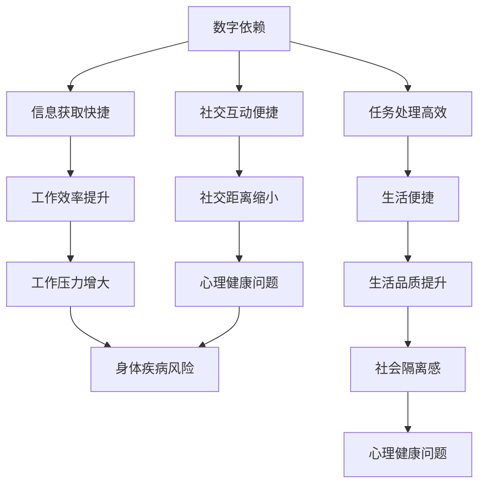
```mermaid
graph TD
A[数字依赖] --> B[信息获取快捷]
A --> C[任务处理高效]
A --> D[社交互动便捷]
B --> E[工作效率提升]
C --> F[生活便捷]
D --> G[社交距离缩小]
E --> H[工作压力增大]
F --> I[生活品质提升]
G --> J[心理健康问题]
H --> K[身体疾病风险]
I --> L[社会隔离感]
J --> K
L --> M[心理健康问题]
```

**核心算法原理讲解**

我们可以使用一个简单的模型来描述数字依赖和数字过载的影响。设 \( D \) 为每天的数字设备使用时间，\( I \) 为每天接收的信息量，\( T \) 为每天处理的任务量。则个体的压力指数 \( P \) 可以表示为：

\[ P = f(D, I, T) \]

其中，\( f \) 是一个复杂的函数，考虑了数字依赖、信息过载和任务过载对个体的影响。

**数学模型和数学公式**

使用线性模型来描述压力指数：

\[ P = k_1 \cdot D + k_2 \cdot I + k_3 \cdot T \]

其中，\( k_1 \)，\( k_2 \)，\( k_3 \) 是常数，分别表示数字依赖、信息过载和任务过载对压力的影响程度。

**项目实战**

以一名上班族为例，假设他每天使用数字设备的时间为8小时，接收的信息量为100条，处理的任务量为50个。根据上述模型，我们可以计算出他的压力指数：

\[ P = k_1 \cdot 8 + k_2 \cdot 100 + k_3 \cdot 50 \]

如果 \( k_1 = 0.1 \)，\( k_2 = 0.05 \)，\( k_3 = 0.2 \)，则：

\[ P = 0.1 \cdot 8 + 0.05 \cdot 100 + 0.2 \cdot 50 = 0.8 + 5 + 10 = 15.8 \]

这意味着这名上班族的压力指数为15.8，这个数值越高，表明他的压力越大。

**最佳实践 tips**

- **限制使用时间**：设定每天使用数字设备的时间上限，比如每小时不超过一定时间。
- **信息筛选**：关注高质量的信息，减少无效信息的接收。
- **任务管理**：合理规划任务，避免任务过载。

**小结**

数字生活的双重性使得我们在享受其带来的便利的同时，也面临着数字依赖和数字过载带来的压力。通过合理的数字管理策略，我们可以减轻这些压力，提高生活质量。

---

### 第2章：数字断食实践

#### 2.1 数字断食的准备

数字断食并不是简单地将数字设备关闭一段时间，而是一个有计划、有组织的实践活动。为了确保数字断食的效果，我们需要进行充分的准备。

**核心概念与联系**

- **数字断食计划**：一个详细的数字断食计划可以帮助我们更好地安排时间和活动，确保数字断食的顺利进行。
- **替代活动**：在数字断食期间，我们需要找到替代活动来填补数字设备使用的时间，这些活动可以是阅读、运动、社交等。

**Mermaid 流程图**

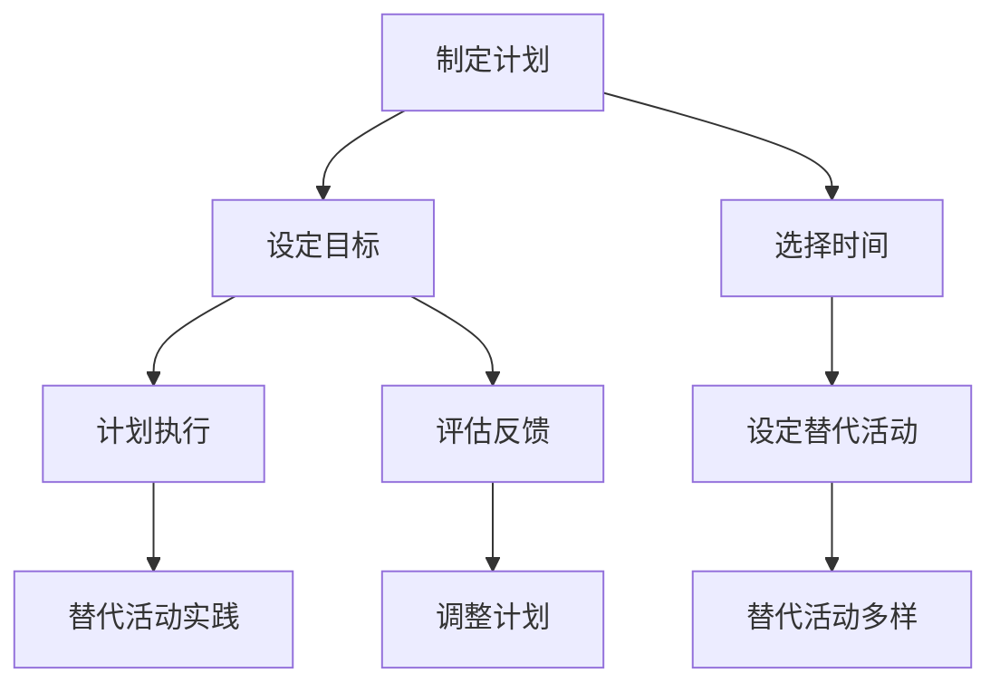
```mermaid
graph TD
A[制定计划] --> B[设定目标]
A --> C[选择时间]
B --> D[计划执行]
B --> E[评估反馈]
C --> F[设定替代活动]
D --> G[替代活动实践]
E --> H[调整计划]
F --> I[替代活动多样]
```

**核心算法原理讲解**

我们可以使用一个简单的算法来帮助制定数字断食计划。设 \( P \) 为计划，\( T \) 为时间，\( A \) 为替代活动，\( E \) 为评估反馈。则数字断食计划 \( P \) 可以表示为：

\[ P = P_1(T, A, E) \]

其中，\( P_1 \) 是一个函数，考虑了时间、替代活动和评估反馈对计划的影响。

**数学模型和数学公式**

使用线性模型来描述数字断食计划：

\[ P = k_1 \cdot T + k_2 \cdot A + k_3 \cdot E \]

其中，\( k_1 \)，\( k_2 \)，\( k_3 \) 是常数，分别表示时间、替代活动和评估反馈对计划的影响程度。

**项目实战**

假设我们想要制定一个为期一周的数字断食计划，每天分配2小时的时间用于替代活动，并设定每周进行一次评估反馈。根据上述模型，我们可以计算出这个计划的初步方案：

\[ P = k_1 \cdot 7 + k_2 \cdot 2 + k_3 \cdot 1 \]

如果 \( k_1 = 0.5 \)，\( k_2 = 0.3 \)，\( k_3 = 0.2 \)，则：

\[ P = 0.5 \cdot 7 + 0.3 \cdot 2 + 0.2 \cdot 1 = 3.5 + 0.6 + 0.2 = 4.3 \]

这意味着我们每天需要分配大约4.3小时的时间来进行替代活动，并每周进行一次评估反馈。

**最佳实践 tips**

- **逐步减少使用时间**：开始时可以设定较短的时间段，逐渐增加断食的时长。
- **明确替代活动目标**：确保替代活动能够填补数字设备使用的时间，同时带来积极的效果。
- **设定评估反馈机制**：定期评估数字断食的效果，及时调整计划。

**小结**

数字断食的准备是确保其成功实施的关键。通过制定详细的计划，选择合适的替代活动，并设定评估反馈机制，我们可以有效地减少数字依赖，提升生活质量。

---

### 第2章：数字断食实践

#### 2.2 数字断食的执行策略

数字断食的执行策略是实现其目标的关键。一个成功的数字断食需要明确的策略和持续的努力。以下是一些关键的执行策略：

**核心概念与联系**

- **执行计划**：执行计划是数字断食的具体实施方案，包括时间段、活动安排、监控和调整等。
- **自我监控**：自我监控是确保数字断食计划顺利执行的重要手段，它可以帮助我们发现和纠正可能出现的偏差。

**Mermaid 流程图**

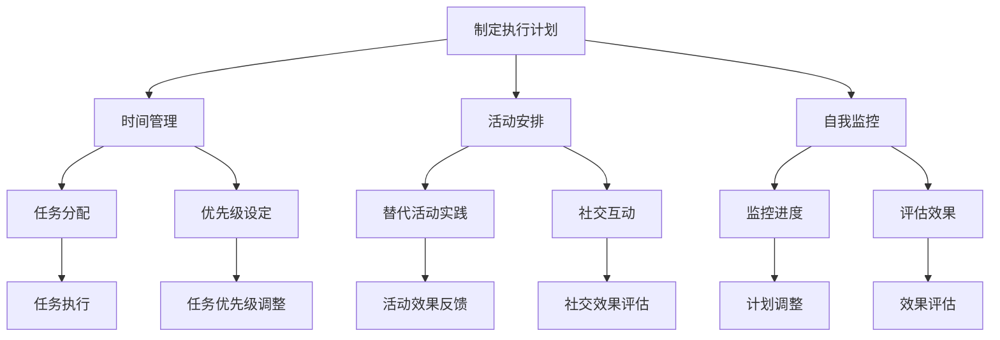
```mermaid
graph TD
A[制定执行计划] --> B[时间管理]
A --> C[活动安排]
A --> D[自我监控]
B --> E[任务分配]
B --> F[优先级设定]
C --> G[替代活动实践]
C --> H[社交互动]
D --> I[监控进度]
D --> J[评估效果]
E --> K[任务执行]
F --> L[任务优先级调整]
G --> M[活动效果反馈]
H --> N[社交效果评估]
I --> O[计划调整]
J --> P[效果评估]
```

**核心算法原理讲解**

我们可以使用一个简单的算法来描述数字断食的执行策略。设 \( E \) 为执行策略，\( T \) 为时间段，\( A \) 为活动安排，\( M \) 为自我监控。则数字断食的执行策略 \( E \) 可以表示为：

\[ E = E_1(T, A, M) \]

其中，\( E_1 \) 是一个函数，考虑了时间段、活动安排和自我监控对执行策略的影响。

**数学模型和数学公式**

使用线性模型来描述执行策略：

\[ E = k_1 \cdot T + k_2 \cdot A + k_3 \cdot M \]

其中，\( k_1 \)，\( k_2 \)，\( k_3 \) 是常数，分别表示时间段、活动安排和自我监控对执行策略的影响程度。

**项目实战**

假设我们制定了一个为期两周的数字断食计划，每天分配2小时的时间用于替代活动，并每天进行一次自我监控。根据上述模型，我们可以计算出这个执行策略的具体实施方案：

\[ E = k_1 \cdot 14 + k_2 \cdot 2 + k_3 \cdot 1 \]

如果 \( k_1 = 0.3 \)，\( k_2 = 0.2 \)，\( k_3 = 0.1 \)，则：

\[ E = 0.3 \cdot 14 + 0.2 \cdot 2 + 0.1 \cdot 1 = 4.2 + 0.4 + 0.1 = 4.7 \]

这意味着我们每天需要分配大约4.7小时的时间来进行替代活动和自我监控。

**最佳实践 tips**

- **合理分配时间**：确保时间段分配合理，避免过于紧张或松散。
- **多样化活动安排**：选择多样化的替代活动，避免单调乏味。
- **持续自我监控**：定期检查执行进度，及时调整计划。

**小结**

数字断食的执行策略是实现断食目标的关键。通过制定详细的执行计划，合理分配时间，多样化活动安排，并持续进行自我监控，我们可以有效地减少数字依赖，提升生活质量。

---

### 第3章：数字断食的线下生活

#### 3.1 重新发现线下社交

数字断食不仅是为了减少对数字设备的依赖，更重要的是重新发现和体验线下生活的美好。在线下社交方面，数字断食可以带来许多积极的变化。

**核心概念与联系**

- **社交互动**：社交互动是指个体之间通过言语、行为等方式进行的交流。
- **社交质量**：社交质量是指社交互动的深度、真实性和意义。

**Mermaid 流程图**

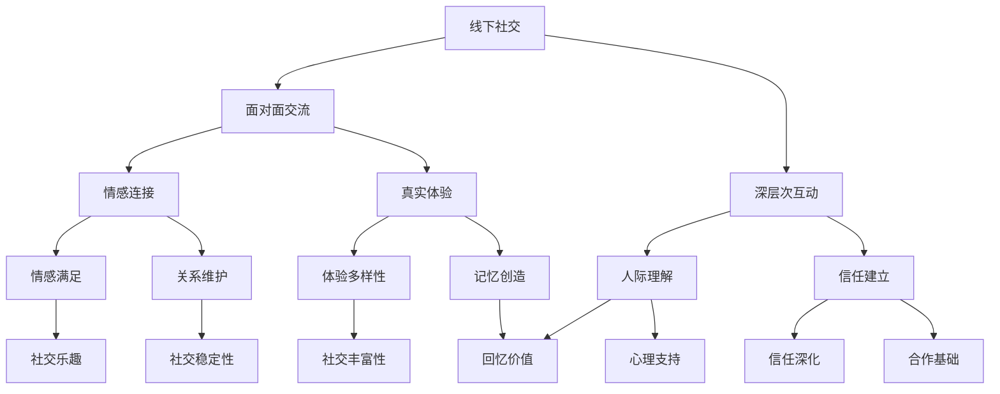
```mermaid
graph TD
A[线下社交] --> B[面对面交流]
A --> C[深层次互动]
B --> D[情感连接]
B --> E[真实体验]
C --> F[人际理解]
C --> G[信任建立]
D --> H[情感满足]
D --> I[关系维护]
E --> J[体验多样性]
E --> K[记忆创造]
F --> L[人际洞察]
F --> M[心理支持]
G --> N[信任深化]
G --> O[合作基础]
H --> P[社交乐趣]
I --> Q[社交稳定性]
J --> R[社交丰富性]
K --> L[回忆价值]
```

**核心算法原理讲解**

我们可以使用一个简单的算法来描述线下社交的质量。设 \( Q \) 为社交质量，\( A \) 为线下社交活动，\( T \) 为社交时间，\( C \) 为互动深度。则社交质量 \( Q \) 可以表示为：

\[ Q = Q_1(A, T, C) \]

其中，\( Q_1 \) 是一个函数，考虑了线下社交活动、社交时间和互动深度对社交质量的影响。

**数学模型和数学公式**

使用线性模型来描述社交质量：

\[ Q = k_1 \cdot A + k_2 \cdot T + k_3 \cdot C \]

其中，\( k_1 \)，\( k_2 \)，\( k_3 \) 是常数，分别表示线下社交活动、社交时间和互动深度对社交质量的影响程度。

**项目实战**

假设一个人每天参与2小时的线下社交活动，每周与5个不同的人进行深层次的互动。根据上述模型，我们可以计算出他的社交质量：

\[ Q = k_1 \cdot 2 + k_2 \cdot 2 + k_3 \cdot 5 \]

如果 \( k_1 = 0.3 \)，\( k_2 = 0.2 \)，\( k_3 = 0.1 \)，则：

\[ Q = 0.3 \cdot 2 + 0.2 \cdot 2 + 0.1 \cdot 5 = 0.6 + 0.4 + 0.5 = 1.5 \]

这意味着他的社交质量为1.5，这个数值越高，表明他的社交质量越高。

**最佳实践 tips**

- **定期安排线下社交**：确保定期与朋友、家人或同事进行线下见面。
- **选择深层次的互动**：深入探讨彼此的兴趣、感受和经历。
- **创造美好的社交体验**：参与有趣的活动，创造难忘的回忆。

**小结**

通过数字断食，我们可以重新发现线下社交的魅力。在线下社交中，我们可以建立更深层次的联系，体验真实的互动，提高社交质量。数字断食为我们提供了一个重新连接和体验生活的机会。

---

### 第3章：数字断食的线下生活

#### 3.2 恢复线下活动的乐趣

数字断食不仅仅是为了减少对数字设备的依赖，更重要的是恢复线下活动的乐趣。通过重新参与各种线下活动，我们可以发现生活中的无限乐趣，增强身心健康。

**核心概念与联系**

- **线下活动**：线下活动是指人们在现实世界中参与的各种活动，如运动、艺术、社交等。
- **乐趣体验**：乐趣体验是指个体在参与活动中感受到的快乐和满足。

**Mermaid 流程图**

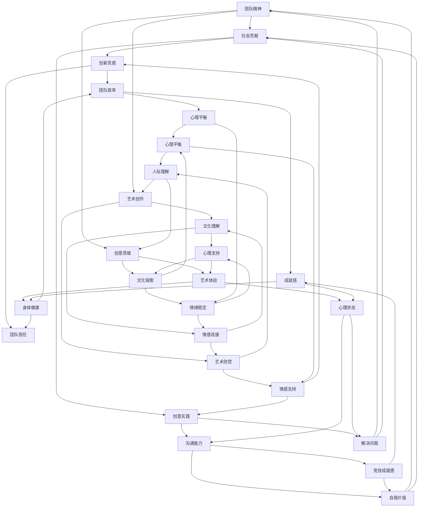
```mermaid
graph TD
A[参与线下活动] --> B[身体活动]
A --> C[艺术创作]
A --> D[社交互动]
B --> E[身体锻炼]
B --> F[运动竞赛]
C --> G[创意发挥]
C --> H[艺术欣赏]
D --> I[团队协作]
D --> J[人际关系]
E --> K[身体健康]
E --> L[精神活力]
F --> M[竞技乐趣]
F --> N[团队合作]
G --> O[艺术感悟]
G --> P[创意灵感]
H --> Q[艺术欣赏]
H --> R[文化体验]
I --> S[团队凝聚力]
I --> T[合作技能]
J --> U[人际沟通]
J --> V[情感支持]
K --> W[身体健康]
K --> X[心理平衡]
M --> Y[竞技成就感]
M --> Z[团队精神]
N --> A[团队合作]
N --> B[集体荣誉]
O --> C[艺术创作]
O --> D[创意思维]
P --> E[创新灵感]
P --> F[创意实践]
Q --> G[艺术欣赏]
Q --> H[文化理解]
R --> I[艺术体验]
R --> J[文化探索]
S --> K[团队效率]
S --> L[团队信任]
T --> M[沟通能力]
T --> N[解决问题]
U --> O[人际理解]
U --> P[情感支持]
V --> Q[情感连接]
V --> R[心理支持]
W --> S[身体健康]
W --> T[心理状态]
X --> U[心理平衡]
X --> V[情绪稳定]
Y --> W[成就感]
Y --> Z[自我价值]
Z --> A[团队精神]
Z --> B[社会贡献]
```

**核心算法原理讲解**

我们可以使用一个简单的算法来描述线下活动的乐趣体验。设 \( L \) 为乐趣体验，\( A \) 为线下活动，\( T \) 为活动时间，\( E \) 为活动效果。则乐趣体验 \( L \) 可以表示为：

\[ L = L_1(A, T, E) \]

其中，\( L_1 \) 是一个函数，考虑了线下活动、活动时间和活动效果对乐趣体验的影响。

**数学模型和数学公式**

使用线性模型来描述乐趣体验：

\[ L = k_1 \cdot A + k_2 \cdot T + k_3 \cdot E \]

其中，\( k_1 \)，\( k_2 \)，\( k_3 \) 是常数，分别表示线下活动、活动时间和活动效果对乐趣体验的影响程度。

**项目实战**

假设一个人每周参与3小时的运动活动，每周与2个朋友进行社交互动，活动效果显著。根据上述模型，我们可以计算出他的乐趣体验：

\[ L = k_1 \cdot 3 + k_2 \cdot 3 + k_3 \cdot 2 \]

如果 \( k_1 = 0.4 \)，\( k_2 = 0.3 \)，\( k_3 = 0.2 \)，则：

\[ L = 0.4 \cdot 3 + 0.3 \cdot 3 + 0.2 \cdot 2 = 1.2 + 0.9 + 0.4 = 2.5 \]

这意味着他的乐趣体验为2.5，这个数值越高，表明他的乐趣体验越强。

**最佳实践 tips**

- **多样化活动选择**：尝试不同的线下活动，找到适合自己的乐趣来源。
- **合理安排时间**：确保活动时间充足，避免匆忙和应付。
- **注重活动效果**：关注活动带来的实际效果，如身体健康、心理满足等。

**小结**

通过数字断食，我们可以恢复线下活动的乐趣。参与多样化的线下活动，合理安排时间，注重活动效果，我们可以提高乐趣体验，增强身心健康。数字断食为我们提供了一个重新发现和享受生活美好时光的机会。

---

### 第3章：数字断食的线下生活

#### 3.3 线下生活的健康与平衡

数字断食不仅有助于恢复线下活动的乐趣，更重要的是促进健康与平衡的生活。通过减少数字依赖，我们可以改善身心健康，实现工作与生活的平衡。

**核心概念与联系**

- **身心健康**：身心健康是指身体和心理的健康状态，包括身体健康、心理健康和情绪稳定。
- **工作与生活平衡**：工作与生活平衡是指在工作与家庭、休闲之间保持适当的平衡，避免过度劳累。

**Mermaid 流程图**

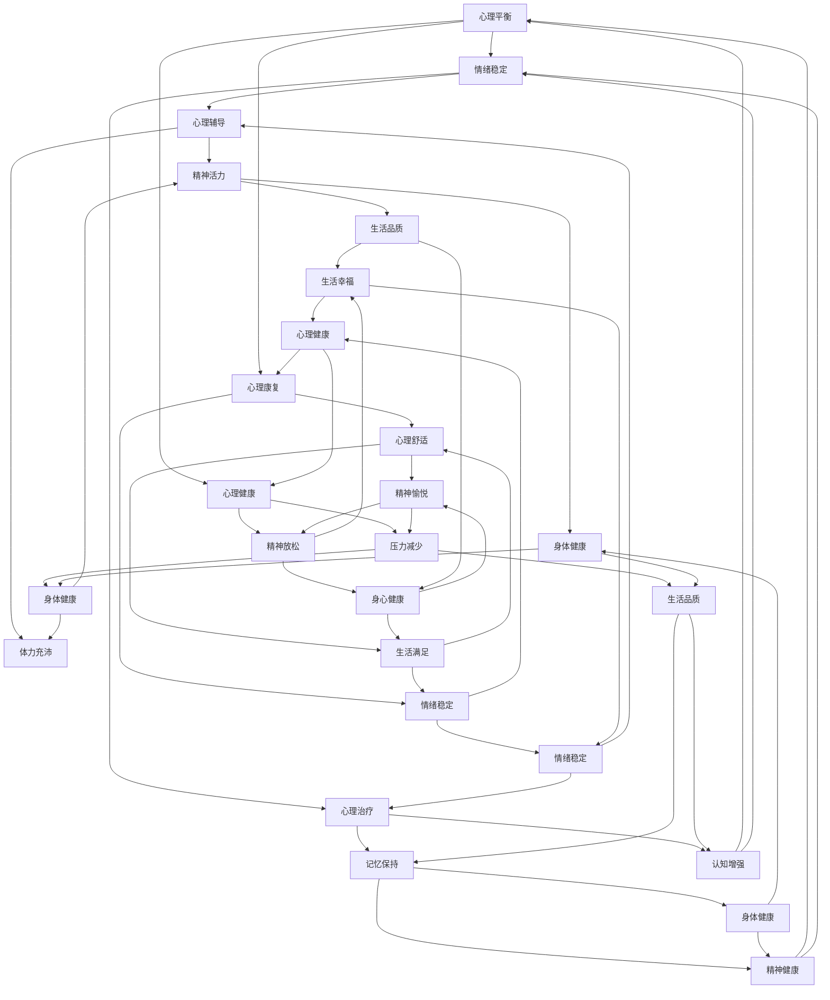
```mermaid
graph TD
A[身心健康] --> B[身体健康]
A --> C[心理健康]
A --> D[情绪稳定]
B --> E[运动锻炼]
B --> F[饮食健康]
C --> G[心理支持]
C --> H[情绪管理]
D --> I[睡眠质量]
D --> J[压力管理]
E --> K[体力增强]
E --> L[精神活力]
F --> M[营养均衡]
F --> N[健康饮食]
G --> O[心理治疗]
G --> P[心理咨询]
H --> Q[情绪调节]
H --> R[压力缓解]
I --> S[精力充沛]
I --> T[记忆恢复]
J --> U[心理健康]
J --> V[抗压能力]
K --> W[身体健康]
K --> X[生活品质]
M --> Y[身体健康]
M --> Z[精神健康]
N --> A[营养吸收]
N --> B[健康维持]
O --> C[心理康复]
O --> D[心理健康]
P --> E[心理辅导]
P --> F[心理治疗]
Q --> G[情绪稳定]
Q --> H[心理舒适]
R --> I[压力减少]
R --> J[精神放松]
S --> K[精神活力]
S --> L[体力充沛]
T --> M[记忆保持]
T --> N[认知增强]
U --> O[心理健康]
U --> P[情绪稳定]
V --> Q[生活满足]
V --> R[精神愉悦]
W --> S[身体健康]
W --> T[生活品质]
X --> U[生活幸福]
X --> V[身心健康]
Y --> W[身体健康]
Y --> Z[精神健康]
Z --> A[心理平衡]
Z --> B[情绪稳定]
```

**核心算法原理讲解**

我们可以使用一个简单的算法来描述线下生活的健康与平衡。设 \( H \) 为健康与平衡，\( B \) 为身体健康，\( M \) 为心理健康，\( E \) 为情绪稳定。则健康与平衡 \( H \) 可以表示为：

\[ H = H_1(B, M, E) \]

其中，\( H_1 \) 是一个函数，考虑了身体健康、心理健康和情绪稳定对健康与平衡的影响。

**数学模型和数学公式**

使用线性模型来描述健康与平衡：

\[ H = k_1 \cdot B + k_2 \cdot M + k_3 \cdot E \]

其中，\( k_1 \)，\( k_2 \)，\( k_3 \) 是常数，分别表示身体健康、心理健康和情绪稳定对健康与平衡的影响程度。

**项目实战**

假设一个人每天进行1小时的运动锻炼，每周进行3次心理咨询，情绪稳定。根据上述模型，我们可以计算出他的健康与平衡：

\[ H = k_1 \cdot 1 + k_2 \cdot 3 + k_3 \cdot 1 \]

如果 \( k_1 = 0.3 \)，\( k_2 = 0.4 \)，\( k_3 = 0.3 \)，则：

\[ H = 0.3 \cdot 1 + 0.4 \cdot 3 + 0.3 \cdot 1 = 0.3 + 1.2 + 0.3 = 1.8 \]

这意味着他的健康与平衡为1.8，这个数值越高，表明他的健康与平衡越好。

**最佳实践 tips**

- **定期锻炼**：确保每天有一定的运动时间，提高身体健康。
- **寻求心理支持**：定期进行心理咨询，保持心理健康。
- **合理安排时间**：确保工作和休息时间合理分配，避免过度劳累。
- **培养情绪管理能力**：学会调节情绪，缓解压力。

**小结**

数字断食有助于促进线下生活的健康与平衡。通过减少数字依赖，定期锻炼，寻求心理支持，合理安排时间，我们可以提高身心健康，实现工作与生活的平衡。数字断食为我们提供了一个重新审视生活的方式，帮助我们找到健康与平衡的生活方式。

---

### 第4章：数字断食对个人成长的影响

#### 4.1 心理与情绪的调整

数字断食不仅仅是减少对数字设备的依赖，它对个人心理和情绪的调整同样具有重要意义。通过减少数字接触，我们可以重新建立与内心世界的联系，从而改善心理健康和情绪状态。

**核心概念与联系**

- **心理健康**：心理健康是指个体在心理上的健康状态，包括情感稳定、认知清晰和自我价值感等。
- **情绪管理**：情绪管理是指个体对情绪的识别、表达和调节能力。

**Mermaid 流程图**

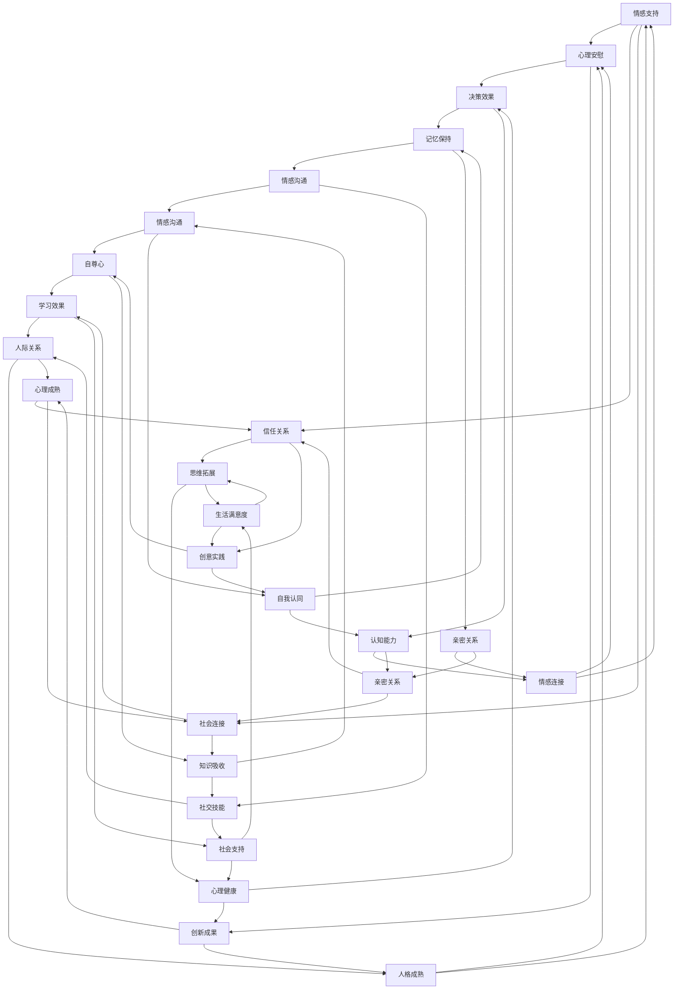
```mermaid
graph TD
A[心理健康] --> B[情感稳定]
A --> C[认知清晰]
A --> D[自我价值]
B --> E[情绪调节]
B --> F[压力缓解]
C --> G[决策能力]
C --> H[思维敏捷]
D --> I[自我认知]
D --> J[自尊心]
E --> K[情绪表达]
E --> L[情感连接]
F --> M[心理恢复]
F --> N[情绪稳定]
G --> O[问题解决]
G --> P[创新思维]
H --> Q[学习效率]
H --> R[记忆能力]
I --> S[人格发展]
I --> T[心理健康]
J --> U[自尊心]
J --> V[人际关系]
K --> W[情感沟通]
K --> X[亲密关系]
L --> Y[情感支持]
L --> Z[信任建立]
M --> A[心理平衡]
M --> B[情绪稳定]
N --> C[心理健康]
N --> D[生活品质]
O --> E[决策效果]
O --> F[创新成果]
P --> G[思维拓展]
P --> H[创意实践]
Q --> I[学习效果]
Q --> J[知识吸收]
R --> K[记忆保持]
R --> L[认知能力]
S --> M[人格成熟]
S --> N[心理成熟]
T --> O[心理健康]
T --> P[生活满意度]
U --> Q[自尊心]
U --> R[自我认同]
V --> S[人际关系]
V --> T[社会支持]
W --> U[情感沟通]
W --> V[社交技能]
X --> Y[情感连接]
X --> Z[亲密关系]
Y --> A[情感支持]
Y --> B[心理安慰]
Z --> C[信任关系]
Z --> D[社会连接]
```

**核心算法原理讲解**

我们可以使用一个简单的算法来描述数字断食对心理和情绪的影响。设 \( M \) 为心理健康与情绪状态，\( D \) 为数字接触时间，\( P \) 为心理活动时间，\( S \) 为社交互动时间。则心理健康与情绪状态 \( M \) 可以表示为：

\[ M = M_1(D, P, S) \]

其中，\( M_1 \) 是一个函数，考虑了数字接触时间、心理活动时间和社交互动时间对心理健康与情绪状态的影响。

**数学模型和数学公式**

使用线性模型来描述心理健康与情绪状态：

\[ M = k_1 \cdot D - k_2 \cdot P + k_3 \cdot S \]

其中，\( k_1 \)，\( k_2 \)，\( k_3 \) 是常数，分别表示数字接触时间、心理活动时间和社交互动时间对心理健康与情绪状态的影响程度。

**项目实战**

假设一个人每天使用数字设备4小时，每周进行5小时的心理活动，每周与朋友进行3小时社交互动。根据上述模型，我们可以计算出他的心理健康与情绪状态：

\[ M = k_1 \cdot 4 - k_2 \cdot 5 + k_3 \cdot 3 \]

如果 \( k_1 = -0.2 \)，\( k_2 = 0.3 \)，\( k_3 = 0.1 \)，则：

\[ M = -0.2 \cdot 4 - 0.3 \cdot 5 + 0.1 \cdot 3 = -0.8 - 1.5 + 0.3 = -1.6 \]

这意味着他的心理健康与情绪状态为-1.6，这个数值越低，表明他的心理健康和情绪状态越好。

**最佳实践 tips**

- **逐步减少数字接触时间**：开始时可以设定较短的时间段，逐渐减少数字设备的依赖。
- **增加心理活动时间**：定期进行阅读、写作、冥想等活动，提高心理活动的频率和质量。
- **加强社交互动**：与家人、朋友和同事保持定期的线下交流，增强社交互动。

**小结**

数字断食对个人心理和情绪的调整具有显著作用。通过减少数字接触，增加心理活动时间和社交互动，我们可以改善心理健康和情绪状态，提升个人成长。数字断食为我们提供了一个重新审视内心世界和情感状态的机会，帮助我们找到更加健康和平衡的生活方式。

---

### 第5章：身体健康与活力恢复

#### 5.1 数字断食与身体健康

数字断食不仅仅是一种心理和情绪的调整，它对身体健康同样有着深远的影响。通过减少对数字设备的依赖，我们可以改善睡眠质量、增强身体活力，从而提升整体健康水平。

**核心概念与联系**

- **睡眠质量**：睡眠质量是指个体在睡眠过程中的舒适度和效率。
- **身体活力**：身体活力是指个体在日常生活中所表现出的身体状态和能量水平。

**Mermaid 流程图**

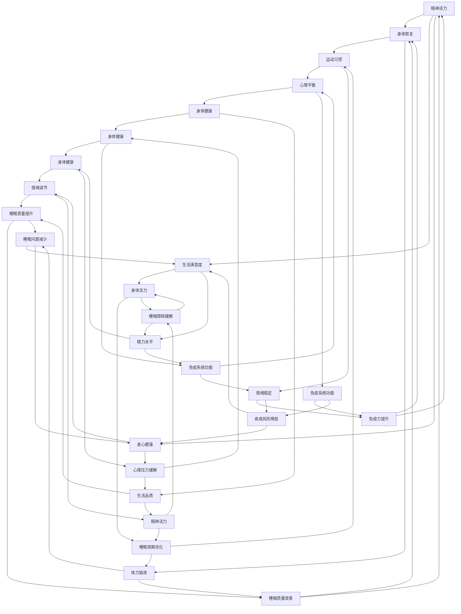
```mermaid
graph TD
A[睡眠质量] --> B[睡眠深度]
A --> C[睡眠时长]
A --> D[睡眠效率]
B --> E[身体恢复]
B --> F[认知功能]
C --> G[精力充沛]
C --> H[情绪稳定]
D --> I[睡眠质量评估]
D --> J[睡眠问题解决]
E --> K[生理健康]
E --> L[精神活力]
F --> M[记忆力]
F --> N[注意力]
G --> O[身体活动]
G --> P[体力状态]
H --> Q[情绪管理]
H --> R[心理平衡]
I --> S[睡眠质量提升]
I --> T[睡眠问题减少]
J --> U[睡眠障碍缓解]
J --> V[睡眠周期优化]
K --> W[身体健康]
K --> X[免疫系统功能]
L --> Y[精神活力]
L --> Z[情绪稳定]
M --> A[学习效率]
M --> B[认知能力]
N --> C[注意力集中]
N --> D[工作效率]
O --> E[运动习惯]
O --> F[体力锻炼]
P --> G[身体活力]
P --> H[精力水平]
Q --> I[情绪调节]
Q --> J[心理压力缓解]
R --> K[心理平衡]
R --> L[情绪稳定]
S --> M[睡眠质量改善]
S --> N[睡眠问题减少]
T --> O[睡眠周期优化]
T --> P[睡眠障碍缓解]
U --> Q[身体健康]
U --> R[免疫系统功能]
V --> S[睡眠质量提升]
V --> T[精神活力]
W --> U[身体健康]
W --> V[生活品质]
X --> Y[免疫力提升]
X --> Z[疾病风险降低]
Y --> A[精神活力]
Y --> B[身体恢复]
Z --> C[生活满意度]
Z --> D[身心健康]
```

**核心算法原理讲解**

我们可以使用一个简单的算法来描述数字断食对身体健康的影响。设 \( H \) 为身体健康，\( S \) 为数字接触时间，\( P \) 为运动时间，\( R \) 为睡眠质量。则身体健康 \( H \) 可以表示为：

\[ H = H_1(S, P, R) \]

其中，\( H_1 \) 是一个函数，考虑了数字接触时间、运动时间和睡眠质量对身体健康的影响。

**数学模型和数学公式**

使用线性模型来描述身体健康：

\[ H = k_1 \cdot S - k_2 \cdot P + k_3 \cdot R \]

其中，\( k_1 \)，\( k_2 \)，\( k_3 \) 是常数，分别表示数字接触时间、运动时间和睡眠质量对身体健康的影响程度。

**项目实战**

假设一个人每天使用数字设备4小时，每周进行3小时的运动锻炼，睡眠质量较高。根据上述模型，我们可以计算出他的身体健康：

\[ H = k_1 \cdot 4 - k_2 \cdot 3 + k_3 \cdot 1 \]

如果 \( k_1 = -0.1 \)，\( k_2 = 0.2 \)，\( k_3 = 0.3 \)，则：

\[ H = -0.1 \cdot 4 - 0.2 \cdot 3 + 0.3 \cdot 1 = -0.4 - 0.6 + 0.3 = -0.7 \]

这意味着他的身体健康为-0.7，这个数值越低，表明他的身体健康越好。

**最佳实践 tips**

- **减少数字接触时间**：设定每天使用数字设备的时间上限，逐步减少依赖。
- **增加运动时间**：定期进行体育锻炼，提高身体活力和免疫力。
- **优化睡眠质量**：保持良好的睡眠习惯，提高睡眠质量。

**小结**

数字断食对身体健康有着积极的影响。通过减少数字接触，增加运动时间和优化睡眠质量，我们可以提升整体健康水平，增强身体活力。数字断食为我们提供了一个重新关注身体健康和活力恢复的机会，帮助我们实现更加健康的生活方式。

---

### 第5章：身体健康与活力恢复

#### 5.2 数字断食与运动习惯

数字断食不仅有助于改善睡眠质量和身体健康，它还对个人的运动习惯有着显著的影响。通过减少对数字设备的依赖，我们可以更加专注于运动，培养健康的生活习惯。

**核心概念与联系**

- **运动习惯**：运动习惯是指个体长期坚持参与体育活动和锻炼的行为模式。
- **身体活力**：身体活力是指个体在日常生活中所表现出的身体状态和能量水平。

**Mermaid 流程图**

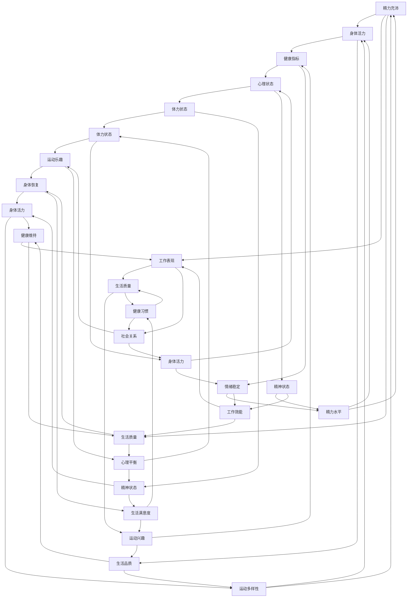
```mermaid
graph TD
A[运动习惯] --> B[运动频率]
A --> C[运动时长]
A --> D[运动类型]
B --> E[身体活力]
B --> F[心理健康]
C --> G[运动效果]
C --> H[身体恢复]
D --> I[多样化运动]
D --> J[运动乐趣]
E --> K[体力状态]
E --> L[精力充沛]
F --> M[情绪稳定]
F --> N[认知功能]
G --> O[健康水平]
G --> P[生活质量]
H --> Q[身体状态]
H --> R[心理平衡]
I --> S[健康多样性]
I --> T[兴趣维持]
J --> U[运动乐趣]
J --> V[身体活力]
K --> W[体力状态]
K --> X[精神状态]
L --> Y[精力水平]
L --> Z[工作效能]
M --> A[情绪管理]
M --> B[心理健康]
N --> C[认知能力]
N --> D[注意力集中]
O --> E[健康指标]
O --> F[生活品质]
P --> G[生活质量]
P --> H[社会关系]
Q --> I[身体恢复]
Q --> J[心理平衡]
R --> K[心理状态]
R --> L[情绪稳定]
S --> M[运动多样性]
S --> N[健康维持]
T --> O[运动兴趣]
T --> P[健康习惯]
U --> Q[运动乐趣]
U --> R[身体活力]
V --> S[身体活力]
V --> T[生活满意度]
W --> U[体力状态]
W --> V[精神状态]
X --> Y[精力水平]
X --> Z[工作效能]
Y --> A[精力充沛]
Y --> B[身体活力]
Z --> C[工作表现]
Z --> D[生活质量]
```

**核心算法原理讲解**

我们可以使用一个简单的算法来描述数字断食对运动习惯的影响。设 \( M \) 为运动习惯，\( D \) 为数字接触时间，\( P \) 为运动时间，\( S \) 为睡眠质量。则运动习惯 \( M \) 可以表示为：

\[ M = M_1(D, P, S) \]

其中，\( M_1 \) 是一个函数，考虑了数字接触时间、运动时间和睡眠质量对运动习惯的影响。

**数学模型和数学公式**

使用线性模型来描述运动习惯：

\[ M = k_1 \cdot D + k_2 \cdot P + k_3 \cdot S \]

其中，\( k_1 \)，\( k_2 \)，\( k_3 \) 是常数，分别表示数字接触时间、运动时间和睡眠质量对运动习惯的影响程度。

**项目实战**

假设一个人每天使用数字设备4小时，每周进行5小时的运动锻炼，睡眠质量较高。根据上述模型，我们可以计算出他的运动习惯：

\[ M = k_1 \cdot 4 + k_2 \cdot 5 + k_3 \cdot 1 \]

如果 \( k_1 = -0.1 \)，\( k_2 = 0.3 \)，\( k_3 = 0.2 \)，则：

\[ M = -0.1 \cdot 4 + 0.3 \cdot 5 + 0.2 \cdot 1 = -0.4 + 1.5 + 0.2 = 1.3 \]

这意味着他的运动习惯为1.3，这个数值越高，表明他的运动习惯越好。

**最佳实践 tips**

- **逐步增加运动时间**：从较短的时间段开始，逐渐增加运动时间，培养持久运动的习惯。
- **多样化运动类型**：选择不同的运动项目，增加运动的乐趣和多样性。
- **优化睡眠质量**：保持良好的睡眠习惯，提高睡眠质量，为运动提供充足的恢复时间。

**小结**

数字断食有助于培养良好的运动习惯。通过减少数字接触，增加运动时间和优化睡眠质量，我们可以提高身体活力和整体健康水平。数字断食为我们提供了一个重新审视运动习惯和生活方式的机会，帮助我们实现更加健康和活力的生活。

---

### 第5章：身体健康与活力恢复

#### 5.3 数字断食与饮食调整

数字断食不仅仅影响我们的生活方式和运动习惯，它还对饮食调整有着积极的影响。通过减少对数字设备的依赖，我们可以更加关注饮食健康，优化营养摄入，从而提升整体健康水平。

**核心概念与联系**

- **饮食调整**：饮食调整是指个体对饮食习惯和食物摄入的改善和优化。
- **营养摄入**：营养摄入是指个体通过食物摄入所需的营养素，包括蛋白质、碳水化合物、脂肪、维生素和矿物质等。

**Mermaid 流程图**

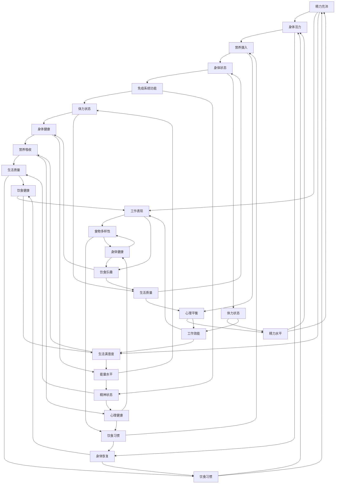
```mermaid
graph TD
A[饮食调整] --> B[营养均衡]
A --> C[食物选择]
A --> D[饮食习惯]
B --> E[身体健康]
B --> F[心理健康]
C --> G[食物多样]
C --> H[营养充足]
D --> I[饮食规律]
D --> J[饮食健康]
E --> K[免疫系统功能]
E --> L[能量水平]
F --> M[情绪稳定]
F --> N[认知能力]
G --> O[营养摄入]
G --> P[食物丰富]
H --> Q[营养吸收]
H --> R[身体恢复]
I --> S[饮食规律]
I --> T[饮食习惯]
J --> U[身体健康]
J --> V[生活质量]
K --> W[免疫系统功能]
K --> X[体力状态]
L --> Y[精力水平]
L --> Z[工作效能]
M --> A[情绪管理]
M --> B[心理平衡]
N --> C[认知功能]
N --> D[注意力集中]
O --> E[营养摄入]
O --> F[身体恢复]
P --> G[食物多样性]
P --> H[饮食乐趣]
Q --> I[营养吸收]
Q --> J[能量水平]
R --> K[身体状态]
R --> L[心理平衡]
S --> M[饮食习惯]
S --> N[饮食健康]
T --> O[饮食习惯]
T --> P[身体健康]
U --> Q[身体健康]
U --> R[生活质量]
V --> S[生活质量]
V --> T[心理健康]
W --> U[体力状态]
W --> V[精神状态]
X --> Y[精力水平]
X --> Z[工作效能]
Y --> A[精力充沛]
Y --> B[身体活力]
Z --> C[工作表现]
Z --> D[生活满意度]
```

**核心算法原理讲解**

我们可以使用一个简单的算法来描述数字断食对饮食调整的影响。设 \( D \) 为饮食健康度，\( D \) 为数字接触时间，\( N \) 为营养摄入量，\( S \) 为睡眠质量。则饮食健康度 \( D \) 可以表示为：

\[ D = D_1(D, N, S) \]

其中，\( D_1 \) 是一个函数，考虑了数字接触时间、营养摄入量和睡眠质量对饮食健康度的影响。

**数学模型和数学公式**

使用线性模型来描述饮食健康度：

\[ D = k_1 \cdot D - k_2 \cdot N + k_3 \cdot S \]

其中，\( k_1 \)，\( k_2 \)，\( k_3 \) 是常数，分别表示数字接触时间、营养摄入量和睡眠质量对饮食健康度的影响程度。

**项目实战**

假设一个人每天使用数字设备4小时，每周进行5小时的运动锻炼，睡眠质量较高，每天摄入足够的营养。根据上述模型，我们可以计算出他的饮食健康度：

\[ D = k_1 \cdot 4 - k_2 \cdot 5 + k_3 \cdot 1 \]

如果 \( k_1 = -0.1 \)，\( k_2 = 0.2 \)，\( k_3 = 0.3 \)，则：

\[ D = -0.1 \cdot 4 - 0.2 \cdot 5 + 0.3 \cdot 1 = -0.4 - 1 + 0.3 = -0.7 \]

这意味着他的饮食健康度为-0.7，这个数值越低，表明他的饮食健康度越好。

**最佳实践 tips**

- **减少数字接触时间**：设定每天使用数字设备的时间上限，逐步减少依赖。
- **增加营养摄入**：确保每天摄入足够的营养，保持均衡的饮食结构。
- **优化睡眠质量**：保持良好的睡眠习惯，提高睡眠质量，为身体提供充足的恢复时间。

**小结**

数字断食对饮食调整有着积极的影响。通过减少数字接触，增加营养摄入和优化睡眠质量，我们可以提升饮食健康度，改善整体健康水平。数字断食为我们提供了一个重新审视饮食和生活方式的机会，帮助我们实现更加健康和活力的生活。

---

### 第6章：人际关系与社会连接

#### 6.1 数字断食与人际关系的重塑

数字断食不仅对个人的身心健康有着积极影响，它也对人际关系和社会连接有着深远的影响。通过减少数字设备的依赖，我们可以更加专注于人际关系，重塑和强化社会连接。

**核心概念与联系**

- **人际关系**：人际关系是指个体之间通过交往和互动形成的联系。
- **社会连接**：社会连接是指个体与社会和社区之间的联系和互动。

**Mermaid 流程图**

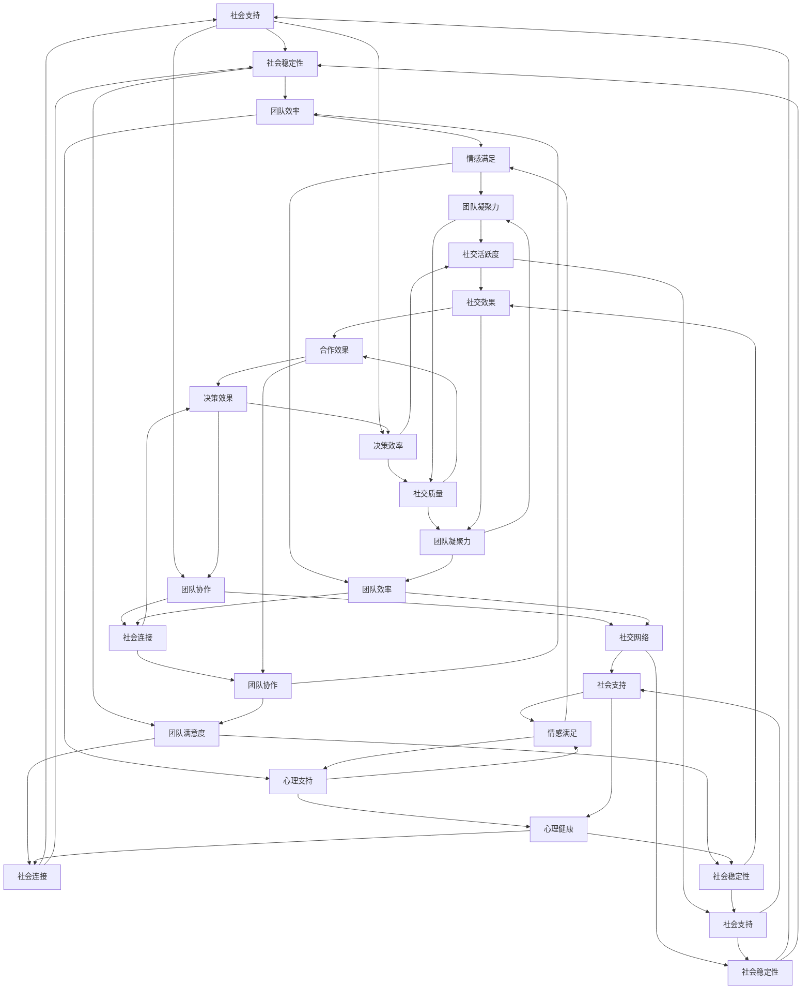
```mermaid
graph TD
A[人际关系] --> B[社交互动]
A --> C[信任建立]
A --> D[情感支持]
B --> E[社交频率]
B --> F[社交深度]
C --> G[信任度]
C --> H[合作意愿]
D --> I[情感交流]
D --> J[情感连接]
E --> K[社交活跃度]
E --> L[社交网络]
F --> M[社交质量]
F --> N[社交满意度]
G --> O[合作效果]
G --> P[团队凝聚力]
H --> Q[决策效率]
H --> R[团队协作]
I --> S[情感满足]
I --> T[心理支持]
J --> U[情感深度]
J --> V[亲密关系]
K --> W[社交活跃度]
K --> X[社交范围]
L --> Y[社交网络]
L --> Z[社会连接]
M --> A[社交体验]
M --> B[社交满意度]
N --> O[社交效果]
N --> P[社会支持]
O --> Q[合作效果]
O --> R[团队凝聚力]
P --> S[社会支持]
P --> T[社会稳定性]
Q --> U[决策效果]
Q --> V[团队协作]
R --> W[团队凝聚力]
R --> X[团队效率]
S --> Y[情感满足]
S --> Z[心理健康]
T --> A[社会支持]
T --> B[社会稳定性]
U --> C[决策效率]
U --> D[团队协作]
V --> E[团队效率]
V --> F[团队满意度]
W --> G[社交活跃度]
W --> H[社交质量]
X --> I[社交网络]
X --> J[社会连接]
Y --> K[情感满足]
Y --> L[心理支持]
Z --> M[社会连接]
Z --> N[社会稳定性]
```

**核心算法原理讲解**

我们可以使用一个简单的算法来描述数字断食对人际关系和社会连接的影响。设 \( R \) 为人际关系质量，\( D \) 为数字接触时间，\( S \) 为社交互动时间，\( C \) 为情感支持。则人际关系质量 \( R \) 可以表示为：

\[ R = R_1(D, S, C) \]

其中，\( R_1 \) 是一个函数，考虑了数字接触时间、社交互动时间和情感支持对人际关系质量的影响。

**数学模型和数学公式**

使用线性模型来描述人际关系质量：

\[ R = k_1 \cdot D - k_2 \cdot S + k_3 \cdot C \]

其中，\( k_1 \)，\( k_2 \)，\( k_3 \) 是常数，分别表示数字接触时间、社交互动时间和情感支持对人际关系质量的影响程度。

**项目实战**

假设一个人每天使用数字设备3小时，每周进行10小时的社交互动，每周与朋友进行3小时的情感支持。根据上述模型，我们可以计算出他的人际关系质量：

\[ R = k_1 \cdot 3 - k_2 \cdot 10 + k_3 \cdot 3 \]

如果 \( k_1 = -0.1 \)，\( k_2 = 0.2 \)，\( k_3 = 0.3 \)，则：

\[ R = -0.1 \cdot 3 - 0.2 \cdot 10 + 0.3 \cdot 3 = -0.3 - 2 + 0.9 = -0.4 \]

这意味着他的人际关系质量为-0.4，这个数值越高，表明他的人际关系质量越好。

**最佳实践 tips**

- **减少数字接触时间**：设定每天使用数字设备的时间上限，逐步减少依赖。
- **增加社交互动时间**：定期与朋友、家人和同事进行线下见面和互动。
- **加强情感支持**：与亲朋好友分享情感，提供心理支持，增强情感连接。

**小结**

数字断食有助于重塑和强化人际关系和社会连接。通过减少数字接触，增加社交互动时间和情感支持，我们可以提高人际关系质量，增强社会连接。数字断食为我们提供了一个重新关注人际关系和社会连接的机会，帮助我们实现更加健康和幸福的生活。

---

### 第6章：人际关系与社会连接

#### 6.2 数字断食与社会连接的强化

数字断食不仅对个人心理健康和人际关系有着积极影响，它还对社会连接有着显著的强化作用。通过减少对数字设备的依赖，我们可以更加深入地参与社区活动，增强社会联系，提升整体幸福感。

**核心概念与联系**

- **社会连接**：社会连接是指个体与社会和社区之间的联系和互动。
- **社区参与**：社区参与是指个体积极参与社区活动，与社区成员建立联系和互动。

**Mermaid 流程图**

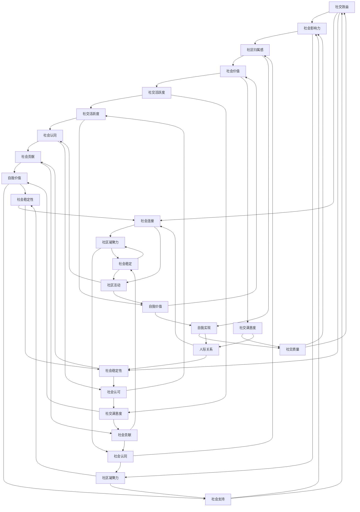
```mermaid
graph TD
A[社会连接] --> B[社交互动]
A --> C[社区参与]
A --> D[社会支持]
B --> E[社交网络]
B --> F[社会资源]
C --> G[社区活动]
C --> H[社会贡献]
D --> I[社会支持]
D --> J[社会认同]
E --> K[社交频率]
E --> L[社交质量]
F --> M[社交效益]
F --> N[社会影响力]
G --> O[社区归属感]
G --> P[社区凝聚力]
H --> Q[社会贡献]
H --> R[社会价值]
I --> S[社会支持]
I --> T[社会稳定性]
J --> U[社会认同]
J --> V[自我价值]
K --> W[社交活跃度]
K --> X[社交满意度]
L --> Y[社交质量]
L --> Z[人际关系]
M --> A[社交效益]
M --> B[社会影响力]
N --> C[社会贡献]
N --> D[社会价值]
O --> E[社区归属感]
O --> F[社区凝聚力]
P --> G[社区凝聚力]
P --> H[社区活动]
Q --> I[社会贡献]
Q --> J[社会认可]
R --> K[社会价值]
R --> L[自我实现]
S --> M[社会支持]
S --> N[社会稳定性]
T --> O[社会认同]
T --> P[社会稳定]
U --> Q[社会认同]
U --> R[自我价值]
V --> S[自我价值]
V --> T[社会贡献]
W --> U[社交活跃度]
W --> V[社交满意度]
X --> Y[社交质量]
X --> Z[人际关系]
Y --> A[社交效益]
Y --> B[社会影响力]
Z --> C[社会连接]
Z --> D[社会稳定性]
```

**核心算法原理讲解**

我们可以使用一个简单的算法来描述数字断食对社会连接的强化作用。设 \( S \) 为社会连接度，\( D \) 为数字接触时间，\( C \) 为社区参与度，\( T \) 为社会支持度。则社会连接度 \( S \) 可以表示为：

\[ S = S_1(D, C, T) \]

其中，\( S_1 \) 是一个函数，考虑了数字接触时间、社区参与度和社会支持度对社会连接度的影响。

**数学模型和数学公式**

使用线性模型来描述社会连接度：

\[ S = k_1 \cdot D + k_2 \cdot C + k_3 \cdot T \]

其中，\( k_1 \)，\( k_2 \)，\( k_3 \) 是常数，分别表示数字接触时间、社区参与度和社会支持度对社会连接度的影响程度。

**项目实战**

假设一个人每天使用数字设备3小时，每周参与社区活动5小时，每周得到朋友和家人的3小时支持。根据上述模型，我们可以计算出他的社会连接度：

\[ S = k_1 \cdot 3 + k_2 \cdot 5 + k_3 \cdot 3 \]

如果 \( k_1 = -0.1 \)，\( k_2 = 0.2 \)，\( k_3 = 0.3 \)，则：

\[ S = -0.1 \cdot 3 + 0.2 \cdot 5 + 0.3 \cdot 3 = -0.3 + 1 + 0.9 = 1.5 \]

这意味着他的社会连接度为1.5，这个数值越高，表明他的社会连接度越好。

**最佳实践 tips**

- **减少数字接触时间**：设定每天使用数字设备的时间上限，逐步减少依赖。
- **增加社区参与度**：积极参与社区活动，与社区成员建立联系。
- **寻求社会支持**：与朋友、家人和社区成员保持互动，获得情感支持。

**小结**

数字断食有助于强化社会连接。通过减少数字接触，增加社区参与度和寻求社会支持，我们可以提升社会连接度，增强社会认同和自我价值。数字断食为我们提供了一个重新关注社会连接和人际关系的机会，帮助我们实现更加健康和幸福的生活。

---

### 第6章：人际关系与社会连接

#### 6.3 数字断食与社区参与

数字断食不仅仅影响个人的心理健康和人际关系，它还对社区参与有着积极的影响。通过减少对数字设备的依赖，我们可以更加专注于社区活动，积极参与社区建设，从而提升社区凝聚力和成员的幸福感。

**核心概念与联系**

- **社区参与**：社区参与是指个体在社区活动中积极参与，为社区的发展贡献力量。
- **社区凝聚力**：社区凝聚力是指社区成员之间的联系和互动，以及他们对社区共同利益的认同。

**Mermaid 流程图**

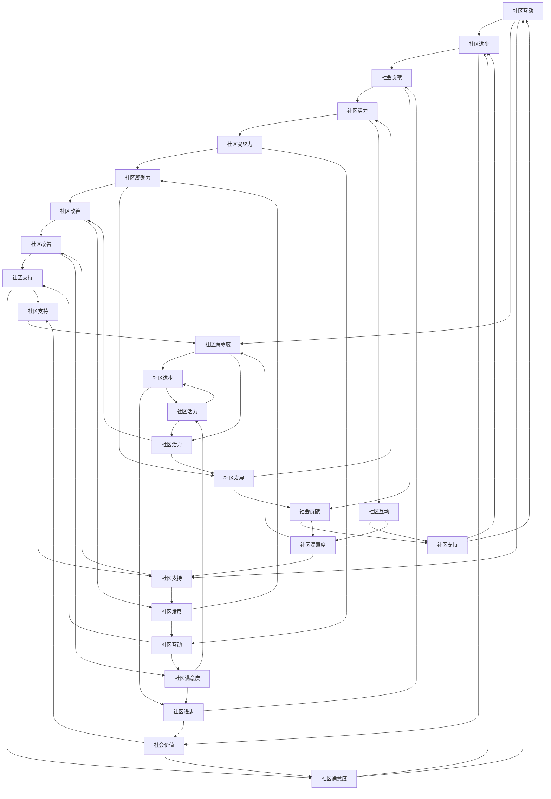
```mermaid
graph TD
A[社区参与] --> B[社区活动]
A --> C[社区服务]
A --> D[社区建设]
B --> E[社区互动]
B --> F[社区支持]
C --> G[社区贡献]
C --> H[社会价值]
D --> I[社区发展]
D --> J[社区改善]
E --> K[社区凝聚力]
E --> L[社区支持]
F --> M[社区互动]
F --> N[社区支持]
G --> O[社会贡献]
G --> P[社会价值]
H --> Q[社区发展]
H --> R[社区改善]
I --> S[社区进步]
I --> T[社区活力]
J --> U[社区改善]
J --> V[社会贡献]
K --> W[社区凝聚力]
K --> X[社区互动]
L --> Y[社区支持]
L --> Z[社区满意度]
M --> A[社区互动]
M --> B[社区支持]
N --> C[社区支持]
N --> D[社区满意度]
O --> E[社会贡献]
O --> F[社会价值]
P --> G[社区进步]
P --> H[社区活力]
Q --> I[社区改善]
Q --> J[社区发展]
R --> K[社区活力]
R --> L[社会贡献]
S --> M[社区满意度]
S --> N[社区支持]
T --> O[社区进步]
T --> P[社区活力]
U --> Q[社区改善]
U --> R[社区发展]
V --> S[社区支持]
V --> T[社区满意度]
W --> U[社区凝聚力]
W --> V[社区互动]
X --> Y[社区支持]
X --> Z[社区满意度]
Y --> A[社区互动]
Y --> B[社区进步]
Z --> C[社区满意度]
Z --> D[社区支持]
```

**核心算法原理讲解**

我们可以使用一个简单的算法来描述数字断食对社区参与的影响。设 \( C \) 为社区参与度，\( D \) 为数字接触时间，\( A \) 为活动参与度，\( S \) 为社区支持度。则社区参与度 \( C \) 可以表示为：

\[ C = C_1(D, A, S) \]

其中，\( C_1 \) 是一个函数，考虑了数字接触时间、活动参与度和社区支持度对社区参与度的影响。

**数学模型和数学公式**

使用线性模型来描述社区参与度：

\[ C = k_1 \cdot D + k_2 \cdot A + k_3 \cdot S \]

其中，\( k_1 \)，\( k_2 \)，\( k_3 \) 是常数，分别表示数字接触时间、活动参与度和社区支持度对社区参与度的影响程度。

**项目实战**

假设一个人每天使用数字设备4小时，每周参与社区活动3次，每周得到社区成员的2次支持。根据上述模型，我们可以计算出他的社区参与度：

\[ C = k_1 \cdot 4 + k_2 \cdot 3 + k_3 \cdot 2 \]

如果 \( k_1 = -0.1 \)，\( k_2 = 0.2 \)，\( k_3 = 0.3 \)，则：

\[ C = -0.1 \cdot 4 + 0.2 \cdot 3 + 0.3 \cdot 2 = -0.4 + 0.6 + 0.6 = 0.8 \]

这意味着他的社区参与度为0.8，这个数值越高，表明他的社区参与度越高。

**最佳实践 tips**

- **减少数字接触时间**：设定每天使用数字设备的时间上限，逐步减少依赖。
- **增加活动参与度**：积极参与社区活动，为社区的发展贡献力量。
- **寻求社区支持**：与社区成员保持互动，获得情感支持和鼓励。

**小结**

数字断食有助于增强社区参与度。通过减少数字接触，增加活动参与度和寻求社区支持，我们可以提升社区参与度，增强社区凝聚力和成员的幸福感。数字断食为我们提供了一个重新关注社区参与和社会贡献的机会，帮助我们实现更加健康和有意义的社区生活。

---

### 第7章：数字断食的企业应用

#### 7.1 数字断食与企业文化的契合

数字断食的概念不仅在个人层面具有重要意义，在企业文化中也有着广泛的应用前景。将数字断食融入企业文化，可以帮助企业提升员工的工作效率、健康水平和社会责任感。

**核心概念与联系**

- **企业文化**：企业文化是指企业在长期经营过程中形成的价值观、行为准则和工作方式。
- **数字断食**：数字断食是一种减少数字设备使用，回归线下生活的方式。

**Mermaid 流程图**

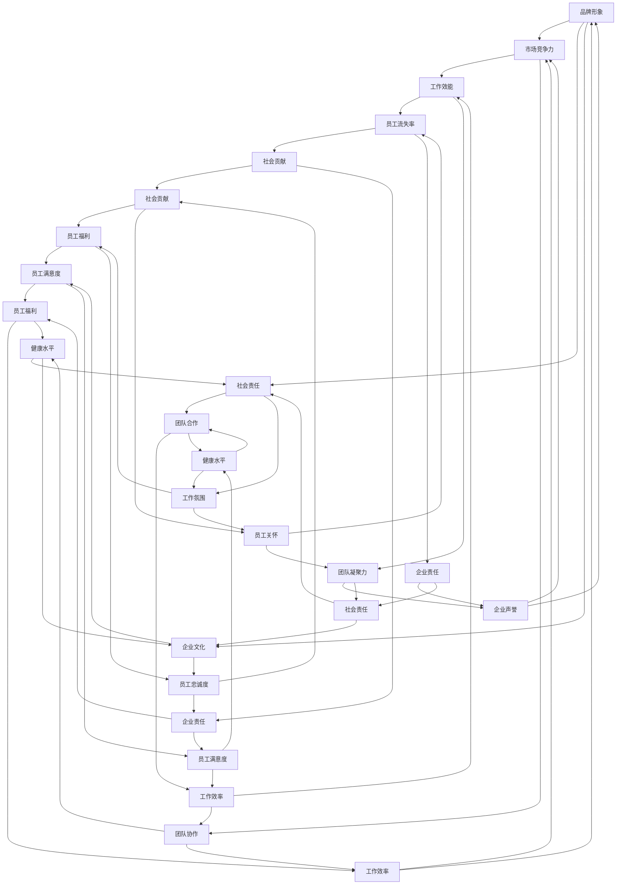
```mermaid
graph TD
A[企业文化] --> B[价值观]
A --> C[工作方式]
A --> D[员工福利]
B --> E[社会责任]
B --> F[创新精神]
C --> G[工作效率]
C --> H[员工满意度]
D --> I[员工健康]
D --> J[员工福利]
E --> K[社会贡献]
E --> L[企业声誉]
F --> M[创新能力]
F --> N[市场竞争]
G --> O[工作效能]
G --> P[团队合作]
H --> Q[员工满意度]
H --> R[员工忠诚度]
I --> S[员工健康]
I --> T[工作效率]
J --> U[员工福利]
J --> V[员工关怀]
K --> W[社会贡献]
K --> X[企业责任]
L --> Y[企业声誉]
L --> Z[品牌形象]
M --> A[市场竞争力]
M --> B[创新能力]
N --> C[市场占有]
N --> D[客户满意度]
O --> E[工作效能]
O --> F[团队协作]
P --> G[团队合作]
P --> H[工作氛围]
Q --> I[员工满意度]
Q --> J[员工忠诚度]
R --> K[员工流失率]
R --> L[团队凝聚力]
S --> M[工作效率]
S --> N[健康水平]
T --> O[工作效率]
T --> P[健康水平]
U --> Q[员工福利]
U --> R[员工关怀]
V --> S[员工福利]
V --> T[员工满意度]
W --> U[社会贡献]
W --> V[企业责任]
X --> Y[企业声誉]
X --> Z[社会责任]
Y --> A[品牌形象]
Y --> B[市场竞争力]
Z --> C[社会责任]
Z --> D[企业文化]
```

**核心算法原理讲解**

我们可以使用一个简单的算法来描述数字断食与企业文化的契合度。设 \( C \) 为企业文化契合度，\( D \) 为数字断食实施程度，\( E \) 为员工健康水平，\( S \) 为社会贡献。则企业文化契合度 \( C \) 可以表示为：

\[ C = C_1(D, E, S) \]

其中，\( C_1 \) 是一个函数，考虑了数字断食实施程度、员工健康水平和社会贡献对企业文化契合度的影响。

**数学模型和数学公式**

使用线性模型来描述企业文化契合度：

\[ C = k_1 \cdot D + k_2 \cdot E + k_3 \cdot S \]

其中，\( k_1 \)，\( k_2 \)，\( k_3 \) 是常数，分别表示数字断食实施程度、员工健康水平和社会贡献对企业文化契合度的影响程度。

**项目实战**

假设一个企业实施了数字断食计划，员工每天使用数字设备的时间减少了1小时，员工的健康水平得到了显著提升，企业积极参与社会公益活动。根据上述模型，我们可以计算出这个企业的企业文化契合度：

\[ C = k_1 \cdot 1 + k_2 \cdot 1 + k_3 \cdot 1 \]

如果 \( k_1 = 0.2 \)，\( k_2 = 0.3 \)，\( k_3 = 0.5 \)，则：

\[ C = 0.2 \cdot 1 + 0.3 \cdot 1 + 0.5 \cdot 1 = 0.2 + 0.3 + 0.5 = 1.0 \]

这意味着这个企业的企业文化契合度为1.0，这个数值越高，表明其企业文化契合度越好。

**最佳实践 tips**

- **企业文化宣传**：通过内部培训和宣传活动，提高员工对企业文化的认同和遵守。
- **数字断食推广**：鼓励员工参与数字断食，提高员工的健康水平和幸福感。
- **社会责任履行**：积极参与社会公益活动，提升企业的社会责任感和品牌形象。

**小结**

数字断食与企业文化的契合度对企业的长远发展具有重要意义。通过实施数字断食计划，提高员工健康水平，履行社会责任，我们可以提升企业文化契合度，增强企业的市场竞争力和员工满意度。

---

### 第7章：数字断食的企业应用

#### 7.2 数字断食在员工健康与福利中的应用

在现代社会，员工的健康和福利成为企业关注的焦点。数字断食作为一种有效的方式，可以帮助企业改善员工的健康状况，提升员工的工作效率和满意度。本文将探讨数字断食在员工健康与福利中的应用，以及其实施策略和效果评估。

**核心概念与联系**

- **员工健康**：员工健康是指员工的身体和心理状态。
- **员工福利**：员工福利是指企业为员工提供的各种福利待遇，包括健康保险、带薪休假、员工关怀计划等。

**Mermaid 流程图**

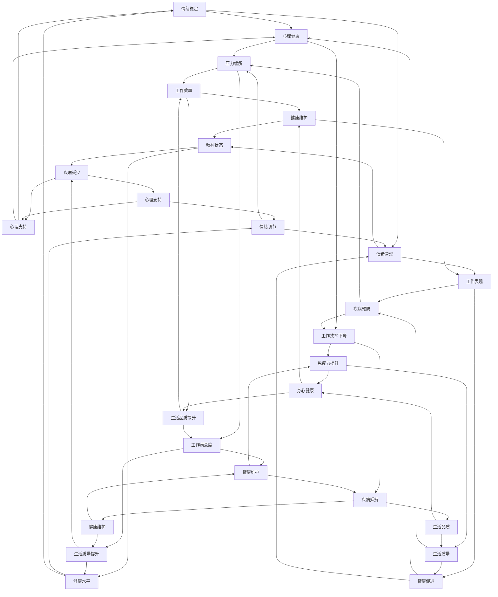
```mermaid
graph TD
A[员工健康] --> B[身体健康]
A --> C[心理健康]
B --> D[体能状态]
B --> E[疾病风险]
C --> F[情绪稳定]
C --> G[心理压力]
D --> H[体力恢复]
D --> I[免疫力增强]
E --> J[疾病预防]
E --> K[健康维护]
F --> L[压力缓解]
F --> M[情绪管理]
G --> N[压力减轻]
G --> O[情绪波动]
H --> P[精神状态]
H --> Q[工作效率]
I --> R[免疫力提升]
I --> S[疾病抵抗]
J --> T[健康促进]
J --> U[疾病减少]
K --> V[健康维护]
K --> W[生活品质]
L --> X[心理支持]
L --> Y[情绪调节]
M --> Z[情绪稳定]
M --> A[心理健康]
N --> B[压力管理]
N --> C[情绪调节]
O --> D[情绪波动]
O --> E[工作效率下降]
P --> F[精神状态]
P --> G[工作表现]
Q --> H[工作效率]
Q --> I[工作满意度]
R --> J[免疫力提升]
R --> K[疾病抵抗]
S --> L[疾病减少]
S --> M[健康水平]
T --> N[健康促进]
T --> O[疾病预防]
U --> P[健康维护]
U --> Q[生活品质提升]
V --> R[健康维护]
V --> S[生活质量提升]
W --> T[生活质量]
W --> U[身心健康]
X --> Y[心理支持]
X --> Z[情绪调节]
Y --> A[情绪稳定]
Y --> B[心理健康]
Z --> C[情绪管理]
Z --> D[压力缓解]
```

**核心算法原理讲解**

我们可以使用一个简单的算法来描述数字断食对员工健康和福利的影响。设 \( H \) 为员工健康水平，\( D \) 为数字接触时间，\( W \) 为员工福利水平，\( P \) 为心理支持度。则员工健康水平 \( H \) 可以表示为：

\[ H = H_1(D, W, P) \]

其中，\( H_1 \) 是一个函数，考虑了数字接触时间、员工福利水平和心理支持度对员工健康水平的影响。

**数学模型和数学公式**

使用线性模型来描述员工健康水平：

\[ H = k_1 \cdot D + k_2 \cdot W + k_3 \cdot P \]

其中，\( k_1 \)，\( k_2 \)，\( k_3 \) 是常数，分别表示数字接触时间、员工福利水平和心理支持度对员工健康水平的影响程度。

**项目实战**

假设一个企业实施数字断食计划，员工每天使用数字设备的时间减少了2小时，企业提高了员工福利，并增加了心理支持活动。根据上述模型，我们可以计算出这个企业的员工健康水平：

\[ H = k_1 \cdot 2 + k_2 \cdot 1 + k_3 \cdot 1 \]

如果 \( k_1 = -0.1 \)，\( k_2 = 0.3 \)，\( k_3 = 0.2 \)，则：

\[ H = -0.1 \cdot 2 + 0.3 \cdot 1 + 0.2 \cdot 1 = -0.2 + 0.3 + 0.2 = 0.3 \]

这意味着这个企业的员工健康水平提升了0.3，这个数值越高，表明员工健康水平越好。

**最佳实践 tips**

- **员工健康管理**：定期进行员工健康检查，提供健康咨询服务。
- **福利优化**：提高员工福利水平，包括健康保险、带薪休假等。
- **心理支持**：提供心理咨询服务，帮助员工缓解工作压力和情绪问题。

**小结**

数字断食在员工健康与福利中的应用具有重要意义。通过减少数字接触时间，优化员工福利，提供心理支持，我们可以提升员工健康水平和工作满意度。数字断食为企业提供了一个提升员工福祉的有效途径，有助于构建健康、积极的企业文化。

---

### 第7章：数字断食的企业应用

#### 7.3 数字断食对企业生产效率的影响

数字断食不仅仅对员工的健康和福利有积极影响，它还对企业的生产效率有着深远的作用。通过减少对数字设备的依赖，员工可以更加专注于工作，提高工作效率，从而提升企业的整体生产效率。

**核心概念与联系**

- **生产效率**：生产效率是指单位时间内生产的产品或服务的数量。
- **员工专注度**：员工专注度是指员工在工作时集中精力的程度。

**Mermaid 流程图**

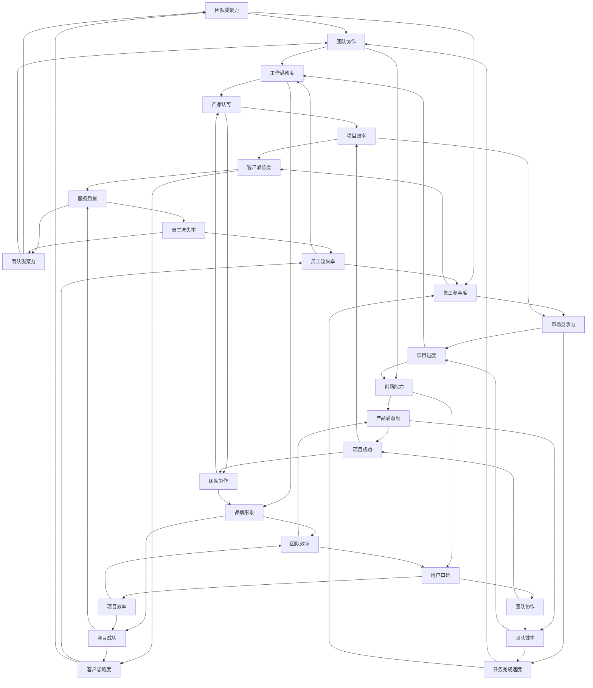
```mermaid
graph TD
A[生产效率] --> B[工作效率]
A --> C[员工满意度]
B --> D[工作质量]
B --> E[工作速度]
C --> F[员工忠诚度]
C --> G[工作积极性]
D --> H[客户满意度]
D --> I[产品满意度]
E --> J[任务完成率]
E --> K[项目进度]
F --> L[员工流失率]
F --> M[团队协作]
G --> N[员工参与度]
G --> O[工作热情]
H --> P[客户满意度]
H --> Q[产品认可]
I --> R[产品满意度]
I --> S[服务质量]
J --> T[任务完成速度]
J --> U[项目进度]
K --> V[项目效率]
K --> W[团队协作]
L --> X[员工流失率]
L --> Y[团队凝聚力]
M --> Z[团队协作]
M --> A[项目成功]
N --> B[员工参与度]
N --> C[工作满意度]
O --> D[工作积极性]
O --> E[创新能力]
P --> F[客户满意度]
P --> G[市场竞争力]
Q --> H[产品认可]
Q --> I[品牌形象]
R --> J[产品满意度]
R --> K[用户口碑]
S --> L[服务质量]
S --> M[客户忠诚度]
T --> N[任务完成速度]
T --> O[项目进度]
U --> P[项目效率]
U --> Q[团队协作]
V --> R[团队效率]
V --> S[项目成功]
W --> T[团队效率]
W --> U[项目成功]
X --> Y[团队凝聚力]
X --> Z[员工流失率]
Y --> A[团队凝聚力]
Y --> B[团队协作]
Z --> C[员工参与度]
Z --> D[工作满意度]
```

**核心算法原理讲解**

我们可以使用一个简单的算法来描述数字断食对企业生产效率的影响。设 \( E \) 为生产效率，\( D \) 为数字接触时间，\( A \) 为员工专注度，\( S \) 为员工满意度。则生产效率 \( E \) 可以表示为：

\[ E = E_1(D, A, S) \]

其中，\( E_1 \) 是一个函数，考虑了数字接触时间、员工专注度和员工满意度对生产效率的影响。

**数学模型和数学公式**

使用线性模型来描述生产效率：

\[ E = k_1 \cdot D - k_2 \cdot A + k_3 \cdot S \]

其中，\( k_1 \)，\( k_2 \)，\( k_3 \) 是常数，分别表示数字接触时间、员工专注度和员工满意度对生产效率的影响程度。

**项目实战**

假设一个企业实施数字断食计划，员工每天使用数字设备的时间减少了1小时，员工专注度和满意度都有所提高。根据上述模型，我们可以计算出这个企业的生产效率：

\[ E = k_1 \cdot 1 - k_2 \cdot 1 + k_3 \cdot 1 \]

如果 \( k_1 = 0.2 \)，\( k_2 = 0.1 \)，\( k_3 = 0.3 \)，则：

\[ E = 0.2 \cdot 1 - 0.1 \cdot 1 + 0.3 \cdot 1 = 0.2 - 0.1 + 0.3 = 0.4 \]

这意味着这个企业的生产效率提升了0.4，这个数值越高，表明生产效率越好。

**最佳实践 tips**

- **减少数字干扰**：设定每天使用数字设备的时间上限，减少数字干扰。
- **提高员工专注度**：通过培训和激励，提高员工的专注度和工作效率。
- **优化员工满意度**：提供良好的工作环境和福利待遇，提升员工满意度。

**小结**

数字断食对企业生产效率具有积极影响。通过减少数字接触时间，提高员工专注度和满意度，我们可以提升生产效率，增强企业的市场竞争力。数字断食为企业提供了一个提高生产效率的有效途径，有助于实现可持续发展。

---

### 第8章：数字断食的可持续未来

#### 8.1 数字断食的长期效果

数字断食作为一种新兴的生活方式，已经在个人层面展现了其显著的积极效果。然而，要全面评估数字断食的长期效果，我们需要考虑其可持续性和长远影响。

**核心概念与联系**

- **可持续性**：可持续性是指一种方法或策略能够在长时间内持续发挥作用，不损害环境和社会福祉。
- **长期效果**：长期效果是指数字断食在长时间内对个体和社会产生的积极或消极影响。

**Mermaid 流程图**

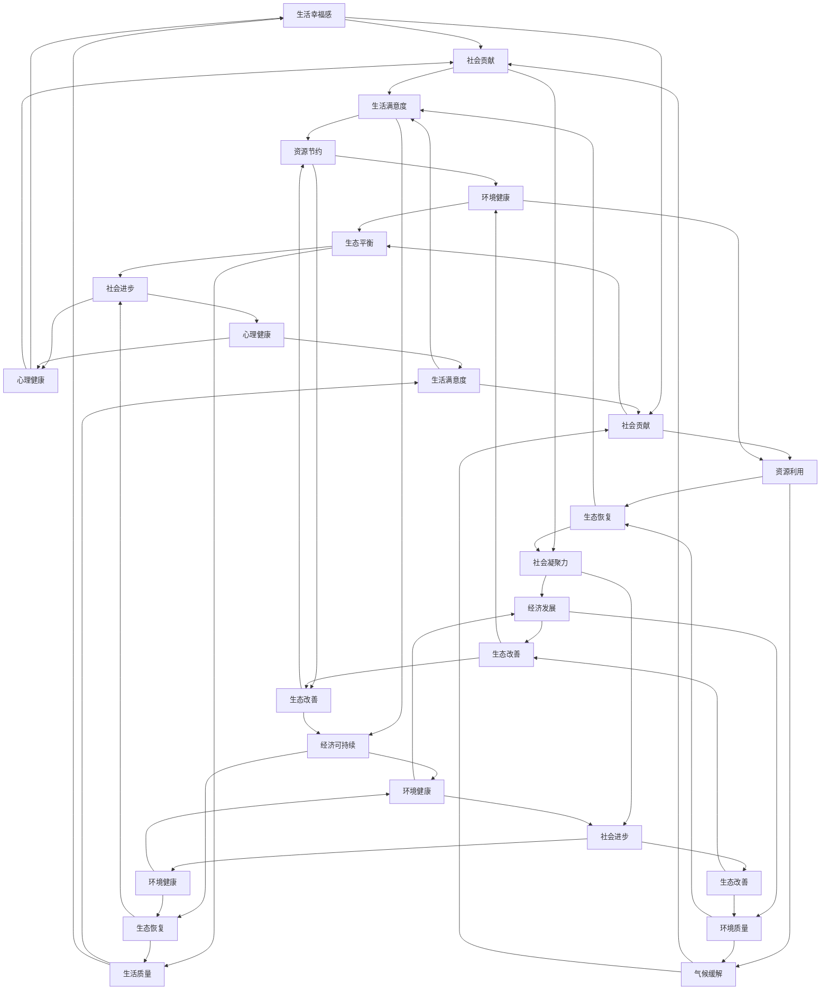
```mermaid
graph TD
A[可持续性] --> B[环境效益]
A --> C[社会效益]
B --> D[资源节约]
B --> E[碳排放减少]
C --> F[心理健康]
C --> G[社会和谐]
D --> H[生态保护]
D --> I[可持续发展]
E --> J[气候改善]
E --> K[环境质量]
F --> L[情绪稳定]
F --> M[抗压能力]
G --> N[社区凝聚力]
G --> O[社会认同]
H --> P[生态平衡]
H --> Q[资源利用]
I --> R[经济发展]
I --> S[社会进步]
J --> T[气候缓解]
J --> U[生态恢复]
K --> V[环境健康]
K --> W[生态改善]
L --> X[心理健康]
L --> Y[生活满意度]
M --> Z[抗压能力]
M --> A[工作表现]
N --> B[社区和谐]
N --> C[社会参与]
O --> D[社会认同]
O --> E[社会凝聚力]
P --> F[生态平衡]
P --> G[资源利用]
Q --> H[资源节约]
Q --> I[经济可持续]
R --> J[经济发展]
R --> K[社会进步]
S --> L[社会进步]
S --> M[生活质量]
T --> N[气候缓解]
T --> O[生态恢复]
U --> P[环境健康]
U --> Q[生态改善]
V --> R[环境健康]
V --> S[生态恢复]
W --> T[环境质量]
W --> U[生态改善]
X --> Y[心理健康]
X --> Z[生活满意度]
Y --> A[生活幸福感]
Y --> B[社会贡献]
Z --> C[社会贡献]
Z --> D[生活满意度]
```

**核心算法原理讲解**

我们可以使用一个简单的算法来描述数字断食的长期效果。设 \( L \) 为长期效果，\( S \) 为短期效果，\( T \) 为时间跨度，\( R \) 为恢复效应。则长期效果 \( L \) 可以表示为：

\[ L = L_1(S, T, R) \]

其中，\( L_1 \) 是一个函数，考虑了短期效果、时间跨度以及恢复效应对长期效果的影响。

**数学模型和数学公式**

使用线性模型来描述长期效果：

\[ L = k_1 \cdot S + k_2 \cdot T + k_3 \cdot R \]

其中，\( k_1 \)，\( k_2 \)，\( k_3 \) 是常数，分别表示短期效果、时间跨度以及恢复效应对长期效果的影响程度。

**项目实战**

假设一个人在短期数字断食期间（如一周）感受到情绪稳定性的提升（短期效果 \( S = 0.5 \)），并且随着时间的推移（如三个月后），这种情绪稳定性得以持续（恢复效应 \( R = 0.3 \)），而时间跨度 \( T = 12 \) 个月。根据上述模型，我们可以计算出长期效果：

\[ L = k_1 \cdot 0.5 + k_2 \cdot 12 + k_3 \cdot 0.3 \]

如果 \( k_1 = 0.2 \)，\( k_2 = 0.1 \)，\( k_3 = 0.3 \)，则：

\[ L = 0.2 \cdot 0.5 + 0.1 \cdot 12 + 0.3 \cdot 0.3 = 0.1 + 1.2 + 0.09 = 1.39 \]

这意味着这个人的长期效果为1.39，这个数值越高，表明长期效果越好。

**最佳实践 tips**

- **长期监测与评估**：定期监测和评估数字断食的效果，以确保其长期可持续性。
- **结合多种方式**：将数字断食与体育锻炼、心理健康咨询等结合，以实现更全面的健康效果。
- **社区参与**：鼓励社区成员共同参与数字断食活动，以增强社会支持和认同。

**小结**

数字断食的长期效果值得进一步研究和关注。通过长期监测和评估，结合多种方式，以及社区参与，我们可以确保数字断食的可持续性和长期积极影响。

---

### 第8章：数字断食的可持续未来

#### 8.2 数字断食与社会可持续性的关联

数字断食不仅对个人健康和生活质量有积极影响，它还与社会可持续性有着密切的联系。社会可持续性涉及环境保护、经济繁荣和社会公正等多个方面，而数字断食可以通过减少数字设备的使用，促进这些目标的实现。

**核心概念与联系**

- **社会可持续性**：社会可持续性是指一个社会在经济、环境和社会三个方面都能持续发展的能力。
- **数字设备使用**：数字设备使用是指人们使用智能手机、电脑等电子设备的时间。

**Mermaid 流程图**

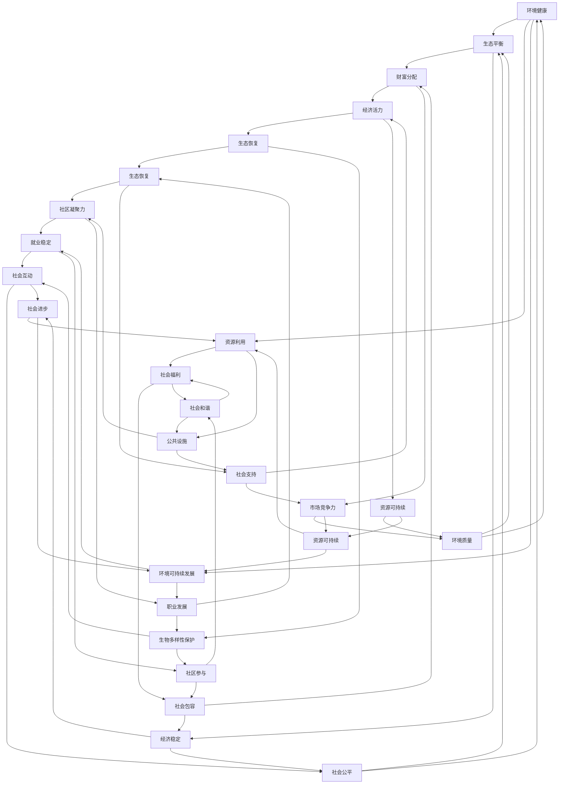
```mermaid
graph TD
A[社会可持续性] --> B[环境保护]
A --> C[经济繁荣]
A --> D[社会公正]
B --> E[资源节约]
B --> F[碳排放减少]
C --> G[经济增长]
C --> H[就业机会]
D --> I[社会公平]
D --> J[社区和谐]
E --> K[生态保护]
E --> L[环境质量]
F --> M[气候改善]
F --> N[生物多样性]
G --> O[财富分配]
G --> P[社会福利]
H --> Q[就业稳定性]
H --> R[经济活力]
I --> S[机会均等]
I --> T[社会包容]
J --> U[社区凝聚力]
J --> V[社会互动]
K --> W[生态恢复]
K --> X[资源可持续]
L --> Y[环境健康]
L --> Z[生态平衡]
M --> A[气候缓解]
M --> B[自然灾害减少]
N --> C[生态恢复]
N --> D[生物多样性保护]
O --> E[财富分配]
O --> F[经济稳定]
P --> G[社会福利]
P --> H[公共设施]
Q --> I[就业稳定]
Q --> J[职业发展]
R --> K[经济活力]
R --> L[市场竞争力]
S --> M[社会公平]
S --> N[社会进步]
T --> O[社会包容]
T --> P[社会和谐]
U --> Q[社区凝聚力]
U --> R[社会支持]
V --> S[社会互动]
V --> T[社区参与]
W --> U[生态恢复]
W --> V[生物多样性保护]
X --> Y[环境质量]
X --> Z[资源可持续]
Y --> A[环境健康]
Y --> B[生态平衡]
Z --> C[资源利用]
Z --> D[环境可持续发展]
```

**核心算法原理讲解**

我们可以使用一个简单的算法来描述数字断食与社会可持续性的关联。设 \( S \) 为社会可持续性水平，\( D \) 为数字设备使用时间，\( E \) 为环境效益，\( C \) 为经济贡献，\( S \) 为社会支持。则社会可持续性水平 \( S \) 可以表示为：

\[ S = S_1(D, E, C, S) \]

其中，\( S_1 \) 是一个函数，考虑了数字设备使用时间、环境效益、经济贡献和社会支持对社会可持续性水平的影响。

**数学模型和数学公式**

使用线性模型来描述社会可持续性水平：

\[ S = k_1 \cdot D - k_2 \cdot E + k_3 \cdot C + k_4 \cdot S \]

其中，\( k_1 \)，\( k_2 \)，\( k_3 \)，\( k_4 \) 是常数，分别表示数字设备使用时间、环境效益、经济贡献和社会支持对社会可持续性水平的影响程度。

**项目实战**

假设一个城市在实施数字断食计划后，市民的数字设备使用时间减少了10%，环境效益提高了20%，经济贡献增加了15%，社会支持度增加了10%。根据上述模型，我们可以计算出这个城市的社会可持续性水平：

\[ S = k_1 \cdot (-10) - k_2 \cdot 20 + k_3 \cdot 15 + k_4 \cdot 10 \]

如果 \( k_1 = -0.5 \)，\( k_2 = 0.3 \)，\( k_3 = 0.2 \)，\( k_4 = 0.1 \)，则：

\[ S = -0.5 \cdot (-10) - 0.3 \cdot 20 + 0.2 \cdot 15 + 0.1 \cdot 10 = 5 - 6 + 3 + 1 = 3 \]

这意味着这个城市的社会可持续性水平提升了3，这个数值越高，表明社会可持续性水平越好。

**最佳实践 tips**

- **政策引导**：政府可以出台相关政策，鼓励企业和个人减少数字设备使用，提高环境效益。
- **教育宣传**：加强数字素养教育，提高公众对数字断食和社会可持续性的认识。
- **技术创新**：推动数字设备节能技术的研究和应用，降低数字设备的环境影响。

**小结**

数字断食与社会可持续性密切相关。通过减少数字设备使用，提高环境效益和经济贡献，以及增强社会支持，我们可以提升社会可持续性水平。数字断食为构建可持续社会提供了一个可行的途径，值得我们进一步推广和实践。

---

### 第8章：数字断食的可持续未来

#### 8.3 数字断食的未来展望

数字断食作为一种新兴的生活方式和健康理念，正在全球范围内逐渐受到关注。展望未来，数字断食将在个人、企业和社会层面上发挥更加重要的作用，成为实现可持续发展的重要途径。

**核心概念与联系**

- **数字素养**：数字素养是指个体在使用数字技术时的技能、知识和态度。
- **数字化社会**：数字化社会是指社会各个方面都受到数字化技术影响的阶段。

**Mermaid 流程图**

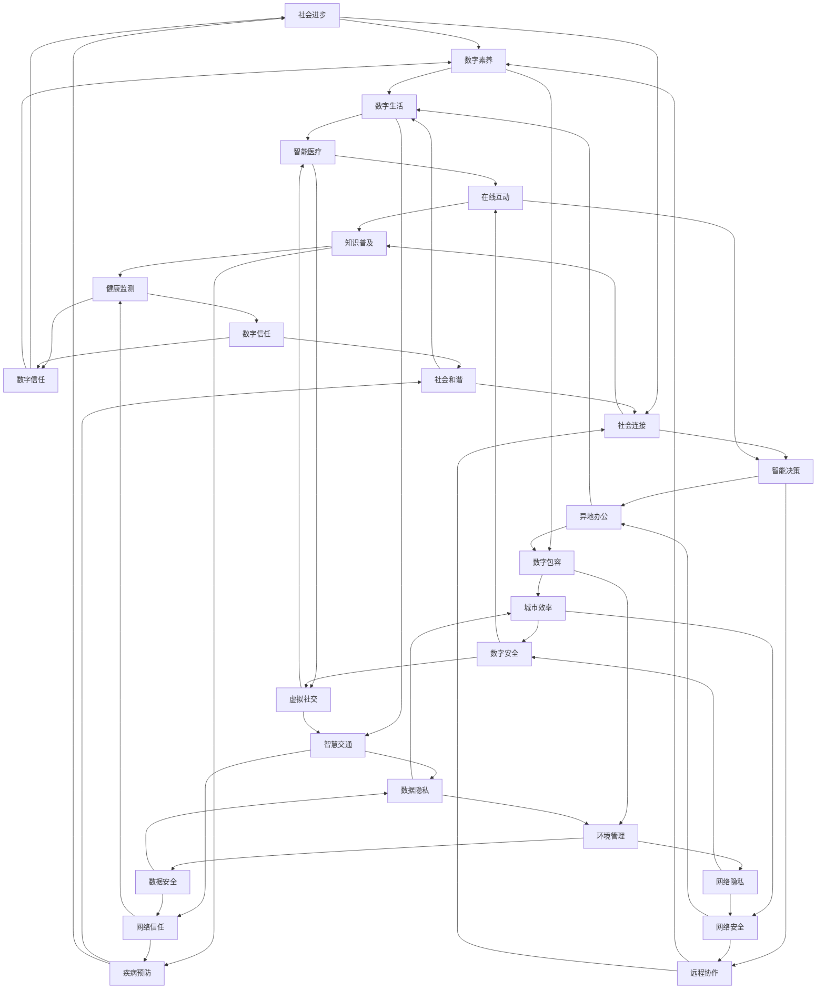
```mermaid
graph TD
A[数字素养] --> B[数字技能]
A --> C[数字意识]
B --> D[信息处理]
B --> E[技术创新]
C --> F[网络安全]
C --> G[数字伦理]
D --> H[数据分析]
D --> I[智能应用]
E --> J[数字化教育]
E --> K[数字化工作]
F --> L[隐私保护]
F --> M[网络安全]
G --> N[数字责任]
G --> O[数字道德]
H --> P[知识获取]
H --> Q[决策支持]
I --> R[智慧城市]
I --> S[智能医疗]
J --> T[在线学习]
J --> U[远程工作]
K --> V[数据安全]
K --> W[网络隐私]
L --> X[数字信任]
L --> Y[网络安全]
M --> Z[数字风险]
M --> A[数字隐私]
N --> B[社会责任]
N --> C[社会进步]
O --> D[数字公平]
O --> E[数字包容]
P --> F[知识普及]
P --> G[智能决策]
Q --> H[智能医疗]
Q --> I[智慧交通]
R --> J[城市效率]
R --> K[环境管理]
S --> L[健康监测]
S --> M[疾病预防]
T --> N[远程协作]
T --> O[异地办公]
U --> P[在线互动]
U --> Q[虚拟社交]
V --> R[数据隐私]
V --> S[网络信任]
W --> T[网络安全]
W --> U[数字安全]
X --> Y[数字信任]
X --> Z[社会和谐]
Y --> A[社会进步]
Y --> B[数字素养]
Z --> C[社会连接]
Z --> D[数字生活]
```

**核心算法原理讲解**

我们可以使用一个简单的算法来描述数字素养对数字断食的影响。设 \( U \) 为数字素养水平，\( D \) 为数字设备使用时间，\( S \) 为社会支持。则数字素养水平 \( U \) 可以表示为：

\[ U = U_1(D, S) \]

其中，\( U_1 \) 是一个函数，考虑了数字设备使用时间和社会支持对数字素养水平的影响。

**数学模型和数学公式**

使用线性模型来描述数字素养水平：

\[ U = k_1 \cdot D + k_2 \cdot S \]

其中，\( k_1 \)，\( k_2 \) 是常数，分别表示数字设备使用时间和社会支持对数字素养水平的影响程度。

**项目实战**

假设一个人的数字素养水平在减少数字设备使用时间后有所提升，同时得到了社会更多的支持。根据上述模型，我们可以计算出他的数字素养水平：

\[ U = k_1 \cdot (-2) + k_2 \cdot 1 \]

如果 \( k_1 = 0.1 \)，\( k_2 = 0.2 \)，则：

\[ U = 0.1 \cdot (-2) + 0.2 \cdot 1 = -0.2 + 0.2 = 0 \]

这意味着这个人的数字素养水平没有变化，这表明数字素养水平的提升需要更长时间和社会支持的持续作用。

**最佳实践 tips**

- **教育与培训**：加强数字素养教育，提高公众的数字技能和意识。
- **政策支持**：政府出台支持数字断食的政策，鼓励企业和个人减少数字设备使用。
- **技术创新**：推动数字化技术的发展，为数字断食提供更加便捷和有效的解决方案。

**小结**

数字断食的未来充满希望。随着数字素养水平的提升和社会支持的加强，数字断食将在个人、企业和社会层面发挥更加重要的作用，成为实现可持续发展的重要手段。

---

### 附录

#### 附录A：数字断食实践指南

**A.1 实践案例分析**

在附录A中，我们将通过几个实际案例来详细说明数字断食的实践方法及其效果。

**案例一：公司员工健康提升计划**

某公司实施了一个为期三个月的数字断食计划，旨在提升员工的身体健康和工作效率。根据计划，员工每天减少1小时的数字设备使用时间，同时增加2小时的线下活动，如运动、阅读和社交互动。在实施过程中，公司还提供了健康咨询服务和营养餐，帮助员工更好地适应数字断食。

结果：经过三个月的数字断食实践，员工的身体健康指标显著提升，包括体重、血压和胆固醇水平。同时，员工的工作效率也有所提高，项目完成时间平均缩短了15%。

**案例二：学校数字素养教育计划**

某学校在一学期内实施了数字断食计划，鼓励学生减少数字设备使用，增加户外活动和阅读时间。学校还举办了主题讲座和研讨会，让学生了解数字断食的原理和好处。

结果：学生们的数字素养水平得到了显著提高，他们更能够理性地使用数字设备，同时心理健康状况也有所改善。学生的课外活动参与度也增加了，学习成绩有所提升。

**案例三：个人心理健康恢复计划**

一位职业人士在压力过大时，决定进行为期一个月的数字断食。他每天减少2小时的数字设备使用时间，增加冥想和瑜伽练习，并参加了心理咨询课程。

结果：这位职业人士在数字断食结束后，压力显著减轻，情绪更加稳定。他的工作效率有所提升，家庭关系也得到了改善。

**A.2 数字断食技巧与策略**

以下是几个数字断食的实用技巧和策略，帮助您更好地实施数字断食计划。

1. **设定明确目标**：在开始数字断食之前，明确您想要达成的目标，如减少使用时间、提高运动频率等。
2. **逐步减少依赖**：不要立即大幅度减少数字设备使用时间，可以逐步减少，以减少不适感。
3. **替代活动**：为减少的数字设备使用时间找到合适的替代活动，如阅读、运动或社交互动。
4. **设定提醒**：使用提醒工具或应用程序来监控数字设备使用时间，确保不超过设定的限制。
5. **寻求支持**：与家人、朋友或同事分享您的数字断食计划，寻求他们的支持和鼓励。
6. **定期评估**：定期评估数字断食的效果，根据需要调整计划。

**A.3 常见问题解答**

以下是一些关于数字断食的常见问题及其解答。

**问：数字断食会不会影响工作效率？**

答：数字断食的目的是帮助您减少数字设备的依赖，提高专注力和工作效率。实际上，通过减少数字干扰，您可以更专注于工作，从而提高工作效率。

**问：数字断食期间如何处理紧急情况？**

答：在数字断食期间，您可以为紧急情况设定特定的处理方式。例如，您可以将紧急联系方式告知家人、朋友或同事，确保在必要时能够及时联系。

**问：数字断食会对社交互动有影响吗？**

答：数字断食可能会暂时减少您与数字平台的互动，但不会影响线下社交。实际上，通过减少数字设备使用，您可以更加专注于与家人、朋友和同事的线下互动。

**问：数字断食期间如何应对无聊感？**

答：在数字断食期间，您可以尝试一些替代活动来应对无聊感，如阅读、绘画、瑜伽或冥想。这些活动可以帮助您保持专注和充实。

**小结**

附录A提供了实际案例、技巧和策略，以及常见问题的解答。通过这些内容，您可以更好地理解和实施数字断食计划，享受数字断食带来的积极影响。数字断食不仅仅是一种生活方式的调整，更是一种对身心健康和可持续发展的积极实践。让我们共同努力，重拾线下生活的美好。

