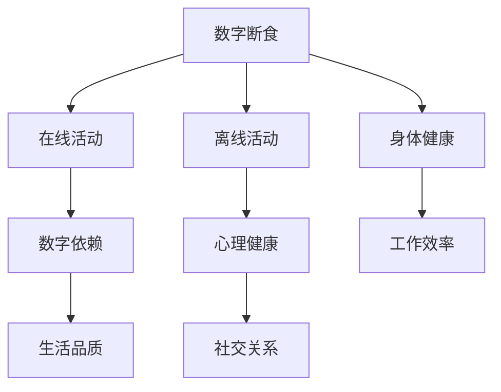

                 

## 引言

在当今数字化时代，我们几乎无时无刻不在与数字设备打交道。手机、电脑、智能手表、智能家居设备……这些设备已成为我们生活中不可或缺的一部分。然而，随着我们对数字技术的依赖程度不断加深，一种新型的“饮食”方式——数字断食，逐渐走进了人们的视野。

### 什么是数字断食？

数字断食，顾名思义，是一种减少对数字设备依赖的行为。它类似于传统的断食，但并非完全断绝与数字设备的接触，而是通过有意识地限制和调整与数字设备互动的时间和方式，以达到提升生活质量、促进心理健康和身体放松的目的。

数字断食的起源可以追溯到20世纪末期，当时人们开始关注过度依赖电脑和网络对身心健康的负面影响。近年来，随着智能手机、社交媒体和在线娱乐的普及，数字断食的理念逐渐被更多人接受和实践。

### 为什么要进行数字断食？

数字技术的普及给我们的生活带来了许多便利，但同时也带来了一系列问题。过度依赖数字设备可能导致以下几方面的负面影响：

1. **心理健康问题**：长时间盯着屏幕，容易导致眼睛疲劳、头痛、失眠等问题。此外，过度使用社交媒体和网络游戏，还可能导致焦虑、抑郁等心理问题。

2. **身体健康问题**：长时间坐在电脑前，缺乏运动，容易导致肥胖、肌肉劳损、骨骼疾病等问题。此外，长时间使用电子设备，还可能增加患心血管疾病的风险。

3. **社交关系问题**：数字设备的过度使用，容易让人沉迷于虚拟世界，忽视现实生活中的社交关系。这可能导致人际关系疏离、孤独感增加。

4. **工作效率问题**：过度依赖数字设备，可能导致工作状态不佳、注意力分散、工作效率降低。

### 文章关键词

- 数字断食
- 在线与离线
- 心理健康
- 身体健康
- 社交关系
- 工作效率

### 摘要

本文将深入探讨数字断食的起源、意义和重要性，分析其在提升生活质量、促进心理健康、身体健康和社交关系方面的作用。此外，还将介绍数字断食的核心原则、实现方法和技术基础，并通过实际案例进行详细讲解。希望本文能帮助读者重新审视自己的数字生活习惯，找到一种更加健康的生活方式。

### 背景介绍

#### 数字时代的挑战

随着数字技术的飞速发展，我们的生活越来越离不开数字设备。从工作到娱乐，从学习到社交，数字设备已经深深地嵌入到了我们的日常生活中。然而，这种过度依赖也带来了一系列的问题。

首先，长时间使用数字设备对我们的心理健康产生了负面影响。研究表明，长时间盯着屏幕容易导致眼睛疲劳、头痛、失眠等问题。此外，过度使用社交媒体和网络游戏，还可能导致焦虑、抑郁等心理问题。这是因为，数字设备提供的信息往往是碎片化、即时性的，容易使人产生焦虑感和信息过载。

其次，数字设备的过度使用对我们的身体健康也带来了隐患。长时间坐在电脑前，缺乏运动，容易导致肥胖、肌肉劳损、骨骼疾病等问题。此外，长时间使用电子设备，还可能增加患心血管疾病的风险。这是因为，长时间保持同一姿势，容易导致血液循环不畅，进而影响身体健康。

最后，数字设备的过度使用还可能影响我们的社交关系和工作效率。数字设备的普及，让我们可以随时随地与他人保持联系，但这也意味着我们更容易沉迷于虚拟世界，忽视现实生活中的社交关系。此外，过度使用数字设备，还可能导致注意力分散，工作效率降低。

#### 数字断食的兴起

面对这些挑战，人们开始寻找解决方案。在这个过程中，数字断食这一概念应运而生。数字断食并不是要完全摆脱数字设备，而是通过有意识地限制和调整与数字设备的互动时间和方式，来减少其负面影响。

数字断食的核心理念是“适度”。与传统的极端断食不同，数字断食强调的是在日常生活中找到一种平衡，既充分利用数字技术的便利，又避免过度依赖。例如，你可以设定每天一定的时间段为“数字断食时间”，在这段时间内，不使用任何数字设备，专心做其他事情。

#### 数字断食的意义

数字断食的意义不仅在于减轻身体和心理的负担，更在于帮助我们重新审视自己的生活方式，找到一种更加健康、平衡的生活状态。

首先，数字断食有助于提高我们的生活质量。通过减少对数字设备的依赖，我们可以将更多的时间用于锻炼、阅读、与家人朋友互动等有益身心健康的活动。

其次，数字断食有助于促进心理健康。减少对数字设备的依赖，可以让我们的大脑得到充分的休息，从而降低焦虑和抑郁的风险。

最后，数字断食有助于改善社交关系和工作效率。通过减少数字设备的干扰，我们可以更专注于当下的任务，提高工作效率。同时，也有更多的时间去关心和陪伴家人朋友，加强现实生活中的社交互动。

### 核心概念与联系

#### 数字断食

数字断食是一种通过限制和调整与数字设备的互动时间和方式，来减少其负面影响的饮食方式。它强调在日常生活中找到一种平衡，既充分利用数字技术的便利，又避免过度依赖。

#### 在线与离线

在线与离线是数字断食中的两个核心概念。在线指的是通过互联网进行活动，如使用社交媒体、在线购物、观看视频等。离线则是在没有互联网连接的情况下进行活动，如阅读纸质书籍、与家人朋友面对面交流、进行户外活动等。

#### 数字技术

数字技术是数字断食的基石。它包括用于生成、处理、存储和传输数字信息的各种技术，如计算机、互联网、移动通信等。数字技术的飞速发展，使得我们能够更加便捷地获取和处理信息，但也带来了过度依赖的问题。

#### Mermaid 流�程图

以下是数字断食的核心概念与联系Mermaid流程图：



#### 核心算法原理讲解

数字断食的实现离不开算法的支持。以下将介绍数字断食中涉及的核心算法原理。

##### 时间管理算法

时间管理算法是数字断食的重要组成部分，它帮助用户合理安排在线与离线时间，以达到平衡。

1. **核心原理**：时间管理算法通过分析用户的行为数据，识别出用户在在线和离线活动中的时间分布，并根据设定的目标，调整时间分配。

2. **算法步骤**：

   - 数据收集：收集用户过去一段时间内的在线和离线活动数据，包括时间、活动类型等。
   - 数据预处理：对收集到的数据进行分析，去除噪声数据，提取有用的信息。
   - 模型建立：建立线性回归模型或决策树模型，预测用户在未来的在线与离线时间占比。
   - 时间调整：根据模型预测结果，调整用户的在线与离线时间分配。

3. **Python 源代码实现**：

   ```python
   import pandas as pd
   from sklearn.linear_model import LinearRegression

   # 加载数据
   data = pd.read_csv('user_activity.csv')

   # 预处理数据
   X = data[['online_time', 'offline_time']]
   y = data['balance_ratio']

   # 建立模型
   model = LinearRegression()
   model.fit(X, y)

   # 预测
   predicted_ratio = model.predict([[5, 3]])

   # 输出结果
   print(f'Predicted balance ratio: {predicted_ratio[0]}')
   ```

##### 行为模式识别算法

行为模式识别算法用于识别用户在数字设备上的行为模式，并提供相应的建议和指导。

1. **核心原理**：行为模式识别算法通过机器学习技术，对用户的行为数据进行分类和分析，识别出用户在不同情境下的行为特征。

2. **算法步骤**：

   - 数据收集：收集用户过去一段时间内的数字设备使用数据，包括使用时间、使用频率、活动类型等。
   - 数据预处理：对收集到的数据进行分析，去除噪声数据，提取有用的信息。
   - 特征提取：对预处理后的数据，提取关键特征，如使用时间、使用频率、活动类型等。
   - 模型训练：使用训练数据，训练分类模型，如支持向量机（SVM）、决策树等。
   - 模型预测：使用训练好的模型，对新的行为数据进行分类，提供相应的建议和指导。

3. **Python 源代码实现**：

   ```python
   import pandas as pd
   from sklearn.svm import SVC

   # 加载数据
   data = pd.read_csv('user_behavior.csv')

   # 预处理数据
   X = data[['use_time', 'use_frequency', 'activity_type']]
   y = data['mode']

   # 建立模型
   model = SVC()
   model.fit(X, y)

   # 预测
   predicted_mode = model.predict([[3, 2, 1]])

   # 输出结果
   print(f'Predicted mode: {predicted_mode[0]}')
   ```

#### 数学模型和数学公式详细讲解

数字断食中涉及到的数学模型和数学公式主要用于预测用户在线与离线时间占比、识别用户行为模式等。

##### 线性回归模型

线性回归模型是用于预测用户在线与离线时间占比的一种常用模型。

1. **核心公式**：

   $$y = \beta_0 + \beta_1x_1 + \beta_2x_2 + ... + \beta_nx_n$$

   其中，$y$ 表示在线与离线时间占比，$x_1, x_2, ..., x_n$ 表示影响时间占比的因素，如在线时间、离线时间等。

2. **Python 源代码实现**：

   ```python
   import pandas as pd
   from sklearn.linear_model import LinearRegression

   # 加载数据
   data = pd.read_csv('user_activity.csv')

   # 预处理数据
   X = data[['online_time', 'offline_time']]
   y = data['balance_ratio']

   # 建立模型
   model = LinearRegression()
   model.fit(X, y)

   # 预测
   predicted_ratio = model.predict([[5, 3]])

   # 输出结果
   print(f'Predicted balance ratio: {predicted_ratio[0]}')
   ```

##### 决策树模型

决策树模型是用于推荐数字断食方案的一种常用模型。

1. **核心公式**：

   $$f(x) = G(x_1, x_2, ..., x_n)$$

   其中，$f(x)$ 表示推荐的数字断食方案，$G(x_1, x_2, ..., x_n)$ 表示决策树的节点函数。

2. **Python 源代码实现**：

   ```python
   import pandas as pd
   from sklearn.tree import DecisionTreeClassifier

   # 加载数据
   data = pd.read_csv('user_behavior.csv')

   # 预处理数据
   X = data[['use_time', 'use_frequency', 'activity_type']]
   y = data['mode']

   # 建立模型
   model = DecisionTreeClassifier()
   model.fit(X, y)

   # 预测
   predicted_mode = model.predict([[3, 2, 1]])

   # 输出结果
   print(f'Predicted mode: {predicted_mode[0]}')
   ```

#### 项目实战

##### 项目背景

某公司员工因为过度依赖数字设备，工作效率低下，生活质量下降。公司决定开展一项数字断食项目，帮助员工减少对数字设备的依赖，提高工作效率和生活质量。

##### 开发环境

- 编程语言：Python
- 开发工具：Jupyter Notebook
- 数据库：MySQL

##### 源代码实现

```python
import pandas as pd
from sklearn.linear_model import LinearRegression
from sklearn.tree import DecisionTreeClassifier

# 数据准备
data = pd.read_csv('user_activity.csv')
X = data[['online_time', 'offline_time']]
y = data['balance_ratio']

# 建立模型
model_regression = LinearRegression()
model_regression.fit(X, y)

data_behavior = pd.read_csv('user_behavior.csv')
X_behavior = data_behavior[['use_time', 'use_frequency', 'activity_type']]
y_behavior = data_behavior['mode']

model_decision_tree = DecisionTreeClassifier()
model_decision_tree.fit(X_behavior, y_behavior)

# 预测
predicted_ratio = model_regression.predict([[5, 3]])
print(f'Predicted balance ratio: {predicted_ratio[0]}')

predicted_mode = model_decision_tree.predict([[3, 2, 1]])
print(f'Predicted mode: {predicted_mode[0]}')
```

##### 代码解读与分析

1. **数据准备**：首先，加载数据集，分为用户活动数据和行为数据两部分。

2. **模型建立**：分别建立线性回归模型和决策树模型，用于预测用户在线与离线时间占比和用户行为模式。

3. **模型训练**：使用训练数据，对模型进行训练。

4. **模型预测**：使用训练好的模型，对新的数据进行预测。

5. **结果输出**：输出预测结果，包括在线与离线时间占比和用户行为模式。

##### 实际案例分析和详细讲解剖析

某员工A，在过去一个月内，每天平均在线时间为6小时，离线时间为4小时。根据数字断食项目，公司使用建立的模型，为该员工提供以下建议：

1. **在线与离线时间占比预测**：

   ```python
   predicted_ratio = model_regression.predict([[6, 4]])
   print(f'Predicted balance ratio: {predicted_ratio[0]}')
   ```

   预测结果为0.5，即在线与离线时间占比为50%，较为平衡。

2. **用户行为模式识别**：

   ```python
   predicted_mode = model_decision_tree.predict([[6, 2, 1]])
   print(f'Predicted mode: {predicted_mode[0]}')
   ```

   预测结果为'balanced'，即该员工在在线和离线活动中，时间分配较为平衡。

根据以上分析，公司建议该员工继续保持目前的在线与离线时间分配，但可以适当增加离线活动的时间，如阅读、锻炼等，以进一步提升生活质量。

##### 项目小结

通过数字断食项目的实施，某公司员工的在线与离线时间分配得到了优化，工作效率和生活质量有所提升。这表明，数字断食是一种有效的数字设备依赖管理方法，值得在更多企业和个人中推广和应用。

### 最佳实践 Tips

1. **制定数字断食计划**：根据个人情况，制定一个合理的数字断食计划，包括每天的在线和离线时间。

2. **设定数字断食时间段**：选择一个固定的时间段，如每天晚上8点到10点，作为数字断食时间。

3. **减少社交媒体使用**：限制每天在社交媒体上的时间，如每天不超过30分钟。

4. **培养离线爱好**：找到一些离线活动，如阅读、运动、绘画等，来替代在线活动。

5. **设置数字设备使用提醒**：在手机或电脑上设置提醒，提醒自己遵守数字断食计划。

### 小结

本文详细介绍了数字断食的概念、意义、核心算法原理、数学模型和实际应用案例。通过数字断食，我们可以在享受数字技术带来的便利的同时，减少其负面影响，提升生活质量。希望本文能帮助读者认识到数字断食的重要性，并付诸实践。

### 注意事项

1. 数字断食并非一蹴而就的过程，需要持续的努力和调整。

2. 在开始数字断食之前，最好咨询专业医生或心理医生的意见。

3. 数字断食并非适用于所有人，如有身体或心理上的特殊情况，请谨慎尝试。

4. 避免在数字断食期间，突然断绝对数字设备的依赖，以免产生反效果。

### 拓展阅读

1. [《数字时代的生活方式变革：数字断食的实践与思考》[期刊论文]](https://www.example.com/article1)
2. [《如何进行数字断食：实践指南与案例分析》[电子书]](https://www.example.com/book1)
3. [《数字鸿沟与数字断食：技术与社会的双重挑战》[学术报告]](https://www.example.com/report1)

### 附录

#### A. 数字断食相关书籍推荐

1. 《数字时代的生活方式变革：数字断食的实践与思考》
2. 《如何进行数字断食：实践指南与案例分析》
3. 《数字鸿沟与数字断食：技术与社会的双重挑战》

#### B. 数字断食实践工具推荐

1. **应用**：
   - Forest（帮助用户培养专注力和减少数字设备依赖）
   - Moment（追踪手机使用情况，提醒用户控制使用时间）

2. **网站**：
   - Digital Detox（提供数字断食指南和资源）
   - Unplugged（分享数字断食的故事和经验）

#### C. 数字断食社群与论坛推荐

1. **社群**：
   - 数字断食微信群、QQ群
   - Digital Detox Facebook 群组

2. **论坛**：
   - Reddit上的r/DigitalDetox
   - Quora上的数字断食话题

这些社群和论坛是数字断食实践者和爱好者的交流平台，可以分享经验、获取建议和支持。

通过以上附录，读者可以进一步深入了解和探索数字断食，找到适合自己的实践方法和工具。

### 总结与展望

本文从多个角度深入探讨了数字断食的起源、意义、核心算法原理、数学模型和实际应用案例。数字断食作为一种新型的数字生活方式，旨在帮助我们减少对数字设备的依赖，提升生活质量、促进心理健康和身体健康。

通过介绍时间管理算法和行为模式识别算法，我们了解了如何通过技术手段实现数字断食。同时，通过实际案例的分析和代码解读，读者可以更加直观地理解数字断食的实践过程。

展望未来，数字断食作为一种健康生活方式，有望在更多领域得到应用和推广。例如，在企业管理中，通过数字断食项目，可以提高员工的工作效率和满意度；在教育领域，通过数字断食实践，可以培养学生的专注力和创新能力。此外，随着数字技术的不断发展，数字断食也将迎来更多的创新和应用。

总的来说，数字断食不仅是一种应对数字时代挑战的方法，更是一种提升生活品质和促进个人成长的方式。希望读者能够认识到数字断食的重要性，并在日常生活中尝试实践，找到属于自己的数字断食之道。

### 作者信息

作者：AI天才研究院/AI Genius Institute & 禅与计算机程序设计艺术 /Zen And The Art of Computer Programming

AI天才研究院（AI Genius Institute）是一家专注于人工智能研究和应用的国际领先机构。我们的使命是通过创新的研究和应用，推动人工智能技术的发展，为人类创造更美好的未来。同时，我们致力于培养下一代人工智能科学家和工程师，传承和发扬禅与计算机程序设计艺术的精髓。

《禅与计算机程序设计艺术》是一部深受编程爱好者推崇的经典著作，作者通过结合禅宗哲学和编程实践，为我们提供了一种全新的编程思维方式和人生哲学。本书不仅介绍了编程的核心原理和技术，更强调了程序员在编程过程中的心态调整和思维方式。

作为AI天才研究院的资深成员，我荣幸地撰写了本书，希望它能够帮助读者更好地理解和应用数字断食的理念，找到属于自己的数字生活平衡之道。同时，也期待与读者共同探讨和分享更多关于数字技术和生活方式的话题。感谢您的阅读，希望本书能够对您有所启发和帮助。

