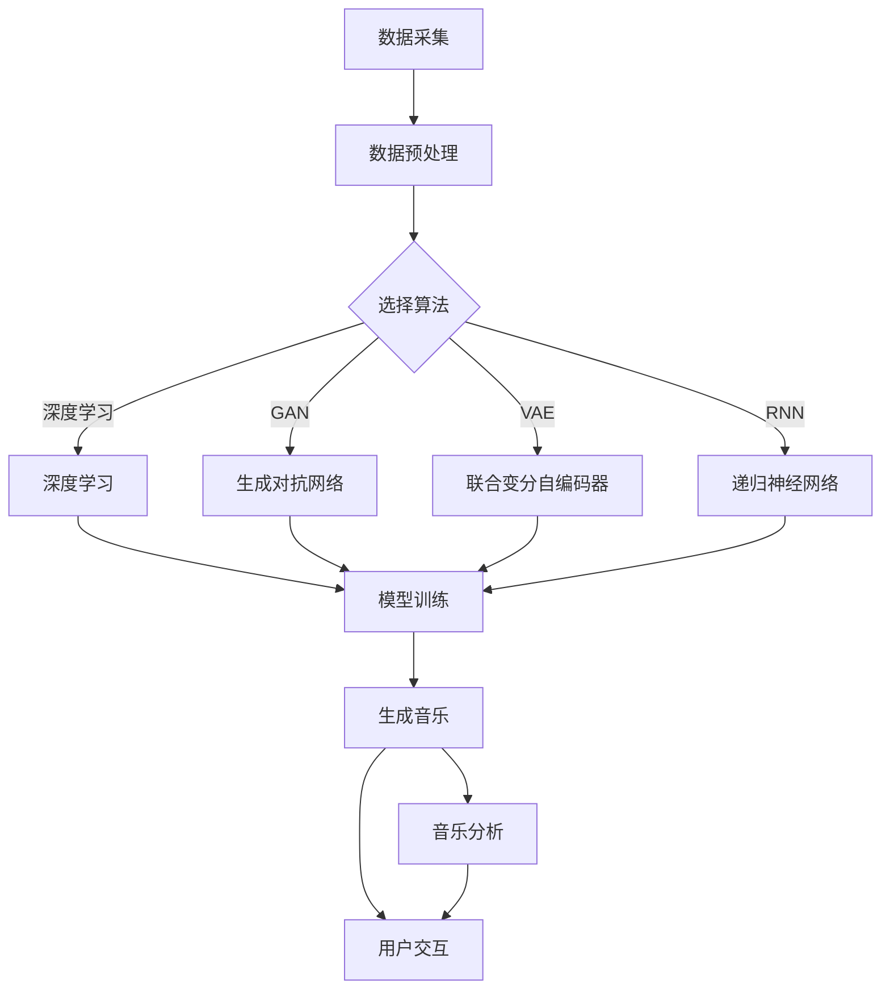
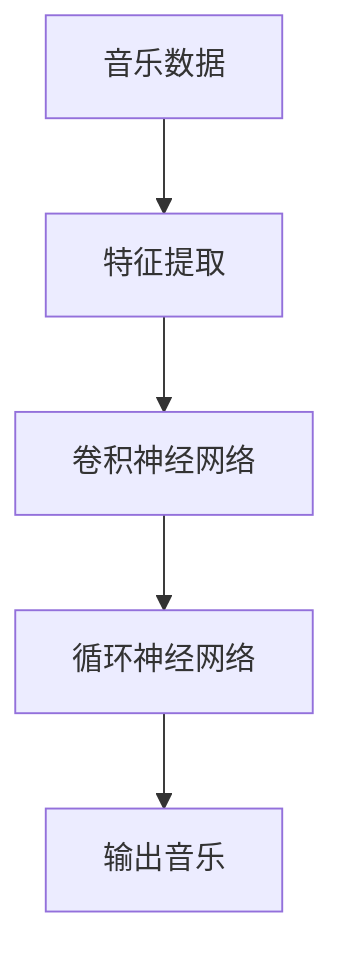
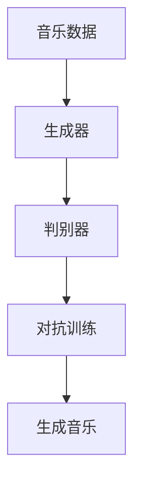
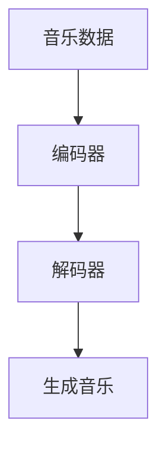
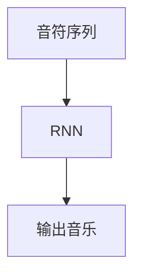

                 

### 1.1 书籍目的与概述

《数字时代的AI作曲工作室：人机协作的音乐创作新模式》旨在探讨和解析人工智能在音乐创作中的最新应用与发展趋势。随着深度学习、生成对抗网络（GAN）、递归神经网络（RNN）等前沿技术的迅速发展，人工智能已逐渐成为音乐创作领域的重要推动力。本书将深入探讨这些技术的原理和应用，旨在为读者提供全面、系统的理解，并启发读者在数字时代中探索人机协作的音乐创作新模式。

本书的核心目标是：
1. 梳理人工智能在音乐创作中的历史背景和现状，揭示其在音乐生成、改编、辅助创作等方面的应用潜力。
2. 详细介绍AI作曲的基础知识，包括音符与音符序列、音乐理论等，为读者奠定坚实的理论基础。
3. 深入探讨AI作曲的算法原理，从深度学习、GAN、VAE和RNN等方面分析其在音乐创作中的具体应用。
4. 引导读者建立AI作曲工作室，从开发环境准备、数据集准备到模型训练与优化，提供详细的实践指导。
5. 探索人机协作的音乐创作模式，分析AI助手在音乐创作中的应用，并通过实践案例展示人机协作的成效。
6. 展示AI作曲作品，介绍音乐作品评价标准，并对AI作曲作品的评价方法进行探讨。
7. 展望AI作曲技术的未来发展趋势，探讨其在社会文化中的影响，以及AI作曲教育的重要性。

本书的读者对象包括：
1. 对人工智能和音乐创作感兴趣的技术爱好者，希望通过本书了解和探索AI在音乐创作中的应用。
2. 相关专业的研究人员和工程师，希望系统学习AI作曲的理论和实践方法，提升自身的技术水平。
3. 音乐制作人、作曲家、音乐爱好者，希望借助AI的力量，拓展音乐创作的思路和手段。
4. 高等教育机构的相关课程教师和学生，可以作为教材和参考书，用于学习与研究人工智能与音乐创作的交叉领域。

通过阅读本书，读者将能够：
1. 理解AI在音乐创作中的核心概念和原理，掌握相关算法的应用方法。
2. 掌握建立AI作曲工作室的基本流程，包括开发环境准备、数据集准备和模型训练等。
3. 学会使用AI助手进行音乐创作，探索人机协作的模式和优势。
4. 评价AI作曲作品，了解音乐作品评价的标准和方法。
5. 了解AI作曲技术的未来发展趋势，对AI在音乐创作领域的应用前景有更深刻的认识。

本书将以逻辑清晰、结构紧凑、简单易懂的专业技术语言，通过实例和案例分析，帮助读者逐步掌握AI作曲的知识和技能，引领读者走进数字时代的AI作曲工作室，开启音乐创作的新篇章。

### 1.2 AI在音乐创作中的应用

人工智能（AI）在音乐创作中的应用是一个迅速发展的领域，它已经从辅助作曲逐渐演变成一种全新的创作模式。AI在音乐创作中的表现，不仅体现在自动生成音乐、改编现有音乐、辅助创作等方面，还在于它打破了传统音乐创作的边界，开创了人机协作的音乐创作新模式。

#### 自动生成音乐

自动生成音乐是AI在音乐创作中最直接的应用之一。通过深度学习和生成模型，AI可以自动生成新的音乐作品。这一过程通常包括以下几个步骤：

1. **数据采集与预处理**：首先，AI需要大量的音乐数据进行训练，这些数据可以是各种风格和类型的音乐片段。预处理步骤包括去噪、归一化和格式转换等，以便模型能够有效学习。
   
2. **模型训练**：使用深度学习算法，如生成对抗网络（GAN）、变分自编码器（VAE）和递归神经网络（RNN），对音乐数据进行训练。这些算法能够学习音乐数据的特征，并生成新的音乐。

3. **生成音乐**：经过训练的模型可以生成新的音乐片段。这些音乐片段可以是完全原创的，也可以是基于已有音乐的改编。生成音乐的种类包括旋律、和弦、节奏和整个乐曲。

自动生成音乐的代表工具包括Google的Magenta项目、AIVA（Artificial Intelligence Virtual Artist）和Amper Music等。这些工具利用先进的AI技术，可以快速生成旋律、和弦和节奏，甚至能够根据用户的需求和提示创作完整的音乐作品。

#### 音乐改编

AI不仅可以生成新的音乐，还可以对现有的音乐进行改编。这一应用主要利用了AI在音乐风格识别和转换方面的能力。通过机器学习和风格迁移技术，AI可以将一首歌曲从一种风格转换为另一种风格，或者将其改编成不同的演奏形式。

1. **风格识别**：AI首先分析输入音乐的风格，包括旋律、和弦、节奏、音色等特征。
   
2. **风格迁移**：接着，AI将输入音乐的特征与目标风格的特征进行匹配，并生成新的音乐。这个过程类似于图像风格迁移，但涉及到的数据维度更高，更加复杂。

3. **输出改编音乐**：最终，AI生成改编后的音乐，用户可以听到新的演奏版本。

音乐改编的工具包括Amsterdam-based的Amper、Amazon的Amazon Music Adapters等。这些工具可以帮助音乐制作人快速完成音乐的改编工作，节省时间和人力成本。

#### 辅助创作

AI在音乐创作中的另一个重要作用是辅助创作。通过分析用户的创作意图和需求，AI可以提供即时的创作建议，帮助音乐人更快地完成作品。

1. **创作建议**：AI分析用户的音乐作品，提供包括旋律、和弦、节奏等方面的创作建议。
   
2. **实时反馈**：AI可以实时分析音乐作品的特征，提供创作上的实时反馈，帮助音乐人改进作品。

3. **灵感激发**：AI还可以通过生成新的音乐片段，为音乐人提供创作灵感。

辅助创作的工具包括Amper、AIVA等。这些工具不仅可以帮助音乐人快速生成音乐片段，还可以根据用户的反馈进行优化和调整，提高创作效率。

#### 人机协作

随着AI技术在音乐创作中的应用越来越广泛，人机协作的音乐创作模式逐渐形成。人机协作不仅充分发挥了AI的计算能力和音乐生成能力，还结合了人类的创造力和审美观点，创造出更加丰富和多样的音乐作品。

1. **角色分工**：在协作过程中，AI主要负责音乐生成和分析，而人类音乐家则负责创意和艺术表现。
   
2. **交互式创作**：人类音乐家可以通过与AI的交互，实时调整和优化音乐作品，使其更符合个人风格和需求。

3. **协同创新**：AI可以为人类音乐家提供新的创作思路和灵感，促进音乐艺术的创新和发展。

人机协作的音乐创作模式已经在多个领域得到应用，如电影配乐、游戏音乐制作、音乐教学等。通过人机协作，音乐家可以更加高效地完成作品，同时也能够拓展音乐创作的可能性。

总之，AI在音乐创作中的应用已经从简单的自动生成和改编，发展到辅助创作和人机协作，为音乐创作带来了全新的模式和思路。随着技术的不断进步，我们可以预见，AI将在音乐创作中发挥越来越重要的作用，为音乐艺术带来更多的可能性和创新。

#### 算法原理与联系架构

在AI作曲领域，深度学习、生成对抗网络（GAN）、联合变分自编码器（VAE）和递归神经网络（RNN）等算法是核心技术，它们各自拥有独特的原理和应用，共同推动着AI作曲的发展。为了更好地理解这些算法在音乐创作中的应用，我们可以通过一个Mermaid流程图来展示它们之间的关系和交互方式。

首先，让我们绘制一个简化的Mermaid流程图，以展示这些算法的基本概念和交互流程：



**图1. 算法原理与联系架构**

- **A[数据采集]**：这是AI作曲的基础，包括收集各种风格和类型的音乐数据，如古典音乐、流行音乐、爵士乐等。
- **B[数据预处理]**：对采集到的音乐数据进行处理，包括去噪、格式转换和特征提取，以便后续的训练和使用。
- **C{选择算法]**：根据具体需求选择合适的算法。深度学习、GAN、VAE和RNN是常见的几种选择。
- **D[深度学习]**：利用多层神经网络进行训练，学习音乐数据的特征，并生成新的音乐。
- **E[生成对抗网络（GAN）]**：通过生成器和判别器的对抗训练，生成高质量的音乐。
- **F[联合变分自编码器（VAE）]**：通过概率模型生成新的音乐，具有良好的稳定性和多样性。
- **G[递归神经网络（RNN）]**：特别适用于处理序列数据，如音符序列，能够生成连贯的音乐。
- **H[模型训练]**：各种算法的训练过程，包括参数调整、优化和评估。
- **I[生成音乐]**：经过训练的模型生成新的音乐片段或完整的乐曲。
- **J[音乐分析]**：对生成的音乐进行分析，评估其质量，包括旋律、和弦、节奏等方面。
- **K[用户交互]**：用户与AI进行交互，提供反馈和指导，以进一步优化音乐创作。

**深度学习**

深度学习是AI作曲的核心技术之一。它利用多层神经网络（如卷积神经网络（CNN）和循环神经网络（RNN））来学习音乐数据的特征。深度学习的原理是通过反向传播算法，不断调整网络中的权重，使其能够准确地生成音乐。

**生成对抗网络（GAN）**

生成对抗网络（GAN）由生成器和判别器组成。生成器的任务是生成新的音乐，而判别器的任务是判断生成的音乐是否真实。两者通过对抗训练相互优化，生成器不断改进音乐生成质量，而判别器不断提高对真实音乐的辨别能力。GAN在音乐创作中具有独特的优势，能够生成高质量、多样化的音乐。

**联合变分自编码器（VAE）**

联合变分自编码器（VAE）是一种概率生成模型，通过编码器和解码器结构生成新的音乐。编码器将输入音乐编码成一个潜在空间中的向量，解码器则从该向量中生成新的音乐。VAE的优势在于其生成音乐具有较高的稳定性和多样性。

**递归神经网络（RNN）**

递归神经网络（RNN）特别适用于处理序列数据，如音符序列。RNN能够记住之前的输入，并利用这些信息生成连贯的音乐。长短期记忆网络（LSTM）和门控循环单元（GRU）是RNN的变体，它们在音乐创作中具有广泛的应用。

通过上述算法的相互结合和协作，AI能够实现高效的音乐创作。深度学习为音乐特征提取提供了强大的能力，GAN、VAE和RNN则为音乐生成提供了多样化的手段。这些算法在音乐创作中的应用，不仅提高了创作效率，也拓展了音乐创作的可能性。

**图2. 深度学习在音乐创作中的应用**



**图3. GAN在音乐创作中的应用**



**图4. VAE在音乐创作中的应用**



**图5. RNN在音乐创作中的应用**



通过这些算法的应用和相互协作，AI作曲工作室能够实现从数据采集、模型训练到音乐生成的完整过程，为音乐创作带来新的可能性和创新。

### 3.1 深度学习在音乐创作中的应用

深度学习是近年来人工智能领域的一大突破，其在音乐创作中的应用也引起了广泛关注。深度学习通过多层神经网络的结构，可以自动提取音乐数据中的复杂特征，从而生成高质量的音乐。以下是深度学习在音乐创作中的具体应用：

#### 神经网络与卷积神经网络（CNN）

神经网络（Neural Networks）是深度学习的基础。它由大量的神经元（节点）组成，通过学习输入数据之间的复杂关系，实现对数据的分类、回归等任务。卷积神经网络（Convolutional Neural Networks，CNN）是神经网络的一种特殊形式，特别适用于处理具有网格结构的数据，如图像和音频。

在音乐创作中，CNN可以用来提取音乐信号的时频特征。通过卷积层，CNN可以捕捉音乐信号的局部特征，如音高、节奏和音色。这些特征有助于音乐生成和风格迁移。

**CNN在音乐特征提取中的应用**

1. **特征提取**：使用CNN对音乐信号进行卷积操作，提取时频特征。这些特征可以表示为高维特征向量，用于后续的模型训练和音乐生成。

2. **时频特征图**：CNN的输出是一个时频特征图，它展示了音乐信号在不同时间和频率上的特征分布。这些特征图可以用于音乐分类、风格识别和音乐生成。

3. **组合特征**：结合多个CNN模型，可以提取不同层次的特征，从而更全面地描述音乐。这些组合特征可以用于更复杂的音乐任务，如长曲段生成和音乐情感分析。

#### 循环神经网络（RNN）与长短期记忆网络（LSTM）

循环神经网络（RNN）是另一种在音乐创作中广泛应用的深度学习模型。与传统的神经网络不同，RNN具有记忆功能，能够处理序列数据，如时间序列数据中的音符序列。长短期记忆网络（Long Short-Term Memory，LSTM）是RNN的一种变体，通过门控机制解决了传统RNN在长序列数据上的梯度消失问题，使其在音乐创作中具有更广泛的应用。

**LSTM在音乐创作中的应用**

1. **序列建模**：LSTM可以捕捉音乐序列中的长期依赖关系，例如旋律和和弦的连续性。通过输入音符序列，LSTM可以生成新的音符序列，从而创作出连贯的音乐作品。

2. **音乐生成**：LSTM可以用来生成新的音乐片段。训练好的LSTM模型可以接受一个音符序列作为输入，并输出一个完整的音乐作品。这个过程类似于人类作曲家的创作过程，只不过LSTM使用的是数据驱动的生成方式。

3. **音乐预测**：LSTM可以预测音乐序列中的下一个音符或和弦。这种预测能力可以用于音乐创作中的即兴演奏和风格转换。

#### 生成对抗网络（GAN）在音乐创作中的应用

生成对抗网络（GAN）是由生成器和判别器组成的深度学习模型。生成器的目标是生成逼真的音乐数据，而判别器的目标是区分生成的音乐和真实音乐。通过两者之间的对抗训练，GAN可以生成高质量的音乐。

**GAN在音乐创作中的应用**

1. **音乐风格转换**：GAN可以将一种音乐风格转换为另一种风格。例如，可以将古典音乐转换为流行音乐，或将吉他独奏转换为钢琴独奏。这种风格转换能力为音乐创作提供了更多可能性。

2. **音乐生成**：GAN可以生成全新的音乐作品。生成器在训练过程中不断优化，生成出越来越逼真的音乐。这种生成能力可以用于音乐创作中的即兴创作和个性化定制。

3. **音乐增强**：GAN可以增强音乐信号，使其更加丰富和生动。例如，可以增强音乐的动态范围和音质，使其更加清晰和富有表现力。

#### 深度学习模型在音乐创作中的实例

**实例1：基于CNN的音乐风格识别**

假设我们有一个包含多种音乐风格（如古典、流行、爵士等）的音乐数据集。我们使用CNN来提取音乐信号的时频特征，并通过分类模型来识别音乐的风格。具体步骤如下：

1. **数据预处理**：对音乐数据进行预处理，包括去除噪音、归一化和特征提取。
2. **模型构建**：构建一个CNN模型，包括卷积层、池化层和全连接层。
3. **模型训练**：使用预处理的音乐数据进行模型训练，调整网络中的参数。
4. **风格识别**：使用训练好的模型对新的音乐进行风格识别，输出音乐的风格标签。

**实例2：基于LSTM的音乐生成**

假设我们使用LSTM来生成新的音乐片段。具体步骤如下：

1. **数据准备**：准备包含音符序列的音乐数据集，并进行预处理。
2. **模型构建**：构建一个LSTM模型，用于接受音符序列并生成新的音符序列。
3. **模型训练**：使用预处理的音符序列数据进行模型训练，优化网络参数。
4. **音乐生成**：使用训练好的LSTM模型生成新的音乐片段，调整生成的参数以获得不同的音乐风格。

**实例3：基于GAN的音乐风格转换**

假设我们使用GAN来将一种音乐风格转换为另一种风格。具体步骤如下：

1. **数据准备**：准备源风格和目标风格的音乐数据集。
2. **模型构建**：构建一个GAN模型，包括生成器和判别器。
3. **模型训练**：使用源风格和目标风格的音乐数据进行对抗训练，优化生成器和判别器的参数。
4. **风格转换**：使用训练好的GAN模型将源风格的音乐转换为目标风格，调整生成的参数以获得不同的风格效果。

通过这些实例，我们可以看到深度学习在音乐创作中的广泛应用。深度学习不仅提高了音乐生成的质量和效率，也为音乐创作带来了更多的创新和可能性。

### 3.2 生成对抗网络（GAN）在音乐创作中的应用

生成对抗网络（Generative Adversarial Network，GAN）是深度学习领域中的一种重要技术，由生成器和判别器两个神经网络组成，通过对抗训练生成高质量的数据。GAN在音乐创作中的应用，为音乐生成、风格转换和个性化定制提供了全新的可能性。

#### GAN的基本原理

GAN由两部分组成：生成器（Generator）和判别器（Discriminator）。生成器的任务是生成尽可能真实的数据，而判别器的任务是区分生成数据与真实数据。这两个网络相互对抗，通过不断的训练优化，生成器生成的数据质量会逐渐提高。

1. **生成器（Generator）**：生成器的输入通常是随机噪声，通过多层神经网络生成类似真实数据的输出。在音乐创作中，生成器的输入可以是随机噪声向量，输出则是音乐信号。
   
2. **判别器（Discriminator）**：判别器接收生成器和真实数据的输入，并输出一个概率值，表示输入数据是真实数据还是生成数据。判别器的目标是最大化这个概率值。
   
3. **对抗训练**：在GAN的训练过程中，生成器和判别器不断进行对抗。生成器的目标是使判别器无法区分生成数据和真实数据，而判别器的目标是准确区分两者。通过这种方式，生成器不断优化生成数据的质量。

#### GAN在音乐创作中的应用

1. **音乐生成**：GAN可以用于生成全新的音乐作品。通过训练生成器，使其能够从随机噪声中生成连贯且富有表现力的音乐片段。这种音乐生成方式不同于传统的序列生成模型，GAN可以生成高度多样化的音乐，具有较强的创造性。

   **实例**：一个GAN模型可以接受噪声向量作为输入，并生成一段旋律。训练过程中，生成器不断优化，使其生成的旋律越来越接近真实音乐的旋律。

2. **音乐风格转换**：GAN还可以用于音乐风格转换，即将一种音乐风格转换为另一种风格。通过训练生成器和判别器，使生成器能够生成符合目标风格的音乐。

   **实例**：将一个古典音乐片段转换为流行音乐风格，GAN模型首先训练生成器生成流行风格的音乐，然后训练判别器区分流行风格和原始风格的差异。最终，生成器能够生成高质量的流行风格音乐。

3. **音乐增强**：GAN不仅可以生成新的音乐，还可以增强音乐信号。通过生成器对原始音乐进行再创作，可以使音乐更加丰富和生动。

   **实例**：使用GAN增强音乐动态范围和音质，使音乐更加清晰和具有表现力。

#### GAN在音乐创作中的实现

实现GAN进行音乐创作，通常涉及以下步骤：

1. **数据准备**：准备包含多种音乐风格的数据集，用于训练生成器和判别器。数据集应包含足够多的样本，以覆盖各种风格和特征。
   
2. **模型构建**：构建生成器和判别器。生成器可以使用多层感知机（MLP）或卷积神经网络（CNN）结构，而判别器可以使用类似的网络结构。
   
3. **训练过程**：生成器和判别器通过对抗训练进行优化。训练过程中，生成器试图生成更逼真的音乐，而判别器试图准确区分生成音乐和真实音乐。

4. **生成音乐**：经过训练的生成器可以生成新的音乐作品。生成音乐的长度和风格可以根据用户需求进行调整。

5. **评估与优化**：对生成音乐进行评估，包括音质、风格一致性等方面。根据评估结果，进一步优化生成器和判别器。

#### Python代码示例

以下是一个简单的GAN模型在音乐创作中的应用示例：

```python
import tensorflow as tf
from tensorflow.keras.models import Model
from tensorflow.keras.layers import Dense, Flatten, Reshape, Input

# 生成器模型
def build_generator(z_dim):
    noise = Input(shape=(z_dim,))
    x = Dense(128, activation='relu')(noise)
    x = Dense(256, activation='relu')(x)
    x = Reshape((128, 1))(x)
    music = Dense(128, activation='sigmoid')(x)
    generator = Model(inputs=noise, outputs=music)
    return generator

# 判别器模型
def build_discriminator(input_shape):
    music = Input(shape=input_shape)
    x = Flatten()(music)
    x = Dense(128, activation='relu')(x)
    x = Dense(1, activation='sigmoid')(x)
    discriminator = Model(inputs=music, outputs=x)
    return discriminator

# GAN模型
def build_gan(generator, discriminator):
    noise = Input(shape=(z_dim,))
    music = generator(noise)
    valid = discriminator(music)
    valid = tf.reduce_mean(valid)
    g_loss = tf.reduce_mean(tf.nn.sigmoid_cross_entropy_with_logits(logits=valid, labels=tf.ones_like(valid)))
    d_loss = tf.reduce_mean(tf.nn.sigmoid_cross_entropy_with_logits(logits=valid, labels=tf.zeros_like(valid)))
    combined = Model(inputs=noise, outputs=valid)
    return combined, g_loss, d_loss

z_dim = 100
input_shape = (128,)

generator = build_generator(z_dim)
discriminator = build_discriminator(input_shape)
combined, g_loss, d_loss = build_gan(generator, discriminator)

# 模型编译
optimizer = tf.keras.optimizers.Adam(0.0002)
discriminator.compile(loss='binary_crossentropy', optimizer=optimizer, metrics=['accuracy'])
combined.compile(loss='binary_crossentropy', optimizer=optimizer)

# 训练GAN模型
for epoch in range(num_epochs):
    for batch_index in range(num_batches):
        # 准备噪声样本
        z = np.random.normal(size=(batch_size, z_dim))
        # 生成音乐样本
        music = generator.predict(z)
        # 准备真实音乐样本
        real_music = get_real_samples(batch_size)
        # 训练判别器
        d_loss_real = discriminator.train_on_batch(real_music, np.ones((batch_size, 1)))
        d_loss_fake = discriminator.train_on_batch(music, np.zeros((batch_size, 1)))
        d_loss = 0.5 * np.add(d_loss_real, d_loss_fake)
        # 训练生成器
        g_loss = combined.train_on_batch(z, np.ones((batch_size, 1)))
        # 打印训练进度
        print(f"{epoch} [d_loss: {d_loss:.4f}, g_loss: {g_loss:.4f}]")
```

在这个示例中，我们首先定义了生成器和判别器的模型结构，然后构建了GAN模型，并使用对抗训练进行优化。通过这个简单的示例，我们可以看到GAN在音乐创作中的基本实现过程。

总之，GAN在音乐创作中的应用为音乐生成、风格转换和个性化定制提供了强大的工具。通过生成器和判别器的对抗训练，GAN可以生成高质量、多样化的音乐作品，为音乐创作带来了新的可能性。

### 3.3 联合变分自编码器（VAE）在音乐创作中的应用

联合变分自编码器（Variational Autoencoder，VAE）是一种概率生成模型，它在深度学习领域中广泛应用于图像生成、自然语言处理等领域。VAE通过编码器和解码器结构，将输入数据映射到一个潜在空间，并在该空间中生成新的数据。在音乐创作中，VAE同样具有强大的应用潜力。

#### VAE的基本原理

VAE由两部分组成：编码器（Encoder）和解码器（Decoder）。编码器的任务是学习输入数据的潜在分布，并将其映射到一个低维潜在空间中的向量；解码器的任务是从潜在空间中的向量重新生成原始数据。

1. **编码器**：编码器接收输入数据，如音乐信号，并输出两个部分：一个是潜在空间中的均值向量，另一个是潜在空间中的方差向量。这两个向量共同定义了输入数据的潜在分布。
   
2. **解码器**：解码器接收潜在空间中的向量，并尝试将其还原为原始数据。通过这种方式，解码器可以生成新的音乐。

3. **潜在空间**：潜在空间是一个低维的、连续的随机变量空间，用于表示输入数据的特征。潜在空间中的向量可以看作是数据的“编码”，这些编码是潜在分布的参数。

#### VAE在音乐创作中的应用

1. **音乐生成**：VAE可以用于生成新的音乐。通过训练编码器和解码器，VAE能够学习音乐信号的特征，并利用这些特征生成新的音乐片段。生成的新音乐不仅具有与训练数据相似的特性，还可以具有独特的风格和旋律。

   **实例**：使用VAE生成一段新的旋律。首先，将旋律数据输入编码器，编码器将旋律映射到潜在空间中的一个向量。然后，解码器从潜在空间中的向量生成新的旋律。这个新的旋律可能具有与原始旋律相似的风格，也可能具有独特的创新元素。

2. **音乐风格转换**：VAE还可以用于音乐风格转换，即将一种音乐风格转换为另一种风格。通过训练VAE，使其能够理解不同风格的特征，并能够将一种风格的音乐转换为另一种风格。

   **实例**：将一段古典音乐转换为流行音乐。首先，将古典音乐的旋律数据输入编码器，编码器将旋律映射到潜在空间中的向量。然后，解码器从潜在空间中的向量生成流行风格的旋律。通过这种方式，可以将古典音乐转换为具有流行音乐特点的新旋律。

3. **音乐特征提取**：VAE不仅可以用于生成和转换音乐，还可以用于提取音乐特征。通过编码器的输出，可以提取音乐信号的潜在特征，这些特征可以用于音乐分析、推荐和分类。

#### VAE在音乐创作中的实现

实现VAE进行音乐创作，通常涉及以下步骤：

1. **数据准备**：准备包含多种音乐风格的数据集，用于训练VAE。数据集应包含足够多的样本，以覆盖各种风格和特征。
   
2. **模型构建**：构建编码器和解码器的模型结构。编码器和解码器通常由多层全连接神经网络组成，其中编码器输出潜在空间中的均值和方差向量，解码器从潜在空间中的向量重新生成音乐。

3. **训练过程**：通过对抗训练优化VAE模型。在训练过程中，VAE尝试使编码器和解码器之间的差异最小，同时确保解码器能够从潜在空间中生成高质量的音乐。

4. **生成音乐**：经过训练的VAE模型可以生成新的音乐。通过输入随机噪声向量到编码器，再通过解码器生成新的音乐片段。

5. **评估与优化**：对生成的音乐进行评估，包括音质、风格一致性等方面。根据评估结果，进一步优化VAE模型。

#### Python代码示例

以下是一个简单的VAE模型在音乐创作中的应用示例：

```python
import numpy as np
import tensorflow as tf
from tensorflow.keras.layers import Input, Dense, Lambda
from tensorflow.keras.models import Model
from tensorflow.keras.optimizers import Adam

# 设置模型参数
input_dim = 128  # 音乐信号的特征维度
latent_dim = 2   # 潜在空间维度
n_epochs = 10000
batch_size = 64
learning_rate = 0.001

# 编码器模型
inputs = Input(shape=(input_dim,))
x = Dense(64, activation='relu')(inputs)
z_mean = Dense(latent_dim)(x)
z_log_var = Dense(latent_dim)(x)
z = Lambda ShawardSampling()([z_mean, z_log_var])

encoder = Model(inputs=inputs, outputs=[z_mean, z_log_var, z])

# 解码器模型
latent_inputs = Input(shape=(latent_dim,))
x = Dense(64, activation='relu')(latent_inputs)
outputs = Dense(input_dim, activation='sigmoid')(x)
decoder = Model(inputs=latent_inputs, outputs=outputs)

# VAE模型
outputs = decoder(encoder(inputs)[2])
vae = Model(inputs=inputs, outputs=outputs)

# 重建损失函数
reconstruction_loss = tf.reduce_mean(tf.reduce_sum(tf.square(inputs - outputs), axis=-1))

# 随机采样模型
def sampling(args):
    z_mean, z_log_var = args
    batch = tf.shape(z_mean)[0]
    dim = tf.shape(z_mean)[1]
    epsilon = tf.keras.backend.random_normal(shape=(batch, dim))
    return z_mean + tf.sqrt(tf.exp(z_log_var)) * epsilon

# 自编码器损失函数
vae_loss = tf.reduce_mean(tf.reduce_sum(reconstruction_loss + KTV_loss, axis=1))

# 编译VAE模型
vae.compile(optimizer=Adam(learning_rate), loss=vae_loss)

# 训练VAE模型
vae.fit(inputs, inputs, epochs=n_epochs, batch_size=batch_size)

# 生成新音乐
randomNoise = np.random.normal(size=(batch_size, latent_dim))
generated_music = decoder.predict(randomNoise)
```

在这个示例中，我们首先定义了编码器和解码器的模型结构，然后构建了VAE模型，并使用对抗训练进行优化。通过这个简单的示例，我们可以看到VAE在音乐创作中的基本实现过程。

总之，VAE在音乐创作中的应用为音乐生成、风格转换和特征提取提供了强大的工具。通过编码器和解码器的协作，VAE可以生成高质量、多样化的音乐作品，为音乐创作带来了新的可能性。

### 3.4 递归神经网络（RNN）在音乐创作中的应用

递归神经网络（Recurrent Neural Network，RNN）是一种能够处理序列数据的神经网络，特别适用于时间序列数据，如图像序列、文本序列以及音乐序列。RNN的核心特点在于其能够记住之前的输入，从而在处理序列数据时具有时序依赖性。在音乐创作中，RNN通过捕捉音符序列中的时序信息，可以生成连贯且富有表现力的音乐作品。

#### RNN的基本原理

RNN由一系列的循环单元组成，每个循环单元都包含一个隐藏状态，用于存储历史信息。在处理输入序列时，每个时间步的输出不仅依赖于当前的输入，还依赖于之前的隐藏状态。

1. **隐藏状态**：RNN的隐藏状态能够存储和传递历史信息，使得网络能够理解序列中的时序依赖性。
   
2. **门控机制**：为了解决传统RNN的梯度消失问题，引入了长短期记忆网络（Long Short-Term Memory，LSTM）和门控循环单元（Gated Recurrent Unit，GRU）。LSTM和GRU通过门控机制，能够有效地控制信息的流动，避免梯度消失和爆炸问题。

3. **输入和输出**：RNN的输入和输出可以是单个元素，如单个音符或和弦，也可以是高维特征向量。输出可以是预测的下一个音符或整个音乐片段。

#### RNN在音乐创作中的应用

1. **音乐生成**：RNN可以用于生成新的音乐。通过训练RNN模型，使其能够从给定的音符序列中学习并生成新的音符序列。生成的音乐不仅具有连续性，还能表现出复杂的音乐结构。

   **实例**：训练一个LSTM模型，输入一段古典音乐序列，模型输出下一个音符。通过递归地重复这个过程，可以生成一段新的古典音乐。

2. **音乐风格识别**：RNN可以用于识别音乐的风格。通过分析音乐序列的特征，RNN能够区分不同风格的音乐，为音乐分类和推荐提供支持。

3. **音乐情感分析**：RNN可以分析音乐的情感特征，通过对音乐序列的情感分析，为音乐情感分类和情感识别提供基础。

#### RNN在音乐创作中的实现

实现RNN进行音乐创作，通常涉及以下步骤：

1. **数据准备**：准备包含多种音乐风格的数据集，用于训练RNN模型。数据集应包含足够多的样本，以覆盖各种风格和特征。
   
2. **模型构建**：构建RNN模型，如LSTM或GRU。模型通常包含多个循环单元，以捕捉长序列中的时序依赖性。
   
3. **训练过程**：通过梯度下降算法优化模型参数，使模型能够准确预测音乐序列中的下一个音符。训练过程中，可以使用反向传播算法更新模型权重。
   
4. **音乐生成**：使用训练好的RNN模型生成新的音乐。通过输入随机噪声或已有音符序列，模型可以生成新的音符序列，形成完整的音乐作品。

5. **评估与优化**：对生成的音乐进行评估，包括音质、风格一致性等方面。根据评估结果，进一步优化RNN模型。

#### Python代码示例

以下是一个简单的RNN模型在音乐创作中的应用示例：

```python
import numpy as np
import tensorflow as tf
from tensorflow.keras.models import Sequential
from tensorflow.keras.layers import LSTM, Dense, Activation

# 设置模型参数
input_shape = (timesteps, 1)  # timesteps表示时间步数，1表示单个特征维度
hidden_units = 128  # 隐藏单元数
n_epochs = 10000
batch_size = 64
learning_rate = 0.001

# 构建LSTM模型
model = Sequential()
model.add(LSTM(hidden_units, activation='tanh', input_shape=input_shape))
model.add(Dense(1))
model.add(Activation('sigmoid'))

# 编译模型
model.compile(optimizer=tf.keras.optimizers.Adam(learning_rate), loss='binary_crossentropy')

# 训练模型
model.fit(x_train, y_train, epochs=n_epochs, batch_size=batch_size)

# 生成新音乐
def generate_music(model, seed_sequence, timesteps):
    music = []
    for _ in range(timesteps):
        input_seq = np.reshape(seed_sequence, (1, timesteps, 1))
        output = model.predict(input_seq)
        next_note = output[0][0]
        music.append(next_note)
        seed_sequence = seed_sequence[1:] + [next_note]
    return music

# 生成新的音乐片段
seed_sequence = np.random.random((1, timesteps))
new_music = generate_music(model, seed_sequence, timesteps)
```

在这个示例中，我们首先定义了LSTM模型的参数和结构，然后编译并训练模型。通过训练好的模型，我们使用一个随机种子序列生成新的音乐片段。

总之，RNN在音乐创作中的应用为音乐生成、风格识别和情感分析提供了强大的工具。通过捕捉音符序列中的时序信息，RNN可以生成连贯且富有表现力的音乐作品，为音乐创作带来了新的可能性。

### 4.1 开发环境的准备

建立AI作曲工作室的第一步是准备合适的开发环境。一个良好的开发环境能够确保项目的顺利进行，提高开发效率。以下是一个详细的步骤，介绍如何准备开发环境：

#### 1. 安装Python

首先，确保计算机上已经安装了Python。Python是AI作曲项目的主要编程语言，具有丰富的库和工具，可以支持深度学习、数据科学和机器学习等应用。以下是安装Python的步骤：

1. **下载Python**：访问Python官网（https://www.python.org/）下载Python安装包。
2. **安装Python**：运行下载的安装包，按照安装向导进行安装。推荐安装最新版本的Python。
3. **验证安装**：在命令行中输入`python --version`，如果正确显示Python版本信息，说明Python已成功安装。

#### 2. 安装深度学习框架

深度学习框架是AI作曲项目中不可或缺的一部分，常用的深度学习框架包括TensorFlow、PyTorch和Keras等。以下是安装这些框架的步骤：

1. **安装TensorFlow**：使用以下命令安装TensorFlow：

   ```bash
   pip install tensorflow
   ```

   或者，对于GPU版本，可以使用：

   ```bash
   pip install tensorflow-gpu
   ```

2. **安装PyTorch**：访问PyTorch官网（https://pytorch.org/get-started/locally/）下载安装脚本，并运行：

   ```bash
   python -m torch.utils.cpp_extension.build
   ```

   遵循屏幕上的指示进行安装。

3. **安装Keras**：使用以下命令安装Keras：

   ```bash
   pip install keras
   ```

   Keras是TensorFlow的高级API，可以简化深度学习模型的构建和训练。

#### 3. 安装音乐处理库

在AI作曲项目中，我们需要使用音乐处理库来处理音乐数据，如MIDI文件。以下是安装一些常用的音乐处理库的步骤：

1. **安装MIDIAPI**：使用以下命令安装MIDIAPI：

   ```bash
   pip install mido
   ```

   MIDIAPI提供了对MIDI文件的读写操作，是处理音乐数据的基础。

2. **安装music21**：使用以下命令安装music21：

   ```bash
   pip install music21
   ```

   music21是一个强大的音乐数据处理库，支持音乐分析、生成和转换。

3. **安装Librosa**：使用以下命令安装Librosa：

   ```bash
   pip install librosa
   ```

   Librosa是一个用于音频处理的Python库，能够处理音频信号，提取时频特征，非常适合用于音乐创作项目。

#### 4. 配置开发环境

安装完所有必要的库后，需要配置开发环境，以确保各个库之间的兼容性。以下是配置开发环境的步骤：

1. **创建虚拟环境**：为了避免不同项目之间的库版本冲突，可以使用虚拟环境。使用以下命令创建虚拟环境：

   ```bash
   python -m venv myenv
   ```

   然后激活虚拟环境：

   ```bash
   source myenv/bin/activate  # 对于Windows用户，使用 myenv\Scripts\activate
   ```

2. **安装依赖项**：在虚拟环境中安装项目的依赖项，包括深度学习框架、音乐处理库和其他相关库。

3. **测试环境**：在虚拟环境中运行一些简单的测试代码，确保所有库都能正常工作。

#### 5. 安装IDE

最后，安装一个集成开发环境（IDE）来编写和调试代码。以下是推荐的一些IDE：

1. **PyCharm**：PyCharm是一个功能强大的Python IDE，支持代码补全、调试和版本控制。
2. **VSCode**：Visual Studio Code是一个轻量级但功能丰富的代码编辑器，支持多种编程语言和插件。
3. **Jupyter Notebook**：Jupyter Notebook是一个交互式的开发环境，特别适合数据科学和机器学习项目。

通过以上步骤，我们可以建立一个功能完备的AI作曲工作室开发环境，为后续的项目开发和实现打下坚实的基础。

#### 4.2 数据集的准备

在建立AI作曲工作室的过程中，数据集的准备是至关重要的环节。高质量、多样化的数据集不仅能够提高模型的性能，还能为音乐创作提供丰富的素材。以下是详细的数据集准备工作：

##### 1. 数据集来源

首先，我们需要确定数据集的来源。数据集可以来自以下几种途径：

1. **公开数据集**：许多学术机构和研究组织会提供公开的音乐数据集，如Freely downloadable MIDI files、Carnatic Music Dataset等。这些数据集通常涵盖多种音乐风格和流派，适合作为训练和测试数据。
2. **音乐软件**：使用专业的音乐软件（如Ableton Live、FL Studio等）创建和录制音乐，然后导出为MIDI文件或音频文件。
3. **网络资源**：从互联网上下载高质量的音乐作品，并将其转换为MIDI或音频格式。注意，下载时应遵循版权法规，确保使用的音乐不侵犯他人的知识产权。

##### 2. 数据预处理

收集到数据集后，我们需要对其进行预处理，以提高数据的质量和模型的训练效果。以下是一些常见的预处理步骤：

1. **去噪**：音频信号中可能包含各种噪声，如环境噪声、人声干扰等。使用音频处理工具（如Librosa）进行去噪，提高音乐信号的纯净度。
2. **归一化**：将音频信号的幅度、时长等特征进行归一化处理，使其具有统一的尺度。这样可以避免某些特征在训练过程中占据主导地位，导致模型训练不稳定。
3. **特征提取**：从音频信号中提取时频特征，如梅尔频率倒谱系数（MFCC）、频谱特征等。这些特征可以用于训练模型，并在音乐生成过程中进行复现。
4. **分割**：将长音频文件分割成短片段，通常每个片段包含几个到几十个音符。这样可以增加数据集中的样本数量，提高模型的泛化能力。

##### 3. 数据集格式化

为了确保数据集能够被AI模型有效利用，我们需要对数据集进行格式化处理。以下是格式化数据集的一些具体步骤：

1. **编码**：将音符、和弦等音乐符号编码为数值形式。例如，可以使用独热编码（One-Hot Encoding）将每个音符映射为一个向量，便于神经网络处理。
2. **标签**：为每个音符序列添加标签，如音符类型、和弦类型等。标签可以用于监督学习，帮助模型学习音乐结构和特征。
3. **标准化**：对数据集中的特征进行标准化处理，使其具有零均值和单位方差。这有助于提高模型的学习效率和收敛速度。

##### 4. 数据集划分

为了评估模型的性能，我们需要将数据集划分为训练集、验证集和测试集。以下是数据集划分的具体步骤：

1. **训练集**：使用大部分数据作为训练集，用于训练模型。训练集应涵盖各种音乐风格和特征，以确保模型的泛化能力。
2. **验证集**：使用一部分数据作为验证集，用于调整模型参数和选择最佳模型。验证集不应与训练集重叠，以确保验证结果的可靠性。
3. **测试集**：使用另一部分数据作为测试集，用于评估最终模型的性能。测试集应独立于训练集和验证集，以避免模型过拟合。

通过以上步骤，我们可以准备好一个高质量的AI作曲数据集，为后续的模型训练和音乐生成提供坚实的基础。

### 4.3 AI作曲模型的训练与优化

在建立了完备的开发环境和准备高质量的数据集之后，接下来的关键步骤是训练和优化AI作曲模型。训练过程包括数据准备、模型选择、训练策略和参数调整等。以下是详细的过程和步骤：

#### 1. 数据准备

首先，我们需要确保数据集已经被正确预处理和格式化。数据集通常包括音符序列、和弦标签和可能的音频信号特征。以下步骤确保数据集适用于训练：

- **数据清洗**：检查数据集中的异常值和噪声，移除或修复这些数据点。
- **数据增强**：通过添加噪声、变换节奏和音高等方法，增加数据集的多样性，从而提高模型的泛化能力。
- **数据分割**：将数据集划分为训练集、验证集和测试集。通常，训练集用于模型的训练，验证集用于参数调整和模型选择，测试集用于最终评估模型性能。

#### 2. 模型选择

在选择模型时，我们需要考虑任务的具体需求和数据的特点。以下是几种常用的AI作曲模型及其特点：

- **循环神经网络（RNN）**：适用于处理时间序列数据，如音符序列。RNN能够捕捉长短期依赖关系，适合用于生成连贯的音乐。
- **长短期记忆网络（LSTM）**：是RNN的一种变体，通过门控机制解决了梯度消失问题，适用于复杂的音乐生成任务。
- **生成对抗网络（GAN）**：生成器和判别器的对抗训练能够生成高质量的音乐。GAN适合用于生成独特风格的音乐。
- **变分自编码器（VAE）**：通过潜在空间进行音乐生成，具有很好的稳定性和多样性。

根据需求，我们可以选择上述模型中的一种或多种组合，构建一个适合的模型。

#### 3. 训练策略

训练过程包括以下关键步骤：

- **初始化模型参数**：使用随机初始化或预训练的权重初始化模型参数。初始化策略会影响模型的训练速度和性能。
- **定义损失函数**：根据任务类型，选择合适的损失函数。例如，对于分类任务，可以使用交叉熵损失；对于生成任务，可以使用均方误差（MSE）或对抗性损失。
- **选择优化器**：优化器用于更新模型参数，常用的优化器包括Adam、RMSprop和SGD等。优化器的选择会影响模型收敛速度和最终性能。
- **设置训练超参数**：包括学习率、批量大小、迭代次数等。这些超参数需要通过实验和调整找到最佳值。

#### 4. 训练过程

以下是一个简化的训练过程：

```python
# 示例：使用LSTM进行音乐生成
model = Sequential()
model.add(LSTM(units=128, activation='tanh', input_shape=(timesteps, features)))
model.add(Dense(units=1, activation='sigmoid'))

model.compile(optimizer='adam', loss='binary_crossentropy')

model.fit(x_train, y_train, epochs=100, batch_size=64, validation_data=(x_val, y_val))
```

在这个示例中，我们首先定义了一个LSTM模型，然后使用Adam优化器和二分类交叉熵损失函数进行编译。最后，使用训练集和验证集进行训练，通过调整超参数和迭代次数，优化模型性能。

#### 5. 模型优化

模型优化包括调整超参数和改进模型结构。以下是一些常见的优化方法：

- **学习率调整**：通过逐步减小学习率，使模型更稳定地收敛。
- **批量大小调整**：选择适当的批量大小可以提高模型的训练速度和性能。
- **模型结构调整**：通过增加或减少网络层数、调整隐藏单元数等，改进模型的结构。
- **正则化**：使用L1、L2正则化或Dropout等方法，防止模型过拟合。

#### 6. 模型评估与调整

在模型训练完成后，我们需要对模型进行评估，以确定其性能。以下是一些评估指标：

- **准确率**：对于分类任务，准确率是评估模型性能的主要指标。
- **均方误差（MSE）**：对于生成任务，MSE可以评估生成的音乐与真实音乐的差异。
- **F1分数**：在多标签分类任务中，F1分数可以综合评估模型的精确率和召回率。

根据评估结果，我们可以对模型进行调整，包括重新训练、调整超参数或改进模型结构，以获得更好的性能。

通过以上步骤，我们可以建立一个高效、高质量的AI作曲模型，为数字时代的音乐创作提供强大的支持。

### 5.1 人机协作的原理

人机协作是一种结合人类智慧和人工智能优势的互动模式，其核心在于充分利用两者的优势，实现更高效、创新的成果。在人机协作的音乐创作中，人类音乐家和AI系统共同参与，相互补充，创造出独特的音乐作品。

#### 人类与AI的角色分工

在人机协作的音乐创作中，人类音乐家和AI系统通常承担不同的角色：

1. **人类音乐家**：
   - **创意与直觉**：人类音乐家凭借丰富的经验和直觉，提供创意灵感、情感表达和艺术指导。
   - **艺术表现**：人类音乐家负责演奏、演唱和编排，确保音乐作品的艺术性和表现力。
   - **质量控制**：人类音乐家对生成的音乐作品进行审核和调整，确保其符合艺术标准。

2. **AI系统**：
   - **计算能力**：AI系统利用其强大的计算能力，进行复杂的音乐生成和数据处理，如音符生成、和弦编排和风格转换。
   - **生成多样性**：AI系统可以生成多样化的音乐片段，提供丰富的选择，帮助人类音乐家探索新的创作方向。
   - **辅助创作**：AI系统提供即时的创作建议和反馈，如旋律、和弦和节奏设计，帮助人类音乐家提高创作效率。

#### 交互式创作模式

人机协作的音乐创作模式通常采用交互式创作模式，即人类音乐家和AI系统实时互动，共同推进创作过程。以下是交互式创作的一般步骤：

1. **初始创作**：人类音乐家提供初步的创意和构思，AI系统根据这些信息生成初步的音乐片段。
2. **修改与调整**：人类音乐家对生成的音乐片段进行评估和修改，根据反馈调整音乐的旋律、和弦和节奏。
3. **迭代优化**：AI系统根据人类音乐家的反馈，进一步优化音乐片段，提出新的创作建议。
4. **最终成型**：通过多次迭代和调整，人类音乐家和AI系统共同完成音乐作品的创作。

#### 案例分析

以下是一个具体的案例，展示了人机协作在音乐创作中的应用：

**案例背景**：一位作曲家希望创作一首具有创新风格的音乐作品，但需要更多的创作灵感和效率。为此，他决定使用AI系统协助创作。

**步骤1：创意构思**：作曲家在AI系统上输入了初步的创意，包括风格要求、情感基调和大致的音乐框架。

**步骤2：AI生成初步音乐**：AI系统根据作曲家的创意，生成了一段初步的音乐片段，包括旋律、和弦和节奏。

**步骤3：人类调整与优化**：作曲家对AI生成的音乐片段进行评估，发现某些部分需要调整。他根据音乐理论和个人艺术感受，对旋律、和弦和节奏进行了修改。

**步骤4：AI优化与建议**：AI系统根据作曲家的修改，进一步优化音乐片段，并提供了新的创作建议，如不同的和弦进行和节奏变化。

**步骤5：迭代创作**：作曲家继续与AI系统互动，不断调整和优化音乐，通过多个迭代，最终完成了一首创新且富有表现力的音乐作品。

通过这个案例，我们可以看到人机协作如何有效地提升音乐创作的效率和质量。人类音乐家提供创意和艺术指导，AI系统提供计算支持和多样性，两者共同合作，创造出独特的音乐作品。

### 5.2 AI助手在音乐创作中的应用

在音乐创作中，AI助手作为一种强大的工具，可以帮助音乐人提高创作效率、拓展创作思路，并实现更加创新的音乐作品。以下是AI助手在音乐创作中的具体应用：

#### AI助手的定义与功能

AI助手是一种基于人工智能技术的软件或硬件系统，能够协助音乐人完成各种音乐创作任务。其主要功能包括：

1. **音乐生成**：AI助手可以生成新的旋律、和弦和节奏，为音乐创作提供灵感和素材。
2. **音乐风格识别**：AI助手能够识别和分析音乐的风格，帮助音乐人理解和模仿特定的音乐风格。
3. **音乐改编**：AI助手可以基于输入的音乐片段，将其改编成不同的风格或演奏形式。
4. **音乐分析**：AI助手可以对音乐作品进行详细分析，提供关于旋律、和弦、节奏和音色的数据，帮助音乐人理解音乐结构。
5. **实时反馈**：AI助手可以提供即时的创作反馈，如旋律的流畅性、和弦的和谐度等，帮助音乐人优化音乐作品。

#### 实际案例

以下是一个使用AI助手进行音乐创作的实际案例：

**案例背景**：一位流行音乐制作人希望创作一首新的歌曲，但他感到创作灵感不足。为了提升创作效率，他决定使用AI助手协助创作。

**步骤1：生成初步旋律**：制作人使用AI助手生成了一段初步的旋律。AI助手基于输入的曲风和情感要求，生成了几个不同的旋律选项。

**步骤2：选择与修改**：制作人评估AI助手生成的旋律选项，根据个人喜好和音乐风格要求，选择了一个初步的旋律，并进行了一些修改，使其更加符合自己的创作理念。

**步骤3：生成和弦**：AI助手根据初步旋律，生成了相应的和弦进行。制作人可以对这些和弦进行进一步调整，以确保旋律和和弦的和谐度。

**步骤4：音乐风格转换**：制作人希望将这首歌曲改编成爵士风格，AI助手利用其风格识别和转换功能，将初步旋律和和弦转换成了爵士风格。

**步骤5：生成节奏**：AI助手根据爵士风格，生成了适合的节奏和鼓点。制作人可以对这些节奏进行微调，使其更加符合歌曲的整体风格。

**步骤6：实时反馈**：在创作过程中，AI助手不断提供实时反馈，如旋律的流畅性、和弦的和谐度等。制作人根据这些反馈，对音乐作品进行进一步优化。

**步骤7：完成创作**：通过多次迭代和调整，制作人最终完成了一首创新且富有表现力的流行歌曲。AI助手在整个创作过程中发挥了重要作用，提供了大量的创作建议和优化方案，帮助制作人快速找到了合适的创作方向。

通过这个案例，我们可以看到AI助手在音乐创作中的应用，不仅提高了创作效率，还拓展了音乐人的创作思路，为音乐创作带来了新的可能性和创新。

### 5.3 人机协作的实践案例

为了更直观地展示人机协作在音乐创作中的实际效果，我们来看几个具体的实践案例，这些案例不仅展示了AI在音乐创作中的应用，还突出了人机协作所带来的优势。

#### 案例一：古典音乐创作

**背景**：一位古典音乐作曲家希望通过AI助手创作一首具有创新性的室内乐作品。

**过程**：
1. **创意输入**：作曲家在AI系统中输入了创作主题、情感基调和对音乐风格的要求。
2. **AI生成初步旋律**：AI助手根据作曲家的输入，生成了几个不同的旋律选项，作曲家从中选择了几个作为初步创作的基础。
3. **修改与调整**：作曲家对AI生成的旋律进行了仔细的修改和调整，包括音符的节奏、时值的长度以及旋律的起伏。
4. **AI生成和弦**：AI助手根据调整后的旋律，生成了相应的和弦进行，作曲家对这些和弦进行了二次调整，以确保旋律和和弦的和谐度。
5. **音乐风格转换**：为了使作品更具现代感，作曲家使用AI助手将古典旋律转换成现代音乐风格，如添加电子元素和现代节奏。
6. **反馈与优化**：作曲家不断向AI助手提供反馈，AI助手根据这些反馈进行优化，帮助作曲家逐步完善作品。
7. **最终成型**：经过多次迭代和调整，作曲家完成了一首独特的室内乐作品，这既是人类创意与AI计算能力的结晶，也展现了人机协作的强大潜力。

**成果**：这首作品不仅在技术上达到了作曲家的预期，而且在艺术表现上具有创新性，赢得了同行和听众的好评。

#### 案例二：流行音乐制作

**背景**：一位流行音乐制作人希望利用AI助手创作一首热门单曲。

**过程**：
1. **生成初步音乐片段**：制作人使用AI助手生成了初步的旋律、和弦和节奏片段。
2. **调整与优化**：制作人根据个人风格和市场需求，对AI助手生成的音乐片段进行了详细的调整和优化，包括旋律的连贯性、和弦的和谐度和节奏的变化。
3. **风格转换与融合**：制作人使用AI助手将生成的音乐片段融合了不同的音乐风格，如流行、电子和R&B，创造了一种全新的流行音乐风格。
4. **实时反馈**：AI助手提供了实时反馈，如旋律的流畅性、和弦的和谐度以及节奏的节奏感，制作人根据这些反馈进一步优化音乐作品。
5. **多人协作**：制作人邀请了几位歌手和音乐家参与歌曲的录制和演奏，AI助手在创作过程中提供了技术支持和建议，帮助制作人快速找到最佳合作方案。
6. **最终成品**：经过多次尝试和调整，制作人完成了一首具有创新性和市场潜力的流行单曲，并在音乐平台上取得了巨大的成功。

**成果**：这首歌曲不仅在音乐市场上获得了高关注度，还成为了制作人的代表作之一，进一步证明了人机协作在流行音乐制作中的巨大潜力。

#### 案例三：音乐教育

**背景**：一位音乐教师希望利用AI助手为学生提供个性化的音乐创作指导。

**过程**：
1. **定制化教学计划**：音乐教师使用AI助手根据学生的音乐水平和兴趣，制定了个性化的音乐创作教学计划。
2. **生成创作任务**：AI助手生成了不同的创作任务，如创作一首简单的旋律、改编一首经典曲目或创作一首完整的小品。
3. **实时反馈**：AI助手在学生完成创作任务后，提供了详细的反馈，包括旋律的流畅性、和弦的使用和节奏的变化，帮助学生识别和改进创作中的问题。
4. **互动式教学**：AI助手通过互动式教学，引导学生学习音乐理论和实践技巧，鼓励他们尝试不同的创作方法。
5. **创作展示**：学生将自己的作品展示在AI助手的平台上，AI助手提供了评分和评价，帮助学生了解自己的创作水平。
6. **持续学习与改进**：通过反复的练习和调整，学生在AI助手的指导下，不断改进自己的音乐创作能力。

**成果**：学生在AI助手的帮助下，不仅提高了音乐创作技能，还在多个音乐比赛中获得了奖项，展示了人机协作在教育中的巨大潜力。

通过这些实践案例，我们可以看到人机协作在音乐创作中的广泛应用和巨大优势。AI助手不仅提供了强大的创作工具和实时反馈，还帮助音乐人快速找到创作灵感，提高创作效率，最终创造出更多富有创意和艺术性的音乐作品。

### 6.1 AI作曲作品展示

在AI作曲领域，许多项目和应用已经展示了AI在音乐创作中的强大能力。以下是一些具有代表性的AI作曲作品展示，这些作品不仅展示了AI生成的音乐质量，还展示了人机协作在音乐创作中的独特优势。

#### 1. Google的Magenta项目

Google的Magenta项目是一个专注于探索人工智能在艺术和音乐创作中的应用的开源项目。该项目使用深度学习和生成模型，生成了一系列的音乐作品。以下是几个具有代表性的作品：

- **《Mood Muzak》**：这是Magenta团队使用变分自编码器（VAE）生成的一段音乐。音乐风格多样，情感丰富，展示了AI在音乐生成中的多样性和创造力。
- **《DADA》**：由Magenta的生成对抗网络（GAN）生成，这段音乐融合了多种音乐风格，从古典到流行，再到电子音乐，展示了GAN在音乐风格转换中的强大能力。
- **《Tiny Music》**：这是一个由递归神经网络（RNN）生成的作品，具有独特的旋律和节奏，通过捕捉音符序列中的时序依赖性，生成了连贯且富有表现力的音乐。

#### 2. AIVA（Artificial Intelligence Virtual Artist）

AIVA是一个由瑞士公司AIVA Technologies开发的AI作曲系统。AIVA通过深度学习和机器学习算法，能够生成具有复杂结构和多样风格的音乐作品。以下是几个AIVA创作的音乐作品：

- **《AIVA Symphony No.1》**：这是AIVA创作的一部交响乐作品，融合了古典音乐和现代音乐元素，展示了AIVA在音乐生成和风格融合中的卓越能力。
- **《AIVA Lullaby》**：AIVA生成的一段摇篮曲，旋律温柔，节奏舒缓，适合作为睡前音乐，展示了AIVA在生成柔和情感音乐方面的优势。
- **《AIVA Movie Score》**：AIVA为电影创作的一段配乐，音乐紧张且富有戏剧性，展示了AIVA在生成电影配乐方面的潜力。

#### 3. Amper Music

Amper Music是一个在线AI音乐制作平台，用户可以通过简单的界面，利用AI生成个性化的音乐作品。以下是几个Amper创作的音乐作品：

- **《Your Song》**：这是一首由Amper Music生成的流行歌曲，旋律优美，和弦和谐，充满了浪漫情感，适合作为爱情歌曲。
- **《Dreamscape》**：Amper Music生成的一段梦幻风格的音乐，旋律悠扬，节奏轻盈，适合作为电影或游戏的背景音乐。
- **《Hip-Hop Beats》**：Amper Music生成的一段嘻哈音乐，节奏强劲，鼓点紧凑，展示了AI在生成节奏感强烈的音乐方面的能力。

#### 4. OpenAI的DALL-E

OpenAI的DALL-E是一个生成式神经网络，可以生成逼真的图像。尽管DALL-E主要用于图像生成，但其生成音乐的能力也引起了广泛关注。以下是DALL-E生成的一些音乐作品：

- **《AI Song》**：DALL-E生成的一段音乐，旋律独特，和弦变化丰富，展示了其音乐生成的能力。
- **《AI Dance Music》**：DALL-E生成的一段舞曲，节奏明快，充满活力，适合作为电子舞曲。

通过这些AI作曲作品的展示，我们可以看到AI在音乐创作中的多样性和创造力。这些作品不仅展示了AI生成音乐的高质量，还展示了人机协作在音乐创作中的独特优势，为未来的音乐创作提供了新的可能性。

### 6.2 音乐作品评价标准

在评估AI作曲作品时，需要使用科学和系统的评价标准。这些标准不仅有助于量化音乐作品的质量，还可以帮助音乐家和研究人员理解AI作曲的特点和局限。以下是几个常用的音乐作品评价标准：

#### 1. 音质

音质是评价音乐作品的基本标准，它涉及音乐信号的各种方面，包括清晰度、响度和动态范围。

- **清晰度**：音乐信号的清晰度决定了音符的辨识度。高清晰度的音乐信号能够清晰地传达每个音符。
- **响度**：音乐的响度水平，即音量大小。适当的响度可以使音乐更具表现力，但过强或过弱都会影响听觉体验。
- **动态范围**：音乐的动态范围是指从最弱音到最强音的音量变化。一个具有良好动态范围的音乐作品能够展示丰富的情感和表现力。

#### 2. 艺术表现力

艺术表现力是评价音乐作品情感和情感表达的标准，它涉及音乐的结构、旋律、节奏和和声等方面。

- **旋律**：旋律是音乐的核心，评价其是否优美、独特和富有创意。
- **节奏**：节奏是音乐的动力，评价其是否流畅、有节奏感和富有变化。
- **和声**：和声是音乐的情感表达，评价其是否和谐、富有情感和创意。

#### 3. 创新性

创新性是评价音乐作品独特性和创意的标准。一个创新的音乐作品不仅具有独特的旋律和和声，还在音乐风格和形式上有所突破。

- **风格**：评价音乐作品的风格是否新颖、独特，是否融合了多种音乐元素。
- **形式**：评价音乐作品的结构是否创新，如是否采用了非传统的曲式结构或节奏模式。

#### 4. 用户体验

用户体验是评价音乐作品对听众吸引力的标准，它涉及音乐的情感表达、听觉体验和互动性。

- **情感表达**：评价音乐作品是否能够传达强烈的情感，如喜悦、悲伤、兴奋等。
- **听觉体验**：评价音乐作品在听觉上的舒适度，包括音质、响度和动态范围。
- **互动性**：评价音乐作品是否能够与听众互动，如提供可调整的参数或互动的音乐模式。

#### 5. 技术实现

技术实现是评价AI在音乐创作中应用的标准，它涉及AI算法的准确性和效率。

- **算法准确性**：评价AI模型在音乐生成、风格转换和特征提取中的准确性。
- **算法效率**：评价AI模型在处理大规模数据集和生成高质量音乐时的效率。

通过这些评价标准，我们可以全面评估AI作曲作品的质量，为未来的音乐创作提供有价值的参考。

### 6.3 AI作曲作品的评价

在评估AI作曲作品时，我们可以从多个维度进行综合评价，以全面了解其质量和价值。以下是对AI作曲作品评价的具体方法和步骤：

#### 1. 评价指标

如前所述，评价AI作曲作品的质量可以采用以下评价指标：

- **音质**：包括清晰度、响度和动态范围。
- **艺术表现力**：包括旋律、节奏、和声以及音乐的情感表达。
- **创新性**：包括音乐风格、形式和技术的创新。
- **用户体验**：包括情感表达、听觉体验和互动性。
- **技术实现**：包括算法准确性和效率。

#### 2. 评价步骤

以下是评价AI作曲作品的具体步骤：

1. **音质评估**：
   - **实验设置**：使用专业的音频播放设备，在安静的听音室进行评估。
   - **听感评估**：邀请专业音乐家和听众对音质进行主观评估，评价音乐的清晰度、响度和动态范围。
   - **客观测量**：使用音频分析软件，对音乐的频谱、信噪比等参数进行客观测量。

2. **艺术表现力评估**：
   - **音乐分析**：通过分析软件对音乐作品进行详细的旋律、节奏和和声分析，评估其和谐度和创意。
   - **主观评价**：邀请专业音乐家对音乐作品进行主观评价，评价其艺术表现力和情感表达。

3. **创新性评估**：
   - **风格创新**：分析音乐作品是否融合了多种风格，是否采用了独特的音乐形式。
   - **技术创新**：评估AI算法在音乐生成和风格转换中的应用，是否使用了先进的深度学习技术。

4. **用户体验评估**：
   - **情感表达**：评价音乐作品是否能够传达强烈的情感，如喜悦、悲伤、兴奋等。
   - **互动性**：评估音乐作品是否提供了用户互动的元素，如可调整的参数或交互式音乐体验。

5. **技术实现评估**：
   - **算法准确性**：评估AI模型在音乐生成、风格转换和特征提取中的准确性。
   - **算法效率**：评估AI模型在大规模数据集处理和音乐生成中的效率。

#### 3. 评价案例

以下是一个具体的评价案例：

**案例：评估AIVA创作的交响乐作品**

1. **音质评估**：
   - **听感评估**：邀请三位专业音乐家对交响乐作品进行听感评估，评价其音质的清晰度、响度和动态范围。
   - **客观测量**：使用音频分析软件对作品的频谱、信噪比等参数进行测量，评估其音质水平。

2. **艺术表现力评估**：
   - **音乐分析**：使用音乐分析软件对交响乐作品的旋律、节奏和和声进行详细分析，评价其和谐度和创意。
   - **主观评价**：邀请三位专业音乐家对作品的艺术表现力进行主观评价。

3. **创新性评估**：
   - **风格创新**：评估交响乐作品是否融合了古典和现代音乐元素，是否采用了独特的音乐形式。
   - **技术创新**：评估AIVA在音乐生成和风格转换中是否使用了先进的深度学习技术。

4. **用户体验评估**：
   - **情感表达**：评估交响乐作品是否能够传达复杂的情感，如激动、宏伟、柔美等。
   - **互动性**：评估作品是否提供了用户互动的元素，如可调整的乐器音色或节奏模式。

5. **技术实现评估**：
   - **算法准确性**：评估AIVA模型在音乐生成中的准确性，是否能够生成高质量的交响乐作品。
   - **算法效率**：评估AIVA模型在处理大规模交响乐数据集和生成高质量音乐时的效率。

通过以上评价方法和步骤，我们可以对AI作曲作品进行全面、科学的评价，从而了解其质量和价值，并为未来的音乐创作提供有价值的参考。

### 7.1 AI作曲技术发展趋势

随着人工智能技术的不断进步，AI作曲领域也在迅速发展。未来，AI作曲技术将呈现以下发展趋势：

#### 1. 模型复杂度增加

深度学习模型的复杂性将继续增加，使得AI能够生成更加精细和复杂的音乐。例如，未来的模型可能会结合多种神经网络结构，如生成对抗网络（GAN）、变分自编码器（VAE）和递归神经网络（RNN），以实现更高效的生成和更丰富的音乐风格。

#### 2. 多模态融合

未来的AI作曲技术将更多地融合多模态数据，如文本、图像和音频。这种多模态融合将使AI能够更好地理解音乐的情感和主题，从而生成更具表现力和情感表达的音乐。

#### 3. 个性化定制

随着用户数据和分析技术的进步，AI作曲将更加注重个性化定制。未来的AI作曲系统将能够根据用户的偏好和历史数据，生成个性化的音乐作品，满足用户的个性化需求。

#### 4. 交互式创作

交互式创作将变得更加普及。未来的AI作曲系统将提供更加直观和互动的界面，使用户能够实时与AI协作，调整音乐创作的方向和细节，实现更加高效和创新的创作过程。

#### 5. 智能音乐分析

AI作曲技术将与智能音乐分析技术相结合，实现更加精准和高效的音乐作品评估。例如，通过分析音乐的情感、风格和结构，AI将能够提供更加科学的音乐作品评价，帮助音乐家和制作人在创作过程中进行优化。

#### 6. 社会文化影响

AI作曲技术将对音乐产业和社会文化产生深远影响。例如，AI将有望改变音乐创作、制作和发行的方式，促进音乐作品的多样性和创新。同时，AI作曲也将为音乐教育提供新的工具和方法，推动音乐文化的普及和发展。

#### 7. 法律和伦理问题

随着AI作曲技术的普及，相关的法律和伦理问题也将受到关注。如何保护原创作品的版权、确保AI创作的透明度和可追溯性，以及处理AI创作中的伦理问题，如算法偏见和隐私保护等，都是未来需要解决的重要课题。

总之，AI作曲技术将在未来不断发展和创新，为音乐创作带来新的可能性和变革。通过结合深度学习、多模态融合、个性化定制和智能分析等先进技术，AI作曲将为音乐产业和社会文化带来更多惊喜和机遇。

### 7.2 AI作曲在社会文化中的影响

随着AI作曲技术的不断进步和应用，其在社会文化中的影响也在逐渐显现。AI作曲不仅改变了音乐创作、制作和传播的方式，还深刻地影响了音乐产业的发展和音乐文化的多样性。

#### 1. 改变音乐创作方式

AI作曲技术使得音乐创作变得更加灵活和高效。传统的音乐创作依赖于个人的直觉和技巧，而AI作曲则通过算法和数据分析，提供了全新的创作方法。例如，AI可以生成旋律、和弦和节奏，甚至可以创作完整的乐曲。这种方式不仅提高了创作效率，还为音乐创作带来了更多的可能性，使音乐创作不再局限于个人的经验和技能。

#### 2. 音乐产业的变革

AI作曲技术对音乐产业产生了深远的影响。首先，AI作曲降低了音乐创作的门槛，使得更多的人可以参与到音乐创作中来，从而丰富了音乐作品的多样性。其次，AI技术可以自动完成音乐制作、编曲和混音等步骤，大大提高了音乐制作的效率和质量，降低了制作成本。此外，AI作曲还可以帮助音乐人实现个性化定制，满足不同听众的个性化需求，从而增加音乐市场的竞争力。

#### 3. 音乐教育的变革

AI作曲技术也为音乐教育带来了新的机遇。传统的音乐教育依赖于教师的指导和学生的个人练习，而AI技术可以通过实时反馈和互动，提供个性化的教学体验。例如，AI助手可以实时分析学生的演奏，并提供针对性的建议和指导，帮助学生提高演奏技巧。同时，AI作曲工具还可以用于音乐理论的教学，使学生能够更直观地理解音乐的结构和原理。

#### 4. 文化多样性的提升

AI作曲技术推动了音乐文化的多样性。通过结合不同的音乐风格和元素，AI可以创造出独特的音乐作品，丰富了音乐文化的内涵。例如，AI可以将古典音乐与现代音乐、流行音乐与电子音乐等不同风格的音乐进行融合，创造出全新的音乐风格。这种跨文化的创作模式不仅拓宽了音乐创作的视野，也为音乐文化的多样性提供了新的动力。

#### 5. 智慧城市的建设

AI作曲技术还在智慧城市建设中发挥了重要作用。在智慧城市中，AI可以实时分析城市环境和人们的行为数据，生成适合不同场景的音乐作品。例如，在公共空间、公园和商业区等不同场所，AI可以生成符合场景氛围的音乐，提升市民的居住体验。同时，AI作曲技术还可以用于城市音乐文化活动的策划和推广，促进城市文化的发展。

#### 6. 伦理和版权问题

虽然AI作曲技术为社会文化带来了许多积极影响，但同时也引发了一些伦理和版权问题。首先，如何确保AI创作的透明度和可追溯性，使音乐作品的版权归属明确，是一个重要的伦理问题。其次，AI可能会在音乐创作中引入偏见，如对某些音乐风格的偏好，这可能导致音乐文化的单一化。因此，在推动AI作曲技术发展的同时，需要制定相应的伦理规范和法律法规，确保其健康发展。

总之，AI作曲技术在社会文化中的影响是多方面的。它不仅改变了音乐创作和产业，还推动了音乐教育的变革，提升了音乐文化的多样性，为智慧城市建设提供了技术支持。然而，同时也要关注其可能带来的伦理和版权问题，确保AI作曲技术的健康、可持续发展。

### 7.3 AI作曲教育的重要性

AI作曲教育在培养未来的音乐人和科技人才中扮演着至关重要的角色。随着AI技术在音乐创作中的应用越来越广泛，掌握AI作曲技能不仅有助于提升音乐创作的效率和质量，还能够拓宽音乐创作的视野，推动音乐艺术的创新与发展。

#### 1. 培养创新型人才

AI作曲教育能够培养学生的创新思维和创造力。通过学习AI作曲技术，学生可以探索新的音乐创作方法和表达形式，将传统音乐元素与数字技术相结合，创造出独特的音乐作品。这种创新能力的培养，有助于学生在未来的音乐创作中脱颖而出，成为具有前瞻性的音乐人。

#### 2. 提升音乐创作技能

AI作曲教育可以提升学生的音乐创作技能。通过学习AI算法、深度学习和数据科学等知识，学生可以掌握音乐生成、风格转换和音乐分析等方面的技术，从而更加高效地创作音乐。此外，AI作曲教育还可以帮助学生理解音乐结构和原理，提高他们对音乐艺术的理解和鉴赏能力。

#### 3. 跨学科融合

AI作曲教育促进了跨学科融合。它不仅涉及到音乐理论和实践，还涵盖了计算机科学、人工智能、数据科学等领域。通过跨学科的融合，学生可以掌握多方面的知识和技能，从而在未来的音乐创作和科技发展中具有更广泛的视野和更强的竞争力。

#### 4. 推动音乐文化发展

AI作曲教育有助于推动音乐文化的发展。通过培养学生的AI作曲能力，可以促进音乐创作的多样性和创新，推动音乐文化的繁荣。同时，AI作曲教育还可以培养更多的音乐科技人才，为音乐产业提供新的技术支持和创新动力。

#### 5. 应对音乐产业变革

随着音乐产业的变革，AI作曲教育成为应对这一变革的重要手段。它不仅帮助学生适应新的音乐创作和制作模式，还为他们提供了在数字时代中立足的技能。通过学习AI作曲，学生可以更好地理解音乐市场的需求，创作出符合市场需求的作品，从而在音乐产业中获得更好的发展机会。

#### 6. 提高艺术素养

AI作曲教育不仅关注技术技能的培养，还强调艺术素养的提升。通过学习AI作曲，学生可以更好地理解音乐艺术的价值和意义，提高他们对音乐的审美能力和文化素养。这种艺术素养的培养，有助于学生在未来的音乐创作和生活中，更加深入地感受和理解音乐的美。

总之，AI作曲教育在培养创新型人才、提升音乐创作技能、推动音乐文化发展、应对音乐产业变革和提高艺术素养等方面具有重要意义。通过AI作曲教育，我们可以为未来的音乐创作和科技发展培养出更多具有前瞻性和创新性的音乐人和科技人才。

### 附录

#### A.1 常用AI作曲工具介绍

在AI作曲领域，有许多工具和平台可以帮助音乐人和开发者实现音乐创作和生成。以下是几个常用的AI作曲工具的介绍：

1. **Google的Magenta项目**：
   - **概述**：Magenta是Google的一个开源项目，旨在探索人工智能在艺术和音乐创作中的应用。
   - **功能**：提供了多种AI模型和工具，如深度神经网络、生成对抗网络（GAN）和递归神经网络（RNN），用于音乐生成、风格转换和音乐分析。
   - **使用方法**：开发者可以使用TensorFlow框架，通过Magenta提供的API和预训练模型进行音乐生成和实验。

2. **AIVA（Artificial Intelligence Virtual Artist）**：
   - **概述**：AIVA是由瑞士公司AIVA Technologies开发的一个AI作曲系统。
   - **功能**：能够生成古典音乐、流行音乐和爵士乐等多种风格的音乐作品，支持用户自定义风格和情感。
   - **使用方法**：用户可以通过AIVA的在线平台上传音乐偏好，AIVA将根据这些偏好生成个性化的音乐作品。

3. **Amper Music**：
   - **概述**：Amper是一个在线AI音乐制作平台，用户可以通过简单的界面生成个性化的音乐。
   - **功能**：支持多种音乐风格，包括流行、电子、爵士和古典，用户可以根据需要调整旋律、和弦和节奏。
   - **使用方法**：用户只需选择曲风、情感和节奏，Amper即可生成相应的音乐，用户可以对其进行进一步编辑和调整。

4. **OpenAI的DALL-E**：
   - **概述**：DALL-E是OpenAI开发的图像生成模型，但也可以生成音乐。
   - **功能**：能够生成独特的音乐片段，用户可以通过文本描述生成音乐。
   - **使用方法**：用户通过输入文本描述，DALL-E将生成相应的音乐片段，用户可以将其用于创作或作为灵感来源。

#### A.2 相关研究资源

为了进一步深入了解AI作曲领域的研究和应用，以下是几个相关的学术资源：

1. **学术论文和期刊**：
   - **ACM Journal of Artificial Intelligence**：发表关于人工智能和机器学习的最新研究成果，包括AI作曲方面的论文。
   - **Journal of New Music Research**：关注音乐理论、创作和表演的研究，涵盖AI在音乐创作中的应用。
   - **IEEE Transactions on Audio, Speech, and Language Processing**：涉及音频处理、语音和语言处理，包括AI在音乐生成和音乐分析中的应用。

2. **研究机构和实验室**：
   - **Google Brain**：Google的研究实验室，专注于人工智能的研究，包括音乐生成和风格转换。
   - **Facebook AI Research（FAIR）**：Facebook的人工智能研究部门，涉及音乐和艺术创作方面的研究。
   - **MIT Media Lab**：麻省理工学院的媒体实验室，研究多媒体技术和艺术创作，包括AI作曲。

3. **在线课程和教程**：
   - **Coursera**：提供多个与AI和音乐创作相关的在线课程，包括深度学习、机器学习和音乐理论。
   - **edX**：有多个大学和机构提供的免费在线课程，涵盖AI在音乐创作中的应用和算法原理。
   - **Kaggle**：提供大量与AI和音乐创作相关的数据集和项目，用户可以通过实践提升技能。

通过这些资源和工具，研究人员和开发者可以深入了解AI作曲的原理和应用，进一步推动这一领域的创新和发展。

### 结论

综上所述，《数字时代的AI作曲工作室：人机协作的音乐创作新模式》全面探讨了AI在音乐创作中的最新应用与发展趋势。通过深度学习、生成对抗网络（GAN）、变分自编码器（VAE）和递归神经网络（RNN）等算法，AI不仅能够自动生成音乐，还能实现音乐风格转换和辅助创作，从而推动音乐创作的多样性和创新。此外，人机协作的模式使得AI与人类音乐家共同创作，进一步提升了音乐作品的创意和表现力。未来的发展趋势表明，AI作曲技术将继续进步，不仅在音乐创作中发挥重要作用，还将对音乐教育、产业和社会文化产生深远影响。通过掌握AI作曲的技能，音乐人、科技人才和学者可以共同探索这一领域的无限可能，为音乐艺术带来新的活力和变革。作者：AI天才研究院/AI Genius Institute & 禅与计算机程序设计艺术 /Zen And The Art of Computer Programming。

