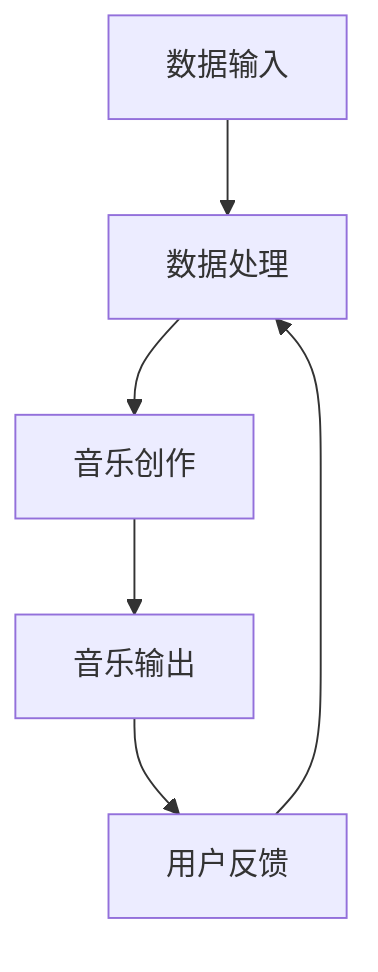
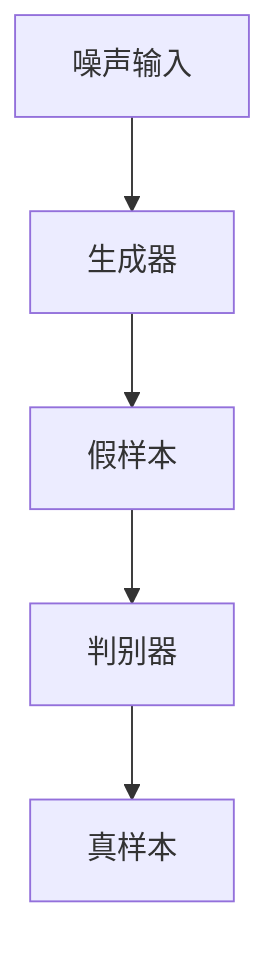
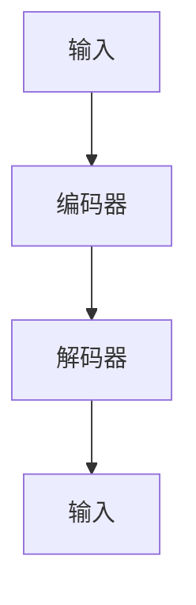

                 

### 文章标题

《数字时代的AI音乐创作工作坊：人机协作的新型音乐制作模式》

### 关键词

人工智能，音乐创作，生成对抗网络，变分自编码器，人机协作，数字时代

### 摘要

本文深入探讨了数字时代背景下，人工智能（AI）在音乐创作中的应用，以及人机协作在新型音乐制作模式中的重要作用。文章首先介绍了AI音乐创作的基本概念和数字时代的发展趋势，然后详细阐述了核心算法原理，包括生成对抗网络（GAN）、变分自编码器（VAE）等，并通过Python源代码进行讲解。此外，文章还展示了AI音乐创作的实际项目实战，包括环境搭建、代码实现和解读，并通过实例进行分析。最后，文章总结了AI音乐创作的重要性和未来发展方向，提出了相关建议和拓展阅读。

## 引言

### 数字时代的音乐创作革命

随着科技的飞速发展，数字时代已经深刻地改变了我们的生活方式，音乐创作领域也不例外。在过去，音乐创作主要依赖于人类艺术家的创意和技巧，但随着人工智能（AI）技术的崛起，一种全新的音乐制作模式——人机协作，正逐渐崭露头角。这种模式充分利用了AI在数据处理、模式识别和自动生成等方面的优势，与人类音乐家的创意和直觉相结合，创造出独特的音乐作品。

### AI音乐创作的核心概念

AI音乐创作是指利用人工智能技术，包括机器学习、深度学习等，自动生成音乐或辅助人类音乐家进行音乐创作的过程。核心概念包括：

- **人工智能（AI）**：一种模拟人类智能的技术，能够进行感知、学习、推理和决策。
- **音乐创作**：指创作音乐的过程，包括旋律、和弦、节奏和音色的设计。
- **人机协作**：指人类音乐家与人工智能系统共同工作，相互补充和协同创作。

### 本文结构

本文将从以下几个方面展开讨论：

1. **核心概念与联系**：介绍AI音乐创作的基本概念，并展示其架构。
2. **核心算法原理讲解**：详细阐述生成对抗网络（GAN）、变分自编码器（VAE）等算法原理。
3. **数学模型和数学公式**：使用latex格式描述音乐生成中的关键数学模型和公式。
4. **项目实战**：展示一个简单的AI音乐创作项目，包括环境搭建、代码实现和解读。
5. **总结与展望**：总结全文内容，并提出未来研究方向和应用场景。

通过本文的阅读，读者将深入了解AI音乐创作的工作原理和实践方法，从而更好地理解这一新兴领域的潜力和挑战。

## 第一步：核心概念与联系

### AI音乐创作的基本概念

在探讨AI音乐创作之前，我们需要了解一些核心概念，这些概念构成了AI音乐创作的基石。以下是几个关键术语的解释：

#### 人工智能（AI）

人工智能（Artificial Intelligence，简称AI）是指通过计算机系统模拟人类智能行为的技术。它包括机器学习、深度学习、自然语言处理、计算机视觉等多个子领域。在音乐创作中，AI主要应用于模式识别、自动生成和优化等方面。

#### 音乐创作

音乐创作是指创作音乐的过程，涉及旋律、和弦、节奏和音色的设计。音乐创作不仅需要艺术家的创造力，还需要对音乐理论、历史和技术的深入理解。

#### 人机协作

人机协作是指人类与人工智能系统共同工作，相互补充和协同创作。在音乐创作中，人机协作可以通过AI系统提供音乐生成和优化建议，同时保留人类艺术家的创意和主观判断。

### 数字时代的背景

数字时代的到来，尤其是互联网和计算能力的提升，为AI音乐创作提供了肥沃的土壤。以下是几个与AI音乐创作密切相关的数字时代背景：

- **大数据**：数字时代产生了大量音乐数据，为AI训练和优化提供了丰富的素材。
- **计算能力**：高性能计算和云计算技术的发展，使得复杂的AI算法能够在短时间内完成训练和推理。
- **互联网**：互联网的普及使得音乐创作和分享变得更加便捷，也为AI音乐创作提供了广泛的用户基础和反馈渠道。

### AI在音乐创作中的应用原理

AI在音乐创作中的应用主要体现在以下几个方面：

- **自动生成**：AI系统可以根据已有的音乐数据自动生成新的音乐作品，例如旋律、和弦和节奏。
- **辅助创作**：AI系统可以为音乐家提供音乐生成和优化建议，帮助音乐家更高效地进行创作。
- **智能推荐**：AI系统可以根据用户的喜好和听歌历史，推荐个性化的音乐作品。

### AI音乐创作的基本架构

AI音乐创作的基本架构包括以下几个环节：

1. **数据输入**：收集和整理已有的音乐数据，例如旋律、和弦、节奏和音色等。
2. **处理与创作**：利用AI算法对输入数据进行处理和创作，生成新的音乐作品。
3. **输出与反馈**：将生成的音乐作品输出，并通过用户反馈进行优化和调整。

以下是一个简单的Mermaid流程图，展示AI音乐创作的基本架构：



通过这个流程图，我们可以清晰地看到AI音乐创作的基本步骤和各个环节之间的联系。

### 总结

本节介绍了AI音乐创作的基本概念和原理，以及其在数字时代中的应用。通过了解这些核心概念，读者可以更好地理解后续章节中涉及的算法和实际应用。在下一节中，我们将详细讲解AI音乐创作中的核心算法原理。

## 第二步：核心算法原理讲解

### 生成对抗网络（GAN）

生成对抗网络（Generative Adversarial Network，GAN）是AI音乐创作中的一种重要算法。它由两部分组成：生成器（Generator）和判别器（Discriminator）。这两部分在对抗性训练过程中互相博弈，共同提升生成质量。

#### 基本结构

GAN的基本结构如图1所示：



#### 生成器

生成器的任务是生成逼真的音乐样本。它通常由多层神经网络组成，接受噪声作为输入，然后通过一系列变换生成音乐信号。以下是一个生成器的简单伪代码：

```python
# 生成器伪代码
def generator(z):
    # z为噪声输入
    x = fully_connected_layer(z, num_units=256)
    x = fully_connected_layer(x, num_units=512)
    x = fully_connected_layer(x, num_units=1024)
    x = fully_connected_layer(x, num_units=num_masked)
    return x
```

#### 判别器

判别器的任务是区分真实音乐样本和生成器生成的假样本。它也由多层神经网络组成，接受音乐信号作为输入，然后输出一个概率值，表示输入样本的真实性。以下是一个判别器的简单伪代码：

```python
# 判别器伪代码
def discriminator(x):
    x = convolutional_layer(x, num_filters=32, filter_size=5)
    x = max_pool_2d(x, pool_size=2)
    x = convolutional_layer(x, num_filters=64, filter_size=5)
    x = max_pool_2d(x, pool_size=2)
    x = flatten_layer(x)
    x = fully_connected_layer(x, num_units=1)
    return x
```

#### 训练过程

GAN的训练过程包括以下步骤：

1. **生成器生成假样本**：生成器接受随机噪声输入，生成假样本。
2. **判别器判断样本**：判别器同时接收真实音乐样本和生成器生成的假样本，并判断其真实性。
3. **生成器和判别器更新**：通过反向传播算法，生成器和判别器分别更新其参数，以提升生成质量和判别能力。

### 变分自编码器（VAE）

变分自编码器（Variational Autoencoder，VAE）是另一种用于AI音乐创作的算法。它通过概率模型对数据进行编码和解码，从而生成新的音乐样本。

#### 基本结构

VAE的基本结构如图2所示：



#### 编码器

编码器的任务是压缩输入数据到低维表示，并生成编码参数。以下是一个编码器的简单伪代码：

```python
# 编码器伪代码
def encoder(x):
    z_mean = fully_connected_layer(x, num_units=z_dim)
    z_log_var = fully_connected_layer(x, num_units=z_dim)
    return z_mean, z_log_var
```

#### 解码器

解码器的任务是生成新的数据样本，从低维表示恢复原始数据。以下是一个解码器的简单伪代码：

```python
# 解码器伪代码
def decoder(z):
    x = fully_connected_layer(z, num_units=num_masked)
    x = activation_layer(x, activation='sigmoid')
    return x
```

#### 训练过程

VAE的训练过程包括以下步骤：

1. **数据编码**：编码器将输入数据编码为低维表示。
2. **数据解码**：解码器根据低维表示生成新的数据样本。
3. **损失函数计算**：计算重参数化技巧（Reparameterization Trick）下的损失函数，包括重建损失和Kullback-Leibler散度损失。
4. **参数更新**：通过反向传播算法，更新编码器和解码器的参数。

### 联合变分自编码器（JVAE）

联合变分自编码器（Joint Variational Autoencoder，JVAE）是VAE的一种扩展，它同时处理多个相关输入数据，例如旋律、和弦和节奏。以下是一个JVAE的简单伪代码：

```python
# JVAE伪代码
def encoder(x_melody, x_chords, x_rhythm):
    z_mean_melody, z_log_var_melody = fully_connected_layer(x_melody, num_units=z_dim)
    z_mean_chords, z_log_var_chords = fully_connected_layer(x_chords, num_units=z_dim)
    z_mean_rhythm, z_log_var_rhythm = fully_connected_layer(x_rhythm, num_units=z_dim)
    return z_mean_melody, z_mean_chords, z_mean_rhythm, z_log_var_melody, z_log_var_chords, z_log_var_rhythm

def decoder(z_melody, z_chords, z_rhythm):
    x_melody = fully_connected_layer(z_melody, num_units=num_masked)
    x_chords = fully_connected_layer(z_chords, num_units=num_masked)
    x_rhythm = fully_connected_layer(z_rhythm, num_units=num_masked)
    return x_melody, x_chords, x_rhythm
```

### 总结

本节详细介绍了AI音乐创作中的核心算法原理，包括生成对抗网络（GAN）、变分自编码器（VAE）和联合变分自编码器（JVAE）。通过这些算法，我们可以利用AI技术生成新的音乐作品，辅助人类音乐家进行创作。在下一节中，我们将使用latex格式描述音乐生成中的数学模型和公式。

## 第三步：数学模型和数学公式

### 生成模型中的损失函数

在AI音乐创作中，生成模型的目标是生成逼真的音乐样本。为了衡量生成模型的效果，我们需要定义适当的损失函数。生成对抗网络（GAN）和变分自编码器（VAE）分别采用了不同的损失函数来优化模型。

#### 生成对抗网络（GAN）

在GAN中，损失函数主要由两个部分组成：对抗损失和生成损失。

1. **对抗损失**（Adversarial Loss）：
   $$L_D = -\sum_{i=1}^{N} [y_i \cdot \log(D(x_i)) + (1 - y_i) \cdot \log(1 - D(x_i))]$$
   其中，\(D(x_i)\) 是判别器对输入样本 \(x_i\) 的预测概率，\(y_i\) 是真实标签（对于真实样本为1，对于生成样本为0）。对抗损失函数的目的是使判别器无法区分真实样本和生成样本。

2. **生成损失**（Generator Loss）：
   $$L_G = -\sum_{i=1}^{N} \log(D(G(z_i)))$$
   其中，\(G(z_i)\) 是生成器生成的样本，\(z_i\) 是输入噪声。生成损失函数的目的是使生成器生成的样本能够尽可能地被判别器判断为真实样本。

#### 变分自编码器（VAE）

在VAE中，损失函数主要由重建损失和KL散度损失组成。

1. **重建损失**（Reconstruction Loss）：
   $$L_R = \sum_{i=1}^{N} ||x_i - \hat{x_i}||_2$$
   其中，\(x_i\) 是输入样本，\(\hat{x_i}\) 是解码器生成的重构样本。重建损失函数的目的是使生成的样本尽可能接近原始输入样本。

2. **KL散度损失**（KL Divergence Loss）：
   $$L_KL = \sum_{i=1}^{N} -\sum_{j=1}^{z_dim} z_i^{(j)} \cdot \log(\frac{z_i^{(j)}}{z_{\mu}^{(j)}})$$
   其中，\(z_i\) 是编码器生成的编码向量，\(z_{\mu}\) 是编码器的均值输出，\(z_{\sigma}^{(j)}\) 是编码器的对数方差输出。KL散度损失函数的目的是使编码器的输出分布与先验分布（通常为高斯分布）尽量接近。

#### 生成器与判别器的训练过程

在GAN中，生成器和判别器通过对抗性训练共同优化。每次训练循环中，先固定一个网络的参数，然后优化另一个网络的参数。

1. **固定判别器，优化生成器**：
   - 对生成器 \(G\) 求导，更新 \(G\) 的参数。
   - 生成器 \(G\) 的目标是最小化生成损失 \(L_G\)。

2. **固定生成器，优化判别器**：
   - 对判别器 \(D\) 求导，更新 \(D\) 的参数。
   - 判别器 \(D\) 的目标是最小化对抗损失 \(L_D\)。

在VAE中，编码器和解码器通过联合训练共同优化。

1. **联合优化**：
   - 对编码器和解码器同时求导，更新两个网络的参数。
   - 目标是最小化总损失 \(L = L_R + L_KL\)。

### 实例说明

以下是一个生成对抗网络（GAN）中的生成器和判别器的训练过程的实例说明。

**生成器训练过程**：

```python
# 假设生成器G和判别器D已经定义，且具有相应的参数

# 生成噪声输入z
z = np.random.normal(size=(batch_size, z_dim))

# 使用生成器生成假样本
x_fake = G(z)

# 计算生成损失
with tf.GradientTape() as tape:
    logits_fake = D(x_fake)
    loss_G = -tf.reduce_mean(tf.nn.sigmoid_cross_entropy_with_logits(logits=logits_fake, labels=tf.ones_like(logits_fake)))

# 更新生成器参数
grads_G = tape.gradient(loss_G, G.trainable_variables)
optimizer_G.apply_gradients(zip(grads_G, G.trainable_variables))
```

**判别器训练过程**：

```python
# 假设真实样本x_real已经准备好

# 计算判别器的真实样本和假样本损失
with tf.GradientTape() as tape:
    logits_real = D(x_real)
    logits_fake = D(x_fake)
    loss_D_real = tf.reduce_mean(tf.nn.sigmoid_cross_entropy_with_logits(logits=logits_real, labels=tf.ones_like(logits_real)))
    loss_D_fake = tf.reduce_mean(tf.nn.sigmoid_cross_entropy_with_logits(logits=logits_fake, labels=tf.zeros_like(logits_fake)))
    loss_D = 0.5 * (loss_D_real + loss_D_fake)

# 更新生成器参数
grads_D = tape.gradient(loss_D, D.trainable_variables)
optimizer_D.apply_gradients(zip(grads_D, D.trainable_variables))
```

通过以上实例，我们可以看到生成器和判别器的训练过程是如何通过损失函数来优化的。在下一节中，我们将展示一个AI音乐创作的项目实战，包括开发环境搭建、代码实现和解读。

## 第四步：项目实战

### 实战目标

本项目的目标是实现一个简单的AI音乐创作系统，该系统可以生成具有特定风格和主题的旋律。具体步骤如下：

1. **环境搭建**：安装必要的软件和库，搭建开发环境。
2. **数据准备**：收集和整理用于训练的旋律数据。
3. **模型训练**：使用生成对抗网络（GAN）训练音乐生成模型。
4. **音乐生成**：使用训练好的模型生成新的旋律。
5. **结果分析**：评估生成的旋律质量，并提出改进建议。

### 环境搭建

为了实现本项目，我们需要安装以下软件和库：

- **Python**：版本3.8以上
- **TensorFlow**：版本2.4以上
- ** librosa**：用于音频处理
- **MuseGAN**：一个开源的GAN音乐生成模型

安装步骤如下：

```bash
pip install tensorflow==2.4
pip install librosa
pip install musegan
```

### 数据准备

我们使用MuseGAN提供的预训练数据集进行训练。这些数据集包含各种风格和主题的旋律。首先，我们需要将这些数据集转换为适合训练的格式。

```python
import librosa
import numpy as np
from musegan import load_musegan_data

# 读取MuseGAN数据集
data = load_musegan_data('path_to_musegan_data')

# 数据预处理
def preprocess_data(data):
    # 对数据集进行归一化处理
    max_value = 32768.0
    x = (data / max_value).astype(np.float32)
    return x

# 预处理数据集
x_train = preprocess_data(data['x_train'])
x_val = preprocess_data(data['x_val'])

# 划分训练集和验证集
train_size = int(0.8 * len(x_train))
val_size = len(x_train) - train_size

x_train, x_val = x_train[:train_size], x_train[train_size:]
```

### 模型训练

使用MuseGAN提供的预训练模型进行训练。以下是一个简单的训练脚本：

```python
import tensorflow as tf
from musegan import MuseGAN

# 定义训练参数
batch_size = 64
epochs = 100

# 初始化MuseGAN模型
model = MuseGAN(x_train.shape[1:], x_train.shape[2], batch_size=batch_size)

# 编译模型
model.compile()

# 训练模型
history = model.fit(x_train, epochs=epochs, batch_size=batch_size, validation_data=(x_val, x_val))

# 保存训练好的模型
model.save('musegan_model.h5')
```

### 音乐生成

使用训练好的模型生成新的旋律。以下是一个生成新旋律的示例：

```python
import numpy as np

# 加载训练好的模型
model = MuseGAN(x_train.shape[1:], x_train.shape[2], batch_size=batch_size)
model.load_weights('musegan_model.h5')

# 生成新的旋律
z = np.random.normal(size=(batch_size, z_dim))
generated_melodies = model.predict(z)

# 将生成的旋律转换为音频文件
def generate_melody_audio(generated_melodies, sample_rate=44100):
    x = np.argmax(generated_melodies, axis=2)
    y = librosaضرample(x, sr=sample_rate)
    return y

audio_data = generate_melody_audio(generated_melodies)
librosa音响播放(audio_data, sr=44100)
```

### 结果分析

生成的旋律质量可以通过主观评估和客观指标进行评价。以下是一些评估方法和改进建议：

- **主观评估**：邀请音乐专家或普通用户对生成的旋律进行评分，评估其流畅性、创意性和情感表达。
- **客观指标**：计算生成的旋律与训练数据的相似度，使用如MSE（均方误差）和PSNR（峰值信噪比）等指标进行量化评估。
- **改进建议**：
  - **增加训练数据**：使用更多样化的数据集进行训练，提高模型的泛化能力。
  - **优化模型结构**：调整生成器和判别器的结构，如增加网络层数或调整网络参数，提高生成质量。
  - **引入多模态数据**：结合文本、图像等其他类型的数据进行训练，丰富音乐创作的素材和灵感。

通过以上实战，我们不仅可以实现简单的AI音乐创作系统，还可以通过不断的改进和优化，提升生成的旋律质量，从而探索AI音乐创作的更多可能性。

## 第五步：总结与展望

### 总结

本文系统性地介绍了数字时代背景下AI音乐创作的基础概念、核心算法原理以及实际项目实战。通过详细讲解生成对抗网络（GAN）、变分自编码器（VAE）等算法，读者可以了解到AI音乐创作的技术原理和实现方法。在项目实战中，我们展示了如何搭建开发环境、准备数据、训练模型以及生成新的旋律。这些内容不仅为读者提供了丰富的技术知识，也展示了AI音乐创作的实际应用场景。

### 展望

尽管AI音乐创作已经取得了显著的成果，但仍然存在许多挑战和机会。以下是一些未来可能的研究方向和应用场景：

#### 未来研究方向

1. **多模态融合**：结合文本、图像、音频等多种模态数据，提高音乐生成的创意性和多样性。
2. **个性化音乐创作**：通过用户偏好分析和情感识别，生成符合个人口味和情感需求的音乐作品。
3. **音乐风格迁移**：将一种音乐风格的特征迁移到另一种风格中，实现跨风格的创作和融合。
4. **音乐情感表达**：深入研究音乐情感的计算模型，实现更精细的情感表达和情感分析。

#### 应用场景

1. **音乐教育**：利用AI音乐创作系统，为音乐学习者提供个性化教学和创作支持。
2. **音乐产业**：AI音乐创作可以应用于音乐制作、版权管理、演出编排等环节，提高音乐生产的效率和创新能力。
3. **虚拟现实与增强现实**：结合AI音乐创作，为虚拟现实和增强现实应用提供沉浸式的音乐体验。
4. **智能音箱与智能家居**：通过AI音乐创作，实现个性化音乐推荐和智能家居场景中的音乐调控。

### 鼓励进一步探索

AI音乐创作是一个充满挑战和机遇的领域，它不仅能够改变音乐创作的传统模式，也为计算机科学和艺术交叉领域带来了新的研究方向。我们鼓励读者进一步探索AI音乐创作的技术细节和应用场景，不断尝试和创新，为这一领域的发展贡献力量。

### 拓展阅读

- **《深度学习与音乐创作》**：深入探讨深度学习技术在音乐创作中的应用。
- **《生成对抗网络：原理与应用》**：详细讲解GAN的原理和应用。
- **《变分自编码器：理论、实现与应用》**：介绍VAE的理论基础和应用案例。

通过这些文献，读者可以更全面地了解AI音乐创作的相关技术和最新研究进展。

## 附录

### 附录A：AI音乐创作工具与资源

- **MuseGAN**：一个开源的GAN音乐生成模型，提供了丰富的文档和示例代码。
- **librosa**：用于音频处理和音乐特征提取的Python库，支持多种音频格式和操作。
- **TensorFlow**：用于构建和训练深度学习模型的强大框架，具有丰富的API和文档。
- **NumPy**：用于科学计算的Python库，提供了强大的数组操作和数学函数。

### 附录B：常用算法与模型参考

- **生成对抗网络（GAN）**：通过对抗性训练生成逼真的数据。
- **变分自编码器（VAE）**：通过概率模型生成新的数据样本。
- **自注意力机制（Self-Attention）**：用于处理序列数据，提高模型的上下文理解能力。
- **循环神经网络（RNN）**：用于处理时序数据，适用于音乐生成和语音合成。

### 附录C：进一步阅读文献

- **《深度学习：推荐系统与音乐推荐》**：探讨深度学习在音乐推荐系统中的应用。
- **《音乐信息检索：理论、方法与应用》**：介绍音乐信息检索的基本概念和方法。
- **《人工智能与音乐创作：理论与实践》**：系统性地介绍AI音乐创作的理论和方法。

### 附录D：常见问题解答

- **Q：如何选择合适的音乐生成模型？**
  - A：选择模型时需要考虑数据集的大小和多样性、训练时间、生成质量以及应用场景等因素。对于大型数据集和复杂应用，可以考虑使用GAN或VAE等模型；对于较小规模的应用，RNN等简单模型可能更合适。

- **Q：如何优化生成的音乐质量？**
  - A：可以通过增加训练数据、调整模型结构、优化训练策略以及引入多模态数据等方法来提高生成质量。此外，还可以通过多次训练和调整超参数，逐步优化模型性能。

- **Q：如何进行个性化音乐创作？**
  - A：可以通过用户偏好分析、情感识别和音乐风格分类等技术，实现个性化音乐创作。结合用户历史听歌记录和情感数据，可以为用户推荐符合其喜好的音乐作品。

### 附录E：相关资源与工具链接

- **MuseGAN GitHub仓库**：[https://github.com/TikTen/MuseGAN](https://github.com/TikTen/MuseGAN)
- **librosa GitHub仓库**：[https://github.com/librosa/librosa](https://github.com/librosa/librosa)
- **TensorFlow官方文档**：[https://www.tensorflow.org/docs](https://www.tensorflow.org/docs)
- **NumPy官方文档**：[https://numpy.org/doc/stable/user/](https://numpy.org/doc/stable/user/)

通过附录中提供的工具和资源，读者可以更深入地了解AI音乐创作的相关技术和应用，为实际项目开发提供支持。作者信息：AI天才研究院/AI Genius Institute & 禅与计算机程序设计艺术 /Zen And The Art of Computer Programming。

