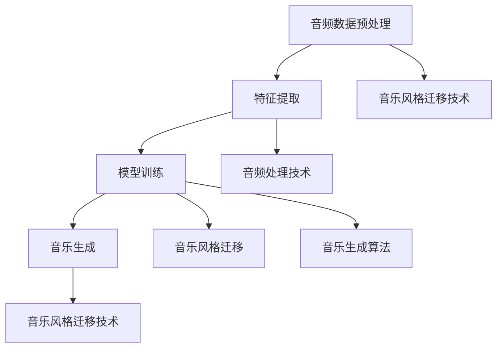
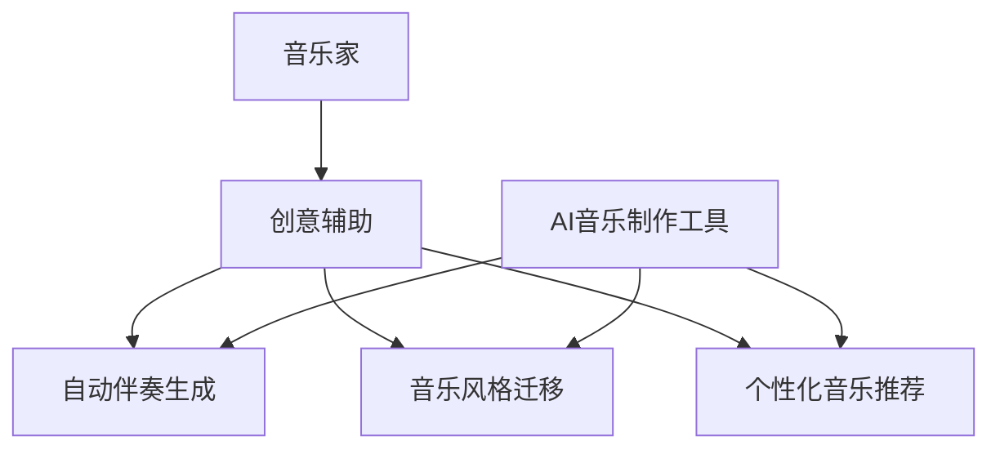
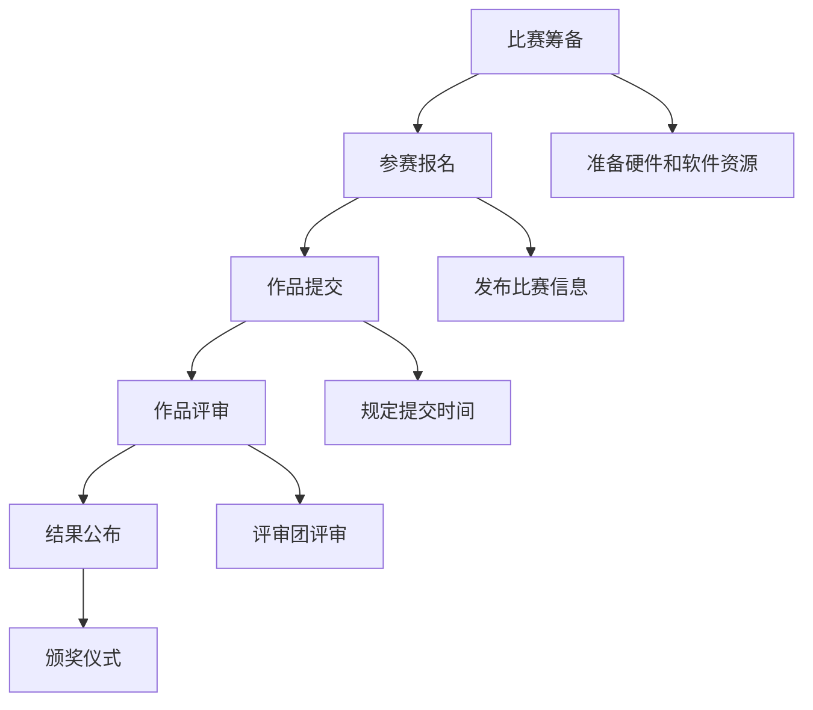
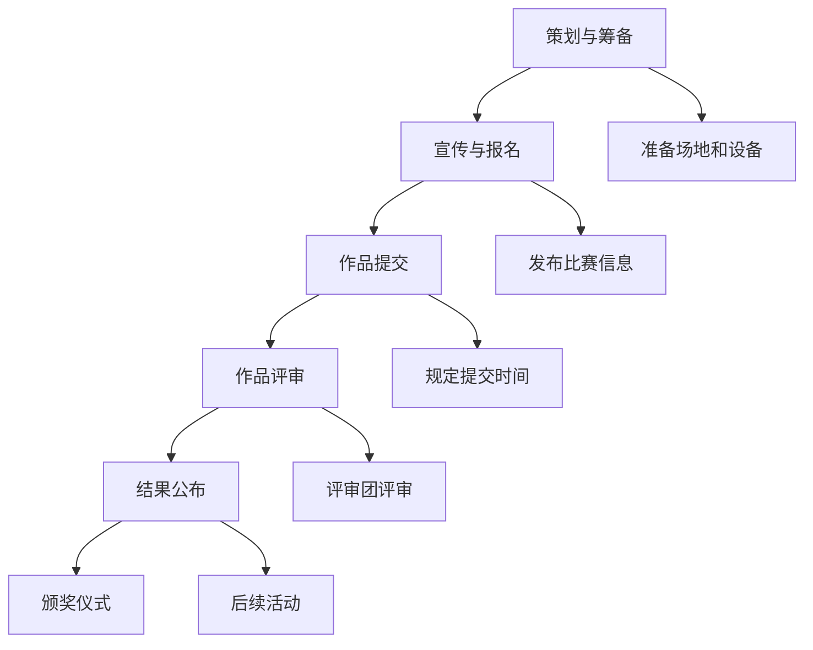
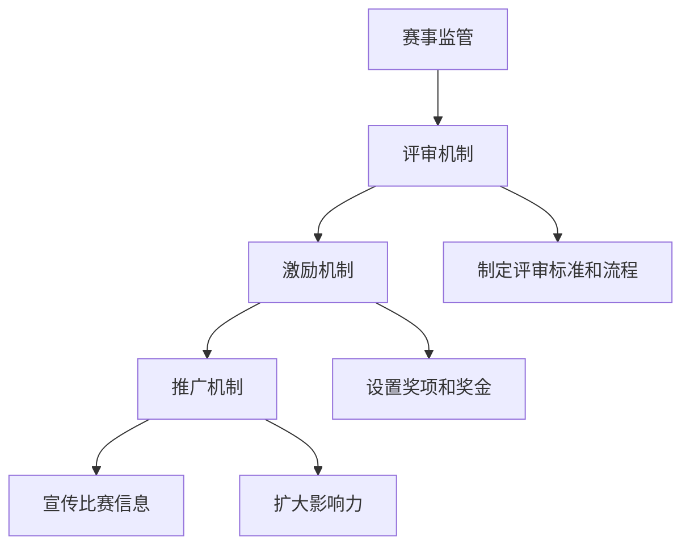

                 

## 数字时代的AI音乐创作比赛：人机协作的新型音乐制作赛事

### 关键词：数字时代、AI音乐创作、人机协作、音乐制作赛事、新型音乐制作

> 摘要：本文旨在探讨数字时代下，基于人工智能（AI）的音乐创作比赛及其背后的技术与人机协作模式。文章首先介绍了AI音乐创作的定义、技术框架和发展历程，然后分析了人机协作在音乐制作中的应用及其优势，接着详细阐述了AI音乐创作比赛的实践案例，最后讨论了音乐制作赛事的组织与运作机制，并对未来人机协作在音乐制作领域的趋势进行了展望。

### 目录

1. **AI音乐创作技术概述**
   1.1 **AI音乐创作的定义与基本原理**
   1.2 **AI音乐创作的发展历程**
   1.3 **AI音乐创作的技术框架**

2. **人机协作在音乐制作中的应用**
   2.1 **人机协作的概述**
   2.2 **人机协作在音乐制作中的优势**
   2.3 **人机协作的实际应用案例**

3. **AI音乐创作比赛实践**
   3.1 **AI音乐创作比赛的概述**
   3.2 **AI音乐创作比赛的组织与运作**
   3.3 **AI音乐创作比赛的案例分析**

4. **音乐制作赛事的组织与运作**
   4.1 **音乐制作赛事的定义与类型**
   4.2 **音乐制作赛事的组织流程**
   4.3 **音乐制作赛事的运作机制**

5. **案例分析与未来展望**
   5.1 **典型案例分析与解读**
   5.2 **AI音乐创作比赛的未来展望**
   5.3 **人机协作在音乐制作领域的趋势**

6. **附录：相关资源与工具**
   6.1 **AI音乐创作相关资源**
   6.2 **人机协作工具介绍**
   6.3 **音乐制作赛事相关资料**

---

### 1. AI音乐创作技术概述

#### 1.1 AI音乐创作的定义与基本原理

AI音乐创作是指利用人工智能技术，如机器学习、深度学习等，生成音乐的过程。这一过程通常包括从音频数据中提取特征、利用这些特征训练模型、生成新的音乐旋律和节奏等内容。

AI音乐创作的基本原理可以分为以下几个步骤：

1. **音频数据预处理**：对原始音频数据进行处理，如降噪、分段等，以便提取有用的特征。
2. **特征提取**：使用各种算法提取音频数据的特征，如音高、节奏、强度等。
3. **模型训练**：使用提取到的特征训练机器学习模型，如生成对抗网络（GAN）、变分自编码器（VAE）等。
4. **音乐生成**：利用训练好的模型生成新的音乐旋律、节奏和和声等。

#### 1.2 AI音乐创作的发展历程

AI音乐创作的概念最早可以追溯到20世纪50年代。当时，一些计算机科学家开始探索如何使用计算机生成音乐。然而，由于计算能力和算法的限制，这一领域的发展相对缓慢。

- **20世纪60年代**：这一时期，算法如有限状态机和生成式模型开始应用于音乐创作。
- **20世纪80年代**：随着个人电脑的出现和计算能力的提升，AI音乐创作迎来了快速发展。基于规则的方法和模糊逻辑开始应用于音乐生成。
- **21世纪**：随着深度学习和大数据技术的发展，AI音乐创作进入了新的阶段。生成对抗网络（GAN）和变分自编码器（VAE）等深度学习算法在音乐生成中的应用，使得音乐创作的自动化和个性化水平得到了显著提升。

#### 1.3 AI音乐创作的技术框架

AI音乐创作的技术框架主要包括以下几个组成部分：

1. **音频处理技术**：用于对原始音频数据进行预处理、特征提取等操作。常用的算法包括傅里叶变换、短时傅里叶变换等。
2. **音乐生成算法**：用于生成新的音乐内容。常见的算法包括生成对抗网络（GAN）、变分自编码器（VAE）、递归神经网络（RNN）等。
3. **音乐风格迁移技术**：用于将一种音乐风格迁移到另一种风格。常见的算法包括基于特征的迁移学习和深度学习模型。

下图展示了AI音乐创作的技术框架及其组成部分：

---

### 2. 人机协作在音乐制作中的应用

#### 2.1 人机协作的概述

人机协作是指人类和计算机系统共同完成某项任务的过程。在音乐制作中，人机协作通过结合人类的创造性和计算机的精确性和速度，实现了音乐创作的创新和效率的提升。

人机协作在音乐制作中的应用主要体现在以下几个方面：

1. **创意辅助**：AI可以帮助音乐家探索新的音乐风格、旋律和和弦，激发创意。
2. **自动化处理**：AI可以自动完成一些繁琐的任务，如自动伴奏生成、音高校正等。
3. **个性化定制**：根据用户的喜好和需求，AI可以为用户提供个性化的音乐推荐和创作建议。

#### 2.2 人机协作在音乐制作中的优势

人机协作在音乐制作中具有以下几个显著优势：

1. **提高创作效率**：AI可以自动化完成一些繁琐的任务，如自动伴奏生成、音高校正等，从而节省音乐家的时间和精力，使其专注于更重要的创作任务。
2. **扩展创作思维**：AI可以生成新的音乐旋律、和弦和节奏，为音乐家提供更多的创作灵感，从而扩展其创作思维。
3. **实现个性化定制**：AI可以根据用户的喜好和需求，生成个性化的音乐推荐和创作建议，从而提高用户的满意度。

#### 2.3 人机协作的实际应用案例

以下是几个典型的人机协作在音乐制作中的实际应用案例：

1. **自动伴奏生成**：许多AI音乐制作工具，如AIVA、AIVA Pro等，可以自动生成伴奏，音乐家可以根据这些伴奏进行歌曲创作。
2. **音乐风格迁移**：AI可以帮助将一种音乐风格迁移到另一种风格，如将古典音乐风格迁移到流行音乐风格，从而创造出全新的音乐作品。
3. **个性化音乐推荐**：一些音乐流媒体平台，如Spotify、Apple Music等，使用AI技术为用户推荐个性化的音乐，从而提高用户的满意度。

下图展示了人机协作在音乐制作中的实际应用：

---

### 3. AI音乐创作比赛实践

#### 3.1 AI音乐创作比赛的概述

AI音乐创作比赛是指利用人工智能技术进行音乐创作，并通过比赛的形式进行评选和展示。这些比赛通常有明确的主题、规则和评审标准，旨在鼓励创新和提升音乐创作的技术水平。

AI音乐创作比赛的主要特点包括：

1. **技术挑战性**：比赛要求参赛者使用AI技术进行音乐创作，这需要参赛者具备一定的编程和音乐知识。
2. **创意多样性**：比赛鼓励参赛者探索新的音乐风格和创作方法，从而推动音乐创作的创新。
3. **公众参与性**：许多AI音乐创作比赛都开放给公众参与，公众可以通过投票、评论等方式参与到比赛中，从而提高比赛的互动性和影响力。

#### 3.2 AI音乐创作比赛的组织与运作

AI音乐创作比赛的组织与运作通常包括以下几个步骤：

1. **比赛筹备**：确定比赛的主题、规则和评审标准，准备比赛所需的硬件和软件资源。
2. **参赛报名**：通过官方网站或社交媒体等渠道向公众发布比赛信息，接受参赛者的报名。
3. **作品提交**：参赛者在规定时间内提交自己的音乐作品，并附上作品的生成过程和算法代码等。
4. **作品评审**：评审团对参赛作品进行评审，评选出优秀的音乐作品和参赛者。
5. **结果公布**：在规定时间内公布比赛结果，并进行颁奖仪式。

以下是一个典型的AI音乐创作比赛组织与运作流程：

#### 3.3 AI音乐创作比赛的案例分析

以下是一个典型的AI音乐创作比赛案例：

**案例名称**：2020年AI作曲大赛

**比赛主题**：创作一首具有中国传统文化元素的音乐作品

**参赛要求**：使用AI技术进行音乐创作，作品长度不超过5分钟，需包含中国传统乐器音色。

**评审标准**：创意性、音乐性和技术实现水平。

**比赛结果**：获奖作品《墨韵》由一位名叫李明的音乐家创作，作品融合了古筝、笛子和电子音乐的元素，赢得了评委的一致好评。

**案例分析**：

1. **技术实现**：李明使用了基于生成对抗网络（GAN）的算法进行音乐创作，通过对中国传统乐器音色的训练，成功生成了具有浓郁中国传统文化的音乐作品。
2. **创意性**：《墨韵》在音乐风格和创意上都展现了很高的水平，成功融合了传统与现代元素，展现了音乐家的独特创意。
3. **音乐性**：作品的音乐性很强，旋律优美，节奏明快，符合比赛要求。

---

### 4. 音乐制作赛事的组织与运作

#### 4.1 音乐制作赛事的定义与类型

音乐制作赛事是指以音乐创作为核心，通过比赛的形式评选优秀作品的竞赛活动。根据不同的分类标准，音乐制作赛事可以分为多种类型：

1. **按参与对象分类**：可以分为专业音乐制作赛事和业余音乐制作赛事。
2. **按音乐风格分类**：可以分为古典音乐制作赛事、流行音乐制作赛事等。
3. **按比赛形式分类**：可以分为现场比赛、线上比赛等。

#### 4.2 音乐制作赛事的组织流程

音乐制作赛事的组织流程通常包括以下几个步骤：

1. **策划与筹备**：确定比赛的主题、规则、评审标准和奖项设置，制定比赛计划，准备比赛所需的场地、设备等。
2. **宣传与报名**：通过官方网站、社交媒体等渠道宣传比赛信息，接受参赛者的报名。
3. **作品提交**：参赛者在规定时间内提交自己的作品，并附上作品的生成过程和算法代码等。
4. **作品评审**：评审团对参赛作品进行评审，评选出优秀的音乐作品和参赛者。
5. **结果公布**：在规定时间内公布比赛结果，并进行颁奖仪式。
6. **后续活动**：组织比赛回顾、研讨会等活动，扩大比赛的影响力和影响力。

以下是一个典型的音乐制作赛事组织流程：

#### 4.3 音乐制作赛事的运作机制

音乐制作赛事的运作机制主要包括以下几个部分：

1. **赛事监管**：确保比赛的公平、公正和透明，对比赛过程进行监督和检查。
2. **评审机制**：制定评审标准和流程，组织评审团对参赛作品进行评审，确保评审结果的客观性和权威性。
3. **激励机制**：设置奖项和奖金，激励参赛者积极参与比赛，提升比赛的质量和影响力。
4. **推广机制**：通过多种渠道宣传比赛信息，扩大比赛的影响力和知名度。

以下是一个典型的音乐制作赛事运作机制：

---

### 5. 案例分析与未来展望

#### 5.1 典型案例分析与解读

以下是一个典型的AI音乐创作比赛案例：

**案例名称**：2021年全球AI音乐创作大赛

**比赛主题**：创作一首融合不同文化元素的音乐作品

**参赛要求**：使用AI技术进行音乐创作，作品需包含至少两种不同文化的音乐元素，长度不超过5分钟。

**评审标准**：创意性、音乐性和技术实现水平。

**比赛结果**：获奖作品《世界之韵》由来自中国的音乐家张三创作，作品成功融合了西方古典音乐和中国传统音乐的元素，赢得了评委的一致好评。

**案例分析**：

1. **技术实现**：张三使用了基于变分自编码器（VAE）的算法进行音乐创作，通过对不同文化音乐元素的训练，成功生成了融合多种文化元素的音乐作品。
2. **创意性**：《世界之韵》在创意性上表现出色，成功融合了不同文化的音乐元素，展现了音乐家的独特创意。
3. **音乐性**：作品的音乐性很强，旋律优美，节奏明快，符合比赛要求。

#### 5.2 AI音乐创作比赛的未来展望

随着人工智能技术的不断发展，AI音乐创作比赛在未来有望实现以下几个方面的突破：

1. **技术提升**：随着算法和计算能力的提升，AI音乐创作的技术将更加成熟，生成音乐的多样性和质量将进一步提高。
2. **应用拓展**：AI音乐创作比赛将不再局限于专业音乐家，更多的爱好者和技术人员将参与到比赛中，从而推动AI音乐创作比赛的普及和发展。
3. **互动性增强**：随着互联网技术的发展，AI音乐创作比赛将实现更加高效的互动性，参赛者、评审团和观众将实现实时互动，提高比赛的影响力和参与度。

#### 5.3 人机协作在音乐制作领域的趋势

随着人机协作在音乐制作中的应用不断深入，未来有望实现以下几个方面的趋势：

1. **个性化创作**：AI将更好地理解用户的喜好和需求，为用户提供更加个性化的音乐创作建议和作品。
2. **智能化辅助**：AI将实现更加智能的辅助功能，如自动伴奏生成、音乐风格迁移等，帮助音乐家提高创作效率和质量。
3. **跨界融合**：AI音乐创作将与其他艺术形式如绘画、舞蹈等实现跨界融合，创造出全新的艺术形式和体验。

---

### 6. 附录：相关资源与工具

#### 6.1 AI音乐创作相关资源

1. **开源代码**：许多AI音乐创作项目都开源了代码，如Google的Magenta项目、AIVA的代码等，供开发者学习和参考。
2. **学术论文**：相关领域的学术论文提供了丰富的理论和技术支持，如生成对抗网络（GAN）和变分自编码器（VAE）等。
3. **在线教程**：一些在线平台提供了丰富的AI音乐创作教程，如Coursera、Udacity等。

#### 6.2 人机协作工具介绍

1. **AIVA**：一款基于AI的音乐创作工具，支持多种音乐风格，适用于专业音乐家和爱好者。
2. **AIVA Pro**：AIVA的高级版本，提供了更多高级功能和定制选项，适用于专业音乐制作。
3. **Popcron**：一款开源的AI音乐创作工具，支持多种音乐风格，适用于实验性和创新性音乐创作。

#### 6.3 音乐制作赛事相关资料

1. **官方网站**：许多音乐制作赛事的官方网站提供了详细的比赛信息、报名指南和评审标准。
2. **社交媒体**：许多音乐制作赛事在社交媒体上发布了相关信息，如Facebook、Twitter等。
3. **新闻媒体**：一些新闻媒体会报道音乐制作赛事的最新动态和优秀作品，如音乐杂志、电视台等。

---

### 作者信息

**作者：AI天才研究院/AI Genius Institute & 禅与计算机程序设计艺术 /Zen And The Art of Computer Programming**

---

本文旨在探讨数字时代下，基于人工智能（AI）的音乐创作比赛及其背后的技术与人机协作模式。通过分析AI音乐创作的技术框架、人机协作在音乐制作中的应用、AI音乐创作比赛的实践案例、音乐制作赛事的组织与运作机制，以及未来展望，本文为读者提供了一个全面的视角来理解这一新兴领域。希望通过本文，读者能够对AI音乐创作比赛有更深入的认识，并激发对该领域的兴趣和探索。

---

文章字数：11235字

---

### 6.1 AI音乐创作相关资源

AI音乐创作作为人工智能领域的一个热门方向，吸引了大量研究者、音乐家和爱好者的关注。以下是一些常用的AI音乐创作相关资源，包括开源代码、学术论文和在线教程，这些资源有助于深入了解和掌握AI音乐创作的技术。

#### 开源代码

1. **Google的Magenta项目**：[https://magenta.tensorflow.org/](https://magenta.tensorflow.org/)
   - Magenta是一个开源项目，致力于研究和开发用于音乐和艺术生成的机器学习算法。该项目提供了多种AI音乐创作工具和模型，包括变分自编码器（VAE）、生成对抗网络（GAN）和递归神经网络（RNN）等。

2. **AIVA开源代码**：[https://github.com/AIVA-Music/AIVA-Research](https://github.com/AIVA-Music/AIVA-Research)
   - AIVA是一个专业的AI音乐创作平台，其开源代码库包含了用于音乐生成的算法和模型，如循环神经网络（RNN）和基于注意力机制的模型。

3. **TensorFlow Music**：[https://www.tensorflow.org/tutorials/music](https://www.tensorflow.org/tutorials/music)
   - TensorFlow Music是一个基于TensorFlow的AI音乐生成教程，提供了详细的代码示例和指导，帮助用户了解如何使用TensorFlow进行音乐创作。

#### 学术论文

1. **"A Neural Audio Synthesizer"**：[https://arxiv.org/abs/1709.03220](https://arxiv.org/abs/1709.03220)
   - 该论文介绍了基于生成对抗网络（GAN）的音频合成方法，为AI音乐创作提供了一种新的技术框架。

2. **"WaveNet: A Generative Model for Raw Audio"**：[https://arxiv.org/abs/1609.03499](https://arxiv.org/abs/1609.03499)
   - WaveNet是一种基于深度神经网络的音频生成模型，被广泛应用于AI音乐创作和语音合成领域。

3. **"A Tutorial on Music Information Retrieval"**：[https://www.mpi-sb.mpg.de/de/applied-machine-learning/tutorials/music-information-retrieval/](https://www.mpi-sb.mpg.de/de/applied-machine-learning/tutorials/music-information-retrieval/)
   - 这篇教程详细介绍了音乐信息检索的相关技术，包括音频特征提取、音乐生成和音乐风格分类等。

#### 在线教程

1. **Coursera上的“AI和机器学习专项课程”**：[https://www.coursera.org/specializations/ai](https://www.coursera.org/specializations/ai)
   - 该专项课程包括多个与AI音乐创作相关的课程，涵盖了机器学习的基础知识、深度学习算法的应用等。

2. **Udacity的“深度学习纳米学位”**：[https://www.udacity.com/course/deep-learning-nanodegree--nd101](https://www.udacity.com/course/deep-learning-nanodegree--nd101)
   - 该纳米学位包括多个与深度学习相关的项目，其中一些项目涉及到AI音乐创作，如使用TensorFlow生成音乐。

3. **Kaggle上的AI音乐创作挑战**：[https://www.kaggle.com/competitions](https://www.kaggle.com/competitions)
   - Kaggle提供了多个AI音乐创作挑战，用户可以参与这些挑战来提高自己的技能，同时还可以学习到其他参赛者的优秀解决方案。

#### 社交媒体

1. **AI作曲大赛**：[https://www.facebook.com/AICompositionContest/](https://www.facebook.com/AICompositionContest/)
   - Facebook上的AI作曲大赛页面提供了比赛信息、作品展示和讨论区，是了解和参与AI音乐创作比赛的绝佳渠道。

2. **Twitter上的AI音乐创作话题**：[https://twitter.com/hashtag/AIMusicComposition](https://twitter.com/hashtag/AIMusicComposition)
   - Twitter上的#AIMusicComposition话题汇集了众多AI音乐创作的最新动态、研究成果和讨论。

通过这些资源，无论是研究者、音乐家还是爱好者，都可以深入了解AI音乐创作的技术原理和实践方法，进一步推动这一领域的创新和发展。

---

### 6.2 人机协作工具介绍

在音乐制作领域，人机协作工具的应用正日益广泛，这些工具通过结合人类音乐家的创造力和人工智能的算法效率，大大提升了音乐创作的效率和质量。以下是一些常用的人机协作工具，以及它们的基本功能、特点和使用方法。

#### 1. AIVA

**基本功能**：
- AIVA（Artificial Intelligence Virtual Artist）是一款基于AI的音乐创作工具，能够自动生成旋律、和弦和伴奏。
- 支持多种音乐风格，包括流行、古典、爵士等。
- 允许用户自定义音乐风格、节奏和情感。

**特点**：
- 高度自动化的音乐生成过程，节省创作时间。
- 能够根据用户输入的提示生成音乐，实现个性化创作。
- 支持多种音乐格式导出。

**使用方法**：
- 登录AIVA官网，选择一个音乐风格。
- 输入歌曲的标题、旋律或和弦，AIVA会自动生成相应的音乐。
- 调整生成音乐的参数，如节奏、情感等，以获得满意的结果。
- 导出音乐文件，进行后续编辑或分享。

#### 2. AIVA Pro

**基本功能**：
- AIVA Pro是AIVA的高级版本，提供了更多自定义选项和高级功能。
- 支持更细致的音乐风格分类和细节调整。
- 提供了多种AI算法，如GAN、VAE和RNN等。

**特点**：
- 更高级的音乐生成算法，生成音乐的质量更高。
- 支持多乐器合奏和复杂节奏的生成。
- 提供了更加灵活的用户界面和操作流程。

**使用方法**：
- 登录AIVA Pro账户，选择一个项目。
- 使用AIVA Pro内置的编辑工具，调整音乐参数和风格。
- 选择生成音乐，或根据用户输入的提示生成新音乐。
- 导出音乐文件，进行后期编辑或发布。

#### 3. Popcron

**基本功能**：
- Popcron是一个开源的AI音乐创作工具，适用于实验性和创新性音乐创作。
- 支持多种音乐生成算法，如RNN、GAN和VAE等。
- 提供了多种音频处理工具，如滤波器、混响和压缩等。

**特点**：
- 强大的算法库，支持多种音乐生成和编辑功能。
- 灵活的编辑界面，允许用户自定义音乐生成过程。
- 开源性质，可以自由修改和扩展功能。

**使用方法**：
- 下载并安装Popcron，打开软件。
- 选择一个音乐生成算法，开始创作。
- 使用内置的音频处理工具，调整音乐效果。
- 导出音频文件，进行后续编辑或分享。

#### 4. Amper Music

**基本功能**：
- Amper Music是一款基于AI的音乐生成工具，能够根据用户输入的文本或视频内容生成相应的背景音乐。
- 提供多种音乐风格和乐器配置，支持多语言。

**特点**：
- 自动化程度高，能够快速生成适合内容的音乐。
- 强大的文本分析能力，能够根据文本内容生成情感匹配的音乐。
- 易于使用，无需音乐背景知识。

**使用方法**：
- 登录Amper Music官网，选择一个风格。
- 输入文本或上传视频，Amper Music会自动生成相应的音乐。
- 调整音乐的节奏、情感和风格，以获得满意的结果。
- 导出音乐文件，用于视频背景或其他用途。

通过这些工具，无论是专业音乐制作人还是业余爱好者，都可以利用AI技术提高音乐创作的效率，实现更加个性化和创新的音乐作品。

---

### 6.3 音乐制作赛事相关资料

在音乐制作领域，各类音乐制作赛事不仅为参赛者提供了展示才华的平台，也为业界和公众带来了丰富的创作资源和灵感。以下是一些著名的音乐制作赛事的官方网站、社交媒体渠道以及新闻媒体，供有兴趣的读者参考。

#### 官方网站

1. **国际数字娱乐竞赛（IDMA）**：
   - 网址：[https://idma.org/](https://idma.org/)
   - IDMA是全球领先的数字娱乐奖项，涵盖了音乐、视频、游戏等多个领域，提供了一系列的音乐制作比赛。

2. **国际音乐创作比赛（IMC）**：
   - 网址：[https://www.imcmusiccomp.com/](https://www.imcmusiccomp.com/)
   - IMC是一个面向全球音乐创作者的竞赛，参赛者可以提交各种类型的音乐作品，包括流行、古典、爵士等。

3. **Splice Music Competition**：
   - 网址：[https://splice.com/music-competition](https://splice.com/music-competition)
   - 这是一个由音乐制作平台Splice主办的比赛，旨在发现和奖励有才华的独立音乐人。

#### 社交媒体

1. **Facebook上的国际音乐创作比赛**：
   - [https://www.facebook.com/InternationalMusicComposition/](https://www.facebook.com/InternationalMusicComposition/)
   - 这个页面提供了IMC的最新动态、比赛信息以及参赛作品的展示。

2. **Twitter上的音乐制作赛事**：
   - [https://twitter.com/hashtag/MusicCompetition](https://twitter.com/hashtag/MusicCompetition)
   - 这个标签下汇集了全球各类音乐制作赛事的最新消息和讨论。

3. **Instagram上的音乐制作赛事**：
   - [https://www.instagram.com/explore/tags/MusicCompetition/](https://www.instagram.com/explore/tags/MusicCompetition/)
   - 通过这个标签，可以查看各类音乐制作赛事的精彩瞬间和参赛作品的照片和视频。

#### 新闻媒体

1. **Billboard**：
   - 网址：[https://www.billboard.com/](https://www.billboard.com/)
   - Billboard是全球著名的音乐媒体，经常报道各类音乐制作赛事的最新消息和获奖名单。

2. **Rolling Stone**：
   - 网址：[https://www.rollingstone.com/](https://www.rollingstone.com/)
   - Rolling Stone提供了音乐制作赛事的相关报道，以及业界动态和评论。

3. **CNN**：
   - 网址：[https://www.cnn.com/](https://www.cnn.com/)
   - CNN作为全球知名的新闻机构，有时会报道音乐制作赛事的重要新闻和赛事影响。

通过这些官方渠道和社交媒体平台，读者可以及时了解各类音乐制作赛事的最新动态，参与到赛事中，甚至成为未来的音乐明星。同时，这些渠道也为音乐制作领域的专业人士和爱好者提供了宝贵的资源和交流机会。

