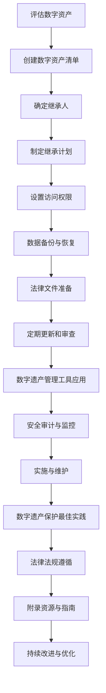

                 

### 文章标题

《数字时代的个人数据管理：数字遗产的规划与保护》

在数字化的今天，个人数据的处理和管理变得愈发重要。随着数字遗产的概念逐渐走入公众视野，如何合理规划与保护这些遗产成为了一个迫切需要解决的问题。本文旨在探讨数字时代个人数据管理的重要性，以及如何进行数字遗产的规划与保护。

### 文章关键词

- 数字时代
- 个人数据管理
- 数字遗产
- 规划与保护
- 隐私安全
- 数据备份
- 加密技术
- 法律法规

### 文章摘要

本文首先介绍了数字时代个人数据管理的重要性和挑战，随后详细探讨了数字遗产的定义与范畴。接着，文章从个人数据隐私保护、数字遗产的识别与分类、个人规划以及法律法规等方面，深入分析了数字遗产的规划与保护策略。此外，文章还探讨了数字遗产保护的技术手段和最佳实践，并指出了未来的发展趋势和面临的伦理与法律挑战。通过本文，读者可以全面了解数字遗产管理的现状和未来发展，为实际操作提供指导。

### 目录

1. **引言**
    - 数字时代的个人数据管理：背景与重要性
    - 数字遗产的概念与范畴
2. **数字时代个人数据管理基础**
    - 个人数据的重要性
    - 数字遗产的定义与规划
    - 数字遗产的保护策略
3. **个人数据隐私与安全**
    - 数据隐私保护法律法规
    - 个人数据安全风险分析
    - 防范与应对措施
4. **数字遗产的规划**
    - 数字遗产的识别与分类
    - 数字遗产的个人规划
    - 数字遗产的法律法规
5. **数字遗产的保护**
    - 数字遗产保护的技术手段
    - 数字遗产保护的最佳实践
6. **数字遗产的伦理与法律挑战**
    - 数字遗产伦理问题
    - 数字遗产的法律挑战
7. **总结与展望**
    - 数字遗产管理的现状与未来趋势
    - 实际操作中的注意事项
    - 拓展阅读

## 引言

### 数字时代的个人数据管理：背景与重要性

随着互联网和移动设备的普及，我们的生活逐渐数字化。从社交媒体到在线购物，从电子支付到远程办公，数字技术已经深入到我们日常生活的方方面面。在这个数字化进程中，个人数据的管理和使用成为了一个不可忽视的重要议题。

个人数据的重要性不言而喻。它不仅包括了我们的基本信息，如姓名、地址、电话号码，还涵盖了我们的行为数据，如浏览历史、消费习惯、社交网络活动等。这些数据在现代社会中具有极高的价值，不仅能够帮助我们提供更加个性化的服务，还可能被不法分子用于非法活动，如身份盗用、隐私泄露等。

数字遗产则是一个更为新兴的概念。它指的是个人在其生前所创造的数字信息，包括但不限于电子文档、电子邮件、社交媒体账号、在线存储的数据等。随着数字技术的发展，数字遗产的重要性日益凸显。不仅因为它是个人身份和记忆的一部分，还因为它是家庭、企业和国家文化传承的重要载体。

数字遗产不仅包括了个人在互联网上留下的痕迹，还涵盖了其数字资产，如虚拟财产、知识产权等。这些遗产在个人去世后，可能会面临一系列的问题，如数据访问权限、内容归属权、隐私保护等。因此，合理规划和保护数字遗产，对于维护个人权益、传承文化记忆具有重要意义。

### 数字遗产的概念与范畴

数字遗产是一个广泛的概念，它涵盖了多种形式的数字信息和个人资产。具体来说，数字遗产可以包括以下几类：

1. **电子文档和数据**：这包括个人电脑、平板电脑、手机等设备上的各种文件，如文档、图片、视频、音频等。这些数据在个人去世后，可能会成为家庭和亲友的重要遗产。

2. **电子邮件和在线通讯记录**：随着电子邮件和即时通讯工具的普及，许多人重要的沟通和信息都保存在这些平台上。这些信息不仅具有法律效力，还承载了个人与家人、朋友、同事之间的情感联系。

3. **社交媒体账号**：社交媒体账号是现代人生活中不可或缺的一部分。从Facebook到Instagram，每个平台上都记录了我们的日常生活和思想动态。如何合理管理这些账号，在个人去世后妥善处理，成为一个重要的课题。

4. **在线存储和云服务**：随着云存储技术的进步，越来越多的个人数据被存储在云端。这些数据包括照片库、文档、音乐等。如何确保这些数据在个人去世后能够安全、便捷地被亲友访问，是数字遗产管理的一个重要方面。

5. **虚拟财产**：在虚拟世界中，如游戏、虚拟货币交易等，个人可能会积累一定价值的虚拟财产。这些财产在现实中可能具有实际价值，但在法律和伦理层面仍然存在诸多争议。

6. **知识产权**：个人在数字领域创作的作品，如博客、软件代码、艺术作品等，都享有知识产权。这些知识产权在个人去世后，可能会涉及到版权转让、收益分配等问题。

7. **数字身份和数字签名**：数字身份是个人在虚拟世界中的唯一标识，而数字签名则是保证数据安全性的重要手段。如何管理这些数字身份和签名，确保其在个人去世后能够顺利继承，是一个技术性但同样重要的课题。

总之，数字遗产的概念和范畴随着技术的发展不断扩展。它不仅包括传统的数字信息，还涵盖了虚拟财产和知识产权等新型资产。如何合理规划和保护这些遗产，成为现代社会中一个不可忽视的重要议题。

### 数字遗产的崛起

数字遗产这一概念的出现，源于现代社会对数据和信息的高度依赖。随着互联网的普及和技术的进步，个人数据的生产、存储和传播变得更加便捷和高效。这不仅改变了我们的生活方式，也深刻影响了我们对遗产的理解和管理。

首先，数字技术的飞速发展使得个人数据的生产和存储变得轻而易取。从手机到电脑，从社交媒体到在线购物平台，每一个设备和服务都在不断地生成和积累我们的数据。这些数据不仅包括我们的个人信息，还涵盖了我们日常生活的方方面面，如消费记录、通讯内容、社交互动等。这些数据在个人去世后，如何被保存、如何被使用，成为了数字遗产管理的重要课题。

其次，互联网的普及和社交网络的兴起，使得个人数据的价值愈发凸显。社交媒体平台如Facebook、Twitter、Instagram等，已经成为我们记录和分享生活的重要工具。这些平台上积累的数据，不仅记录了我们的个人经历和情感，还反映了我们与他人的社交关系和社会网络结构。这些数据在个人去世后，如何被亲友继承和使用，是一个新的挑战。

此外，虚拟财产的兴起，如游戏中的虚拟装备、虚拟货币等，也为数字遗产增添了新的内容。在虚拟世界中，个人可能会积累一定价值的财产。这些财产虽然在现实世界中没有实体，但在数字世界中有其独特的价值和意义。如何确保这些虚拟财产在个人去世后能够得到合理处理和继承，是数字遗产管理中需要考虑的重要问题。

数字遗产的崛起不仅改变了我们对遗产的传统理解，也带来了新的伦理和法律挑战。在数字遗产管理中，如何平衡个人隐私、数据安全与遗产继承，是一个复杂且需要深入探讨的问题。此外，随着数字技术的不断发展，数字遗产的概念和范畴也在不断扩展。从简单的电子文档到复杂的虚拟财产和知识产权，数字遗产的管理和规划变得愈加重要和复杂。

总之，数字遗产的崛起是现代社会数字化的必然结果。它不仅改变了我们对遗产的理解，也带来了新的挑战。如何合理规划和保护数字遗产，确保其能够被妥善继承和使用，是现代社会中一个亟待解决的重要课题。

### 数字遗产的定义与分类

数字遗产，顾名思义，是指个人在生前所创造的数字信息和个人资产。这些数字信息和个人资产在个人去世后，可能会成为家庭、亲友或者继承人所面临的重要遗产。为了更好地管理和保护这些遗产，首先需要对其定义和分类有清晰的认识。

#### 定义

数字遗产通常包括以下几个方面：

1. **电子文档和数据**：这包括个人电脑、平板电脑、手机等设备上的各种文件，如文档、图片、视频、音频等。这些数据记录了个人在工作、生活、学习等各个方面的经历和成就。

2. **电子邮件和在线通讯记录**：随着电子邮件和即时通讯工具的普及，许多人重要的沟通和信息都保存在这些平台上。这些信息不仅具有法律效力，还承载了个人与家人、朋友、同事之间的情感联系。

3. **社交媒体账号**：社交媒体账号是现代人生活中不可或缺的一部分。从Facebook到Instagram，每个平台上都记录了我们的日常生活和思想动态。这些账号不仅包含了个人的信息，还反映了我们与他人的社交关系。

4. **在线存储和云服务**：随着云存储技术的进步，越来越多的个人数据被存储在云端。这些数据包括照片库、文档、音乐等。如何确保这些数据在个人去世后能够安全、便捷地被亲友访问，是数字遗产管理的一个重要方面。

5. **虚拟财产**：在虚拟世界中，如游戏、虚拟货币交易等，个人可能会积累一定价值的虚拟财产。这些财产在现实中可能具有实际价值，但在法律和伦理层面仍然存在诸多争议。

6. **知识产权**：个人在数字领域创作的作品，如博客、软件代码、艺术作品等，都享有知识产权。这些知识产权在个人去世后，可能会涉及到版权转让、收益分配等问题。

7. **数字身份和数字签名**：数字身份是个人在虚拟世界中的唯一标识，而数字签名则是保证数据安全性的重要手段。如何管理这些数字身份和签名，确保其在个人去世后能够顺利继承，是一个技术性但同样重要的课题。

#### 分类

根据数字遗产的性质和内容，可以将其分为以下几个类别：

1. **个人信息类**：这包括电子文档、电子邮件、社交媒体账号等。这些数据通常记录了个人的隐私信息、生活经历和社会关系，对于个人和家庭来说具有极高的情感和实用价值。

2. **虚拟财产类**：这主要指在虚拟世界中的财产，如游戏中的虚拟装备、虚拟货币等。这些财产虽然在现实世界中没有实体，但在虚拟世界中具有其独特的价值和意义。

3. **知识产权类**：这包括个人在数字领域创作的作品，如博客、软件代码、艺术作品等。这些作品不仅反映了个人的才华和创造力，还可能产生实际的经济效益。

4. **数字身份类**：这包括个人在虚拟世界中的身份标识，如账号、数字签名等。这些身份对于个人在数字世界的活动至关重要，如何确保其在个人去世后能够得到妥善处理，是数字遗产管理中的一个重要问题。

#### 数字遗产的重要性和现实意义

数字遗产的重要性和现实意义体现在多个方面：

1. **情感价值**：数字遗产中包含了大量的个人信息和生活记录，这些对于个人和家庭来说具有极高的情感价值。妥善管理和保护这些遗产，有助于保持家庭的情感联系和文化传承。

2. **实用价值**：数字遗产中可能包含了个人的重要文件、知识产权和虚拟财产等，这些在现实中具有实际价值。合理处理和继承这些遗产，有助于维护个人的经济利益。

3. **社会和文化价值**：数字遗产不仅是个人记忆的载体，也是社会和文化的重要组成部分。通过合理管理和保护数字遗产，可以促进文化传承和社会发展。

4. **法律和伦理挑战**：随着数字遗产的兴起，也带来了许多法律和伦理问题，如数据隐私、版权、继承权等。如何应对这些挑战，确保数字遗产的合法和合理管理，是一个重要的课题。

总之，数字遗产的定义与分类对于理解和管理这些遗产具有重要意义。通过对其定义和分类的深入探讨，我们可以更好地认识和应对数字遗产带来的挑战和机遇，确保其在个人和家庭中的合理继承和保护。

### 数字遗产规划的重要性

在数字化的今天，个人数据的生成和积累速度之快令人惊叹。这些数据不仅涵盖了我们的个人信息、生活经历和社交互动，还反映了个人的知识、技能和创造力。随着数字技术的发展，个人数据的存储和传播方式也日益多样化。在这种情况下，数字遗产的规划显得尤为重要。

首先，数字遗产的规划有助于个人隐私的保护。个人数据在未经授权的情况下被访问或使用，可能会导致隐私泄露、身份盗用等严重后果。通过合理的规划，我们可以设置访问权限、数据备份和安全措施，确保个人数据在个人去世后能够得到妥善保护，防止被未经授权的人员访问和使用。

其次，数字遗产的规划有助于个人财产的传承和利用。随着虚拟财产和知识产权的兴起，数字遗产不仅仅是个人信息，还可能包含了一定的经济价值。例如，个人在游戏中积累的虚拟装备、虚拟货币，或者在数字平台上创作的作品等。通过合理的规划，这些财产可以在个人去世后得到有效继承和利用，确保其经济价值最大化。

此外，数字遗产的规划对于文化的传承具有重要意义。个人在数字平台上的创作，如博客、视频、艺术作品等，不仅是个人才华的体现，也是文化记忆的一部分。通过合理的规划，这些作品可以传承给后人，成为文化遗产的重要组成部分。

最后，数字遗产的规划有助于应对未来的法律和伦理挑战。随着数字技术的发展，相关的法律法规也在不断更新和完善。通过提前规划，我们可以更好地了解和应对这些法律变化，确保数字遗产的继承和管理符合法律规定，减少潜在的法律风险。

### 数字遗产规划的原则

为了确保数字遗产的合理规划和管理，我们需要遵循一些基本原则。以下是一些关键原则及其具体应用：

1. **全面性原则**：数字遗产规划需要全面考虑个人在数字领域所涉及的各个方面，包括个人信息、虚拟财产、知识产权等。在规划过程中，应详细记录个人所有的数字资产和数字身份，确保不遗漏任何重要内容。

2. **安全性原则**：数字遗产的安全性至关重要。在规划过程中，应采取多种安全措施，如数据加密、多重身份验证、备份和恢复策略等，确保数字遗产在个人去世后不会受到未经授权的访问和篡改。

3. **继承性原则**：数字遗产的继承性是规划的一个重要方面。规划者应明确指定数字遗产的继承人，并确保继承人具备必要的技能和权限来访问和管理这些遗产。此外，还应制定详细的继承计划，包括数据访问权限、财产分配等。

4. **灵活性原则**：数字遗产规划应具有一定的灵活性，以应对未来的变化和不确定性。例如，规划者可以设置定期更新和调整规划的机制，确保规划内容始终与实际情况相符。

5. **法律合规性原则**：数字遗产规划必须遵守相关法律法规。规划者应了解和遵循数据隐私保护、知识产权保护等法律法规，确保数字遗产的继承和管理符合法律规定，减少法律风险。

6. **伦理道德原则**：数字遗产规划还应考虑伦理道德问题。规划者应在规划过程中充分考虑个人隐私、数据安全、公平正义等伦理问题，确保规划方案既合法又符合伦理道德标准。

### 数字遗产规划的具体步骤

数字遗产的规划是一个复杂而细致的过程，需要考虑多个方面。以下是数字遗产规划的具体步骤：

1. **评估个人数字资产**：首先，需要对个人所有的数字资产进行全面的评估。这包括个人信息、虚拟财产、知识产权等。可以创建一个详细的数字资产清单，记录每个资产的名称、类型、价值、存储位置等。

2. **确定继承人**：在规划过程中，应明确指定数字遗产的继承人。继承人可以是家庭成员、亲友或专业机构。确保继承人了解继承内容，并具备必要的技能和权限来访问和管理数字遗产。

3. **制定继承计划**：制定详细的继承计划，包括数据访问权限、财产分配、管理责任等。继承计划应明确每个继承人的具体职责和权限，确保数字遗产能够在个人去世后得到有效继承和管理。

4. **设置访问权限**：为了确保数字遗产的安全性，应设置适当的访问权限。这可以通过多种方式实现，如密码保护、多重身份验证、生物识别技术等。确保只有授权人员才能访问和操作数字遗产。

5. **数据备份和恢复**：数字遗产的备份和恢复是规划中不可或缺的一环。应制定详细的数据备份策略，确保数字遗产在意外情况下能够得到恢复。可以采用云备份、本地备份等多种备份方式，确保数据的完整性和可用性。

6. **法律文件准备**：数字遗产规划还需要准备相应的法律文件，如遗嘱、授权书、继承协议等。这些文件应明确数字遗产的内容、继承人的权利和义务，确保在法律上具有效力和可执行性。

7. **定期更新和审查**：数字遗产规划不是一次性的任务，而是一个持续的过程。应定期更新和审查规划内容，确保其始终与实际情况相符。随着技术和法律的变化，规划也需要进行调整和优化。

通过遵循以上步骤，可以确保数字遗产的合理规划和管理，保障个人隐私、财产和文化的传承。

### 数字遗产相关的法律法规

随着数字技术的迅猛发展，数字遗产逐渐成为一个备受关注的法律议题。为了确保数字遗产的合理管理和继承，各国纷纷出台了一系列法律法规来规范这一领域。以下将介绍数字遗产相关的主要法律法规，分析它们对数字遗产规划的影响，并探讨数字遗产继承中的法律问题。

#### 主要法律法规

1. **《中华人民共和国网络安全法》**：这是我国网络安全的基本法律，其中涉及了数据保护、网络安全等多个方面，对个人数据的保护和管理提供了法律依据。

2. **《中华人民共和国继承法》**：该法律对遗产继承的基本原则和程序进行了规定，其中包括了数字遗产的继承问题。根据该法，数字遗产应视为个人财产的一部分，可以依法进行继承。

3. **《欧盟通用数据保护条例》（GDPR）**：GDPR是欧盟出台的一项重要数据保护法规，对个人数据的收集、存储、处理和传输进行了严格的规定。虽然该法规主要针对欧盟成员国的企业，但对于数字遗产的管理同样具有指导意义。

4. **《美国数字千年版权法案》（DMCA）**：DMCA是针对版权保护的一项重要法律，对数字作品的版权保护和侵权责任进行了规定。在数字遗产的管理中，该法对于知识产权的继承和保护具有重要意义。

5. **《数字遗产管理法》**：一些国家和地区，如美国和德国，已经出台了专门的数字遗产管理法律。这些法律详细规定了数字遗产的识别、继承和管理程序，为数字遗产的管理提供了明确的法律依据。

#### 法律法规的影响

1. **数据保护**：数字遗产中的个人信息和隐私保护是法律关注的重点。GDPR等数据保护法规对个人数据的收集、存储和处理进行了严格的限制，确保个人数据在数字遗产继承过程中不被滥用和泄露。

2. **继承程序**：法律法规明确了数字遗产的继承程序，规定了继承人如何获得数字遗产的访问权和使用权。例如，根据《中华人民共和国继承法》，继承人可以通过遗嘱或者法定程序获得数字遗产。

3. **知识产权保护**：DMCA等版权保护法规对数字遗产中的知识产权进行了保护。法律规定，继承人有权继承和行使数字遗产中的知识产权，但需遵守相关法律法规的规定。

4. **安全性和隐私**：法律法规对数字遗产的安全性和隐私保护提出了要求。例如，在数字遗产的继承过程中，必须采取适当的安全措施，防止数据泄露和未经授权的访问。

#### 数字遗产继承中的法律问题

1. **数据访问权限**：数字遗产的访问权限是继承中的一个关键问题。继承人可能需要获得访问密码、身份认证等信息，才能合法访问和操作数字遗产。

2. **数据归属权**：在某些情况下，数字遗产中的数据可能存在多个所有者，如社交媒体账号、电子邮件等。如何界定数据归属权，确保各方权益，是数字遗产继承中的一个复杂问题。

3. **财产估值**：数字遗产的价值评估也是继承中的一个难题。例如，虚拟财产如游戏装备、虚拟货币等，在现实世界中如何进行估值，需要专业的知识和技能。

4. **法律适用性**：不同国家和地区的法律法规可能存在差异，如何在跨国继承中适用法律，确保数字遗产的合法和合理管理，是一个需要解决的问题。

总之，数字遗产相关的法律法规对于数字遗产的规划和管理具有重要意义。通过了解和遵守相关法律法规，可以确保数字遗产的合法继承和合理管理，保护个人隐私和财产权益。

### 数字遗产保护的技术手段

在数字时代，数字遗产的保护变得尤为重要。随着个人数据量的急剧增加，以及数据存储和传输技术的不断进步，保护数字遗产的安全和完整性成为了一项复杂而关键的任务。以下是几种常用的数字遗产保护技术手段，包括数据备份与恢复技术、数字签名与加密技术，以及数据存储与安全管理。

#### 数据备份与恢复技术

数据备份是数字遗产保护的基础步骤之一。通过备份，可以确保在数据丢失或损坏时能够迅速恢复，从而保障数字遗产的完整性。

1. **本地备份**：本地备份是将数据复制到个人设备或其他物理存储介质上，如硬盘、U盘等。这种方法操作简单，但在数据量较大或需要频繁备份时，可能不切实际。

2. **远程备份**：远程备份是通过网络将数据上传到远程服务器或云存储服务中。这种方法具有数据访问方便、安全性高的优点，但需要确保网络连接稳定和备份服务的可靠性。

3. **自动备份**：自动备份是利用软件或服务定期自动执行备份操作。这种方法可以确保数据及时备份，减少手动操作的错误和疏漏。

4. **增量备份与全量备份**：增量备份只备份自上次备份以来发生变化的数据，而全量备份则备份所有数据。增量备份可以节省时间和存储空间，但恢复时可能需要多次操作。全量备份则简单快捷，但占用大量存储空间。

#### 数字签名与加密技术

数字签名和加密技术是保障数字遗产安全性的重要手段。通过这些技术，可以确保数据在传输和存储过程中的完整性和机密性。

1. **数字签名**：数字签名是一种利用公钥加密技术来验证数据完整性和真实性的方法。发送方使用自己的私钥对数据进行签名，接收方则使用发送方的公钥进行验证。数字签名可以防止数据被篡改和伪造。

2. **对称加密**：对称加密使用相同的密钥进行加密和解密，如AES（高级加密标准）。对称加密速度快，但密钥管理复杂，需要确保密钥的安全存储和分发。

3. **非对称加密**：非对称加密使用一对密钥，公钥用于加密，私钥用于解密，如RSA（RSA加密算法）。非对称加密安全性高，但计算复杂度较大。

4. **混合加密**：混合加密结合了对称加密和非对称加密的优点，通常用于加密通信。首先使用对称加密加密数据，然后使用非对称加密加密对称密钥，从而确保数据的安全传输。

#### 数据存储与安全管理

数据存储与管理是数字遗产保护的核心环节。以下是一些关键的安全管理措施：

1. **访问控制**：通过设置用户权限和访问控制策略，确保只有授权用户才能访问和操作数字遗产。这可以减少未经授权的访问和数据泄露风险。

2. **多因素认证**：多因素认证是一种结合多种验证手段（如密码、短信验证码、生物识别等）的认证方式。多因素认证可以显著提高系统的安全性，防止恶意攻击。

3. **数据隔离**：数据隔离是将敏感数据与普通数据进行隔离，以减少数据泄露的风险。例如，可以将个人敏感数据存储在加密的数据库中，而普通数据则存储在非加密的存储介质上。

4. **安全审计**：安全审计是定期检查系统日志和活动记录，以检测和预防潜在的安全威胁。通过安全审计，可以及时发现和纠正安全漏洞，确保数字遗产的安全性。

5. **备份与恢复**：定期备份和恢复是确保数据完整性和可用性的重要措施。通过定期备份，可以确保在数据丢失或损坏时能够迅速恢复。同时，应制定详细的备份和恢复策略，确保备份过程的可靠性。

总之，数字遗产保护是一项复杂而重要的任务，需要多种技术手段的综合应用。通过数据备份与恢复技术、数字签名与加密技术，以及数据存储与安全管理，可以确保数字遗产的安全和完整性，为数字遗产的继承和管理提供坚实的技术保障。

### 数字遗产保护的最佳实践

在数字遗产的保护过程中，遵循一些最佳实践是确保数据安全、隐私和完整性的关键。以下是一些具体的策略和工具，旨在帮助个人和机构有效地管理和保护数字遗产。

#### 策略

1. **制定详细的数字遗产计划**：数字遗产计划应包括数据备份、访问权限设置、继承人指定、数据转移和恢复流程等。通过制定详细的计划，可以确保在个人去世后，数字遗产能够按照预定方案进行管理。

2. **定期更新数据备份**：数据备份是数字遗产保护的基础。应定期备份所有重要数据，并确保备份数据的完整性和可用性。可以采用本地备份和远程备份相结合的方式，提高数据的安全性和可靠性。

3. **设置访问权限和多重身份验证**：为了防止未经授权的访问，应设置适当的访问权限和多重身份验证。例如，使用密码、指纹识别、面部识别等多种验证方式，确保只有授权人员才能访问数字遗产。

4. **采用加密技术**：加密技术是保护数字遗产数据安全的重要手段。使用高级加密标准（AES）等加密算法，可以确保数据在传输和存储过程中不会被窃取或篡改。

5. **定期进行安全审计**：安全审计可以帮助发现和纠正系统中的潜在安全漏洞。定期检查系统日志、数据访问记录等，及时发现并处理安全威胁。

#### 工具

1. **数据备份工具**：如备份软件（如Acronis、Carbonite）和云存储服务（如Google Drive、Dropbox）等，可以帮助个人和机构实现数据备份和恢复。

2. **加密工具**：如GPG（GNU Privacy Guard）和AES加密工具等，可以用来加密文件和文件夹，确保数据在传输和存储过程中的安全性。

3. **访问控制工具**：如访问控制列表（ACL）和权限管理系统（如OAuth）等，可以用于设置和监控访问权限。

4. **多因素认证工具**：如双因素认证（2FA）服务提供商（如Google Authenticator、Authy）等，可以增强系统的安全性。

5. **安全审计工具**：如日志分析工具（如ELK Stack）、安全信息和事件管理（SIEM）系统等，可以帮助个人和机构进行安全审计和威胁检测。

#### 案例分析

1. **个人案例分析**：某个人在去世前，通过使用云存储服务和加密工具，将自己的重要数据备份到云端，并设置了访问权限和多因素认证。在去世后，其家属能够通过继承计划中的密码和身份验证，顺利访问和恢复这些数据。

2. **企业案例分析**：某企业在保护员工数字遗产方面，采用了全面的数字遗产计划，包括数据备份、加密、访问控制和安全审计等。这不仅确保了员工的数据安全，也提高了企业的整体数据管理水平。

#### 项目小结

通过以上案例分析可以看出，数字遗产的保护需要多方面的综合措施。制定详细的数字遗产计划、定期备份和更新数据、采用加密技术和多因素认证、定期进行安全审计，都是实现数字遗产有效保护的重要手段。这些最佳实践不仅适用于个人，也适用于企业和机构，有助于提高整体的数据管理和保护水平。

### 数字遗产的伦理问题

在数字遗产的管理过程中，伦理问题成为了不可忽视的重要议题。随着数字技术的发展和数字遗产概念的普及，如何平衡隐私、数据安全与遗产继承，成为了一个复杂而具有挑战性的问题。

首先，数字遗产的伦理问题体现在个人隐私的保护上。数字遗产中包含了大量的个人信息、生活记录和社交互动数据，这些数据在个人去世后，可能会被未经授权的人员访问和利用。例如，社交媒体账号、电子邮件等平台上的内容，记录了个人与他人的互动和思想动态。如何保护这些数据的隐私，防止其被滥用，是一个重大的伦理问题。

其次，数字遗产的继承和管理过程中，可能会涉及到数据安全和伦理的权衡。一方面，为了保证数字遗产的完整性和可用性，可能需要采用各种加密、备份等技术手段。但这些技术手段本身也可能带来新的伦理问题，例如，如何确保加密数据的解密过程符合伦理规范，如何防止技术手段被滥用以侵犯隐私。

此外，数字遗产中的知识产权问题也是一个重要的伦理议题。个人在数字领域创作的作品，如博客、软件代码、艺术作品等，都享有知识产权。在继承过程中，如何保护这些知识产权，确保其合法和合理地传承，是一个复杂的伦理问题。特别是当知识产权涉及到商业化使用时，如何平衡创作者权益与继承人的利益，是一个需要深入探讨的问题。

最后，数字遗产的伦理问题还体现在对数字遗产管理者的道德要求上。数字遗产的管理者，无论是继承人、法定代理人还是专业机构，都需要承担一定的道德责任。例如，他们应确保数字遗产得到妥善管理和保护，不应滥用或泄露遗产中的数据。同时，他们还应遵循公正、公平的原则，确保继承过程中的权益分配合理。

总之，数字遗产的伦理问题是一个复杂而多元的议题，涉及隐私保护、数据安全、知识产权管理等多个方面。在数字遗产的管理和规划过程中，需要充分考虑这些伦理问题，确保在保护个人隐私和财产权益的同时，不侵犯他人的合法权益。

### 数字遗产的法律挑战

随着数字技术的迅猛发展和数字遗产概念的普及，数字遗产的法律挑战也日益凸显。这些挑战不仅涉及遗产继承的法律问题，还包括隐私权保护、知识产权管理以及法律制度的不完善等多个方面。

首先，数字遗产继承的法律问题是一个重要的挑战。传统法律体系主要针对实体财产和继承问题进行规范，而对于数字遗产，如电子邮件、社交媒体账号、虚拟财产等，法律地位尚不明确。如何在法律上界定数字遗产的范围和继承权，是一个亟待解决的问题。例如，当个人去世后，其社交媒体账号的所有权和使用权应如何处理？这些问题需要法律界进一步明确和规范。

其次，隐私权保护是数字遗产法律挑战中的重要一环。数字遗产中包含了大量的个人信息和生活记录，这些数据在个人去世后可能会被继承人或其他相关人员访问和利用。如何平衡隐私保护和数字遗产的继承权，是一个复杂的法律问题。现有法律在保护个人隐私方面已有一定规定，但如何将这些规定应用于数字遗产领域，确保个人隐私在数字遗产继承过程中不被侵犯，仍需要深入研究和完善。

此外，知识产权管理也是数字遗产法律挑战的一个关键方面。个人在数字领域创作的作品，如博客、软件代码、艺术作品等，都享有知识产权。在数字遗产的继承过程中，如何确保这些知识产权的合法继承和行使，是一个复杂的问题。特别是当知识产权涉及到商业化使用时，如何平衡创作者权益与继承人的利益，如何处理著作权转让和许可等问题，都是需要法律明确规定的。

最后，法律制度的不完善也是数字遗产法律挑战的一个重要方面。许多国家和地区在数字遗产法律方面的立法尚不完善，导致在处理数字遗产继承和纠纷时缺乏明确的法律依据。例如，关于数字遗产的继承程序、继承权的界定、隐私权的保护等方面，现行法律可能存在空白或规定不明确的情况。这给数字遗产的管理和继承带来了很大的法律风险和不确定性。

总之，数字遗产的法律挑战涉及多个方面，包括继承法律问题、隐私权保护、知识产权管理以及法律制度的不完善等。为了应对这些挑战，需要法律界、技术界和相关部门的共同努力，进一步完善数字遗产相关的法律法规，确保数字遗产的合法、合理和有效管理。

### 总结与展望

数字遗产的管理和规划是现代社会中一个不可忽视的重要议题。随着数字技术的迅猛发展和个人数据量的急剧增加，如何合理规划和保护数字遗产，不仅关系到个人的隐私保护和财产权益，也对社会文化传承和法治建设具有重要影响。

本文首先介绍了数字遗产的定义和分类，探讨了数字遗产规划的重要性及原则。随后，我们分析了数字遗产保护的技术手段和最佳实践，包括数据备份与恢复技术、加密技术、访问控制等多方面的内容。此外，我们还深入讨论了数字遗产所面临的伦理和法律挑战，如隐私保护、知识产权管理以及法律制度的不完善等。

展望未来，数字遗产管理将面临更多的机遇和挑战。随着技术的不断进步，如区块链、人工智能、物联网等新兴技术将在数字遗产管理中发挥越来越重要的作用。例如，区块链技术可以提供更为透明和安全的数字遗产继承机制；人工智能技术可以协助进行数字遗产的智能分类和高效管理。

同时，法律制度也需要不断更新和完善，以适应数字遗产管理的新需求。各国政府和国际组织应加强合作，制定和推广统一的数字遗产法律法规，确保在全球范围内实现数字遗产的合法、合理和有效管理。

总之，数字遗产的管理和规划是一个长期而复杂的任务，需要个人、家庭、企业和政府等多方面的共同努力。通过技术创新和法律完善，我们有望为数字遗产的管理和传承创造更加安全、透明和高效的体系，为社会的可持续发展和文化传承贡献重要力量。

### 附录

#### 附录A：数字遗产管理工具和资源指南

1. **数据备份工具**：
   - **Carbonite**：提供自动备份和恢复服务，适用于个人和企业用户。
   - **Acronis**：提供全方位的数据保护解决方案，包括备份、灾难恢复和安全功能。
   - **Google Drive**：提供免费的云存储服务，方便个人用户进行数据备份和共享。

2. **加密工具**：
   - **GPG**：一种开源的加密工具，适用于文件和邮件的加密。
   - **AESCrypt**：一款基于AES加密算法的文件加密工具，简单易用。
   - ** VeraCrypt**：一个开源的虚拟加密磁盘工具，提供高级加密功能。

3. **访问控制工具**：
   - **OneDrive**：提供访问权限管理功能，适用于企业和个人用户。
   - **Dropbox**：提供共享文件夹和访问控制功能，方便团队协作。
   - **SharePoint**：微软提供的团队协作平台，包括访问权限管理和数据共享功能。

4. **多因素认证工具**：
   - **Google Authenticator**：一款广泛使用的多因素认证应用。
   - **Authy**：提供多因素认证和身份验证服务，适用于各种设备和平台。
   - **Duofold**：一款基于U2F标准的多因素认证设备，提供物理和软件相结合的认证方式。

5. **安全审计工具**：
   - **ELK Stack**：包括Elasticsearch、Logstash和Kibana，用于收集、存储和分析日志数据。
   - **Splunk**：一款强大的日志分析和监控工具，适用于企业级用户。
   - **AWR（Apache Web Reign）**：一个开源的日志审计工具，提供日志文件的分析和监控功能。

#### 附录B：数字遗产规划与保护参考法规

1. **中华人民共和国网络安全法**：规定了数据保护、网络安全等方面的基本要求，为数字遗产保护提供了法律依据。
2. **中华人民共和国继承法**：明确了遗产继承的基本原则和程序，适用于数字遗产的继承问题。
3. **欧盟通用数据保护条例（GDPR）**：对个人数据的收集、存储、处理和传输进行了严格规定，对数字遗产的隐私保护具有重要指导意义。
4. **美国数字千年版权法案（DMCA）**：规定了版权保护、侵权责任等方面的内容，对数字遗产中的知识产权管理具有重要参考价值。
5. **数字遗产管理法**：一些国家和地区（如美国和德国）已经出台专门的数字遗产管理法律，为数字遗产的规划和管理提供了详细的法律依据。

#### 附录C：数字遗产规划流程图

以下是一个简单的数字遗产规划流程图，展示从评估数字资产、制定规划到执行和更新的完整过程。

这个流程图为个人和机构提供了一个系统化的数字遗产规划框架，确保在数字遗产管理和保护过程中，能够遵循最佳实践，并遵循相关法律法规。

### 附录D：数字遗产规划与保护相关书籍与文章推荐

1. **《数字遗产：规划与保护》**：作者详细介绍了数字遗产的概念、管理策略以及法律问题，适合数字遗产规划初学者阅读。

2. **《数字时代的数据隐私与安全》**：这本书深入探讨了数据隐私保护的技术和法律问题，为数字遗产保护提供了理论基础。

3. **《区块链与数字遗产》**：通过介绍区块链技术及其在数字遗产管理中的应用，探讨了如何利用区块链技术提高数字遗产的安全性。

4. **《数字遗产继承与隐私保护案例研究》**：通过具体案例，分析了数字遗产继承中的隐私保护和法律问题，提供了实际操作经验。

5. **《数字遗产的法律挑战与解决方案》**：探讨了数字遗产在法律层面的挑战，并提出了相应的解决方案和立法建议。

6. **《数字遗产：伦理、法律与隐私》**：这本书从伦理、法律和隐私三个角度，全面分析了数字遗产管理中的复杂问题。

7. **《数字遗产保护最佳实践》**：介绍了数字遗产保护的最佳实践和技术手段，适合数字遗产管理人员参考。

这些书籍和文章为读者提供了丰富的知识和实践经验，有助于深入理解和有效管理数字遗产。通过阅读这些资源，读者可以更好地应对数字遗产管理中的挑战，确保数字遗产的合法、安全和合理传承。

