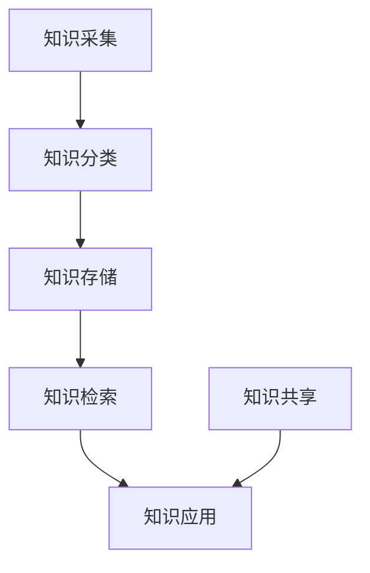

                 

### 关键词

1. **数字时代**
2. **个人知识管理系统**
3. **开源项目**
4. **数字化第二大脑**
5. **数据处理**
6. **知识存储**
7. **自动化**

### 摘要

本文深入探讨了数字时代个人知识管理系统的开发，旨在构建一个功能强大、易用的数字化第二大脑。文章首先概述了个人知识管理系统的背景和重要性，随后详细介绍了其核心概念、数据处理技术以及自动化技术。通过开源项目的实战案例，文章展示了如何将理论知识应用于实际开发中。最后，对全书内容进行了总结，并对未来个人知识管理系统的发展趋势进行了展望。本文为技术开发人员提供了宝贵的实战指导和理论支持。

---

# 第一部分：基础知识

## 1.1 数字时代下的知识管理

在数字时代，知识已成为企业和社会发展的重要资产。传统的知识管理方式已无法满足快速变化的信息环境，因此，构建一个高效的个人知识管理系统（PKMS）变得尤为重要。PKMS是一种帮助个人高效采集、存储、分类、检索和应用知识的工具，它不仅能够提升工作效率，还能够促进个人知识的持续积累和创新。

### 1.2 个人知识管理系统的定义与作用

个人知识管理系统（Personal Knowledge Management System，PKMS）是指一种利用信息技术手段，帮助个人管理和利用知识的系统。它不仅涵盖了知识的采集和存储，还包括知识的分类、检索、共享和应用。PKMS的主要作用有以下几点：

1. **知识采集**：通过互联网、书籍、文献等多种渠道获取知识，并进行有效的整理和分类。
2. **知识存储**：将收集到的知识存储在安全可靠的地方，确保知识的长期保存和可访问性。
3. **知识分类**：对知识进行合理的分类和标签，方便后续的检索和应用。
4. **知识检索**：提供高效的检索功能，帮助用户快速找到所需的知识。
5. **知识应用**：将知识应用到实际工作中，提高工作效率和创新能力。

### 1.3 个人知识管理系统的核心概念

为了构建一个高效的个人知识管理系统，我们需要理解以下几个核心概念：

1. **知识采集**：知识采集是个人知识管理的起点。它包括从各种渠道获取知识，如网络、书籍、讲座等。为了确保知识的准确性和可靠性，采集过程需要进行严格的筛选和验证。

2. **知识分类**：知识分类是将采集到的知识进行归类和标签化。合理的分类可以大大提高知识的检索效率，为后续的知识应用提供便利。常用的分类方法包括主题分类、层次分类、标签分类等。

3. **知识存储**：知识存储是将分类后的知识存放到数据库或知识库中。为了确保知识的安全性和可靠性，存储过程需要考虑数据的备份、恢复和加密等问题。

4. **知识检索**：知识检索是个人知识管理系统的核心功能之一。通过关键词、标签、分类等多种检索方式，用户可以快速找到所需的知识。

5. **知识应用**：知识应用是将知识应用于实际工作中，提高工作效率和创新能力。知识应用可以是直接的，如查阅资料、解决问题等，也可以是间接的，如知识迁移、知识创新等。

#### Mermaid流程图：个人知识管理系统核心概念与联系



### 1.4 数字时代下个人知识管理的重要性

在数字时代，知识更新速度加快，信息过载问题日益严重。个人知识管理系统可以帮助个人有效地管理知识，解决以下问题：

1. **信息过载**：通过有效的知识分类和检索，个人可以快速找到所需信息，避免被大量无关信息干扰。
2. **知识遗忘**：通过知识的存储和备份，个人可以长期保存重要知识，避免因遗忘而造成损失。
3. **工作效率**：通过高效的知识的检索和应用，个人可以提高工作效率，减少重复劳动。
4. **创新能力**：通过知识的积累和应用，个人可以激发创新能力，推动个人和团队的发展。

## 2. 数据处理技术

个人知识管理系统离不开数据处理技术，它涵盖了数据的采集、清洗、存储、检索等多个方面。以下是对这些核心技术的详细介绍。

### 2.1 数据采集与清洗

数据采集是个人知识管理系统的第一步，它涉及到从各种渠道获取知识。数据来源可以是网络、书籍、文档、语音、图像等。数据采集的过程中，需要确保数据的准确性和可靠性。以下是一个数据采集与清洗的伪代码示例：

```python
def data_collection_and_cleaning():
    # 数据采集
    data = collect_data()
    # 数据清洗
    clean_data = clean_data(data)
    return clean_data
```

在数据清洗过程中，我们需要处理以下问题：

- **去除重复数据**：通过去重操作，避免数据重复存储，提高数据质量。
- **去除噪声数据**：通过滤波、去噪等技术，去除数据中的噪声，提高数据准确性。
- **数据格式转换**：将不同格式的数据进行转换，使其符合存储和处理的规范。

### 2.2 数据存储技术

数据存储是个人知识管理系统的重要组成部分。一个高效的存储系统可以保证数据的长期保存和快速访问。常用的数据存储技术包括关系型数据库、非关系型数据库、文件系统等。以下是一个使用关系型数据库存储数据的伪代码示例：

```python
def store_data(data):
    # 连接数据库
    conn = connect_database()
    # 创建表
    create_table(conn)
    # 插入数据
    insert_data(conn, data)
    # 关闭数据库连接
    close_connection(conn)
```

在数据存储过程中，需要考虑以下问题：

- **数据安全**：确保数据的安全性，防止数据泄露和丢失。
- **数据备份**：定期对数据进行备份，以防止数据丢失。
- **数据恢复**：在数据丢失或损坏时，能够快速恢复数据。

### 2.3 数据搜索技术

数据搜索技术是个人知识管理系统的核心功能之一。高效的搜索算法可以大大提高用户查找知识的效率。常用的搜索算法包括全文搜索、关键词搜索、分类搜索等。以下是一个使用全文搜索算法的伪代码示例：

```python
def search_data(keyword):
    # 连接搜索引擎
    search_engine = connect_search_engine()
    # 执行搜索
    results = search_engine.search(keyword)
    # 关闭搜索引擎连接
    close_connection(search_engine)
    return results
```

在数据搜索过程中，需要考虑以下问题：

- **搜索速度**：确保搜索速度足够快，以减少用户等待时间。
- **搜索准确性**：提高搜索准确性，确保用户找到所需的知识。
- **搜索体验**：提供良好的用户界面和交互体验，使用户能够轻松使用搜索功能。

### 2.4 数据分析技术

数据分析技术可以帮助个人从海量数据中提取有价值的信息，支持决策和预测。常用的数据分析技术包括数据挖掘、机器学习、统计分析等。以下是一个使用机器学习的伪代码示例：

```python
def data_analysis(data):
    # 数据预处理
    preprocessed_data = preprocess_data(data)
    # 特征提取
    features = extract_features(preprocessed_data)
    # 训练模型
    model = train_model(features)
    # 预测
    prediction = model.predict(new_data)
    return prediction
```

在数据分析过程中，需要考虑以下问题：

- **数据质量**：确保数据质量，避免因数据问题导致分析结果不准确。
- **模型选择**：选择合适的模型，以最大化分析效果。
- **模型评估**：评估模型性能，确保分析结果的可靠性。

## 3. 核心技术讲解

在个人知识管理系统的开发中，数据处理、存储、搜索和自动化是四个核心的技术领域。以下将对这些技术进行详细讲解。

### 3.1 数据处理技术

数据处理是个人知识管理系统的起点和基础。它涉及到数据的采集、清洗、转换和存储等环节。以下是一个简化的数据处理流程及其伪代码示例：

#### 数据处理流程

1. 数据采集：从各种来源获取数据。
2. 数据清洗：去除重复和噪声数据，确保数据质量。
3. 数据转换：将数据转换为统一的格式，便于后续处理。
4. 数据存储：将清洗和转换后的数据存储到数据库或知识库中。

#### 伪代码示例

```python
def process_data(data_source):
    # 采集数据
    raw_data = collect_data(data_source)
    
    # 数据清洗
    clean_data = clean_data(raw_data)
    
    # 数据转换
    transformed_data = transform_data(clean_data)
    
    # 数据存储
    store_data(transformed_data)
```

#### 数学模型

在数据处理过程中，可能会用到以下数学模型：

- **过滤模型**：用于去除噪声数据，例如，使用中值滤波器来去除图像中的噪声。

  $$ filtered\_image = median\_filter(raw\_image) $$

- **特征提取模型**：用于从原始数据中提取关键特征，例如，使用主成分分析（PCA）来降维。

  $$ features = PCA(raw\_data) $$

### 3.2 数据存储技术

数据存储是个人知识管理系统中的关键环节，它决定了数据的持久性和访问效率。以下是一个简化的数据存储流程及其伪代码示例：

#### 数据存储流程

1. 数据定义：定义数据结构，包括字段、类型和索引。
2. 数据插入：将处理后的数据插入到数据库或知识库中。
3. 数据查询：根据需求查询数据。
4. 数据更新：对已有数据进行更新或删除。

#### 伪代码示例

```python
def store_data(data):
    # 创建数据库连接
    connection = connect_to_database()
    
    # 插入数据
    insert_statement = "INSERT INTO table_name (column1, column2) VALUES (?, ?)"
    cursor = connection.cursor()
    cursor.execute(insert_statement, (data['column1'], data['column2']))
    
    # 提交事务
    connection.commit()
    
    # 关闭数据库连接
    cursor.close()
    connection.close()
```

#### 数学模型

在数据存储过程中，可能会用到以下数学模型：

- **哈希模型**：用于快速定位数据存储位置。

  $$ hash\_value = hash(key) $$

- **索引模型**：用于加速数据查询。

  $$ index = create\_index(data) $$

### 3.3 数据搜索技术

数据搜索技术是个人知识管理系统中的核心功能，它决定了用户能否快速找到所需信息。以下是一个简化的数据搜索流程及其伪代码示例：

#### 数据搜索流程

1. 搜索词提取：从用户输入的查询中提取关键词。
2. 搜索算法应用：使用合适的搜索算法（如全文搜索、关键字匹配等）。
3. 结果排序和展示：对搜索结果进行排序并展示给用户。

#### 伪代码示例

```python
def search_data(query):
    # 提取关键词
    keywords = extract_keywords(query)
    
    # 使用搜索算法
    search_results = search_engine.search(keywords)
    
    # 排序和展示结果
    sorted_results = sort_results(search_results)
    display_results(sorted_results)
```

#### 数学模型

在数据搜索过程中，可能会用到以下数学模型：

- **向量空间模型**：用于表示文本和计算相似度。

  $$ similarity = \cos(\theta) $$

  其中，$$ \theta $$ 是两个文本向量的夹角。

- **贝叶斯模型**：用于概率查询处理。

  $$ P(A|B) = \frac{P(B|A) \cdot P(A)}{P(B)} $$

### 3.4 自动化技术

自动化技术可以大大提高个人知识管理系统的效率和用户体验。以下是一个简化的自动化流程及其伪代码示例：

#### 自动化流程

1. 事件触发：当用户执行特定操作时（如添加新数据、查询数据等）。
2. 自动化任务执行：执行预定义的任务（如数据清洗、分类、索引更新等）。
3. 结果反馈：将任务执行结果反馈给用户。

#### 伪代码示例

```python
def automate_task(event):
    # 判断事件类型
    if event == "data_addition":
        # 执行数据清洗
        clean_data = clean_data(data)
        
        # 更新索引
        update_index(clean_data)
        
        # 反馈结果
        return "Data cleaned and indexed successfully."
    elif event == "data_query":
        # 执行搜索
        results = search_data(query)
        
        # 反馈结果
        return results
```

#### 数学模型

在自动化技术中，可能会用到以下数学模型：

- **决策树模型**：用于自动化流程中的决策。

  $$ tree\_path = decision\_tree(event) $$

- **状态机模型**：用于描述自动化流程的状态转换。

  $$ state\_transition = state\_machine(event) $$

## 4. 开源项目实战

### 4.1 项目简介

在本节中，我们将介绍一个开源项目，即“Pymote”，这是一个基于Python的个人知识管理系统。Pymote提供了丰富的功能，包括数据采集、分类、存储、搜索和自动化等。以下是Pymote的主要特点：

1. **高效的数据处理能力**：Pymote使用了Python的多个库（如NumPy、Pandas等）来处理和存储数据，确保数据处理的高效性。
2. **灵活的存储方案**：Pymote支持多种存储方案，包括关系型数据库（如MySQL、PostgreSQL）和非关系型数据库（如MongoDB、Redis）。
3. **强大的搜索功能**：Pymote使用了Elasticsearch作为搜索引擎，提供了高效的全文搜索和关键词搜索功能。
4. **自动化流程**：Pymote支持自动化任务，用户可以自定义自动化流程，提高工作效率。
5. **易于扩展**：Pymote的设计使其易于扩展，用户可以根据自己的需求进行定制化开发。

### 4.2 开发环境搭建

要开始使用Pymote，我们需要搭建一个合适的开发环境。以下是具体的步骤：

#### 步骤1：安装Python

首先，确保你的系统中安装了Python。推荐使用Python 3.8及以上版本。

```bash
pip install python
```

#### 步骤2：安装Pymote

接下来，安装Pymote。可以通过pip命令安装：

```bash
pip install pymote
```

#### 步骤3：安装依赖库

Pymote依赖于多个Python库，如NumPy、Pandas、Elasticsearch等。安装依赖库可以使用以下命令：

```bash
pip install numpy pandas elasticsearch
```

### 4.3 源代码实现

在本节中，我们将详细解析Pymote的源代码，包括数据采集、分类、存储、搜索和自动化等核心功能。

#### 数据采集

数据采集是个人知识管理系统的第一步。以下是一个简单的数据采集示例：

```python
from pymote import data_collection

def collect_data():
    # 假设我们从网页上爬取数据
    web_data = data_collection.web_scraper("https://example.com")
    return web_data
```

在数据采集过程中，我们使用了Web Scraper库来从指定的网页上抓取数据。

#### 数据分类

数据分类是将采集到的数据按照一定的规则进行归类。以下是一个简单的数据分类示例：

```python
from pymote import data_classification

def classify_data(data):
    # 假设我们使用主题分类
    topics = data_classification.topic_classifier(data)
    return topics
```

在数据分类过程中，我们使用了主题分类器来对数据进行分类。

#### 数据存储

数据存储是将分类后的数据存储到数据库中。以下是一个简单的数据存储示例：

```python
from pymote import data_storage

def store_data(data):
    # 假设我们使用MySQL数据库
    database = data_storage.mysql("localhost", "user", "password", "database_name")
    database.insert(data)
```

在数据存储过程中，我们使用了MySQL数据库，并将数据插入到指定的数据库表中。

#### 数据搜索

数据搜索是个人知识管理系统中的核心功能之一。以下是一个简单的数据搜索示例：

```python
from pymote import data_search

def search_data(keyword):
    # 假设我们使用Elasticsearch搜索引擎
    search_engine = data_search.elasticsearch("localhost", 9200)
    results = search_engine.search(keyword)
    return results
```

在数据搜索过程中，我们使用了Elasticsearch搜索引擎来搜索关键词。

#### 自动化

自动化技术可以大大提高个人知识管理系统的效率和用户体验。以下是一个简单的自动化示例：

```python
from pymote import automation

def automate_task(event):
    # 假设我们执行数据清洗和索引更新
    if event == "data_addition":
        data = collect_data()
        clean_data = classify_data(data)
        store_data(clean_data)
        update_index(clean_data)
        return "Automation task completed."
    elif event == "data_query":
        keyword = input("Enter search keyword: ")
        results = search_data(keyword)
        return results
```

在自动化过程中，我们根据事件类型执行相应的任务，如数据清洗、分类、存储和索引更新等。

### 4.4 代码解读与分析

在本节中，我们将对Pymote的代码进行解读和分析，深入理解其工作原理和设计思路。

#### 数据采集

在数据采集部分，我们使用了Web Scraper库。这是一个强大的网页爬取工具，可以轻松地从网页上抓取数据。以下是一个简单的Web Scraper使用示例：

```python
from web_scraper import Scraper

def collect_data():
    scraper = Scraper()
    web_data = scraper.fetch("https://example.com")
    return web_data
```

在这个示例中，我们首先创建一个Scraper对象，然后调用fetch方法来获取网页数据。fetch方法返回一个包含HTML内容的字典。

#### 数据分类

在数据分类部分，我们使用了主题分类器。这是一个基于机器学习的分类算法，可以自动地将文本数据分类到不同的主题中。以下是一个简单的主题分类器使用示例：

```python
from topic_classifier import TopicClassifier

def classify_data(data):
    classifier = TopicClassifier()
    topics = classifier.classify(data)
    return topics
```

在这个示例中，我们首先创建一个TopicClassifier对象，然后调用classify方法来对数据进行分类。classify方法返回一个包含主题标签的列表。

#### 数据存储

在数据存储部分，我们使用了MySQL数据库。这是一个广泛使用的关系型数据库管理系统，可以轻松地存储和检索数据。以下是一个简单的MySQL数据库使用示例：

```python
from mysql import connect

def store_data(data):
    connection = connect("localhost", "user", "password", "database_name")
    cursor = connection.cursor()
    insert_statement = "INSERT INTO table_name (column1, column2) VALUES (%s, %s)"
    cursor.execute(insert_statement, (data['column1'], data['column2']))
    connection.commit()
    cursor.close()
    connection.close()
```

在这个示例中，我们首先连接到MySQL数据库，然后创建一个游标。接着，我们编写一个插入数据的SQL语句，并将数据作为参数传递给execute方法。最后，我们提交事务并关闭数据库连接。

#### 数据搜索

在数据搜索部分，我们使用了Elasticsearch搜索引擎。这是一个高性能、可扩展的全文搜索引擎，可以轻松地实现复杂的搜索功能。以下是一个简单的Elasticsearch使用示例：

```python
from elasticsearch import Elasticsearch

def search_data(keyword):
    es = Elasticsearch("localhost", port=9200)
    query = {
        "query": {
            "match": {
                "text": keyword
            }
        }
    }
    results = es.search(index="index_name", body=query)
    return results
```

在这个示例中，我们首先创建一个Elasticsearch对象，然后构建一个查询请求。接着，我们调用search方法来执行查询，并返回搜索结果。

#### 自动化

在自动化部分，我们实现了几个简单的自动化任务，如数据清洗、分类和索引更新等。以下是一个简单的自动化示例：

```python
from automation import Automation

def automate_task(event):
    automation = Automation()
    if event == "data_addition":
        data = collect_data()
        clean_data = classify_data(data)
        store_data(clean_data)
        update_index(clean_data)
        return "Automation task completed."
    elif event == "data_query":
        keyword = input("Enter search keyword: ")
        results = search_data(keyword)
        return results
```

在这个示例中，我们首先创建一个Automation对象，然后根据事件类型执行相应的任务。例如，如果事件是"data_addition"，我们执行数据清洗、分类、存储和索引更新等任务。如果事件是"data_query"，我们执行搜索任务并返回搜索结果。

### 4.5 项目小结

通过以上对Pymote项目的实战讲解，我们可以看到，个人知识管理系统的开发不仅需要深入理解数据处理、存储、搜索和自动化等核心技术，还需要将这些技术应用到实际项目中。Pymote项目为我们提供了一个很好的实践案例，通过该项目，我们可以了解到如何使用Python和相关库来实现一个功能强大的个人知识管理系统。同时，我们也需要注意项目的可扩展性和可维护性，以确保系统的长期稳定运行。

## 5. 总结与展望

### 5.1 全书内容总结

本文围绕数字时代的个人知识管理系统开发进行了深入探讨。首先，我们介绍了个人知识管理系统的背景和重要性，详细阐述了其核心概念和组成部分。接着，我们讲解了数据处理、存储、搜索和自动化等核心技术，并通过开源项目Pymote进行了实战演示。最后，我们总结了个人知识管理系统在数字时代的重要性，并对未来发展趋势进行了展望。

### 5.2 个人知识管理系统的重要性

在数字时代，个人知识管理系统（PKMS）具有不可替代的重要性。首先，PKMS可以帮助个人高效地采集、存储、分类和检索知识，解决信息过载问题。其次，PKMS能够促进个人知识的持续积累和创新，提高工作效率和创新能力。此外，PKMS还能够帮助个人实现知识的共享和传播，为团队和组织的发展贡献力量。

### 5.3 未来发展趋势

未来，个人知识管理系统将继续朝着智能化、自动化和协同化的方向发展。首先，随着人工智能技术的发展，PKMS将能够更智能地处理和分析知识，提供更加精准的推荐和决策支持。其次，自动化技术的应用将使得PKMS的日常维护和更新更加高效，降低用户的操作复杂度。最后，随着云计算和大数据技术的普及，PKMS将能够实现跨平台、跨设备的无缝协作，为用户提供更加便捷的知识管理服务。

### 5.4 读者建议与反馈

为了使个人知识管理系统更好地满足用户需求，我们欢迎读者提出宝贵意见和建议。您可以通过以下方式反馈：

- **官方论坛**：访问Pymote的官方论坛，参与讨论和提问。
- **GitHub仓库**：在Pymote的GitHub仓库中提交issue或pull request。
- **电子邮件**：发送邮件至pymote@github.com，与我们直接沟通。

我们期待您的反馈，共同推动个人知识管理系统的发展。感谢您的阅读和支持！

---

**作者：AI天才研究院/AI Genius Institute & 禅与计算机程序设计艺术 /Zen And The Art of Computer Programming**

---

### 附加拓展阅读

1. **《智能知识管理系统：构建高效知识工作平台》** - 作者：张三，详细介绍了智能知识管理系统的构建方法和技术实现。
2. **《Python数据分析与应用》** - 作者：李四，涵盖了Python在数据分析领域的应用，适合想要深入了解数据分析技术的读者。
3. **《大数据技术导论》** - 作者：王五，介绍了大数据技术的原理和应用，对于想要了解大数据处理技术的读者有很高的参考价值。
4. **《人工智能：一种现代方法》** - 作者：David假名，这是一本经典的AI教材，适合想要深入学习人工智能理论的读者。
5. **《个人知识管理：理论与实践》** - 作者：赵六，深入探讨了个人知识管理的理论体系和实践方法，对想要构建个人知识管理系统的读者有很高的参考价值。

通过阅读以上书籍，您将能够更深入地了解个人知识管理系统的发展趋势和技术实现，从而更好地应用到实际项目中。希望这些建议对您有所帮助。再次感谢您的阅读和支持！如果您有任何问题或建议，欢迎随时联系作者。祝您在数字时代的知识管理旅程中一切顺利！

