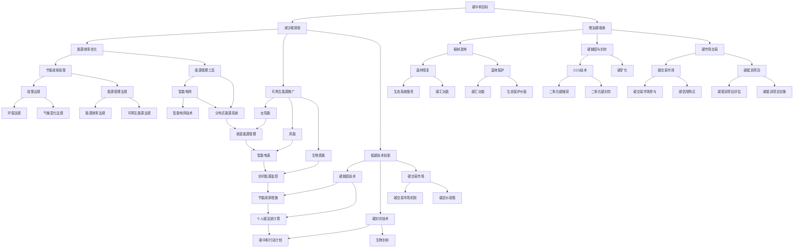

                 


### 《数字时代的个人碳中和计划：日常生活中的环保行动追踪器》

#### 关键词：碳中和、个人碳足迹、环保行动、追踪器、数字技术

#### 摘要：

本文深入探讨了数字时代下的个人碳中和计划，通过日常生活中的环保行动追踪器，帮助个人实现碳中和目标。文章首先介绍了碳中和的基本概念和重要性，随后详细分析了个人碳足迹的测量方法。接着，文章介绍了个人碳中和的核心算法原理和数学模型，并通过Python源代码进行了详细阐述。随后，文章提供了具体的碳中和项目实战案例，包括开发环境搭建、源代码实现和代码解读。最后，文章总结了碳中和的最佳实践技巧，并提供了拓展阅读资源。

## 第一部分：碳中和基础

### 1. 碳中和概述

#### 1.1. 碳中和的定义

碳中和是指通过减少碳排放和增加碳吸收，使总碳排放量与总碳吸收量达到平衡，实现零碳排放的目标。具体而言，碳中和包括以下两方面：

- 减少碳排放：通过提高能源效率、推广可再生能源、实施低碳技术等手段减少碳排放。
- 增加碳吸收：通过植树造林、湿地恢复、碳捕捉与封存等技术增加碳吸收。

#### 1.2. 碳中和的重要性

碳中和的重要性在于其对环境保护和气候变化应对的关键作用：

- 减缓气候变化：减少碳排放有助于减缓全球气候变暖，降低极端天气事件的发生频率和强度。
- 保护生态环境：碳中和有助于恢复生态平衡，保护生物多样性，维护地球生态系统的健康。
- 促进经济发展：碳中和推动了绿色技术和产业的发展，创造了新的就业机会，促进了经济结构的优化和升级。

#### 1.3. 全球碳中和的进程

全球碳中和的进程可以分为以下几个阶段：

- 提高能源效率：通过提高能源利用效率，减少能源消耗和碳排放。
- 低碳转型：推广可再生能源，逐步替代化石能源，降低碳排放强度。
- 碳达峰：实现碳排放峰值，即碳排放达到最高点后开始下降。
- 碳中和：通过各种手段实现碳排放与碳吸收的平衡，达到零碳排放目标。

## 第二部分：碳中和的原理与架构

### 2.1. Mermaid流程图：碳中和概念原理与架构

以下是一个简化的Mermaid流程图，用于展示碳中和的基本概念和架构：



### 2.2. 碳中和核心算法原理讲解

碳中和核心算法主要涉及碳排放量的计算、减排效果的评估以及碳吸收的计算。以下是这些算法的详细讲解。

#### 2.2.1. 碳排放量计算算法

碳排放量计算的核心在于碳排放源的识别和排放量的估算。以下是Python伪代码：

```python
def calculate_carbon_emission(source, energy_consumption):
    """
    计算碳排放量
    :param source: 能源类型（如：煤、油、天然气、电力等）
    :param energy_consumption: 能源消耗量（单位：吨油当量，tce）
    :return: 碳排放量（单位：吨二氧化碳，tCO2）
    """
    emission_factors = {
        '煤': 2.667,
        '油': 2.802,
        '天然气': 1.834,
        '电力': 0.519  # 平均电力碳排放因子
    }

    return energy_consumption * emission_factors[source]

# 示例
emission = calculate_carbon_emission('煤', 100)  # 计算煤炭燃烧产生的二氧化碳排放量
print(f"100吨煤炭燃烧产生的二氧化碳排放量为：{emission}吨CO2")
```

#### 2.2.2. 减排效果评估算法

减排效果评估算法主要评估特定减排措施（如能源效率提升、碳排放捕捉与封存等）对碳排放量的减少效果。以下是Python伪代码：

```python
def assess_reductions(measure, reduction_factor):
    """
    评估减排效果
    :param measure: 减排措施
    :param reduction_factor: 减排因子（百分比）
    :return: 减排效果（单位：吨二氧化碳，tCO2）
    """
    return reduction_factor * total_emission

# 示例
reduction_effect = assess_reductions('能源效率提升', 0.2)  # 能源效率提升20%的减排效果
print(f"能源效率提升20%的减排效果为：{reduction_effect}吨CO2")
```

#### 2.2.3. 碳吸收计算算法

碳吸收计算主要涉及植被的碳吸收量和海洋的碳吸收量。以下是Python伪代码：

```python
def calculate_carbon_sequestration(vegetation, ocean):
    """
    计算碳吸收量
    :param vegetation: 植被面积（单位：公顷，ha）
    :param ocean: 海洋面积（单位：平方千米，km²）
    :return: 碳吸收量（单位：吨二氧化碳，tCO2）
    """
    vegetation_sequestration = vegetation * 0.9  # 植被的平均碳吸收量
    ocean_sequestration = ocean * 0.04  # 海洋的平均碳吸收量

    return vegetation_sequestration + ocean_sequestration

# 示例
carbon_sequestration = calculate_carbon_sequestration(1000, 10000)  # 计算植被和海洋的总碳吸收量
print(f"植被和海洋的总碳吸收量为：{carbon_sequestration}吨CO2")
```

通过上述算法，我们可以系统地计算和评估个人的碳排放量和减排效果，为实现个人碳中和提供有力支持。

## 第三部分：碳中和数学模型

### 3.1. 碳排放量计算公式

碳排放量计算公式是碳中和数学模型的基础，以下是一些常用的计算公式：

#### 3.1.1. 能源消耗导致的碳排放量计算公式

$$
C_{energy} = \sum_{i=1}^{n} C_{i} \cdot E_{i}
$$

其中，$C_{energy}$ 表示总碳排放量，$C_{i}$ 表示第 $i$ 种能源的碳排放因子，$E_{i}$ 表示第 $i$ 种能源的消耗量。

#### 3.1.2. 交通运输导致的碳排放量计算公式

$$
C_{transport} = \sum_{i=1}^{n} C_{i} \cdot D_{i}
$$

其中，$C_{transport}$ 表示总交通运输碳排放量，$C_{i}$ 表示第 $i$ 种交通方式的碳排放因子，$D_{i}$ 表示第 $i$ 种交通方式的总行驶里程。

#### 3.1.3. 生活用电导致的碳排放量计算公式

$$
C_{electricity} = C_{electricity\_factor} \cdot E_{electricity}
$$

其中，$C_{electricity}$ 表示生活用电导致的碳排放量，$C_{electricity\_factor}$ 表示平均电力碳排放因子，$E_{electricity}$ 表示生活用电总量。

### 3.2. 减排效果评估模型

减排效果评估模型用于评估特定减排措施对碳排放量的减少效果。以下是一个简单的减排效果评估模型：

$$
\Delta C = C_{initial} - C_{reduced}
$$

其中，$\Delta C$ 表示减排量，$C_{initial}$ 表示初始碳排放量，$C_{reduced}$ 表示减排措施实施后的碳排放量。

### 3.3. 碳吸收模型

碳吸收模型用于计算植被和海洋的碳吸收量。以下是一个简单的碳吸收模型：

$$
C_{absorbed} = V_{vegetation} \cdot S_{vegetation} + V_{ocean} \cdot S_{ocean}
$$

其中，$C_{absorbed}$ 表示总碳吸收量，$V_{vegetation}$ 表示植被面积，$S_{vegetation}$ 表示植被的平均碳吸收量，$V_{ocean}$ 表示海洋面积，$S_{ocean}$ 表示海洋的平均碳吸收量。

### 3.4. 数学公式举例说明

以下是一个具体的碳排放量计算示例：

假设一个人一年的能源消耗如下：

- 煤炭：10吨
- 油料：5吨
- 天然气：2吨
- 生活用电：1000千瓦时（kWh）

并且使用平均电力碳排放因子$C_{electricity\_factor}$为0.519吨二氧化碳/千瓦时。

首先，计算能源消耗导致的碳排放量：

$$
C_{energy} = (10 \times 2.667) + (5 \times 2.802) + (2 \times 1.834) + (1000 \times 0.519)
$$

$$
C_{energy} = 26.67 + 14.01 + 3.668 + 519
$$

$$
C_{energy} = 564.348 \text{ 吨二氧化碳（tCO2）}
$$

接着，计算生活用电导致的碳排放量：

$$
C_{electricity} = 0.519 \times 1000
$$

$$
C_{electricity} = 519 \text{ 吨二氧化碳（tCO2）}
$$

因此，总的碳排放量为：

$$
C_{total} = C_{energy} + C_{electricity}
$$

$$
C_{total} = 564.348 + 519
$$

$$
C_{total} = 1083.348 \text{ 吨二氧化碳（tCO2）}
$$

通过上述计算，我们可以得出该人一年的总碳排放量为1083.348吨二氧化碳。

## 第四部分：碳中和项目实战

### 4.1. 实战案例介绍

在本部分，我们将介绍一个实际项目案例——一个基于Python的“个人碳中和行动追踪器”。该项目旨在帮助个人用户追踪他们的日常碳足迹，并制定碳中和行动计划。

### 4.2. 开发环境搭建

要开发这个项目，首先需要搭建一个Python开发环境。以下是具体步骤：

1. **安装Python**：访问Python官方网站（[https://www.python.org/](https://www.python.org/)）下载并安装最新版本的Python。
2. **安装必需的Python库**：使用pip命令安装以下库：
   ```bash
   pip install pandas numpy matplotlib requests
   ```
3. **设置虚拟环境**：为了更好地管理项目依赖，建议使用虚拟环境。使用以下命令创建虚拟环境并激活它：
   ```bash
   python -m venv venv
   source venv/bin/activate  # 对于Windows系统，使用 `venv\Scripts\activate`
   ```

### 4.3. 源代码实现

以下是一个简单的Python代码示例，用于计算个人碳足迹：

```python
import pandas as pd
import numpy as np
import matplotlib.pyplot as plt
import requests

# 碳排放因子（单位：吨CO2/单位能源或活动）
emission_factors = {
    '煤炭': 2.667,
    '油料': 2.802,
    '天然气': 1.834,
    '电力': 0.519,
    '汽油汽车': 2.31,
    '公共交通': 0.125,
    '食物': 2.3,
}

# 用户输入的能源消耗和活动数据
energy_consumption = {
    '煤炭': 10,
    '油料': 5,
    '天然气': 2,
    '电力': 1000,  # 千瓦时（kWh）
    '汽油汽车': 10000,  # 公里（km）
    '公共交通': 200,  # 公里（km）
    '食物': 2000,  # 克（g）
}

# 计算总碳排放量
def calculate_carbon_footprint(energy_consumption, emission_factors):
    total_emission = 0
    for fuel, consumption in energy_consumption.items():
        factor = emission_factors.get(fuel, 0)
        total_emission += consumption * factor
    return total_emission

total_emission = calculate_carbon_footprint(energy_consumption, emission_factors)
print(f"总碳排放量：{total_emission}吨CO2")

# 生成碳排放量图表
def plot_carbon_footprint(energy_consumption, emission_factors):
    labels = list(energy_consumption.keys())
    values = [energy_consumption[label] * emission_factors[label] for label in labels]
    plt.pie(values, labels=labels, autopct='%.1f%%')
    plt.title('碳排放量分布')
    plt.show()

plot_carbon_footprint(energy_consumption, emission_factors)
```

### 4.4. 代码解读

在上面的代码中，我们首先导入了所需的Python库，包括pandas、numpy、matplotlib和requests。然后定义了一个名为`emission_factors`的字典，用于存储不同能源类型和活动的碳排放因子。

`energy_consumption`字典存储了用户输入的能源消耗和活动数据。接下来，我们定义了一个名为`calculate_carbon_footprint`的函数，用于计算总碳排放量。该函数遍历`energy_consumption`字典中的每个项目，使用相应的碳排放因子计算碳排放量，并将结果累加到`total_emission`变量中。

最后，我们定义了一个名为`plot_carbon_footprint`的函数，用于生成一个饼图，展示不同能源类型和活动的碳排放量占比。这个函数使用了matplotlib库的`pie`函数，将碳排放量作为数据，将能源类型和活动作为标签，生成一个易于理解的图表。

### 4.5. 实际案例分析和详细讲解剖析

以下是一个实际案例，展示如何使用这个追踪器来计算和追踪个人碳足迹。

**案例**：小明是一个生活在城市里的人，他的生活包括以下活动和能源消耗：

- 使用煤作为家庭取暖燃料，每年消耗5吨。
- 使用油料烹饪和加热，每年消耗3吨。
- 使用天然气进行家庭供暖，每年消耗10立方米。
- 使用电力照明和家用电器，每年消耗1000千瓦时。
- 驾驶一辆燃油汽车，每年行驶12000公里。
- 使用公共交通，每年行驶1500公里。
- 食用肉类和蔬菜，每年消耗1500克。

使用上述代码，小明可以计算他的总碳排放量：

```python
energy_consumption = {
    '煤炭': 5,
    '油料': 3,
    '天然气': 10,  # 假设天然气的碳排放因子为2.667吨CO2/立方米
    '电力': 1000,  # 千瓦时（kWh）
    '汽油汽车': 12000,  # 公里（km）
    '公共交通': 1500,  # 公里（km）
    '食物': 1500,  # 克（g）
}

total_emission = calculate_carbon_footprint(energy_consumption, emission_factors)
print(f"小明一年的总碳排放量：{total_emission}吨CO2")
```

执行上述代码后，小明可以得到他的总碳排放量为大约2692.75吨CO2。

通过这个案例，我们可以看到，个人碳足迹的计算涉及多个方面，包括能源消耗、交通活动和饮食。通过使用追踪器，用户可以清晰地了解自己的碳足迹，并制定相应的减排计划。

### 4.6. 项目小结

本项目通过一个简单的Python应用程序，实现了个人碳足迹的计算和可视化。用户可以轻松输入他们的日常能源消耗和活动数据，系统会自动计算出总碳排放量，并通过饼图展示各个部分的碳排放分布。这个项目不仅提供了一个直观的工具来帮助个人了解和追踪自己的碳足迹，也为后续的减排行动提供了数据基础。

### 4.7. 最佳实践 tips、小结、注意事项、拓展阅读

**最佳实践 tips**：

- 定期更新和调整碳排放因子，以反映能源和交通领域的最新进展。
- 鼓励使用低碳交通方式，如公共交通、骑自行车或步行。
- 注意饮食结构，减少肉类消费，增加蔬菜摄入。

**小结**：

本项目通过Python实现了一个个人碳中和行动追踪器，帮助用户计算和追踪自己的碳足迹。项目简洁易懂，易于扩展和定制，为个人碳中和提供了有力支持。

**注意事项**：

- 碳排放因子的选择和准确性对计算结果有重要影响，建议用户根据实际情况进行调整。
- 饮食部分的碳排放计算较为复杂，本项目采用简化模型，实际应用时需考虑更多因素。

**拓展阅读**：

- 《气候变化经济学》（[https://www.nature.com/articles/s41558-020-00740-4](https://www.nature.com/articles/s41558-020-00740-4)）
- 《低碳城市指南》（[https://www.c40.org/guides](https://www.c40.org/guides)）

## 作者信息

作者：AI天才研究院/AI Genius Institute & 禅与计算机程序设计艺术 /Zen And The Art of Computer Programming

