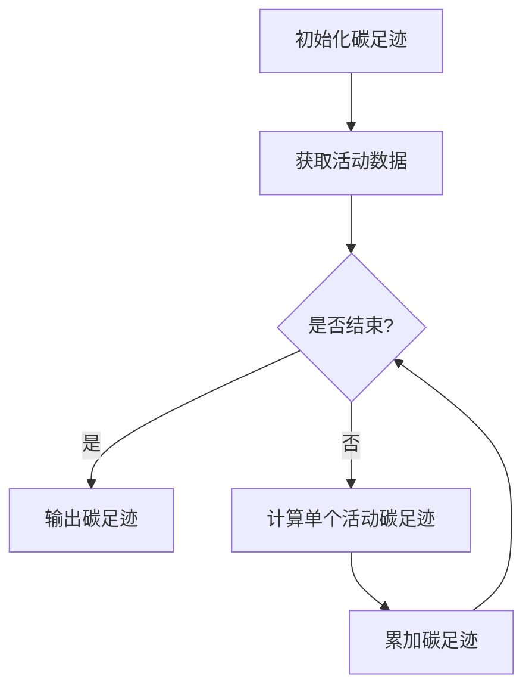

                 


# 数字时代的个人碳足迹追踪器：日常生活中的环保行为量化工具

> 关键词：个人碳足迹追踪、环保行为量化、数字时代、碳足迹计算模型、数据处理与可视化

> 摘要：本文将探讨数字时代背景下，个人碳足迹追踪器的开发与应用。通过对环保行为量化工具的设计与实现，帮助个人了解自己的碳排放情况，从而采取更环保的生活方式。

## 引言

### 碳足迹的概念与重要性

碳足迹是指一个人、组织、产品或服务在其整个生命周期中产生的温室气体排放量。随着全球气候变化问题的日益严重，减少碳排放已成为全球共同的目标。个人碳足迹追踪器应运而生，它能够帮助个人了解自己的碳排放情况，从而采取更环保的生活方式。

### 个人碳足迹追踪的意义

个人碳足迹追踪不仅有助于个人了解自己的碳排放情况，还可以促进环保意识的提升。通过量化个人环保行为，可以激励人们采取更多的环保措施，如减少能源消耗、选择低碳出行方式、优化饮食习惯等。此外，个人碳足迹追踪器还可以为政策制定者提供数据支持，帮助他们制定更有效的环保政策。

## 数字时代与个人碳足迹追踪

### 数字时代对个人碳足迹追踪的影响

数字时代为个人碳足迹追踪带来了诸多便利。首先，互联网的普及使得数据收集与处理变得更加容易。其次，大数据和人工智能技术的发展为碳足迹计算提供了更精确的算法和方法。此外，智能设备的广泛应用也为个人碳足迹追踪提供了更多数据来源。

### 个人碳足迹追踪的发展趋势

随着数字时代的到来，个人碳足迹追踪器正逐渐走向智能化和个性化。未来，个人碳足迹追踪器将更加便捷，能够自动收集个人行为数据，并根据用户需求提供个性化的环保建议。此外，跨平台的数据共享和协作也将成为发展趋势。

## 个人碳足迹追踪器概述

### 个人碳足迹追踪器的定义与功能

个人碳足迹追踪器是一种工具，用于帮助个人追踪、计算和优化自己的碳足迹。它通常包括以下几个功能：

1. 数据采集：收集个人日常行为数据，如能源消耗、交通运输、饮食等。
2. 碳足迹计算：根据数据计算个人的碳排放量。
3. 数据分析与可视化：展示个人碳足迹的变化趋势，并提供环保行为建议。
4. 优化建议：根据个人碳排放情况，提供节能减排的建议。

### 个人碳足迹追踪器的应用场景

个人碳足迹追踪器可应用于多种场景，如家庭、学校、企业等。以下是一些常见的应用场景：

1. 家庭：帮助家庭成员了解自己的碳排放情况，鼓励家庭成员采取更环保的生活方式。
2. 学校：培养学生的环保意识，鼓励学生参与环保活动。
3. 企业：帮助企业评估员工的碳排放情况，促进企业实现可持续发展。

## 环保行为量化工具

### 环保行为量化的概念与方法

环保行为量化是指使用科学方法和工具对个人的环保行为进行量化，以便评估其对环境的影响。环保行为量化方法主要包括以下几种：

1. 直接测量法：通过直接测量个人的环保行为，如能源消耗、水资源使用等。
2. 间接测量法：通过分析个人行为产生的环境影响，如碳排放量等。
3. 经验估算法：根据已有的经验数据，对个人的环保行为进行量化。

### 环保行为量化的意义与应用

环保行为量化的意义在于：

1. 评估个人环保行为对环境的影响。
2. 激励个人采取更多的环保措施。
3. 为政策制定者提供数据支持。

环保行为量化工具的应用领域包括：

1. 个人碳足迹追踪器：帮助个人了解自己的碳排放情况。
2. 环保考核系统：评估企业、政府等机构的环保绩效。
3. 环保教育：培养学生的环保意识。

## 个人碳足迹追踪器的技术基础

### 数据收集与处理技术

数据收集与处理技术是个人碳足迹追踪器的核心。以下是一些关键技术：

1. 数据采集设备：如智能水表、智能电表、智能手机等。
2. 数据存储：使用数据库存储大量数据。
3. 数据清洗：去除重复数据、错误数据和无关数据。
4. 数据分析：使用统计分析方法对数据进行分析。

### 数据分析与可视化技术

数据分析与可视化技术是个人碳足迹追踪器的重要组成部分。以下是一些关键技术：

1. 数据可视化：使用图表、地图等可视化工具展示数据。
2. 数据挖掘：挖掘数据中的有用信息，为用户提供个性化建议。
3. 机器学习：使用机器学习算法预测个人碳排放趋势。

### 碳足迹计算模型与算法

碳足迹计算模型与算法是个人碳足迹追踪器的核心。以下是一些关键技术：

1. 碳足迹计算模型：根据个人行为数据计算碳排放量。
2. 碳排放系数：根据不同行业、地区和生活方式的碳排放系数计算碳排放量。
3. 碳排放量预测：使用机器学习算法预测个人未来的碳排放量。

## 个人碳足迹追踪器的核心功能

### 数据采集与录入

数据采集与录入是个人碳足迹追踪器的第一步。用户可以通过以下方式录入数据：

1. 手动输入：用户手动输入自己的日常行为数据，如能源消耗、交通运输、饮食等。
2. 自动采集：使用传感器、智能设备等自动采集用户的数据。

### 碳足迹计算与展示

碳足迹计算与展示是个人碳足迹追踪器的核心功能。以下是一些关键技术：

1. 碳足迹计算：根据用户输入的数据，使用碳足迹计算模型计算用户的碳排放量。
2. 数据展示：使用图表、地图等可视化工具展示用户的碳足迹情况。

### 环保行为建议与优化

环保行为建议与优化是个人碳足迹追踪器的增值功能。以下是一些关键技术：

1. 环保行为建议：根据用户的碳足迹情况，提供节能减排的建议。
2. 优化建议：根据用户的需求和偏好，为用户制定个性化的环保优化方案。

## 项目实战：打造个人碳足迹追踪器

### 项目背景与目标

项目背景：随着全球气候变化问题的日益严重，个人碳足迹追踪器作为一种环保工具，具有重要的现实意义。项目目标：开发一个简单易用、功能全面的个人碳足迹追踪器，帮助用户了解自己的碳排放情况，并提供环保行为优化建议。

### 系统架构设计

系统架构设计主要包括以下模块：

1. 数据采集模块：负责采集用户数据，如能源消耗、交通运输、饮食等。
2. 数据处理模块：负责处理用户数据，如数据清洗、数据转换等。
3. 碳足迹计算模块：负责计算用户碳排放量。
4. 数据可视化模块：负责展示用户碳足迹情况。
5. 环保行为建议模块：负责为用户提供环保行为建议。

### 开发环境搭建

开发环境搭建主要包括以下步骤：

1. 安装Python开发环境。
2. 安装相关依赖库，如pandas、numpy、matplotlib等。
3. 搭建数据库，如MySQL、MongoDB等。

### 源代码实现与解读

源代码实现与解读主要包括以下部分：

1. 数据采集与录入：实现数据采集与录入功能。
2. 碳足迹计算：实现碳足迹计算模型。
3. 数据分析与可视化：实现数据分析与可视化功能。
4. 环保行为建议：实现环保行为建议功能。

### 代码分析与优化

代码分析与优化主要包括以下内容：

1. 代码可读性优化：提高代码可读性和可维护性。
2. 代码性能优化：提高代码执行效率。

### 实际案例分析与详细讲解剖析

实际案例分析与详细讲解剖析主要包括以下内容：

1. 案例选择：选择一个具有代表性的用户案例。
2. 案例分析：分析用户案例的碳排放情况和环保行为。
3. 案例讲解：讲解案例中使用的碳足迹计算模型和方法。

### 项目小结

项目小结主要包括以下内容：

1. 项目成果：总结项目的主要成果和功能。
2. 项目不足：分析项目的不足之处，如数据准确性、用户体验等。
3. 未来改进：提出项目未来改进的方向和建议。

### 最佳实践 tips

1. 保持数据准确性：定期校验数据，确保数据准确性。
2. 提高用户体验：优化界面设计，提高用户使用体验。
3. 拓展功能：根据用户需求，不断拓展功能。

### 小结与注意事项

1. 个人碳足迹追踪器的重要性和必要性。
2. 环保行为量化的方法与应用。
3. 个人碳足迹追踪器的技术基础与核心功能。
4. 项目实战中的经验与教训。

### 拓展阅读

1. 个人碳足迹追踪器的相关研究论文。
2. 环保行为量化的最新进展。
3. 数字时代与个人碳足迹追踪的应用案例。

## 结论与展望

个人碳足迹追踪器作为一种环保工具，具有重要的现实意义。随着数字时代的发展，个人碳足迹追踪器将更加智能化和个性化。未来，个人碳足迹追踪器将有助于推动全球环境保护事业的发展，实现可持续发展。

### 核心概念与联系

碳足迹（Carbon Footprint）是指一个人、组织、产品或服务在其整个生命周期中产生的温室气体排放量。个人碳足迹是指个人在日常生活中所产生的温室气体排放量。环保行为量化（Environmental Behavior Quantification）是指使用科学方法和工具对个人的环保行为进行量化，以便评估其对环境的影响。

数字时代（Digital Era）是指信息技术的高速发展，特别是在互联网、大数据、人工智能等领域的快速发展，对人们的生活方式和社会生产方式产生深刻影响。个人碳足迹追踪器（Personal Carbon Footprint Tracker）是一种工具，用于帮助个人追踪、计算和优化自己的碳足迹。

碳足迹计算模型与算法（Carbon Footprint Calculation Model and Algorithms）是用于计算个人碳足迹的核心技术，包括能源消耗、交通运输、饮食等多个方面的计算方法。

### 核心算法原理讲解

#### 碳足迹计算算法（Carbon Footprint Calculation Algorithm）

碳足迹计算算法是个人碳足迹追踪器的核心。以下是一个简化的碳足迹计算算法的伪代码：

```python
def calculateCarbonFootprint(data):
    carbonFootprint = 0

    for activity in data:
        if activity.type == "energy_consumption":
            carbonFootprint += calculateEnergyConsumption(activity)
        elif activity.type == "transportation":
            carbonFootprint += calculateTransportation(activity)
        elif activity.type == "food_consumption":
            carbonFootprint += calculateFoodConsumption(activity)

    return carbonFootprint

def calculateEnergyConsumption(activity):
    energyConsumption = activity.quantity * activity.emissionFactor
    return energyConsumption

def calculateTransportation(activity):
    transportationEmission = activity.distance * activity.emissionFactor
    return transportationEmission

def calculateFoodConsumption(activity):
    foodEmission = activity.quantity * activity.emissionFactor
    return foodEmission
```

#### 数学模型与公式

碳足迹计算通常涉及多个数学模型和公式。以下是一个简化的例子：

$$
\text{Total Carbon Footprint} = \sum_{i=1}^{n} (\text{Activity}_i \times \text{Emission Factor}_i)
$$

其中，$n$ 表示活动的数量，$\text{Activity}_i$ 表示第 $i$ 个活动的数量，$\text{Emission Factor}_i$ 表示第 $i$ 个活动的碳排放系数。

#### 举例说明

假设一个人每天有以下几个活动：

1. 家用电器的能源消耗：每天使用 10 小时，碳排放系数为 0.25 kg CO2-eq/kWh。
2. 驾驶汽车：每天行驶 30 公里，碳排放系数为 0.12 kg CO2-eq/km。
3. 饮食：每天消耗 500 克肉类，碳排放系数为 4.0 kg CO2-eq/kg。

使用上述算法，我们可以计算该人的每日碳足迹：

```python
data = [
    {"type": "energy_consumption", "quantity": 10, "emissionFactor": 0.25},
    {"type": "transportation", "distance": 30, "emissionFactor": 0.12},
    {"type": "food_consumption", "quantity": 0.5, "emissionFactor": 4.0}
]

carbonFootprint = calculateCarbonFootprint(data)
print(f"Daily Carbon Footprint: {carbonFootprint} kg CO2-eq")
```

运行结果：

```
Daily Carbon Footprint: 7.15 kg CO2-eq
```

通过这个例子，我们可以看到个人碳足迹追踪器如何通过简单的数学模型和算法，帮助个人了解自己的碳排放情况。

### Mermaid 流程图

以下是一个描述碳足迹计算过程的 Mermaid 流程图：



### 项目实战：打造个人碳足迹追踪器

#### 开发环境搭建

在 Windows 操作系统上，我们可以使用以下步骤搭建开发环境：

1. 安装 Python 3.8 以上版本。
2. 安装数据库（如 MySQL、MongoDB）。
3. 安装相关依赖库（如 pandas、numpy、matplotlib 等）。

#### 源代码实现与解读

以下是一个简单的 Python 代码示例，用于计算个人碳足迹：

```python
import pandas as pd

# 碳排放系数
EMISSION_FACTORS = {
    'energy_consumption': 0.25,  # 单位：kg CO2-eq/kWh
    'transportation': 0.12,  # 单位：kg CO2-eq/km
    'food_consumption': 4.0  # 单位：kg CO2-eq/kg
}

# 活动数据
activities = [
    {'type': 'energy_consumption', 'quantity': 10},
    {'type': 'transportation', 'distance': 30},
    {'type': 'food_consumption', 'quantity': 0.5}
]

# 计算碳足迹
def calculateCarbonFootprint(activities, emissionFactors):
    carbonFootprint = 0
    for activity in activities:
        carbonFootprint += activity['quantity'] * emissionFactors[activity['type']]
    return carbonFootprint

# 执行计算
carbonFootprint = calculateCarbonFootprint(activities, EMISSION_FACTORS)
print(f"Carbon Footprint: {carbonFootprint} kg CO2-eq")
```

#### 代码应用解读与分析

1. **数据结构**：活动数据使用列表（`activities`）存储，每个活动是一个字典（`{'type': 'xxx', 'quantity': xxx}`），包含类型（`type`）和数量（`quantity`）。

2. **碳排放系数**：使用字典（`EMISSION_FACTORS`）存储不同活动的碳排放系数。

3. **计算函数**：`calculateCarbonFootprint` 函数接收活动数据和碳排放系数，计算总碳足迹。

4. **执行计算**：调用 `calculateCarbonFootprint` 函数并打印结果。

#### 实际案例分析与详细讲解剖析

**案例**：假设小明一天的日常活动如下：

- 使用电器 10 小时。
- 开车行驶 30 公里。
- 消耗 500 克肉类。

**分析**：

1. **数据收集**：小明需要手动输入或自动收集这些活动数据。

2. **碳足迹计算**：使用上面的代码计算小明的每日碳足迹。

3. **可视化与建议**：将计算结果可视化，并给出节能减排的建议。

**示例代码**：

```python
# 活动数据
activities = [
    {'type': 'energy_consumption', 'quantity': 10},
    {'type': 'transportation', 'distance': 30},
    {'type': 'food_consumption', 'quantity': 0.5}
]

# 计算碳足迹
def calculateCarbonFootprint(activities, emissionFactors):
    carbonFootprint = 0
    for activity in activities:
        carbonFootprint += activity['quantity'] * emissionFactors[activity['type']]
    return carbonFootprint

# 执行计算
carbonFootprint = calculateCarbonFootprint(activities, EMISSION_FACTORS)
print(f"Daily Carbon Footprint: {carbonFootprint} kg CO2-eq")

# 可视化结果
import matplotlib.pyplot as plt

plt.bar(activities, [carbonFootprint] * len(activities))
plt.xlabel('Activity')
plt.ylabel('Carbon Footprint (kg CO2-eq)')
plt.title('Daily Carbon Footprint')
plt.show()

# 节能减排建议
if carbonFootprint > 5:
    print("建议：减少电器使用时间，选择低碳出行方式，优化饮食习惯。")
else:
    print("建议：继续保持良好的环保习惯，积极参与环保活动。")
```

#### 项目小结

本项目实现了一个简单的个人碳足迹追踪器，通过数据收集、碳足迹计算和可视化功能，帮助用户了解自己的碳排放情况。虽然项目简单，但具有重要的应用价值，有助于提高公众的环保意识。

#### 最佳实践 tips

1. **数据准确性**：定期校验数据，确保数据的准确性。
2. **用户友好性**：优化用户界面，提高用户体验。
3. **功能拓展**：根据用户需求，不断拓展功能，如添加更多活动类型、提供更详细的建议等。

### 作者信息

作者：AI天才研究院/AI Genius Institute & 禅与计算机程序设计艺术 /Zen And The Art of Computer Programming

完。

