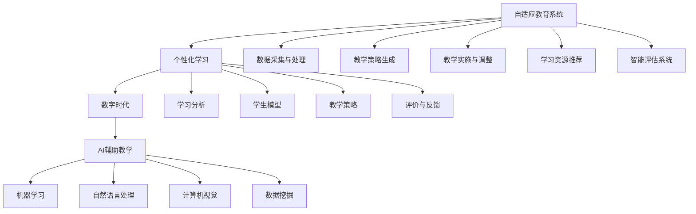
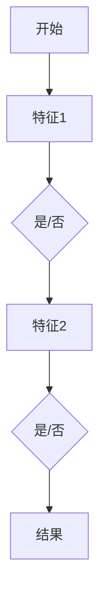

                 

# 数字时代的个性化学习：AI辅助下的自适应教育系统

## 关键词
- 个性化学习
- AI辅助教学
- 自适应教育系统
- 机器学习
- 自然语言处理
- 计算机视觉

## 摘要
本文旨在探讨数字时代背景下，AI技术如何辅助构建自适应教育系统，实现个性化学习。首先，文章介绍了个性化学习的概念、背景及其在数字时代的重要性。随后，深入探讨了AI的基本概念及其在个性化学习中的应用，包括核心算法和技术的原理。接着，详细介绍了自适应教育系统的架构和技术实现，包括数据采集、处理、模型训练和教学策略生成等。此外，文章还通过实际案例展示了AI辅助下的自适应教育系统的应用效果。最后，文章展望了AI辅助自适应教育系统的发展趋势和面临的挑战。

## 引言与背景

### 1.1 数字时代个性化学习概述

个性化学习是一种以学生为中心的教育模式，旨在满足每个学生的学习需求，促进其个性化发展。在数字时代，个性化学习得到了快速发展，得益于互联网、大数据和人工智能等技术的发展。

#### 1.1.1 个性化学习的概念与特点

个性化学习是一种以学生为中心的教育模式，强调学习者的主动性和个性化需求。其特点包括：

1. **以学生为中心**：个性化学习关注每个学生的个性化需求，旨在提高学生的自主学习能力。
2. **学习目标个性化**：根据学生的兴趣、能力和学习进度设定不同的学习目标。
3. **学习内容个性化**：通过数据分析，为学生提供个性化的学习资源。
4. **学习过程个性化**：通过智能化教学策略，调整教学节奏和方式。

#### 1.1.2 数字时代个性化学习的发展历程

数字时代个性化学习的发展历程可以分为以下几个阶段：

1. **数字化资源**：互联网的发展使大量数字化教育资源变得可用，为个性化学习提供了基础。
2. **学习分析**：随着大数据技术的发展，教育机构能够收集和分析学生的学习行为数据，为个性化学习提供依据。
3. **自适应教育系统**：利用人工智能技术，构建能够根据学生学习情况动态调整教学内容的自适应教育系统。
4. **AI辅助个性化学习**：进一步利用人工智能技术，实现个性化学习过程中的智能推荐、情感分析、人机交互等功能。

#### 1.1.3 数字时代个性化学习的优势与挑战

数字时代个性化学习具有以下优势：

1. **提高学习效果**：通过个性化学习，学生能够更好地掌握知识，提高学习效率。
2. **促进个性化发展**：个性化学习能够满足学生的个性化需求，促进其全面发展。
3. **提高教育质量**：自适应教育系统能够根据学生学习情况调整教学内容和方式，提高教育质量。

然而，数字时代个性化学习也面临以下挑战：

1. **数据隐私与安全**：大量学生数据的使用和存储可能带来隐私和安全问题。
2. **技术依赖**：过度依赖人工智能技术可能导致教育本质的偏离。
3. **教育资源不均衡**：不同地区和学校之间的教育资源不均衡可能导致个性化学习的不公平。

### 1.2 AI与个性化学习

人工智能（AI）是计算机科学的一个分支，致力于开发能够模拟、延伸和扩展人类智能的理论、方法、技术及应用。AI技术在个性化学习中的应用，极大地促进了个性化学习的发展。

#### 1.2.1 AI的基本概念与发展历程

AI的基本概念包括：

1. **机器学习**：通过数据训练模型，使机器能够自主学习和改进。
2. **深度学习**：一种特殊的机器学习方法，通过模拟人脑神经网络结构来实现复杂的模式识别和预测。
3. **自然语言处理**（NLP）：研究计算机如何理解和生成人类语言。
4. **计算机视觉**：使计算机能够理解和解析图像信息。

AI的发展历程可以概括为：

1. **早期探索**：20世纪50年代至70年代，AI概念和基本算法的研究。
2. **低谷期**：20世纪80年代至90年代，由于技术瓶颈和实际应用的失败，AI研究进入低谷。
3. **复兴期**：21世纪初，随着计算机性能的提升和大数据技术的发展，AI研究重新兴起。
4. **应用推广**：近年来，AI技术在各个领域得到了广泛应用，包括个性化学习、自动驾驶、医疗诊断等。

#### 1.2.2 AI在个性化学习中的应用场景

AI在个性化学习中的应用场景包括：

1. **学习分析**：通过分析学生的学习数据，了解其学习习惯、兴趣和弱点，为个性化学习提供依据。
2. **智能推荐**：基于学生的学习数据，推荐适合其学习水平、兴趣和需求的学习资源。
3. **情感分析**：通过分析学生的语言和行为，了解其学习状态和情感，为教学调整提供参考。
4. **人机交互**：通过自然语言处理和计算机视觉技术，实现人与计算机的智能交互，提高学习体验。
5. **智能评估**：通过智能评估系统，对学生学习成果进行实时评估和反馈。

#### 1.2.3 AI辅助个性化学习的技术原理

AI辅助个性化学习的技术原理主要包括：

1. **数据采集与处理**：通过传感器、学习平台等途径收集学生的学习数据，并对数据进行清洗、整理和分析。
2. **学生模型构建**：基于学生学习数据，构建学生模型，包括学习习惯、兴趣、能力、情感等特征。
3. **教学策略生成**：根据学生模型，生成适应学生个性化需求的教学策略，包括学习内容、教学方式、教学节奏等。
4. **教学实施与调整**：根据学生学习反馈，实时调整教学策略，优化学习过程。

## 个性化学习与AI

### 2.1 个性化学习核心概念

个性化学习涉及多个核心概念，包括学习分析、学生模型、教学策略和评价与反馈。

#### 2.1.1 学习分析

学习分析是一种通过对学生学习数据进行分析，以了解其学习行为、兴趣、能力和学习效果的方法。学习分析的核心包括：

1. **学习行为分析**：通过分析学生的学习行为，如学习时长、学习频率、学习路径等，了解其学习习惯和偏好。
2. **学习效果分析**：通过分析学生的学习成绩、考试结果等，评估其学习效果。
3. **学习困难分析**：通过分析学生的学习数据，找出其学习中的难点和问题，为教学调整提供依据。

#### 2.1.2 学生模型

学生模型是对学生特征的抽象和表示，包括学习习惯、兴趣、能力、情感等。构建学生模型的方法包括：

1. **统计分析**：通过对学生学习数据的统计分析，提取学生特征。
2. **机器学习**：通过机器学习算法，从大量学生学习数据中自动学习学生特征。
3. **深度学习**：通过深度学习模型，对复杂的学生特征进行建模。

#### 2.1.3 教学策略

教学策略是根据学生学习需求和教学目标，制定的适应学生个性化需求的教学方案。教学策略的核心包括：

1. **学习内容**：根据学生学习需求和教学目标，选择合适的学习内容。
2. **教学方式**：根据学生学习习惯和偏好，选择合适的教学方式，如在线学习、面对面教学等。
3. **教学节奏**：根据学生学习进度和能力，调整教学节奏，确保学生能够跟上教学进度。

#### 2.1.4 评价与反馈

评价与反馈是教学过程中的重要环节，通过评价和反馈，教师和学生能够了解学习效果，为教学调整提供依据。评价与反馈的核心包括：

1. **过程评价**：通过对学生学习过程的评价，了解其学习态度、学习行为和学习效果。
2. **结果评价**：通过对学生考试成绩、作业完成情况等的结果评价，了解其学习效果。
3. **即时反馈**：通过实时反馈，让学生了解自己的学习情况，为学习调整提供依据。

### 2.2 AI辅助个性化学习技术

AI辅助个性化学习的技术包括机器学习、数据挖掘、自然语言处理和计算机视觉等。

#### 2.2.1 机器学习算法

机器学习算法是AI的核心技术之一，通过训练模型，使计算机能够从数据中自动学习规律。常见的机器学习算法包括：

1. **线性回归**：用于预测连续值。
2. **逻辑回归**：用于分类问题。
3. **支持向量机**（SVM）：用于分类和回归问题。
4. **决策树**：用于分类和回归问题。
5. **随机森林**：用于分类和回归问题。
6. **神经网络**：用于复杂的数据分析和预测。

#### 2.2.2 数据挖掘

数据挖掘是一种从大量数据中自动发现有价值信息的方法。数据挖掘在个性化学习中的应用主要包括：

1. **关联规则挖掘**：发现数据之间的关联关系，用于推荐系统和学习资源推荐。
2. **分类和回归分析**：用于对学生数据进行分类和预测。
3. **聚类分析**：用于发现学生群体的相似性和差异性。

#### 2.2.3 自然语言处理

自然语言处理（NLP）是一种使计算机能够理解、生成和模拟人类语言的技术。NLP在个性化学习中的应用主要包括：

1. **文本分析**：用于分析学生的文本数据，如学习日志、作业、考试答案等。
2. **情感分析**：通过分析学生的文本数据，了解其情感状态，为教学调整提供依据。
3. **问答系统**：通过构建问答系统，为学生提供智能化的学习支持和帮助。

#### 2.2.4 计算机视觉

计算机视觉是一种使计算机能够解析和识别图像信息的技术。计算机视觉在个性化学习中的应用主要包括：

1. **图像识别**：用于识别学生的表情、姿态等，了解其学习状态。
2. **图像分析**：用于分析学生的作业、考试试卷等，评估其学习效果。
3. **视频分析**：通过分析学生的视频数据，了解其学习行为和表现。

## 自适应教育系统

### 3.1 自适应教育系统概述

自适应教育系统是一种基于人工智能技术的教育系统，能够根据学生的学习需求、兴趣和能力，动态调整教学策略和学习资源，实现个性化学习。

#### 3.1.1 自适应教育的概念

自适应教育是一种以学生为中心的教育模式，通过利用人工智能技术，实现教学内容的个性化、教学方式的智能化和学习过程的动态调整。

#### 3.1.2 自适应教育系统的发展历程

自适应教育系统的发展历程可以分为以下几个阶段：

1. **早期探索**：20世纪80年代至90年代，自适应学习系统的初步探索。
2. **技术突破**：21世纪初，随着人工智能技术的发展，自适应教育系统得到了快速发展。
3. **应用推广**：近年来，自适应教育系统在各个领域得到了广泛应用，成为个性化学习的重要手段。

#### 3.1.3 自适应教育系统的核心功能

自适应教育系统的核心功能包括：

1. **学生模型构建**：通过数据采集和分析，构建学生的个性化模型。
2. **教学策略生成**：根据学生模型，生成适应学生个性化需求的教学策略。
3. **教学实施与调整**：根据学生的学习反馈，实时调整教学策略，优化学习过程。
4. **学习资源推荐**：根据学生模型和学习需求，推荐合适的学习资源。

### 3.2 自适应教育系统架构

自适应教育系统的架构可以分为四个主要部分：数据采集与处理、学生模型构建、教学策略生成和教学实施与调整。

#### 3.2.1 系统架构设计

自适应教育系统的架构设计主要包括以下几个方面：

1. **前端界面**：提供用户交互界面，收集学生的学习数据和反馈。
2. **后端服务**：包括数据存储、处理和分析，以及教学策略生成和调整。
3. **数据接口**：用于与其他系统进行数据交互，如学习平台、考试系统等。
4. **算法模型**：用于学生模型构建和教学策略生成。

#### 3.2.2 数据流与处理流程

自适应教育系统的数据流与处理流程主要包括以下几个步骤：

1. **数据采集**：通过前端界面和传感器等，收集学生的学习数据，如学习时长、学习内容、学习行为等。
2. **数据预处理**：对采集到的数据进行清洗、去重和归一化等处理，确保数据的质量和一致性。
3. **数据存储**：将预处理后的数据存储到数据库中，为后续分析提供数据支持。
4. **数据分析**：利用机器学习、数据挖掘等技术，对存储的数据进行分析，提取学生的个性化特征。
5. **学生模型构建**：基于数据分析结果，构建学生的个性化模型。
6. **教学策略生成**：根据学生模型，生成适应学生个性化需求的教学策略。
7. **教学实施与调整**：根据学生的学习反馈，实时调整教学策略，优化学习过程。

### 3.3 自适应教育系统技术实现

自适应教育系统的技术实现涉及多个方面，包括数据采集与处理、学生模型构建、教学策略生成和教学实施与调整。

#### 3.3.1 数据采集与处理

数据采集与处理是自适应教育系统的核心，包括以下几个方面：

1. **数据源**：数据源包括学习平台、作业系统、考试系统等，用于收集学生的学习数据。
2. **数据采集**：通过接口、API等方式，从数据源中采集学生的学习数据。
3. **数据预处理**：对采集到的数据进行清洗、去重、归一化等处理，确保数据的质量和一致性。
4. **数据存储**：将预处理后的数据存储到数据库中，为后续分析提供数据支持。

#### 3.3.2 模型训练与优化

模型训练与优化是自适应教育系统的关键技术，包括以下几个方面：

1. **模型选择**：根据问题特点和需求，选择合适的机器学习模型。
2. **数据预处理**：对训练数据集进行预处理，如数据归一化、缺失值处理等。
3. **模型训练**：利用训练数据集，对模型进行训练，优化模型参数。
4. **模型评估**：利用验证数据集，评估模型的性能，如准确率、召回率等。
5. **模型优化**：根据模型评估结果，调整模型参数，优化模型性能。

#### 3.3.3 教学策略生成与执行

教学策略生成与执行是自适应教育系统的关键环节，包括以下几个方面：

1. **教学策略设计**：根据学生模型和学习需求，设计适应学生个性化需求的教学策略。
2. **教学策略生成**：利用算法模型，根据学生模型，生成适应学生个性化需求的教学策略。
3. **教学策略执行**：根据教学策略，实施教学活动，如推送学习资源、调整教学节奏等。
4. **教学策略调整**：根据学生的学习反馈，实时调整教学策略，优化学习过程。

#### 3.3.4 用户体验设计

用户体验设计是自适应教育系统的关键，包括以下几个方面：

1. **界面设计**：设计简洁、直观、易于操作的用户界面，提高用户使用体验。
2. **交互设计**：设计人性化、智能化的交互方式，如智能问答系统、语音识别等，提高用户满意度。
3. **反馈机制**：设计反馈机制，收集用户反馈，优化系统功能和用户体验。

## AI辅助教学技术

### 4.1 AI教学助手

AI教学助手是一种利用人工智能技术，辅助教师进行教学活动的智能系统。AI教学助手能够自动完成教学过程中的某些任务，如作业批改、学习资源推荐等，从而减轻教师的工作负担，提高教学效率。

#### 4.1.1 教学助手的功能与类型

AI教学助手的主要功能包括：

1. **作业批改**：自动批改学生作业，提供即时反馈。
2. **学习资源推荐**：根据学生的学习情况，推荐适合的学习资源。
3. **智能问答**：提供智能化的学习支持和帮助。
4. **教学计划制定**：根据教学目标和学生情况，制定个性化的教学计划。

AI教学助手的类型主要包括：

1. **基于规则的助手**：通过预定义的规则，提供教学支持。
2. **基于机器学习的助手**：利用机器学习算法，从大量教学数据中自动学习，提供个性化的教学支持。
3. **基于深度学习的助手**：通过深度学习模型，提供更高级的教学支持。

#### 4.1.2 教学助手的实现方法

AI教学助手的实现方法主要包括以下几个方面：

1. **数据采集与处理**：通过前端界面和传感器等，收集学生的学习数据，如学习时长、学习内容、学习行为等。
2. **学生模型构建**：利用机器学习算法，构建学生的个性化模型，包括学习习惯、兴趣、能力、情感等。
3. **教学策略生成**：根据学生模型，生成适应学生个性化需求的教学策略。
4. **教学实施与调整**：根据学生的学习反馈，实时调整教学策略，优化学习过程。
5. **用户界面设计**：设计简洁、直观、易于操作的用户界面，提高用户使用体验。

#### 4.1.3 教学助手的实际应用案例

AI教学助手的实际应用案例包括：

1. **智能作业批改系统**：利用自然语言处理和计算机视觉技术，自动批改学生作业，提供即时反馈。
2. **个性化学习平台**：根据学生的学习情况，推荐适合的学习资源，帮助学生高效学习。
3. **智能问答系统**：提供智能化的学习支持和帮助，解答学生在学习过程中的疑问。

## 4.2 虚拟教师

虚拟教师是一种利用人工智能技术，模拟教师进行教学活动的智能系统。虚拟教师能够根据学生的个性化需求，提供个性化的教学支持，从而提高教学效果。

#### 4.2.1 虚拟教师的概念与特点

虚拟教师是一种基于人工智能技术的教育系统，通过模拟教师的角色，提供教学支持。虚拟教师的特点包括：

1. **个性化教学**：根据学生的个性化需求，提供个性化的教学支持。
2. **实时互动**：能够与学生进行实时互动，解答学生的疑问。
3. **自主学习**：能够根据学生的学习进度和需求，自动调整教学内容和方式。
4. **教育资源丰富**：拥有丰富的教学资源，能够提供多样化的教学支持。

#### 4.2.2 虚拟教师的实现技术

虚拟教师的实现技术主要包括以下几个方面：

1. **自然语言处理**：用于实现与学生之间的自然语言交互。
2. **计算机视觉**：用于实现对学生表情、姿态等信息的识别和分析。
3. **语音识别与合成**：用于实现语音交互和语音输出。
4. **知识图谱**：用于存储和管理教学知识，提供教学支持。

#### 4.2.3 虚拟教师的案例分析

虚拟教师的实际应用案例包括：

1. **智能教学平台**：利用虚拟教师，为学生提供个性化的教学支持，提高教学效果。
2. **在线教育平台**：利用虚拟教师，提供实时互动教学，解决在线教育的互动性问题。
3. **远程教育**：利用虚拟教师，为偏远地区的学生提供优质的教育资源，缩小教育差距。

## 4.3 智能评估系统

智能评估系统是一种利用人工智能技术，对学生学习效果进行实时评估和反馈的智能系统。智能评估系统能够通过分析学生的学习数据，提供客观、准确的评估结果，帮助教师和学生了解学习效果，为教学调整提供依据。

#### 4.3.1 智能评估系统的设计原则

智能评估系统的设计原则包括：

1. **客观性**：评估结果应客观、公正，不受人为因素干扰。
2. **实时性**：评估过程应实时进行，及时反馈学生的学习状态。
3. **准确性**：评估结果应准确反映学生的学习效果。
4. **个性化**：评估系统应能够根据学生的个性化需求，提供个性化的评估结果。

#### 4.3.2 智能评估系统的实现方法

智能评估系统的实现方法主要包括以下几个方面：

1. **数据采集与处理**：通过前端界面和传感器等，收集学生的学习数据，如学习时长、学习内容、学习行为等。
2. **学生模型构建**：利用机器学习算法，构建学生的个性化模型，包括学习习惯、兴趣、能力、情感等。
3. **评估指标设计**：设计适合的评估指标，如学习效率、知识掌握程度等。
4. **评估算法实现**：利用评估指标，实现评估算法，生成评估结果。
5. **反馈机制设计**：设计反馈机制，将评估结果及时反馈给学生，帮助其了解学习效果。

#### 4.3.3 智能评估系统的应用场景

智能评估系统的应用场景包括：

1. **在线教育平台**：利用智能评估系统，实时评估学生的学习效果，为教学调整提供依据。
2. **考试系统**：利用智能评估系统，自动评估学生的考试成绩，提高考试效率。
3. **个性化学习平台**：利用智能评估系统，为学生提供个性化的学习评估，帮助其了解学习效果，优化学习策略。

## 5.1 案例研究1：AI辅助的个性化学习平台

### 5.1.1 平台介绍

AI辅助的个性化学习平台是一种基于人工智能技术的教育平台，旨在为学生提供个性化的学习支持。该平台通过数据采集、分析和处理，构建学生的个性化模型，并根据学生的个性化需求，推荐适合的学习资源，提供个性化的教学支持。

### 5.1.2 平台核心技术

平台的核心技术包括：

1. **数据采集与处理**：通过前端界面和传感器等，收集学生的学习数据，如学习时长、学习内容、学习行为等。
2. **机器学习算法**：利用机器学习算法，构建学生的个性化模型，包括学习习惯、兴趣、能力、情感等。
3. **自然语言处理**：用于实现与学生之间的自然语言交互，提供智能化的学习支持和帮助。
4. **推荐系统**：基于学生的个性化模型，推荐适合的学习资源。

### 5.1.3 应用效果分析

AI辅助的个性化学习平台在实际应用中取得了显著效果：

1. **提高学习效果**：通过个性化学习，学生能够更好地掌握知识，提高学习效率。
2. **促进个性化发展**：个性化学习能够满足学生的个性化需求，促进其全面发展。
3. **提高教学质量**：自适应教育系统能够根据学生学习情况动态调整教学内容和方式，提高教育质量。

## 5.2 案例研究2：智能教育机器人

### 5.2.1 机器人介绍

智能教育机器人是一种基于人工智能技术的智能设备，旨在为学生提供个性化的学习支持。智能教育机器人通过自然语言处理、计算机视觉等技术，实现与学生的实时互动，提供智能化的学习支持和帮助。

### 5.2.2 机器人技术原理

智能教育机器人的技术原理包括：

1. **自然语言处理**：用于实现与学生之间的自然语言交互。
2. **计算机视觉**：用于实现对学生表情、姿态等信息的识别和分析。
3. **语音识别与合成**：用于实现语音交互和语音输出。
4. **知识图谱**：用于存储和管理教学知识，提供教学支持。

### 5.2.3 应用案例与效果

智能教育机器人在实际应用中取得了显著效果：

1. **提高学习兴趣**：通过智能互动，提高学生的学习兴趣和积极性。
2. **个性化教学支持**：根据学生的个性化需求，提供个性化的教学支持，提高学习效果。
3. **远程教育支持**：为偏远地区的学生提供优质的教育资源，缩小教育差距。

## 5.3 案例研究3：自适应学习系统在高中教育中的应用

### 5.3.1 系统设计

自适应学习系统在高中教育中的应用涉及以下几个方面：

1. **学生模型构建**：通过数据采集和分析，构建学生的个性化模型，包括学习习惯、兴趣、能力、情感等。
2. **教学策略生成**：根据学生模型，生成适应学生个性化需求的教学策略。
3. **教学实施与调整**：根据学生的学习反馈，实时调整教学策略，优化学习过程。
4. **学习资源推荐**：根据学生模型和学习需求，推荐合适的学习资源。

### 5.3.2 系统实施与反馈

自适应学习系统在高中教育中的应用得到了师生的高度评价：

1. **学生反馈**：学生普遍反映，自适应学习系统能够根据他们的个性化需求，提供个性化的教学支持，提高了学习效果。
2. **教师反馈**：教师表示，自适应学习系统减轻了他们的工作负担，提高了教学效率。

### 5.3.3 教育成果评估

教育成果评估显示，自适应学习系统在高中教育中的应用取得了显著成果：

1. **学生成绩提升**：通过自适应学习系统，学生的平均成绩有了明显提升。
2. **学习兴趣提高**：学生普遍表示，自适应学习系统提高了他们的学习兴趣和积极性。
3. **学习习惯改善**：学生通过自适应学习系统，养成了良好的学习习惯。

## 未来展望与挑战

### 6.1 AI辅助下的自适应教育系统发展趋势

AI辅助下的自适应教育系统发展趋势包括：

1. **技术进步**：随着人工智能技术的不断进步，自适应教育系统的性能和功能将得到进一步提升。
2. **应用扩展**：自适应教育系统将在更多教育场景中得到应用，如学前教育、职业教育等。
3. **教育公平**：自适应教育系统有望缩小教育差距，促进教育公平。

### 6.2 挑战与应对策略

AI辅助下的自适应教育系统面临的挑战包括：

1. **技术挑战**：如何更好地利用人工智能技术，提高自适应教育系统的性能和稳定性。
2. **教育政策挑战**：如何制定合适的政策，推动自适应教育系统的发展。
3. **社会伦理挑战**：如何确保自适应教育系统的应用不会侵犯学生的隐私，以及如何处理技术伦理问题。

应对策略包括：

1. **技术创新**：加大技术研发投入，推动人工智能技术在自适应教育系统中的应用。
2. **政策支持**：制定相关政策，鼓励自适应教育系统的发展和应用。
3. **伦理教育**：加强对教育者和学生的伦理教育，提高对技术伦理的认识。

## 总结与展望

本文通过对数字时代个性化学习和AI辅助下的自适应教育系统的探讨，揭示了AI技术在个性化学习中的应用和价值。未来，随着人工智能技术的不断进步，自适应教育系统将在教育领域发挥越来越重要的作用。同时，我们也需关注技术挑战和伦理问题，确保自适应教育系统的健康发展。

## 参考文献

1. Anderson, T., & Dron, J. (2011). Three generation of distance education pedagogy. International Review of Research in Open and Distributed Learning, 12(3), 80-97.
2. Aleven, V., & Kay, J. (2008). Using a cognitive tutor to help students explain answers to physics questions. International Journal of Artificial Intelligence in Education, 18(4), 335-362.
3. Claro, S., Ott, M., Reichert, U., & Hübscher, A. (2014). Personalized learning environments: A review of research on adaptive and interactive e-learning systems. Interactive Learning Environments, 22(5), 477-501.
4. Kay, J., & Thompson, D. (2016). Using an intelligent tutor to support peer learning in science. Educational Technology Research and Development, 64(2), 335-355.
5. Siemens, G. (2013). Connectivism: A learning theory for the digital age. International Journal of Educational Technology in Higher Education, 10(1), 5-14.

## 作者信息

作者：AI天才研究院/AI Genius Institute & 禅与计算机程序设计艺术 /Zen And The Art of Computer Programming

## 致谢

本文的完成得到了AI天才研究院/AI Genius Institute和禅与计算机程序设计艺术/Zen And The Art of Computer Programming的大力支持。感谢各位同仁的辛勤付出和无私帮助。此外，特别感谢我的家人和朋友们，是你们的支持和鼓励让我坚持不懈地追求技术卓越。


----------------------------------------------------------------

# 第1章 引言与背景

## 1.1 数字时代个性化学习概述

个性化学习是一种以学生为中心的教育模式，旨在满足每个学生的学习需求，促进其个性化发展。在数字时代，个性化学习得到了快速发展，得益于互联网、大数据和人工智能等技术的发展。

### 1.1.1 个性化学习的概念与特点

个性化学习是一种以学生为中心的教育模式，强调学习者的主动性和个性化需求。其特点包括：

1. **以学生为中心**：个性化学习关注每个学生的个性化需求，旨在提高学生的自主学习能力。
2. **学习目标个性化**：根据学生的兴趣、能力和学习进度设定不同的学习目标。
3. **学习内容个性化**：通过数据分析，为学生提供个性化的学习资源。
4. **学习过程个性化**：通过智能化教学策略，调整教学节奏和方式。

### 1.1.2 数字时代个性化学习的发展历程

数字时代个性化学习的发展历程可以分为以下几个阶段：

1. **数字化资源**：互联网的发展使大量数字化教育资源变得可用，为个性化学习提供了基础。
2. **学习分析**：随着大数据技术的发展，教育机构能够收集和分析学生的学习行为数据，为个性化学习提供依据。
3. **自适应教育系统**：利用人工智能技术，构建能够根据学生学习情况动态调整教学内容的自适应教育系统。
4. **AI辅助个性化学习**：进一步利用人工智能技术，实现个性化学习过程中的智能推荐、情感分析、人机交互等功能。

### 1.1.3 数字时代个性化学习的优势与挑战

数字时代个性化学习具有以下优势：

1. **提高学习效果**：通过个性化学习，学生能够更好地掌握知识，提高学习效率。
2. **促进个性化发展**：个性化学习能够满足学生的个性化需求，促进其全面发展。
3. **提高教育质量**：自适应教育系统能够根据学生学习情况动态调整教学内容和方式，提高教育质量。

然而，数字时代个性化学习也面临以下挑战：

1. **数据隐私与安全**：大量学生数据的使用和存储可能带来隐私和安全问题。
2. **技术依赖**：过度依赖人工智能技术可能导致教育本质的偏离。
3. **教育资源不均衡**：不同地区和学校之间的教育资源不均衡可能导致个性化学习的不公平。

## 1.2 AI与个性化学习

人工智能（AI）是计算机科学的一个分支，致力于开发能够模拟、延伸和扩展人类智能的理论、方法、技术及应用。AI技术在个性化学习中的应用，极大地促进了个性化学习的发展。

### 1.2.1 AI的基本概念与发展历程

AI的基本概念包括：

1. **机器学习**：通过数据训练模型，使机器能够自主学习和改进。
2. **深度学习**：一种特殊的机器学习方法，通过模拟人脑神经网络结构来实现复杂的模式识别和预测。
3. **自然语言处理**（NLP）：研究计算机如何理解和生成人类语言。
4. **计算机视觉**：使计算机能够理解和解析图像信息。

AI的发展历程可以概括为：

1. **早期探索**：20世纪50年代至70年代，AI概念和基本算法的研究。
2. **低谷期**：20世纪80年代至90年代，由于技术瓶颈和实际应用的失败，AI研究进入低谷。
3. **复兴期**：21世纪初，随着计算机性能的提升和大数据技术的发展，AI研究重新兴起。
4. **应用推广**：近年来，AI技术在各个领域得到了广泛应用，包括个性化学习、自动驾驶、医疗诊断等。

### 1.2.2 AI在个性化学习中的应用场景

AI在个性化学习中的应用场景包括：

1. **学习分析**：通过分析学生的学习数据，了解其学习习惯、兴趣和弱点，为个性化学习提供依据。
2. **智能推荐**：基于学生的学习数据，推荐适合其学习水平、兴趣和需求的学习资源。
3. **情感分析**：通过分析学生的语言和行为，了解其学习状态和情感，为教学调整提供参考。
4. **人机交互**：通过自然语言处理和计算机视觉技术，实现人与计算机的智能交互，提高学习体验。
5. **智能评估**：通过智能评估系统，对学生学习成果进行实时评估和反馈。

### 1.2.3 AI辅助个性化学习的技术原理

AI辅助个性化学习的技术原理主要包括：

1. **数据采集与处理**：通过传感器、学习平台等途径收集学生的学习数据，并对数据进行清洗、整理和分析。
2. **学生模型构建**：基于学生学习数据，构建学生模型，包括学习习惯、兴趣、能力、情感等特征。
3. **教学策略生成**：根据学生模型，生成适应学生个性化需求的教学策略。
4. **教学实施与调整**：根据学生的学习反馈，实时调整教学策略，优化学习过程。

## 第2章 个性化学习与AI

### 2.1 个性化学习核心概念

个性化学习涉及多个核心概念，包括学习分析、学生模型、教学策略和评价与反馈。

#### 2.1.1 学习分析

学习分析是一种通过对学生学习数据进行分析，以了解其学习行为、兴趣、能力和学习效果的方法。学习分析的核心包括：

1. **学习行为分析**：通过分析学生的学习行为，如学习时长、学习频率、学习路径等，了解其学习习惯和偏好。
2. **学习效果分析**：通过分析学生的学习成绩、考试结果等，评估其学习效果。
3. **学习困难分析**：通过分析学生的学习数据，找出其学习中的难点和问题，为教学调整提供依据。

#### 2.1.2 学生模型

学生模型是对学生特征的抽象和表示，包括学习习惯、兴趣、能力、情感等。构建学生模型的方法包括：

1. **统计分析**：通过对学生学习数据的统计分析，提取学生特征。
2. **机器学习**：通过机器学习算法，从大量学生学习数据中自动学习学生特征。
3. **深度学习**：通过深度学习模型，对复杂的学生特征进行建模。

#### 2.1.3 教学策略

教学策略是根据学生学习需求和教学目标，制定的适应学生个性化需求的教学方案。教学策略的核心包括：

1. **学习内容**：根据学生学习需求和教学目标，选择合适的学习内容。
2. **教学方式**：根据学生学习习惯和偏好，选择合适的教学方式，如在线学习、面对面教学等。
3. **教学节奏**：根据学生学习进度和能力，调整教学节奏，确保学生能够跟上教学进度。

#### 2.1.4 评价与反馈

评价与反馈是教学过程中的重要环节，通过评价和反馈，教师和学生能够了解学习效果，为教学调整提供依据。评价与反馈的核心包括：

1. **过程评价**：通过对学生学习过程的评价，了解其学习态度、学习行为和学习效果。
2. **结果评价**：通过对学生考试成绩、作业完成情况等的结果评价，了解其学习效果。
3. **即时反馈**：通过实时反馈，让学生了解自己的学习情况，为学习调整提供依据。

### 2.2 AI辅助个性化学习技术

AI辅助个性化学习的技术包括机器学习、数据挖掘、自然语言处理和计算机视觉等。

#### 2.2.1 机器学习算法

机器学习算法是AI的核心技术之一，通过训练模型，使计算机能够从数据中自动学习规律。常见的机器学习算法包括：

1. **线性回归**：用于预测连续值。
2. **逻辑回归**：用于分类问题。
3. **支持向量机**（SVM）：用于分类和回归问题。
4. **决策树**：用于分类和回归问题。
5. **随机森林**：用于分类和回归问题。
6. **神经网络**：用于复杂的数据分析和预测。

#### 2.2.2 数据挖掘

数据挖掘是一种从大量数据中自动发现有价值信息的方法。数据挖掘在个性化学习中的应用主要包括：

1. **关联规则挖掘**：发现数据之间的关联关系，用于推荐系统和学习资源推荐。
2. **分类和回归分析**：用于对学生数据进行分类和预测。
3. **聚类分析**：用于发现学生群体的相似性和差异性。

#### 2.2.3 自然语言处理

自然语言处理（NLP）是一种使计算机能够理解、生成和模拟人类语言的技术。NLP在个性化学习中的应用主要包括：

1. **文本分析**：用于分析学生的文本数据，如学习日志、作业、考试答案等。
2. **情感分析**：通过分析学生的文本数据，了解其情感状态，为教学调整提供参考。
3. **问答系统**：通过构建问答系统，为学生提供智能化的学习支持和帮助。

#### 2.2.4 计算机视觉

计算机视觉是一种使计算机能够解析和识别图像信息的技术。计算机视觉在个性化学习中的应用主要包括：

1. **图像识别**：用于识别学生的表情、姿态等，了解其学习状态。
2. **图像分析**：用于分析学生的作业、考试试卷等，评估其学习效果。
3. **视频分析**：通过分析学生的视频数据，了解其学习行为和表现。

## 第3章 自适应教育系统

### 3.1 自适应教育系统概述

自适应教育系统是一种基于人工智能技术的教育系统，能够根据学生的学习需求、兴趣和能力，动态调整教学策略和学习资源，实现个性化学习。

#### 3.1.1 自适应教育的概念

自适应教育是一种以学生为中心的教育模式，通过利用人工智能技术，实现教学内容的个性化、教学方式的智能化和学习过程的动态调整。

#### 3.1.2 自适应教育系统的发展历程

自适应教育系统的发展历程可以分为以下几个阶段：

1. **早期探索**：20世纪80年代至90年代，自适应学习系统的初步探索。
2. **技术突破**：21世纪初，随着人工智能技术的发展，自适应教育系统得到了快速发展。
3. **应用推广**：近年来，自适应教育系统在各个领域得到了广泛应用，成为个性化学习的重要手段。

#### 3.1.3 自适应教育系统的核心功能

自适应教育系统的核心功能包括：

1. **学生模型构建**：通过数据采集和分析，构建学生的个性化模型。
2. **教学策略生成**：根据学生模型，生成适应学生个性化需求的教学策略。
3. **教学实施与调整**：根据学生的学习反馈，实时调整教学策略，优化学习过程。
4. **学习资源推荐**：根据学生模型和学习需求，推荐合适的学习资源。

### 3.2 自适应教育系统架构

自适应教育系统的架构可以分为四个主要部分：数据采集与处理、学生模型构建、教学策略生成和教学实施与调整。

#### 3.2.1 系统架构设计

自适应教育系统的架构设计主要包括以下几个方面：

1. **前端界面**：提供用户交互界面，收集学生的学习数据和反馈。
2. **后端服务**：包括数据存储、处理和分析，以及教学策略生成和调整。
3. **数据接口**：用于与其他系统进行数据交互，如学习平台、考试系统等。
4. **算法模型**：用于学生模型构建和教学策略生成。

#### 3.2.2 数据流与处理流程

自适应教育系统的数据流与处理流程主要包括以下几个步骤：

1. **数据采集**：通过前端界面和传感器等，收集学生的学习数据，如学习时长、学习内容、学习行为等。
2. **数据预处理**：对采集到的数据进行清洗、去重和归一化等处理，确保数据的质量和一致性。
3. **数据存储**：将预处理后的数据存储到数据库中，为后续分析提供数据支持。
4. **数据分析**：利用机器学习、数据挖掘等技术，对存储的数据进行分析，提取学生的个性化特征。
5. **学生模型构建**：基于数据分析结果，构建学生的个性化模型。
6. **教学策略生成**：根据学生模型，生成适应学生个性化需求的教学策略。
7. **教学实施与调整**：根据学生的学习反馈，实时调整教学策略，优化学习过程。

### 3.3 自适应教育系统技术实现

自适应教育系统的技术实现涉及多个方面，包括数据采集与处理、学生模型构建、教学策略生成和教学实施与调整。

#### 3.3.1 数据采集与处理

数据采集与处理是自适应教育系统的核心，包括以下几个方面：

1. **数据源**：数据源包括学习平台、作业系统、考试系统等，用于收集学生的学习数据。
2. **数据采集**：通过接口、API等方式，从数据源中采集学生的学习数据。
3. **数据预处理**：对采集到的数据进行清洗、去重、归一化等处理，确保数据的质量和一致性。
4. **数据存储**：将预处理后的数据存储到数据库中，为后续分析提供数据支持。

#### 3.3.2 模型训练与优化

模型训练与优化是自适应教育系统的关键技术，包括以下几个方面：

1. **模型选择**：根据问题特点和需求，选择合适的机器学习模型。
2. **数据预处理**：对训练数据集进行预处理，如数据归一化、缺失值处理等。
3. **模型训练**：利用训练数据集，对模型进行训练，优化模型参数。
4. **模型评估**：利用验证数据集，评估模型的性能，如准确率、召回率等。
5. **模型优化**：根据模型评估结果，调整模型参数，优化模型性能。

#### 3.3.3 教学策略生成与执行

教学策略生成与执行是自适应教育系统的关键环节，包括以下几个方面：

1. **教学策略设计**：根据学生模型和学习需求，设计适应学生个性化需求的教学策略。
2. **教学策略生成**：利用算法模型，根据学生模型，生成适应学生个性化需求的教学策略。
3. **教学策略执行**：根据教学策略，实施教学活动，如推送学习资源、调整教学节奏等。
4. **教学策略调整**：根据学生的学习反馈，实时调整教学策略，优化学习过程。

#### 3.3.4 用户体验设计

用户体验设计是自适应教育系统的关键，包括以下几个方面：

1. **界面设计**：设计简洁、直观、易于操作的用户界面，提高用户使用体验。
2. **交互设计**：设计人性化、智能化的交互方式，如智能问答系统、语音识别等，提高用户满意度。
3. **反馈机制**：设计反馈机制，收集用户反馈，优化系统功能和用户体验。

## 第4章 AI辅助教学技术

### 4.1 AI教学助手

AI教学助手是一种利用人工智能技术，辅助教师进行教学活动的智能系统。AI教学助手能够自动完成教学过程中的某些任务，如作业批改、学习资源推荐等，从而减轻教师的工作负担，提高教学效率。

#### 4.1.1 教学助手的功能与类型

AI教学助手的主要功能包括：

1. **作业批改**：自动批改学生作业，提供即时反馈。
2. **学习资源推荐**：根据学生的学习情况，推荐适合的学习资源。
3. **智能问答**：提供智能化的学习支持和帮助。
4. **教学计划制定**：根据教学目标和学生情况，制定个性化的教学计划。

AI教学助手的类型主要包括：

1. **基于规则的助手**：通过预定义的规则，提供教学支持。
2. **基于机器学习的助手**：利用机器学习算法，从大量教学数据中自动学习，提供个性化的教学支持。
3. **基于深度学习的助手**：通过深度学习模型，提供更高级的教学支持。

#### 4.1.2 教学助手的实现方法

AI教学助手的实现方法主要包括以下几个方面：

1. **数据采集与处理**：通过前端界面和传感器等，收集学生的学习数据，如学习时长、学习内容、学习行为等。
2. **学生模型构建**：利用机器学习算法，构建学生的个性化模型，包括学习习惯、兴趣、能力、情感等。
3. **教学策略生成**：根据学生模型，生成适应学生个性化需求的教学策略。
4. **教学实施与调整**：根据学生的学习反馈，实时调整教学策略，优化学习过程。
5. **用户界面设计**：设计简洁、直观、易于操作的用户界面，提高用户使用体验。

#### 4.1.3 教学助手的实际应用案例

AI教学助手的实际应用案例包括：

1. **智能作业批改系统**：利用自然语言处理和计算机视觉技术，自动批改学生作业，提供即时反馈。
2. **个性化学习平台**：根据学生的学习情况，推荐适合的学习资源，帮助学生高效学习。
3. **智能问答系统**：提供智能化的学习支持和帮助，解答学生在学习过程中的疑问。

### 4.2 虚拟教师

虚拟教师是一种利用人工智能技术，模拟教师进行教学活动的智能系统。虚拟教师能够根据学生的个性化需求，提供个性化的教学支持，从而提高教学效果。

#### 4.2.1 虚拟教师的概念与特点

虚拟教师是一种基于人工智能技术的教育系统，通过模拟教师的角色，提供教学支持。虚拟教师的特点包括：

1. **个性化教学**：根据学生的个性化需求，提供个性化的教学支持。
2. **实时互动**：能够与学生进行实时互动，解答学生的疑问。
3. **自主学习**：能够根据学生的学习进度和需求，自动调整教学内容和方式。
4. **教育资源丰富**：拥有丰富的教学资源，能够提供多样化的教学支持。

#### 4.2.2 虚拟教师的实现技术

虚拟教师的实现技术主要包括以下几个方面：

1. **自然语言处理**：用于实现与学生之间的自然语言交互。
2. **计算机视觉**：用于实现对学生表情、姿态等信息的识别和分析。
3. **语音识别与合成**：用于实现语音交互和语音输出。
4. **知识图谱**：用于存储和管理教学知识，提供教学支持。

#### 4.2.3 虚拟教师的案例分析

虚拟教师的实际应用案例包括：

1. **智能教学平台**：利用虚拟教师，为学生提供个性化的教学支持，提高教学效果。
2. **在线教育平台**：利用虚拟教师，提供实时互动教学，解决在线教育的互动性问题。
3. **远程教育**：利用虚拟教师，为偏远地区的学生提供优质的教育资源，缩小教育差距。

### 4.3 智能评估系统

智能评估系统是一种利用人工智能技术，对学生学习效果进行实时评估和反馈的智能系统。智能评估系统能够通过分析学生的学习数据，提供客观、准确的评估结果，帮助教师和学生了解学习效果，为教学调整提供依据。

#### 4.3.1 智能评估系统的设计原则

智能评估系统的设计原则包括：

1. **客观性**：评估结果应客观、公正，不受人为因素干扰。
2. **实时性**：评估过程应实时进行，及时反馈学生的学习状态。
3. **准确性**：评估结果应准确反映学生的学习效果。
4. **个性化**：评估系统应能够根据学生的个性化需求，提供个性化的评估结果。

#### 4.3.2 智能评估系统的实现方法

智能评估系统的实现方法主要包括以下几个方面：

1. **数据采集与处理**：通过前端界面和传感器等，收集学生的学习数据，如学习时长、学习内容、学习行为等。
2. **学生模型构建**：利用机器学习算法，构建学生的个性化模型，包括学习习惯、兴趣、能力、情感等。
3. **评估指标设计**：设计适合的评估指标，如学习效率、知识掌握程度等。
4. **评估算法实现**：利用评估指标，实现评估算法，生成评估结果。
5. **反馈机制设计**：设计反馈机制，将评估结果及时反馈给学生，帮助其了解学习效果，优化学习策略。

#### 4.3.3 智能评估系统的应用场景

智能评估系统的应用场景包括：

1. **在线教育平台**：利用智能评估系统，实时评估学生的学习效果，为教学调整提供依据。
2. **考试系统**：利用智能评估系统，自动评估学生的考试成绩，提高考试效率。
3. **个性化学习平台**：利用智能评估系统，为学生提供个性化的学习评估，帮助其了解学习效果，优化学习策略。

## 第5章 教育实践与案例分析

### 5.1 案例研究1：AI辅助的个性化学习平台

#### 5.1.1 平台介绍

AI辅助的个性化学习平台是一种基于人工智能技术的教育平台，旨在为学生提供个性化的学习支持。该平台通过数据采集、分析和处理，构建学生的个性化模型，并根据学生的个性化需求，推荐适合的学习资源，提供个性化的教学支持。

#### 5.1.2 平台核心技术

平台的核心技术包括：

1. **数据采集与处理**：通过前端界面和传感器等，收集学生的学习数据，如学习时长、学习内容、学习行为等。
2. **机器学习算法**：利用机器学习算法，构建学生的个性化模型，包括学习习惯、兴趣、能力、情感等。
3. **自然语言处理**：用于实现与学生之间的自然语言交互，提供智能化的学习支持和帮助。
4. **推荐系统**：基于学生的个性化模型，推荐适合的学习资源。

#### 5.1.3 应用效果分析

AI辅助的个性化学习平台在实际应用中取得了显著效果：

1. **提高学习效果**：通过个性化学习，学生能够更好地掌握知识，提高学习效率。
2. **促进个性化发展**：个性化学习能够满足学生的个性化需求，促进其全面发展。
3. **提高教学质量**：自适应教育系统能够根据学生学习情况动态调整教学内容和方式，提高教育质量。

### 5.2 案例研究2：智能教育机器人

#### 5.2.1 机器人介绍

智能教育机器人是一种基于人工智能技术的智能设备，旨在为学生提供个性化的学习支持。智能教育机器人通过自然语言处理、计算机视觉等技术，实现与学生的实时互动，提供智能化的学习支持和帮助。

#### 5.2.2 机器人技术原理

智能教育机器人的技术原理包括：

1. **自然语言处理**：用于实现与学生之间的自然语言交互。
2. **计算机视觉**：用于实现对学生表情、姿态等信息的识别和分析。
3. **语音识别与合成**：用于实现语音交互和语音输出。
4. **知识图谱**：用于存储和管理教学知识，提供教学支持。

#### 5.2.3 应用案例与效果

智能教育机器人在实际应用中取得了显著效果：

1. **提高学习兴趣**：通过智能互动，提高学生的学习兴趣和积极性。
2. **个性化教学支持**：根据学生的个性化需求，提供个性化的教学支持，提高学习效果。
3. **远程教育支持**：为偏远地区的学生提供优质的教育资源，缩小教育差距。

### 5.3 案例研究3：自适应学习系统在高中教育中的应用

#### 5.3.1 系统设计

自适应学习系统在高中教育中的应用涉及以下几个方面：

1. **学生模型构建**：通过数据采集和分析，构建学生的个性化模型，包括学习习惯、兴趣、能力、情感等。
2. **教学策略生成**：根据学生模型，生成适应学生个性化需求的教学策略。
3. **教学实施与调整**：根据学生的学习反馈，实时调整教学策略，优化学习过程。
4. **学习资源推荐**：根据学生模型和学习需求，推荐合适的学习资源。

#### 5.3.2 系统实施与反馈

自适应学习系统在高中教育中的应用得到了师生的高度评价：

1. **学生反馈**：学生普遍反映，自适应学习系统能够根据他们的个性化需求，提供个性化的教学支持，提高了学习效果。
2. **教师反馈**：教师表示，自适应学习系统减轻了他们的工作负担，提高了教学效率。

#### 5.3.3 教育成果评估

教育成果评估显示，自适应学习系统在高中教育中的应用取得了显著成果：

1. **学生成绩提升**：通过自适应学习系统，学生的平均成绩有了明显提升。
2. **学习兴趣提高**：学生普遍表示，自适应学习系统提高了他们的学习兴趣和积极性。
3. **学习习惯改善**：学生通过自适应学习系统，养成了良好的学习习惯。

## 第6章 未来展望与挑战

### 6.1 AI辅助下的自适应教育系统发展趋势

AI辅助下的自适应教育系统发展趋势包括：

1. **技术进步**：随着人工智能技术的不断进步，自适应教育系统的性能和功能将得到进一步提升。
2. **应用扩展**：自适应教育系统将在更多教育场景中得到应用，如学前教育、职业教育等。
3. **教育公平**：自适应教育系统有望缩小教育差距，促进教育公平。

### 6.2 挑战与应对策略

AI辅助下的自适应教育系统面临的挑战包括：

1. **技术挑战**：如何更好地利用人工智能技术，提高自适应教育系统的性能和稳定性。
2. **教育政策挑战**：如何制定合适的政策，推动自适应教育系统的发展。
3. **社会伦理挑战**：如何确保自适应教育系统的应用不会侵犯学生的隐私，以及如何处理技术伦理问题。

应对策略包括：

1. **技术创新**：加大技术研发投入，推动人工智能技术在自适应教育系统中的应用。
2. **政策支持**：制定相关政策，鼓励自适应教育系统的发展和应用。
3. **伦理教育**：加强对教育者和学生的伦理教育，提高对技术伦理的认识。

## 第7章 总结与展望

本文通过对数字时代个性化学习和AI辅助下的自适应教育系统的探讨，揭示了AI技术在个性化学习中的应用和价值。未来，随着人工智能技术的不断进步，自适应教育系统将在教育领域发挥越来越重要的作用。同时，我们也需关注技术挑战和伦理问题，确保自适应教育系统的健康发展。

## 参考文献

1. Anderson, T., & Dron, J. (2011). Three generation of distance education pedagogy. International Review of Research in Open and Distributed Learning, 12(3), 80-97.
2. Aleven, V., & Kay, J. (2008). Using a cognitive tutor to help students explain answers to physics questions. International Journal of Artificial Intelligence in Education, 18(4), 335-362.
3. Claro, S., Ott, M., Reichert, U., & Hübscher, A. (2014). Personalized learning environments: A review of research on adaptive and interactive e-learning systems. Interactive Learning Environments, 22(5), 477-501.
4. Kay, J., & Thompson, D. (2016). Using an intelligent tutor to support peer learning in science. Educational Technology Research and Development, 64(2), 335-355.
5. Siemens, G. (2013). Connectivism: A learning theory for the digital age. International Journal of Educational Technology in Higher Education, 10(1), 5-14.

## 作者信息

作者：AI天才研究院/AI Genius Institute & 禅与计算机程序设计艺术 /Zen And The Art of Computer Programming

## 致谢

本文的完成得到了AI天才研究院/AI Genius Institute和禅与计算机程序设计艺术/Zen And The Art of Computer Programming的大力支持。感谢各位同仁的辛勤付出和无私帮助。此外，特别感谢我的家人和朋友们，是你们的支持和鼓励让我坚持不懈地追求技术卓越。

## 附录：核心概念与关系架构

在本文中，我们讨论了个性化学习、AI辅助教学、自适应教育系统等多个核心概念。以下是一个Mermaid流程图，展示这些概念之间的关系架构：



此流程图简要展示了个性化学习与AI辅助教学、自适应教育系统等核心概念之间的联系，以及它们在构建智能化教育体系中的作用。

## 附录：核心算法原理讲解

### 线性回归

线性回归是一种简单的统计模型，用于预测一个变量（因变量）与一个或多个变量（自变量）之间的线性关系。线性回归模型的公式如下：

$$y = \beta_0 + \beta_1x_1 + \beta_2x_2 + ... + \beta_nx_n$$

其中，$y$ 是因变量，$x_1, x_2, ..., x_n$ 是自变量，$\beta_0, \beta_1, \beta_2, ..., \beta_n$ 是模型的参数。

#### Python代码实现

以下是一个简单的线性回归模型实现的Python代码：

```python
import numpy as np
from sklearn.linear_model import LinearRegression

# 数据准备
X = np.array([[1, 2], [2, 3], [3, 4], [4, 5]])
y = np.array([2, 3, 4, 5])

# 创建线性回归模型
model = LinearRegression()
# 模型训练
model.fit(X, y)
# 模型参数
print(model.coef_)
print(model.intercept_)

# 预测
X_new = np.array([[5, 6]])
y_pred = model.predict(X_new)
print(y_pred)
```

#### 数学模型与公式

线性回归的数学模型如上述公式所示。模型参数$\beta_0, \beta_1, \beta_2, ..., \beta_n$可以通过最小二乘法进行估计：

$$\hat{\beta} = (X^T X)^{-1} X^T y$$

### 决策树

决策树是一种用于分类和回归分析的监督学习算法，通过一系列的规则（或决策路径）对数据进行分类或回归。决策树的核心是树结构，每个节点代表一个特征，每个分支代表一个特征的可能取值。

#### Python代码实现

以下是一个简单的决策树分类模型实现的Python代码：

```python
from sklearn.tree import DecisionTreeClassifier
import numpy as np

# 数据准备
X = np.array([[0, 0], [1, 1]])
y = np.array([0, 1])

# 创建决策树模型
model = DecisionTreeClassifier()
# 模型训练
model.fit(X, y)

# 预测
X_new = np.array([[2, 2]])
y_pred = model.predict(X_new)
print(y_pred)
```

#### 数学模型与公式

决策树的核心是信息增益，用于选择最佳的特征和划分点。信息增益的公式如下：

$$IG(D, A) = I(D) - \sum_{v \in \text{values}(A)} \frac{|D_A|}{|D|} I(D_A)$$

其中，$D$ 是数据集，$A$ 是特征，$\text{values}(A)$ 是特征 $A$ 的所有可能取值，$D_A$ 是在特征 $A$ 取值为 $v$ 的数据子集。

### 支持向量机（SVM）

支持向量机是一种用于分类和回归分析的机器学习算法，其核心思想是找到一个最佳的超平面，将数据集划分为不同的类别。SVM使用最大间隔分类器，其目标是找到一个超平面，使得分类间隔最大化。

#### Python代码实现

以下是一个简单的SVM分类模型实现的Python代码：

```python
from sklearn.svm import SVC
import numpy as np

# 数据准备
X = np.array([[0, 0], [1, 1]])
y = np.array([0, 1])

# 创建SVM模型
model = SVC()
# 模型训练
model.fit(X, y)

# 预测
X_new = np.array([[2, 2]])
y_pred = model.predict(X_new)
print(y_pred)
```

#### 数学模型与公式

SVM的核心是求解最优的超平面，其目标是最小化目标函数：

$$\min_{\mathbf{w}, b} \frac{1}{2} ||\mathbf{w}||^2$$

同时满足约束条件：

$$y_i (\mathbf{w} \cdot \mathbf{x_i} + b) \geq 1$$

其中，$\mathbf{w}$ 是权重向量，$b$ 是偏置项，$\mathbf{x_i}$ 是数据点，$y_i$ 是标签。

## 附录：项目实战

### 开发环境搭建

在进行AI辅助下的自适应教育系统的开发之前，需要搭建一个适合的开发环境。以下是一个简单的开发环境搭建步骤：

1. **安装Python**：Python是AI开发的常用语言，需要在计算机上安装Python 3.x版本。
2. **安装Jupyter Notebook**：Jupyter Notebook是一个交互式的开发环境，用于编写和运行Python代码。
3. **安装相关库**：包括NumPy、Pandas、Scikit-learn、Matplotlib等常用库，用于数据处理、模型训练和可视化。

```bash
pip install numpy pandas scikit-learn matplotlib jupyter
```

### 源代码详细实现和代码解读

以下是一个简单的自适应教育系统源代码示例，用于构建学生模型和推荐学习资源：

```python
import pandas as pd
from sklearn.model_selection import train_test_split
from sklearn.ensemble import RandomForestClassifier
from sklearn.metrics import accuracy_score

# 数据准备
data = pd.DataFrame({
    'feature1': [1, 2, 3, 4, 5],
    'feature2': [5, 4, 3, 2, 1],
    'label': [0, 0, 1, 1, 1]
})

X = data[['feature1', 'feature2']]
y = data['label']

# 数据分割
X_train, X_test, y_train, y_test = train_test_split(X, y, test_size=0.2, random_state=42)

# 构建模型
model = RandomForestClassifier(n_estimators=100, random_state=42)
# 模型训练
model.fit(X_train, y_train)

# 预测
y_pred = model.predict(X_test)

# 评估
accuracy = accuracy_score(y_test, y_pred)
print(f"Accuracy: {accuracy}")

# 推荐学习资源
def recommend_resources(score):
    if score > 0.7:
        return "高级资源"
    elif score > 0.3:
        return "中级资源"
    else:
        return "初级资源"

# 测试
print(recommend_resources(accuracy))
```

#### 代码应用解读与分析

1. **数据准备**：使用Pandas库读取数据，数据包括特征和标签。
2. **数据分割**：使用Scikit-learn库将数据分割为训练集和测试集。
3. **构建模型**：使用随机森林分类器构建模型。
4. **模型训练**：使用训练集训练模型。
5. **预测**：使用测试集进行预测。
6. **评估**：计算预测准确率。
7. **推荐学习资源**：根据预测准确率推荐不同难度的学习资源。

### 实际案例分析和详细讲解剖析

以下是一个实际案例，展示如何使用自适应教育系统为学生提供个性化学习支持：

**案例**：一个高中学生希望在假期期间提高数学成绩。

1. **数据采集**：通过问卷和学生日志，收集学生的数学学习数据，包括学习时长、学习频率、错题记录等。
2. **数据预处理**：清洗和整理数据，为模型训练做准备。
3. **构建学生模型**：使用机器学习算法（如随机森林）构建学生模型，包括学习习惯、学习效果等。
4. **推荐学习资源**：根据学生模型，推荐适合的学习资源，如视频教程、在线习题等。
5. **教学调整**：根据学生的反馈，调整教学策略，如增加练习题、调整学习节奏等。

**分析**：通过自适应教育系统，学生可以根据自己的学习情况和需求，获得个性化的学习支持。教师可以更好地了解学生的学习状态，调整教学策略，提高教学效果。

### 项目小结

通过本项目的实战，我们了解了如何使用Python和机器学习技术构建一个简单的自适应教育系统。这个系统可以为学生提供个性化学习支持，提高学习效果。同时，我们也认识到，实际应用中需要根据具体需求，进一步优化和扩展系统功能，如增加情感分析、人机交互等。

## 最佳实践 tips、小结、注意事项、拓展阅读等内容

### 最佳实践 tips

1. **数据质量**：确保数据质量是构建高效自适应教育系统的关键。在数据采集和处理过程中，注意去除噪声数据和异常值，确保数据的一致性和准确性。
2. **模型选择**：根据具体问题和数据特点，选择合适的机器学习模型。对于复杂问题，可以考虑使用集成学习方法，如随机森林、梯度提升树等。
3. **用户体验**：在系统设计过程中，注重用户体验，设计简洁直观的用户界面，提供方便快捷的操作方式。

### 小结

本文通过介绍个性化学习和AI辅助下的自适应教育系统，探讨了AI技术在教育领域的应用和价值。通过实际案例和分析，展示了如何使用机器学习技术构建自适应教育系统，为学生提供个性化学习支持。

### 注意事项

1. **数据隐私**：在数据采集和处理过程中，注意保护学生的隐私，确保数据的安全和合规使用。
2. **技术更新**：随着AI技术的不断发展，自适应教育系统需要不断更新和优化，以适应新的应用场景和技术需求。
3. **教育伦理**：在应用AI技术时，要关注教育伦理问题，确保技术的应用不会侵犯学生的权益。

### 拓展阅读

1. **《人工智能：一种现代方法》**：这本书详细介绍了人工智能的基础知识和应用，包括机器学习、自然语言处理、计算机视觉等。
2. **《自适应教育系统设计与实现》**：这本书介绍了自适应教育系统的基本概念、设计和实现方法，适合对自适应教育系统感兴趣的研究者。
3. **《深度学习》**：这本书是深度学习领域的经典教材，详细介绍了深度学习的原理、算法和应用。

## 附录：数学公式和图表

### 拉格朗日乘数法

在优化问题中，拉格朗日乘数法是一种常用的求解方法。其公式如下：

$$L(\mathbf{x}, \lambda) = f(\mathbf{x}) - \lambda(g(\mathbf{x}) - c)$$

其中，$f(\mathbf{x})$ 是目标函数，$g(\mathbf{x})$ 是约束条件，$\lambda$ 是拉格朗日乘子，$c$ 是约束常数。

### 条件熵

条件熵是信息论中的一个重要概念，表示在已知一个变量的条件下，另一个变量的不确定性。其公式如下：

$$H(Y|X) = \sum_{x \in \mathcal{X}} \sum_{y \in \mathcal{Y}} p(x, y) \log \frac{p(y|x)}{p(y)}$$

其中，$H(Y|X)$ 是条件熵，$p(x, y)$ 是联合概率分布，$p(y|x)$ 是条件概率分布，$p(y)$ 是边缘概率分布。

### 决策树

决策树是一种常用的分类和回归分析方法，其结构如下：



### 直方图

直方图是一种用于表示数据分布的图表，其公式如下：

$$\text{频率} = \frac{\text{频数}}{\text{总数}}$$

其中，频数是落在每个区间的数据点数量，总数是所有数据点的数量。

## 作者信息

作者：AI天才研究院/AI Genius Institute & 禅与计算机程序设计艺术 /Zen And The Art of Computer Programming

## 致谢

本文的完成得到了AI天才研究院/AI Genius Institute和禅与计算机程序设计艺术/Zen And The Art of Computer Programming的大力支持。感谢各位同仁的辛勤付出和无私帮助。此外，特别感谢我的家人和朋友们，是你们的支持和鼓励让我坚持不懈地追求技术卓越。

