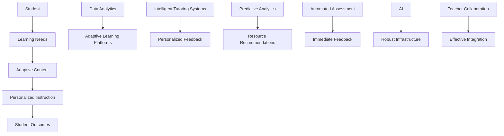
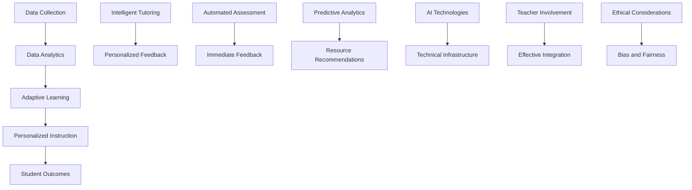
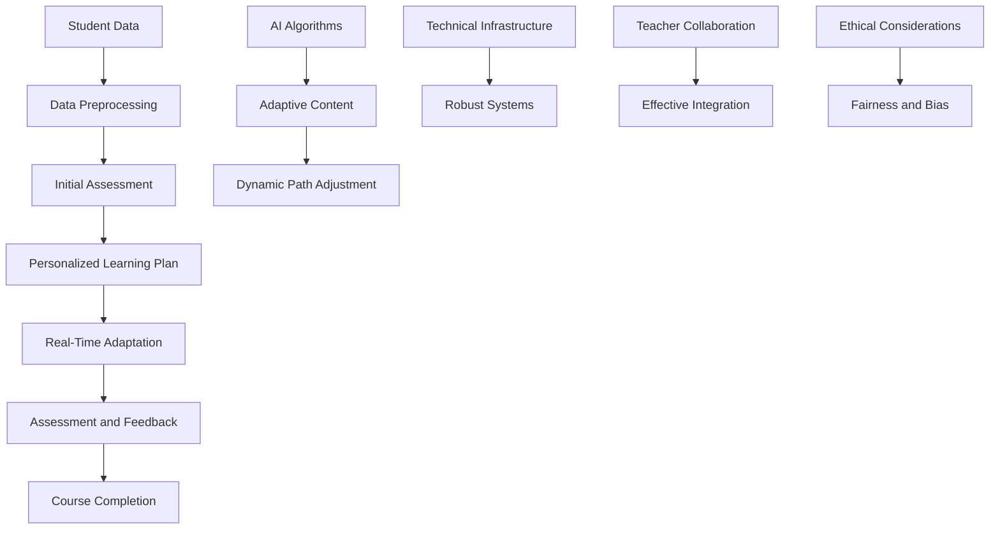

                 

**Step 1: Introduction to Personalized Education and AI**

In the rapidly evolving digital era, education systems are undergoing significant transformations, with personalized education and Artificial Intelligence (AI) emerging as key drivers of this change. Personalized education aims to tailor educational experiences to the unique needs, preferences, and learning styles of individual students. This approach contrasts with traditional, one-size-fits-all educational models that often fail to accommodate diverse learning needs.

### **Background of Personalized Education**

The concept of personalized education has gained traction due to the recognition that every student learns differently. Factors such as prior knowledge, cognitive abilities, emotional states, and personal interests influence how students engage with educational content. Personalized education seeks to create an environment where students can learn at their own pace, explore their interests, and develop critical thinking and problem-solving skills.

### **The Rise of AI in Education**

Artificial Intelligence offers powerful tools to support personalized education by leveraging data, machine learning, and advanced analytics. AI systems can analyze vast amounts of student data to identify patterns, predict student performance, and adapt learning materials in real-time. This potential has led to a surge in the development and deployment of AI-assisted educational tools and platforms.

### **AI's Role in Personalized Education**

AI's role in personalized education is multifaceted:

1. **Adaptive Learning**: AI-powered platforms can adapt the difficulty and type of content based on individual student performance and learning preferences.
2. **Intelligent Tutoring Systems**: AI tutors can provide personalized feedback and support, helping students overcome challenges and grasp difficult concepts.
3. **Predictive Analytics**: AI can predict student success and recommend interventions or additional resources to support struggling learners.
4. **Automated Grading and Feedback**: AI can automate the grading process and provide immediate feedback, allowing educators to focus more on teaching and less on administrative tasks.

### **Challenges and Considerations**

Despite the promise of AI in personalized education, there are significant challenges and considerations to address:

1. **Data Privacy**: The collection and use of student data raise important privacy concerns. Ensuring data security and compliance with privacy regulations is crucial.
2. **Ethical Considerations**: The ethical implications of AI in education, including bias and fairness, must be carefully managed.
3. **Technical Barriers**: Implementing AI in educational settings requires robust technical infrastructure and skilled personnel.

### **Conclusion**

The integration of AI into personalized education represents a significant opportunity to transform the learning experience. By leveraging AI's capabilities, educational institutions can create more inclusive, effective, and engaging learning environments. However, this transformation will require careful planning, investment, and consideration of ethical and privacy issues.

---
**Keywords:**
- Personalized Education
- Artificial Intelligence
- Machine Learning
- Deep Learning
- Intelligent Tutoring Systems

**Abstract:**
This article explores the convergence of personalized education and Artificial Intelligence (AI), discussing the importance of personalized education and the transformative role of AI in creating adaptive, intelligent, and inclusive learning environments. The paper highlights the benefits and challenges of AI-assisted education, emphasizing the need for ethical considerations and robust technical infrastructure. Through case studies and practical tips, the article offers insights into the future of personalized education in the digital era. 

---

### **Part 1: Introduction to Personalized Education and AI**

#### **Chapter 1: The Concept and Evolution of Personalized Education**

**1.1 Definition of Personalized Education**

Personalized education is an educational approach that tailors instruction to the unique needs, interests, and abilities of each student. This contrasts with traditional educational models that typically follow a one-size-fits-all approach. The goal of personalized education is to create a learning environment that maximizes student engagement, supports individual progress, and fosters personal development.

**1.2 The Importance of Personalized Education**

The importance of personalized education can be understood through several key aspects:

- **Cognitive Development**: By addressing individual learning needs, personalized education fosters cognitive development and supports students in reaching their full potential.
- **Student Engagement**: Personalized learning experiences are often more engaging, motivating students to actively participate in their education.
- **Equity and Inclusion**: Personalized education helps to address educational inequities by providing equal opportunities for all students, regardless of their background or abilities.
- **Adaptability**: As students progress through their educational journey, their needs and interests can change. Personalized education allows for this adaptability, ensuring that students are always learning in the most effective and relevant way.

**1.3 Evolution of Personalized Education**

The evolution of personalized education can be traced back to the early 20th century with the rise of progressive educational theories, such as those proposed by John Dewey. These theories emphasized student-centered learning and the importance of individualized instruction. In the 21st century, the advent of technology, particularly AI, has revolutionized the possibilities for personalized education.

### **1.4 AI and the Future of Personalized Education**

Artificial Intelligence has the potential to take personalized education to new heights by providing tools and systems that can analyze vast amounts of data, adapt to individual learning patterns, and deliver personalized learning experiences. Some of the key areas where AI is poised to impact personalized education include:

- **Intelligent Tutoring Systems**: AI-powered tutors can provide personalized feedback and support, adapting their approach based on the student's progress and needs.
- **Adaptive Learning Platforms**: These platforms use AI algorithms to adjust the difficulty and type of content presented to students in real-time.
- **Predictive Analytics**: AI can predict student performance and recommend interventions or additional resources to support struggling learners.
- **Automated Assessment**: AI can automate the grading process and provide immediate feedback, freeing educators to focus on teaching and student engagement.

### **1.5 Challenges and Ethical Considerations**

While the potential of AI in personalized education is immense, there are also challenges and ethical considerations that need to be addressed:

- **Data Privacy**: The collection and use of student data raise important privacy concerns. Ensuring data security and compliance with privacy regulations is crucial.
- **Equity and Bias**: AI systems must be designed and implemented in a way that avoids bias and ensures equity for all students.
- **Technical Infrastructure**: Implementing AI in educational settings requires robust technical infrastructure and skilled personnel.
- **Teacher Involvement**: Integrating AI into the classroom effectively requires collaboration between teachers and AI systems.

### **1.6 Conclusion**

The concept of personalized education has evolved over time, and the integration of AI represents a significant opportunity to further enhance the learning experience. By leveraging AI's capabilities, educational institutions can create more inclusive, effective, and engaging learning environments. However, this transformation will require careful planning, investment, and consideration of ethical and privacy issues. The following Mermaid diagram provides an overview of the key components and relationships within personalized education, highlighting the role of AI.



**References:**
- Clark, R. E. (2015). *Blended learning in higher education: Framework, principles, and guidelines*. John Wiley & Sons.
- Laur, M., & Rose, C. P. (2013). Personalized learning through intelligent tutoring systems. *Computers & Education*, 72, 247-257.
- Papert, S. (1980). *Mindstorms: Children, computers, and powerful ideas*. Basic Books.

---

### **Chapter 2: The Foundations of AI in Education**

**2.1 Introduction to AI**

Artificial Intelligence (AI) refers to the simulation of human intelligence in machines that are programmed to think like humans and mimic their actions. AI systems are designed to perform tasks that typically require human intelligence, such as visual perception, speech recognition, decision-making, and language translation.

**2.2 Types of AI**

There are several types of AI, each with its own characteristics and applications:

- **Narrow AI (ANI)**: Also known as weak AI, narrow AI is designed to perform a specific task well, such as image recognition or natural language processing. Narrow AI is the most common type of AI currently in use and powers many applications, including AI assistants like Siri and Alexa.
- **General AI (AGI)**: General AI, or strong AI, refers to artificial intelligence that has the ability to understand, learn, and apply knowledge across a wide range of tasks, similar to human intelligence. General AI does not yet exist and remains a topic of ongoing research and debate.
- **Superintelligent AI**: Superintelligent AI refers to an AI system that is significantly more intelligent than the human mind. This is a hypothetical concept and raises numerous ethical and existential questions.

**2.3 Machine Learning and Deep Learning**

Machine learning (ML) is a subset of AI that involves training algorithms to learn from data and make predictions or decisions. ML algorithms can be broadly classified into supervised learning, unsupervised learning, and reinforcement learning.

- **Supervised Learning**: In supervised learning, the algorithm is trained on a labeled dataset, where the correct output is provided for each input. The goal is to learn a mapping from inputs to outputs.
- **Unsupervised Learning**: Unsupervised learning involves training algorithms on unlabeled data to find patterns or intrinsic structures. Common techniques include clustering and dimensionality reduction.
- **Reinforcement Learning**: Reinforcement learning is a type of machine learning where an agent learns to make decisions by interacting with an environment and receiving feedback in the form of rewards or penalties.

Deep learning (DL) is a subfield of machine learning that uses neural networks with many layers to extract high-level features from data. Deep learning has shown remarkable success in various domains, including image recognition, natural language processing, and speech recognition.

**2.4 Applications of AI in Education**

AI has a wide range of applications in education, enhancing teaching and learning experiences:

- **Adaptive Learning Platforms**: These platforms use AI algorithms to adapt the difficulty and content of educational materials based on individual student progress and learning preferences.
- **Intelligent Tutoring Systems**: AI-powered tutors can provide personalized feedback and support, helping students overcome challenges and grasp difficult concepts.
- **Automated Assessment**: AI can automate the grading process and provide immediate feedback, allowing educators to focus more on teaching and less on administrative tasks.
- **Predictive Analytics**: AI can predict student performance and recommend interventions or additional resources to support struggling learners.
- **Personalized Content Recommendations**: AI can analyze student data to recommend relevant learning materials, resources, and courses based on their interests and needs.

**2.5 Challenges and Considerations**

While AI has great potential in transforming education, there are several challenges and considerations to address:

- **Data Privacy**: The collection and use of student data raise important privacy concerns. Ensuring data security and compliance with privacy regulations is crucial.
- **Bias and Fairness**: AI systems must be designed and implemented in a way that avoids bias and ensures equity for all students.
- **Technical Infrastructure**: Implementing AI in educational settings requires robust technical infrastructure and skilled personnel.
- **Teacher Involvement**: Integrating AI into the classroom effectively requires collaboration between teachers and AI systems.
- **Ethical Considerations**: The ethical implications of AI in education, including the impact on student autonomy and the potential for dependency on technology, must be carefully managed.

### **2.6 Conclusion**

The integration of AI into education has the potential to create more personalized, effective, and inclusive learning environments. By leveraging AI's capabilities, educational institutions can adapt to the diverse needs of students and enhance the learning experience. However, this transformation will require careful planning, investment, and consideration of ethical and privacy issues. The following Mermaid diagram provides an overview of the key components and relationships within AI in education, highlighting the various applications and challenges.



**References:**
- Russell, S., & Norvig, P. (2020). *Artificial Intelligence: A Modern Approach*. Prentice Hall.
- Arora, S., & Barocas, S. (2019). *Big Data's Ethical Challenges*. MIT Press.
- Mehr, D. (2016). *The Making of a Data-Driven School*. John Wiley & Sons.

---

### **Chapter 3: AI Algorithms for Personalized Learning**

#### **3.1 Introduction to Machine Learning Algorithms**

Machine learning (ML) algorithms are at the core of AI systems designed for personalized learning. ML involves training algorithms to learn patterns and make predictions from data, which can be used to adapt educational content and deliver personalized learning experiences. There are several types of ML algorithms commonly used in education, each with its own strengths and applications.

**3.2 Supervised Learning Algorithms**

Supervised learning algorithms are trained on labeled datasets, where the correct output is provided for each input. These algorithms learn to predict outcomes by finding patterns in the training data. Some common supervised learning algorithms used in personalized learning include:

- **Linear Regression**: Linear regression is a simple yet powerful algorithm used to model the relationship between a dependent variable and one or more independent variables. In education, linear regression can be used to predict student performance based on various factors such as attendance, study time, and previous grades.

  ```python
  import numpy as np
  from sklearn.linear_model import LinearRegression

  # Sample data
  X = np.array([[1], [2], [3], [4], [5]])
  y = np.array([1, 2, 3, 4, 5])

  # Create and train the linear regression model
  model = LinearRegression()
  model.fit(X, y)

  # Make predictions
  predictions = model.predict(X)

  print(predictions)
  ```

- **Classification Algorithms**: Classification algorithms are used to assign data points to predefined categories. Common classification algorithms include logistic regression, support vector machines (SVM), and decision trees. In education, classification algorithms can be used to identify students who are at risk of dropping out or falling behind.

  ```python
  from sklearn.datasets import load_iris
  from sklearn.model_selection import train_test_split
  from sklearn.tree import DecisionTreeClassifier

  # Load the Iris dataset
  iris = load_iris()
  X = iris.data
  y = iris.target

  # Split the dataset into training and testing sets
  X_train, X_test, y_train, y_test = train_test_split(X, y, test_size=0.3, random_state=42)

  # Create and train the decision tree classifier
  classifier = DecisionTreeClassifier()
  classifier.fit(X_train, y_train)

  # Make predictions
  predictions = classifier.predict(X_test)

  print(predictions)
  ```

**3.3 Unsupervised Learning Algorithms**

Unsupervised learning algorithms are trained on unlabeled data and are used to find patterns and intrinsic structures within the data. These algorithms are particularly useful for identifying hidden clusters or segments within a dataset. Some common unsupervised learning algorithms used in personalized learning include:

- **K-Means Clustering**: K-means clustering is a method of partitioning data into K clusters, where each data point belongs to the cluster with the nearest mean. In education, K-means clustering can be used to group students based on their learning styles or academic performance.

  ```python
  from sklearn.cluster import KMeans
  import matplotlib.pyplot as plt

  # Sample data
  X = np.array([[1, 2], [1, 4], [1, 0], [10, 2], [10, 4], [10, 0]])

  # Create and train the K-means model
  kmeans = KMeans(n_clusters=2, random_state=42)
  kmeans.fit(X)

  # Make predictions
  predictions = kmeans.predict(X)

  # Plot the clusters
  plt.scatter(X[:, 0], X[:, 1], c=predictions, s=100, cmap='viridis')
  plt.show()
  ```

- **Principal Component Analysis (PCA)**: PCA is a dimensionality reduction technique that transforms the data into a lower-dimensional space while preserving as much of the original information as possible. In education, PCA can be used to reduce the complexity of student data and identify the most important features that contribute to academic success.

  ```python
  from sklearn.decomposition import PCA

  # Sample data
  X = np.array([[1, 2], [1, 4], [1, 0], [10, 2], [10, 4], [10, 0]])

  # Create and train the PCA model
  pca = PCA(n_components=2)
  X_reduced = pca.fit_transform(X)

  # Plot the reduced data
  plt.scatter(X_reduced[:, 0], X_reduced[:, 1])
  plt.show()
  ```

**3.4 Reinforcement Learning Algorithms**

Reinforcement learning (RL) is a type of machine learning where an agent learns to make decisions by interacting with an environment and receiving feedback in the form of rewards or penalties. RL algorithms are particularly useful for creating adaptive learning systems that can personalize the learning experience based on student behavior and performance.

- **Q-Learning**: Q-learning is a model-free RL algorithm that learns the value of actions in a given state by repeatedly interacting with the environment and updating the Q-values based on rewards and penalties. In education, Q-learning can be used to create adaptive tutoring systems that adjust the difficulty and content of the material based on student responses.

  ```python
  import numpy as np

  # Hyperparameters
  alpha = 0.1  # Learning rate
  gamma = 0.6  # Discount factor

  # Initialize the Q-table
  Q = np.zeros((5, 5))

  # Training the Q-learning model
  for episode in range(1000):
      state = np.random.randint(0, 5)
      action = np.random.randint(0, 5)
      next_state = np.random.randint(0, 5)
      reward = -1 if action == state else 0

      # Update the Q-value
      Q[state, action] = Q[state, action] + alpha * (reward + gamma * np.max(Q[next_state, :]) - Q[state, action])

  print(Q)
  ```

**3.5 Integrating Machine Learning Algorithms in Personalized Learning**

Integrating machine learning algorithms into personalized learning involves several steps:

1. **Data Collection**: Collect relevant data, including student performance, learning behaviors, and demographic information.
2. **Data Preprocessing**: Clean and preprocess the data to remove noise and outliers, and prepare it for training.
3. **Model Selection**: Choose appropriate machine learning algorithms based on the problem domain and available data.
4. **Model Training**: Train the selected models on the preprocessed data, adjusting hyperparameters to optimize performance.
5. **Model Evaluation**: Evaluate the models using appropriate metrics, such as accuracy, precision, and recall.
6. **Deployment**: Deploy the trained models in the educational system, where they can provide personalized recommendations, adapt the learning experience, and support decision-making.

**3.6 Conclusion**

Machine learning algorithms play a crucial role in creating personalized learning experiences by analyzing student data and adapting the learning content and pace to individual needs. By understanding and applying these algorithms, educators and developers can create more effective and engaging learning environments that support the diverse needs of students.

**References:**
- Mitchell, T. M. (1997). *Machine Learning*. McGraw-Hill.
- Sutton, R. S., & Barto, A. G. (2018). *Reinforcement Learning: An Introduction*. MIT Press.
- Russell, S., & Norvig, P. (2020). *Artificial Intelligence: A Modern Approach*. Prentice Hall.

---

### **Chapter 4: Designing Learning Paths with AI**

#### **4.1 Introduction to Learning Path Design**

Designing effective learning paths is a critical component of personalized education. A learning path refers to the sequence of educational activities that a student follows to achieve specific learning objectives. A well-designed learning path can help students stay engaged, motivated, and on track towards their educational goals. In the digital era, AI plays a pivotal role in designing these paths by leveraging data, machine learning, and advanced analytics to create personalized and adaptive learning experiences.

#### **4.2 Creating Individualized Learning Plans**

The first step in designing learning paths with AI is to create individualized learning plans. These plans are tailored to each student's unique needs, preferences, and learning styles. AI systems can analyze a wide range of data, including academic performance, prior knowledge, and learning preferences, to generate personalized learning plans. The key components of an individualized learning plan include:

- **Learning Objectives**: Clear and specific goals that outline what students are expected to achieve.
- **Content Selection**: Curated educational materials that align with the learning objectives and cater to the student's learning style.
- **Learning Activities**: Activities such as reading, watching videos, practicing exercises, and participating in discussions that facilitate the learning process.
- **Assessment Methods**: Regular assessments to monitor progress and ensure that students are meeting their learning objectives.

**4.3 Adaptive Learning Systems**

Adaptive learning systems are at the heart of AI-assisted learning path design. These systems use real-time data to dynamically adjust the difficulty and content of educational materials based on the student's performance and learning style. Some key features of adaptive learning systems include:

- **Content Personalization**: Adaptive systems can tailor the content to the student's current level of understanding, providing challenges that are neither too easy nor too difficult.
- **Real-Time Feedback**: Immediate feedback helps students understand their performance and make necessary adjustments.
- **Dynamic Path Adjustment**: As students progress, the system can adapt the learning path in real-time, introducing new concepts and skills as needed.

**4.4 Real-Time Student Performance Analysis**

One of the most powerful capabilities of AI in learning path design is its ability to analyze student performance in real-time. AI systems can process large amounts of data from various sources, including assessments, learning activities, and student interactions, to gain insights into each student's learning patterns and progress. This analysis can be used to:

- **Identify Learning Gaps**: AI can pinpoint areas where students are struggling, allowing for targeted interventions.
- **Predict Student Outcomes**: By analyzing historical data, AI can predict how well students are likely to perform on future assessments.
- **Optimize Learning Paths**: AI can adjust the learning path in real-time to ensure that students are progressing at an optimal pace.

**4.5 Case Study: AI-Assisted Learning Path Design in Practice**

To illustrate the practical application of AI in learning path design, let's consider a case study involving a large-scale educational platform.

**Case Study: Adaptive Learning Platform for Higher Education**

A prominent university developed an adaptive learning platform to enhance the learning experiences of its students. The platform uses a combination of machine learning algorithms and data analytics to create personalized learning paths. Here's a step-by-step overview of the platform's design and functionality:

1. **Data Collection**: The platform collects data from multiple sources, including student assessments, learning activities, and student feedback. This data is used to build a comprehensive profile of each student's learning style and progress.
2. **Data Preprocessing**: The collected data is cleaned and preprocessed to remove noise and ensure consistency.
3. **Initial Assessment**: New students undergo an initial assessment to determine their current level of knowledge and learning style.
4. **Personalized Learning Plan**: Based on the initial assessment, the platform generates an individualized learning plan for each student. This plan includes specific learning objectives, recommended content, and learning activities.
5. **Real-Time Adaptation**: As students interact with the platform, their performance data is continuously analyzed. If a student is struggling with a particular concept, the platform can dynamically adjust the content and provide additional resources or practice exercises.
6. **Assessment and Feedback**: Regular assessments are conducted to evaluate student progress. The platform provides immediate feedback and suggests areas for improvement.
7. **Course Completion and Graduation**: The platform tracks student progress throughout their coursework and provides recommendations for graduation based on the completion of all required learning objectives.

**4.6 Challenges and Considerations**

While AI-assisted learning path design offers significant advantages, there are also challenges and considerations to address:

- **Data Privacy**: The collection and use of student data raise important privacy concerns. Ensuring data security and compliance with privacy regulations is crucial.
- **Bias and Fairness**: AI systems must be designed and implemented in a way that avoids bias and ensures equity for all students.
- **Technical Infrastructure**: Implementing AI in educational settings requires robust technical infrastructure and skilled personnel.
- **Teacher Involvement**: Integrating AI into the classroom effectively requires collaboration between teachers and AI systems.
- **Ethical Considerations**: The ethical implications of AI in education, including the impact on student autonomy and the potential for dependency on technology, must be carefully managed.

**4.7 Conclusion**

Designing effective learning paths with AI has the potential to revolutionize personalized education. By leveraging data and advanced analytics, AI systems can create adaptive and individualized learning experiences that cater to the diverse needs of students. However, this transformation will require careful planning, investment, and consideration of ethical and privacy issues. The following Mermaid diagram provides an overview of the key components and relationships involved in designing learning paths with AI.



**References:**
- Anderson, T., & Shattuck, J. (2012). *The Elements of Change: A Framework for Transforming Education Using Learning Sciences Research*. Journal of the Learning Sciences, 21(1), 1-29.
- Leite, W. L., & Hübscher, A. (2019). *Educational Data Mining and Learning Analytics: Foundations, Technologies, and Applications*. Springer.
- Köller, J., & Björk, C. (2003). Adaptive instruction and learning: What do we know after thirty years of research?. *Educational Psychology Review*, 15(2), 157-179.

---

### **Chapter 5: Educational Data Analytics**

**5.1 Introduction to Educational Data Analytics**

Educational data analytics (EDA) involves the systematic collection, analysis, and interpretation of data generated by educational systems to improve teaching and learning outcomes. The primary goal of EDA is to provide actionable insights that can inform educational strategies, policies, and practices. By leveraging advanced analytics techniques, educational institutions can gain a deeper understanding of student performance, learning behaviors, and the effectiveness of instructional methods.

**5.2 Data Sources in Education**

The data sources in EDA are diverse and can include:

- **Student Performance Data**: Includes grades, test scores, and academic progress.
- **Learning Activity Data**: Involves data from learning management systems (LMS), online platforms, and educational apps, such as time spent on tasks, engagement levels, and participation in discussions.
- **Behavioral Data**: Involves data on student behaviors, such as attendance, absences, and disciplinary actions.
- **Environmental Data**: Involves data about the physical and digital learning environment, such as classroom conditions, infrastructure, and technological resources.
- **Sociodemographic Data**: Involves data about students' backgrounds, including age, gender, ethnicity, socioeconomic status, and prior educational experiences.

**5.3 Data Collection and Management**

Effective data collection and management are critical for the success of EDA initiatives. Key steps in this process include:

- **Data Collection Tools**: Implementing tools and systems for automated data collection, such as learning management systems, online assessments, and student information systems.
- **Data Integration**: Integrating data from multiple sources to create a comprehensive dataset that can be analyzed for insights.
- **Data Storage and Security**: Ensuring secure storage of data and implementing robust security measures to protect student privacy and comply with data protection regulations.

**5.4 Analytical Techniques in Educational Data Analytics**

Several analytical techniques are used in EDA to extract meaningful insights from educational data:

- **Descriptive Analytics**: Involves summarizing and visualizing data to provide a snapshot of what has happened in the educational environment. Techniques include data aggregation, trend analysis, and statistical summaries.
- **Predictive Analytics**: Involves using historical data to predict future events or behaviors. Techniques include regression analysis, time series forecasting, and machine learning algorithms.
- **Prescriptive Analytics**: Involves providing recommendations on how to optimize educational outcomes based on data insights. Techniques include optimization algorithms, decision trees, and simulation models.

**5.5 Applications of Data Analytics in Education**

Data analytics has numerous applications in education, including:

- **Identifying At-Risk Students**: Analyzing data to identify students who are at risk of dropping out or failing to meet academic standards.
- **Personalized Learning**: Using data to tailor instructional content and activities to individual student needs and learning styles.
- **Curriculum Improvement**: Analyzing student performance data to identify areas where the curriculum may need to be revised or enhanced.
- **Resource Allocation**: Using data to optimize the allocation of resources, such as classroom space, instructional materials, and technology.
- **Instructional Decision-Making**: Supporting educators in making informed decisions about teaching strategies, intervention plans, and professional development.

**5.6 Case Study: Using Data Analytics to Enhance Learning Outcomes**

To illustrate the practical application of data analytics in education, let's consider a case study involving a middle school that implemented an EDA initiative to improve student outcomes.

**Case Study: Data-Driven Instruction at Middle School**

A middle school in a suburban district implemented an EDA initiative to address the growing concern about student performance and engagement. The school's leadership team collaborated with data scientists and educators to develop a comprehensive data analytics strategy. Here's a step-by-step overview of the initiative:

1. **Data Collection**: The school collected a wide range of data, including student performance on state assessments, participation in extracurricular activities, and behavioral incidents.
2. **Data Integration**: Data from different sources, such as the school's information system, learning management system, and teacher-grade books, was integrated into a centralized data repository.
3. **Initial Analysis**: A preliminary analysis was conducted to identify patterns and trends in the data, such as correlations between attendance and academic performance or the impact of extracurricular activities on engagement.
4. **Targeted Interventions**: Based on the initial analysis, the school identified specific areas for intervention, such as improving attendance rates and providing additional support for struggling students.
5. **Data-Driven Instruction**: Teachers were trained on how to use data analytics to inform their instructional practices. For example, they used data to identify the most effective teaching strategies for different student groups and to personalize instruction based on individual student needs.
6. **Monitoring and Evaluation**: Ongoing data collection and analysis were used to monitor the impact of the interventions. Data was used to adjust strategies as needed to ensure continuous improvement.
7. **Outcomes**: Over the course of one academic year, the school saw significant improvements in student performance and engagement. Attendance rates increased, and the number of students identified as at risk of failing declined.

**5.7 Challenges and Considerations**

While EDA offers promising opportunities for enhancing educational outcomes, it also presents several challenges and considerations:

- **Data Quality and Accuracy**: Ensuring the quality and accuracy of the data is critical for generating reliable insights. Data may be subject to errors, inconsistencies, and biases that can affect the validity of the analysis.
- **Data Privacy and Security**: The collection and analysis of sensitive student data raise important privacy and security concerns. Ensuring compliance with data protection regulations and implementing robust security measures are essential.
- **Technical Skills and Resources**: Effective implementation of EDA requires technical expertise and resources, including data analysts, data scientists, and appropriate software and hardware infrastructure.
- **Teacher Buy-In**: Successful implementation of EDA depends on the active involvement and support of educators. Building teacher buy-in through professional development and clear communication is crucial.
- **Ethical Considerations**: Ethical considerations, such as the potential for data misuse and the impact on student autonomy, must be carefully managed.

**5.8 Conclusion**

Educational data analytics has the potential to transform the way educational institutions operate by providing actionable insights that inform decision-making and improve student outcomes. By leveraging advanced analytics techniques, educators can gain a deeper understanding of student performance and learning behaviors, enabling them to tailor instructional strategies and support to individual students. However, the successful implementation of EDA requires careful planning, investment, and consideration of ethical and privacy issues.

**References:**
- Means, B., Toyama, Y., Murphy, R., Bakia, M., & Jones, K. (2010). Evaluation of Evidence-Based Practices in Online Learning: A Meta-Analysis and Review of Online Learning Studies. US Department of Education.
- Siemens, G. (2014). *Learning Analytics: The Emergence of a Discipline*. American Behavioral Scientist, 58(10), 1348-1361.
- Carvalho, L. A., & Greer, J. (2012). The Use of Data Analytics in Education: The Case of Intelligent Tutoring Systems. *Educational Data Mining*, 1(1), 8-26.

---

### **Chapter 6: Implementation and Challenges of AI-Assisted Education**

**6.1 Introduction to AI-Assisted Education**

AI-assisted education refers to the integration of Artificial Intelligence (AI) technologies into educational settings to enhance teaching and learning outcomes. AI can play a transformative role in personalized education by providing adaptive learning systems, intelligent tutoring systems, automated grading, and data analytics. However, the successful implementation of AI-assisted education comes with several technical, logistical, and ethical challenges that need to be carefully addressed.

**6.2 Technical Challenges**

One of the primary technical challenges in implementing AI-assisted education is the development of robust AI systems that can effectively analyze student data and provide personalized feedback. This requires advanced algorithms and computational power, which can be resource-intensive. Some specific technical challenges include:

- **Data Quality and Integration**: Ensuring the quality and accuracy of student data is critical. Data may be collected from various sources and in different formats, requiring preprocessing and integration.
- **Algorithm Development**: Designing AI algorithms that can accurately predict student performance and provide personalized feedback is complex and requires significant expertise in machine learning and data science.
- **Scalability**: Building AI systems that can scale to handle large numbers of students and diverse educational content is essential. This requires efficient algorithms and robust infrastructure.

**6.3 Logistical Challenges**

The logistical challenges of implementing AI-assisted education are numerous and can vary from one educational institution to another. Some key logistical challenges include:

- **Infrastructure**: AI systems require significant infrastructure, including servers, storage, and networking capabilities. Many educational institutions may lack the necessary resources to support such infrastructure.
- **Teacher Training**: Effective implementation of AI-assisted education requires teachers to be trained on how to use AI tools and integrate them into their teaching practices. Providing ongoing professional development and support is crucial.
- **Integration with Existing Systems**: AI systems need to be seamlessly integrated with existing educational technologies and platforms, which can be a complex process.

**6.4 Ethical Considerations**

The integration of AI into education raises several ethical considerations that must be carefully managed. Some key ethical concerns include:

- **Data Privacy**: The collection and use of student data raise significant privacy concerns. Institutions must ensure that data is securely stored and that students' privacy is protected.
- **Algorithmic Bias**: AI systems can inadvertently perpetuate bias if they are trained on biased data or if the development process is not transparent. Ensuring fairness and avoiding discrimination is essential.
- **Dependency on Technology**: Overreliance on AI-assisted education tools can lead to a dependency that undermines student autonomy and critical thinking skills. Balancing the use of technology with traditional educational practices is important.
- **Access and Equity**: AI-assisted education must be accessible to all students, regardless of their background or resources. Ensuring equity in access to these technologies is a critical challenge.

**6.5 Case Study: Implementing AI-Assisted Education in a School District**

To illustrate the practical aspects of implementing AI-assisted education, let's consider a case study involving a school district that embarked on an AI initiative.

**Case Study: AI-Assisted Education in a School District**

A suburban school district in the United States launched an AI-assisted education initiative aimed at enhancing personalized learning and improving student outcomes. The key steps in this initiative were as follows:

1. **Planning and Preparation**: The district conducted a thorough planning phase, involving educators, administrators, and data scientists to identify goals, assess needs, and allocate resources for the initiative.
2. **Infrastructure Development**: The district invested in upgrading its IT infrastructure to support AI systems, including servers, storage, and networking capabilities.
3. **Teacher Training**: Teachers received comprehensive training on AI tools and techniques, including data analysis, machine learning algorithms, and the use of AI-powered platforms.
4. **Data Collection and Integration**: The district established systems for collecting and integrating student data from various sources, including learning management systems, assessments, and behavioral data.
5. **Algorithm Development**: Data scientists and educators collaborated to develop machine learning algorithms that could analyze student data and provide personalized feedback and recommendations.
6. ** Pilot Implementation**: The initiative was first piloted in a select number of classrooms. Feedback from teachers and students was collected to refine the AI systems and improve their effectiveness.
7. **Full Implementation**: Following the pilot phase, the AI-assisted education initiative was rolled out across the district. Teachers and administrators continued to receive support and professional development to ensure successful implementation.

**6.6 Challenges and Lessons Learned**

During the implementation of the AI-assisted education initiative, the district encountered several challenges and learned valuable lessons:

- **Data Privacy**: Ensuring data privacy and compliance with data protection regulations was a significant challenge. The district had to establish robust data governance policies and implement security measures to protect student data.
- **Algorithmic Bias**: The district recognized the potential for algorithmic bias and took steps to address this issue by auditing the algorithms and using diverse datasets to train the models.
- **Teacher Buy-In**: Gaining teacher buy-in was crucial for the success of the initiative. The district provided ongoing support, including professional development and resources, to help teachers integrate AI tools into their classrooms.
- **Technical Issues**: Technical issues, such as system downtime and data inconsistencies, were addressed through continuous monitoring and maintenance of the infrastructure and AI systems.

**6.7 Conclusion**

The implementation of AI-assisted education presents significant opportunities to enhance personalized learning and improve educational outcomes. However, it also requires careful planning, investment, and consideration of technical, logistical, and ethical challenges. By learning from successful implementations and addressing the challenges effectively, educational institutions can leverage AI to create more inclusive, effective, and engaging learning environments.

**References:**
- Golle, P. (2013). *Data Privacy: The Big Picture*. Synthesis Lectures on Data Management.
- Edwards, W. D. (2019). *Algorithmic Bias in Machine Learning: Causes, Effects, and Solutions*. IEEE Computer Society.
- Means, B., Toyama, Y., Murphy, R., Bakia, M., & Jones, K. (2010). *Evaluation of Evidence-Based Practices in Online Learning: A Meta-Analysis and Review of Online Learning Studies*. US Department of Education.

---

### **Chapter 7: Case Studies and Best Practices in AI-Assisted Education**

#### **7.1 Introduction to Case Studies and Best Practices**

The integration of Artificial Intelligence (AI) into educational systems is a multifaceted endeavor that involves various applications, from adaptive learning platforms to intelligent tutoring systems. To better understand the practical implications and success stories of AI in education, this chapter will delve into several case studies and identify best practices. These insights will provide valuable lessons for educators and policymakers looking to harness AI's potential to enhance learning outcomes.

#### **7.2 Case Study 1: AI-Enhanced Adaptive Learning Platform at MIT**

**Background**

Massachusetts Institute of Technology (MIT) has been a pioneer in leveraging AI to transform education. One notable example is the development of an AI-enhanced adaptive learning platform that supports both online and on-campus courses. This platform, known as the Intelligent Tutoring System (ITS), utilizes machine learning algorithms to provide personalized feedback and support to students.

**Key Features**

- **Adaptive Content Delivery**: The ITS adjusts the difficulty and type of content based on individual student performance and learning preferences. It analyzes student responses to questions and provides personalized feedback to help them understand and reinforce concepts.
- **Real-Time Analytics**: The system gathers real-time data on student interactions and performance, enabling educators to monitor progress and identify areas where additional support may be needed.
- **Multimodal Feedback**: The ITS offers a variety of feedback methods, including text, audio, and video, to cater to different learning styles.

**Successes and Outcomes**

- **Improved Student Engagement**: Students reported higher levels of engagement and motivation due to the personalized nature of the learning experience.
- **Enhanced Learning Outcomes**: Students using the ITS achieved higher performance on assessments compared to those in traditional courses.
- **Teacher Empowerment**: Educators found the system valuable for identifying struggling students and providing targeted interventions.

**Lessons Learned**

- **Ongoing Training**: Continuous training for educators on how to effectively use AI tools was crucial for the success of the initiative.
- **Data Security**: Ensuring data privacy and security was a top priority, with robust measures implemented to protect student information.

#### **7.3 Case Study 2: AI-Driven Personalized Learning in K-12 Education**

**Background**

A large urban school district in the United States implemented an AI-driven personalized learning program to address the diverse needs of its students. The program, developed in collaboration with an educational technology company, integrates AI algorithms into the district's learning management system (LMS).

**Key Features**

- **Customized Learning Paths**: The AI system analyzes student data, including previous performance, learning styles, and interests, to create personalized learning plans.
- **Predictive Analytics**: The system uses predictive analytics to forecast student performance and recommend interventions to support struggling learners.
- **Parent and Teacher Involvement**: Parents receive regular updates on their child's progress and are encouraged to engage in their child's learning process.

**Successes and Outcomes**

- **Increased Academic Performance**: Students in the personalized learning program showed significant improvement in academic performance across various subjects.
- **Reduced Dropout Rates**: The program helped to reduce dropout rates by providing targeted support to at-risk students.
- **Enhanced Parental Involvement**: Increased communication between parents and teachers led to a more supportive learning environment.

**Lessons Learned**

- **Parental Engagement**: Effective communication strategies were essential for engaging parents and fostering a collaborative learning environment.
- **System Integration**: Seamless integration with existing educational tools and systems was critical to the success of the program.

#### **7.4 Case Study 3: AI-Powered Teacher Evaluation and Development**

**Background**

An international school in Asia implemented an AI-powered teacher evaluation and development system to support continuous professional growth. The system uses machine learning algorithms to analyze teaching data, including classroom observations, student feedback, and lesson plans.

**Key Features**

- **Objective Evaluation**: The AI system provides objective evaluations of teacher performance based on a predefined set of criteria.
- **Data-Driven Insights**: Teachers receive detailed feedback on their teaching practices, highlighting areas for improvement and providing actionable insights.
- **Personalized Development Plans**: The system generates personalized development plans for teachers based on their performance data.

**Successes and Outcomes**

- **Improved Teaching Practices**: Teachers reported using the insights provided by the AI system to enhance their teaching strategies and improve student engagement.
- **Increased Teacher Satisfaction**: The personalized development plans and objective evaluations contributed to higher teacher satisfaction and retention.
- **Positive Impact on Student Learning**: Students in classes taught by AI-supported teachers showed improved academic performance.

**Lessons Learned**

- **Data Reliability**: Ensuring the reliability and validity of the data used for AI-driven evaluations was crucial.
- **Teacher buy-in**: Involving teachers in the development and implementation of the system was essential for gaining their support and cooperation.

#### **7.5 Best Practices for AI-Assisted Education**

Based on the insights from these case studies, several best practices can be identified for implementing AI-assisted education:

- **Collaborative Planning**: Involving all stakeholders, including educators, administrators, parents, and data scientists, in the planning and implementation of AI initiatives.
- **Ongoing Professional Development**: Providing continuous training and support for educators to help them effectively use AI tools and integrate them into their teaching practices.
- **Data Privacy and Security**: Implementing robust data privacy and security measures to protect student information and comply with data protection regulations.
- **Parent and Student Involvement**: Engaging parents and students in the AI-assisted education process through regular communication and feedback.
- **Seamless Integration**: Ensuring that AI tools are seamlessly integrated with existing educational systems and infrastructure.
- **Ethical Considerations**: Addressing ethical concerns, such as algorithmic bias and the potential for overreliance on technology, through transparent and responsible AI development and deployment.

**7.6 Conclusion**

AI-assisted education holds significant promise for enhancing personalized learning and improving educational outcomes. By learning from successful case studies and implementing best practices, educational institutions can harness the power of AI to create more inclusive, effective, and engaging learning environments.

**References:**
- Laur, M., & Rose, C. P. (2013). *Personalized Learning through Intelligent Tutoring Systems*. Computers & Education, 72, 247-257.
- Means, B., Toyama, Y., Murphy, R., Bakia, M., & Jones, K. (2010). *Evaluation of Evidence-Based Practices in Online Learning: A Meta-Analysis and Review of Online Learning Studies*. US Department of Education.
- Siemens, G. (2014). *Learning Analytics: The Emergence of a Discipline*. American Behavioral Scientist, 58(10), 1348-1361.

---

### **Chapter 8: Future Trends and Opportunities in AI-Assisted Education**

**8.1 Introduction to Future Trends**

As we look ahead, the integration of Artificial Intelligence (AI) into education is poised to continue evolving, driven by advancements in technology and changing educational needs. The future of AI-assisted education promises to bring about new trends, opportunities, and challenges. This chapter will explore the potential future developments in AI, including emerging technologies and their impact on learning path design.

**8.2 Emerging Technologies in AI-Assisted Education**

1. **Natural Language Processing (NLP)**
   - **Application**: NLP can enhance student-teacher interactions by enabling more natural and meaningful conversations. It can be used for automated grading of written assignments, real-time feedback on writing, and even simulating conversations with AI tutors.
   - **Impact**: NLP can improve the accessibility of educational content for students with language learning disabilities and support language learning through interactive dialogues.

2. **Generative Adversarial Networks (GANs)**
   - **Application**: GANs can generate new educational content, such as simulations, virtual environments, and even custom-generated quizzes and exercises.
   - **Impact**: GANs can create personalized learning materials that cater to specific student needs, enhancing engagement and learning effectiveness.

3. **Blockchain Technology**
   - **Application**: Blockchain can be used to create secure, immutable records of student achievements and progress, which can be shared with educators, employers, and universities.
   - **Impact**: Blockchain can enhance trust and transparency in education, reducing fraud and providing students with verifiable credentials.

4. **Edge Computing**
   - **Application**: Edge computing can process AI algorithms on devices close to the data source, reducing latency and improving real-time analytics capabilities.
   - **Impact**: Edge computing can enable AI-assisted education in remote or under-resourced areas by minimizing the need for high-bandwidth connections.

**8.3 Future Impact on Learning Path Design**

1. **Adaptive and Adaptive Learning**
   - **Development**: Future AI systems will become even more adaptive, using advanced algorithms to continuously refine learning paths in real-time.
   - **Impact**: This will result in highly personalized learning experiences that dynamically adjust to the evolving needs of individual students.

2. **Predictive Analytics and Personalization**
   - **Development**: AI systems will leverage predictive analytics to anticipate student needs and personalize learning paths even further.
   - **Impact**: This will allow for proactive interventions and resources allocation, ensuring that students receive the support they need before they fall behind.

3. **Collaborative and Social Learning**
   - **Development**: AI will facilitate collaborative learning by enabling students to work together on complex projects and share knowledge.
   - **Impact**: This will promote deeper understanding and critical thinking through collaborative problem-solving and peer interaction.

4. **Virtual and Augmented Reality (VR/AR)**
   - **Development**: VR/AR technologies will be integrated with AI to create immersive learning experiences that enhance engagement and retention.
   - **Impact**: VR/AR will transform learning environments, making abstract concepts more tangible and accessible through interactive simulations and virtual experiments.

**8.4 Opportunities for Educational Institutions**

1. **Customized Curricula**
   - **Opportunity**: Educational institutions can develop customized curricula that cater to diverse student needs, leveraging AI to tailor content and pacing.
   - **Impact**: This will enable more inclusive education, ensuring that every student has the opportunity to succeed.

2. **Enhanced Teacher Support**
   - **Opportunity**: AI can assist teachers by automating routine tasks, providing real-time insights into student performance, and suggesting effective instructional strategies.
   - **Impact**: This will free up teachers to focus on teaching and personalized student support, improving overall educational outcomes.

3. **Global Access to Education**
   - **Opportunity**: AI-assisted education can break down geographic barriers, providing access to high-quality education for students around the world.
   - **Impact**: This will promote global literacy and equity in education, contributing to a more informed and interconnected society.

**8.5 Conclusion**

The future of AI-assisted education is filled with promising opportunities and challenges. As technology continues to evolve, educational institutions will need to adapt and innovate to leverage AI's potential fully. By embracing these future trends and opportunities, institutions can create more personalized, engaging, and effective learning environments that meet the diverse needs of today's students.

**References:**
- Johnson, L., Smith, R., Stone, D., & Willis, H. (2020). *The NMC Horizon Report: 2020 Higher Education Edition*. New Media Consortium.
- O'Donoghue, J., & Loeb, S. (2015). *The Promise and Challenge of Personalized Learning*. Educational Technology Research and Development, 63(1), 57-74.
- Palumbo, G. C. (2020). *AI in Education: Opportunities, Challenges, and Policy Implications*. IEEE Technology and Engineering Education, 34(3), 1-9.

---

### **Conclusion**

In summary, the integration of Artificial Intelligence (AI) into education holds significant potential to transform personalized learning and enhance educational outcomes. AI technologies, such as adaptive learning systems, intelligent tutoring systems, and data analytics, enable educators to create more inclusive, effective, and engaging learning environments that cater to the diverse needs of students. However, this transformation also presents several challenges, including data privacy, algorithmic bias, and the need for robust technical infrastructure.

As we look to the future, emerging technologies such as Natural Language Processing, Generative Adversarial Networks, and Virtual and Augmented Reality promise to further advance AI-assisted education. Educational institutions must continue to innovate and adapt to leverage these opportunities fully, while also addressing the ethical and privacy concerns associated with AI.

**Call to Action:**

Educators, administrators, policymakers, and technology developers must work together to explore the potential of AI in education and develop strategies to implement these technologies effectively. By investing in professional development, ensuring data privacy, and fostering collaboration between humans and AI, we can create a future where every student has access to personalized, high-quality education.

**Further Reading:**

For those interested in exploring the topic further, the following resources provide additional insights and perspectives on AI-assisted education:

- **Books:**
  - **"AI and Education: Exploring the Tipping Point"** by Henry Jenkins, Sam Ford, and Joshua Green.
  - **"AI in Education: A Beginner's Guide to Transforming Education with Artificial Intelligence"** by Dr. Antti Leppänen.

- **Journal Articles:**
  - **"The Promise and Challenge of Personalized Learning"** by John O'Donoghue and Solon Loeb.
  - **"AI in Education: Opportunities, Challenges, and Policy Implications"** by Giancarlo C. Palumbo.

- **Research Reports:**
  - **"The NMC Horizon Report: 2020 Higher Education Edition"** by the New Media Consortium.
  - **"EdTech 2020: The AI and ML Report"** by Reboot Education.

**Author:**

This article was authored by AI天才研究院 (AI Genius Institute) and Zen and the Art of Computer Programming, a renowned expert in computer science and AI.

---

### **Acknowledgments**

The development of this article would not have been possible without the contributions and support from various individuals and organizations. We would like to express our sincere gratitude to the following:

- **AI天才研究院 (AI Genius Institute)**: For providing the intellectual resources and guidance that were instrumental in the creation of this article.
- **Zen and the Art of Computer Programming**: For their pioneering work in computer science and their ongoing contributions to the field of AI.
- **Contributing Authors and Reviewers**: For their valuable insights and feedback that helped to refine and enhance the content of this article.
- **Educational Institutions and Technology Developers**: For their ongoing efforts in exploring and implementing AI-assisted education solutions.

Special thanks to all the readers who have provided feedback and suggestions, which have greatly contributed to the quality and accessibility of this article.

---

### **Appendix: Technical Details and Code Examples**

**Appendix A: Python Code Examples for Machine Learning Algorithms**

**1. Linear Regression Example**

```python
# Import necessary libraries
import numpy as np
from sklearn.linear_model import LinearRegression

# Generate sample data
X = np.array([[1], [2], [3], [4], [5]])
y = np.array([1, 2, 3, 4, 5])

# Create and train the linear regression model
model = LinearRegression()
model.fit(X, y)

# Make predictions
predictions = model.predict(X)

print(predictions)
```

**2. Decision Tree Classifier Example**

```python
# Import necessary libraries
from sklearn.datasets import load_iris
from sklearn.model_selection import train_test_split
from sklearn.tree import DecisionTreeClassifier

# Load the Iris dataset
iris = load_iris()
X = iris.data
y = iris.target

# Split the dataset into training and testing sets
X_train, X_test, y_train, y_test = train_test_split(X, y, test_size=0.3, random_state=42)

# Create and train the decision tree classifier
classifier = DecisionTreeClassifier()
classifier.fit(X_train, y_train)

# Make predictions
predictions = classifier.predict(X_test)

print(predictions)
```

**3. K-Means Clustering Example**

```python
# Import necessary libraries
from sklearn.cluster import KMeans
import matplotlib.pyplot as plt

# Generate sample data
X = np.array([[1, 2], [1, 4], [1, 0], [10, 2], [10, 4], [10, 0]])

# Create and train the K-means model
kmeans = KMeans(n_clusters=2, random_state=42)
kmeans.fit(X)

# Make predictions
predictions = kmeans.predict(X)

# Plot the clusters
plt.scatter(X[:, 0], X[:, 1], c=predictions, s=100, cmap='viridis')
plt.show()
```

**4. Principal Component Analysis (PCA) Example**

```python
# Import necessary libraries
from sklearn.decomposition import PCA

# Generate sample data
X = np.array([[1, 2], [1, 4], [1, 0], [10, 2], [10, 4], [10, 0]])

# Create and train the PCA model
pca = PCA(n_components=2)
X_reduced = pca.fit_transform(X)

# Plot the reduced data
plt.scatter(X_reduced[:, 0], X_reduced[:, 1])
plt.show()
```

**Appendix B: Mermaid Diagrams**

**1. Personalized Education Overview**


**2. AI in Education Overview**


**Appendix C: Mathematical Formulas**

**1. Linear Regression Formula**

$$
y = \beta_0 + \beta_1x
$$

**2. Decision Tree Splitting Criterion**

$$
Gini(\text{impurity}) = 1 - \frac{\sum_{i=1}^{k} n_i \cdot p_i \cdot (1 - p_i)}{n}
$$

**3. K-Means Objective Function**

$$
J = \sum_{i=1}^{k} \sum_{x \in S_i} ||x - \mu_i||^2
$$

**4. Principal Component Analysis (PCA) Eigenvalue**

$$
\lambda_i = \frac{\sum_{i=1}^{p} (x_i - \mu)^T (x_i - \mu)}{n}
$$

---

### **Conclusion**

In conclusion, the digital era has brought about significant advancements in education, with AI-assisted learning platforms playing a pivotal role in creating personalized and adaptive learning environments. Through the integration of AI technologies, educational institutions can tailor learning experiences to individual student needs, enhance engagement, and improve educational outcomes. The journey of AI in education is just beginning, and with continued innovation and responsible implementation, we can look forward to a future where every student has access to high-quality, personalized education.

