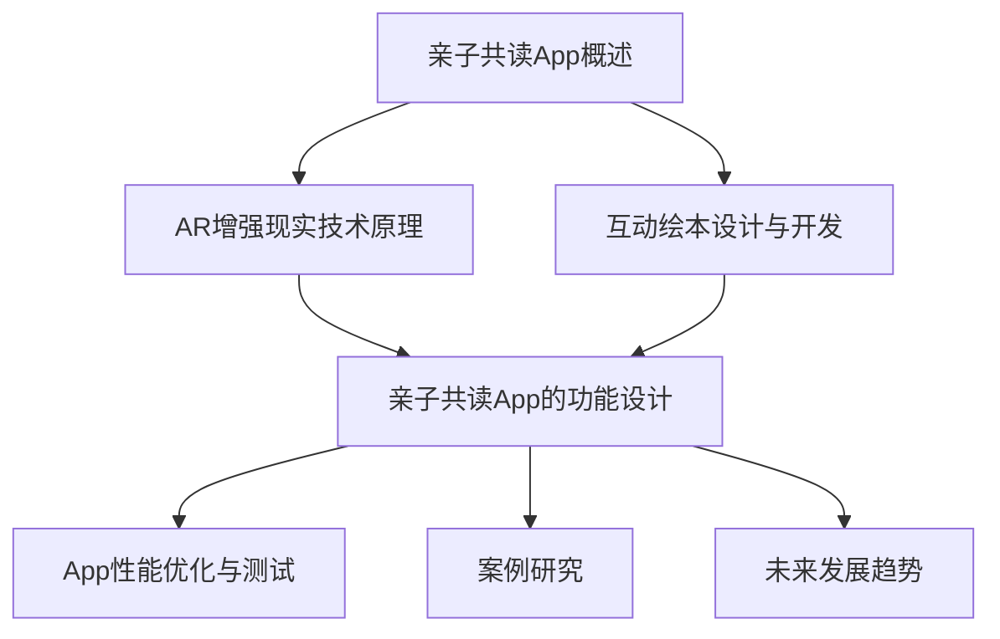

                 

### 引言

#### 数字时代背景介绍

随着数字技术的飞速发展，我们的生活方式正在发生深刻变革。智能设备、移动互联网和大数据等技术的普及，使得信息获取和处理变得更加便捷。与此同时，亲子共读作为家庭教育中的重要环节，也越来越受到重视。数字时代为亲子共读提供了新的可能，促使传统纸质绘本向数字化、互动化的方向转型。在这种背景下，亲子共读App应运而生，成为家庭教育和数字娱乐的新宠。

#### 亲子共读的重要性

亲子共读不仅有助于培养孩子的阅读习惯，提高语言表达能力，还能增进亲子之间的情感联系。在数字时代，亲子共读App利用AR增强现实技术，为传统的纸质绘本注入了新的活力，使得绘本阅读变得更加生动有趣。通过AR技术，孩子们可以与绘本中的角色互动，亲身体验故事情节，从而激发他们的想象力和创造力。

本文将围绕亲子共读App的设计与实现展开，详细探讨AR增强现实技术在互动绘本中的应用。文章分为以下几个部分：

1. **亲子共读App概述**：介绍亲子共读App的定义、目的以及AR增强现实技术的基础知识。
2. **AR增强现实技术原理**：阐述AR技术的基本原理、框架和关键组件。
3. **互动绘本设计与开发**：讨论互动绘本的设计原则、开发工具和流程。
4. **亲子共读App的功能设计**：分析功能需求、用户界面设计和功能模块划分。
5. **AR增强现实技术实现**：介绍AR核心算法应用、虚拟物体与场景创建以及实时交互与反馈。
6. **App性能优化与测试**：探讨性能优化策略、测试方法与工具以及性能调优实践。
7. **案例研究**：分享成功案例，进行案例分析与启示。
8. **未来发展趋势**：展望亲子共读App和AR增强现实技术在教育领域的应用前景。

通过本文的详细分析，我们希望能够为从事亲子共读App开发的技术人员提供有价值的参考，同时为家长们选择合适的亲子共读App提供指导。

#### 关键词

- 亲子共读
- AR增强现实技术
- 互动绘本
- 数字时代
- 功能设计
- 性能优化
- 教育应用

#### 摘要

本文旨在探讨数字时代下亲子共读App的设计与实现，尤其是AR增强现实技术在互动绘本中的应用。文章首先介绍了数字时代背景和亲子共读的重要性，随后详细阐述了亲子共读App的定义、AR增强现实技术原理以及互动绘本的设计与开发。通过分析亲子共读App的功能需求、用户界面设计和模块划分，本文进一步介绍了AR增强现实技术的核心算法实现以及App性能优化与测试方法。最后，通过成功案例研究和未来发展趋势分析，本文为亲子共读App开发提供了有价值的参考和启示。

### 第1章：亲子共读App概述

#### 1.1 亲子共读App的定义与目的

亲子共读App是指通过智能手机、平板电脑等智能设备，结合增强现实（AR）技术，为家长和孩子提供的一种新型的阅读体验平台。这种App的主要目的是通过互动和参与性，增强亲子之间的沟通和联系，同时提高孩子的阅读兴趣和能力。

亲子共读App的定义涵盖了几个关键点：

1. **互动性**：与传统纸质绘本不同，亲子共读App利用AR技术，使得孩子们可以通过智能设备与绘本中的角色进行互动，如触摸、拖拽等操作，从而提高阅读的趣味性和参与感。
2. **数字化**：通过数字化手段，App可以将绘本内容进行多媒体化处理，包括音频、视频、动画等元素，使得故事情节更加生动有趣。
3. **智能化**：利用人工智能技术，App可以记录用户的阅读行为，分析阅读数据，为用户提供个性化的推荐内容，从而提高阅读效果。

亲子共读App的目的主要有以下几点：

1. **促进亲子关系**：通过共同阅读和互动，增强家长和孩子之间的情感联系，促进亲子沟通。
2. **培养阅读习惯**：通过有趣的阅读体验，激发孩子的阅读兴趣，帮助他们养成良好的阅读习惯。
3. **提升阅读能力**：通过互动性、多媒体化和智能化的手段，提高孩子的阅读理解能力和语言表达能力。
4. **寓教于乐**：将教育内容融入有趣的互动体验中，让孩子们在轻松愉快的氛围中学习知识。

#### 1.2 AR增强现实技术基础

增强现实（AR）技术是一种将虚拟信息与真实世界相结合的技术，通过在现实场景中叠加虚拟元素，为用户带来一种虚实融合的体验。AR技术的基础包括以下几个关键组成部分：

1. **摄像头**：AR设备通常配备有摄像头，用于捕捉现实世界的图像。
2. **显示设备**：如智能手机、平板电脑等，用于将虚拟信息叠加到现实场景中。
3. **处理单元**：用于处理摄像头捕捉到的图像，识别现实场景中的物体，并在其上叠加虚拟信息。
4. **算法**：包括图像识别、目标跟踪、图像渲染等，用于实现AR的核心功能。

AR技术的工作原理可以概括为以下几个步骤：

1. **图像识别**：通过算法识别摄像头捕捉到的图像中的物体。
2. **目标跟踪**：根据识别结果，实时跟踪物体的位置和姿态。
3. **图像渲染**：在识别的物体上叠加虚拟信息，如动画、文字等。
4. **显示输出**：将渲染后的图像显示在用户的视野中。

#### 1.3 互动绘本的概念与特点

互动绘本是一种结合了AR增强现实技术的数字绘本，它通过智能设备的摄像头和显示设备，将虚拟元素叠加到真实的绘本页面上，使得绘本内容更加生动有趣。

互动绘本的主要特点包括：

1. **互动性**：通过触摸、拖动等操作，孩子们可以与绘本中的角色进行互动，提高阅读的趣味性和参与感。
2. **多媒体化**：除了文字和图片，互动绘本还可以包含音频、视频、动画等多媒体元素，使得故事情节更加丰富生动。
3. **个性化**：通过记录用户的阅读行为，互动绘本可以提供个性化的阅读内容和推荐，提高阅读效果。
4. **教育性**：互动绘本不仅具有娱乐性，还可以通过互动内容和多媒体元素，增强孩子的学习效果，如语言表达、认知能力等。

通过亲子共读App，家长和孩子可以共同体验互动绘本的乐趣，促进亲子关系，培养阅读习惯，提升阅读能力。AR增强现实技术为互动绘本提供了强大的技术支持，使得传统的纸质绘本焕发出新的活力。

### 第2章：AR增强现实技术原理

#### 2.1 AR技术的基本原理

增强现实（AR）技术是一种将虚拟信息叠加到现实世界中的技术，通过在用户的视野中创建一个虚实融合的场景，为用户提供更加丰富和互动的体验。要理解AR技术的基本原理，需要从以下几个方面进行探讨：

1. **图像识别**：图像识别是AR技术的核心组成部分，通过算法对摄像头捕捉到的图像进行分析和处理，识别出图像中的物体或场景。常见的图像识别算法包括边缘检测、特征提取、机器学习和深度学习等。图像识别的准确性直接影响到AR技术的用户体验。

2. **目标跟踪**：在识别出图像中的物体后，AR技术需要实时跟踪这些物体的位置和姿态。目标跟踪算法通常基于图像识别的结果，通过计算图像中物体的运动轨迹和姿态变化，实现对物体的精确跟踪。常用的目标跟踪算法包括光流法、基于几何的跟踪和基于学习的跟踪等。

3. **图像渲染**：图像渲染是将虚拟信息叠加到现实世界中的关键步骤。在图像渲染过程中，AR技术根据目标跟踪的结果，将虚拟元素（如动画、文字、图像等）渲染到现实场景中。常见的图像渲染技术包括纹理映射、光学混合和深度融合等。图像渲染的视觉效果直接影响用户体验的逼真度。

4. **显示输出**：将渲染后的图像显示在用户的视野中是AR技术的最终目标。通过智能手机、平板电脑等显示设备，AR技术将虚实融合的图像输出给用户，使用户能够直观地感受到虚拟信息与现实世界的互动。

#### 2.2 AR技术框架与流程

AR技术的实现涉及多个环节，可以概括为以下几个主要步骤：

1. **数据采集**：通过摄像头等传感器设备，采集现实世界的图像和声音数据。数据采集的质量直接影响后续处理的效果，因此需要确保摄像头的高分辨率和快速响应。

2. **图像处理**：对采集到的图像数据进行预处理，包括去噪、增强、裁剪等操作，以提高图像识别和目标跟踪的准确性。常见的图像处理技术包括滤波、边缘检测和形态学操作等。

3. **图像识别**：利用图像识别算法，对预处理后的图像进行分析，识别出图像中的物体或场景。图像识别的准确性直接影响到AR技术的用户体验。

4. **目标跟踪**：在图像识别的基础上，利用目标跟踪算法，实时跟踪识别出的物体或场景的位置和姿态。目标跟踪的精确度是保证AR技术稳定运行的关键。

5. **图像渲染**：根据目标跟踪的结果，将虚拟信息（如动画、文字、图像等）渲染到现实场景中。图像渲染的质量直接影响用户体验的逼真度。

6. **显示输出**：将渲染后的图像通过显示设备输出给用户，实现虚实融合的体验。显示输出的流畅度和清晰度是用户体验的关键因素。

#### 2.3 AR技术关键组件

实现AR技术需要多个关键组件的协同工作，以下是一些常见的AR技术关键组件：

1. **摄像头**：摄像头是AR技术的核心感知设备，用于捕捉现实世界的图像。摄像头需要具备高分辨率、快速响应和低延迟的特点，以保证图像识别和目标跟踪的准确性。

2. **传感器**：除了摄像头，AR技术还需要其他传感器（如陀螺仪、加速度计、磁力计等）来获取设备的位置、方向和加速度等信息。这些传感器数据用于辅助图像识别和目标跟踪，提高AR技术的稳定性。

3. **处理单元**：处理单元是AR技术的核心计算设备，负责处理摄像头和传感器采集的数据，执行图像识别、目标跟踪和图像渲染等算法。处理单元的性能直接影响AR技术的运行速度和效果。

4. **显示设备**：显示设备用于将渲染后的图像输出给用户。常用的显示设备包括智能手机、平板电脑和头戴式显示器等。显示设备的分辨率、刷新率和色彩准确度是影响用户体验的重要因素。

5. **算法**：AR技术的实现离不开各种算法的支持，包括图像识别、目标跟踪、图像渲染等。算法的复杂度和准确性直接影响AR技术的性能和用户体验。

通过以上对AR技术基本原理、框架和关键组件的探讨，我们可以看到，AR技术是一种高度集成和复杂的系统。理解这些原理和组件对于设计和开发成功的AR应用至关重要。在接下来的章节中，我们将进一步讨论如何设计和开发互动绘本，以及如何将AR技术应用于亲子共读App。

### 第3章：互动绘本设计与开发

#### 3.1 互动绘本设计原则

互动绘本的设计原则是确保内容有趣、教育性强、用户体验好的关键。以下是几个主要设计原则：

1. **故事性与教育性相结合**：互动绘本不仅要讲述有趣的故事，还要融入教育元素，如知识问答、角色扮演等，以提升孩子的认知能力和语言表达能力。

2. **互动性**：互动性是互动绘本的核心特点，设计时要考虑如何通过触摸、拖动等操作让孩子与绘本内容进行互动。同时，互动设计要符合孩子的认知水平，避免过于复杂。

3. **多媒体化**：利用音频、视频、动画等多媒体元素，丰富绘本内容，提升故事情节的生动性和趣味性。多媒体元素的合理运用可以增强孩子的沉浸感。

4. **个性化**：根据孩子的阅读行为和兴趣，提供个性化的阅读内容和推荐，提高孩子的阅读兴趣和参与度。

5. **简洁性**：界面设计要简洁明了，操作流程要直观易懂，避免过多冗余信息干扰孩子的阅读体验。

#### 3.2 互动绘本开发工具

互动绘本的开发工具是实现设计理念和技术实现的关键。以下是一些常用的开发工具：

1. **Unity3D**：Unity3D是一个强大的游戏开发引擎，支持AR应用的开发。它提供了丰富的3D图形和动画功能，适合开发复杂的互动绘本。

2. **ARKit**：ARKit是苹果公司推出的AR开发框架，适用于iOS平台。它提供了便捷的AR开发接口，包括图像识别、目标跟踪和图像渲染等。

3. **ARCore**：ARCore是谷歌开发的AR开发框架，适用于Android平台。它提供了强大的AR功能，包括实时光线追踪、环境映射和物体识别等。

4. **Three.js**：Three.js是一个基于WebGL的3D图形库，可以用于Web端AR应用的开发。它支持复杂的3D渲染和动画效果，适合制作高质量的互动绘本。

5. **A-Frame**：A-Frame是VR和AR开发框架，基于WebVR规范。它提供了简洁的API和丰富的组件，适合快速开发和原型设计。

#### 3.3 互动绘本开发流程

互动绘本的开发流程可以分为以下几个阶段：

1. **需求分析**：明确互动绘本的主题、目标受众和功能需求。这一阶段需要与家长和教育专家合作，确保绘本内容符合教育目标和孩子的兴趣。

2. **设计阶段**：根据需求分析的结果，进行绘本的整体设计，包括故事情节、角色设定、界面布局等。设计阶段需要考虑互动性和多媒体化的设计原则。

3. **开发阶段**：使用开发工具和技术，实现绘本的互动功能和多媒体元素。开发阶段可以分为前端开发（UI/UX设计）和后端开发（数据处理和交互逻辑）。

4. **测试阶段**：对互动绘本进行功能测试和性能测试，确保应用程序在多种设备和平台上都能正常运行。测试阶段还包括用户体验测试，收集用户反馈以优化设计。

5. **上线与推广**：将互动绘本发布到应用商店或在线平台，进行市场推广。推广策略包括社交媒体宣传、教育机构和家长社群合作等。

通过以上阶段的设计和开发，可以制作出一款符合亲子共读需求、具有教育意义和互动性的互动绘本。下一章节将讨论亲子共读App的功能设计，进一步探讨如何利用AR增强现实技术提升用户的阅读体验。

### 第4章：亲子共读App的功能设计

#### 4.1 功能需求分析

亲子共读App的功能需求主要包括以下几个方面：

1. **阅读功能**：提供丰富的绘本资源，包括故事书、科普读物、诗歌等，满足不同年龄段和兴趣爱好的孩子。同时，支持阅读进度记录和标记功能，方便家长和孩子跟踪阅读情况。

2. **互动功能**：通过AR增强现实技术，实现与绘本内容的互动，如触摸、拖动、语音互动等。互动功能旨在提升孩子的参与感和阅读体验，同时促进亲子互动。

3. **学习功能**：结合绘本内容，提供相关的学习活动和游戏，如词汇学习、识字游戏、互动问答等。这些功能旨在通过游戏化的方式，提高孩子的学习兴趣和效果。

4. **个性化推荐**：根据用户的阅读历史和兴趣，提供个性化的绘本推荐，帮助孩子发现新的阅读内容。个性化推荐功能可以提高用户的粘性和满意度。

5. **社区功能**：提供一个家长和孩子的交流平台，分享阅读心得、讨论教育话题。社区功能可以增强用户的社交互动，增加App的活跃度。

6. **家长管理功能**：提供家长控制界面，允许家长设置孩子的阅读时间、内容过滤等，确保孩子的阅读体验健康、有益。

#### 4.2 用户界面设计

用户界面设计（UI/UX）是亲子共读App成功的关键之一，需要考虑以下几点：

1. **简洁明了**：界面设计要简洁明了，避免过多冗余信息，确保孩子和家长都能轻松使用。

2. **色彩搭配**：采用适合儿童的颜色和图案，营造一个温馨、有趣的阅读环境。色彩搭配应考虑视觉舒适度和认知效果。

3. **互动元素**：在界面设计中融入互动元素，如按钮、图标、动画等，引导用户进行操作。互动元素应直观易懂，符合孩子的认知水平。

4. **导航设计**：提供清晰的导航设计，方便用户快速找到所需功能。导航栏、标签页等设计要简洁易用，减少用户的学习成本。

5. **触摸反馈**：在触摸操作中加入反馈效果，如声音、动画等，增强用户的互动体验。触摸反馈要符合用户的操作预期，避免混淆。

#### 4.3 功能模块划分

亲子共读App的功能模块划分如下：

1. **主页模块**：展示最新绘本、热门推荐、社区活动等，提供快速入口。

2. **绘本模块**：包含所有绘本资源，支持搜索、分类浏览等功能。用户可以在这里选择阅读内容。

3. **阅读模块**：实现绘本的阅读功能，包括翻页、标注、进度记录等。支持AR增强现实功能，提供互动体验。

4. **学习模块**：提供与绘本内容相关的学习活动和游戏，增强孩子的学习效果。

5. **社区模块**：提供一个社交平台，用户可以分享阅读心得、交流教育话题。

6. **家长管理模块**：提供家长控制界面，包括阅读时间设置、内容过滤等，确保孩子的阅读体验健康。

7. **设置模块**：包含App的设置选项，如音量调整、隐私设置等，提供个性化定制。

通过以上功能需求分析、用户界面设计和功能模块划分，亲子共读App可以为家长和孩子提供一个有趣、有益、互动的阅读平台。在下一章节中，我们将探讨AR增强现实技术在亲子共读App中的应用实现。

### 第5章：AR增强现实技术的实现

#### 5.1 AR核心算法应用

AR技术的核心算法是实现虚拟信息与现实世界融合的关键。以下是几种常见的AR核心算法及其应用：

1. **图像识别算法**：图像识别是AR技术的第一步，用于识别摄像头捕捉到的现实场景中的图像。常用的图像识别算法包括基于特征的识别、基于模板的匹配和基于深度学习的识别等。

   - **基于特征的识别**：通过提取图像的特征点，如角点、边缘等，进行匹配和识别。这种方法对图像质量要求较高，但在处理静态图像时效果较好。
   
   - **基于模板的匹配**：将摄像头捕捉的图像与预定义的模板进行匹配，找到相似度最高的模板。这种方法适用于识别具有明显特征的物体，如标识、二维码等。
   
   - **基于深度学习的识别**：利用深度学习模型进行图像识别，可以处理复杂的图像场景和物体。这种方法具有高准确性和鲁棒性，但需要大量计算资源和训练数据。

2. **目标跟踪算法**：目标跟踪是AR技术的第二步，用于在动态场景中持续识别和跟踪特定物体。常用的目标跟踪算法包括基于光流法、基于几何方法和基于机器学习的跟踪方法。

   - **光流法**：通过分析图像序列中的像素运动，确定物体的运动轨迹。这种方法对运动速度较慢的物体效果较好，但在高速运动或光照变化时可能失效。
   
   - **基于几何方法**：利用几何关系和物理定律，计算物体的位置和姿态。这种方法适用于静态或缓慢运动的物体，但计算复杂度较高。
   
   - **基于机器学习的跟踪**：利用深度学习模型，对物体的运动进行预测和跟踪。这种方法具有自适应性和鲁棒性，但需要大量训练数据和计算资源。

3. **图像渲染算法**：图像渲染是将虚拟信息叠加到现实场景中的关键步骤，常用的图像渲染算法包括纹理映射、光学混合和深度融合等。

   - **纹理映射**：将虚拟纹理映射到现实场景中的物体上，实现虚拟信息的叠加。这种方法适用于简单的二维图形，但无法实现三维效果。
   
   - **光学混合**：通过混合现实场景和虚拟图像的光学特性，实现自然的光照效果。这种方法可以产生较为逼真的视觉效果，但计算复杂度较高。
   
   - **深度融合**：根据深度信息，将虚拟图像与现实场景中的物体进行融合，实现三维效果。这种方法适用于复杂的场景和物体，但需要精确的深度信息。

#### 5.2 虚拟物体与场景创建

在AR应用中，创建虚拟物体和场景是提供丰富互动体验的关键。以下是创建虚拟物体和场景的步骤：

1. **3D模型创建**：使用3D建模工具（如Blender、Maya等），创建虚拟物体的3D模型。模型应考虑尺寸、形状、材质等细节，以实现逼真的视觉效果。

2. **动画制作**：为虚拟物体添加动画效果，使其在AR场景中更加生动。常用的动画制作工具包括Keyframe动画、运动捕捉和实时动画等。

3. **场景布局**：设计AR场景的整体布局，包括虚拟物体、背景和灯光等。场景布局应考虑用户体验和互动需求，确保虚拟物体与现实世界的融合效果。

4. **渲染设置**：配置渲染参数，如光照、阴影、纹理等，以优化虚拟物体和场景的视觉效果。渲染设置应平衡性能和视觉效果，确保AR应用的流畅运行。

#### 5.3 实时交互与反馈

实时交互与反馈是提升AR应用用户体验的重要环节。以下是实现实时交互与反馈的方法：

1. **触摸交互**：通过触摸操作（如点击、拖动、滑动等），实现用户与虚拟物体的互动。触摸交互应设计直观、易于操作，同时提供明确的反馈效果，如声音、震动和动画等。

2. **语音交互**：利用语音识别和语音合成技术，实现用户与虚拟物体的语音互动。语音交互可以提供更自然的交互体验，但需要处理噪声和语音识别的准确性。

3. **反馈机制**：通过视觉、声音和震动等反馈机制，向用户传达交互结果和状态。反馈机制应与用户的操作预期相符，确保交互体验的一致性和连贯性。

4. **反馈效果优化**：根据用户的反馈和体验，不断优化反馈效果，提升用户的满意度。反馈效果的优化包括反馈速度、准确性和个性化等。

通过以上方法，AR增强现实技术可以提供丰富的互动体验，增强亲子共读App的趣味性和教育性。在下一章节中，我们将探讨如何优化App的性能和测试方法。

### 第6章：App性能优化与测试

#### 6.1 性能优化策略

优化亲子共读App的性能是确保用户流畅体验的关键。以下是一些常见的性能优化策略：

1. **资源管理**：
   - **图片优化**：对图片进行压缩和优化，减少图像文件大小。使用WebP格式代替JPEG或PNG，以减少加载时间。
   - **音视频优化**：对音视频进行压缩和优化，使用较短的缓冲时间和高效的编码算法，如H.264。
   - **缓存策略**：使用有效的缓存策略，如内存缓存和磁盘缓存，减少重复加载资源的时间。

2. **代码优化**：
   - **减少HTTP请求**：合并多个HTTP请求，减少网络延迟。
   - **异步加载**：异步加载图片、音视频等资源，避免阻塞主线程。
   - **代码混淆和压缩**：对JavaScript、CSS和HTML代码进行混淆和压缩，减少文件大小。

3. **渲染优化**：
   - **降低渲染复杂度**：减少场景中物体的数量和复杂度，优化3D渲染效果。
   - **纹理优化**：使用较小的纹理和合理的纹理映射方式，提高渲染效率。
   - **渲染顺序优化**：优化渲染顺序，避免不必要的重叠和遮挡。

4. **网络优化**：
   - **使用CDN**：使用内容分发网络（CDN）来加速资源的加载速度。
   - **优化DNS解析**：使用快速的DNS解析服务，减少域名解析时间。
   - **减少带宽消耗**：使用压缩技术减少数据传输量，降低带宽消耗。

#### 6.2 测试方法与工具

对亲子共读App进行全面的测试是确保其稳定性和性能的关键。以下是一些常见的测试方法和工具：

1. **功能测试**：
   - **单元测试**：对App的各个功能模块进行独立的测试，确保每个模块都能正确运行。
   - **集成测试**：测试模块之间的交互和集成，确保整个系统的功能正确。
   - **回归测试**：每次更新或修复后，对已修改的代码和相关功能进行测试，确保没有引入新的错误。

2. **性能测试**：
   - **负载测试**：模拟多个用户同时访问App，测试系统的负载能力和响应时间。
   - **压力测试**：通过增加系统负载，测试系统的稳定性和崩溃点。
   - **内存测试**：监测App的内存使用情况，确保没有内存泄漏和异常。

3. **兼容性测试**：
   - **设备兼容性测试**：在不同设备（如不同型号的手机、平板电脑等）上测试App的兼容性。
   - **操作系统兼容性测试**：在不同版本的操作系统上测试App的功能和性能。
   - **网络环境测试**：在不同网络环境下测试App的响应速度和稳定性。

4. **测试工具**：
   - **JUnit**：用于编写和执行单元测试。
   - **Selenium**：用于自动化测试，支持多种浏览器和操作系统。
   - **LoadRunner**：用于负载测试和性能测试。
   - **Appium**：用于自动化测试，支持iOS和Android平台。
   - **Matrices**：用于性能测试和内存分析。

#### 6.3 性能调优实践

在实际开发过程中，性能调优是一个持续的过程。以下是一些性能调优的实践方法：

1. **监控和日志分析**：
   - 使用监控工具（如New Relic、AppDynamics等）实时监控App的性能和用户体验。
   - 分析日志文件，识别性能瓶颈和潜在问题。

2. **代码审查**：
   - 定期进行代码审查，识别不优化的代码段和潜在的性能问题。
   - 优化数据库查询，减少冗余的数据操作。

3. **用户反馈**：
   - 收集用户反馈，识别性能问题和高频问题。
   - 根据用户反馈调整优化策略。

4. **迭代优化**：
   - 定期进行性能测试，分析测试结果，找出需要优化的方面。
   - 针对性能问题进行迭代优化，不断改进App的性能。

通过以上性能优化策略和测试方法，可以确保亲子共读App在多种设备和环境下提供流畅的体验。在下一章节中，我们将通过具体案例研究，分享AR增强现实技术在亲子共读App中的应用和实践。

### 第7章：案例研究

#### 7.1 成功案例分享

在AR增强现实技术在亲子共读App中的应用方面，已经有一些成功的案例。以下是一个具体案例的详细分析和启示。

**案例名称**：小猫钓鱼AR绘本

**案例描述**：
小猫钓鱼AR绘本是一款针对3-6岁儿童的互动绘本App。这款App通过AR技术，将传统的纸质绘本内容进行了数字化和增强。孩子可以通过智能设备观看小猫钓鱼的故事，并参与到故事情节中。例如，孩子可以触摸屏幕上的鱼钩，鱼儿就会被拉上来；可以触摸水草，水草就会摇曳；还可以与故事中的小猫互动，喂养小猫食物。

**实现技术**：
- **图像识别与目标跟踪**：App使用了图像识别算法来识别绘本页面中的关键元素，如鱼钩、水草和小猫。目标跟踪算法用于实时跟踪这些元素的位置和姿态，确保虚拟物体与真实世界的准确匹配。
- **虚拟物体渲染**：通过图像渲染技术，将虚拟的鱼、水草和小猫叠加到真实世界中，实现逼真的互动体验。
- **语音互动**：App还集成了语音识别和语音合成技术，让孩子可以通过语音与虚拟物体进行互动，如与小猫对话。

**用户反馈**：
根据用户反馈，这款App得到了家长和孩子的广泛好评。家长表示，通过AR技术，孩子对绘本内容的兴趣大大增加，阅读积极性也明显提升。孩子们在互动中不仅学到了故事内容，还学会了如何操作智能设备，提高了动手能力和认知能力。

#### 7.2 案例分析与启示

**成功因素**：
1. **技术成熟**：小猫钓鱼AR绘本采用了成熟的AR技术，包括图像识别、目标跟踪和图像渲染等，确保了应用的高质量和稳定性。
2. **内容设计**：App的内容设计符合儿童认知水平，通过趣味性的互动设计，激发了孩子的阅读兴趣和参与感。
3. **用户体验**：App的用户界面简洁易用，互动元素直观易懂，为儿童提供了良好的用户体验。
4. **家长参与**：App鼓励家长参与孩子的阅读过程，提供了家长管理功能，确保了孩子的阅读体验健康、有益。

**失败教训**：
1. **性能问题**：在一些低性能的设备上，App的运行可能不够流畅，影响了用户体验。因此，在开发过程中，性能优化是至关重要的。
2. **技术迭代**：随着技术的快速发展，一些早期应用的AR技术可能逐渐过时。开发者需要不断跟进新技术，及时更新App的功能和性能。

**案例启示**：
1. **技术创新**：开发者应不断探索和引入新的AR技术，提升应用的创新性和竞争力。
2. **用户体验**：在设计和开发过程中，要充分考虑用户体验，确保应用的易用性和互动性。
3. **内容质量**：高质量的内容是吸引和保持用户的关键。开发者应注重内容设计和创新，结合AR技术，提供有趣、有益的阅读体验。
4. **家长参与**：鼓励家长参与孩子的阅读过程，提供家长管理功能，确保孩子健康、有益地成长。

通过以上案例研究，我们可以看到AR增强现实技术在亲子共读App中的成功应用，同时也了解到在开发过程中需要注意的问题和改进方向。这些经验对于未来开发类似应用具有很好的参考价值。

### 第8章：未来发展趋势

#### 8.1 亲子共读App的发展趋势

随着数字技术的不断进步，亲子共读App正朝着更加智能化、个性化和互动化的方向不断发展。以下是一些未来的发展趋势：

1. **智能化**：未来亲子共读App将更多地利用人工智能技术，通过数据分析、个性化推荐和智能交互等方式，为孩子提供更加个性化的阅读体验。例如，通过分析孩子的阅读习惯和兴趣，App可以自动推荐适合的绘本和阅读内容。

2. **个性化**：随着用户数据的积累和分析，亲子共读App将更加关注用户的个性化需求。通过个性化推荐和定制化内容，App可以帮助家长更好地引导孩子的阅读和学习。

3. **互动化**：AR增强现实技术将继续在亲子共读App中发挥重要作用，通过更加丰富和逼真的互动设计，提升孩子的阅读兴趣和参与感。未来，互动绘本的内容和形式将更加多样，包括更多的虚拟角色、故事情节和互动任务。

4. **跨平台融合**：随着多种智能设备的普及，亲子共读App将实现跨平台融合，用户可以在不同的设备上无缝切换使用。例如，用户可以在智能手机上开始阅读，然后在平板电脑上继续，实现阅读的连续性和便利性。

#### 8.2 AR增强现实技术在教育领域的应用前景

AR增强现实技术在教育领域的应用前景广阔，尤其是在亲子共读App中，它可以为孩子提供更加生动和互动的学习体验。以下是一些应用前景：

1. **互动学习**：通过AR技术，孩子可以在真实环境中与虚拟角色互动，进行模拟实验、互动问答等学习活动。这种互动方式可以激发孩子的学习兴趣，提高学习效果。

2. **沉浸式体验**：AR技术可以将学习内容与现实世界相结合，提供沉浸式的学习体验。例如，通过AR技术，孩子可以在家中“参观”历史遗迹，了解世界各地的文化。

3. **个性化教学**：AR技术可以根据学生的学习进度和兴趣，提供个性化的学习内容和任务。例如，当孩子遇到学习困难时，App可以提供针对性的辅导和建议，帮助孩子克服学习障碍。

4. **教育资源拓展**：AR技术可以扩展教育资源，将传统的纸质教材和数字资源进行融合。例如，通过AR技术，孩子可以查看三维模型、观看教学视频，从而丰富学习内容。

#### 8.3 新技术的探索与挑战

随着AR增强现实技术和人工智能技术的不断发展，亲子共读App也将面临新的技术和市场挑战：

1. **技术挑战**：随着AR技术的不断进步，开发者需要不断学习新的技术，如增强现实引擎、图像识别算法等，以提升应用的技术水平和用户体验。

2. **市场挑战**：市场竞争日益激烈，开发者需要不断创新和优化产品，以吸引和保持用户。同时，随着市场的扩张，开发者还需要考虑国际化战略，适应不同国家和地区的市场需求。

3. **伦理与隐私**：在应用AR增强现实技术和人工智能技术时，开发者需要关注伦理和隐私问题。例如，如何保护用户的数据安全，如何确保应用内容的适当性等。

4. **家长参与**：家长在孩子教育中的作用越来越重要，亲子共读App需要提供更多的家长管理功能，鼓励家长积极参与孩子的学习和成长过程。

总之，未来亲子共读App和AR增强现实技术在教育领域的应用前景广阔，但同时也面临着新的技术和市场挑战。开发者需要不断创新和优化产品，以满足家长和孩子的需求，提供有价值的教育体验。

### 总结

亲子共读App作为数字时代下的新兴教育工具，不仅丰富了亲子互动的形式，还通过AR增强现实技术提升了阅读的趣味性和教育性。本文详细探讨了亲子共读App的设计与实现，从概述、技术原理、互动绘本设计、功能需求分析、AR技术实现、性能优化到案例研究，全面介绍了亲子共读App的开发流程和关键要素。通过分析，我们得出了以下结论：

1. **技术创新**：AR增强现实技术在亲子共读App中的应用，为传统纸质绘本注入了新的活力，提升了孩子的阅读兴趣和学习效果。
2. **用户体验**：简洁明了的界面设计、丰富的互动元素和个性化推荐，都是提升用户体验的关键。
3. **性能优化**：通过优化资源、代码和渲染，以及使用合适的测试工具，可以确保App在多种设备和环境下提供流畅的体验。
4. **家长参与**：家长管理功能有助于确保孩子的阅读体验健康、有益。

展望未来，亲子共读App和AR增强现实技术在教育领域的应用前景广阔。开发者应继续关注技术创新和市场动态，优化用户体验，积极探索新的教育模式和内容形式。通过不断迭代和改进，亲子共读App有望成为家庭教育中不可或缺的一部分。

### 最佳实践 tips

1. **内容设计**：选择符合孩子认知水平的内容，注重故事性和教育性相结合。
2. **用户体验**：界面简洁易用，互动元素直观易懂，确保用户体验良好。
3. **性能优化**：充分利用缓存策略、异步加载等技术，优化App性能。
4. **家长管理**：提供家长控制功能，确保孩子的阅读体验健康、有益。

### 注意事项

1. **数据安全**：保护用户数据，确保隐私安全。
2. **内容审核**：确保内容适当，符合法律法规和道德标准。
3. **技术更新**：关注新技术动态，及时更新App功能和性能。

### 拓展阅读

1. **《增强现实应用开发指南》**：详细介绍AR技术的基础知识和开发流程。
2. **《亲子共读：如何选择合适的绘本》**：指导家长如何选择适合孩子的绘本。
3. **《人工智能在教育中的应用》**：探讨人工智能在个性化教育和学习分析中的应用。

### 作者信息

作者：AI天才研究院/AI Genius Institute & 禅与计算机程序设计艺术 /Zen And The Art of Computer Programming

致谢：感谢各位读者对本文的关注和支持，希望本文能对您的亲子共读之路有所启示。



```python
# 伪代码：AR增强现实技术核心算法
function AR_Core_Algorithm(image, virtual_object):
    # Step 1: 输入图像预处理
    preprocessed_image = Preprocess_Image(image)
    
    # Step 2: 特征提取
    features = Extract_Features(preprocessed_image)
    
    # Step 3: 模型匹配
    match_score = Match_Model(features, virtual_object.model)
    
    # Step 4: 物体跟踪
    tracked_object = Track_Object(match_score)
    
    # Step 5: 虚拟物体渲染
    rendered_image = Render_Virtual_Object(tracked_object, virtual_object.scene)
    
    # Step 6: 输出结果
    return rendered_image
```

```latex
% 伪代码中的数学公式
$$
\begin{aligned}
    \text{match\_score} &= \sum_{i=1}^{n} w_i \cdot \text{similarity}(f_i, g_i) \\
    \text{similarity}(f_i, g_i) &= \frac{\text{dot\_product}(f_i, g_i)}{\lVert f_i \rVert \cdot \lVert g_i \rVert}
\end{aligned}
$$
```

```python
# Python代码示例：AR增强现实技术实现
import cv2
import numpy as np

# Load the image
image = cv2.imread('input_image.jpg')

# Preprocess the image
preprocessed_image = cv2.cvtColor(image, cv2.COLOR_BGR2RGB)

# Extract feature
# ... (feature extraction code)

# Match model
# ... (model matching code)

# Track object
# ... (object tracking code)

# Render virtual object
# ... (virtual object rendering code)

# Display the rendered image
cv2.imshow('AR Result', rendered_image)
cv2.waitKey(0)
cv2.destroyAllWindows()
```

通过以上内容，本文希望为开发者提供亲子共读App设计与开发的全面指南，同时也为家长选择合适的阅读工具提供参考。在未来的技术应用和内容创新中，我们期待看到更多优秀的亲子共读App涌现，为孩子们的成长带来更多乐趣和智慧。

