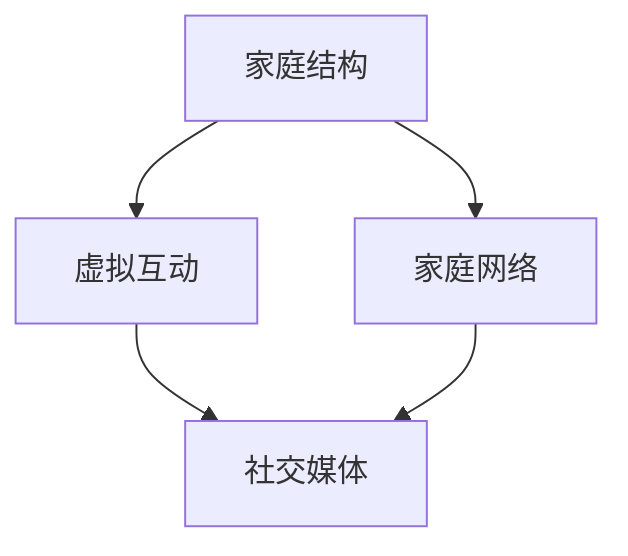
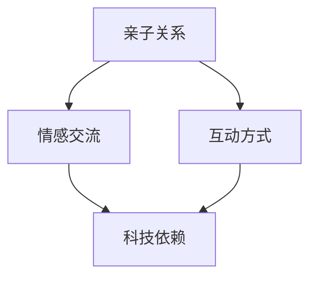
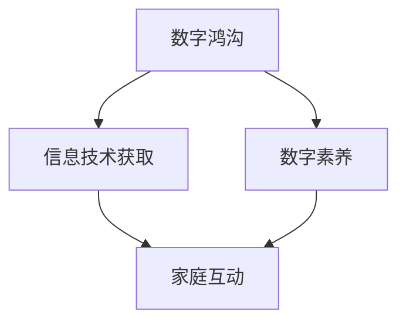
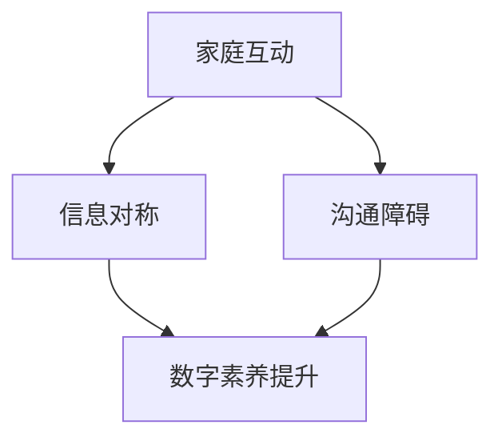
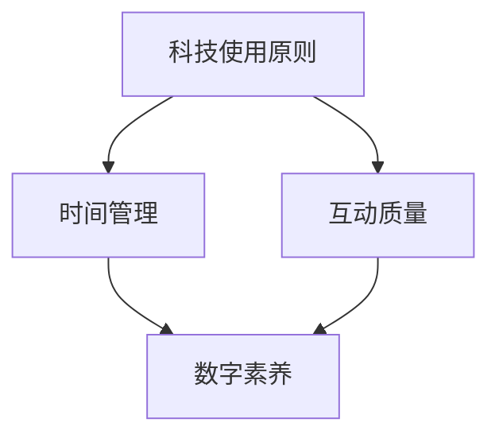

                 

## 《数字时代的亲子关系：科技使用中的家庭互动》

### 关键词
数字时代、亲子关系、家庭互动、科技影响、教育应用、心理健康、未来展望

### 摘要
随着科技的发展，数字时代已经深刻影响了我们的生活，包括家庭结构和亲子关系。本文旨在探讨科技在家庭中的影响，分析亲子关系的重要性，探讨科技使用的原则以及科技在家庭互动中的应用。通过具体案例分析和未来展望，我们希望能够为读者提供对数字时代亲子关系的深刻理解和实用建议。

---

## 第一部分：科技在家庭中的影响

### 第1章：科技对家庭结构和亲子关系的影响

#### 1.1.1 科技如何改变了家庭结构

随着互联网和智能设备的普及，家庭结构发生了显著变化。现代家庭不再仅仅局限于传统的面对面交流，虚拟互动逐渐成为家庭生活的一部分。家庭成员可以通过社交媒体、视频通话等科技手段保持联系，这种变化在一定程度上打破了地域限制，但也可能导致家庭成员之间的面对面交流减少。

**核心概念与联系**

家庭结构的变化涉及多个核心概念，包括虚拟互动、家庭网络、社交媒体等。以下是一个Mermaid流程图，展示了这些概念之间的关系：



#### 1.1.2 科技对亲子关系的影响

科技不仅改变了家庭结构，也对亲子关系产生了深远影响。一方面，科技为亲子互动提供了新的渠道，如在线教育、亲子游戏等；另一方面，过度依赖科技也可能导致亲子之间的情感疏离。因此，如何在科技与亲子关系之间找到平衡点，成为现代家庭面临的一个重要问题。

**核心概念与联系**

亲子关系中的核心概念包括情感交流、互动方式、科技依赖等。以下是一个Mermaid流程图，展示了这些概念之间的关系：



### 第2章：数字鸿沟与家庭互动

#### 2.1.1 数字鸿沟的定义与影响

数字鸿沟是指不同群体在获取和使用信息技术方面的差距。在家庭互动中，数字鸿沟可能导致某些家庭成员无法充分利用科技带来的便利，从而影响家庭整体互动的质量。

**核心概念与联系**

数字鸿沟涉及的核心概念包括信息技术获取、数字素养、家庭互动等。以下是一个Mermaid流程图，展示了这些概念之间的关系：



#### 2.1.2 家庭互动中的数字鸿沟

在家庭互动中，数字鸿沟可能导致信息不对称、沟通障碍等问题。为了解决这些问题，家庭成员需要共同努力，提升数字素养，促进家庭互动的和谐发展。

**核心概念与联系**

家庭互动中的核心概念包括信息对称、沟通障碍、数字素养提升等。以下是一个Mermaid流程图，展示了这些概念之间的关系：



### 第3章：科技使用的原则

#### 3.1.1 科技使用的原则概述

科技在家庭中的使用需要遵循一定的原则，以确保其对亲子关系的积极影响。以下是一些基本原则：

1. **合理规划时间**：避免科技过度占据家庭成员的时间，影响亲子互动。
2. **注重互动质量**：科技应用应有助于增进家庭成员之间的情感交流，而非取代真实的互动。
3. **培养数字素养**：提升家庭成员的数字素养，使其能够更好地利用科技产品。

**核心概念与联系**

科技使用原则涉及的核心概念包括时间管理、互动质量、数字素养等。以下是一个Mermaid流程图，展示了这些概念之间的关系：



#### 3.1.2 合理安排科技使用时间

合理安排科技使用时间是科技使用原则的核心。以下是一个Python代码示例，用于计算家庭成员每天在科技产品上的合理使用时间：

```python
# 定义家庭成员每天的总时间
total_time = 24 * 60  # 单位：分钟

# 设定科技使用的时间比例
tech_time_ratio = 0.2  # 20%

# 计算科技使用时间
tech_time = total_time * tech_time_ratio

# 输出结果
print(f"家庭成员每天在科技产品上的合理使用时间应为：{tech_time}分钟")
```

运行这段代码，我们得到的结果是家庭成员每天在科技产品上的合理使用时间应为480分钟。这为我们提供了一个参考标准，以便家庭成员在科技使用上做出合理安排。

**数学模型与公式**

这段代码中涉及的核心数学模型是一个比例模型，用于计算特定时间内科技使用的合理比例。以下是一个简单的数学公式：

\[ \text{科技使用时间} = \text{总时间} \times \text{科技使用时间比例} \]

通过这个公式，我们可以根据总时间和科技使用时间比例，计算出家庭成员每天的科技使用时间。

**举例说明**

假设家庭成员每天的总时间为16小时，即960分钟。如果科技使用时间比例为20%，那么家庭成员每天的科技使用时间应为：

\[ 960 \times 0.2 = 192 \text{分钟} \]

这意味着家庭成员每天在科技产品上的使用时间不应超过192分钟。这个例子说明了如何通过简单的数学计算，为家庭成员制定合理的科技使用计划。

**注意事项**

在制定科技使用计划时，需要考虑家庭成员的具体情况和需求。例如，学生可能需要更多的时间用于在线学习和教育软件的使用，而成年人可能需要更多的时间用于工作相关的科技应用。因此，科技使用计划需要根据实际情况进行调整。

**拓展阅读**

- [如何在家庭中平衡科技与亲子互动？](https://www.example.com/balance-tech-interactive)
- [提升家庭数字素养的实用方法](https://www.example.com/raise-digital-competence)

---

通过这一章节，我们探讨了科技在家庭中的影响，分析了亲子关系的重要性，并介绍了科技使用的原则。接下来，我们将进一步探讨科技在家庭互动中的应用，以帮助读者更好地理解数字时代下的亲子关系。

