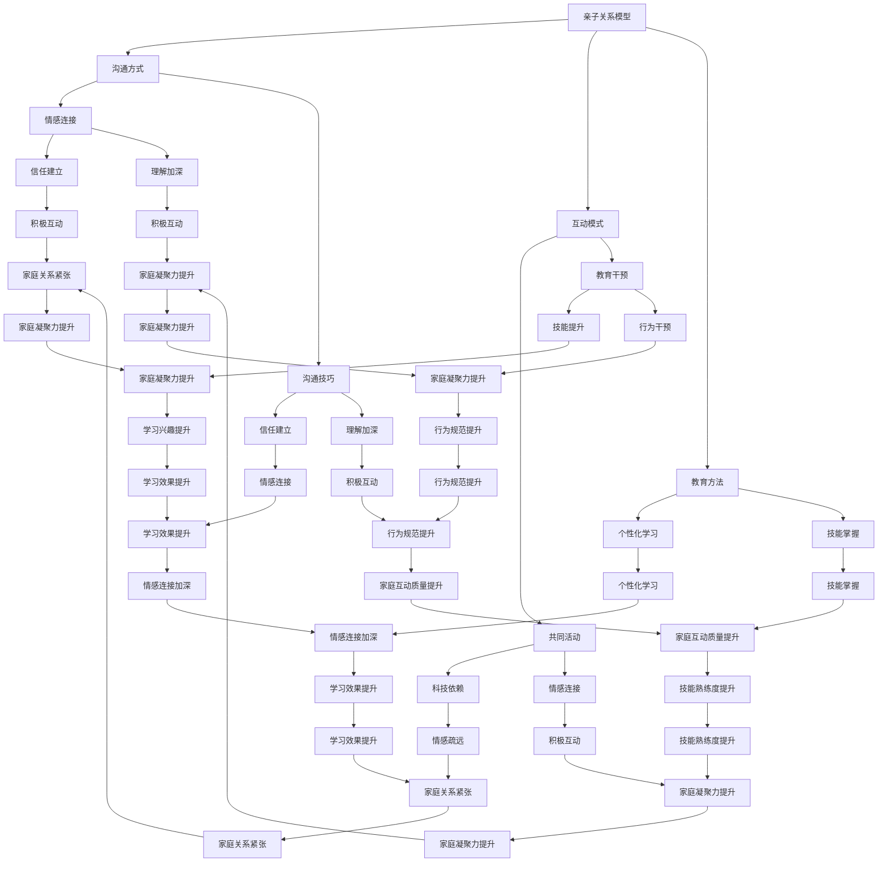

                 

### 背景介绍

#### 数字时代的崛起

在当今世界，数字技术的迅猛发展已经深刻改变了我们的生活方式。从智能手机到智能家居，从在线教育到远程办公，科技正以前所未有的速度渗透进日常生活的方方面面。特别是对于家庭来说，科技不仅带来了便利，也引发了亲子关系的新变化。在这个背景下，探讨数字时代下的亲子关系，以及科技在其中的角色，显得尤为重要。

#### 科技与家庭互动

随着科技产品的普及，家庭成员之间的互动方式也在发生变化。传统面对面的交流逐渐被屏幕上的文字、图像和视频所取代。例如，父母通过智能手机或平板电脑与孩子进行视频通话，在线教育平台成为孩子们学习的新场所，家庭游戏和社交媒体则成为了家庭成员共同的娱乐活动。这些变化既带来了新的互动机会，也引发了一系列新的挑战。

#### 亲子关系的重要性

亲子关系是家庭生活的核心，它不仅影响孩子的成长和发展，也关系到家庭的稳定和幸福。在数字时代，如何保持良好的亲子关系，如何让孩子在科技环境中健康成长，成为家长和社会共同关注的焦点。因此，深入探讨数字时代下的亲子关系，对于家庭和社会的发展具有重要意义。

#### 文章目的

本文旨在通过分析数字时代背景下的亲子关系，探讨科技在其中的作用。我们将从核心概念出发，详细讨论家庭互动的心理学基础，科技使用中的家庭行为分析，并利用Python源代码结合数学模型和公式，对核心算法原理进行讲解。此外，还将通过实际案例分析和实战指导，提出最佳实践建议，帮助家长和社会更好地应对数字时代下的亲子关系挑战。

### 核心概念与联系

在数字时代的背景下，亲子关系不仅仅是传统的家庭互动，而是融入了科技元素的复杂系统。为了深入理解这一系统，我们需要明确几个核心概念，并分析它们之间的关系。

#### 1. 亲子关系模型

亲子关系模型是理解家庭互动的基础。传统的亲子关系模型主要关注父母与子女之间的情感连接和沟通，而数字时代的亲子关系模型则需要考虑科技的影响。这种模型包括以下几个关键因素：

- **沟通方式**：传统亲子关系中的沟通主要是面对面交流，而在数字时代，沟通方式则扩展到视频通话、即时消息和社交媒体。
- **互动模式**：在数字时代，家庭互动的模式也发生了变化。例如，父母与孩子可能通过在线教育平台共同学习，或者通过共同玩游戏来增进互动。
- **教育方法**：科技产品为教育提供了新的工具和方法。例如，父母可以通过在线资源为孩子提供个性化的学习体验，或者利用教育软件帮助孩子掌握新技能。

#### 2. 家庭互动的心理学基础

家庭互动的心理学基础是理解亲子关系的另一个重要方面。心理学研究指出，亲子关系的质量对孩子的发展具有重要影响。以下是几个关键心理学概念：

- **情感连接**：情感连接是亲子关系的核心。研究表明，情感连接良好的家庭更倾向于有积极的家庭互动。
- **沟通技巧**：良好的沟通技巧有助于父母与孩子建立信任和理解。在数字时代，父母需要学会如何在屏幕前有效地与孩子沟通。
- **行为干预**：当孩子出现行为问题时，父母需要采取适当的行为干预措施。科技产品可以辅助父母进行行为干预，例如使用应用程序来监控孩子的屏幕时间或行为。

#### 3. 科技使用中的家庭行为分析

在数字时代，科技使用已成为家庭互动的一个重要组成部分。对家庭行为进行分析有助于理解科技如何影响亲子关系。以下是几个关键行为分析概念：

- **科技依赖**：家庭中的成员可能会对科技产生依赖，特别是年轻人。这种依赖可能导致亲子关系的疏远。
- **共同活动**：科技产品可以作为家庭共同活动的媒介。例如，家庭成员可以通过在线游戏或视频聊天来共同度过时间。
- **教育干预**：科技产品可以用于教育干预，例如通过教育应用程序来提高孩子的学习效果。

#### 4. 核心概念联系与流程图

为了更好地理解这些核心概念之间的关系，我们可以使用Mermaid流程图来展示它们之间的联系：

通过上述流程图，我们可以清晰地看到亲子关系模型、家庭互动的心理学基础以及科技使用中的家庭行为分析之间的复杂联系。这些联系有助于我们更好地理解数字时代下的亲子关系，并为未来的研究提供指导。在接下来的章节中，我们将深入探讨这些核心概念，并使用Python源代码和数学模型来详细阐述它们的原理和应用。

