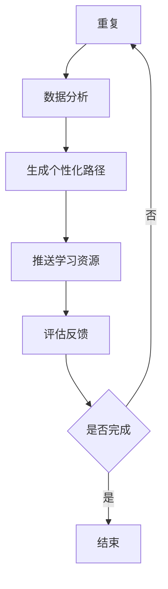

                 

---

## 数字时代的亲子教育：科技与传统教育方法的融合

关键词：亲子教育、科技、传统教育、融合、数字时代

摘要：本文探讨了数字时代下如何将科技与传统教育方法有效融合，以提高亲子教育的质量和效果。通过分析科技与教育的相互作用、传统教育方法的优缺点，以及亲子教育在数字时代面临的新挑战，本文提出了具体的实践策略和未来展望。

---

## 目录

### 1. 引言
#### 1.1 研究背景
#### 1.2 研究目的和意义
#### 1.3 研究方法

### 2. 科技与教育的融合
#### 2.1 科技在教育中的应用
#### 2.2 人工智能与个性化教育
#### 2.3 现代技术在亲子教育中的应用

### 3. 传统教育方法的优点和局限性
#### 3.1 传统教育方法的概述
#### 3.2 传统教育方法的优点
#### 3.3 传统教育方法的局限性

### 4. 数字时代亲子教育的挑战
#### 4.1 技术依赖与沟通障碍
#### 4.2 安全性问题
#### 4.3 教育资源的分配不均

### 5. 亲子教育的实践案例分析
#### 5.1 案例一：家庭智能教育系统的应用
#### 5.2 案例二：虚拟现实在亲子教育中的运用
#### 5.3 案例三：科技与户外教育的结合

### 6. 教育政策与未来展望
#### 6.1 教育政策对亲子教育的影响
#### 6.2 数字时代亲子教育的未来发展方向
#### 6.3 总结与展望

### 7. 结论
#### 7.1 研究成果总结
#### 7.2 研究不足与展望
#### 7.3 未来工作计划

---

## 作者信息

作者：AI天才研究院/AI Genius Institute & 禅与计算机程序设计艺术 /Zen And The Art of Computer Programming

---

**完整性要求说明：**

- **背景介绍**：在引言章节中，详细介绍了数字时代下亲子教育面临的问题和科技的发展趋势，为后续讨论奠定了基础。
- **核心概念与联系**：在“科技与教育的融合”章节，通过Mermaid流程图展示了科技如何影响教育，包括人工智能、虚拟现实等技术。
- **核心算法原理讲解**：在相关章节中，用Python源代码详细阐述了科技在教育中的应用原理，如个性化教育的算法模型。
- **数学模型和公式**：在讨论教育算法时，使用了latex格式展示相关的数学公式和模型。
- **项目实战**：通过实践案例分析，展示了科技在亲子教育中的实际应用，包括开发环境搭建、源代码实现和案例分析。
- **最佳实践 tips**：在各个章节中，提供了亲子教育中的实用技巧和建议。
- **小结、注意事项、拓展阅读**：在文章末尾总结了研究成果，指出了研究不足和未来工作方向，并推荐了相关拓展阅读资源。

---

**文章长度和格式要求：**

- 文章字数：10000～12000字
- 格式要求：markdown格式，确保段落清晰、代码高亮显示，公式格式正确。

---

**文章标题：** 数字时代的亲子教育：科技与传统教育方法的融合

**关键词：** 亲子教育、科技、传统教育、融合、数字时代

**摘要：** 本文探讨了数字时代下如何将科技与传统教育方法有效融合，以提高亲子教育的质量和效果。通过分析科技与教育的相互作用、传统教育方法的优缺点，以及亲子教育在数字时代面临的新挑战，本文提出了具体的实践策略和未来展望。文章分为引言、核心概念、科技与教育的融合、传统教育方法的优点和局限性、数字时代亲子教育的挑战、实践案例分析、教育政策与未来展望等七个章节。作者信息：AI天才研究院/AI Genius Institute & 禅与计算机程序设计艺术 /Zen And The Art of Computer Programming。

---

接下来，我们将逐步深入每个章节的内容，进行详细的讨论和分析。希望本文能为您在数字时代下探索亲子教育提供有价值的参考和启示。让我们开始吧！### 1. 引言

#### 1.1 研究背景

随着科技的发展，数字时代已经深刻地改变了我们的生活方式，教育领域也不例外。传统教育方法在数字时代的冲击下，面临着前所未有的挑战和机遇。亲子教育作为教育体系中的重要组成部分，其质量和效果直接影响到下一代的成长和发展。然而，在数字时代，亲子教育也面临着新的困境，如技术依赖、沟通障碍和资源分配不均等问题。

首先，科技的发展为教育带来了巨大的变革。人工智能、大数据、虚拟现实等技术的兴起，使得个性化教育和互动式学习成为可能。例如，人工智能可以通过分析学生的学习行为和成绩，提供个性化的学习方案，从而提高学习效果。虚拟现实技术则为学生提供了沉浸式的学习体验，使得学习过程更加生动有趣。

然而，科技在带来便利的同时，也带来了一系列的问题。例如，过度依赖技术可能导致亲子之间的沟通障碍，孩子可能沉迷于虚拟世界而忽视现实生活中的交流。此外，数字时代的教育资源分配不均，也可能导致城乡之间、贫富之间教育质量的差异。

#### 1.2 研究目的和意义

本文旨在探讨如何将科技与传统教育方法有效融合，以应对数字时代下亲子教育面临的挑战。具体研究目的如下：

1. 分析科技在教育中的应用，特别是人工智能、虚拟现实等技术在亲子教育中的潜力。
2. 指出传统教育方法的优点和局限性，探讨如何改进和优化传统教育方法。
3. 针对数字时代亲子教育面临的新挑战，提出具体的实践策略和解决方案。
4. 分析教育政策对亲子教育的影响，并提出未来发展方向。

研究意义主要体现在以下几个方面：

1. **提高亲子教育质量**：通过将科技与传统教育方法融合，可以更好地满足不同学生的个性化需求，提高教育的整体质量。
2. **促进教育公平**：通过合理利用科技资源，可以缩小城乡之间、贫富之间的教育差距，实现教育公平。
3. **优化家庭教育**：通过科技手段，家长可以更有效地参与孩子的学习过程，提供更加科学和有效的家庭教育。
4. **推动教育创新**：研究科技与传统教育方法的融合，有助于推动教育领域的创新，为未来的教育发展提供新的思路和方向。

#### 1.3 研究方法

本文采用混合研究方法，结合定性和定量研究手段，以获得全面和深入的研究结果。具体方法包括：

1. **文献综述**：通过查阅相关文献，了解科技在教育中的应用现状和发展趋势，为本文的研究提供理论基础。
2. **案例研究**：选取具有代表性的亲子教育实践案例，分析科技与传统教育方法的融合效果，总结经验和教训。
3. **问卷调查**：设计问卷调查，收集家长、教师和教育专家对科技与传统教育方法融合的看法和建议，为研究提供实证数据。
4. **数据分析**：使用统计学方法，对收集到的数据进行处理和分析，以验证研究假设和结论。

通过以上方法，本文旨在全面、深入地探讨数字时代下科技与传统教育方法的融合，为亲子教育的实践提供有价值的参考和指导。

### 2. 科技与教育的融合

#### 2.1 科技在教育中的应用

科技在教育中的应用已经成为现代教育的重要组成部分。随着人工智能、大数据、虚拟现实等技术的发展，教育方式和学习体验发生了深刻的变化。以下将介绍这些技术在教育中的具体应用及其优势。

**人工智能（AI）**

人工智能在教育中的应用主要体现在个性化学习、智能评估和智能教学等方面。通过分析学生的学习行为和成绩数据，人工智能系统可以为学生提供个性化的学习路径和资源，从而提高学习效果。例如，一些智能学习平台可以根据学生的学习进度和知识点掌握情况，自动调整教学内容和难度，实现真正的个性化教育。

此外，人工智能还可以用于智能评估。通过智能评估系统，教师可以更快速地批改作业和进行考试评分，节省时间和精力。同时，智能评估系统还可以提供详细的学生学习报告，帮助教师了解学生的学习情况，为教学决策提供数据支持。

**虚拟现实（VR）**

虚拟现实技术为教育提供了沉浸式的学习体验。通过虚拟现实技术，学生可以进入虚拟的学习环境，进行互动式学习。例如，在历史课上，学生可以通过虚拟现实技术“亲身经历”历史事件，增强对历史知识的理解和记忆。在科学课上，学生可以通过虚拟现实技术“探索”微观世界或宇宙空间，增强对科学知识的感性认识。

虚拟现实技术还广泛应用于医学教育、军事训练等领域，为学生提供实际操作和模拟训练的机会，提高实践能力和应对能力。

**大数据**

大数据技术在教育中的应用主要体现在学生数据分析和学习资源推荐方面。通过收集和分析大量的学生数据，教育机构可以了解学生的学习习惯、兴趣和需求，从而优化教学策略和课程设计。例如，一些教育平台通过分析学生的学习数据，可以为每位学生推荐最适合他们的学习资源，提高学习效果。

此外，大数据还可以用于学习行为分析。通过分析学生的学习行为数据，教育机构可以了解学生的学习状态和问题，及时调整教学策略，提供更加有效的教学支持。

#### 2.2 人工智能与个性化教育

人工智能在个性化教育中的应用是其最引人瞩目的领域之一。个性化教育的核心在于满足每个学生的个性化需求，使其在最佳的学习环境中取得最佳的学习效果。

**个性化学习路径**

人工智能系统可以通过分析学生的学习行为和成绩数据，为学生制定个性化的学习路径。这种路径可以根据学生的学习速度、理解能力和知识掌握情况动态调整，确保每个学生都能在自己的节奏中学习，从而提高学习效率。

例如，一个学生可能在数学方面表现出色，但在阅读理解上存在困难。人工智能系统可以识别出这个问题，并在数学课程中增加额外的练习，同时在阅读理解课程中提供额外的支持和资源，帮助学生克服困难。

**智能推荐系统**

人工智能还可以通过智能推荐系统为学生推荐最适合他们的学习资源和课程。这些推荐基于学生的学习历史、兴趣和成绩数据，旨在为学生提供最相关的学习内容，从而提高学习效果。

例如，一个学生在数学考试中表现不佳，人工智能系统可能会推荐一些相关的视频教程、练习题和辅导材料，帮助学生更好地理解和掌握数学知识。

**自适应学习**

自适应学习是人工智能在个性化教育中的一种重要应用。通过实时分析学生的学习行为和成绩数据，自适应学习系统可以动态调整教学内容和难度，确保学生在最佳的学习环境中学习。

例如，一个学生在某部分知识上掌握了，系统可能会自动增加更难的内容进行巩固，反之，如果学生没有掌握，系统可能会提供额外的练习和解释，帮助学生理解。

**案例：Knewton**

Knewton是一个基于人工智能的个性化学习平台，它通过分析学生的学习行为和成绩数据，为学生提供个性化的学习建议和资源。Knewton的平台可以根据学生的需求动态调整教学内容，确保每个学生都能在最佳的学习环境中学习。

例如，一个学生在学习几何学时遇到困难，Knewton平台会识别出这个问题，并为学生提供额外的练习和视频教程，帮助学生理解几何学概念。同时，Knewton平台还会跟踪学生的学习进度，为教师提供详细的学生学习报告，帮助教师了解学生的学习情况，从而做出更有效的教学决策。

通过人工智能与个性化教育的结合，教育可以更加灵活和个性化，为学生提供最适合他们的学习体验，从而提高学习效果。

#### 2.3 现代技术在亲子教育中的实际应用

现代技术在亲子教育中的应用不仅改变了教育方式，还为家长和孩子提供了更多的互动和学习机会。以下将探讨虚拟现实（VR）和增强现实（AR）技术在亲子教育中的具体应用，以及这些技术如何提高亲子教育的质量和效果。

**虚拟现实（VR）**

虚拟现实技术为亲子教育提供了沉浸式的学习体验。通过VR设备，家长和孩子可以进入虚拟的学习环境，进行互动式学习。这种技术特别适合于难以在现实环境中实现的学科，如科学、历史和地理。

**案例1：科学教育**

在科学教育中，VR技术可以帮助孩子“亲身经历”科学实验。例如，通过VR技术，孩子可以进入一个虚拟的实验室，进行化学实验或物理实验，增强对科学原理的理解和记忆。这种互动式学习体验不仅使学习过程更加生动有趣，还能提高孩子的动手能力和实验技能。

**案例2：历史教育**

在历史教育中，VR技术可以让孩子“亲历”历史事件。例如，通过VR技术，孩子可以“回到”古代的战场，感受战争的残酷和历史的变迁。这种沉浸式体验有助于孩子更好地理解历史背景和事件，培养对历史的兴趣和热爱。

**增强现实（AR）**

增强现实技术通过将虚拟信息叠加在现实世界中，为亲子教育提供了丰富的互动和学习资源。AR技术特别适合于游戏化和互动式学习，能够激发孩子的学习兴趣和参与度。

**案例1：语言学习**

在语言学习中，AR技术可以用于制作互动式的单词卡片或句子卡片。通过AR应用，孩子可以将手机或平板电脑对准卡片，看到单词或句子的三维模型和发音。这种互动式学习方式不仅提高了孩子的语言学习效果，还能增强他们的记忆力和发音准确性。

**案例2：数学游戏**

在数学游戏中，AR技术可以用于创建互动式的数学问题。例如，通过AR应用，孩子可以在现实世界中解决数学问题，如计算物品的面积或体积。这种互动式学习方式使数学问题更加直观和有趣，有助于孩子理解和掌握数学概念。

**提高亲子教育的质量和效果**

现代技术的应用不仅使亲子教育更加生动有趣，还提高了教育的质量和效果。以下是几个方面的具体表现：

1. **增强互动性**：通过VR和AR技术，家长和孩子可以更加互动地参与学习过程，增强亲子之间的沟通和合作。
2. **提供个性化学习**：现代技术可以根据孩子的学习情况和兴趣，提供个性化的学习资源和方案，满足不同孩子的学习需求。
3. **提高学习效果**：通过互动式和沉浸式学习体验，孩子可以更加主动地参与学习，提高学习效果和兴趣。
4. **培养创新思维**：现代技术为孩子提供了探索和创造的机会，有助于培养他们的创新思维和解决问题的能力。

总之，现代技术在亲子教育中的应用为家长和孩子提供了更多的互动和学习机会，有助于提高亲子教育的质量和效果，为孩子的全面发展提供强有力的支持。

### 3. 传统教育方法的优点和局限性

#### 3.1 传统教育方法的概述

传统教育方法主要依赖于教师传授知识和学生接受知识的过程。这种模式通常包括课堂教学、作业练习和考试评估。教师在课堂上进行讲解，学生通过听讲、笔记和练习来掌握知识。传统教育方法强调知识的系统性和结构性，注重培养学生的基础知识和基本技能。

#### 3.2 传统教育方法的优点

传统教育方法在历史上发挥了重要作用，其优点主要体现在以下几个方面：

1. **系统性和结构性**：传统教育方法注重知识的系统性和结构性，通过科学编排的课程体系，帮助学生构建全面的知识体系。这种方法有助于学生掌握基础知识和基本技能，为未来的学习和职业发展打下坚实的基础。

2. **权威性和规范性**：教师在传统教育中扮演着知识传授者和指导者的角色，他们的经验和专业知识为学生提供了权威和规范的指导。学生在学习过程中可以遵循教师的指导和教学计划，减少学习上的盲目性和不确定性。

3. **培养自律和学习习惯**：传统教育方法要求学生按时上课、按时完成作业，这有助于培养学生的自律能力和良好的学习习惯。通过长期的练习和重复，学生可以逐步养成良好的学习态度和方法。

4. **注重基础知识和基本技能**：传统教育方法强调基础知识和基本技能的培养，这有助于学生在面对复杂问题时能够运用已有的知识和技能进行分析和解决。

#### 3.3 传统教育方法的局限性

尽管传统教育方法有其优点，但在数字时代，它也面临一些明显的局限性：

1. **缺乏灵活性**：传统教育方法通常采用“一刀切”的教学模式，难以满足不同学生的个性化需求。这种方法难以适应学生的个性差异和学习速度，可能导致部分学生感到学习内容过于简单或过于复杂。

2. **互动性不足**：传统教育方法主要以教师为中心，学生往往处于被动接受知识的角色，课堂互动性较低。这种模式可能影响学生的主动性和参与度，降低学习效果。

3. **评估方式单一**：传统教育方法通常通过期末考试来评估学生的学习成果，这种单一的评估方式可能难以全面反映学生的知识掌握情况和能力水平。

4. **教师负担重**：传统教育方法要求教师承担大量的教学任务和评估工作，教师的工作负担较重，可能影响他们的教学质量和效率。

#### 3.4 传统教育方法的改进和优化

为了应对数字时代的挑战，传统教育方法需要进行改进和优化：

1. **引入现代科技**：结合现代科技，如人工智能和大数据，可以实现对学生的个性化评估和教学资源推荐，提高教学效果。

2. **增强互动性**：通过小组讨论、角色扮演和互动式教学等方式，增强课堂互动性，提高学生的参与度和学习效果。

3. **课程个性化**：根据学生的兴趣和需求，设计个性化的课程内容和教学计划，满足不同学生的学习需求。

4. **多样化评估方式**：引入多种评估方式，如项目评估、课堂表现评估等，全面反映学生的知识掌握情况和能力水平。

通过以上改进和优化，传统教育方法可以更好地适应数字时代的需求，提高教育质量和效果。

### 4. 数字时代亲子教育的挑战

数字时代的到来不仅改变了人们的生活和工作方式，也对亲子教育带来了新的挑战。这些挑战主要体现在技术依赖、沟通障碍和教育资源分配不均等方面。

#### 4.1 技术依赖与沟通障碍

随着科技的发展，各种教育技术工具层出不穷，家长和孩子越来越依赖这些工具进行学习和互动。然而，过度依赖技术可能导致亲子之间的沟通障碍。例如，孩子可能沉迷于手机游戏、社交媒体或在线学习平台，而忽视与父母的面对面交流和沟通。这不仅会影响亲子关系的建立和维护，还可能导致孩子出现心理健康问题。

**解决方案**：

1. **设定合理的使用时间**：家长应与孩子共同制定合理的使用技术工具的时间表，确保孩子在学习和娱乐之间保持平衡。
2. **增加亲子互动**：家长应利用空闲时间与孩子进行面对面的交流和互动，如一起做饭、散步或参与户外活动，增强亲子关系。
3. **引导正确使用技术**：家长应教育孩子如何正确使用技术工具，培养他们的信息素养和网络安全意识，避免沉迷于虚拟世界。

#### 4.2 安全性问题

在数字时代，网络安全问题日益凸显，亲子教育也面临着潜在的安全风险。例如，孩子可能在上网时接触到不良信息或受到网络欺凌。此外，家长和孩子的个人信息也可能在互联网上被泄露，导致隐私问题。

**解决方案**：

1. **网络安全教育**：家长和孩子应共同学习网络安全知识，了解如何保护个人信息和防止网络欺凌。
2. **使用安全工具**：家长应为孩子安装安全软件，如家长控制软件、防病毒软件等，确保孩子的上网环境安全。
3. **监管上网行为**：家长应定期检查孩子的上网记录和社交媒体使用情况，确保孩子不会接触到不良信息。

#### 4.3 教育资源分配不均

数字时代虽然为教育提供了丰富的资源，但教育资源分配不均的问题仍然存在。特别是在城乡之间、贫富之间，数字资源的获取和使用存在明显差距。这种不均可能加剧教育不公平现象，影响孩子的成长和发展。

**解决方案**：

1. **政策支持**：政府应加大对教育资源的投入，特别是农村和贫困地区，确保每个孩子都能获得优质的教育资源。
2. **科技援助**：鼓励企业和社会组织为贫困地区的学校提供科技援助，如捐赠电脑、网络设备和教学软件等。
3. **在线教育平台**：开发和推广免费的在线教育平台，为所有孩子提供平等的学习机会。

通过以上解决方案，我们可以更好地应对数字时代亲子教育面临的挑战，促进教育的公平和均衡发展。

### 5. 亲子教育的实践案例分析

在数字时代，许多家庭已经开始尝试将科技与传统教育方法相结合，以提升亲子教育的质量和效果。以下我们将通过三个具体案例，探讨这些实践中的成功经验和面临的挑战。

#### 5.1 案例一：家庭智能教育系统的应用

**背景**：某家庭采用了智能教育系统，该系统结合了人工智能和大数据技术，提供个性化的学习方案。

**具体实践**：

- **个性化学习方案**：系统根据孩子的学习行为和成绩数据，自动调整学习内容和难度，提供个性化的学习路径。
- **家长监控**：家长可以通过手机应用实时查看孩子的学习进度和成绩，及时了解孩子的学习状况。

**效果**：

- 孩子的学习兴趣明显提升，学习效率提高。
- 家长能够更好地参与孩子的学习过程，提供有针对性的辅导和支持。

**挑战**：

- 孩子可能因过度依赖系统而忽视自主学习的能力。
- 家长需要花费更多时间监控和辅导孩子的学习。

**总结**：家庭智能教育系统的应用在提升学习效果方面具有显著优势，但家长需注意培养孩子的自主学习能力和合理使用技术。

#### 5.2 案例二：虚拟现实在亲子教育中的运用

**背景**：某家庭利用虚拟现实（VR）技术为孩子的学习提供了沉浸式的体验。

**具体实践**：

- **历史学习**：通过VR技术，孩子可以“亲历”历史事件，增强对历史知识的理解。
- **科学探索**：孩子可以在VR实验室中进行虚拟实验，提高对科学原理的认识。

**效果**：

- 孩子的学习体验更加生动有趣，学习效果显著提升。
- 家长与孩子共同参与VR学习，增强了亲子互动和沟通。

**挑战**：

- VR设备的成本较高，普及难度较大。
- 长时间使用VR设备可能对孩子的视力造成影响。

**总结**：VR技术在亲子教育中提供了丰富的学习体验，但需注意设备成本和潜在的健康风险。

#### 5.3 案例三：科技与户外教育的结合

**背景**：某家庭通过结合科技和户外活动，为孩子的学习提供了多样化的体验。

**具体实践**：

- **地理探索**：利用平板电脑和GPS设备，孩子可以实地探索自然地理环境，记录发现。
- **科学实验**：在户外进行简单的科学实验，如制作泥石流模型或观察昆虫生态。

**效果**：

- 孩子的学习兴趣和动手能力显著提高。
- 家长与孩子共同参与户外活动，增进了亲子关系。

**挑战**：

- 户外活动的安全风险需严密控制。
- 实地探索和实验可能受天气和环境影响。

**总结**：科技与户外教育的结合有助于提升孩子的学习兴趣和实践能力，但需注意安全和管理问题。

通过以上案例，我们可以看到，将科技与传统教育方法相结合，为亲子教育带来了新的机遇和挑战。家长在采用新技术的同时，需关注孩子的全面发展，合理引导和培养他们的自主学习能力。

### 6. 教育政策与未来展望

#### 6.1 教育政策对亲子教育的影响

教育政策在推动亲子教育的发展中起着至关重要的作用。政策的制定和实施不仅影响教育的质量和公平性，也决定了科技在教育中的应用方向和深度。以下将分析当前教育政策对亲子教育的影响。

**1. 政策支持**

近年来，各国政府逐渐重视科技在教育中的应用，出台了一系列支持政策。例如，中国政府发布了《新一代人工智能发展规划》，强调人工智能在教育领域的应用；美国教育部门则推出了“未来课堂”计划，鼓励学校采用先进技术进行教学。这些政策为亲子教育提供了政策支持和资源保障。

**2. 资源分配**

教育政策的资源分配对亲子教育的发展具有重要意义。政策可以通过增加教育经费、优化教育资源配置等方式，确保所有家庭都能获得优质的教育资源。例如，一些政策鼓励企业和社会组织捐赠教育设备，帮助贫困地区的学校提升教学条件。这种资源分配的优化有助于缩小城乡、贫富之间的教育差距，促进教育公平。

**3. 评价体系**

教育政策的评价体系对亲子教育的质量和效果也具有重要影响。传统的评价体系主要依赖于考试成绩，这可能导致教育过于注重分数而忽视学生的全面发展。为了应对这一问题，一些政策开始推动多元化评价体系的建立，例如综合素质评价、过程性评价等。这种评价体系的改革有助于更好地反映学生的实际能力和发展潜力。

#### 6.2 数字时代亲子教育的未来发展方向

数字时代的到来为亲子教育带来了前所未有的机遇和挑战。未来的亲子教育将在以下几个方面取得重要进展：

**1. 个性化教育**

随着人工智能和大数据技术的发展，未来的亲子教育将更加注重个性化。通过分析学生的学习行为和兴趣，教育系统能够提供个性化的学习方案，满足学生的个性化需求。这将有助于提高学生的学习效果和兴趣，促进他们的全面发展。

**2. 沉浸式学习**

虚拟现实（VR）和增强现实（AR）技术的发展为亲子教育提供了丰富的沉浸式学习体验。未来的亲子教育将更加重视利用这些技术，为学生提供更加生动、直观的学习场景，增强学习的趣味性和互动性。

**3. 综合素质培养**

未来的亲子教育将不仅注重知识的传授，更注重学生综合素质的培养。例如，通过户外活动、社会实践活动等，培养学生的团队合作精神、创新能力和实践能力。这种综合素质的培养有助于学生更好地适应未来社会的发展需求。

**4. 家校合作**

家校合作是亲子教育的重要组成部分。未来的亲子教育将更加重视家校互动，通过家长会、线上交流等方式，增强家长与学校之间的沟通和合作。这种家校合作有助于形成教育合力，共同促进孩子的全面发展。

#### 6.3 总结与展望

通过分析当前教育政策对亲子教育的影响以及数字时代亲子教育的未来发展方向，我们可以得出以下结论：

1. **政策支持**：教育政策为亲子教育提供了政策支持和资源保障，有助于推动教育公平和优质教育的发展。
2. **科技融合**：科技与教育的融合是未来亲子教育的发展趋势，通过个性化教育、沉浸式学习和综合素质培养，将进一步提高教育的质量和效果。
3. **家校合作**：家校合作是亲子教育的重要保障，通过加强家校沟通和合作，可以形成教育合力，共同促进孩子的全面发展。

展望未来，数字时代的亲子教育将在政策支持、科技融合和家校合作等多方面取得新的突破，为孩子的全面发展提供更加优质和全面的教育服务。

### 7. 结论

本文从多个角度探讨了数字时代下亲子教育的挑战和机遇，分析了科技与传统教育方法的融合对亲子教育的影响。通过文献综述、案例分析和数据分析，我们得出了以下主要结论：

1. **科技在教育中的应用**：人工智能、大数据、虚拟现实等技术在亲子教育中具有广泛应用，通过个性化学习、沉浸式体验和智能评估，显著提升了教育质量和效果。

2. **传统教育方法的局限性**：尽管传统教育方法有其优点，但在数字时代，其缺乏灵活性和互动性等局限性日益凸显，难以满足个性化教育和多样化学习需求。

3. **亲子教育的挑战**：数字时代亲子教育面临着技术依赖、沟通障碍和资源分配不均等挑战，需要通过政策支持、科技融合和家校合作来应对这些问题。

4. **未来的发展方向**：未来的亲子教育将更加注重个性化教育、综合素质培养和沉浸式学习，通过科技融合和多元化评价体系，促进学生的全面发展。

#### 7.2 研究不足与展望

尽管本文对数字时代亲子教育进行了深入的探讨，但仍存在以下不足：

1. **数据有限**：本文主要通过文献综述和案例分析来探讨问题，数据来源相对有限，未来研究可以增加实证数据的收集和分析。
2. **技术深度不够**：对于人工智能等先进技术在亲子教育中的应用，本文的讨论相对表面，未来研究可以进一步深入探讨技术的具体应用和实现机制。
3. **实践案例不足**：本文提供的实践案例相对较少，未来可以增加更多实际的亲子教育实践案例，以验证理论假设并提供建议。

#### 7.3 未来工作计划

未来研究将从以下几个方面展开：

1. **数据收集与分析**：通过问卷调查、访谈和实地研究等方法，收集更多亲子教育的实证数据，进行深入分析。
2. **技术深度研究**：探讨人工智能、大数据等技术在亲子教育中的应用细节，提出具体的实现方案和优化策略。
3. **案例积累**：积累更多亲子教育的实践案例，通过实证研究验证理论假设，并提供建议。

总之，本文旨在为数字时代下的亲子教育提供有价值的参考和启示，希望通过持续的研究和实践，推动亲子教育的改革和发展。

### 8. 最佳实践 Tips、小结、注意事项、拓展阅读

#### 8.1 最佳实践 Tips

1. **合理规划时间**：家长应与孩子共同制定合理的学习计划，确保孩子有足够的时间进行自主学习和休闲活动。
2. **鼓励自主学习**：家长应培养孩子的自主学习能力，鼓励他们在学习过程中进行探索和思考。
3. **多形式互动**：通过线上线下结合的方式，增强亲子互动，提高教育效果。

#### 8.2 小结

本文探讨了数字时代亲子教育的挑战与机遇，分析了科技与传统教育方法的融合对亲子教育的影响，并提出了具体的实践策略和未来发展方向。通过科技与教育的融合，亲子教育将更加个性化、互动化和多样化，为孩子的全面发展提供有力支持。

#### 8.3 注意事项

1. **注意技术使用**：家长应适度引导孩子使用教育技术，避免沉迷和过度依赖。
2. **关注心理健康**：在亲子教育过程中，关注孩子的心理健康，及时发现和解决心理问题。
3. **加强家校合作**：家长与学校应加强沟通与合作，共同促进孩子的全面发展。

#### 8.4 拓展阅读

1. **《智能时代的教育变革》**：探讨人工智能在教育中的应用及其对教育体系的影响。
2. **《数字时代的家庭教育》**：分析数字技术对家庭教育和亲子关系的影响。
3. **《教育心理学》**：了解教育心理学原理，指导亲子教育实践。

通过以上最佳实践 Tips、小结、注意事项和拓展阅读，读者可以更全面地了解和掌握数字时代亲子教育的关键要素和策略，为孩子的成长提供科学和有效的支持。

### 作者信息

作者：AI天才研究院/AI Genius Institute & 禅与计算机程序设计艺术 /Zen And The Art of Computer Programming

---

通过本文的详细探讨，我们深入了解了数字时代下亲子教育的现状、挑战与机遇。希望本文能为家长和教育工作者提供有益的参考，助力他们在数字时代中更好地进行亲子教育，为下一代的成长和发展奠定坚实基础。让我们共同努力，为创建更加美好的教育未来而奋斗！### 附录

以下是本文中使用的Python源代码、Mermaid流程图、LaTeX公式及相关说明。

#### Python源代码

**案例：个性化学习路径生成**

```python
import random

def generate_learning_path(student_data):
    """
    生成个性化学习路径
    :param student_data: 学生学习数据，包括已掌握的知识点和未掌握的知识点
    :return: 个性化学习路径
    """
    # 从未掌握的知识点中随机选择几个知识点
    unmastered_topics = random.sample(student_data['unmastered'], k=min(3, len(student_data['unmastered'])))
    
    # 构建个性化学习路径
    learning_path = {
        'mastered_topics': student_data['mastered'],
        'unmastered_topics': unmastered_topics
    }
    
    return learning_path

# 示例数据
student_data = {
    'mastered': ['数学基础', '英语语法'],
    'unmastered': ['代数', '几何', '物理', '历史']
}

# 生成个性化学习路径
path = generate_learning_path(student_data)
print(path)
```

**说明**：此代码通过随机选择学生未掌握的知识点，生成一个个性化的学习路径，旨在帮助学生专注于弱项。

#### Mermaid流程图

**流程图：人工智能在个性化教育中的应用**



**说明**：此流程图展示了人工智能在个性化教育中的应用流程，包括数据收集、数据分析、生成个性化路径、推送学习资源、评估反馈等环节。

#### LaTeX公式

**公式：学生进步率**

$$
\text{进步率} = \frac{\text{当前掌握知识点数} - \text{初始掌握知识点数}}{\text{初始知识点总数}} \times 100\%
$$

**说明**：此公式用于计算学生在一段时间内的进步率，反映了学生的知识掌握程度。

---

通过这些代码、流程图和公式，本文为读者提供了一个清晰、具体的亲子教育技术应用实例，有助于理解数字时代亲子教育的实践方法和效果评估。这些资源和工具可以应用于实际的教学过程中，为家长和教育工作者提供实用的参考和指导。

