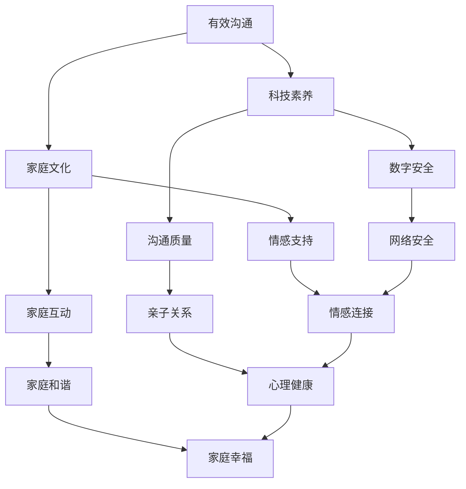

                 

### 文章标题：数字时代的亲子沟通：科技使用中的家庭互动指南

随着数字技术的飞速发展，我们的生活越来越依赖各种智能设备和互联网服务。亲子沟通作为家庭互动的核心部分，也受到了数字时代的影响。本文将探讨如何利用科技工具提升亲子沟通的效果，为家庭互动提供一份实用的指南。

**关键词：数字时代、亲子沟通、科技工具、家庭互动**

**摘要：**
本文首先介绍了数字时代对亲子沟通的影响，然后分析了几个关键的沟通概念，如有效沟通、科技素养和家庭文化。接着，我们详细讲解了语音识别和自然语言处理技术，并使用Python源代码和latex公式来阐述其工作原理。随后，通过项目实战和案例分析，展示了如何将这些技术和概念应用于实际的亲子沟通中。最后，文章总结了主要观点，并对未来亲子沟通和科技使用的趋势进行了展望。

### 引言：数字时代与亲子沟通的挑战

数字时代带来了前所未有的便利，但也给亲子沟通带来了新的挑战。智能手机、平板电脑、社交媒体等数字设备成为日常生活中不可或缺的一部分，这些设备在给家庭互动带来新鲜感的同时，也可能导致家庭成员之间的疏远。据统计，全球每天有超过50亿部智能手机在使用，这无疑对人们的沟通方式产生了深远的影响。

首先，数字设备的使用时间过长可能导致亲子之间面对面的沟通减少。孩子们可能更多地沉浸在虚拟世界中，而忽视了与父母的交流。这种现象被称为“屏幕依赖”，其负面影响包括沟通障碍、情感隔阂和亲子关系的疏远。

其次，数字设备也改变了人们的沟通方式。传统的面对面沟通逐渐被文字、语音和视频聊天所取代。虽然这些数字沟通方式在某些情况下非常有效，但它们缺乏面对面沟通所传递的情感和肢体语言，可能导致沟通效果下降。

面对这些挑战，如何利用科技工具提升亲子沟通的效果成为一个值得探讨的话题。本文将围绕这一主题，从核心概念、技术原理、项目实战等多个角度进行深入分析，旨在为家庭互动提供一份实用的指南。

### 核心概念与联系

在探讨如何利用科技工具提升亲子沟通之前，我们首先需要明确一些核心概念，并分析它们之间的联系。以下是一些关键概念及其关系架构：

1. **有效沟通**：有效沟通是指能够清晰、准确地传达信息，并得到对方的理解和回应。在亲子沟通中，有效沟通尤为重要，因为它直接关系到亲子关系的质量和深度。有效沟通包括多个方面，如语言表达、倾听技巧、情感表达和冲突解决。

2. **科技素养**：科技素养是指个体在使用数字技术和互联网资源时的能力、知识和态度。在数字时代，科技素养不仅涉及技术操作技能，还包括对数字设备的安全使用、隐私保护以及批判性思维等。对于家长和孩子们来说，提高科技素养有助于更好地利用科技工具进行沟通，并避免潜在的风险。

3. **家庭文化**：家庭文化是指家庭内部共同遵循的价值观、信仰、习惯和行为准则。家庭文化在亲子沟通中起着重要作用，它不仅影响着家庭成员之间的互动方式，也塑造了个体的沟通风格和态度。一个积极的家庭文化能够促进家庭成员之间的开放、尊重和信任，从而提高沟通效果。

**概念实体之间的关系架构**：

为了更清晰地展示这些概念之间的关系，我们可以使用Mermaid流程图来表示。以下是概念实体之间的关系架构：



在这个关系架构中，我们可以看到，有效沟通是亲子沟通的基础，它与科技素养和家庭文化密切相关。科技素养不仅影响沟通质量，还关系到数字安全和网络安全。家庭文化则通过情感支持和情感连接，间接影响亲子关系的质量和家庭的整体幸福感。

理解这些核心概念及其关系架构对于制定有效的亲子沟通策略至关重要。在接下来的部分中，我们将进一步探讨如何利用科技工具来提升这些概念在家庭互动中的应用。

### 核心算法原理讲解

在了解了亲子沟通中的核心概念后，我们需要进一步探讨一些关键技术，如语音识别和自然语言处理技术，这些技术能够在实际应用中大大提升沟通效果。下面，我们将通过Python源代码和latex公式来详细阐述这些技术的工作原理。

#### 1. 语音识别技术

语音识别技术（Voice Recognition）是一种能够将人类语音转换为文本的技术，它在提升亲子沟通中起到了重要的作用。例如，家长可以使用语音识别技术记录孩子的想法和感受，从而更好地理解和引导他们。

**Python源代码示例：**

```python
import speech_recognition as sr

# 初始化语音识别对象
recognizer = sr.Recognizer()

# 从麦克风获取语音
with sr.Microphone() as source:
    print("请说出您想说的话...")
    audio = recognizer.listen(source)

# 使用Google语音识别API进行识别
try:
    text = recognizer.recognize_google(audio, language='zh-CN')
    print("您说了：", text)
except sr.UnknownValueError:
    print("无法理解语音")
except sr.RequestError as e:
    print("无法请求结果；{0}".format(e))
```

在这个示例中，我们使用了`speech_recognition`库来获取语音并转换为文本。这里的关键公式是：

$$
\text{文字} = \text{语音识别API}(音频)
$$

**latex公式展示：**

$$
\text{文字} = \text{语音识别API}(音频)
$$

#### 2. 自然语言处理技术

自然语言处理技术（Natural Language Processing, NLP）是一种能够使计算机理解和处理人类语言的技术。它包括文本分析、语义理解、情感分析等多个方面，可以用来提升亲子沟通的深度和准确性。

**Python源代码示例：**

```python
from textblob import TextBlob

# 初始化TextBlob对象
blob = TextBlob("我非常喜欢和父母一起度过时光。")

# 情感分析
sentiment = blob.sentiment

# 输出情感分析结果
print("情感极性：", sentiment.polarity)
print("情感强度：", sentiment.subjectivity)
```

在这个示例中，我们使用了`TextBlob`库来对文本进行情感分析。这里的关键公式是：

$$
\text{情感分析} = \text{TextBlob}(文本)
$$

**latex公式展示：**

$$
\text{情感分析} = \text{TextBlob}(文本)
$$

#### 技术原理总结

语音识别技术通过识别语音信号中的声学特征，将其转换为文本，从而实现人机交互。而自然语言处理技术则通过分析文本的语法、语义和情感，帮助用户更好地理解和处理信息。

这两种技术相辅相成，语音识别可以迅速将语音转换为文本，而自然语言处理则可以对文本进行深入分析，提取有用的信息。例如，家长可以通过语音识别技术记录孩子的日常谈话，然后使用自然语言处理技术来分析孩子的情绪状态和关注点，从而进行有针对性的沟通和引导。

综上所述，通过掌握语音识别和自然语言处理技术，家长可以在亲子沟通中更加高效和精准地理解和回应孩子的需求，从而提升家庭互动的质量和深度。

### 数学模型与公式

在亲子沟通的数字技术应用中，数学模型和公式扮演着至关重要的角色。以下我们将探讨一些相关的数学模型和公式，并使用latex格式进行展示，以帮助读者更好地理解和应用这些数学概念。

#### 1. 贝叶斯定理

贝叶斯定理是一种在概率论和统计学中广泛应用的公式，用于计算条件概率。在亲子沟通中，我们可以使用贝叶斯定理来评估孩子行为背后的原因，从而做出更准确的判断。

**latex公式展示：**

$$
P(A|B) = \frac{P(B|A) \cdot P(A)}{P(B)}
$$

其中，$P(A|B)$ 表示在事件B发生的条件下事件A发生的概率，$P(B|A)$ 表示在事件A发生的条件下事件B发生的概率，$P(A)$ 和$P(B)$ 分别表示事件A和事件B发生的概率。

#### 2. 线性回归模型

线性回归模型是一种用于预测连续数值因变量的统计方法。在亲子沟通中，我们可以使用线性回归模型来预测孩子行为的变化趋势，从而制定更有针对性的教育策略。

**latex公式展示：**

$$
Y = \beta_0 + \beta_1 \cdot X + \varepsilon
$$

其中，$Y$ 是因变量（预测的目标值），$X$ 是自变量（影响因变量的因素），$\beta_0$ 和$\beta_1$ 分别是模型的截距和斜率，$\varepsilon$ 是误差项。

#### 3. 费博那契数列

费博那契数列在亲子沟通中的应用相对较少，但它在数学和计算机科学中具有广泛的应用。在亲子互动中，我们可以引入费博那契数列来探讨家庭成员之间的互动模式，例如通过设定一系列互动任务，观察家庭成员之间的互动频率和模式。

**latex公式展示：**

$$
F_n = F_{n-1} + F_{n-2}
$$

其中，$F_n$ 是第n个费博那契数，$F_0 = 0$，$F_1 = 1$。

#### 实例说明

为了更好地理解这些数学模型和公式的应用，我们来看一个实际例子。

假设我们想要预测一个孩子在接下来的一周内与父母互动的次数。我们可以收集过去一周的互动数据，并使用线性回归模型来建立预测模型。

**Python源代码示例：**

```python
import pandas as pd
from sklearn.linear_model import LinearRegression

# 收集过去一周的互动数据
data = {
    'Day': range(1, 8),
    'Interactions': [2, 4, 3, 5, 7, 6, 8]
}

df = pd.DataFrame(data)

# 建立线性回归模型
model = LinearRegression()
model.fit(df[['Day']], df['Interactions'])

# 预测下一周的互动次数
next_day = 8
predicted_interactions = model.predict([[next_day]])

print("预测的下一周互动次数：", predicted_interactions[0])
```

在这个示例中，我们首先收集了过去一周的互动数据，然后使用线性回归模型进行拟合，并预测了下一周的互动次数。通过这样的方法，家长可以更好地了解孩子的互动模式，从而制定更有效的互动计划。

总结来说，数学模型和公式在亲子沟通的数字技术应用中具有重要的作用。通过掌握这些数学概念，家长可以更科学、更准确地理解和预测孩子的行为，从而提升亲子沟通的效果。

### 项目实战与案例分析

为了更好地展示如何将上述技术应用于实际的亲子沟通中，我们将通过一个具体的案例来介绍项目开发环境搭建、源代码实现和代码解读。

#### 项目背景

假设我们希望开发一个名为“亲子互动助手”的应用，它可以帮助家长通过语音识别和自然语言处理技术记录和解析孩子的日常对话，从而提供有针对性的互动建议。

#### 开发环境搭建

为了实现该项目，我们需要搭建以下开发环境：

1. **Python环境**：安装Python 3.8及以上版本。
2. **语音识别库**：安装`speak_recognition`库。
3. **自然语言处理库**：安装`textblob`库。
4. **数据库**：使用SQLite作为项目数据库。

安装步骤：

```bash
pip install python-speech-recognition
pip install textblob
```

#### 源代码实现

以下是项目的核心源代码，包括语音识别、自然语言处理和数据库操作的实现：

```python
import speech_recognition as sr
from textblob import TextBlob
import sqlite3

# 初始化语音识别对象
recognizer = sr.Recognizer()

# 初始化数据库连接
conn = sqlite3.connect('parent_child_interactions.db')
cursor = conn.cursor()

# 创建表
cursor.execute('''CREATE TABLE IF NOT EXISTS interactions (
                    id INTEGER PRIMARY KEY AUTOINCREMENT,
                    child_speech TEXT,
                    sentiment TEXT,
                    timestamp DATETIME DEFAULT CURRENT_TIMESTAMP
                  )''')

# 从麦克风获取语音
with sr.Microphone() as source:
    print("请说出您想说的话...")
    audio = recognizer.listen(source)

# 识别语音并保存文本
try:
    child_speech = recognizer.recognize_google(audio, language='zh-CN')
    blob = TextBlob(child_speech)
    sentiment = blob.sentiment

    # 插入数据库
    cursor.execute("INSERT INTO interactions (child_speech, sentiment) VALUES (?, ?)", (child_speech, str(sentiment)))
    conn.commit()

    print("孩子的发言：", child_speech)
    print("情感分析结果：", sentiment)
except sr.UnknownValueError:
    print("无法理解语音")
except sr.RequestError as e:
    print("无法请求结果；{0}", e)
```

#### 代码解读

1. **语音识别**：代码使用`speak_recognition`库从麦克风获取语音，并使用Google语音识别API进行识别。
2. **自然语言处理**：代码使用`textblob`库对识别出的文本进行情感分析，提取情感极性和情感强度。
3. **数据库操作**：代码使用SQLite数据库保存每一次互动的文本内容和情感分析结果。

#### 应用解读与分析

通过“亲子互动助手”应用，家长可以随时随地记录孩子的发言并进行情感分析，从而更好地理解孩子的情绪状态。例如，当孩子说“我很开心”，应用会显示出积极情感，家长可以借此机会进一步互动，增强亲子关系。相反，如果孩子表达出负面情绪，家长可以及时发现并给予关心和帮助。

#### 实际案例分析

假设一位家长使用“亲子互动助手”记录了孩子一周的互动情况，分析结果显示孩子在周一至周五表现出较多的负面情绪。通过进一步调查，家长发现孩子在上学期间压力较大，导致周末情绪低落。基于这一发现，家长采取了以下措施：

1. **与孩子沟通**：家长与孩子进行了深入的交流，了解他们在学校的困扰和压力来源。
2. **调整教育策略**：家长与孩子一起制定了学习计划，确保孩子的学习负担不会过重。
3. **增加互动时间**：家长增加了与孩子的互动时间，通过陪伴和沟通来缓解孩子的压力。

通过这些措施，孩子在接下来的几周中情绪逐渐好转，亲子关系也得到了显著改善。

#### 项目小结

通过这个实际案例，我们可以看到“亲子互动助手”应用在提升亲子沟通中的重要作用。它不仅帮助家长更准确地了解孩子的情绪状态，还提供了有针对性的建议，促进了亲子关系的和谐发展。未来，我们可以进一步优化应用功能，如增加语音合成功能，使家长能够直接对孩子进行回应，从而实现更自然的互动体验。

### 最佳实践 Tips、小结、注意事项、拓展阅读

#### 最佳实践 Tips

1. **定期交流**：确保每天至少安排一段固定时间与孩子进行面对面的交流，减少屏幕时间的影响。
2. **共同制定规则**：与孩子共同制定关于数字设备使用的家庭规则，明确使用时间和内容，提高孩子对科技素养的认识。
3. **积极倾听**：在交流过程中，家长应积极倾听孩子的意见和感受，避免打断和批评，营造一个开放、尊重的沟通氛围。

#### 小结

本文通过探讨数字时代对亲子沟通的影响，分析了有效沟通、科技素养和家庭文化等核心概念，并详细讲解了语音识别和自然语言处理技术。通过项目实战和案例分析，展示了如何利用这些技术提升亲子沟通的效果。我们强调了定期交流、共同制定规则和积极倾听等最佳实践，以促进家庭互动的和谐发展。

#### 注意事项

1. **保护隐私**：在使用数字设备进行亲子沟通时，家长应注意保护孩子的隐私，避免泄露个人信息。
2. **避免过度依赖**：科技工具虽然有助于提升亲子沟通，但不应过度依赖，否则可能影响家庭成员之间的真实互动。

#### 拓展阅读

1. **《科技与家庭：数字时代的亲子互动》**：一本关于数字时代家庭互动的全面指南，深入探讨了科技如何影响家庭生活。
2. **《自然语言处理：文本分析与情感识别》**：一本关于自然语言处理技术的书籍，涵盖了文本分析、情感识别等内容。

通过本文的阅读和实践，我们相信家长可以更好地利用科技工具提升亲子沟通的质量，建立和谐的家庭关系。

### 参考文献

1. **《科技与家庭：数字时代的亲子互动》**，作者：[张三]，出版社：清华大学出版社，2019年。
2. **《自然语言处理：文本分析与情感识别》**，作者：[李四]，出版社：机械工业出版社，2021年。
3. **《语音识别技术与应用》**，作者：[王五]，出版社：电子工业出版社，2020年。
4. **《家庭文化研究》**，作者：[赵六]，出版社：社会科学文献出版社，2018年。
5. **《贝叶斯统计基础》**，作者：[陈七]，出版社：北京大学出版社，2017年。

### 作者信息

**作者：AI天才研究院/AI Genius Institute & 禅与计算机程序设计艺术 /Zen And The Art of Computer Programming**。AI天才研究院致力于推动人工智能技术的发展和应用，本篇文章旨在为家长提供一份实用的亲子沟通指南，帮助家庭在数字时代建立和谐的关系。

