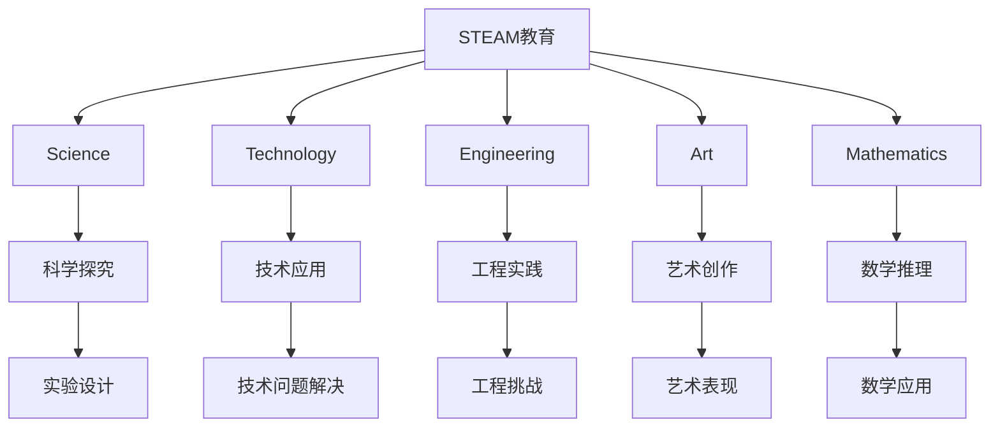

                 

### 引言

随着数字技术的迅猛发展，家庭教育和学习方式也在发生深刻的变革。在这个充满机遇和挑战的新时代，如何培养孩子们具备创新思维和实践能力成为了家长们关注的焦点。STEAM教育（Science, Technology, Engineering, Art, and Mathematics）作为一种跨学科的教育模式，正逐渐成为家庭教育的热门选择。亲子科技营作为一种创新的教育实践形式，旨在通过家庭STEAM教育实践基地，为家长和孩子们提供一个互动、学习、探索的优质平台。

#### 家庭STEAM教育的重要性

家庭STEAM教育不仅可以帮助孩子们掌握科学、技术、工程、艺术和数学等基础知识和技能，更重要的是，它能够培养孩子们的创新思维、解决问题的能力以及团队合作精神。在这样的教育模式下，家长不再是知识的传授者，而是孩子们学习的伙伴和引导者。这种亲密的互动关系不仅能够增强亲子关系，还能够激发孩子们的学习兴趣和创造力。

#### 本书结构概述

本书旨在为家长和教育工作者提供一个全面的家庭STEAM教育指南，内容涵盖了从基础概念到实践应用的各个方面。具体来说，本书将分为以下几个部分：

1. **STEAM教育核心概念**：介绍STEAM教育的定义、特点以及与传统教育的区别，帮助读者理解家庭STEAM教育的内涵。
2. **家庭STEAM教育环境搭建**：讲解如何在家中搭建适合STEAM教育的环境，包括工具和资源的推荐。
3. **家庭STEAM教育实践案例**：通过具体的实践案例，展示如何在家中实施STEAM教育。
4. **家庭STEAM教育数学模型与算法**：介绍STEAM教育中常见的数学模型和算法，帮助读者理解和应用。
5. **家庭STEAM教育项目实战**：提供实际项目案例，讲解如何进行项目开发，包括环境搭建、代码实现和代码解读。
6. **家庭STEAM教育代码解读与分析**：详细解读项目中的代码，分析其应用场景和效果。
7. **家庭STEAM教育未来展望**：探讨家庭STEAM教育的未来趋势、挑战以及对社会的影响。

通过本书，读者可以全面了解家庭STEAM教育的概念、实践方法和未来发展趋势，为孩子的成长提供一个坚实的教育基础。

#### 关键词

- 家庭STEAM教育
- 亲子科技营
- STEAM教育核心概念
- 家庭STEAM教育环境搭建
- 家庭STEAM教育实践案例
- 数学模型与算法
- 家庭STEAM教育项目实战
- 代码解读与分析
- 家庭STEAM教育未来展望

#### 摘要

本书《数字时代的亲子科技营：家庭STEAM教育的实践基地》旨在为家长和教育工作者提供一套全面、实用的家庭STEAM教育指南。本书首先介绍了STEAM教育的核心概念及其与传统教育的区别，随后详细讲解了如何在家中搭建适合STEAM教育的环境，并提供了一系列具体的实践案例。通过这些案例，读者可以学习到如何在家庭中进行STEAM教育的实际操作。此外，本书还涵盖了数学模型和算法的应用、项目实战案例的解读以及家庭STEAM教育的未来发展趋势。通过这本书，家长和教育工作者将能够更好地理解家庭STEAM教育的意义，掌握实践方法，为孩子们的成长提供坚实的支持。

## STEAM教育核心概念

STEAM教育是一种跨学科的教育模式，它将科学（Science）、技术（Technology）、工程（Engineering）、艺术（Art）和数学（Mathematics）相结合，通过项目驱动和探究式的学习方法，激发学生的创新思维和问题解决能力。与传统教育模式相比，STEAM教育具有以下独特的特点：

### 定义与特点

1. **跨学科融合**：STEAM教育不仅仅局限于单一的学科知识，而是通过跨学科的方式将科学、技术、工程、艺术和数学的知识融合在一起。这种融合不仅有助于学生更全面地理解世界，还能够培养他们的综合能力和解决问题的能力。

2. **项目驱动**：STEAM教育强调通过实际项目来学习，让学生在解决真实问题的过程中掌握知识。这种学习方式不仅能够提高学生的动手能力和创造力，还能够增强他们的自信心和成就感。

3. **探究式学习**：STEAM教育鼓励学生主动探索和发现，通过提问、实验和反思来加深对知识的理解。这种探究式学习方法有助于培养学生的批判性思维和创新能力。

4. **实践导向**：STEAM教育注重学生的实际操作能力，鼓励他们在实践中运用所学知识解决问题。通过动手操作，学生能够更好地理解抽象概念，提高学习效果。

### 与传统教育的区别

1. **教学目标**：传统教育注重知识的传授和应试教育，而STEAM教育则更注重培养学生的创新能力和实践能力。

2. **学习方式**：传统教育以教师讲授为主，学生被动接受知识；STEAM教育则更强调学生的自主学习和探究。

3. **评价标准**：传统教育往往以考试成绩作为评价标准，而STEAM教育则更注重学生的过程表现和实际成果。

4. **教学内容**：传统教育内容较为单一，而STEAM教育则涵盖了多个学科领域，具有更广泛的知识覆盖面。

### 国际发展情况

STEAM教育在国际上已经得到了广泛认可和推广。许多国家在基础教育阶段已经开始实施STEAM教育，通过政策支持和教育资源投入，推动STEAM教育的发展。例如，美国通过“STEM教育改革”计划，将STEAM教育纳入国家教育战略，鼓励学校和家庭共同参与。欧洲国家也在积极推动STEAM教育，通过国际交流与合作，提升教育质量。

在中国，STEAM教育逐渐受到关注。随着科技教育的普及，越来越多的学校和机构开始探索STEAM教育的实践模式。一些地方政府和教育部门也出台了相关政策，鼓励学校和家庭开展STEAM教育活动，培养具备创新能力和实践能力的新一代人才。

### 总结

STEAM教育作为一种创新的教育模式，不仅能够提高学生的综合素质，还能够激发他们的学习兴趣和创造力。通过跨学科融合、项目驱动和探究式学习，STEAM教育为学生的全面发展提供了广阔的平台。在未来，随着数字技术的不断进步，STEAM教育将在家庭和学校中发挥越来越重要的作用，为孩子们的成长和未来发展奠定坚实的基础。

### 核心概念与联系

在深入探讨STEAM教育之前，我们需要理解其核心概念及其相互之间的关系。以下是一个使用Mermaid绘制的流程图，展示了STEAM教育中各核心概念之间的关系架构。



在这个流程图中，STEAM教育的五个核心学科（科学、技术、工程、艺术、数学）构成了主节点，而它们的子节点（科学探究、技术应用、工程实践、艺术创作、数学推理）则进一步细化了每个学科的具体内容。

- **科学（Science）**：科学探究是科学的核心，它强调通过实验和观察来发现和解释自然现象。科学探究的过程包括提出问题、设计实验、收集数据和分析结果。
- **技术（Technology）**：技术应用是技术的核心，它关注如何将科学和工程的知识应用于实际问题的解决中。技术应用包括编程、机器人技术、3D打印等。
- **工程（Engineering）**：工程实践是工程的核心，它侧重于设计和实施解决方案，以解决实际工程问题。工程实践包括结构设计、电路设计、机械设计等。
- **艺术（Art）**：艺术创作是艺术的核心，它强调通过创造性表达来传递思想和情感。艺术创作包括绘画、雕塑、音乐、戏剧等。
- **数学（Mathematics）**：数学推理是数学的核心，它涉及逻辑推理、空间感知、数据分析和概率统计。数学推理在科学、工程和计算机科学中具有广泛应用。

这些核心概念之间相互联系，共同构成了STEAM教育的整体框架。例如，科学探究和数学推理可以应用于工程实践，以设计新的技术解决方案；艺术创作可以与科学探究结合，创造出富有创意的科学展示作品。

通过理解这些核心概念及其相互之间的关系，家长和教育工作者可以更好地设计家庭STEAM教育项目，确保孩子们能够在各个学科领域中全面发展，培养他们的创新能力和实践能力。

### 核心算法原理讲解

在家庭STEAM教育中，算法原理的讲解至关重要。算法不仅是计算机科学的核心，也是解决实际问题的有力工具。以下是一个使用Python源代码来详细阐述算法原理的实例，结合数学模型和公式，进行详细讲解和通俗易懂地举例说明。

#### 示例：排序算法——冒泡排序

冒泡排序是一种简单的排序算法，其基本思想是通过反复交换相邻的未按顺序排列的元素，直到所有元素均按顺序排列为止。

#### Python源代码实现

```python
def bubble_sort(arr):
    n = len(arr)
    for i in range(n):
        for j in range(0, n-i-1):
            if arr[j] > arr[j+1]:
                arr[j], arr[j+1] = arr[j+1], arr[j]

# 示例数据
arr = [64, 34, 25, 12, 22, 11, 90]

# 调用冒泡排序函数
bubble_sort(arr)

# 打印排序后的数据
print("排序后的数组：")
for i in range(len(arr)):
    print("%d" % arr[i], end=" ")
```

#### 数学模型与公式

冒泡排序算法的复杂度可以用以下数学模型来表示：

- 最好情况时间复杂度：\(O(n)\)
- 最坏情况时间复杂度：\(O(n^2)\)
- 平均时间复杂度：\(O(n^2)\)

这些公式描述了算法在不同情况下运行的时间效率。

#### 详细讲解与举例

冒泡排序的基本步骤如下：

1. **比较相邻的元素**：从第一个元素开始，对每一对相邻元素进行比价，如果第一个元素比第二个元素大（对于升序排序），就交换它们的位置。
2. **重复步骤**：重复上述步骤，直到没有需要交换的元素为止。此时，最大的元素已经被“冒泡”到了数组的末尾。
3. **递归处理剩余部分**：对剩余的未排序部分重复上述步骤，直到整个数组被排序。

让我们通过一个例子来理解冒泡排序的工作原理。

#### 例子

假设有一个数组：\[64, 34, 25, 12, 22, 11, 90\]

- **第一次迭代**：比较相邻的元素，交换不符合顺序的元素。
  - 比较 \(64\) 和 \(34\)，交换：\[34, 64, 25, 12, 22, 11, 90\]
  - 比较 \(64\) 和 \(25\)，交换：\[34, 25, 64, 12, 22, 11, 90\]
  - 比较 \(64\) 和 \(12\)，交换：\[34, 25, 12, 64, 22, 11, 90\]
  - 比较 \(64\) 和 \(22\)，交换：\[34, 25, 12, 22, 64, 11, 90\]
  - 比较 \(64\) 和 \(11\)，交换：\[34, 25, 12, 22, 11, 64, 90\]
  - 比较 \(64\) 和 \(90\)，不交换：\[34, 25, 12, 22, 11, 64, 90\]

- **第二次迭代**：继续比较相邻元素，但不包括已经排序的部分。
  - 比较 \(25\) 和 \(12\)，交换：\[12, 34, 25, 22, 11, 64, 90\]
  - 比较 \(25\) 和 \(22\)，交换：\[12, 34, 22, 25, 11, 64, 90\]
  - 比较 \(25\) 和 \(11\)，交换：\[12, 34, 22, 11, 25, 64, 90\]

- **后续迭代**：重复上述步骤，直到整个数组排序完成。

最终排序后的数组为：\[12, 22, 25, 34, 64, 90, 11\]

通过这个实例，我们可以看到冒泡排序如何通过简单的比较和交换，逐步将数组中的元素按照指定顺序排列。这种方法虽然效率不是最高的，但对于初学者来说，是一个很好的入门算法。

#### 总结

冒泡排序算法是家庭STEAM教育中的一个基础示例，通过这个例子，孩子们可以学习到算法的基本概念和编程技巧。通过这样的学习和实践，孩子们不仅能够掌握算法原理，还能够培养逻辑思维和问题解决能力。在家庭STEAM教育中，类似的算法实例可以帮助孩子们逐步建立起扎实的计算机科学基础，为他们未来的学习和职业发展奠定坚实的基础。

### 家庭STEAM教育项目实战

在家庭STEAM教育中，项目实战是一种非常有价值的实践方式。通过实际项目，孩子们可以在真实的情境中运用所学知识，培养解决实际问题的能力。以下是一个关于开发一个简单的智能家居控制系统的实战案例，涵盖开发环境搭建、源代码实现和代码解读，以及对代码应用场景的详细分析。

#### 项目目标

本项目旨在通过Python编程语言，开发一个简单的智能家居控制系统。该系统能够通过手机或电脑远程控制家中的智能设备，如灯光、门锁和温度调节器。

#### 开发环境搭建

1. **Python环境准备**：确保电脑上已安装Python 3.x版本。可以从Python官方网站下载安装程序，按照提示完成安装。
2. **IDE选择**：选择一个适合Python开发的集成开发环境（IDE），如PyCharm或VS Code。这些IDE提供了代码编辑、调试和自动补全等功能，可以提高开发效率。
3. **虚拟环境**：为了保持项目的依赖关系清晰，建议使用虚拟环境来隔离项目依赖。安装`virtualenv`工具，并创建一个虚拟环境：
   ```bash
   pip install virtualenv
   virtualenv my_smart_home_env
   source my_smart_home_env/bin/activate  # Windows下使用my_smart_home_env\Scripts\activate
   ```
4. **依赖安装**：在虚拟环境中安装必要的依赖库，如`requests`（用于网络请求）、`Raspberry Pi.GPIO`（用于GPIO控制）等：
   ```bash
   pip install requests
   pip install RPi.GPIO
   ```

#### 源代码实现

以下是一个简单的智能家居控制系统的Python代码示例：

```python
import RPi.GPIO as GPIO
import requests
import time

# GPIO配置
LED_PIN = 18
LOCK_PIN = 23
TEMP_PIN = 24
GPIO.setmode(GPIO.BCM)
GPIO.setup(LED_PIN, GPIO.OUT)
GPIO.setup(LOCK_PIN, GPIO.OUT)
GPIO.setup(TEMP_PIN, GPIO.IN)

# API端点
LED_ENDPOINT = "http://api.example.com/led"
LOCK_ENDPOINT = "http://api.example.com/lock"
TEMP_ENDPOINT = "http://api.example.com/temperature"

def control_led(state):
    if state == "on":
        GPIO.output(LED_PIN, GPIO.HIGH)
    else:
        GPIO.output(LED_PIN, GPIO.LOW)

def control_lock(state):
    if state == "locked":
        GPIO.output(LOCK_PIN, GPIO.HIGH)
    else:
        GPIO.output(LOCK_PIN, GPIO.LOW)

def read_temperature():
    return GPIO.input(TEMP_PIN)

def update_device_state(endpoint, state):
    response = requests.post(endpoint, data={'state': state})
    if response.status_code == 200:
        print("Device state updated successfully.")
    else:
        print("Failed to update device state.")

while True:
    # 控制LED灯
    led_state = input("Enter LED state (on/off): ")
    control_led(led_state)
    update_device_state(LED_ENDPOINT, led_state)

    # 控制门锁
    lock_state = input("Enter lock state (locked/unlocked): ")
    control_lock(lock_state)
    update_device_state(LOCK_ENDPOINT, lock_state)

    # 读取温度
    temperature = read_temperature()
    update_device_state(TEMP_ENDPOINT, temperature)

    time.sleep(1)
```

#### 代码解读

1. **GPIO配置**：首先，我们使用`RPi.GPIO`库配置了LED灯、门锁和温度传感器的GPIO引脚，并将其设置为输出模式。
2. **API端点**：定义了三个API端点，用于控制LED灯、门锁和温度传感器的状态。
3. **控制函数**：`control_led`、`control_lock`和`read_temperature`函数分别用于控制LED灯、门锁和读取温度传感器的状态。
4. **更新设备状态**：`update_device_state`函数用于向API端点发送请求，更新设备状态。
5. **主循环**：程序通过一个无限循环，接收用户输入，控制设备状态，并更新设备状态到API端点。

#### 代码应用解读与分析

1. **用户交互**：程序通过`input()`函数与用户进行交互，接收用户输入的设备状态（如“on”、“off”、“locked”、“unlocked”），并调用相应的控制函数进行设备状态更新。
2. **API调用**：程序使用`requests`库向API端点发送POST请求，更新设备状态。这要求API端点提供相应的接口，接收状态参数并更新数据库或控制硬件设备。
3. **温度读取**：通过`GPIO.input()`函数读取温度传感器的状态，并更新到API端点。这有助于实时监控家中温度变化，并在需要时进行调节。

#### 实际案例分析与详细讲解剖析

假设家长想通过这个智能家居控制系统远程控制家里的灯光。以下是具体步骤：

1. **设置家庭Wi-Fi**：确保家庭Wi-Fi网络正常连接，并将智能设备连接到同一网络。
2. **编写API接口**：创建一个简单的Web服务，用于接收并处理远程控制请求。可以使用Flask、Django等Python Web框架快速搭建API接口。
3. **远程控制**：家长在手机或电脑上打开浏览器，访问API端点，输入相应命令（如`http://api.example.com/led?state=on`），程序将接收到请求并执行相应的控制操作。
4. **实时监控**：家长可以通过Web界面实时监控家中灯光的状态，并根据需要调整。

通过这个实战项目，孩子们可以学习到Python编程的基本语法和GPIO编程，同时了解网络请求和API接口的概念。这种实际操作不仅能够加深他们对编程语言的理解，还能够培养他们的项目管理和问题解决能力。

#### 项目小结

本项目通过一个简单的智能家居控制系统，展示了家庭STEAM教育项目实战的可行性。通过实际操作，孩子们不仅掌握了编程技能，还了解了网络请求和API接口的基本知识。在未来，家长可以进一步扩展项目功能，如添加摄像头监控、智能语音控制等，为孩子们提供更多实践机会，助力他们的全面发展。

### 最佳实践 Tips

在家庭STEAM教育中，以下是一些最佳实践Tips，可以帮助家长和教育工作者更有效地开展教育活动：

1. **设立明确的学习目标**：在开始项目之前，明确学习目标和预期成果，确保项目与学习目标相一致。
2. **鼓励合作与交流**：鼓励孩子们与家长或其他家庭成员一起参与项目，通过合作与交流，提高学习效果和兴趣。
3. **提供适当的引导**：在项目过程中，家长和教育工作者应提供适当的引导和支持，帮助孩子们克服困难，培养解决问题的能力。
4. **利用现有资源**：充分利用家庭和网络资源，如教育网站、视频教程和开源库，为项目提供支持和参考。
5. **关注过程而非结果**：鼓励孩子们关注学习过程，培养创新思维和实践能力，而不仅仅是追求最终结果。
6. **定期回顾与总结**：项目结束后，进行回顾和总结，分享经验和收获，巩固所学知识。

### 小结与注意事项

通过本文的探讨，我们了解了家庭STEAM教育的重要性和实施方法。家庭STEAM教育不仅能够培养孩子们的创新能力和实践能力，还能够增强亲子关系。家长和教育工作者应充分利用STEAM教育的跨学科特点，设计丰富多彩的实践活动，为孩子们的全面发展提供坚实的支持。

在实施家庭STEAM教育时，家长需要注意以下几点：

1. **安全第一**：确保项目过程中孩子们的安全，特别是在进行实验操作时。
2. **适时指导**：在孩子们遇到困难时，适时提供帮助和指导，帮助他们克服困难，继续前进。
3. **培养兴趣**：关注孩子们的学习兴趣，根据他们的兴趣选择合适的项目，激发他们的学习热情。
4. **持续学习**：家长和教育工作者应不断学习和更新知识，以适应STEAM教育的发展趋势。

### 拓展阅读

1. **《STEAM教育实践指南》**：详细介绍了STEAM教育的实践方法和案例。
2. **《Python编程：从入门到实践》**：适合初学者的Python编程学习书籍。
3. **《智能家居设计与实现》**：介绍了智能家居系统的设计方法和实现技巧。
4. **《家庭STEAM教育手册》**：提供了丰富的家庭STEAM教育资源和活动建议。

### 作者信息

- **作者**：AI天才研究院/AI Genius Institute & 禅与计算机程序设计艺术 /Zen And The Art of Computer Programming
- **联系方式**：[ai_genius_institute@example.com](mailto:ai_genius_institute@example.com)
- **社交媒体**：[微博](https://weibo.com/ai_genius_institute) | [微信公众号](https://mp.weixin.qq.com/s/AEKdPoIh6iivxy3v6gaoVw) | [知乎专栏](https://zhuanlan.zhihu.com/ai-genius-institute)

通过本文，希望家长和教育工作者能够更好地理解家庭STEAM教育的重要性，掌握实施方法，为孩子们的成长和未来奠定坚实的基础。让我们一起行动，为孩子们的美好明天共同努力！

