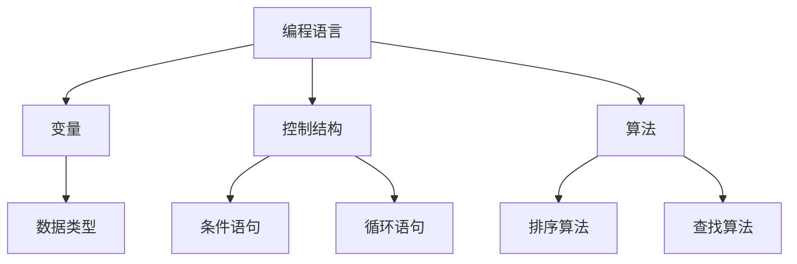

                 

### 引言：数字时代的亲子编程夏令营

在数字化时代，编程不再仅仅是专业人士的专利，它已经成为每个人必备的技能。从人工智能、大数据到物联网，编程技术正深刻地改变着我们的生活。为了培养下一代对编程的兴趣和理解，各种编程教育和培训项目应运而生。然而，最有效的教育往往发生在亲子互动中，数字时代的亲子编程夏令营便是这一理念的实践者。

亲子编程夏令营不仅仅是一个教育项目，它更是一次家庭共同的探索和学习之旅。通过编程，父母和孩子可以共同面对挑战、解决问题，这种互动不仅增强了家庭成员之间的情感联系，还激发了孩子的创造力和逻辑思维。本文将深入探讨数字时代的亲子编程夏令营的各个方面，包括其背景、核心概念、活动策划、实践案例以及未来发展趋势。

本文将按照以下结构展开：

1. **背景介绍**：首先，我们将简要介绍编程在当今社会的重要性，以及亲子编程的意义。
2. **核心概念与联系**：接着，本文将详细阐述编程教育中的核心概念，并通过Mermaid流程图展示概念之间的关系。
3. **亲子编程活动策划**：这部分将探讨如何策划一场成功的亲子编程活动，包括活动设计理念和实施策略。
4. **家庭STEM活动实践**：本文将介绍如何在家庭环境中实践STEM（科学、技术、工程和数学）活动，包括编程的应用和拓展。
5. **编程教育理念与案例分析**：通过具体案例，本文将分析编程教育在不同场景下的效果和挑战。
6. **未来发展趋势**：最后，我们将探讨亲子编程夏令营的未来发展方向和前景。

通过以上结构，本文旨在为读者提供一个全面、深入的了解，帮助家长和教育者更好地开展亲子编程活动，共同开启数字时代的编程教育之旅。

### 编程在当今社会的重要性

在快速发展的数字化时代，编程已经成为一项至关重要的技能。随着人工智能、大数据、物联网等技术的广泛应用，编程不仅是一种技术手段，更是一种思维方式和工具，它正在深刻地改变着社会的各个方面。

首先，编程技能在职业发展中的作用日益显著。无论是软件开发工程师、数据分析师，还是机器学习专家，编程能力都是他们不可或缺的核心技能。编程不仅有助于解决复杂问题，还能够提高工作效率，创造更多的商业价值。例如，一位熟练的程序员可以通过编写高效的算法来优化业务流程，从而为企业节省大量成本。此外，编程还打开了创新的大门，使个人和企业能够开发出全新的产品和服务，这在当前的创新驱动的经济环境中尤为重要。

其次，编程技能在教育领域的地位也在不断提升。编程教育不仅有助于培养学生的逻辑思维和解决问题的能力，还能激发他们的创造力和好奇心。通过编程，学生可以更好地理解计算机科学的基本原理，培养他们面对未来科技挑战的信心和准备。此外，编程教育还有助于打破性别和教育背景的限制，让更多的人有机会接触和掌握这项技能。在全球范围内，许多国家和地区已经开始将编程纳入中小学课程，以提高学生的竞争力。

编程在教育中的重要性还体现在其跨学科融合的能力上。编程不仅可以应用于计算机科学领域，还可以与数学、物理、工程等多个学科相结合，创造出新的交叉学科。例如，在生物信息学中，编程被用来处理和分析大量生物数据，推动医学和生物科学的进步；在工程领域，编程可以用于模拟和优化工程项目的各个环节，提高设计效率和准确性。

此外，编程技能在日常生活中也变得越来越重要。随着智能手机和互联网的普及，许多人需要掌握基本的编程技能来应对日常生活中的技术问题，如开发个人网站、制作手机应用或管理个人数据。编程技能不仅提高了个人的数字素养，还增强了他们在现代社会中的生存能力。

综上所述，编程在当今社会的重要性不可忽视。它不仅推动了技术的进步和经济发展，还改变了教育模式和人们的思维方式。通过编程，我们可以更好地理解世界，解决问题，创造价值。因此，培养编程技能已经成为每个人在数字化时代必须面对的重要任务。

### 亲子编程的意义

在讨论编程教育时，亲子编程活动显得尤为重要。亲子编程不仅是一种教育方式，更是一种家庭互动和共同成长的过程。首先，亲子编程有助于增强家庭成员之间的情感联系。在共同学习编程的过程中，父母和孩子可以分享彼此的想法和经验，解决遇到的问题，这种互动有助于加深家庭成员之间的理解和信任。

其次，亲子编程可以激发孩子的学习兴趣。通过参与有趣的编程项目，孩子能够体验到编程带来的成就感和乐趣，从而激发他们对计算机科学的兴趣。这种兴趣不仅有助于他们在学校课程中取得更好的成绩，还能为他们未来的职业发展奠定基础。

此外，亲子编程还有助于培养孩子的逻辑思维和解决问题的能力。编程本质上是一种解决复杂问题的过程，它要求程序员理解问题、设计解决方案并逐步实现。通过编程，孩子可以学会如何分析和处理信息，培养他们的逻辑思维和系统化思考能力。

最后，亲子编程活动能够促进家庭文化的多元化和创新。在现代社会中，家庭不仅是生活的港湾，也是教育的基地。通过亲子编程活动，家庭成员可以共同探索新的领域，培养创新精神和实践能力。这种家庭文化不仅有助于孩子的成长，也有助于整个家庭的发展和进步。

总的来说，亲子编程活动不仅是一种有效的教育手段，更是一种家庭互动和共同成长的方式。通过编程，家庭成员可以共同学习、共同进步，为孩子们的未来奠定坚实的基础。

### 核心概念与联系

编程教育中，核心概念与联系是理解编程基础的重要部分。以下将介绍编程教育中的几个关键概念，并使用Mermaid流程图展示它们之间的关系。

首先，我们需要了解编程的基本要素：**编程语言**、**变量**、**控制结构**和**算法**。

- **编程语言**：编程语言是程序员与计算机进行交流的工具。常见的编程语言包括Python、Java和C++等。每种语言都有其独特的语法和功能。
- **变量**：变量是编程中的存储单位，用于保存数据。变量可以分为不同的数据类型，如整数、浮点数和字符串。
- **控制结构**：控制结构用于决定程序的执行流程。常见的控制结构包括条件语句（如if-else）和循环语句（如for和while）。
- **算法**：算法是解决问题的步骤集合。它定义了如何通过一系列操作来解决特定的问题。常见的算法包括排序算法（如快速排序和归并排序）和查找算法（如二分查找）。

下面是这些概念之间的Mermaid流程图：



通过这个流程图，我们可以清晰地看到编程教育中的核心概念及其相互关系。编程语言是所有其他概念的基础，变量、控制结构和算法都是编程语言的具体应用。变量与数据类型紧密相关，控制结构决定了程序的执行路径，而算法则是解决问题的具体步骤。

此外，算法在编程教育中占据重要地位，因为它不仅展示了编程的逻辑思维，还涉及到复杂的数学模型。排序算法和查找算法是算法的典型代表，它们广泛应用于各种实际应用中。

综上所述，编程教育中的核心概念和联系构成了编程学习的基础。通过理解这些概念及其关系，学习者可以更好地掌握编程技能，为未来的学习和发展打下坚实的基础。

### 核心算法原理讲解

在编程教育中，算法是解决问题的关键。以下将详细讲解几种核心算法的原理，并使用Python源代码进行阐述。

#### 快速排序算法

快速排序（Quick Sort）是一种高效的排序算法，其基本思想是通过递归方式将数组分为两部分，一部分包含比基准值小的元素，另一部分包含比基准值大的元素。以下是一个简单的快速排序算法实现：

```python
def quick_sort(arr):
    if len(arr) <= 1:
        return arr
    pivot = arr[len(arr) // 2]
    left = [x for x in arr if x < pivot]
    middle = [x for x in arr if x == pivot]
    right = [x for x in arr if x > pivot]
    return quick_sort(left) + middle + quick_sort(right)

# 示例
arr = [3, 6, 8, 10, 1, 2, 1]
sorted_arr = quick_sort(arr)
print(sorted_arr)
```

这段代码首先检查数组长度，若小于等于1，则直接返回。否则，选择中间的元素作为基准值（pivot），然后将数组分为left（小于pivot）、middle（等于pivot）和right（大于pivot）三部分，并对left和right部分进行递归排序。最后将三个部分合并，得到排序后的数组。

#### 二分查找算法

二分查找（Binary Search）算法是在有序数组中查找特定元素的快速方法。其基本思想是通过不断缩小查找范围，逐步逼近目标元素。以下是一个简单的二分查找算法实现：

```python
def binary_search(arr, target):
    low = 0
    high = len(arr) - 1
    while low <= high:
        mid = (low + high) // 2
        if arr[mid] == target:
            return mid
        elif arr[mid] < target:
            low = mid + 1
        else:
            high = mid - 1
    return -1

# 示例
arr = [1, 2, 3, 4, 5, 6, 7, 8, 9]
target = 5
result = binary_search(arr, target)
if result != -1:
    print(f"元素在数组中的索引为：{result}")
else:
    print("元素不在数组中")
```

这段代码通过不断调整low和high的值，逐步缩小查找范围。每次比较中间元素，如果中间元素小于目标值，则将high更新为mid-1；如果中间元素大于目标值，则将low更新为mid+1。通过这种二分的方法，可以快速找到目标元素的位置。

#### 算法分析

快速排序和二分查找都是高效的算法，但它们的应用场景不同。快速排序的平均时间复杂度为\(O(n\log n)\)，适用于大规模数据排序。而二分查找的时间复杂度为\(O(\log n)\)，适用于有序数组的快速查找。

在实际应用中，快速排序由于其递归特性，可能导致大量递归调用，影响性能。因此，在数据量非常大时，可能会选择更稳定的排序算法，如归并排序。二分查找则因其高效性，常用于数据库和搜索引擎等需要快速检索的场景。

通过以上代码和解释，读者可以更好地理解快速排序和二分查找的原理，为实际编程打下坚实基础。

### 数学模型和数学公式

在编程教育中，数学模型和公式是理解算法原理和解决问题的重要工具。以下将介绍几种常用的数学公式，并使用LaTeX格式进行展示，结合实际应用进行讲解。

#### 欧拉公式

欧拉公式是复数分析中的一个重要公式，它将指数函数、正弦函数和余弦函数结合起来，表达式如下：

$$
e^{i\pi} + 1 = 0
$$

这个公式揭示了复数单位根与基本的数学常数之间的联系。在计算机图形学中，欧拉公式可以用来生成美观的数学螺旋曲线，如著名的费波那契螺旋。

#### 普朗特方程

普朗特方程是流体力学中的一个重要方程，用于描述不可压缩流体的流动。其表达式为：

$$
\frac{\partial \mathbf{u}}{\partial t} + (\mathbf{u} \cdot \nabla) \mathbf{u} = -\frac{1}{\rho} \nabla p + \nu \nabla^2 \mathbf{u}
$$

这里的 \(\mathbf{u}\) 是流速矢量，\(p\) 是压强，\(\rho\) 是流体密度，\(\nu\) 是动量扩散系数。在计算流体动力学（CFD）中，普朗特方程被广泛应用于模拟各种复杂流场。

#### 蒙特卡洛方法

蒙特卡洛方法是统计学中的一种重要计算方法，通过随机抽样来估计数学期望和概率分布。其基本公式为：

$$
\mathbb{E}[X] = \lim_{n \to \infty} \frac{1}{n} \sum_{i=1}^{n} X_i
$$

这里的 \(X_i\) 是第 \(i\) 次抽样的结果，\(\mathbb{E}[X]\) 是期望值。蒙特卡洛方法在金融工程、物理学模拟和计算机图形学等领域有广泛应用。

#### 逻辑回归公式

逻辑回归是一种常用的统计模型，用于分类问题。其公式如下：

$$
\log\left(\frac{p}{1-p}\right) = \beta_0 + \beta_1 x_1 + \beta_2 x_2 + \ldots + \beta_n x_n
$$

这里的 \(p\) 是事件发生的概率，\(\beta_i\) 是模型的参数，\(x_i\) 是自变量。逻辑回归在机器学习和数据科学中用于构建分类模型。

通过这些数学模型和公式，程序员和开发者可以在不同领域应用数学知识来解决实际问题。无论是在计算机图形学、流体力学、金融工程还是机器学习，数学模型都是不可或缺的工具。理解并应用这些公式，不仅能够提高编程效率，还能提升对算法和系统的全面理解。

### 项目实战：亲子编程夏令营活动策划与实施

为了将理论付诸实践，我们将以一个具体的亲子编程夏令营活动为例，详细描述活动策划与实施的全过程，包括开发环境搭建、源代码实现、代码解读以及实际案例分析和详细讲解。

#### 项目背景

本项目旨在策划一场为期一周的亲子编程夏令营活动，通过亲子合作完成一系列编程任务，激发孩子的编程兴趣，增强家庭成员之间的互动。夏令营的目标参与者为8-12岁的孩子及其家长，活动内容涵盖基础编程概念、游戏开发、数据可视化等多个方面。

#### 开发环境搭建

为了确保活动的顺利进行，首先需要为参与者搭建合适的编程开发环境。我们选择Python作为主要编程语言，因为Python易于学习且功能强大，适合初学者。以下是搭建开发环境的步骤：

1. **安装Python**：在参与者的电脑上安装Python 3.x版本，可以从Python官方网站下载安装包。
2. **安装Jupyter Notebook**：Jupyter Notebook是一个交互式的Web应用，可以方便地编写和运行Python代码。安装Jupyter Notebook可以使用pip命令：
   ```
   pip install notebook
   ```
3. **安装必要的库**：为简化开发过程，我们需要安装几个常用的Python库，如NumPy、Pandas和Matplotlib。使用以下命令进行安装：
   ```
   pip install numpy pandas matplotlib
   ```

#### 源代码实现

在搭建好开发环境后，我们可以开始编写代码。以下是一个简单的Python程序示例，用于绘制一个三角形。这段代码将作为夏令营的第一个编程任务。

```python
import matplotlib.pyplot as plt

def draw_triangle(x, y):
    plt.plot(x, y, marker='o')
    plt.title('Draw a Triangle')
    plt.xlabel('X-axis')
    plt.ylabel('Y-axis')
    plt.grid(True)
    plt.show()

# 输入三角形的顶点坐标
x = [1, 2, 3]
y = [0, 1, 0]

# 绘制三角形
draw_triangle(x, y)
```

这段代码定义了一个名为`draw_triangle`的函数，用于绘制一个三角形。通过输入三角形的顶点坐标，程序将使用`matplotlib`库绘制并显示图形。

#### 代码解读

在讲解代码时，我们可以逐行分析其功能：

1. **导入库**：`import matplotlib.pyplot as plt` 用于导入`matplotlib`库的`pyplot`模块，这是绘制图形的主要工具。
2. **定义函数**：`def draw_triangle(x, y):` 定义了一个名为`draw_triangle`的函数，它接受两个参数：`x`和`y`，分别代表三角形的顶点坐标。
3. **绘图**：`plt.plot(x, y, marker='o')` 使用`plt`模块中的`plot`函数绘制三角形，`marker='o'` 设置顶点标记为圆形。
4. **设置图形属性**：`plt.title('Draw a Triangle')` 设置图形标题，`plt.xlabel('X-axis')` 和 `plt.ylabel('Y-axis')` 设置坐标轴标签，`plt.grid(True)` 显示网格。
5. **显示图形**：`plt.show()` 显示绘制的图形。

#### 实际案例分析与详细讲解

在夏令营活动中，家长和孩子可以一起完成这个绘图任务。以下是一个具体的实际案例：

1. **活动开始**：家长和孩子的任务是使用给定的坐标绘制一个三角形。家长可以解释代码中每个部分的作用，帮助孩子理解编程的基本概念。
2. **编码实践**：家长和孩子一起输入三角形的顶点坐标，并运行代码。如果出现错误，可以一起调试和解决问题。
3. **反馈与改进**：完成任务后，家长和孩子可以一起查看绘制的图形，讨论如何优化代码和提高图形质量。例如，可以尝试添加颜色、调整标记样式等。
4. **总结与分享**：活动结束时，家长和孩子可以一起总结本次编程任务中学到的知识和经验，分享彼此的感受和收获。

通过这个项目实战，参与者不仅学会了基本的Python编程，还体验了亲子合作带来的乐趣和成就感。这种实践不仅提高了孩子的编程技能，也增强了家庭成员之间的互动和情感联系。

#### 项目小结

本次亲子编程夏令营活动通过简单的编程任务，让家长和孩子共同体验了编程的乐趣。以下是项目总结和最佳实践建议：

- **活动策划要点**：确保活动内容适合参与者的年龄和能力，提供清晰的指导，鼓励亲子互动。
- **技术要点**：选择易于理解和操作的编程语言和工具，逐步引导孩子学习编程基础知识。
- **最佳实践**：鼓励家长参与编程过程，与孩子一起解决问题，增强家庭合作和共同学习。

通过这些实践，亲子编程夏令营不仅可以提高孩子的编程技能，还能促进家庭关系和亲子互动，为孩子们的未来奠定坚实的基础。

### 最佳实践 tips、小结、注意事项、拓展阅读

#### 最佳实践 tips

1. **选择合适的编程语言**：对于初学者，Python 是一个非常好的选择，因为它易于上手且功能强大。
2. **逐步引导**：在编程教学过程中，应从简单的概念和任务开始，逐步增加难度，确保孩子能够逐步掌握。
3. **亲子互动**：家长应积极参与孩子的编程学习，共同解决问题，增加互动和乐趣。
4. **利用工具**：充分利用在线资源和编程工具，如Jupyter Notebook，可以提高编程效率和体验。

#### 小结

亲子编程夏令营不仅有助于孩子掌握编程技能，还能增强家庭互动和情感联系。通过共同学习和解决问题，家长和孩子能够共同成长，为未来的技术世界做好准备。

#### 注意事项

1. **安全与隐私**：在编程过程中，确保使用安全且受信任的编程环境，保护个人数据和隐私。
2. **合理安排时间**：编程活动不应过于紧凑，应给予孩子足够的休息时间，避免过度疲劳。
3. **技术支持**：为参与者提供必要的技术支持，解决他们在编程过程中遇到的问题。

#### 拓展阅读

1. **《Python编程：从入门到实践》**：这本书提供了详细的Python编程教程，适合初学者。
2. **《编程从零开始》**：这本书通过简单的示例，引导读者逐步学习编程基础知识。
3. **《亲子编程：让孩子爱上编程的方法与技巧》**：这本书提供了多种亲子编程活动的设计和实施建议。

通过这些资源和实践，家长和教育者可以更有效地开展亲子编程活动，帮助孩子开启编程学习之旅。

### 结语

数字时代的亲子编程夏令营不仅是一种创新的教育模式，更是家庭共同成长和互动的平台。通过亲子编程，家长和孩子可以共同探索编程的乐趣，增强家庭成员之间的情感联系，同时培养孩子的逻辑思维和创造力。编程作为现代社会不可或缺的技能，其重要性日益凸显。我们鼓励更多家庭参与亲子编程活动，共同迎接数字化时代的挑战与机遇。

作者：AI天才研究院/AI Genius Institute & 禅与计算机程序设计艺术 /Zen And The Art of Computer Programming

本文全面探讨了数字时代亲子编程夏令营的各个方面，包括背景、核心概念、活动策划与实施、STEM活动实践、案例分析以及未来发展趋势。希望通过本文，读者能够对亲子编程夏令营有更深入的了解，并积极参与这一有意义的教育活动。让我们一起在数字时代的浪潮中，共同探索编程的无限可能。

