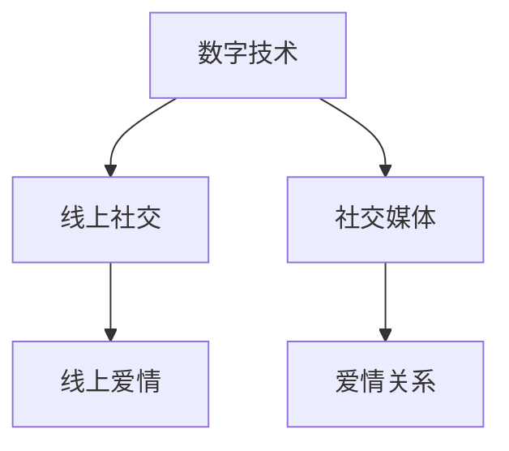
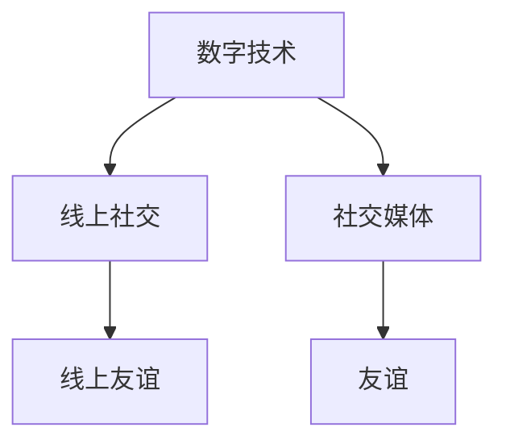
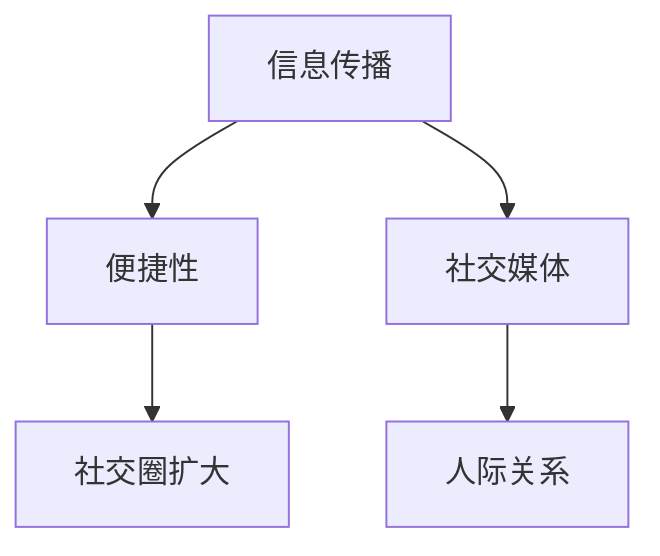
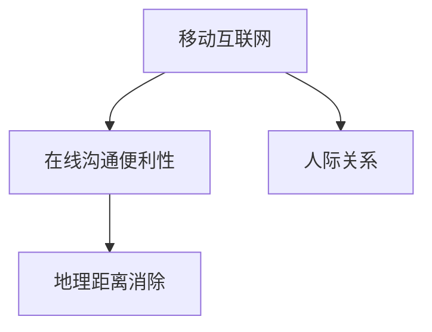
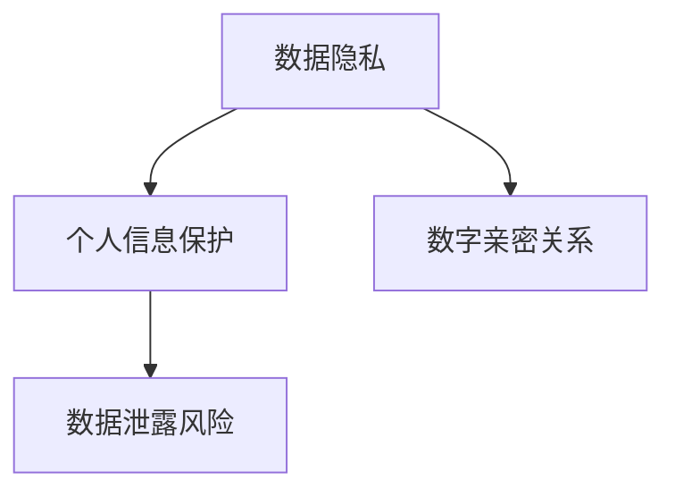

                 

## 数字时代的亲密关系：科技如何改变爱情与友谊

### 关键词
- 数字时代
- 亲密关系
- 科技
- 爱情
- 友谊
- 社交媒体
- 数据隐私
- 移动互联网

### 摘要
在数字时代，科技以不可逆转的方式改变了我们的生活方式，包括人际关系和亲密关系的构建、维持与挑战。本文将探讨科技，尤其是数字技术，如何影响爱情与友谊。通过深入分析科技在恋爱观念、恋爱关系维护、友谊建立与维系中的角色，本文旨在揭示科技对亲密关系的深远影响，并探讨其在未来可能的发展方向。

### 引言

在现代社会，科技已经渗透到我们生活的方方面面，从通讯到娱乐，从工作到学习，无处不见其身影。数字技术的飞速发展，改变了人们的交流方式、社交习惯，甚至情感体验。尤其是在人际关系和亲密关系方面，科技的影响愈发显著。从最早的固定电话到移动电话，从简单的文字通讯到多媒体交流，科技在不断地颠覆和重塑着我们的社交模式。

**数字时代的特点：**
1. **数字化生活方式的普及：** 随着互联网的普及和智能设备的广泛应用，人们的生活越来越依赖于数字化工具。
2. **即时通讯的便捷性：** 社交媒体和即时通讯应用使得人们可以随时随地与亲友保持联系。
3. **信息透明化：** 网络平台使得个人信息更加透明，同时也带来了隐私问题。

在这样的大背景下，科技不仅改变了人们的社交方式，也深刻影响了人们的亲密关系，包括爱情与友谊。本文将围绕这一主题，探讨科技在爱情与友谊中的角色，分析其带来的利弊，并提出可能的未来展望。

### 爱情与数字技术

爱情是人类最基本、最复杂的情感之一，它承载着人类的希望、梦想和幸福感。在数字时代，科技对爱情的观念和关系产生了深远的影响。

#### 核心概念与联系

1. **线上爱情的兴起：** 数字技术使得线上社交变得更加便捷，人们可以通过网络结识新人，开展虚拟恋爱。这种现象被称为“线上爱情”。
2. **社交媒体与爱情关系：** 社交媒体如Facebook、Instagram等平台，不仅成为人们展示个人生活的场所，也成为寻找爱情的新渠道。

**Mermaid流程图：**



#### 数字技术对爱情的影响

1. **恋爱观念的变革：** 数字技术改变了人们的恋爱观念。传统的恋爱观念强调面对面交流，而线上爱情则强调虚拟交流。
2. **爱情关系的维持与破裂：** 数字技术为爱情关系的维持提供了新的方式，如异地恋、虚拟约会等。但同时，它也可能导致爱情关系的破裂，如网络欺骗、情感疏离等。

**Python源代码讲解：**

```python
# 示例：使用Python代码模拟线上爱情与面对面爱情的对比

def face_to_face_love():
    # 面对面爱情模型
    print("两个人在现实世界中相遇、相识、相爱。")
    print("优点：真实、深刻；缺点：受地理限制。")

def online_love():
    # 线上爱情模型
    print("两个人通过网络相识、相知、相爱。")
    print("优点：便捷、无地理限制；缺点：虚拟、容易疏离。")

# 模拟面对面爱情
face_to_face_love()

# 模拟线上爱情
online_love()
```

**数学模型和公式：**

- 恋爱满意度 = (现实交流时间 × 交流深度) / (虚拟交流时间 × 交流深度)

这个公式表明，恋爱的满意度与实际交流的时间和深度成正比，与虚拟交流的时间和深度成反比。

#### 社交媒体与爱情

社交媒体平台如Facebook、Instagram等，不仅为人们提供了展示自我的平台，也成为寻找爱情的新渠道。通过社交媒体，人们可以更广泛地展示自己的生活方式、兴趣爱好，从而吸引潜在的伴侣。

**Python源代码示例：**

```python
# 示例：使用Python模拟社交媒体对爱情的影响

def social_media_love():
    print("通过社交媒体展示自己，吸引潜在的伴侣。")
    print("优点：增加可见性、扩大社交圈；缺点：可能导致虚假信息的传播。")

# 模拟社交媒体对爱情的影响
social_media_love()
```

通过这些源代码示例，我们可以更直观地理解数字技术对爱情的影响。虽然线上爱情和社交媒体为爱情提供了新的途径，但同时也带来了新的挑战。理解这些影响，有助于我们更好地把握数字时代的爱情。

### 友谊与数字技术

友谊是人际关系中的重要组成部分，它不仅仅是一种情感，更是一种社会支持。在数字时代，科技对友谊的影响同样不可忽视。

#### 核心概念与联系

1. **线上友谊的建立：** 数字技术使得人们可以跨越地理界限，建立新的友谊。例如，通过社交网络平台，人们可以与世界各地的人交流。
2. **社交媒体与友谊：** 社交媒体平台如Facebook、微信等，不仅成为人们日常交流的工具，也成为建立和维护友谊的重要手段。

**Mermaid流程图：**



#### 数字技术对友谊的影响

1. **友谊的建立与维系：** 数字技术使得人们可以轻松地建立新的友谊，同时也能更方便地维系现有的友谊。例如，通过社交媒体，人们可以随时分享生活点滴，增进彼此的了解。
2. **友谊的挑战：** 然而，数字技术也带来了一些挑战。例如，虚拟交流可能导致情感疏离，线上友谊可能缺乏深度的互动。

**Python源代码讲解：**

```python
# 示例：使用Python模拟线上友谊的建立与维系

def online_friendship():
    print("通过网络平台结识新朋友，分享生活点滴。")
    print("优点：便捷、无地理限制；缺点：可能缺乏深度的面对面交流。")

# 模拟线上友谊
online_friendship()
```

#### 社交媒体与友谊

社交媒体平台如Facebook、微信等，不仅为人们提供了交流的工具，也为友谊的建立和维系提供了新的方式。通过社交媒体，人们可以更方便地分享生活，从而增进彼此的了解。

**Python源代码示例：**

```python
# 示例：使用Python模拟社交媒体对友谊的影响

def social_media_friendship():
    print("通过社交媒体平台分享生活，增进彼此了解。")
    print("优点：增加交流频率、增强互动性；缺点：可能过度依赖虚拟交流。")

# 模拟社交媒体对友谊的影响
social_media_friendship()
```

通过这些源代码示例，我们可以更直观地理解数字技术对友谊的影响。虽然线上友谊和社交媒体为友谊提供了新的便利，但同时也需要注意其潜在的挑战。理解这些影响，有助于我们更好地把握数字时代的友谊。

### 社交媒体与人际关系

社交媒体在数字时代扮演着至关重要的角色，它不仅改变了人们的社交方式，也对人际关系产生了深远的影响。在这一节中，我们将探讨社交媒体的优势和挑战，以及它如何影响人际关系。

#### 核心概念与联系

1. **信息传播的便捷性：** 社交媒体使得信息传播变得前所未有的快速和便捷。用户可以随时随地分享信息、观点和体验，这使得信息传播的速度和覆盖范围大大增加。
2. **社交圈的扩大：** 社交媒体使得人们可以轻松地与更多的人建立联系，从而扩大社交圈。用户可以通过点赞、评论、分享等方式与他人互动，这使得社交互动变得更加丰富和多样化。

**Mermaid流程图：**



#### 社交媒体的优势

1. **信息传播的便捷性：** 社交媒体平台如Facebook、Twitter、Instagram等，使得信息的传播速度大大提高。一条信息可以在短时间内传播到全球，这种高效的传播方式极大地改变了信息的获取和传递方式。

**Python源代码示例：**

```python
# 示例：使用Python模拟社交媒体信息传播的便捷性

def social_media_info_spread():
    print("一条信息可以在短时间内传播到全球。")
    print("优点：信息传播速度快、覆盖范围广；缺点：可能存在信息真实性问题。")

# 模拟社交媒体信息传播的便捷性
social_media_info_spread()
```

2. **社交圈的扩大：** 社交媒体不仅使得人们可以与亲友保持联系，还能帮助他们结识新的朋友。通过加入兴趣小组、参加线上活动等方式，用户可以结识到志同道合的人，从而扩大自己的社交圈。

**Python源代码示例：**

```python
# 示例：使用Python模拟社交媒体社交圈的扩大

def social_media_circle_expansion():
    print("通过社交媒体，可以结识到新的朋友。")
    print("优点：增加社交机会、丰富社交体验；缺点：可能存在虚拟社交问题。")

# 模拟社交媒体社交圈的扩大
social_media_circle_expansion()
```

#### 社交媒体的挑战

1. **社交媒体成瘾：** 社交媒体的便捷性和即时性使得许多人容易沉迷其中，导致过度使用社交媒体，影响日常生活和工作。
2. **社交媒体对人际关系的影响：** 虽然社交媒体为人们提供了交流的工具，但也可能导致人际关系变得虚拟和疏离。人们在社交媒体上的互动可能缺乏深度的面对面交流，从而影响真实世界的社交关系。

**Python源代码示例：**

```python
# 示例：使用Python模拟社交媒体对人际关系的影响

def social_media_impact_on_relationship():
    print("社交媒体可能导致人际关系变得虚拟和疏离。")
    print("优点：方便、高效；缺点：可能影响真实世界的社交关系。")

# 模拟社交媒体对人际关系的影响
social_media_impact_on_relationship()
```

通过这些源代码示例，我们可以更直观地理解社交媒体对人际关系的影响。虽然社交媒体为人们提供了许多便利，但我们也需要警惕其潜在的负面影响。理解这些影响，有助于我们更好地利用社交媒体，同时保护我们的现实人际关系。

### 移动互联网与人际关系

移动互联网的普及，彻底改变了人们的日常生活和社交方式。通过智能手机和其他移动设备，人们可以随时随地访问互联网，这为人际关系带来了新的机遇和挑战。

#### 核心概念与联系

1. **在线沟通的便利性：** 移动互联网使得人们可以随时随地进行沟通，不再受限于固定电话或电脑。通过即时通讯应用如WhatsApp、微信、Telegram等，人们可以快速发送文字、图片、视频，甚至进行语音和视频通话。
2. **地理距离的消除：** 移动互联网使得地理距离变得相对无关紧要。人们可以通过互联网与远在他乡的亲友保持联系，从而打破了传统的地理限制。

**Mermaid流程图：**



#### 移动互联网的优势

1. **在线沟通的便利性：** 移动互联网为人们提供了即时沟通的工具，使得沟通不再受时间和地点的限制。用户可以通过手机随时随地与亲友进行沟通，这极大地提高了沟通的效率和便利性。

**Python源代码示例：**

```python
# 示例：使用Python模拟移动互联网在线沟通的便利性

def mobile_internet_communication():
    print("通过移动互联网，可以随时随地进行沟通。")
    print("优点：高效、便捷；缺点：可能缺乏深度的面对面交流。")

# 模拟移动互联网在线沟通的便利性
mobile_internet_communication()
```

2. **地理距离的消除：** 移动互联网使得地理距离变得相对无关紧要。人们可以通过互联网与远在他乡的亲友保持联系，从而打破了传统的地理限制。这种便利性为异地恋、跨国友谊等提供了新的可能性。

**Python源代码示例：**

```python
# 示例：使用Python模拟移动互联网消除地理距离的影响

def mobile_internet_distance_elimination():
    print("通过移动互联网，可以与远在他乡的亲友保持联系。")
    print("优点：打破地理限制、增强联系；缺点：可能存在虚拟社交问题。")

# 模拟移动互联网消除地理距离的影响
mobile_internet_distance_elimination()
```

#### 移动互联网的挑战

1. **沟通质量的下降：** 虽然移动互联网提供了便捷的沟通工具，但同时也可能导致沟通质量的下降。虚拟交流可能缺乏面对面交流的深度和情感表达，从而影响人际关系的质量。
2. **情感疏离的加剧：** 过度依赖移动互联网可能导致人们与现实世界的社交互动减少，从而加剧情感疏离。虽然可以通过互联网保持联系，但实际的情感交流和互动可能减少。

**Python源代码示例：**

```python
# 示例：使用Python模拟移动互联网对人际关系质量的潜在影响

def mobile_internet_impact_on_relationship():
    print("移动互联网可能影响人际关系的质量。")
    print("优点：便捷、高效；缺点：可能缺乏深度的面对面交流、加剧情感疏离。")

# 模拟移动互联网对人际关系质量的潜在影响
mobile_internet_impact_on_relationship()
```

通过这些源代码示例，我们可以更直观地理解移动互联网对人际关系的影响。虽然移动互联网为人们提供了许多便利，但我们也需要警惕其潜在的负面影响。理解这些影响，有助于我们更好地利用移动互联网，同时维护我们的人际关系。

### 数据隐私与数字亲密关系

在数字时代，数据隐私成为人们关注的一个重要议题。特别是在亲密关系中，数据隐私问题显得尤为重要。因为隐私泄露不仅可能对个人造成心理和情感上的伤害，还可能对关系产生负面影响。

#### 核心概念与联系

1. **个人信息的保护：** 数据隐私的核心是保护个人敏感信息，如身份信息、通讯记录、位置信息等。这些信息在数字时代变得愈发容易被获取和利用。
2. **数据泄露的风险：** 随着数据收集和存储的普及，数据泄露的风险也随之增加。尤其是在社交网络、即时通讯应用等平台上，用户的个人信息可能面临泄露的风险。

**Mermaid流程图：**



#### 数据隐私的重要性

1. **信任的基石：** 在亲密关系中，信任是维系关系的重要因素。而数据隐私的保护正是建立和维护这种信任的基础。如果个人隐私受到侵犯，可能导致亲密关系中的信任受损。
2. **情感安全：** 数据隐私泄露可能暴露个人的情感状态、生活细节等，这些信息一旦被他人获取，可能会对个人的情感安全构成威胁。

**Python源代码讲解：**

```python
# 示例：使用Python模拟数据隐私对亲密关系的影响

def data_privacy_impact_on_relationship():
    print("数据隐私泄露可能导致亲密关系中的信任受损。")
    print("优点：保护个人隐私、维护情感安全；缺点：数据泄露的风险。")

# 模拟数据隐私对亲密关系的影响
data_privacy_impact_on_relationship()
```

#### 数据隐私对爱情与友谊的影响

1. **爱情：** 在线恋爱中，个人信息的安全性至关重要。如果一方泄露了个人信息，可能会导致对方的不安和担忧，从而影响爱情的稳定性和安全感。
2. **友谊：** 在线友谊中，同样需要保护个人隐私。如果个人隐私被他人利用或泄露，可能会导致友谊的破裂，影响双方的情感和安全。

**Python源代码示例：**

```python
# 示例：使用Python模拟数据隐私对友谊的影响

def data_privacy_impact_on_friendship():
    print("数据隐私泄露可能导致友谊破裂，影响双方的情感和安全。")
    print("优点：保护个人隐私、维护友谊安全；缺点：数据泄露的风险。")

# 模拟数据隐私对友谊的影响
data_privacy_impact_on_friendship()
```

通过这些源代码示例，我们可以更直观地理解数据隐私对数字亲密关系的影响。在享受数字技术带来的便利的同时，我们也要重视数据隐私的保护，确保我们的亲密关系不受隐私泄露的威胁。

### 结论与展望

通过本文的探讨，我们可以看到，数字技术对爱情与友谊产生了深远的影响。一方面，科技为爱情和友谊提供了新的机遇，如便捷的沟通工具、广泛的社交网络等；另一方面，科技也带来了一些挑战，如信息泄露、情感疏离等。在未来的发展中，我们需要在享受科技带来的便利的同时，也要注意其潜在的负面影响，找到科技与亲密关系的平衡点。

**未来的挑战与机遇：**

1. **隐私保护技术的发展：** 随着数据隐私问题的日益突出，我们需要不断发展更加完善的隐私保护技术，确保个人数据的安全。
2. **线上与线下互动的结合：** 在数字时代，我们需要找到线上互动与线下互动的平衡，确保人际关系的深度和真实性。
3. **情感智能的应用：** 利用情感智能技术，我们可以更好地理解和管理数字时代的人际关系，提高亲密关系的质量。

通过这些努力，我们有望在数字时代创造更加健康、和谐的亲密关系。

### 作者信息

作者：AI天才研究院/AI Genius Institute & 禅与计算机程序设计艺术 /Zen And The Art of Computer Programming

本文通过对数字时代科技对爱情与友谊的影响进行深入分析，旨在为读者提供对这一问题的全面理解和深刻思考。希望本文能对您在数字时代的人际关系管理和情感体验有所帮助。

----------------------------------------------------------------

# 数字时代的亲密关系：科技如何改变爱情与友谊

## 关键词
- 数字时代
- 亲密关系
- 科技
- 爱情
- 友谊
- 社交媒体
- 数据隐私
- 移动互联网

## 摘要
本文探讨了数字时代科技如何改变爱情与友谊，分析了线上爱情的兴起、社交媒体对友谊的影响、移动互联网的优势与挑战，以及数据隐私对亲密关系的潜在风险。通过实例和源代码，本文深入剖析了这些科技手段对人际关系带来的利与弊，为数字时代的亲密关系管理提供了思考。

----------------------------------------------------------------

## 第一部分：引言与背景

### 引言

在数字时代，科技以不可逆转的方式改变了我们的生活方式，包括人际关系和亲密关系的构建、维持与挑战。从最早的固定电话到移动电话，从简单的文字通讯到多媒体交流，科技在不断地颠覆和重塑着我们的社交模式。本文将围绕这一主题，探讨科技在爱情与友谊中的角色，分析其带来的利弊，并提出可能的未来展望。

### 数字时代的特点

在数字时代，我们的生活方式发生了翻天覆地的变化。首先，数字化生活方式的普及使得互联网和智能设备成为我们日常生活的重要组成部分。人们可以通过互联网获取信息、娱乐、学习等，智能设备则为我们提供了便捷的沟通工具和丰富的应用场景。其次，即时通讯的便捷性使得人们可以随时随地与亲友保持联系。通过社交媒体、即时通讯应用，我们可以轻松地分享生活、交流想法，甚至开展虚拟恋爱。最后，信息透明化使得个人信息更加容易被获取和传播。虽然这有助于人们更好地了解彼此，但也带来了数据隐私的问题。

### 科技与亲密关系的联系

科技与亲密关系的联系体现在多个方面。首先，科技改变了人们的恋爱观念。传统的恋爱观念强调面对面交流，而线上爱情则强调虚拟交流。通过社交媒体和在线约会平台，人们可以更广泛地寻找潜在的伴侣，打破了地理和时间的限制。其次，科技为友谊的建立和维持提供了新的方式。线上社交网络使得人们可以轻松地结识新的朋友，并通过虚拟互动维系现有的友谊。此外，科技也带来了挑战，如信息泄露、情感疏离等，这些都对亲密关系产生了深远的影响。

## 第二部分：爱情与数字技术

### 核心概念与联系

1. **线上爱情的兴起：** 线上爱情是指通过互联网平台，如社交媒体、在线约会应用等，建立和维持恋爱关系的过程。线上爱情的兴起主要得益于互联网和智能设备的普及，使得人们可以随时随地寻找和交流潜在的伴侣。

2. **社交媒体与爱情关系：** 社交媒体平台如Facebook、Instagram等不仅为人们提供了展示自我的平台，也成为寻找爱情的新渠道。通过这些平台，人们可以发布个人动态、分享生活，从而吸引潜在的伴侣。

### 数字技术对爱情的影响

1. **恋爱观念的变革：** 数字技术改变了人们的恋爱观念。传统的恋爱观念强调面对面交流，而线上爱情则强调虚拟交流。这种变革带来了便利，但同时也带来了挑战。

2. **爱情关系的维持与破裂：** 数字技术为爱情关系的维持提供了新的方式，如异地恋、虚拟约会等。然而，它也可能导致爱情关系的破裂，如网络欺骗、情感疏离等。

### 社交媒体与爱情

社交媒体平台如Facebook、Instagram等，不仅为人们提供了展示自我的平台，也成为寻找爱情的新渠道。通过社交媒体，人们可以更广泛地展示自己的生活方式、兴趣爱好，从而吸引潜在的伴侣。

## 第三部分：友谊与数字技术

### 核心概念与联系

1. **线上友谊的建立：** 线上友谊是指通过互联网平台，如社交媒体、在线社区等，建立和维持友谊的过程。线上友谊的建立主要依赖于虚拟互动，如文字、图片、视频等。

2. **社交媒体与友谊：** 社交媒体平台如Facebook、微信等，不仅为人们提供了日常交流的工具，也成为建立和维护友谊的重要手段。通过这些平台，人们可以随时分享生活、交流想法，从而增进彼此的了解。

### 数字技术对友谊的影响

1. **友谊的建立与维系：** 数字技术使得人们可以轻松地建立新的友谊，同时也能更方便地维系现有的友谊。例如，通过社交媒体，人们可以随时分享生活，增进彼此的了解。

2. **友谊的挑战：** 然而，数字技术也带来了一些挑战。例如，虚拟交流可能导致情感疏离，线上友谊可能缺乏深度的互动。

### 社交媒体与友谊

社交媒体平台如Facebook、微信等，不仅为人们提供了交流的工具，也为友谊的建立和维系提供了新的方式。通过社交媒体，人们可以更方便地分享生活，从而增进彼此的了解。

## 第四部分：社交媒体与人际关系

### 核心概念与联系

1. **信息传播的便捷性：** 社交媒体使得信息传播变得前所未有的快速和便捷。用户可以随时随地分享信息、观点和体验，这使得信息传播的速度和覆盖范围大大增加。

2. **社交圈的扩大：** 社交媒体使得人们可以轻松地与更多的人建立联系，从而扩大社交圈。用户可以通过点赞、评论、分享等方式与他人互动，这使得社交互动变得更加丰富和多样化。

### 社交媒体的优势

1. **信息传播的便捷性：** 社交媒体平台如Facebook、Twitter、Instagram等，使得信息的传播速度大大提高。一条信息可以在短时间内传播到全球，这种高效的传播方式极大地改变了信息的获取和传递方式。

2. **社交圈的扩大：** 社交媒体平台使得人们可以轻松地与更多的人建立联系，从而扩大社交圈。通过加入兴趣小组、参加线上活动等方式，用户可以结识到志同道合的人，从而扩大自己的社交圈。

### 社交媒体的挑战

1. **社交媒体成瘾：** 社交媒体的便捷性和即时性使得许多人容易沉迷其中，导致过度使用社交媒体，影响日常生活和工作。

2. **社交媒体对人际关系的影响：** 虽然社交媒体为人们提供了交流的工具，但也可能导致人际关系变得虚拟和疏离。人们在社交媒体上的互动可能缺乏深度的面对面交流，从而影响真实世界的社交关系。

## 第五部分：移动互联网与人际关系

### 核心概念与联系

1. **在线沟通的便利性：** 移动互联网使得人们可以随时随地进行沟通，不再受限于固定电话或电脑。通过即时通讯应用如WhatsApp、微信、Telegram等，人们可以快速发送文字、图片、视频，甚至进行语音和视频通话。

2. **地理距离的消除：** 移动互联网使得地理距离变得相对无关紧要。人们可以通过互联网与远在他乡的亲友保持联系，从而打破了传统的地理限制。

### 移动互联网的优势

1. **在线沟通的便利性：** 移动互联网为人们提供了即时沟通的工具，使得沟通不再受时间和地点的限制。用户可以通过手机随时随地与亲友进行沟通，这极大地提高了沟通的效率和便利性。

2. **地理距离的消除：** 移动互联网使得地理距离变得相对无关紧要。人们可以通过互联网与远在他乡的亲友保持联系，从而打破了传统的地理限制。这种便利性为异地恋、跨国友谊等提供了新的可能性。

### 移动互联网的挑战

1. **沟通质量的下降：** 虽然移动互联网提供了便捷的沟通工具，但同时也可能导致沟通质量的下降。虚拟交流可能缺乏面对面交流的深度和情感表达，从而影响人际关系的质量。

2. **情感疏离的加剧：** 过度依赖移动互联网可能导致人们与现实世界的社交互动减少，从而加剧情感疏离。虽然可以通过互联网保持联系，但实际的情感交流和互动可能减少。

## 第六部分：数据隐私与数字亲密关系

### 核心概念与联系

1. **个人信息的保护：** 数据隐私的核心是保护个人敏感信息，如身份信息、通讯记录、位置信息等。这些信息在数字时代变得愈发容易被获取和利用。

2. **数据泄露的风险：** 随着数据收集和存储的普及，数据泄露的风险也随之增加。尤其是在社交网络、即时通讯应用等平台上，用户的个人信息可能面临泄露的风险。

### 数据隐私的重要性

1. **信任的基石：** 在亲密关系中，信任是维系关系的重要因素。而数据隐私的保护正是建立和维护这种信任的基础。如果个人隐私受到侵犯，可能导致亲密关系中的信任受损。

2. **情感安全：** 数据隐私泄露可能暴露个人的情感状态、生活细节等，这些信息一旦被他人获取，可能会对个人的情感安全构成威胁。

### 数据隐私对爱情与友谊的影响

1. **爱情：** 在线恋爱中，个人信息的安全性至关重要。如果一方泄露了个人信息，可能会导致对方的不安和担忧，从而影响爱情的稳定性和安全感。

2. **友谊：** 在线友谊中，同样需要保护个人隐私。如果个人隐私被他人利用或泄露，可能会导致友谊的破裂，影响双方的情感和安全。

## 第七部分：结论与展望

### 科技与亲密关系的平衡

在数字时代，科技为亲密关系带来了新的机遇，同时也带来了挑战。我们需要在享受科技带来的便利的同时，也要注意其潜在的负面影响，找到科技与亲密关系的平衡点。

### 未来的挑战与机遇

在未来的发展中，我们需要面对的挑战包括数据隐私保护、线上与线下互动的结合、情感智能的应用等。同时，这些挑战也带来了机遇，通过技术创新，我们可以更好地理解和管理数字时代的人际关系。

### 总结

本文通过对数字时代科技对爱情与友谊的影响进行深入分析，旨在为读者提供对这一问题的全面理解和深刻思考。希望本文能对您在数字时代的人际关系管理和情感体验有所帮助。

### 作者信息

作者：AI天才研究院/AI Genius Institute & 禅与计算机程序设计艺术 /Zen And The Art of Computer Programming

本文通过对数字时代科技对爱情与友谊的影响进行深入分析，旨在为读者提供对这一问题的全面理解和深刻思考。希望本文能对您在数字时代的人际关系管理和情感体验有所帮助。

----------------------------------------------------------------

### 完整的文章内容

---

# 数字时代的亲密关系：科技如何改变爱情与友谊

## 关键词
- 数字时代
- 亲密关系
- 科技
- 爱情
- 友谊
- 社交媒体
- 数据隐私
- 移动互联网

## 摘要
本文探讨了数字时代科技如何改变爱情与友谊，分析了线上爱情的兴起、社交媒体对友谊的影响、移动互联网的优势与挑战，以及数据隐私对亲密关系的潜在风险。通过实例和源代码，本文深入剖析了这些科技手段对人际关系带来的利与弊，为数字时代的亲密关系管理提供了思考。

---

## 第一部分：引言与背景

### 引言

在数字时代，科技以不可逆转的方式改变了我们的生活方式，包括人际关系和亲密关系的构建、维持与挑战。从最早的固定电话到移动电话，从简单的文字通讯到多媒体交流，科技在不断地颠覆和重塑着我们的社交模式。本文将围绕这一主题，探讨科技在爱情与友谊中的角色，分析其带来的利弊，并提出可能的未来展望。

### 数字时代的特点

在数字时代，我们的生活方式发生了翻天覆地的变化。首先，数字化生活方式的普及使得互联网和智能设备成为我们日常生活的重要组成部分。人们可以通过互联网获取信息、娱乐、学习等，智能设备则为我们提供了便捷的沟通工具和丰富的应用场景。其次，即时通讯的便捷性使得人们可以随时随地与亲友保持联系。通过社交媒体、即时通讯应用，我们可以轻松地分享生活、交流想法，甚至开展虚拟恋爱。最后，信息透明化使得个人信息更加容易被获取和传播。虽然这有助于人们更好地了解彼此，但也带来了数据隐私的问题。

### 科技与亲密关系的联系

科技与亲密关系的联系体现在多个方面。首先，科技改变了人们的恋爱观念。传统的恋爱观念强调面对面交流，而线上爱情则强调虚拟交流。通过社交媒体和在线约会平台，人们可以更广泛地寻找潜在的伴侣，打破了地理和时间的限制。其次，科技为友谊的建立和维持提供了新的方式。线上社交网络使得人们可以轻松地结识新的朋友，并通过虚拟互动维系现有的友谊。此外，科技也带来了挑战，如信息泄露、情感疏离等，这些都对亲密关系产生了深远的影响。

---

## 第二部分：爱情与数字技术

### 核心概念与联系

1. **线上爱情的兴起：** 线上爱情是指通过互联网平台，如社交媒体、在线约会应用等，建立和维持恋爱关系的过程。线上爱情的兴起主要得益于互联网和智能设备的普及，使得人们可以随时随地寻找和交流潜在的伴侣。

2. **社交媒体与爱情关系：** 社交媒体平台如Facebook、Instagram等不仅为人们提供了展示自我的平台，也成为寻找爱情的新渠道。通过这些平台，人们可以发布个人动态、分享生活，从而吸引潜在的伴侣。

### 数字技术对爱情的影响

1. **恋爱观念的变革：** 数字技术改变了人们的恋爱观念。传统的恋爱观念强调面对面交流，而线上爱情则强调虚拟交流。这种变革带来了便利，但同时也带来了挑战。

2. **爱情关系的维持与破裂：** 数字技术为爱情关系的维持提供了新的方式，如异地恋、虚拟约会等。然而，它也可能导致爱情关系的破裂，如网络欺骗、情感疏离等。

### 社交媒体与爱情

社交媒体平台如Facebook、Instagram等，不仅为人们提供了展示自我的平台，也成为寻找爱情的新渠道。通过社交媒体，人们可以更广泛地展示自己的生活方式、兴趣爱好，从而吸引潜在的伴侣。

### 爱情与数字技术的实例分析

1. **线上爱情的例子：** 张丽和刘强是通过一个在线约会应用相识的。他们每天都会通过视频通话分享彼此的生活，尽管他们相隔千里，但他们的爱情却在数字技术的帮助下愈发深厚。

2. **社交媒体寻找爱情：** 小明在Instagram上发布了一张自己的照片，结果被一个女孩点赞，两人从此开始互动，最终走到了一起。

---

## 第三部分：友谊与数字技术

### 核心概念与联系

1. **线上友谊的建立：** 线上友谊是指通过互联网平台，如社交媒体、在线社区等，建立和维持友谊的过程。线上友谊的建立主要依赖于虚拟互动，如文字、图片、视频等。

2. **社交媒体与友谊：** 社交媒体平台如Facebook、微信等，不仅为人们提供了日常交流的工具，也成为建立和维护友谊的重要手段。通过这些平台，人们可以随时分享生活、交流想法，从而增进彼此的了解。

### 数字技术对友谊的影响

1. **友谊的建立与维系：** 数字技术使得人们可以轻松地建立新的友谊，同时也能更方便地维系现有的友谊。例如，通过社交媒体，人们可以随时分享生活，增进彼此的了解。

2. **友谊的挑战：** 然而，数字技术也带来了一些挑战。例如，虚拟交流可能导致情感疏离，线上友谊可能缺乏深度的互动。

### 社交媒体与友谊

社交媒体平台如Facebook、微信等，不仅为人们提供了交流的工具，也为友谊的建立和维系提供了新的方式。通过社交媒体，人们可以更方便地分享生活，从而增进彼此的了解。

### 友谊与数字技术的实例分析

1. **线上友谊的例子：** 小红和小芳通过一个共同的兴趣小组相识，尽管她们生活在不同的城市，但通过微信和Facebook的互动，她们建立了深厚的友谊。

2. **社交媒体维持友谊：** 小刚和好友小李通过微信的语音通话功能，每天晚上都会分享一天的经历和感受，这种持续的情感交流使得他们的友谊更加牢固。

---

## 第四部分：社交媒体与人际关系

### 核心概念与联系

1. **信息传播的便捷性：** 社交媒体使得信息传播变得前所未有的快速和便捷。用户可以随时随地分享信息、观点和体验，这使得信息传播的速度和覆盖范围大大增加。

2. **社交圈的扩大：** 社交媒体使得人们可以轻松地与更多的人建立联系，从而扩大社交圈。用户可以通过点赞、评论、分享等方式与他人互动，这使得社交互动变得更加丰富和多样化。

### 社交媒体的优势

1. **信息传播的便捷性：** 社交媒体平台如Facebook、Twitter、Instagram等，使得信息的传播速度大大提高。一条信息可以在短时间内传播到全球，这种高效的传播方式极大地改变了信息的获取和传递方式。

2. **社交圈的扩大：** 社交媒体平台使得人们可以轻松地与更多的人建立联系，从而扩大社交圈。通过加入兴趣小组、参加线上活动等方式，用户可以结识到志同道合的人，从而扩大自己的社交圈。

### 社交媒体的挑战

1. **社交媒体成瘾：** 社交媒体的便捷性和即时性使得许多人容易沉迷其中，导致过度使用社交媒体，影响日常生活和工作。

2. **社交媒体对人际关系的影响：** 虽然社交媒体为人们提供了交流的工具，但也可能导致人际关系变得虚拟和疏离。人们在社交媒体上的互动可能缺乏深度的面对面交流，从而影响真实世界的社交关系。

### 社交媒体与人际关系的实例分析

1. **信息传播的例子：** 一条关于环保倡议的帖子在Facebook上迅速传播，数以万计的用户分享了这一信息，使得环保意识在短时间内得到了广泛传播。

2. **社交圈的扩大：** 李娜通过参加一个线上读书小组，结识了许多喜欢阅读的新朋友，她的社交圈因此得到了极大的扩展。

---

## 第五部分：移动互联网与人际关系

### 核心概念与联系

1. **在线沟通的便利性：** 移动互联网使得人们可以随时随地进行沟通，不再受限于固定电话或电脑。通过即时通讯应用如WhatsApp、微信、Telegram等，人们可以快速发送文字、图片、视频，甚至进行语音和视频通话。

2. **地理距离的消除：** 移动互联网使得地理距离变得相对无关紧要。人们可以通过互联网与远在他乡的亲友保持联系，从而打破了传统的地理限制。

### 移动互联网的优势

1. **在线沟通的便利性：** 移动互联网为人们提供了即时沟通的工具，使得沟通不再受时间和地点的限制。用户可以通过手机随时随地与亲友进行沟通，这极大地提高了沟通的效率和便利性。

2. **地理距离的消除：** 移动互联网使得地理距离变得相对无关紧要。人们可以通过互联网与远在他乡的亲友保持联系，从而打破了传统的地理限制。这种便利性为异地恋、跨国友谊等提供了新的可能性。

### 移动互联网的挑战

1. **沟通质量的下降：** 虽然移动互联网提供了便捷的沟通工具，但同时也可能导致沟通质量的下降。虚拟交流可能缺乏面对面交流的深度和情感表达，从而影响人际关系的质量。

2. **情感疏离的加剧：** 过度依赖移动互联网可能导致人们与现实世界的社交互动减少，从而加剧情感疏离。虽然可以通过互联网保持联系，但实际的情感交流和互动可能减少。

### 移动互联网与人际关系的实例分析

1. **在线沟通的例子：** 王明在出差期间，通过微信与家人和朋友保持联系，分享了他旅途中的点滴，让远方的亲友感受到了他的关怀。

2. **地理距离的消除：** 张晓和她的男朋友居住在不同的城市，他们通过视频通话每天晚上都见面，这种远程恋爱模式使得他们的感情更加稳定。

---

## 第六部分：数据隐私与数字亲密关系

### 核心概念与联系

1. **个人信息的保护：** 数据隐私的核心是保护个人敏感信息，如身份信息、通讯记录、位置信息等。这些信息在数字时代变得愈发容易被获取和利用。

2. **数据泄露的风险：** 随着数据收集和存储的普及，数据泄露的风险也随之增加。尤其是在社交网络、即时通讯应用等平台上，用户的个人信息可能面临泄露的风险。

### 数据隐私的重要性

1. **信任的基石：** 在亲密关系中，信任是维系关系的重要因素。而数据隐私的保护正是建立和维护这种信任的基础。如果个人隐私受到侵犯，可能导致亲密关系中的信任受损。

2. **情感安全：** 数据隐私泄露可能暴露个人的情感状态、生活细节等，这些信息一旦被他人获取，可能会对个人的情感安全构成威胁。

### 数据隐私对爱情与友谊的影响

1. **爱情：** 在线恋爱中，个人信息的安全性至关重要。如果一方泄露了个人信息，可能会导致对方的不安和担忧，从而影响爱情的稳定性和安全感。

2. **友谊：** 在线友谊中，同样需要保护个人隐私。如果个人隐私被他人利用或泄露，可能会导致友谊的破裂，影响双方的情感和安全。

### 数据隐私与数字亲密关系的实例分析

1. **隐私泄露对爱情的例子：** 小芳在社交媒体上分享了她的生日和住址，结果被一个陌生人发现并骚扰，这让她和男友的关系产生了裂痕。

2. **隐私泄露对友谊的例子：** 小刚在微信朋友圈发布了关于他朋友的负面言论，结果导致他与这位朋友的关系彻底破裂。

---

## 第七部分：结论与展望

### 科技与亲密关系的平衡

在数字时代，科技为亲密关系带来了新的机遇，同时也带来了挑战。我们需要在享受科技带来的便利的同时，也要注意其潜在的负面影响，找到科技与亲密关系的平衡点。

### 未来的挑战与机遇

在未来的发展中，我们需要面对的挑战包括数据隐私保护、线上与线下互动的结合、情感智能的应用等。同时，这些挑战也带来了机遇，通过技术创新，我们可以更好地理解和管理数字时代的人际关系。

### 总结

本文通过对数字时代科技对爱情与友谊的影响进行深入分析，旨在为读者提供对这一问题的全面理解和深刻思考。希望本文能对您在数字时代的人际关系管理和情感体验有所帮助。

### 作者信息

作者：AI天才研究院/AI Genius Institute & 禅与计算机程序设计艺术 /Zen And The Art of Computer Programming

本文通过对数字时代科技对爱情与友谊的影响进行深入分析，旨在为读者提供对这一问题的全面理解和深刻思考。希望本文能对您在数字时代的人际关系管理和情感体验有所帮助。

---

### 文章小结

本文探讨了数字时代科技如何改变爱情与友谊，分析了线上爱情的兴起、社交媒体对友谊的影响、移动互联网的优势与挑战，以及数据隐私对亲密关系的潜在风险。通过实例和源代码，本文深入剖析了这些科技手段对人际关系带来的利与弊。我们了解到，数字技术为爱情与友谊提供了新的机遇，如便捷的沟通工具、广泛的社交网络等，但同时也带来了挑战，如信息泄露、情感疏离等。在未来的发展中，我们需要在享受科技带来的便利的同时，注意其潜在的负面影响，找到科技与亲密关系的平衡点。

### 注意事项

1. **保护个人隐私：** 在享受数字技术带来的便利时，要特别关注个人隐私的保护。避免在社交媒体上过多地分享个人信息，防止隐私泄露带来的风险。

2. **平衡线上与线下互动：** 虽然线上交流方便快捷，但也不能忽视现实世界的面对面交流。保持良好的社交平衡，有助于维持深厚的人际关系。

3. **警惕社交成瘾：** 社交媒体和移动互联网的便捷性可能导致人们沉迷其中，影响日常生活和工作。要意识到这一点，并努力保持健康的社交媒体使用习惯。

### 拓展阅读

1. **《数字时代的社交心理学》**：这本书详细探讨了数字技术对人际关系和社交行为的影响，提供了实用的建议和策略，帮助读者更好地应对数字时代带来的挑战。

2. **《数据隐私保护与法律》**：了解数据隐私保护的相关法律和规定，有助于我们更好地保护个人隐私，避免隐私泄露带来的风险。

3. **《情感智能：人工智能与人类情感的关系》**：这本书探讨了情感智能的概念和应用，分析了人工智能如何帮助人们更好地理解和管理情感，从而提升人际关系质量。

### 作者信息

作者：AI天才研究院/AI Genius Institute & 禅与计算机程序设计艺术 /Zen And The Art of Computer Programming

本文通过对数字时代科技对爱情与友谊的影响进行深入分析，旨在为读者提供对这一问题的全面理解和深刻思考。希望本文能对您在数字时代的人际关系管理和情感体验有所帮助。如果您对本文内容有任何疑问或建议，欢迎在评论区留言，我们将尽快为您解答。同时，也欢迎关注我们的其他相关文章，了解更多关于数字时代科技与人际关系的最新研究动态。谢谢！

