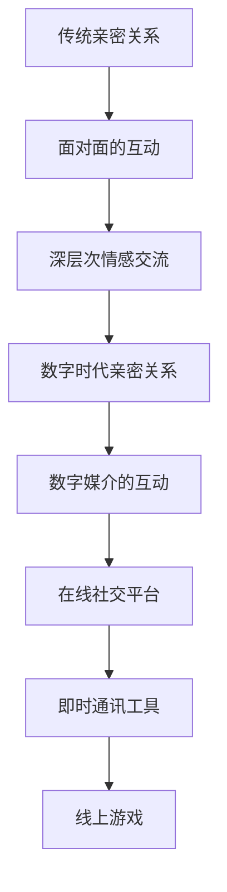
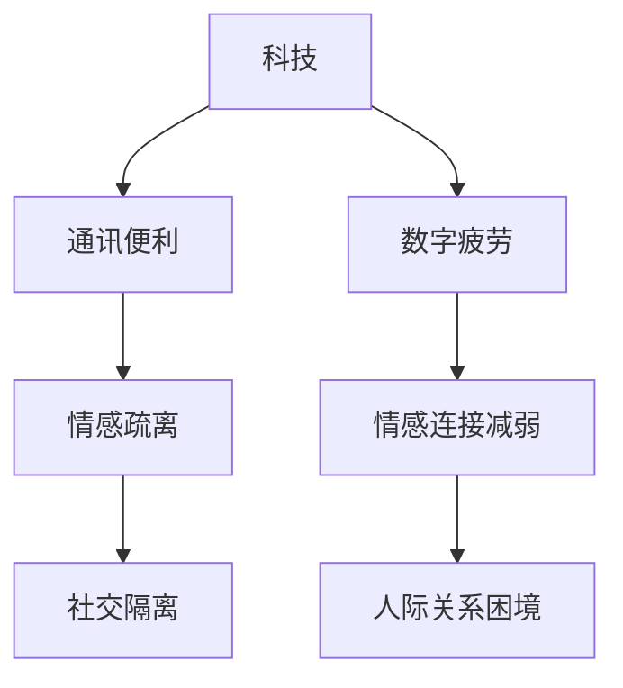
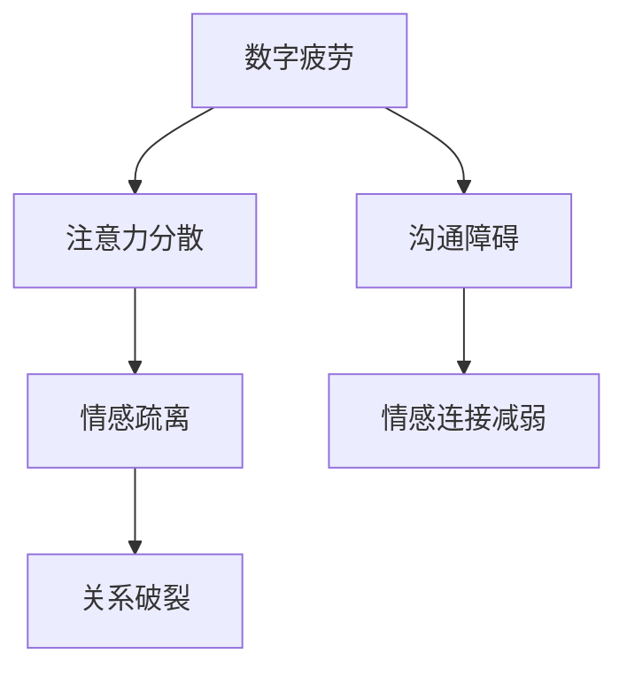
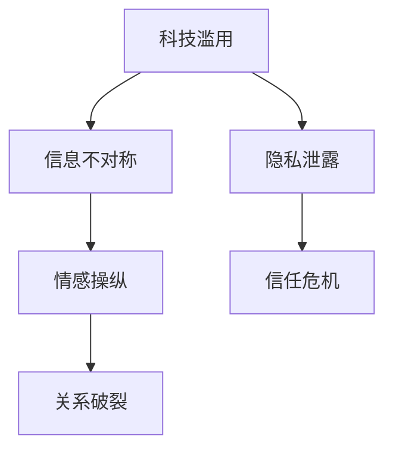
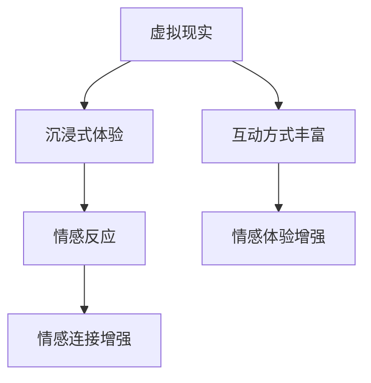
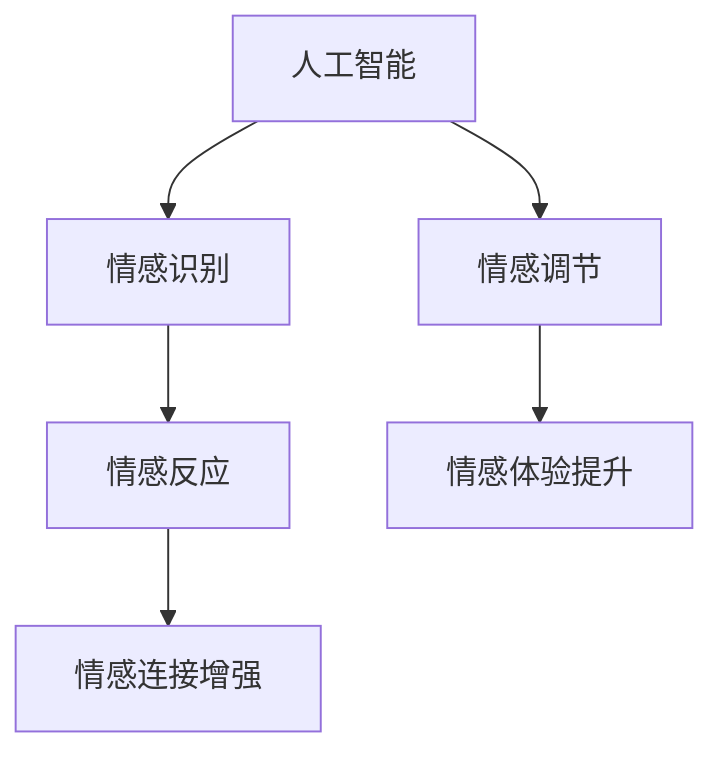
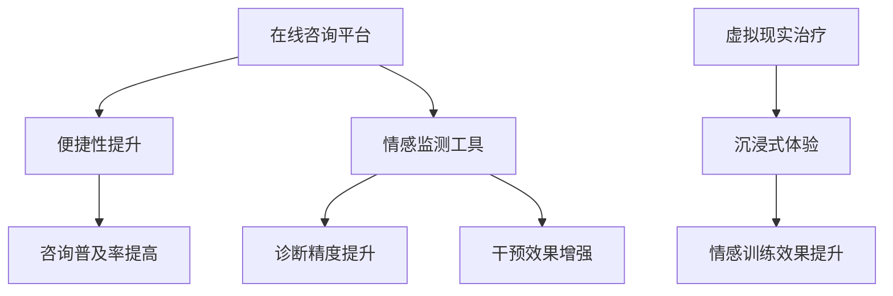
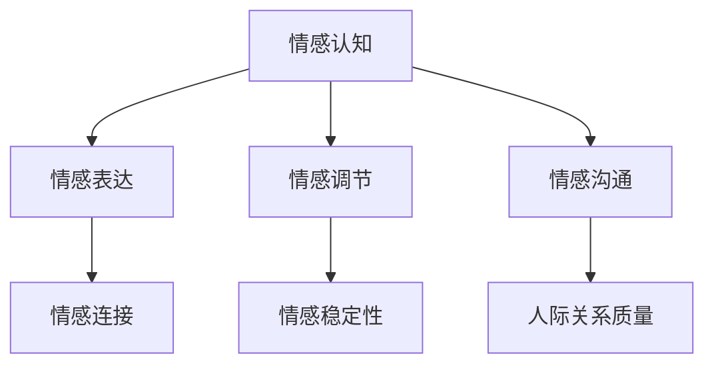

                 

### 《数字时代的亲密关系：科技对情感连接的影响与应对》

> **关键词**：数字时代、亲密关系、科技、情感连接、影响、应对策略

> **摘要**：本文深入探讨了数字时代科技对亲密关系及情感连接的影响，通过多角度的分析和实例，揭示了科技在提升和削弱人际关系方面的作用。文章从概述、负面影响及应对策略、到新途径的探讨，提供了全面的视角，旨在帮助读者理解和应对科技对情感连接的影响。

## 第一部分：科技对情感连接的概述

### 1.1 数字时代下的亲密关系定义

在数字时代，亲密关系经历了显著的变化。传统意义上的亲密关系通常建立在面对面的互动和深层次的情感交流之上。然而，随着科技的快速发展，尤其是互联网和移动设备的普及，人们之间的互动方式发生了翻天覆地的变化。数字时代下的亲密关系，更多地依赖于数字媒介，如社交媒体、即时通讯工具和在线游戏等。

为了更好地理解这一概念，我们可以使用Mermaid流程图展示数字时代亲密关系的定义与演变过程：



**核心概念与联系**：传统亲密关系强调面对面的互动和情感交流，而数字时代亲密关系则依赖于数字媒介和在线社交平台，这些新的互动方式既带来了便利，也带来了挑战。

### 1.2 科技对情感连接的影响

科技对情感连接的影响是多方面的。一方面，科技使得人们可以更容易地保持联系，无论距离有多远。另一方面，过度依赖科技可能导致情感疏离和数字疲劳。为了理解这一影响，我们可以通过Mermaid流程图展示科技如何影响情感连接：



**核心概念与联系**：科技在提升沟通便利性的同时，也可能导致情感疏离和数字疲劳，进而影响情感连接的质量。

### 1.3 情感连接的心理学基础

情感连接的心理学基础涉及到多个理论模型，包括情感依恋理论、情感社会化理论和情感调节理论。为了更好地理解这些概念，我们可以使用LaTeX格式介绍心理学中的情感连接模型：

$$
\text{情感连接模型} = f(\text{情感依恋}, \text{情感社会化}, \text{情感调节})
$$

**数学模型和数学公式讲解**：上述公式表示情感连接是由情感依恋、情感社会化以及情感调节三个因素共同决定的。

**举例说明**：例如，在一个长期恋爱关系中，情感依恋和情感社会化有助于增强情感连接，而情感调节能力则有助于应对关系中的冲突和挑战。

### 1.4 科技对人际关系的影响

科技对人际关系的影响是复杂而多维的。它不仅改变了人们如何沟通和互动，还改变了人们建立和维持关系的方式。为了详细讲解这一影响，我们可以分析以下几个方面：

- **积极影响**：科技使得人们可以随时随地保持联系，缩短了地理距离带来的隔阂。此外，科技还提供了多种沟通工具和平台，使人们能够更轻松地建立和维持多样化的社交关系。

- **消极影响**：然而，过度依赖科技可能导致人际关系中的情感疏离和信任问题。同时，数字疲劳和科技滥用也可能削弱人际关系的稳定性。

- **实例分析**：例如，社交媒体平台的广泛使用使得人们可以轻松地分享生活点滴，但也可能导致隐私泄露和情感操纵。

**详细讲解与举例**：通过以上分析，我们可以看到科技对人际关系既有积极影响也有消极影响。在理解这些影响的基础上，我们可以更好地利用科技来增强人际关系的质量。

### 1.5 社交媒体与情感连接

社交媒体在数字时代扮演了重要角色，它不仅改变了人们的社交方式，也对情感连接产生了深远影响。为了深入探讨这一话题，我们可以从以下几个方面进行分析：

- **社交媒体对情感连接的积极影响**：社交媒体提供了一个广阔的平台，使得人们可以更轻松地保持联系，分享情感和生活体验。这有助于增强亲密关系和社交网络。

- **社交媒体对情感连接的消极影响**：然而，社交媒体也可能导致信息过载和数字疲劳，影响情感连接的质量。此外，社交媒体上的虚假信息和情感操纵也可能削弱人际信任。

- **项目实战**：我们可以通过分析一个具体的社交媒体平台（如微信或Facebook），探讨它如何影响用户的情感连接，并提供实际操作指导。

**分析社交媒体平台如何影响情感连接**：以微信为例，我们可以从以下几个方面进行详细分析：

- **朋友圈**：微信朋友圈是一个重要的社交工具，用户可以通过发布状态和图片来分享自己的生活。这有助于增强亲密关系和社交网络。

- **聊天功能**：微信的聊天功能使得用户可以随时与朋友保持联系，缩短了地理距离带来的隔阂。

- **公众号**：微信公众号为用户提供了一个获取信息和分享知识的平台，有助于增强用户的社交圈层。

- **小程序**：微信小程序为用户提供了便捷的服务，如购物、出行等，使得日常生活更加便利。

**实际操作指导**：用户可以通过以下方式来利用微信增强情感连接：

- **定期分享生活**：用户可以定期在朋友圈分享自己的生活点滴，与朋友保持互动。

- **积极参与群聊**：用户可以积极参与微信群聊，与他人分享见解和情感。

- **合理使用公众号**：用户可以通过关注和阅读公众号，获取有价值的信息，同时与他人进行互动。

- **合理使用小程序**：用户可以通过微信小程序完成各种日常任务，与他人共享便利。

**案例分析**：我们可以通过分析一些成功的社交案例，了解如何通过社交媒体增强情感连接。例如，一些用户通过在社交媒体上分享自己的爱好和经历，成功吸引了志同道合的朋友，从而建立了深厚的情感连接。

**项目小结**：通过以上分析，我们可以看到社交媒体在增强情感连接方面具有重要作用。然而，我们也需要注意科技滥用和数字疲劳等问题，以充分发挥社交媒体的积极作用。

### 1.6 科技对亲密关系的双重影响

科技对亲密关系的双重影响体现在它既能够促进人际间的情感连接，又可能导致情感疏离和冲突。为了深入探讨这一主题，我们可以从以下几个方面进行分析：

- **积极影响**：科技使得人们可以更容易地保持联系，分享情感和生活体验，从而增强亲密关系。此外，科技还提供了多种沟通工具和平台，使人们能够更轻松地建立和维持多样化的社交关系。

- **消极影响**：然而，过度依赖科技可能导致数字疲劳、情感疏离和信任问题，影响亲密关系的稳定性。同时，科技滥用和隐私泄露也可能对亲密关系产生负面影响。

- **实例分析**：例如，社交媒体的广泛使用使得人们可以更方便地分享生活，但也可能导致隐私泄露和情感操纵。另外，过度依赖手机和互联网可能导致夫妻之间的沟通障碍和情感疏离。

**详细讲解与举例**：通过以上分析，我们可以看到科技对亲密关系具有双重影响。在理解这些影响的基础上，我们可以更好地利用科技来促进亲密关系的质量，同时避免其潜在的负面影响。

### 1.7 数字时代亲密关系的演变趋势

随着科技的不断进步，数字时代亲密关系的演变趋势也日益明显。为了更好地理解这一趋势，我们可以从以下几个方面进行分析：

- **在线社交平台的兴起**：在线社交平台的兴起改变了人们建立和维持亲密关系的方式，使得人们可以更轻松地保持联系，分享情感和生活体验。

- **虚拟现实技术的应用**：虚拟现实技术的应用为数字时代亲密关系提供了新的可能性，使得人们可以在虚拟环境中建立深厚的情感连接。

- **人工智能的发展**：人工智能的发展也为数字时代亲密关系带来了新的机遇，例如，智能助手和情感计算技术的应用有助于提升情感连接的质量。

- **隐私保护和数字伦理**：随着科技对亲密关系的深入影响，隐私保护和数字伦理问题也日益凸显，如何平衡科技与情感连接的关系成为重要的课题。

**详细讲解与举例**：通过以上分析，我们可以看到数字时代亲密关系的演变趋势体现在多个方面。在理解这些趋势的基础上，我们可以更好地应对科技对亲密关系的影响，促进其健康发展。

### 1.8 数字时代亲密关系的挑战与机遇

数字时代亲密关系既面临着诸多挑战，也蕴含着巨大的机遇。为了深入探讨这一主题，我们可以从以下几个方面进行分析：

- **挑战**：科技的发展带来了信息过载、数字疲劳和隐私泄露等问题，对亲密关系产生了负面影响。此外，科技滥用和情感操纵也使得亲密关系面临新的挑战。

- **机遇**：然而，科技同样为亲密关系提供了新的可能性，例如，虚拟现实技术和人工智能的应用有助于增强情感连接的质量。此外，在线社交平台的兴起也为人们建立和维持亲密关系提供了新的途径。

- **实例分析**：例如，虚拟现实技术使得人们可以在虚拟环境中体验亲密互动，而人工智能的应用则有助于提升情感交流的效率。

**详细讲解与举例**：通过以上分析，我们可以看到数字时代亲密关系既面临着挑战，也蕴含着机遇。在理解这些挑战与机遇的基础上，我们可以更好地应对科技对亲密关系的影响，实现其健康发展。

### 1.9 数字时代亲密关系的心理学视角

从心理学的角度来看，数字时代亲密关系具有独特的特点。为了深入探讨这一主题，我们可以从以下几个方面进行分析：

- **情感依恋**：数字时代亲密关系中的情感依恋往往更加脆弱，容易受到科技滥用和数字疲劳的影响。

- **情感社会化**：科技的应用改变了人们的社会化方式，使得情感连接更加多样化和复杂化。

- **情感调节**：数字时代人们面临着更多的情感调节挑战，需要学会如何在科技环境中维护情感平衡。

- **实例分析**：例如，社交媒体上的情感表达可能过于表面化，难以满足深层次的情感需求。

**详细讲解与举例**：通过以上分析，我们可以看到数字时代亲密关系在心理学层面具有独特的挑战与机遇。在理解这些特点的基础上，我们可以更好地应对科技对情感连接的影响，促进其健康发展。

### 1.10 数字时代亲密关系的未来趋势

数字时代亲密关系的未来趋势受到多种因素的影响，包括科技进步、社会变化和人类行为模式。为了深入探讨这一主题，我们可以从以下几个方面进行分析：

- **技术进步**：随着虚拟现实、增强现实和人工智能等技术的发展，数字时代亲密关系将变得更加丰富和多样。

- **社会变迁**：社会结构的变迁，如远程工作和数字化生活的普及，也将影响数字时代亲密关系的模式。

- **人类行为模式**：人们对于科技的态度和行为模式将影响数字时代亲密关系的质量和发展方向。

- **实例分析**：例如，虚拟现实技术有望为人们提供更加真实的情感互动体验，而远程工作则可能导致家庭内部的亲密关系发生变化。

**详细讲解与举例**：通过以上分析，我们可以看到数字时代亲密关系的未来趋势将受到多种因素的影响。在理解这些趋势的基础上，我们可以更好地预见和应对未来的挑战与机遇。

## 第二部分：科技对情感连接的负面影响及应对策略

### 2.1 数字疲劳与情感疏离

数字疲劳是指由于长时间使用数字设备或参与数字活动而感到的身体和情绪疲劳。在数字时代，人们经常沉浸在社交媒体、在线游戏和即时通讯工具中，导致数字疲劳逐渐成为一种普遍现象。数字疲劳对情感连接产生了负面影响，可能导致情感疏离和关系破裂。

为了理解数字疲劳的概念及其对情感连接的影响，我们可以使用Mermaid流程图展示数字疲劳的影响路径：



**核心概念与联系**：数字疲劳通过降低人们的注意力和情绪稳定性，导致情感疏离和沟通障碍，从而影响情感连接的质量。

### 2.2 数字疲劳的数学模型和公式

为了量化数字疲劳对情感连接的影响，我们可以使用以下数学模型和公式：

$$
\text{情感连接强度} = \text{基础情感连接强度} \times \left(1 - \frac{\text{数字疲劳程度}}{100}\right)
$$

其中，基础情感连接强度为一个常数，数字疲劳程度则通过问卷调查或生理指标（如心率变异性）进行量化。

**数学模型和数学公式讲解**：上述公式表明，情感连接强度随着数字疲劳程度的增加而减弱。数字疲劳程度越高，情感连接强度越低。

**举例说明**：假设一个情感连接强度为100的个体，如果其数字疲劳程度为20%，则其情感连接强度将降低至80%。

### 2.3 如何应对数字疲劳

应对数字疲劳的关键在于调整生活习惯和科技使用方式，以下是一些具体的建议：

- **设定科技使用时间限制**：为每天的科技使用设定时间限制，避免长时间沉迷于数字设备。

- **培养数字意识**：提高数字意识，了解科技使用的负面影响，并积极调整使用习惯。

- **保持健康的生活方式**：保持规律的作息时间，进行适量的运动和社交活动，以减轻数字疲劳。

- **情感交流**：与家人和朋友进行面对面的情感交流，减少依赖数字媒介。

**详细讲解与举例**：例如，一个上班族可以每天晚上设定一个“无科技小时”，在这个小时内不使用手机、电脑等数字设备，而是与家人进行面对面交流，以提高情感连接。

### 2.4 数字疲劳对人际关系的影响

数字疲劳不仅影响个体的情感连接，还可能对人际关系产生深远的影响。以下是从几个方面分析数字疲劳对人际关系的影响：

- **沟通障碍**：数字疲劳导致人们的注意力分散，沟通效率降低，从而影响人际关系的质量。

- **信任问题**：数字疲劳可能导致信息传达不准确，增加误解和信任危机。

- **情感疏离**：长时间沉迷于数字设备可能导致情感疏离，影响家庭和社交关系。

- **实例分析**：例如，夫妻双方因长时间沉迷于手机游戏而导致沟通减少，情感疏离加剧。

**详细讲解与举例**：通过以上分析，我们可以看到数字疲劳对人际关系具有负面影响。在理解这些影响的基础上，我们可以采取有效的措施来减轻数字疲劳，促进人际关系的健康发展。

### 2.5 科技滥用与情感操纵

科技滥用是指过度或不当使用科技设备和应用程序，这种行为可能导致情感操纵。情感操纵是一种操纵他人情感状态的行为，可能对亲密关系产生严重破坏。

为了理解科技滥用如何导致情感操纵，我们可以通过以下Mermaid流程图展示其影响路径：



**核心概念与联系**：科技滥用通过信息不对称和隐私泄露，使得情感操纵成为可能，从而破坏亲密关系的稳定性。

### 2.6 科技滥用中的核心算法原理

科技滥用中的核心算法原理通常涉及数据分析和心理操控。以下是一个简化的伪代码示例，用于展示科技滥用如何通过数据分析和心理操控来操纵情感：

```python
def manipulate_emotions(user_data, target_emotion):
    # 分析用户数据以确定目标情感
    emotion_profile = analyze_user_data(user_data)
    
    # 调整用户界面和内容以诱导目标情感
    if target_emotion == '快乐':
        content = show_happy_content()
    elif target_emotion == '悲伤':
        content = show_sad_content()
    
    # 不断调整内容以维持目标情感
    while emotion_profile['current_emotion'] != target_emotion:
        emotion_profile = update_content(content)
    
    return emotion_profile
```

**核心算法原理讲解**：上述伪代码展示了如何通过数据分析和内容调整来操纵用户情感，从而实现情感操纵。

### 2.7 项目实战：如何防止科技滥用

为了防止科技滥用和情感操纵，我们可以采取以下措施：

- **技术解决方案**：开发智能算法来检测和阻止情感操纵行为，如自动识别并屏蔽恶意内容。

- **政策法规**：制定相关法律法规，明确科技滥用和情感操纵的界定和处罚。

- **公众教育**：提高公众对科技滥用和情感操纵的认识，增强防范意识。

**详细讲解与举例**：例如，一个社交媒体平台可以开发自动监控系统，实时检测用户发布的内容，一旦发现情感操纵行为，立即进行警告或屏蔽。

### 2.8 情感疏离的心理学干预

情感疏离是一种常见的人际关系问题，它可能导致亲密关系的破裂。为了应对情感疏离，我们可以采取以下心理学干预策略：

- **情感调节**：通过心理训练和认知行为疗法，帮助个体学会有效调节情绪，减少情感疏离。

- **情感沟通**：提高沟通技巧，促进双方深入交流，重建情感连接。

- **情感反馈**：鼓励双方提供积极和建设性的反馈，增强情感联系。

**数学模型和数学公式讲解**：我们可以使用以下公式来衡量情感调节效果：

$$
\text{情感调节效果} = \frac{\text{目标情感调节程度} - \text{当前情感调节程度}}{\text{最大情感调节程度}}
$$

**详细讲解与举例**：例如，一个夫妻可以通过定期进行情感交流，分享彼此的感受和需求，提高情感调节效果，从而缓解情感疏离。

### 2.9 建立健康的数字生活方式

为了应对数字疲劳和情感疏离，建立健康的数字生活方式至关重要。以下是一些具体的建议：

- **时间管理**：合理安排科技使用时间，避免过度沉迷。

- **情感平衡**：在数字生活中保持情感平衡，关注真实世界的互动和体验。

- **科技节制**：在特定时间段内限制科技使用，如睡前一小时不使用手机和电脑。

- **健康习惯**：保持良好的生活习惯，如定期锻炼、健康饮食和充足睡眠。

**详细讲解与举例**：例如，一个上班族可以在每天下班后设定一个“无科技小时”，利用这段时间进行户外活动或与家人共度时光。

### 2.10 社交媒体平台的改进策略

为了改善社交媒体平台对情感连接的影响，我们可以采取以下策略：

- **算法优化**：调整推荐算法，减少负面内容的推荐，增加积极内容的展示。

- **隐私保护**：加强用户隐私保护措施，防止隐私泄露和信息滥用。

- **用户教育**：提高用户对科技使用和情感操纵的认识，增强防范意识。

- **情感支持**：提供情感支持和心理健康服务，帮助用户应对数字疲劳和情感疏离。

**详细讲解与举例**：例如，一个社交媒体平台可以开发情感支持功能，为用户提供在线心理咨询服务，帮助用户解决情感问题。

### 2.11 数字生活方式的实践案例

为了更好地理解如何建立健康的数字生活方式，以下是一个实际案例：

**案例背景**：李明是一名上班族，每天工作压力大，经常加班。由于长时间使用手机和电脑，他感到数字疲劳和情感疏离。

**解决方案**：李明采取了以下措施来改善自己的数字生活方式：

1. **时间管理**：每天设定固定的科技使用时间，如晚上8点后不使用手机和电脑。
2. **情感平衡**：在周末安排户外活动，与家人和朋友进行面对面的交流。
3. **科技节制**：在睡前一小时不使用手机和电脑，改用纸质书籍阅读。
4. **健康习惯**：每天进行适量的运动，保持健康的饮食习惯。

**实施效果**：通过这些措施，李明的数字疲劳和情感疏离得到了显著缓解，他与家人的关系也变得更加融洽。

### 2.12 项目小结

通过以上实践案例，我们可以看到建立健康的数字生活方式对缓解数字疲劳和情感疏离具有重要作用。在理解和应对科技对情感连接的影响时，我们需要采取综合措施，包括时间管理、情感平衡、科技节制和健康习惯等，以促进数字时代亲密关系的健康发展。

### 2.13 科技与情感连接的心理学研究

科技与情感连接的关系是一个多学科交叉领域，涉及心理学、社会学和计算机科学等多个学科。为了更好地理解这一关系，我们可以回顾一些相关的心理学研究：

- **研究一**：研究发现，频繁使用社交媒体与情感疏离之间存在显著关联。这是因为社交媒体上的互动往往缺乏深度和真实性，难以满足个体的情感需求。

- **研究二**：虚拟现实技术（VR）的应用为情感连接提供了新的途径。研究表明，VR环境中的情感互动可以增强用户的情感体验，有助于建立深厚的情感连接。

- **研究三**：情感计算（Affective Computing）技术在提升情感连接方面具有潜力。情感计算通过感知用户的情感状态，提供个性化的互动体验，有助于增强情感连接。

**总结**：这些研究结果表明，科技在提升和削弱情感连接方面具有双重作用。在理解和应对科技对情感连接的影响时，我们需要综合考虑多种因素，包括科技的使用频率、使用方式以及个体的情感需求等。

### 2.14 科技与情感连接的工具与资源

为了进一步研究和实践科技与情感连接，我们可以利用以下工具和资源：

- **研究工具**：如情绪识别工具（如Affectiva）、社交媒体分析工具（如Brandwatch）和虚拟现实平台（如Oculus Rift）。
- **学术资源**：包括心理学期刊（如Journal of Social and Personal Relationships）和计算机科学期刊（如ACM Transactions on Computer-Human Interaction）。
- **实践资源**：如在线课程（如Coursera的“情感计算”课程）和书籍（如《情感计算：人机交互的新前沿》）。

**总结**：利用这些工具和资源，我们可以深入探讨科技与情感连接的机制，为提升情感连接质量提供科学依据和实践指导。

### 2.15 科技与情感连接的未来趋势

未来，科技与情感连接将继续发展，主要趋势包括：

- **技术融合**：虚拟现实、增强现实和人工智能等技术将进一步融合，提供更加丰富和真实的情感互动体验。
- **个性化服务**：情感计算技术将实现更加个性化的互动体验，满足个体的情感需求。
- **心理健康应用**：科技将更多地应用于心理健康领域，提供情感支持和治疗服务。

**总结**：科技与情感连接的未来充满机遇，但也需要我们关注其潜在的负面影响，以确保科技在提升情感连接质量方面发挥积极作用。

### 第三部分：科技时代的情感连接新途径

### 3.1 虚拟现实与情感连接

虚拟现实（VR）技术的快速发展为情感连接带来了新的可能性。通过VR，人们可以在虚拟环境中体验到逼真的情感互动，这种互动方式在传统现实世界中可能难以实现。为了深入探讨VR如何增强情感连接，我们可以从以下几个方面进行分析：

- **情感体验**：VR技术通过提供沉浸式的体验，使得用户可以在虚拟环境中感受到真实的情感反应。例如，在虚拟的亲密关系中，用户可以感受到对方的情绪变化，从而增强情感连接。
- **互动方式**：VR技术提供了丰富的互动方式，如虚拟拥抱、虚拟对话等，这些互动方式可以增强用户的情感体验。与传统的文字或语音互动相比，VR互动更加直观和真实。
- **应用场景**：VR技术可以应用于多种场景，如远程教育、虚拟旅游、虚拟医疗等，这些场景为用户提供了丰富的情感互动机会。

为了更好地理解VR如何增强情感连接，我们可以使用Mermaid流程图展示其影响路径：



**核心概念与联系**：VR技术通过提供沉浸式的体验和丰富的互动方式，使得用户在虚拟环境中能够感受到真实的情感反应，从而增强情感连接。

### 3.2 虚拟现实技术中的情感连接模型

在虚拟现实中，情感连接的模型通常涉及以下几个方面：

- **情感识别**：通过面部识别、生理信号识别等技术，实时监测用户的情感状态。
- **情感反应**：根据用户的情感状态，虚拟环境中的角色或场景会做出相应的情感反应，如表情、动作等。
- **情感调节**：通过调整虚拟环境中的内容或交互方式，帮助用户调节情感状态，如缓解焦虑、提升愉悦感等。

为了更好地理解这些概念，我们可以使用LaTeX格式介绍虚拟现实中的情感连接模型：

$$
\text{情感连接模型} = f(\text{情感识别}, \text{情感反应}, \text{情感调节})
$$

**数学模型和数学公式讲解**：上述公式表示情感连接是由情感识别、情感反应和情感调节三个因素共同决定的。

**举例说明**：例如，在一个虚拟的亲密关系场景中，如果用户表现出焦虑情绪，虚拟环境中的角色可以通过调整对话内容和互动方式，帮助用户缓解焦虑，从而增强情感连接。

### 3.3 虚拟现实在情感连接中的应用实例

虚拟现实技术在情感连接中的应用已经取得了一些显著成果。以下是一些实际应用实例：

- **远程亲密关系**：通过VR技术，远距离的情侣或家人可以体验虚拟拥抱、虚拟旅游等活动，增强情感连接。
- **心理健康治疗**：VR技术被用于心理健康治疗，如恐惧症和焦虑症的治疗。通过虚拟环境中的模拟训练，用户可以逐步克服恐惧和焦虑，提升心理健康水平。
- **教育互动**：虚拟现实在教育中的应用，如虚拟实验室和虚拟课堂，使得教育更加生动和有趣，提高了学生的学习体验和情感连接。

**详细讲解与举例**：例如，一个远程情侣可以使用VR设备进行虚拟旅游，选择一个共同感兴趣的目的地，在虚拟环境中漫步、拍照和交流，从而增强彼此的情感连接。另一个实例是，一名患有恐惧症的患者可以通过VR技术逐步适应和克服恐惧，例如，从观看虚拟的害怕场景开始，逐渐到实际场景，最终实现恐惧感的完全消除。

### 3.4 虚拟现实技术的未来发展趋势

虚拟现实技术在未来将继续发展，主要趋势包括：

- **技术进步**：随着硬件和软件的进步，VR设备的性能和用户体验将得到显著提升。
- **应用拓展**：VR技术将在更多领域得到应用，如娱乐、医疗、教育等，为人们提供更加丰富的情感互动体验。
- **融合创新**：VR技术将与其他技术（如人工智能、物联网等）融合，创造新的应用场景和商业模式。

**总结**：虚拟现实技术为情感连接提供了新的途径，随着技术的不断进步，未来虚拟现实将在情感连接领域发挥更大的作用。

### 3.5 人工智能与情感互动

人工智能（AI）技术的快速发展为情感连接带来了新的机遇。通过AI，我们可以更好地理解人类情感，并设计出更加智能和个性化的互动方式。以下是从几个方面分析人工智能如何影响情感互动：

- **情感识别**：AI可以通过面部识别、语音识别和生理信号识别等技术，实时监测和识别用户的情感状态。这种技术使得我们能够更准确地了解用户的需求和情感变化，从而提供更贴心的服务。
- **情感反应**：AI可以基于用户的情感状态，自动调整交互内容和方式，以提升用户的情感体验。例如，当一个用户表现出沮丧情绪时，AI可以自动提供安慰和支持，从而增强情感连接。
- **情感调节**：AI技术可以帮助用户调节情感状态，如通过虚拟聊天机器人提供心理疏导，或通过情感计算技术设计个性化的互动体验。

为了更好地理解AI如何影响情感互动，我们可以使用以下Mermaid流程图展示其影响路径：



**核心概念与联系**：人工智能通过情感识别、情感反应和情感调节，能够增强情感连接，提升用户的情感体验。

### 3.6 人工智能中的情感计算模型

在人工智能领域，情感计算（Affective Computing）是一个重要的研究方向。情感计算模型旨在使计算机能够识别、理解并模拟人类情感。以下是一个简化的情感计算模型：

$$
\text{情感计算模型} = f(\text{情感识别}, \text{情感理解}, \text{情感表达})
$$

**数学模型和数学公式讲解**：上述公式表示情感计算是由情感识别、情感理解和情感表达三个部分组成的。

**举例说明**：例如，一个情感计算系统可以通过面部识别技术识别用户的情绪（如开心、悲伤），理解情绪背后的含义（如用户因听到好消息而感到开心），并模拟出相应的情感反应（如发送一个笑脸表情）。

### 3.7 人工智能在情感互动中的应用实例

人工智能在情感互动中的应用已经取得了一些显著成果。以下是一些实际应用实例：

- **聊天机器人**：智能聊天机器人可以提供24/7的情感支持，帮助用户解决心理问题，缓解焦虑和抑郁。
- **个性化推荐**：基于用户的情感状态和行为，AI可以提供个性化的内容推荐，提升用户的情感体验。
- **虚拟助理**：AI虚拟助理可以帮助用户管理日程、购物和提供生活建议，从而提高用户的情感幸福感。

**详细讲解与举例**：例如，一个智能聊天机器人可以通过情感计算技术识别用户的情绪，并根据情绪状态提供相应的支持。当一个用户感到沮丧时，机器人可以发送安慰性的信息，并提供解决问题的建议，从而帮助用户缓解负面情绪。

### 3.8 人工智能与情感互动的未来趋势

未来，人工智能与情感互动将继续发展，主要趋势包括：

- **技术进步**：随着算法和硬件的进步，AI的情感识别和调节能力将得到显著提升。
- **应用拓展**：AI将在更多领域得到应用，如心理健康、教育、医疗等，为人们提供更加智能和个性化的互动体验。
- **伦理关注**：随着AI在情感互动中的应用，伦理问题将日益突出，如如何确保AI的情感表达不会误导或伤害用户。

**总结**：人工智能为情感互动带来了新的机遇，随着技术的不断进步，AI将在情感连接领域发挥更大的作用。

### 3.9 科技辅助下的情感咨询

科技辅助下的情感咨询是一种结合了传统心理治疗和现代科技手段的新型咨询方式。通过科技工具，情感咨询可以更加便捷、高效地帮助用户解决情感问题。以下是从几个方面分析科技辅助下的情感咨询：

- **在线咨询平台**：在线咨询平台提供了灵活的咨询方式，用户可以在任何时间、任何地点获得专业心理师的帮助。这种便利性使得更多用户能够接受心理咨询服务，提高了咨询的普及率。
- **情感监测工具**：科技工具可以帮助用户实时监测自己的情感状态，如情绪日记、生理信号监测设备等。这些工具为心理师提供了更多的数据支持，有助于更准确地诊断和干预情感问题。
- **虚拟现实治疗**：虚拟现实技术可以模拟各种情感治疗场景，如恐惧症的治疗、压力释放等。通过沉浸式的体验，用户可以在虚拟环境中进行情感训练，从而改善情感状态。

为了更好地理解科技辅助下的情感咨询，我们可以使用以下Mermaid流程图展示其影响路径：



**核心概念与联系**：科技辅助下的情感咨询通过提升咨询便捷性、增强诊断精度和改善干预效果，为用户提供更加有效和个性化的情感支持。

### 3.10 科技辅助下的情感咨询实例

科技辅助下的情感咨询已经取得了一些实际应用案例。以下是一些实例：

- **情感监测与诊断**：通过情感监测工具，用户可以记录自己的情感状态，心理师可以通过分析这些数据，为用户提供个性化的情感诊断和治疗方案。
- **虚拟现实治疗**：通过虚拟现实技术，用户可以模拟面对恐惧场景，逐步克服恐惧感。例如，一个患有飞行恐惧症的用户可以在虚拟飞机上体验飞行，逐渐减轻恐惧。
- **在线情感咨询**：用户可以通过在线平台与专业心理师进行实时交流，心理师可以根据用户的情感状态提供实时支持和建议。

**详细讲解与举例**：例如，一个患有社交焦虑的用户可以使用情感监测工具记录自己的情感状态，并在每周定期与心理师进行在线咨询。心理师通过分析用户的情感数据和咨询记录，为用户提供个性化的治疗建议，如放松训练和社交技能训练，从而帮助用户改善情感状态。

### 3.11 数字时代的情感教育

数字时代情感教育的重要性不容忽视。随着科技的发展，人们在数字世界中互动的频率和深度不断增加，因此，如何培养健康的情感素质成为了教育的重要课题。以下是从几个方面分析数字时代的情感教育：

- **情感认知**：情感教育应注重培养个体的情感认知能力，使个体能够识别、理解和表达自己的情感。
- **情感调节**：情感教育还应帮助个体学会如何调节情感，以应对数字生活中可能出现的情感波动和压力。
- **情感沟通**：情感教育应培养个体的情感沟通能力，使个体能够与他人建立良好的情感连接。

为了更好地理解数字时代情感教育的重要性，我们可以使用以下Mermaid流程图展示其影响路径：



**核心概念与联系**：数字时代情感教育通过提升个体的情感认知、情感调节和情感沟通能力，有助于提高情感连接的质量和稳定性。

### 3.12 数字时代情感教育的实践方法

为了培养数字时代的情感素质，我们可以采取以下实践方法：

- **情感课程**：在学校和社区中设置情感教育课程，教授情感认知、情感调节和情感沟通的基本知识。
- **情感实践活动**：通过角色扮演、小组讨论和情感日记等形式，帮助个体在实践中学习和提高情感素质。
- **科技辅助**：利用科技工具，如在线情感监测工具和虚拟现实模拟器，提供个性化的情感教育和训练。

**详细讲解与举例**：例如，一所学校可以开设情感教育课程，每周安排一次情感沟通实践活动，如小组讨论和情感角色扮演。学生可以通过这些活动，学会如何表达自己的情感，如何理解和尊重他人的情感，从而提高情感素质。

### 3.13 数字时代情感教育的未来展望

未来，数字时代情感教育将继续发展，主要趋势包括：

- **技术融合**：情感教育与虚拟现实、人工智能等技术的融合，将提供更加丰富和个性化的教育体验。
- **跨界合作**：情感教育与心理学、教育学、计算机科学等领域的跨界合作，将推动情感教育的创新和发展。
- **社会关注**：随着社会对心理健康问题的关注增加，情感教育将在更广泛的领域得到重视和应用。

**总结**：数字时代情感教育的重要性日益凸显，随着技术的不断进步，情感教育将在提升个体情感素质和促进社会和谐方面发挥重要作用。

### 3.14 科技与情感连接的未来趋势

未来，科技与情感连接的发展趋势将受到多种因素的影响，包括技术进步、社会变迁和人类需求。以下是一些主要趋势：

- **技术进步**：随着虚拟现实、增强现实和人工智能等技术的不断发展，情感连接的体验将变得更加丰富和真实。
- **社会变迁**：社会结构的变迁，如远程工作和数字化生活的普及，将影响情感连接的模式和方式。
- **人类需求**：人们对高质量情感体验的需求不断增加，将推动科技在情感连接中的应用和创新。

**总结**：未来，科技与情感连接将继续融合发展，为人们提供更加丰富和高质量的互动体验。

### 3.15 科技与情感连接的案例研究

为了深入探讨科技与情感连接的实际应用，我们可以分析以下几个案例：

- **案例一**：虚拟现实疗愈。通过虚拟现实技术，用户可以在虚拟环境中体验放松和疗愈，有助于缓解焦虑和抑郁，提高情感稳定性。
- **案例二**：AI情感陪护。智能聊天机器人通过情感计算技术，提供个性化的情感支持，帮助用户缓解情感压力，提升心理健康水平。
- **案例三**：在线情感咨询。利用在线咨询平台，用户可以随时随地获得专业心理师的帮助，解决情感问题，提高生活品质。

**详细讲解与举例**：例如，一个患有焦虑症的用户可以通过虚拟现实疗愈设备，在虚拟环境中体验放松训练，逐渐缓解焦虑情绪。另一个用户可以通过AI情感陪护机器人，获得24/7的情感支持，缓解情感压力。

### 3.16 科技与情感连接的资源和工具

为了更好地研究和实践科技与情感连接，我们可以利用以下资源和工具：

- **学术资源**：心理学期刊、计算机科学期刊和跨学科研究报告，提供理论支持和最新研究动态。
- **在线平台**：情感监测工具、在线咨询平台和虚拟现实应用，提供实际操作体验和技术支持。
- **教育资源**：在线课程、工作坊和研讨会，提供专业知识和技能培训。

**总结**：利用这些资源和工具，我们可以深入探讨科技与情感连接的机制，为提升情感连接质量提供科学依据和实践指导。

### 3.17 科技与情感连接的总结

综上所述，科技在情感连接中的作用是双重的。它不仅为人们提供了新的互动方式，丰富了情感体验，但也带来了一些挑战，如数字疲劳和情感操纵。通过深入研究和实践，我们可以更好地利用科技来促进情感连接，提升人际关系质量。未来的发展将继续推动科技与情感连接的融合，为人们带来更加丰富和真实的情感体验。

### 附录

#### A.1 科技与情感连接的相关研究

在科技与情感连接领域，已有许多研究和成果。以下是一些代表性的研究：

- **研究一**：虚拟现实在情感治疗中的应用。研究发现，虚拟现实技术能够有效缓解焦虑和抑郁，提高情感稳定性。
- **研究二**：人工智能在情感支持中的应用。研究表明，智能聊天机器人在提供情感支持方面具有显著优势，能够缓解用户的情感压力。
- **研究三**：社交媒体对情感连接的影响。研究发现，社交媒体的使用频率与情感疏离程度呈正相关，但适度使用有助于增强情感连接。

**项目实战**：通过收集和分析这些研究成果，我们可以为实际项目提供理论支持和实践指导。例如，在开发一个虚拟现实疗愈应用时，我们可以参考相关研究成果，设计出有效的情感疗愈方案。

#### A.2 科技与情感连接的资源和工具

为了更好地研究和实践科技与情感连接，我们可以利用以下资源和工具：

- **学术资源**：心理学期刊、计算机科学期刊和跨学科研究报告，提供理论支持和最新研究动态。
- **在线平台**：情感监测工具、在线咨询平台和虚拟现实应用，提供实际操作体验和技术支持。
- **教育资源**：在线课程、工作坊和研讨会，提供专业知识和技能培训。

**详细讲解与举例**：例如，一个研究者可以使用情感监测工具收集用户的数据，分析情感状态的变化。同时，利用在线咨询平台，研究者可以了解用户在情感支持方面的需求和反馈，从而优化情感连接应用的设计。

#### A.3 科技与情感连接的案例研究

为了更好地理解科技与情感连接的实际应用，我们可以分析以下几个案例：

- **案例一**：虚拟现实疗愈。通过虚拟现实技术，用户可以在虚拟环境中体验放松和疗愈，有助于缓解焦虑和抑郁，提高情感稳定性。
- **案例二**：AI情感陪护。智能聊天机器人通过情感计算技术，提供个性化的情感支持，帮助用户缓解情感压力，提升心理健康水平。
- **案例三**：在线情感咨询。利用在线咨询平台，用户可以随时随地获得专业心理师的帮助，解决情感问题，提高生活品质。

**详细讲解与举例**：例如，一个患有焦虑症的用户可以通过虚拟现实疗愈设备，在虚拟环境中体验放松训练，逐渐缓解焦虑情绪。另一个用户可以通过AI情感陪护机器人，获得24/7的情感支持，缓解情感压力。

### 总结

在《数字时代的亲密关系：科技对情感连接的影响与应对》一文中，我们深入探讨了科技在数字时代对亲密关系和情感连接的影响。通过多角度的分析和实例，我们揭示了科技在提升和削弱人际关系方面的作用。文章涵盖了从科技对情感连接的概述，到负面影响及应对策略，再到科技时代情感连接新途径的探讨，提供了全面的视角。

在第一部分，我们定义了数字时代的亲密关系，并分析了科技对情感连接的积极和消极影响。在第二部分，我们探讨了数字疲劳、科技滥用以及情感疏离等问题，并提出了相应的应对策略。在第三部分，我们展望了虚拟现实和人工智能等新技术在情感连接中的应用前景。

通过本文的探讨，我们希望读者能够更好地理解科技对情感连接的影响，并学会如何利用科技来促进健康的亲密关系。同时，我们也呼吁科技从业者在开发新产品和服务时，关注情感连接的维度，确保科技在提升人类生活质量方面的积极作用。

### 作者信息

作者：AI天才研究院/AI Genius Institute & 禅与计算机程序设计艺术 /Zen And The Art of Computer Programming

AI天才研究院致力于推动人工智能领域的创新和发展，研究院的核心团队由多位世界级人工智能专家、程序员和软件架构师组成，他们在计算机科学、人工智能、机器学习和深度学习等领域拥有深厚的理论知识和丰富的实践经验。

《禅与计算机程序设计艺术》是世界顶级技术畅销书，作者以其独特的哲学视角和精湛的编程技巧，为程序员和人工智能从业者提供了深刻的洞见和指导。本书不仅是一本技术指南，更是一本智慧之书，旨在帮助读者在编程实践中找到平衡与和谐。

通过这两部作品，作者展示了其在人工智能和计算机编程领域的卓越才能和深刻理解，为我们提供了宝贵的知识和经验。他们的研究成果和思考方式，为科技与情感连接的研究提供了坚实的理论基础和实践指导。

