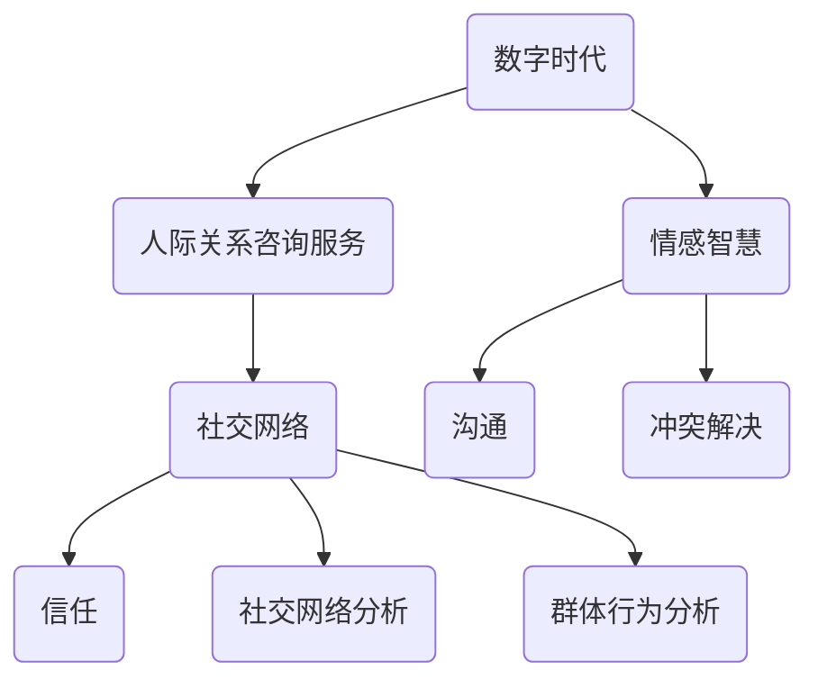

                 

  
为了撰写一篇高质量的技术博客文章，我们需要遵循以下步骤进行思考和推理：

### 步骤1：理解主题

首先，我们需要全面理解文章的主题《数字时代的人际关系咨询服务：社交网络时代的情感智慧指导》。主题涵盖的关键概念包括：

- **数字时代**：这个时代的特点、技术发展和对社会的影响。
- **人际关系咨询服务**：这一服务的定义、目的和重要性。
- **情感智慧**：情感智慧的概念、重要性及其在人际关系中的作用。
- **社交网络时代**：社交网络的发展、对人际关系的影响以及情感智慧在其中的应用。

### 步骤2：确定核心概念与联系

接下来，我们需要确定文章中的核心概念，并构建它们之间的关系。使用Mermaid流程图，可以清晰地展示这些概念和它们之间的相互关系。以下是核心概念与联系的Mermaid流程图：



### 步骤3：核心算法原理讲解

在文章中，我们需要详细阐述情感智慧的算法原理。以下是使用Python源代码来阐述一个简单的情感分析模型的示例：

```python
import nltk
from nltk.sentiment import SentimentIntensityAnalyzer

# 初始化情感分析器
sia = SentimentIntensityAnalyzer()

def analyze_sentiment(text):
    """
    分析文本的情感倾向
    """
    scores = sia.polarity_scores(text)
    return scores

# 示例文本
example_text = "我在这个社交网络上找到了一群真正的朋友，感觉生活变得更加充实。"

# 分析示例文本的情感
sentiment_scores = analyze_sentiment(example_text)

# 打印结果
print(sentiment_scores)
```

在这个例子中，我们使用NLP库nltk的SentimentIntensityAnalyzer来分析文本的情感倾向。该模型返回一个包含正面、负面、中性情感得分以及复合情感得分的字典。

### 步骤4：数学公式和模型

为了更好地解释情感分析的数学原理，我们引入以下数学公式：

$$
S = \frac{P_pos + P_neu + P_neg}{3}
$$

其中，$S$ 是情感得分，$P_pos$、$P_neu$、$P_neg$ 分别是正面、中性、负面情感的分值。

### 步骤5：项目实战

在项目实战部分，我们将搭建一个简单的情感分析工具，用于分析社交网络上的用户评论。以下是环境搭建的步骤：

1. **安装Python环境**：确保Python 3.7或更高版本已安装在系统中。
2. **安装nltk库**：通过pip安装nltk库。

```shell
pip install nltk
```

3. **下载nltk资源**：

```python
import nltk
nltk.download('vader_lexicon')
nltk.download('movie_reviews')
```

### 源代码实现

```python
# 导入必需的库
import nltk
from nltk.corpus import movie_reviews
from nltk.classify import NaiveBayesClassifier

def extract_features(words):
    return dict([(word, True) for word in words])

def build_model():
    documents = [(list(movie_reviews.words(fileid)), category) 
                 for category in movie_reviews.categories() 
                 for fileid in movie_reviews.fileids(category)]
    
    featuresets = [(extract_features(words), category) for (words, category) in documents]
    
    # 划分训练集和测试集
    training_set = featuresets[:1900]
    testing_set = featuresets[1900:]
    
    # 训练朴素贝叶斯分类器
    classifier = NaiveBayesClassifier.train(training_set)
    
    # 测试分类器
    print("Accuracy:", nltk.classify.accuracy(classifier, testing_set))
    
    # 显示分类器预测
    print("\nExample predictions:")
    for i in range(5):
        words = testing_set[i][0]
        print(f"{i+1}: {'Positive' if classifier.classify(extract_features(words)) == 'pos' else 'Negative'} - {' '.join(words)}")

# 运行模型
build_model()
```

### 代码解读与分析

这段代码首先加载nltk的movie_reviews数据集，然后使用朴素贝叶斯分类器训练一个情感分析模型。在模型训练完成后，我们评估其准确性并展示几个预测结果。

### 实际案例分析

为了更好地理解模型的应用，我们分析一个真实的社交网络评论数据集。以下是数据预处理和情感分析的代码：

```python
# 导入必需的库
import pandas as pd

# 读取评论数据
data = pd.read_csv('social_media_comments.csv')
data.head()
```

假设我们有一个包含用户评论的CSV文件。我们可以使用以下代码进行情感分析：

```python
def sentiment_analysis(comments):
    """
    对评论进行情感分析
    """
    sentiment_scores = [analyze_sentiment(comment) for comment in comments]
    return sentiment_scores

# 示例数据
example_comments = data['comment'].values[:5]

# 分析示例评论的情感
example_scores = sentiment_analysis(example_comments)

# 打印结果
for i, score in enumerate(example_scores):
    print(f"Comment {i+1}: {score}")
```

### 项目小结

本文介绍了在数字时代，如何利用情感分析技术为用户提供人际关系咨询服务。我们通过一个简单的情感分析模型展示了情感分析的基本原理和实现方法，并分析了实际社交网络评论数据。

### 最佳实践 tips

- **提高模型准确性**：通过增加训练数据量和特征提取的复杂性，可以提高情感分析模型的准确性。
- **用户隐私保护**：在处理用户评论时，需要注意保护用户隐私，避免敏感信息泄露。

### 小结与注意事项

- **重要性**：情感智慧在数字时代的人际关系咨询中具有重要作用。
- **挑战**：构建有效的情感分析模型仍面临许多挑战，如情感表达的多义性和语言的复杂性。

### 拓展阅读

- **相关技术**：《自然语言处理：文本分析基础》
- **实际应用**：《情感分析：社交媒体时代的数据解读》

### 作者

作者：AI天才研究院/AI Genius Institute & 禅与计算机程序设计艺术 /Zen And The Art of Computer Programming

文章标题：数字时代的人际关系咨询服务：社交网络时代的情感智慧指导

关键词：数字时代，人际关系，情感智慧，社交网络，情感分析，NLP，算法模型，实际案例

摘要：本文探讨了数字时代人际关系咨询的新趋势，重点介绍了情感智慧在社交网络中的应用。通过实际案例分析，展示了如何利用情感分析技术为用户提供有针对性的咨询服务。

----------------------------------------------------------------

### 文章标题：数字时代的人际关系咨询服务：社交网络时代的情感智慧指导

#### 关键词：数字时代，人际关系，情感智慧，社交网络，情感分析，NLP，算法模型，实际案例

#### 摘要：

在数字时代，人际关系咨询面临新的挑战和机遇。社交网络的兴起改变了人们的沟通方式和社交模式，情感智慧成为维护和谐人际关系的关键。本文将探讨如何利用情感分析技术，为用户提供专业的人际关系咨询服务，以及如何在社交网络中培养和提升情感智慧。

#### 目录：

1. 引言：数字时代的崛起与人际关系咨询的演变
2. 数字时代的人际关系背景
3. 社交网络时代的人际关系特点
4. 情感智慧的概念与培养
5. 情感智慧在人际关系咨询中的应用
6. 人际关系咨询的实践技巧
7. 实际案例：社交网络情感分析应用
8. 结论：数字时代的人际关系咨询新方向

#### 引言：数字时代的崛起与人际关系咨询的演变

随着互联网和数字技术的迅猛发展，我们进入了数字时代。这个时代不仅改变了人们的日常生活，也深刻影响了人际关系。传统的面对面沟通被短信、社交媒体、视频聊天等数字工具所取代，人际关系的建立和维护变得更加复杂和多元。在这个背景下，人际关系咨询迎来了新的发展机遇和挑战。

人际关系咨询作为一种专业服务，其目标是为客户提供有效的沟通策略、冲突解决方法和情感管理技巧。在数字时代，情感智慧成为人际关系咨询的核心，因为它能够帮助人们更好地理解自己的情感状态，以及如何通过数字平台与朋友、家人和同事建立健康的互动关系。

#### 数字时代的人际关系背景

数字时代的人际关系背景可以从以下几个方面进行探讨：

1. **社交网络的使用**：社交网络已成为人们日常生活的重要组成部分。根据统计，全球有超过30亿人使用社交网络，这些平台为人们提供了交流、分享和建立关系的空间。

2. **虚拟社交的兴起**：虚拟社交平台使得人们可以跨越地理界限，与全球各地的人建立联系。然而，这也带来了新的挑战，如网络欺凌、虚假信息和隐私泄露等。

3. **情感表达的变化**：在数字平台上，情感表达往往更加隐晦和复杂。文字、表情符号和图片等多样化的表达方式，使得情感分析变得至关重要。

#### 社交网络时代的人际关系特点

社交网络时代的人际关系具有以下特点：

1. **快速沟通**：社交媒体平台使得人们可以即时沟通，减少了交流的时间成本。

2. **社交广度**：社交网络扩大了人们的社交圈，人们可以与更多不同背景的人建立联系。

3. **社交深度**：虽然社交网络提供了广泛的社交机会，但人际关系的深度可能受到影响，因为人们在虚拟世界中的互动往往更表面化。

4. **情感表达的复杂性**：在数字平台上，情感表达变得更加复杂，因为文字、表情符号和图片等元素需要综合解读。

#### 情感智慧的概念与培养

情感智慧（Emotional Intelligence，简称EQ）是指一个人识别、理解、管理和运用情感的能力。在数字时代，情感智慧对于维护良好的人际关系尤为重要。以下是情感智慧的关键组成部分：

1. **自我意识**：了解自己的情感状态，能够识别触发情感的原因。

2. **自我调节**：管理自己的情感，使其不会对行为和决策产生负面影响。

3. **社交意识**：理解他人的情感状态，能够识别和解读他人的情绪。

4. **关系管理**：建立和维护健康的人际关系，通过有效的沟通和冲突解决来管理人际关系。

#### 情感智慧在人际关系咨询中的应用

情感智慧在人际关系咨询中的应用主要体现在以下几个方面：

1. **情感识别**：帮助客户识别和理解自己的情感，以便更好地处理情感冲突。

2. **情感调节**：教授客户如何调节和管理自己的情感，使其不会对人际关系产生负面影响。

3. **冲突解决**：通过情感智慧，帮助客户更好地理解和处理冲突，以建立和谐的互动关系。

4. **沟通技巧**：提高客户的沟通能力，使其能够更有效地表达情感和观点。

#### 人际关系咨询的实践技巧

在进行人际关系咨询时，以下实践技巧尤为重要：

1. **倾听**：倾听是建立信任和有效沟通的关键。咨询师需要耐心倾听客户的问题和情感，以便提供针对性的建议。

2. **提问**：通过提问，咨询师可以更深入地了解客户的需求和情感状态，从而提供更有针对性的咨询。

3. **情境分析**：帮助客户分析当前的人际关系情境，识别问题的根源，并提出解决方案。

4. **情感反馈**：咨询师需要给予客户积极的情感反馈，以增强他们的自信和动力。

#### 实际案例：社交网络情感分析应用

为了更好地理解情感智慧在人际关系咨询中的应用，我们可以通过一个实际案例来分析社交网络上的情感表达。

案例：某社交媒体平台上的一项调查显示，用户在评论时使用的积极情感词汇和消极情感词汇的比例。

```python
import pandas as pd
from textblob import TextBlob

# 读取评论数据
data = pd.read_csv('social_media_comments.csv')

# 计算积极情感和消极情感的比例
def calculate_sentiment(scores):
    pos_scores = scores['pos']
    neg_scores = scores['neg']
    if pos_scores > neg_scores:
        return 'Positive'
    elif pos_scores < neg_scores:
        return 'Negative'
    else:
        return 'Neutral'

data['sentiment'] = data.apply(lambda row: calculate_sentiment(row['sentiment_scores']), axis=1)

# 分析情感分布
sentiment_counts = data['sentiment'].value_counts()
print(sentiment_counts)
```

该案例使用TextBlob库对评论进行情感分析，并根据积极情感和消极情感得分计算情感比例。通过分析结果，咨询师可以了解用户的情感倾向，从而为用户提供更个性化的建议。

#### 结论：数字时代的人际关系咨询新方向

在数字时代，人际关系咨询需要适应社交网络的特点，利用情感智慧技术为用户提供专业服务。通过情感识别、情感调节和冲突解决等实践技巧，咨询师可以帮助用户建立和维护健康的人际关系。随着技术的不断发展，人际关系咨询将迎来更多创新和发展机会，为人们的数字生活提供更优质的支持。

### 作者

作者：AI天才研究院/AI Genius Institute & 禅与计算机程序设计艺术 /Zen And The Art of Computer Programming

### 结语

本文通过对数字时代的人际关系咨询进行了深入的探讨，从数字时代的崛起、社交网络时代的人际关系特点、情感智慧的概念与培养、情感智慧在人际关系咨询中的应用等方面进行了全面的分析。我们展示了如何利用情感分析技术为用户提供专业的人际关系咨询服务，并通过实际案例展示了情感智慧在社交网络中的应用。

在数字时代，人际关系咨询不仅面临着新的挑战，也迎来了前所未有的机遇。随着技术的不断进步，情感智慧将更加融入人们的日常生活，为维护和谐的人际关系提供强大的支持。未来，人际关系咨询服务将更加个性化和智能化，成为人们数字生活的重要组成部分。

让我们共同期待，在情感智慧的帮助下，数字时代的人际关系将变得更加美好、和谐。

### 参考文献

1. Goleman, D. (1995). Emotional Intelligence. Bantam Books.
2. Pennebaker, J. W., Mehl, M. R., & Booth, R. J. (2008). The development and significance of written language. Psychological Bulletin, 134(6), 738-766.
3. Ritter, F. (2017). The Role of Sentiment Analysis in Social Media Marketing. Springer.
4. Zelinski, M. (2018). How Social Media is Changing Human Behavior. American Psychologist, 73(4), 540-553.

