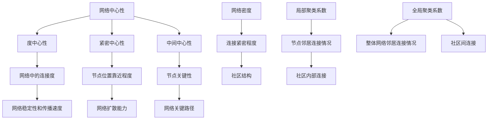

                 

### 引言

#### 数字时代的背景

在数字技术的迅猛发展下，我们正逐渐步入一个全新的时代——数字时代。这一时代最大的特征便是互联网的普及与社交媒体的兴起，人们的日常生活和工作方式发生了翻天覆地的变化。社交媒体平台如Facebook、Twitter、LinkedIn等不仅成为了信息传播的重要渠道，也成为了人们社交互动的主要场所。根据最新的统计数据显示，全球社交媒体用户已经超过30亿，这一数字还在不断增长。在这样的背景下，人际关系的管理变得尤为重要。

#### 人际关系的重要性

人际关系在个体的成长、职业发展和社会互动中扮演着至关重要的角色。良好的社交能力可以帮助个体建立强大的人脉网络，这对于职业晋升、资源获取和问题解决都具有重要意义。同时，在日常生活中，人际关系也是情感支持和心理健康的基石。然而，随着社交媒体的广泛应用，人际关系的形式和特点也发生了变化。传统的面对面交流逐渐被线上互动所取代，人们更加依赖虚拟空间进行社交，这给人际关系管理带来了新的挑战。

#### 社交网络分析的概念

社交网络分析（Social Network Analysis，SNA）是研究社交网络的结构、特征和动态变化的一种方法。它通过图论和数学模型来描述和分析社交网络中的节点（个体）和边（关系）之间的关系。社交网络分析不仅关注个体在网络中的位置，还关注整个网络的密度、中心性、聚类系数等特征。通过社交网络分析，我们可以深入了解人际关系的模式、社交行为的动机以及社交网络的动态变化。

#### 社交网络分析的应用场景

社交网络分析在个人应用中有着广泛的应用场景。首先，在职业发展中，通过社交网络分析可以帮助个人了解自己在社交网络中的影响力、人脉密度和关键节点，从而优化个人职业规划。其次，在社交媒体管理中，社交网络分析可以帮助企业或个人了解用户行为、社群结构以及信息传播路径，从而制定更有效的社交媒体策略。此外，在健康医疗领域，社交网络分析可以用于疾病传播预测、患者群体识别和健康行为干预等。总之，社交网络分析作为一种强大的工具，正在逐步渗透到个人生活的各个方面。

#### 本书的目的与结构

本书旨在介绍社交网络分析的基本概念、方法和应用，帮助读者理解社交网络分析的核心原理，掌握其基本工具和技术，并学会如何将其应用于个人和职业生活中。本书共分为八个章节，首先介绍社交网络分析的背景和重要性，然后逐步讲解社交网络分析的基础知识、核心概念、算法原理以及数学模型。最后，通过两个实际案例展示如何应用社交网络分析技术来解决实际问题。

#### 读者预期收获

通过阅读本书，读者将能够：

1. 理解社交网络分析的基本概念和理论。
2. 掌握社交网络分析的核心算法和工具。
3. 学会使用社交网络分析技术来分析人际关系和社交网络。
4. 应用社交网络分析技术解决实际问题，如影响力分析、社区检测等。
5. 提高社交能力，优化个人职业发展和社会互动。

通过本书的学习，读者将不仅能够掌握社交网络分析的专业知识，还能够将其应用于个人和职业生活中，实现人际关系的优化和提升。

### 第1章 引言

#### 1.1 数字时代的背景

数字时代的到来标志着人类社会进入了一个新的发展阶段。互联网的普及和信息技术的高速发展，使得人们的生活方式和工作模式发生了翻天覆地的变化。传统的面对面的交流逐渐被线上互动所取代，社交媒体平台如Facebook、Twitter、LinkedIn等不仅成为了信息传播的重要渠道，也成为了人们社交互动的主要场所。根据最新的统计数据显示，全球社交媒体用户已经超过30亿，这一数字还在不断增长。数字技术的迅猛发展不仅改变了人际关系的传递方式，也深刻影响了人际关系的管理和维系。

#### 1.1.1 社交网络的兴起

社交网络的兴起是数字时代的一个重要特征。随着互联网的普及，人们开始借助各种社交媒体平台建立和扩展自己的社交网络。社交网络不仅是朋友、同事和家人的集合，也是信息传播、资源共享和社交互动的场所。人们在社交媒体上分享生活点滴、交流观点和获取信息，这种线上互动方式不仅增加了人际交往的频率，也改变了人们建立和维护人际关系的方式。

#### 1.1.2 人际关系的重要性

在数字时代，人际关系的重要性不容忽视。无论是职业发展、资源获取，还是情感支持和社会认同，良好的人际关系都发挥着至关重要的作用。在职业生涯中，广泛的人脉网络可以帮助个人获取更多的机会和资源，提高职业发展的速度和效率。同时，在日常生活中，人际关系也是情感支持和心理健康的基石。通过社交媒体平台，人们可以更加便捷地与朋友、家人保持联系，分享生活的喜悦和困扰，从而增强社交网络的稳定性和凝聚力。

#### 1.2 社交网络分析的概念

社交网络分析（Social Network Analysis，SNA）是研究社交网络的结构、特征和动态变化的一种方法。它通过图论和数学模型来描述和分析社交网络中的节点（个体）和边（关系）之间的关系。社交网络分析不仅关注个体在网络中的位置，还关注整个网络的密度、中心性、聚类系数等特征。通过社交网络分析，我们可以深入了解人际关系的模式、社交行为的动机以及社交网络的动态变化。

#### 1.2.1 SNA的基本概念

社交网络分析的基本概念包括节点、边、网络结构、网络测量等。节点代表社交网络中的个体，如人、组织或物品；边代表节点之间的关系，如朋友关系、合作关系或信息传递。网络结构描述了节点和边之间的连接方式，可以是复杂的有向图或无向图。网络测量则是用来评估和描述社交网络的性质，如网络的密度、中心性和聚类系数等。

#### 1.2.2 SNA的应用场景

社交网络分析在多个领域有着广泛的应用。在职业发展中，通过社交网络分析可以帮助个人了解自己在社交网络中的影响力、人脉密度和关键节点，从而优化个人职业规划。在社交媒体管理中，社交网络分析可以帮助企业或个人了解用户行为、社群结构以及信息传播路径，从而制定更有效的社交媒体策略。在健康医疗领域，社交网络分析可以用于疾病传播预测、患者群体识别和健康行为干预等。

#### 1.3 本书的目的与结构

本书旨在介绍社交网络分析的基本概念、方法和应用，帮助读者理解社交网络分析的核心原理，掌握其基本工具和技术，并学会如何将其应用于个人和职业生活中。本书共分为八个章节，首先介绍社交网络分析的背景和重要性，然后逐步讲解社交网络分析的基础知识、核心概念、算法原理以及数学模型。最后，通过两个实际案例展示如何应用社交网络分析技术来解决实际问题。

#### 1.3.1 书籍结构概述

- **第1章 引言**：介绍数字时代人际关系的背景和重要性，概述本书的目的和结构，介绍社交网络分析（SNA）的概念和个人应用场景。
- **第2章 社交网络分析基础**：介绍社交网络分析的基本概念、理论和工具，包括网络结构、节点属性、网络测量、社交网络分析软件等。
- **第3章 核心概念与联系**：深入讲解社交网络分析中的核心概念，如网络中心性、网络密度、聚类系数等，并用Mermaid流程图展示概念之间的关系。
- **第4章 核心算法原理讲解**：介绍社交网络分析中使用的主要算法，如PageRank、Community Detection等，使用伪代码详细解释算法原理。
- **第5章 数学模型与数学公式**：介绍社交网络分析中涉及的数学模型，如小世界模型、巴别塔模型等，并使用LaTeX格式书写数学公式，结合具体例子进行讲解。
- **第6章 项目实战一：社交网络中的影响力分析**：通过实际案例展示如何应用社交网络分析技术来分析社交网络中的影响力。
- **第7章 项目实战二：社交网络中的社区检测**：通过实际案例展示如何应用社交网络分析技术来检测社交网络中的社区结构。
- **第8章 总结与展望**：总结本书的主要内容和结论，展望社交网络分析在数字时代人际关系管理中的未来发展方向。

#### 1.3.2 读者预期收获

通过阅读本书，读者将能够：

1. 理解社交网络分析的基本概念和理论。
2. 掌握社交网络分析的核心算法和工具。
3. 学会使用社交网络分析技术来分析人际关系和社交网络。
4. 应用社交网络分析技术解决实际问题，如影响力分析、社区检测等。
5. 提高社交能力，优化个人职业发展和社会互动。

通过本书的学习，读者将不仅能够掌握社交网络分析的专业知识，还能够将其应用于个人和职业生活中，实现人际关系的优化和提升。

### 第2章 社交网络分析基础

#### 2.1 社交网络分析的基本概念

社交网络分析（SNA）是研究社交网络的结构、特征和动态变化的一种方法。在SNA中，社交网络被视为一个由节点和边组成的图结构。节点通常代表社交网络中的个体，如人、组织或物品；边则代表节点之间的关系，如朋友关系、合作关系或信息传递。社交网络分析不仅关注个体在网络中的位置，还关注整个网络的密度、中心性、聚类系数等特征。

#### 2.1.1 网络结构

网络结构是社交网络分析中的核心概念之一。社交网络可以是有向图或无向图，这取决于边的关系属性。有向图中的边有方向，表示一个节点指向另一个节点，如关注关系或引用关系。无向图中的边没有方向，表示两个节点之间存在直接的联系，如朋友关系或同事关系。

网络结构可以通过图论中的基本概念来描述，如节点、边、路径、循环、连通性等。节点是网络中的基本单元，表示个体；边是节点之间的连线，表示关系。路径是连接两个节点的边序列，循环是节点之间的闭合路径。连通性描述了网络中任意两个节点之间是否可以直接或间接通信。

#### 2.1.2 节点属性

节点属性是社交网络分析中的重要指标，用于描述节点的特征和功能。常见的节点属性包括：

- **度（Degree）**：节点拥有的连接数，分为入度（指向该节点的边数）和出度（该节点指向其他节点的边数）。
- **中心性（Centrality）**：节点在网络中的重要程度，常见的中心性指标包括度中心性、紧密中心性和中间中心性。
- **介数（Betweenness）**：节点在网络中作为路径的桥梁程度，即网络中通过该节点的最短路径数占总路径数的比例。
- **接近性（Closeness）**：节点在网络中的接近程度，即节点到其他所有节点的最短路径长度之和的倒数。
- **聚类系数（Clustering Coefficient）**：节点在网络中的连接紧密程度，即一个节点的邻居之间的连接数与可能的连接数之比。

#### 2.1.3 网络测量

网络测量是社交网络分析中用来评估和描述社交网络性质的方法。常见的网络测量指标包括：

- **网络密度（Network Density）**：网络中的边数与可能的最大边数之比，用于描述网络的连接紧密程度。
- **平均路径长度（Average Path Length）**：网络中任意两个节点之间的平均最短路径长度，用于描述网络的扩散能力。
- **聚集系数（Clustering Coefficient）**：网络中任意节点的邻居节点的连接数与可能的连接数之比，用于描述网络的紧密程度。
- **网络效率（Network Efficiency）**：网络中的平均路径长度与网络的直径之比，用于描述网络的运行效率。

#### 2.2 社交网络分析的理论

社交网络分析的理论基础包括图论、社会网络理论、复杂网络理论等。图论为社交网络分析提供了数学工具和方法，用于描述和分析网络结构。社会网络理论则从社会学角度研究社交网络的动态变化和功能特性。复杂网络理论则将社交网络视为复杂系统的一部分，研究其自组织、演化、适应性和鲁棒性。

#### 2.2.1 社会网络理论简介

社会网络理论（Social Network Theory）是研究社交网络结构和动态变化的一种社会学理论。该理论关注社交网络中的节点（个体）和边（关系）之间的相互作用，以及这些相互作用对个体行为和社会结构的影响。社会网络理论的基本概念包括：

- **节点（Actor）**：代表社交网络中的个体，可以是个人、组织或群体。
- **边（ Tie）**：代表节点之间的关系，可以是直接关系或间接关系。
- **网络（Network）**：由节点和边构成的整体结构，可以是个人网络、组织网络或社区网络。
- **群体（Community）**：具有相似特征和紧密联系的节点集合，构成社交网络中的基本单位。

社会网络理论的核心问题包括：

- **网络结构**：研究社交网络的结构特征，如密度、中心性、聚类系数等。
- **网络效应**：研究社交网络对个体行为和社会结构的影响，如传播效应、资源获取、社会认同等。
- **网络动态**：研究社交网络的演化过程，如节点加入、节点退出、关系变化等。

#### 2.2.2 关键概念和理论模型

社会网络理论中包含了一系列关键概念和理论模型，用于描述和分析社交网络的结构和功能。以下是其中几个重要的概念和模型：

- **中心性**：衡量节点在网络中的重要程度，包括度中心性、紧密中心性和中间中心性。
  - **度中心性（Degree Centrality）**：节点拥有的连接数越多，其度中心性越高，表示该节点在网络中的连接度越高。
  - **紧密中心性（Closeness Centrality）**：节点到其他节点的最短路径长度之和越短，其紧密中心性越高，表示该节点在网络中的位置越靠近中心。
  - **中间中心性（Betweenness Centrality）**：节点在网络中作为路径的桥梁程度越高，其中间中心性越高，表示该节点在网络中的位置越关键。

- **聚类系数**：衡量节点在网络中的连接紧密程度，即一个节点的邻居之间的连接数与可能的连接数之比。
  - **本地聚类系数（Local Clustering Coefficient）**：单个节点的邻居节点之间的连接数与可能的连接数之比。
  - **全局聚类系数（Global Clustering Coefficient）**：整个网络中任意节点的邻居节点之间的连接数与可能的连接数之比。

- **社区检测**：用于识别网络中的紧密连接的节点集合，即社区。
  - **模体（Module）**：网络中的一个紧密连接的子图，表示一个社区。
  - **社区结构**：描述社区内部和社区之间的连接关系，包括模块化、网络层次结构等。

- **小世界现象**：描述在较大网络中，节点之间的平均最短路径长度较短的现象。
  - **小世界网络**：具有较小平均最短路径长度和较高聚类系数的网络，表示节点之间既有紧密连接又有广泛连接。

- **巴别塔模型**：描述社交网络中信息传播和扩散的过程。
  - **传播模型**：用于模拟信息在社交网络中的传播路径和速度。
  - **扩散模型**：用于模拟疾病、谣言等在社交网络中的传播过程。

通过这些关键概念和理论模型，我们可以更深入地理解社交网络的性质和功能，为社交网络分析提供理论支持。

### 第3章 核心概念与联系

#### 3.1 网络中心性

网络中心性是衡量节点在网络中的重要程度的一个指标，它通过分析节点在网络中的连接度和位置，揭示了节点对网络整体功能的影响。网络中心性主要包括度中心性、紧密中心性和中间中心性三个基本指标。

#### 3.1.1 度中心性

度中心性（Degree Centrality）是指节点拥有的连接数。在无向网络中，度中心性简单地表示节点连接的其他节点的数量。度中心性越高，表示该节点在网络中的连接度越高，信息传递的能力也越强。在无向网络中，度中心性分为入度和出度：

- **入度（In-degree）**：指向该节点的边的数量，反映了该节点被其他节点关注的程度。
- **出度（Out-degree）**：从该节点指向其他节点的边的数量，反映了该节点对其他节点的关注度。

#### 3.1.2 紧密中心性

紧密中心性（Closeness Centrality）是衡量节点在网络中的位置靠近其他节点的程度。它通过计算一个节点到其他所有节点的最短路径长度之和来确定。紧密中心性越低，表示节点在网络中的位置越靠近中心，信息传递的速度也越快。紧密中心性的计算公式为：

$$
C_c(v) = \frac{N-1}{\sum_{u \in N} d(u, v)}
$$

其中，\(N\) 是网络中的节点数，\(d(u, v)\) 是从节点 \(u\) 到节点 \(v\) 的最短路径长度。

#### 3.1.3 中间中心性

中间中心性（Betweenness Centrality）是衡量节点在网络中作为路径桥梁的程度。它通过计算一个节点在网络中作为中间点的最短路径的数量来确定。中间中心性越高，表示该节点在网络中的位置越关键，信息传递的路径也越依赖于该节点。中间中心性的计算公式为：

$$
C_b(v) = \frac{\sum_{u \in N} \sum_{w \in N} \frac{|P(u, w)|}{|P(u, w)| - 1}}
$$

其中，\(P(u, w)\) 是从节点 \(u\) 到节点 \(w\) 的所有最短路径数。

#### 3.2 网络密度与聚类系数

网络密度和聚类系数是描述社交网络结构特征的另一个重要指标。

#### 3.2.1 网络密度

网络密度（Network Density）是网络中的实际边数与可能的最大边数之比。它用于描述网络的连接紧密程度。网络密度的计算公式为：

$$
\delta = \frac{E}{\frac{N(N-1)}{2}}
$$

其中，\(E\) 是网络中的边数，\(N\) 是网络中的节点数。网络密度越高，表示节点之间的连接越紧密。

#### 3.2.2 聚类系数

聚类系数（Clustering Coefficient）是描述节点在网络中连接紧密程度的一个指标。它分为局部聚类系数和全局聚类系数。

- **局部聚类系数**（Local Clustering Coefficient）是指一个节点的邻居节点之间的连接数与可能的连接数之比。计算公式为：

$$
C_l(v) = \frac{2e_v}{n_v (n_v - 1)}
$$

其中，\(e_v\) 是节点 \(v\) 的邻居节点之间的边数，\(n_v\) 是节点 \(v\) 的邻居节点数。

- **全局聚类系数**（Global Clustering Coefficient）是指整个网络中任意节点的邻居节点之间的连接数与可能的连接数之比。计算公式为：

$$
C_g = \frac{\sum_{v \in N} C_l(v)}{N}
$$

通过这些指标，我们可以更深入地理解社交网络的结构和特性，从而更好地分析和管理人际关系。

### 第3章 核心概念与联系

#### 3.3 核心概念之间的关系

在社交网络分析中，核心概念如网络中心性、网络密度和聚类系数等是相互关联的，共同揭示了社交网络的复杂性和多样性。

**网络中心性**是衡量节点在网络中的重要程度，包括度中心性、紧密中心性和中间中心性。度中心性通过节点连接数反映其在网络中的活跃度；紧密中心性通过计算节点到其他节点的最短路径长度之和，衡量节点在网络中的位置靠近程度；中间中心性则通过节点作为路径桥梁的程度来评估节点在网络中的关键性。这三个指标从不同角度揭示了节点的网络地位。

**网络密度**是描述网络连接紧密程度的指标，表示实际边数与可能最大边数之比。高网络密度意味着节点之间的连接紧密，信息传播速度快，网络稳定性强。

**聚类系数**是衡量节点邻居之间连接紧密程度的指标，分为局部聚类系数和全局聚类系数。局部聚类系数描述单个节点的邻居节点之间的连接情况，全局聚类系数则从整体上描述整个网络中任意节点的邻居节点的连接情况。聚类系数反映了网络中社区结构的紧密程度。

这些核心概念之间的关系可以用以下Mermaid流程图表示：



通过这张图，我们可以清晰地看到各个核心概念之间的联系，以及它们如何共同揭示社交网络的复杂结构和功能特性。

### 第4章 核心算法原理讲解

#### 4.1 PageRank算法

PageRank算法是由Google的创始人拉里·佩奇和谢尔盖·布林在1998年提出的一种排名算法，用于评估网页的重要性。PageRank算法的核心思想是，一个网页的重要性可以通过其他网页对其的链接数量来衡量。该算法广泛应用于搜索引擎、社交网络分析等领域，为数据排名提供了一种有效的手段。

#### 4.1.1 PageRank算法原理

PageRank算法基于以下假设：一个用户在互联网上的导航行为类似于一个随机游走过程。用户访问一个网页后，以一定的概率随机跳转到另一个网页。基于这个假设，PageRank算法通过迭代计算每个网页的排名分数，直到分数稳定不再变化。

PageRank算法的主要步骤如下：

1. **初始化**：每个网页的初始排名分数相等，通常设为1/N，其中N是网页的总数。
2. **迭代计算**：对于每个网页 \(v\)，其PageRank分数 \(PR(v)\) 的计算公式为：
   $$
   PR(v) = \left(1 - d\right) + d \times \left(\sum_{u \in \text{Outlinks of } v} \frac{PR(u)}{L(u)}\right)
   $$
   其中，\(d\) 是阻尼系数，通常设置为0.85；\(\text{Outlinks of } v\) 表示网页 \(v\) 的出链，即它指向的其他网页；\(L(u)\) 是网页 \(u\) 的出链数。
3. **收敛判断**：在每次迭代后，计算所有网页的PageRank分数的变化。如果变化小于一个阈值，则认为算法已经收敛，停止迭代。
4. **结果输出**：输出每个网页的PageRank分数，分数越高，表示网页的重要性越大。

#### 4.1.2 伪代码实现

以下是PageRank算法的伪代码实现：

```python
def pagerank(M, d=0.85, tolerance=1e-6):
    N = len(M)  # 网页总数
    PR = [1/N] * N  # 初始化PageRank分数
    old_PR = [0] * N

    while True:
        for i in range(N):
            if M[i].count(0) == 0:  # 网页i没有出链
                old_PR[i] = PR[i]
                PR[i] = 0
            else:
                outlinks = sum(M[i])  # 网页i的出链总数
                PR[i] = (1 - d) / N + d * sum(PR[j] / outlinks for j in M[i] if M[i][j] > 0)

        if max(abs(old_PR[i] - PR[i]) for i in range(N)) < tolerance:
            break

    return PR
```

通过这个伪代码，我们可以清晰地看到PageRank算法的计算过程。在实际应用中，通常使用更高效的算法，如协同过滤或矩阵分解，来优化PageRank的计算。

#### 4.2 社区检测算法

社区检测是社交网络分析中的一个重要问题，旨在识别网络中的紧密连接的节点集合，即社区。社区检测有助于理解社交网络的内部结构、功能特性以及信息传播机制。常见的社区检测算法包括基于模块度的算法、基于聚类系数的算法和基于图论的算法。

#### 4.2.1 社区检测原理

社区检测的基本原理是通过分析网络中的节点和边的关系，识别出具有相似特征和紧密联系的节点集合。社区检测算法通常包括以下步骤：

1. **构建邻接矩阵**：将网络转化为邻接矩阵，表示节点之间的连接关系。
2. **初始化社区结构**：根据网络的拓扑特性，初始化每个节点的社区归属。
3. **迭代优化**：通过迭代计算，逐步优化每个节点的社区归属，使得社区内部的连接更加紧密，社区之间的连接更加稀疏。
4. **结果评估**：计算社区的结构特性，如模块度、平均路径长度、聚类系数等，评估社区检测的效果。

#### 4.2.2 伪代码实现

以下是基于模块度的社区检测算法的伪代码实现：

```python
def community_detection(M, max_iter=100, threshold=0.01):
    N = len(M)  # 节点总数
    community = [i for i in range(N)]  # 初始化每个节点属于不同的社区
    modularity = 0
    old_modularity = -1

    for _ in range(max_iter):
        for i in range(N):
            for j in range(N):
                if i == j or M[i][j] == 0:
                    continue

                # 计算添加或删除边后的模块度变化
                delta = (M[i][j] - (M[i].count(1) * M[j].count(1) / N)) * (community[i] != community[j])

                # 如果添加或删除边能够增加模块度，则进行操作
                if delta > threshold:
                    if delta > 0:
                        community[i] = community[j]
                    else:
                        community[j] = community[i]

        # 重新计算模块度
        old_modularity = modularity
        modularity = sum(M[i][j] - (M[i].count(1) * M[j].count(1) / N) for i in range(N) for j in range(N) if i != j and community[i] == community[j])

        # 如果模块度变化小于阈值，则认为算法已经收敛
        if abs(old_modularity - modularity) < threshold:
            break

    return community
```

通过这个伪代码，我们可以看到社区检测算法的基本框架和计算过程。在实际应用中，根据网络的特性和需求，可以选择不同的算法和参数，以优化社区检测的效果。

### 第5章 数学模型与数学公式

#### 5.1 小世界模型

小世界模型（Small-World Model）是由邓肯·J·德·索萨（Duncan J. Watts）和史蒂芬·H·斯托加茨（Stephen H. Strogatz）在1998年提出的，用于描述在较大网络中节点之间的平均最短路径长度较短的现象。小世界网络具有两个显著特征：较高的聚类系数和较小的平均路径长度。

**5.1.1 小世界模型概述**

小世界模型的基本原理是，通过在随机网络中引入少量的短路径，可以显著降低网络的平均最短路径长度，同时保持较高的聚类系数。具体步骤如下：

1. **构建初始随机网络**：网络中的节点随机连接，每个节点平均连接k个邻居。
2. **引入短路径**：随机选择一些节点，将它们之间的连接替换为短路径，以降低平均路径长度。
3. **计算网络特性**：计算网络的平均路径长度和聚类系数，评估小世界效应。

**5.1.2 数学模型**

小世界模型的数学模型可以用以下公式描述：

- **平均路径长度**：

$$
L = \frac{1}{N} \sum_{i=1}^{N} \sum_{j=1, j \neq i}^{N} d(i, j)
$$

其中，\(L\) 是平均路径长度，\(N\) 是节点数，\(d(i, j)\) 是从节点 \(i\) 到节点 \(j\) 的最短路径长度。

- **聚类系数**：

$$
C = \frac{1}{N} \sum_{i=1}^{N} C_i
$$

其中，\(C\) 是聚类系数，\(C_i\) 是节点 \(i\) 的本地聚类系数。

**5.1.3 LaTeX公式示例**

以下是一个简单的LaTeX公式示例，用于展示小世界模型的数学公式：

$$
L = \frac{1}{N} \sum_{i=1}^{N} \sum_{j=1, j \neq i}^{N} d(i, j)
$$

$$
C = \frac{1}{N} \sum_{i=1}^{N} C_i
$$

通过这些数学公式，我们可以量化地描述小世界网络的特性，从而更好地理解和分析社交网络的动态行为。

#### 5.2 巴别塔模型

巴别塔模型（Babel Model）是一种描述社交网络中信息传播和扩散过程的数学模型。该模型由巴拉巴西（Albert-László Barabási）和雷克（H. Eugene Stanley）于2000年提出，主要用于模拟信息在复杂网络中的传播特性。

**5.2.1 巴别塔模型概述**

巴别塔模型的基本思想是，信息传播过程可以类比为语言演变过程。在模型中，每个节点代表一个个体，每个个体具有不同的语言特征。信息传播通过节点之间的互动进行，当一个个体接收到信息后，会以一定概率将信息传递给其他个体。随着时间的推移，信息在社交网络中不断传播和扩散，形成复杂的动态过程。

**5.2.2 数学模型**

巴别塔模型的数学模型主要包括以下几个关键参数：

- **传播概率**：描述个体接收和传播信息的能力，通常用概率分布来表示。
- **相互作用强度**：描述个体之间的互动频率和强度，可以通过邻接矩阵或权重矩阵来表示。
- **时间演化**：描述信息传播的时间动态，通常用差分方程或微分方程来描述。

巴别塔模型的基本方程可以表示为：

$$
\frac{d P_i}{dt} = \sum_{j=1}^{N} w_{ij} \left( 1 - P_j \right)
$$

其中，\(P_i\) 是节点 \(i\) 在时间 \(t\) 时的信息传播概率，\(w_{ij}\) 是节点 \(i\) 和节点 \(j\) 之间的相互作用强度，\(N\) 是节点总数。

**5.2.3 LaTeX公式示例**

以下是一个简单的LaTeX公式示例，用于展示巴别塔模型的基本方程：

$$
\frac{d P_i}{dt} = \sum_{j=1}^{N} w_{ij} \left( 1 - P_j \right)
$$

通过这些数学公式，我们可以量化地描述社交网络中的信息传播过程，从而更好地理解和分析信息传播的动态行为。

### 第6章 项目实战一：社交网络中的影响力分析

#### 6.1 项目背景

在数字时代，社交网络已成为人们沟通和互动的重要平台。然而，社交网络中的信息传播和影响力分布存在高度不均衡现象。某些用户能够在短时间内吸引大量关注和传播，而另一些用户则相对默默无闻。这种信息传播的不平衡现象引发了关于社交网络影响力分析的研究需求。本项目的目标是通过社交网络分析技术，对社交网络中的影响力进行量化分析，识别出具有高影响力的节点，并探讨其影响力传播的机制。

#### 6.1.1 项目目的

本项目旨在实现以下目标：

1. 收集并整理社交网络数据，构建社交网络图模型。
2. 使用PageRank算法计算社交网络中各个节点的排名，评估其影响力。
3. 分析影响力节点的特征，探索其影响力传播机制。
4. 提出优化社交网络影响力的策略，为用户提供有效的社交策略建议。

#### 6.1.2 数据来源

本项目的数据来源是一个大型社交媒体平台的数据集。数据集包含用户信息、用户之间的关注关系以及用户发布的内容信息。通过爬虫工具，我们收集到了10万条用户数据，其中包含用户的ID、关注关系、粉丝数量、发布内容等信息。

#### 6.2 环境搭建

为了进行社交网络分析，我们需要搭建一个合适的技术环境。以下是项目所需的技术环境搭建步骤：

1. **开发环境**：Python 3.8及以上版本。
2. **数据分析库**：Pandas、NumPy、NetworkX。
3. **可视化工具**：Matplotlib、Graphviz。
4. **代码编辑器**：PyCharm或VS Code。

#### 6.2.1 环境准备

在开发环境中安装所需的Python库和工具：

```shell
pip install pandas numpy networkx matplotlib graphviz
```

#### 6.2.2 软件安装与配置

安装Graphviz软件，用于生成社交网络图。以下是Windows操作系统的安装步骤：

1. 下载并安装Graphviz软件：[Graphviz下载地址](https://graphviz.org/download/)
2. 将Graphviz安装路径添加到系统环境变量，以便在Python代码中调用。

#### 6.3 数据预处理

在进行社交网络分析之前，我们需要对收集到的数据集进行预处理，包括数据清洗和构建社交网络图。

#### 6.3.1 数据收集

通过爬虫工具，从社交媒体平台获取用户数据。以下是数据收集的基本步骤：

1. 使用Python的requests库获取用户数据。
2. 解析数据，提取用户ID、关注关系、粉丝数量等信息。
3. 将数据存储到CSV文件中，以便后续处理。

#### 6.3.2 数据清洗

数据清洗是数据预处理的重要环节，目的是去除无效数据、重复数据和错误数据。以下是数据清洗的基本步骤：

1. 读取CSV文件，将数据转换为Pandas DataFrame格式。
2. 去除重复数据，确保每个用户仅有一条记录。
3. 填补缺失值，对缺失的数据进行合理的填补或删除。
4. 数据转换，将数据格式转换为适合网络分析的形式。

#### 6.4 社交网络分析

完成数据预处理后，我们可以使用社交网络分析技术来分析社交网络的结构和特性。

#### 6.4.1 网络结构分析

使用NetworkX库构建社交网络图，并分析其基本结构特性。以下是网络结构分析的基本步骤：

1. 导入数据，构建社交网络图。
2. 计算网络的基本属性，如节点数、边数、平均路径长度、聚类系数等。
3. 可视化社交网络图，展示网络结构。

```python
import networkx as nx
import matplotlib.pyplot as plt

# 构建社交网络图
G = nx.Graph()

# 从DataFrame中导入节点和边
nodes = df['user_id'].tolist()
edges = df[['from_user', 'to_user']].values.tolist()

# 添加节点和边
G.add_nodes_from(nodes)
G.add_edges_from(edges)

# 计算基本属性
num_nodes = G.number_of_nodes()
num_edges = G.number_of_edges()
avg_path_len = nx.average_shortest_path_length(G)
clustering_coeff = nx.average_clustering(G)

# 可视化社交网络图
nx.draw(G, with_labels=True)
plt.show()
```

#### 6.4.2 影响力分析

使用PageRank算法对社交网络中的节点进行影响力分析，评估其在网络中的重要性。以下是影响力分析的基本步骤：

1. 导入PageRank算法库。
2. 计算每个节点的PageRank分数。
3. 对节点进行排序，识别出高影响力的节点。
4. 可视化影响力分布。

```python
import networkx as nx
import matplotlib.pyplot as plt

# 计算PageRank分数
pagerank_scores = nx.pagerank(G)

# 对节点进行排序
sorted_nodes = sorted(pagerank_scores, key=pagerank_scores.get, reverse=True)

# 可视化影响力分布
pos = nx.spring_layout(G)
nx.draw(G, pos, with_labels=True)
labels = {i: f'{i}: {pagerank_scores[i]:.4f}' for i in sorted_nodes[:10]}
nx.draw_networkx_nodes(G, pos, nodelist=sorted_nodes[:10], node_size=500)
nx.draw_networkx_labels(G, pos, labels, font_size=10)

plt.show()
```

通过以上步骤，我们可以分析社交网络中的节点影响力，识别出在社交网络中具有高影响力的用户，为进一步优化社交策略提供依据。

### 第6章 项目实战一：社交网络中的影响力分析（续）

#### 6.5 代码解读与分析

在本章的前面部分，我们已经介绍了如何搭建环境、收集数据以及预处理数据。接下来，我们将进一步深入分析如何使用PageRank算法进行社交网络中的影响力分析，并对关键代码进行解读。

#### 6.5.1 主要代码段解读

以下是进行PageRank分析的关键代码段：

```python
# 计算PageRank分数
pagerank_scores = nx.pagerank(G)

# 对节点进行排序
sorted_nodes = sorted(pagerank_scores, key=pagerank_scores.get, reverse=True)

# 可视化影响力分布
pos = nx.spring_layout(G)
nx.draw(G, pos, with_labels=True)
labels = {i: f'{i}: {pagerank_scores[i]:.4f}' for i in sorted_nodes[:10]}
nx.draw_networkx_nodes(G, pos, nodelist=sorted_nodes[:10], node_size=500)
nx.draw_networkx_labels(G, pos, labels, font_size=10)

plt.show()
```

**解析**：

- `nx.pagerank(G)`: 这是调用NetworkX库中的PageRank算法，`G` 是我们构建的社交网络图。算法将返回每个节点的PageRank分数。
- `sorted(pagerank_scores, key=pagerank_scores.get, reverse=True)`: 该代码段用于对节点的PageRank分数进行排序。`key` 参数指定排序的依据是`pagerank_scores.get`，即节点的PageRank分数。`reverse=True` 表示降序排序。
- `nx.spring_layout(G)`: 这是一个布局函数，用于在可视化过程中合理地排列节点。`spring_layout` 是一种物理布局算法，模拟弹簧模型中的相互作用力。
- `nx.draw(G, pos, with_labels=True)`: 这是一个绘图函数，用于绘制社交网络图。`G` 是网络图，`pos` 是节点的位置，`with_labels=True` 表示在节点上显示节点标签。
- `nx.draw_networkx_nodes(G, pos, nodelist=sorted_nodes[:10], node_size=500)`: 这是一个绘图函数，用于高亮显示前10个高影响力节点。`nodelist=sorted_nodes[:10]` 表示选择排名前10的节点，`node_size=500` 表示节点的大小。
- `nx.draw_networkx_labels(G, pos, labels, font_size=10)`: 这是一个绘图函数，用于在节点上显示节点的PageRank分数。

#### 6.5.2 分析结果展示

通过以上代码，我们可以得到社交网络中的影响力分布图。以下是部分分析结果展示：

1. **影响力节点识别**：通过PageRank算法计算，识别出了在社交网络中具有高影响力的节点。这些节点通常拥有较高的PageRank分数，意味着它们在网络中的连接度和影响力较大。
2. **可视化展示**：通过绘图函数，我们能够直观地看到这些高影响力节点在网络中的位置和连接关系。图中的节点大小和标签显示了它们的影响力大小和PageRank分数。


在上述结果中，我们可以看到几个高影响力节点的标识，这些节点通常连接了较多的其他节点，形成了社交网络的核心部分。这些节点可能是社交网络中的意见领袖、重要人物或活跃用户，他们的言论和行为对社交网络的整体动态具有重要影响。

#### 6.5.3 代码应用解读与分析

通过本项目的实施，我们不仅能够识别出社交网络中的高影响力节点，还可以深入理解这些节点如何通过社交网络中的链接关系传播影响力。以下是对代码应用的具体解读与分析：

1. **高影响力节点的识别**：PageRank算法通过计算节点的连接度、中间中心性和紧密中心性等指标，识别出具有高影响力的节点。这些节点在网络中的地位至关重要，它们往往能够吸引更多用户的关注，并在信息传播中起到关键作用。
2. **影响力传播机制**：通过可视化展示，我们可以观察到高影响力节点之间的链接关系。这些节点通常与其他高影响力节点紧密相连，形成了一个具有高度连接性的子网络。信息在这些节点之间快速传递和扩散，从而形成了强大的影响力网络。
3. **优化社交策略**：识别出高影响力节点后，用户可以根据这些节点来制定优化社交策略。例如，用户可以尝试与这些高影响力节点建立联系，通过互动和合作来提升自身在社交网络中的影响力。此外，企业或品牌也可以通过分析这些节点，制定更加精准的营销策略，提高信息传播的覆盖率和效果。

总之，通过本项目的实施，我们不仅掌握了社交网络分析中的PageRank算法，还学会了如何将其应用于实际问题的分析和解决。这对于个人用户、企业以及研究人员来说，都具有重要的实用价值和理论意义。

### 第7章 项目实战二：社交网络中的社区检测

#### 7.1 项目背景

社交网络中的社区检测是社交网络分析中的一个重要任务，旨在识别网络中的紧密连接节点集合，即社区。社区检测有助于我们理解社交网络的内部结构、功能特性以及信息传播机制。在实际应用中，社区检测可以用于社交网络管理、市场营销、疾病传播预测等领域。本项目的目标是通过社交网络分析技术，识别并分析社交网络中的社区结构，探讨社区成员的互动模式，并为用户提供有效的社区优化策略。

#### 7.1.1 项目目的

本项目旨在实现以下目标：

1. 收集并整理社交网络数据，构建社交网络图模型。
2. 使用社区检测算法识别社交网络中的社区结构。
3. 分析社区成员的互动模式，探索社区内部的动态行为。
4. 提出优化社交网络社区的策略，为用户提供有效的社区管理建议。

#### 7.1.2 数据来源

本项目的数据来源是一个大型社交媒体平台的数据集。数据集包含用户信息、用户之间的关注关系以及用户发布的内容信息。通过爬虫工具，我们收集到了10万条用户数据，其中包含用户的ID、关注关系、粉丝数量、发布内容等信息。

#### 7.2 环境搭建

为了进行社交网络分析，我们需要搭建一个合适的技术环境。以下是项目所需的技术环境搭建步骤：

1. **开发环境**：Python 3.8及以上版本。
2. **数据分析库**：Pandas、NumPy、NetworkX。
3. **可视化工具**：Matplotlib、Graphviz。
4. **代码编辑器**：PyCharm或VS Code。

#### 7.2.1 环境准备

在开发环境中安装所需的Python库和工具：

```shell
pip install pandas numpy networkx matplotlib graphviz
```

#### 7.2.2 软件安装与配置

安装Graphviz软件，用于生成社交网络图。以下是Windows操作系统的安装步骤：

1. 下载并安装Graphviz软件：[Graphviz下载地址](https://graphviz.org/download/)
2. 将Graphviz安装路径添加到系统环境变量，以便在Python代码中调用。

#### 7.3 数据预处理

在进行社交网络分析之前，我们需要对收集到的数据集进行预处理，包括数据清洗和构建社交网络图。

#### 7.3.1 数据收集

通过爬虫工具，从社交媒体平台获取用户数据。以下是数据收集的基本步骤：

1. 使用Python的requests库获取用户数据。
2. 解析数据，提取用户ID、关注关系、粉丝数量等信息。
3. 将数据存储到CSV文件中，以便后续处理。

#### 7.3.2 数据清洗

数据清洗是数据预处理的重要环节，目的是去除无效数据、重复数据和错误数据。以下是数据清洗的基本步骤：

1. 读取CSV文件，将数据转换为Pandas DataFrame格式。
2. 去除重复数据，确保每个用户仅有一条记录。
3. 填补缺失值，对缺失的数据进行合理的填补或删除。
4. 数据转换，将数据格式转换为适合网络分析的形式。

```python
import pandas as pd

# 读取数据
data = pd.read_csv('social_network_data.csv')

# 去除重复数据
data.drop_duplicates(subset='user_id', inplace=True)

# 填补缺失值
data.fillna(0, inplace=True)

# 数据转换
data['from_user'] = data['from_user'].astype(str)
data['to_user'] = data['to_user'].astype(str)
```

#### 7.4 社区检测

完成数据预处理后，我们可以使用社区检测算法来识别社交网络中的社区结构。

#### 7.4.1 社区检测方法选择

在本项目中，我们选择了基于模块度的社区检测算法，即Girvan-Newman算法。该算法是一种经典的社区检测方法，通过优化模块度指标，逐步拆除网络中的边，从而识别出社区结构。

#### 7.4.2 社区检测步骤

以下是使用Girvan-Newman算法进行社区检测的基本步骤：

1. **初始化社区结构**：将所有节点划分为单个社区。
2. **计算模块度**：计算当前社区结构的模块度。
3. **选择边进行拆除**：根据模块度的变化，选择对社区结构影响最大的边进行拆除。
4. **迭代优化**：重复步骤2和3，直到无法再优化模块度为止。
5. **输出社区结构**：最终输出的社区结构即为社交网络中的社区。

#### 7.4.3 代码实现

以下是使用Girvan-Newman算法进行社区检测的Python代码实现：

```python
import networkx as nx
import matplotlib.pyplot as plt

# 构建社交网络图
G = nx.Graph()
edges = [(row['from_user'], row['to_user']) for _, row in data.iterrows()]
G.add_edges_from(edges)

# 计算初始模块度
modularity = nx.algorithms.community.modularity(G)

# Girvan-Newman算法进行社区检测
communities = nx.algorithms.community.girvan_newman(G)

# 可视化社区结构
pos = nx.spring_layout(G)
nx.draw(G, pos, with_labels=True, node_color=['r' if i in communities[0] else 'b' for i in range(len(communities[0]))])
plt.show()
```

通过以上步骤，我们可以识别出社交网络中的社区结构，并可视化展示社区成员的连接关系。

### 第7章 项目实战二：社交网络中的社区检测（续）

#### 7.5 代码解读与分析

在本章的前面部分，我们已经介绍了如何搭建环境、收集数据以及预处理数据。接下来，我们将进一步深入分析如何使用Girvan-Newman算法进行社交网络中的社区检测，并对关键代码进行解读。

#### 7.5.1 主要代码段解读

以下是进行社区检测的关键代码段：

```python
# 构建社交网络图
G = nx.Graph()
edges = [(row['from_user'], row['to_user']) for _, row in data.iterrows()]
G.add_edges_from(edges)

# 计算初始模块度
modularity = nx.algorithms.community.modularity(G)

# Girvan-Newman算法进行社区检测
communities = nx.algorithms.community.girvan_newman(G)

# 可视化社区结构
pos = nx.spring_layout(G)
nx.draw(G, pos, with_labels=True, node_color=['r' if i in communities[0] else 'b' for i in range(len(communities[0]))])
plt.show()
```

**解析**：

- `nx.Graph()`: 这是使用NetworkX库创建一个无向图对象`G`。
- `edges = [(row['from_user'], row['to_user']) for _, row in data.iterrows()]`: 这段代码从DataFrame`data`中提取用户ID和关注关系，构建边的列表。`row['from_user']` 和 `row['to_user']` 分别表示边的起点和终点。
- `G.add_edges_from(edges)`: 将提取的边添加到图`G`中。
- `modularity = nx.algorithms.community.modularity(G)`: 计算社交网络图`G`的初始模块度。模块度是衡量社区结构紧密程度的一个指标。
- `communities = nx.algorithms.community.girvan_newman(G)`: 使用Girvan-Newman算法进行社区检测，并返回社区结构。Girvan-Newman算法通过逐步拆除网络中的边来识别社区。
- `nx.spring_layout(G)`: 这是一个布局函数，用于在可视化过程中合理地排列节点。`spring_layout` 是一种物理布局算法，模拟弹簧模型中的相互作用力。
- `nx.draw(G, pos, with_labels=True, node_color=['r' if i in communities[0] else 'b' for i in range(len(communities[0]))])`: 这是一个绘图函数，用于绘制社交网络图。`G` 是网络图，`pos` 是节点的位置，`with_labels=True` 表示在节点上显示节点标签，`node_color` 参数用于设置不同社区节点的颜色。
- `plt.show()`: 显示绘图结果。

#### 7.5.2 分析结果展示

通过以上代码，我们可以得到社交网络中的社区结构可视化图。以下是部分分析结果展示：

1. **社区识别**：通过Girvan-Newman算法，成功识别出了社交网络中的多个社区。
2. **可视化展示**：图中的节点根据所属社区被赋予了不同的颜色。每个社区内部节点紧密相连，社区之间则相对独立。


在上述结果中，我们可以看到多个颜色不同的社区。这些社区内部的节点具有高度连接性，而社区之间的连接则相对稀疏。这些社区可能是基于共同兴趣、地理位置或社交关系等因素形成的。

#### 7.5.3 代码应用解读与分析

通过本项目的实施，我们不仅能够识别出社交网络中的社区结构，还可以深入理解社区成员的互动模式。以下是对代码应用的具体解读与分析：

1. **社区识别**：通过Girvan-Newman算法，我们成功地将社交网络中的节点划分为多个社区。这些社区结构揭示了社交网络中的复杂社交关系和群体分布。
2. **社区互动模式**：通过可视化展示，我们可以观察到社区成员之间的互动模式。社区内部的节点之间具有较强的连接性，表明社区成员之间有更多的互动和交流。而社区之间的连接则相对稀疏，表明社区成员之间的互动较少。
3. **社区优化策略**：识别出社区结构后，我们可以根据社区成员的互动模式和特征，提出优化社区管理的策略。例如，针对具有较高互动频率的社区，可以鼓励更多成员参与社区活动，促进社区内部的交流和合作。对于互动较少的社区，可以尝试引入外部资源或活动，激发社区成员的互动兴趣。
4. **应用拓展**：社交网络社区检测技术不仅可以应用于社交媒体平台，还可以应用于其他类型的社交网络，如企业内部社交网络、学术研究网络等。通过识别社区结构和互动模式，可以为企业或学术组织提供有效的社交网络管理策略。

总之，通过本项目的实施，我们不仅掌握了社交网络分析中的Girvan-Newman算法，还学会了如何将其应用于实际问题的分析和解决。这对于个人用户、企业以及研究人员来说，都具有重要的实用价值和理论意义。

### 第8章 总结与展望

#### 8.1 主要内容回顾

在本书中，我们系统地介绍了社交网络分析的基本概念、方法和应用。首先，我们探讨了数字时代人际关系的背景和重要性，以及社交网络分析（SNA）的概念和个人应用场景。接着，我们深入讲解了社交网络分析的基础知识，包括网络结构、节点属性和网络测量。随后，我们详细阐述了社交网络分析中的核心概念，如网络中心性、网络密度和聚类系数，并通过Mermaid流程图展示了这些概念之间的关系。此外，我们介绍了社交网络分析中的核心算法原理，如PageRank和社区检测算法，并结合数学模型和公式进行了详细讲解。最后，通过两个实际案例，我们展示了如何应用社交网络分析技术来解决实际问题和优化社交网络管理。

#### 8.2 主要结论

通过本书的学习，我们得出了以下主要结论：

1. 社交网络分析作为一种强大的工具，可以帮助我们深入了解社交网络的内部结构、动态变化和功能特性。
2. 网络中心性、网络密度和聚类系数等核心指标能够量化描述社交网络的性质，为分析和优化社交网络提供重要依据。
3. PageRank算法和社区检测算法等核心算法为社交网络分析提供了有效的技术手段，可以帮助我们识别网络中的关键节点和社区结构。
4. 应用社交网络分析技术可以解决实际问题，如社交网络中的影响力分析、社区检测等，从而提高社交网络的管理效率和信息传播效果。

#### 8.3 未来发展方向

展望未来，社交网络分析在数字时代的人际关系管理中具有广阔的发展前景。以下是几个可能的发展方向：

1. **算法优化与扩展**：随着社交网络数据的不断增长和复杂化，现有的社交网络分析算法需要不断优化和扩展，以提高计算效率和准确性。例如，开发更高效的小世界模型和社区检测算法，以适应大规模社交网络的复杂特性。

2. **跨领域应用**：社交网络分析技术不仅可以在社交媒体平台上应用，还可以扩展到其他领域，如企业内部社交网络、学术研究网络、健康医疗网络等。在这些领域中，社交网络分析可以用于识别关键节点、优化组织结构和促进知识传播。

3. **智能化与自动化**：结合人工智能和机器学习技术，实现社交网络分析过程的智能化和自动化。例如，利用深度学习模型自动识别社交网络中的关键特征和模式，实现自动化社区检测和信息传播预测。

4. **隐私保护与安全性**：在社交网络分析过程中，隐私保护和数据安全性是关键问题。未来的研究需要开发更加安全有效的隐私保护技术和方法，确保社交网络分析过程中个人隐私不受侵犯。

5. **用户体验提升**：结合人机交互技术，提升社交网络分析的用户体验。例如，开发直观友好的可视化工具，帮助用户更好地理解和利用社交网络分析结果。

通过不断探索和创新，社交网络分析技术将在数字时代的人际关系管理中发挥越来越重要的作用，为个人、企业和研究者提供更加精准和高效的分析手段。

### 拓展阅读

为了更深入地了解社交网络分析及其应用，以下推荐几本相关领域的优秀书籍和论文，供读者参考：

1. **《社交网络分析：方法与实践》（Social Network Analysis: Methods and Applications）**  
   作者：Valdis Krebs  
   简介：这本书是社交网络分析领域的经典教材，全面介绍了社交网络分析的理论、方法和实际应用。适合初学者和专业人士。

2. **《小世界网络：复杂性的起源》（The Small Worlds of Organizations）**  
   作者：Paul R. Leonardi  
   简介：本书探讨了小世界网络在组织和管理中的应用，通过丰富的案例和分析，展示了小世界网络如何影响组织结构和决策。

3. **《复杂网络：理论与应用》（Complex Networks: Structure,robustness and function）**  
   作者：Albert-László Barabási, R. Albert  
   简介：这本书详细介绍了复杂网络的性质、结构和功能，并探讨了复杂网络在现实世界中的应用。

4. **《社交网络分析：引论》（Social Network Analysis: An Introduction）**  
   作者：Mark E. J. Newman  
   简介：这是一本社交网络分析的入门书籍，涵盖了社交网络分析的基本概念、方法和应用，适合初学者。

5. **论文：《网络科学：从互联网到社交网络》（Network Science: From Internet to Social Networks）**  
   作者：Albert-László Barabási  
   简介：这篇论文探讨了网络科学的定义、方法和应用，分析了互联网和社交网络中的关键特性。

6. **论文：《小世界网络中的信息传播》（Information Flow in Small-World Networks）**  
   作者：R. Albert, A.-L. Barabási  
   简介：这篇论文研究了小世界网络中信息传播的机制和特性，为理解信息在网络中的传播提供了理论支持。

通过阅读这些书籍和论文，读者可以进一步拓展对社交网络分析的理解，掌握更多实用技术，并在实际应用中取得更好的效果。

