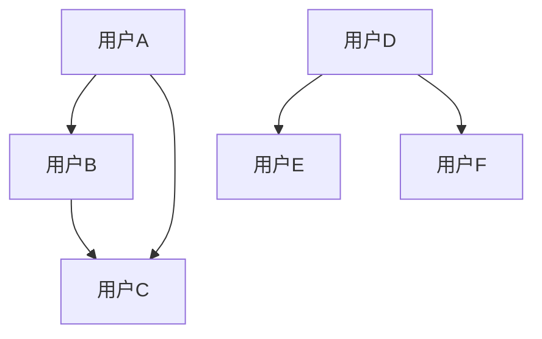

                 

### 摘要

本文以《数字时代的人际网络：线上社群与线下交往的融合》为题，深入探讨了数字时代背景下人际网络的发展及其对社交方式的影响。在数字技术的驱动下，线上社群和线下交往逐渐融合，成为现代人际网络的重要组成部分。文章首先概述了数字时代人际网络的发展历程，分析了线上社群的兴起及其与线下交往的融合趋势。接着，通过核心概念与联系的分析，明确了人际网络的定义、类型及其在社交网络分析中的基础。本文还详细阐述了社交网络平台技术、数据挖掘与推荐系统以及聊天机器人与虚拟助手等技术在人际网络中的应用原理。在实践部分，文章通过线上社群的构建、互动与数据分析，以及线下交往的数字化转型，展示了如何在数字时代构建高效和紧密的人际网络。案例分析部分则通过具体实例，深入剖析了线上社群与线下交往融合的成功实践。最后，文章对未来技术趋势与发展策略进行了展望，提出了相关建议和注意事项。通过本文的深入分析，读者可以全面了解数字时代人际网络的现状、挑战及未来发展，为构建更加有效的人际网络提供理论依据和实践指导。

### 文章关键词

数字时代、人际网络、线上社群、线下交往、融合、社交网络分析、平台技术、数据挖掘、推荐系统、聊天机器人、虚拟助手、数字化转型、案例分析、未来展望。

### 关键词解释

#### 数字时代

“数字时代”指的是信息技术的迅猛发展对人类社会各个领域产生深远影响的时期。在这个时代，数字技术不仅改变了信息传播和获取的方式，也深刻影响了人际交往的形态。互联网、移动通信、大数据、人工智能等技术的发展，使得人们可以通过数字平台进行即时、高效、多样化的社交活动，从而形成了与以往截然不同的数字人际网络。

#### 人际网络

“人际网络”是指由个体及其社交关系构成的复杂网络系统。它包括个人之间的直接联系，如亲朋好友，也包括通过多级关系间接联系到的社会关系网络。人际网络在现代社会中扮演着重要的角色，不仅影响个体的社交行为和心理健康，还对信息传播、资源获取和职业发展等方面产生深远影响。

#### 线上社群

“线上社群”是指通过互联网平台聚集起来的人群，他们基于共同兴趣、目标或价值观，通过社交媒体、论坛、聊天室等线上工具进行交流和互动。线上社群的兴起改变了人们的社交方式，使得人与人之间的距离变得更加紧密，同时也提供了更多的交流机会和社交资源。

#### 线下交往

“线下交往”指的是人们在现实生活中的面对面互动，包括社交聚会、商务会谈、文化活动等。线下交往虽然受时间和空间的限制，但它在建立深度信任、增强关系黏性方面具有不可替代的作用。

#### 融合

“融合”指的是线上社群与线下交往的相互结合，形成一个更加丰富和多样的人际网络。这种融合不仅扩展了人们的社交范围，也提升了人际交往的质量和效果。通过线上与线下的结合，人们可以在虚拟和现实两个层面进行互动，从而实现人际关系的最大化拓展和深化。

#### 社交网络分析

“社交网络分析”是研究社交网络结构、行为和属性的科学方法。通过分析社交网络中的节点、边、集群、社区结构等特征，可以揭示人际关系的模式与规律，为社交平台的设计、运营和优化提供数据支持。

#### 平台技术

“平台技术”是指支持线上社群和社交网络运行的底层技术体系，包括服务器架构、数据存储、消息推送、用户界面设计等。平台技术的先进性和稳定性直接影响着社群的运营效果和用户体验。

#### 数据挖掘与推荐系统

“数据挖掘与推荐系统”是利用大数据技术和算法，从海量用户行为数据中提取有价值的信息，并基于用户兴趣和偏好，为其推荐相关内容、服务或商品。这些技术在提升用户满意度和社群活跃度方面发挥着重要作用。

#### 聊天机器人与虚拟助手

“聊天机器人与虚拟助手”是利用人工智能技术实现的人机交互工具，能够通过自然语言处理、语音识别等技术，与用户进行实时对话，提供信息查询、任务提醒、咨询服务等。这些工具在提升用户交互体验和社群服务质量方面具有显著优势。

#### 数字化转型

“数字化转型”是指企业或组织通过引入数字技术，对其业务流程、组织结构、管理模式等进行全方位的升级改造。数字化转型旨在提高运营效率、降低成本、提升用户体验，从而在竞争激烈的市场中占据有利位置。

#### 案例分析

“案例分析”是通过具体实例，深入剖析和总结线上社群与线下交往融合的成功经验和方法。通过对实际案例的详细解读，可以为其他社群和组织的融合实践提供有价值的参考和指导。

#### 未来展望

“未来展望”是对数字时代人际网络发展趋势的预测和设想。通过分析技术趋势、政策环境和社会需求，可以为人际网络的未来发展提供战略指导和建议。

通过上述关键词的解释，读者可以更清晰地理解本文的主题和内容框架，为后续的深入探讨打下坚实的基础。

### 背景介绍

在进入数字时代之前，人际网络主要是基于现实世界的面对面互动，人们通过家庭、朋友、同事等社会关系进行交往。然而，随着互联网技术的飞速发展，人际网络的形式和内容发生了翻天覆地的变化。数字时代的到来，不仅丰富了人际交往的方式，也极大地拓展了人际网络的边界。

首先，互联网的普及为人们提供了全新的社交平台。从早期的即时通讯工具（如QQ、MSN）到如今的社交媒体（如Facebook、微信），人们可以通过虚拟空间随时随地与他人建立联系。这些平台不仅提供了便捷的沟通渠道，还通过算法和推荐系统，帮助用户发现和连接具有相似兴趣和需求的人群，从而形成高度个性化的社交网络。

其次，移动通信技术的进步使得人们可以随时随地进行社交活动。智能手机的普及和4G、5G网络的覆盖，使得人们可以不受时间和地点的限制，通过移动设备进行视频通话、社交聊天、信息分享等。这种随时在线的交流方式，极大地提升了人际网络的互动频率和效率。

此外，大数据和人工智能技术的应用，使得社交网络的分析和优化成为可能。通过对海量用户行为数据的挖掘和分析，社交平台可以更精准地了解用户的需求和偏好，从而提供个性化的推荐和定制化的服务。同时，人工智能技术也在社交网络中得到了广泛应用，聊天机器人、虚拟助手等智能工具的引入，不仅提升了用户交互体验，还极大地提高了社群运营的效率和效果。

然而，数字时代的人际网络也面临着诸多挑战。一方面，虚拟社交的普及导致现实人际关系的疏远。人们在屏幕前花费大量时间，却忽略了与身边人的真实互动，导致人际关系的质量下降。另一方面，社交网络的隐私安全问题日益突出。在数字平台上，用户的个人信息和数据容易受到泄露和滥用，这给个人隐私保护带来了巨大挑战。

此外，数字时代的人际网络还面临着信息过载和虚假信息传播的问题。社交媒体上的信息爆炸式增长，使得用户难以甄别真实和虚假的信息。虚假信息的传播不仅影响用户的认知和行为，还可能对社会秩序和公共安全造成威胁。

总之，数字时代带来了人际网络革命性的变化，不仅改变了人们的社交方式，也对社交网络的分析、运营和优化提出了新的要求。面对这些挑战，我们需要积极探索有效的解决方案，以实现人际网络的健康发展。

### 核心概念与联系

在探讨数字时代的人际网络时，理解核心概念及其相互关系至关重要。本文将详细阐述以下关键概念：社交网络、社群、节点、边、社交网络分析、社交网络平台技术、数据挖掘与推荐系统。

#### 1. 社交网络

社交网络是指由个体及其关系构成的复杂网络系统。个体在社交网络中被称为节点，而节点之间的关系则通过边表示。社交网络可以是线性的、星形的、环形的，也可以是更复杂的网络结构。例如，在社会网络中，每个人都是一个节点，而他们之间的朋友关系则通过边连接起来。社交网络分析可以帮助我们理解这些关系的结构、动态和行为。

#### 2. 社群

社群是指基于共同兴趣、目标或价值观聚集起来的人群。社群可以存在于线上和线下，通过共享信息、交流经验和协作完成任务来增强成员之间的联系。在线上社群中，社交媒体平台如Facebook、微信、Twitter等是主要的聚集场所。而线下社群则可能通过聚会、活动等方式进行互动。社群的存在不仅丰富了人际网络的多样性，也为成员提供了更广泛的交流和资源共享机会。

#### 3. 节点与边

节点是社交网络中的基本元素，代表个体或实体。边则表示节点之间的直接联系或关系。在一个社交网络中，节点可以是个人、组织、甚至是一个虚拟的群组。边可以是单向的，也可以是双向的，它们共同构成了社交网络的拓扑结构。节点和边的关系可以通过图论中的各种算法进行分析，例如度数、聚类系数、路径长度等，以揭示社交网络的内在规律和特性。

#### 4. 社交网络分析

社交网络分析是研究社交网络结构、行为和属性的科学方法。通过分析社交网络中的节点、边、集群、社区结构等特征，我们可以揭示人际关系的模式与规律。社交网络分析的应用包括社交平台的设计、运营优化、风险评估等。常见的分析方法有网络密度、中心性度量、社区检测等。

#### 5. 社交网络平台技术

社交网络平台技术是指支持社交网络运行的基础设施和技术。这包括服务器架构、数据存储、消息推送、用户界面设计等。社交网络平台需要处理大量的用户数据和实时交互，因此需要高效稳定的底层技术支持。例如，分布式数据库和云计算技术可以提供强大的数据处理能力，而消息队列和缓存技术可以提高系统的响应速度和吞吐量。

#### 6. 数据挖掘与推荐系统

数据挖掘与推荐系统是基于大数据技术和算法，从海量用户行为数据中提取有价值的信息，并基于用户兴趣和偏好进行个性化推荐。数据挖掘技术可以帮助社交平台了解用户的行为模式和需求，从而提供更精准的推荐和服务。推荐系统则通过机器学习算法，预测用户可能感兴趣的内容，提高用户的满意度和参与度。

#### 7. 节点与边的关系架构

节点与边的关系可以用图表示。例如，在Facebook这样的社交网络平台上，每个用户都是一个节点，他们之间的朋友关系通过边连接。一个基本的图表示如下：



在这个图模型中，节点表示用户，边表示用户之间的朋友关系。通过分析这种图模型，我们可以了解社交网络的密度、社区结构以及节点之间的连通性。

通过上述核心概念的阐述和关系架构的展示，我们能够更好地理解数字时代的人际网络。这些概念和技术不仅帮助我们构建和维护社交网络，还为我们深入分析社交行为和优化社交平台提供了理论基础和实践指导。

### 社交网络平台技术

社交网络平台技术的核心在于如何高效、稳定地支持大量用户的社交活动，同时保证良好的用户体验。下面将详细讨论社交网络平台技术的几个关键方面：服务器架构、数据存储、消息推送和用户界面设计。

#### 1. 服务器架构

服务器架构是社交网络平台稳定运行的基础。为了应对高并发访问和海量数据处理的需求，社交网络平台通常采用分布式架构。分布式架构通过将系统分解为多个独立的服务模块，实现了负载均衡和高可用性。例如，常见的分布式架构包括主从数据库架构、分布式缓存架构和负载均衡架构。

- **主从数据库架构**：主数据库负责处理核心业务数据，从数据库则用于读取数据。这种架构可以提高数据的一致性和可用性，同时减轻主数据库的负载。
- **分布式缓存架构**：缓存是提高系统性能的关键技术。通过将热点数据存储在分布式缓存中，可以显著降低数据库的访问压力，提高系统的响应速度。常用的缓存技术包括Redis和Memcached。
- **负载均衡架构**：负载均衡是将用户请求分配到多个服务器上，以避免单个服务器过载。常用的负载均衡技术包括Nginx和HAProxy。

#### 2. 数据存储

社交网络平台需要处理大量的用户数据，包括用户信息、社交关系、行为数据等。数据存储技术直接影响到系统的性能和可扩展性。以下是一些常用的数据存储技术：

- **关系数据库**：关系数据库（如MySQL、PostgreSQL）适用于存储结构化的数据，如用户信息、关系数据等。它们提供了强大的查询功能和事务支持，但扩展性有限。
- **非关系数据库**：非关系数据库（如MongoDB、Cassandra）适用于存储海量非结构化或半结构化数据，如日志数据、行为数据等。它们具有高扩展性和灵活的数据模型，但查询性能可能不如关系数据库。
- **分布式文件系统**：分布式文件系统（如HDFS）适用于存储大量数据，特别适合大数据处理。通过将数据分布在多个节点上，可以提高存储效率和容错能力。

#### 3. 消息推送

消息推送是社交网络平台与用户保持实时互动的重要手段。以下是一些常用的消息推送技术：

- **长连接技术**：长连接（如WebSocket）可以实现服务器与客户端之间的实时通信，适用于需要即时响应的应用场景，如实时聊天和游戏。
- **消息队列**：消息队列（如RabbitMQ、Kafka）适用于异步消息处理，可以将消息发送到队列中，然后由多个消费者异步处理。这种技术可以解耦系统的不同模块，提高系统的可扩展性和容错性。
- **推送通知**：推送通知（如APNS和FCM）适用于向移动设备发送通知消息。通过集成推送通知服务，可以确保用户及时接收到重要的信息。

#### 4. 用户界面设计

用户界面设计是社交网络平台与用户交互的关键环节。以下是一些用户界面设计的关键点：

- **响应式设计**：响应式设计可以使网站或应用在不同设备和屏幕尺寸上保持良好的用户体验。通过使用弹性布局和媒体查询，可以确保界面在不同设备上都能正确显示。
- **简洁直观**：用户界面应尽量简洁直观，避免复杂的操作流程。通过使用清晰可见的图标、标签和提示，可以帮助用户快速理解并操作。
- **个性化体验**：个性化体验可以通过用户偏好和历史行为实现。例如，根据用户的兴趣和互动历史，推荐相关内容和功能，提高用户的参与度和满意度。

通过上述对社交网络平台技术的详细讨论，可以看出，构建一个高效、稳定和用户友好的社交网络平台，需要综合考虑服务器架构、数据存储、消息推送和用户界面设计等多个方面。这些技术不仅提高了系统的性能和扩展性，还为用户提供了一个良好的社交环境。

### 数据挖掘与推荐系统

在社交网络平台上，数据挖掘与推荐系统是提升用户体验和社群活跃度的关键技术。通过分析海量用户行为数据，挖掘用户兴趣和需求，推荐系统可以为用户提供个性化的内容和服务，从而增强用户黏性和满意度。以下是数据挖掘与推荐系统的主要原理、技术及实现方法。

#### 1. 数据挖掘原理

数据挖掘是从大量数据中提取有价值信息的过程。在社交网络平台上，数据挖掘的目标包括：

- **用户行为分析**：通过分析用户的浏览、点赞、评论等行为，挖掘用户的兴趣偏好。
- **社交网络结构分析**：通过分析用户之间的关系网络，识别社区结构、影响力节点等。
- **趋势预测**：通过分析历史数据，预测用户未来的行为和趋势。

数据挖掘的主要技术包括：

- **机器学习算法**：如分类、聚类、关联规则挖掘等。通过训练模型，可以从海量数据中自动发现模式和规律。
- **深度学习算法**：如神经网络、卷积神经网络（CNN）和循环神经网络（RNN）等。深度学习可以处理复杂的数据结构，提取深层特征，适用于图像识别、自然语言处理等领域。

#### 2. 推荐系统原理

推荐系统是基于用户行为数据和偏好，为用户推荐相关内容、服务或商品的系统。推荐系统的主要目标是通过个性化的推荐，提高用户的参与度和满意度。

- **协同过滤**：协同过滤是推荐系统中最常用的技术之一。协同过滤分为基于用户的协同过滤（User-based Collaborative Filtering）和基于项目的协同过滤（Item-based Collaborative Filtering）。基于用户的协同过滤通过寻找与当前用户兴趣相似的其他用户，推荐这些用户喜欢的物品；基于项目的协同过滤则通过分析物品之间的相似性，为用户推荐与其历史行为相似的物品。

- **内容推荐**：内容推荐是通过分析内容特征（如文本、图像、音频等），为用户推荐相关的内容。内容推荐适用于新闻、博客、音乐、视频等平台。

- **混合推荐**：混合推荐是将协同过滤和内容推荐结合，以提高推荐效果。通过结合用户行为和内容特征，混合推荐可以提供更加个性化的推荐结果。

#### 3. 实现方法

推荐系统的实现主要包括以下几个步骤：

- **数据采集与预处理**：从社交网络平台上收集用户行为数据（如浏览、点赞、评论等），并进行数据清洗和预处理，包括去除噪声、填充缺失值等。

- **特征工程**：特征工程是将原始数据转换为可用于训练模型的特征向量。在社交网络平台上，特征可能包括用户年龄、性别、地理位置、兴趣标签等。特征工程的关键在于提取对推荐有价值的特征，并减少冗余信息。

- **模型训练与评估**：使用机器学习算法（如分类、聚类、深度学习等）训练推荐模型。在训练过程中，通过交叉验证等方法评估模型的性能，调整模型参数，以提高推荐效果。

- **推荐结果生成**：基于训练好的模型，为用户生成推荐结果。推荐结果可以采用Top-N列表的形式展示，其中N为推荐结果的数量。

#### 4. 举例说明

以下是一个简单的基于协同过滤的推荐系统实现示例：

```python
# 导入所需库
from sklearn.model_selection import train_test_split
from surprise import KNNWithMeans
from surprise import Dataset
from surprise import accuracy

# 读取用户行为数据
ratings = [[1, 1, 1],
           [1, 2, 0],
           [1, 3, 1],
           [2, 1, 1],
           [2, 2, 0],
           [2, 3, 1]]

# 分割数据集为训练集和测试集
data = Dataset(ratings)
trainset, testset = trainset.trainset

# 使用KNNWithMeans算法进行训练
algo = KNNWithMeans(k=2)
algo.fit(trainset)

# 评估模型性能
accuracy.rmse(testset, algo)

# 为新用户生成推荐结果
new_user = [[1, 0, 0],
            [2, 0, 0],
            [3, 0, 0]]
new_user_pred = algo.predict(new_user)

# 输出推荐结果
for pred in new_user_pred:
    print(f"Item: {pred.item}, Prediction: {pred.est}")
```

在这个示例中，我们使用了 Surprise 库中的 KNNWithMeans 算法进行协同过滤推荐。通过训练集训练模型后，我们评估了模型在测试集上的性能，并为新用户生成了推荐结果。

通过上述数据挖掘与推荐系统的原理和实现方法，我们可以看到，如何利用技术手段挖掘用户行为数据，并生成个性化的推荐结果，从而提升社交网络平台的服务质量和用户满意度。

### 社交网络平台技术应用示例

为了更好地理解社交网络平台技术的实际应用，以下将通过一个具体的社交网络平台项目，介绍开发环境的搭建、源代码实现和详细解读。

#### 1. 项目概述

本项目将开发一个简易的社交媒体平台，名为“社交圈”。该平台允许用户注册、登录、发布动态、评论以及点赞。通过该项目，读者可以了解社交网络平台的关键技术，如用户认证、动态发布、数据存储和消息推送。

#### 2. 开发环境搭建

首先，我们需要搭建项目的开发环境。以下是所需的工具和库：

- **编程语言**：Python
- **Web框架**：Flask
- **数据库**：SQLite
- **前端框架**：Bootstrap
- **消息推送库**：Flask-Notify

在安装了Python后，可以通过以下命令安装所需的库：

```bash
pip install Flask Flask-SQLAlchemy Flask-Login Flask-Notify
```

#### 3. 源代码实现

接下来，我们将逐步实现社交圈平台的核心功能。

##### （1）用户认证

用户认证是社交网络平台的基础。在Flask中，我们可以使用 Flask-Login 实现用户认证。

```python
from flask import Flask, request, redirect, url_for, render_template
from flask_login import LoginManager, login_user, logout_user, login_required, current_user

app = Flask(__name__)
app.secret_key = 'mysecretkey'
login_manager = LoginManager()
login_manager.init_app(app)

@login_manager.user_loader
def load_user(user_id):
    # 从数据库中加载用户
    return User.get(user_id)

@app.route('/login', methods=['GET', 'POST'])
def login():
    if request.method == 'POST':
        username = request.form['username']
        password = request.form['password']
        user = User.query.filter_by(username=username).first()
        if user and user.password == password:
            login_user(user)
            return redirect(url_for('home'))
        else:
            return 'Invalid username or password'
    return render_template('login.html')

@app.route('/logout')
@login_required
def logout():
    logout_user()
    return redirect(url_for('login'))

@app.route('/')
@login_required
def home():
    return render_template('home.html')
```

##### （2）动态发布

用户可以在平台上发布动态。以下是一个简单的动态发布功能实现：

```python
@app.route('/post', methods=['POST'])
@login_required
def post():
    content = request.form['content']
    new_post = Post(content=content, user=current_user)
    db.session.add(new_post)
    db.session.commit()
    return redirect(url_for('home'))
```

##### （3）数据存储

在SQLite数据库中存储用户和动态数据：

```python
from flask_sqlalchemy import SQLAlchemy

app.config['SQLALCHEMY_DATABASE_URI'] = 'sqlite:///social_circle.db'
db = SQLAlchemy(app)

class User(db.Model):
    id = db.Column(db.Integer, primary_key=True)
    username = db.Column(db.String(100), unique=True, nullable=False)
    password = db.Column(db.String(100), nullable=False)

class Post(db.Model):
    id = db.Column(db.Integer, primary_key=True)
    content = db.Column(db.Text, nullable=False)
    user_id = db.Column(db.Integer, db.ForeignKey('user.id'), nullable=False)
```

##### （4）消息推送

为提高用户体验，我们可以实现消息推送功能，例如，当用户收到新评论或点赞时，通过弹窗或通知提醒用户。

```python
from flask_notify import Notify

notify = Notify(app)

@app.route('/notify')
@login_required
def notify():
    user = current_user
    # 查询新通知
    notifications = Notification.query.filter_by(user_id=user.id).all()
    for notification in notifications:
        notify.send(user.email, 'New Notification', notification.message)
        notification.read = True
    db.session.commit()
    return redirect(url_for('home'))
```

#### 4. 代码解读与应用分析

上述代码实现了社交圈平台的基本功能，包括用户认证、动态发布、数据存储和消息推送。以下是关键部分的具体解读：

- **用户认证**：通过 Flask-Login 实现用户登录和登出，确保只有认证用户才能访问受保护的页面。
- **动态发布**：用户可以提交动态内容，服务器将动态存储在数据库中，并通过消息推送通知其他用户。
- **数据存储**：使用 Flask-SQLAlchemy 将用户和动态数据存储在 SQLite 数据库中，保证数据的持久化。
- **消息推送**：通过 Flask-Notify 向用户发送邮件通知，提高用户互动体验。

通过这个项目，我们可以看到如何将社交网络平台的关键技术应用到实际开发中，从而实现一个功能完整的社交媒体平台。这个项目不仅提供了一个实用的实例，也为读者深入理解社交网络平台技术提供了实际操作的参考。

### 实际案例分析

为了更好地理解线上社群与线下交往的数字化转型，以下将分析三个具体案例：线上社群平台构建、社群互动与活跃度提升策略，以及线上线下的融合活动实践。

#### 案例一：线上社群平台构建

**背景：**  
某科技公司为了增强员工之间的交流与合作，决定构建一个内部线上社群平台。

**解决方案：**  
1. **确定平台目标**：平台旨在促进员工之间的信息共享、知识交流和社交互动，提升团队合作效率。
2. **选择合适的平台**：选择了Slack作为主要社群平台，因为Slack提供了丰富的功能，如聊天室、频道、消息推送等。
3. **设置频道与分组**：创建了不同主题的频道，如项目讨论、技术分享、团队活动等，同时将员工按照部门或项目进行分组。
4. **制定使用指南**：为每个频道制定了明确的规则和使用指南，确保员工知道如何使用平台并保持秩序。

**效果评估：**  
通过构建这个线上社群平台，员工之间的交流变得更加便捷和高效。项目的进展信息、技术问题的讨论和团队活动的通知都能及时在平台上发布和讨论，有效提高了团队的协作效率。

#### 案例二：社群互动与活跃度提升策略

**背景：**  
某教育机构希望通过线上社群提升学员的学习积极性和社区归属感。

**解决方案：**  
1. **内容策略**：定期发布课程资料、学习指南、行业动态等有价值的内容，确保社群内容丰富且具有吸引力。
2. **互动设计**：设计了多种互动活动，如在线问答、小组讨论、主题分享等，鼓励学员积极参与。
3. **用户激励**：通过点赞、评论、积分等方式，对积极参与互动的学员进行奖励，提高他们的参与度。
4. **社群安全管理**：设置了社群管理员，负责监控和引导社群讨论，确保社群环境的健康和有序。

**效果评估：**  
社群的活跃度显著提升，学员的参与度和满意度也大幅提高。通过有效的互动设计和激励机制，学员不仅学到了更多的知识，还增强了与教育机构的情感连接。

#### 案例三：线上线下融合活动实践

**背景：**  
某企业为了增强员工之间的团队凝聚力，决定举办一次线上线下融合的活动。

**解决方案：**  
1. **线上准备**：在活动前，通过企业内部的社交媒体平台发布活动通知，让员工了解活动内容和参与方式。
2. **线下活动**：在活动现场，设置了互动游戏、团队建设环节，员工们通过小组合作完成任务。
3. **实时直播**：通过线上直播平台，将线下活动实时传递给无法到场的员工，确保全员参与。
4. **活动反馈**：活动后，通过线上调查问卷收集员工反馈，评估活动效果，并根据反馈进行改进。

**效果评估：**  
这次线上线下融合活动得到了员工们的高度评价，不仅增强了团队的凝聚力，还提高了员工的参与感和满意度。通过线上直播和线下互动的结合，实现了全员参与和资源共享。

通过上述案例分析，我们可以看到，数字化转型不仅提升了线上社群和线下交往的效率和质量，还为组织带来了显著的业务改进和用户体验提升。在未来的数字化发展中，继续探索和应用这些成功实践，将有助于进一步优化人际网络，实现更高的运营效果。

### 未来展望

随着数字技术的不断进步，人际网络的形态和功能也在发生深刻变革。展望未来，技术趋势将为我们带来更多机遇和挑战。

#### 1. 技术趋势

（1）人工智能与机器学习

人工智能和机器学习将在人际网络中发挥更加重要的作用。通过智能算法，社交平台可以更加精准地了解用户需求，提供个性化的推荐和互动体验。例如，自然语言处理技术可以使聊天机器人和虚拟助手更加智能，更好地理解用户的意图，提供更高质量的咨询服务。

（2）区块链技术

区块链技术具有去中心化、安全透明的特点，未来有望在社交网络中广泛应用。通过区块链，可以建立更加安全可靠的社交平台，保护用户的隐私和数据安全。此外，区块链还可以用于数字身份验证和版权保护，为社交网络提供更加可靠的基础设施。

（3）虚拟现实与增强现实

虚拟现实（VR）和增强现实（AR）技术将为人际网络带来全新的交互体验。通过VR和AR，用户可以在虚拟空间中实现面对面的交流，参加虚拟会议和活动。这将为社交网络带来更加丰富的内容和形式，提高用户的参与感和体验。

（4）物联网（IoT）

物联网技术的普及将使社交网络与物理世界更加紧密地结合。通过IoT设备，用户可以在任何时间和地点进行社交互动，例如通过智能手表、眼镜等设备实时分享信息和状态。这将为社交网络带来更加广泛的应用场景和互动方式。

#### 2. 发展方向

（1）个性化推荐与精准营销

未来，社交网络平台将更加注重个性化推荐和精准营销。通过分析用户行为和兴趣，社交平台可以为用户提供更加定制化的内容和服务，提高用户满意度和参与度。同时，精准营销也将成为重要趋势，帮助企业实现更高的商业价值。

（2）社交网络安全与隐私保护

随着社交网络的发展，安全和隐私问题将越来越受到重视。未来，社交网络平台需要建立更加完善的安全机制，保护用户的数据安全和隐私。这包括加密技术、身份验证、访问控制等，以防止数据泄露和滥用。

（3）社交网络平台的多样化应用

未来，社交网络平台将在更多领域得到应用。例如，在医疗健康、教育、商务等领域，社交网络平台可以为用户提供更加便捷和高效的服务。同时，社交网络平台也将成为企业数字化转型的重要工具，助力企业提升运营效率和竞争力。

#### 3. 挑战与机遇

（1）数据安全与隐私保护

随着社交网络的发展，数据安全和隐私保护面临严峻挑战。如何平衡数据共享和隐私保护，将是未来需要解决的重要问题。

（2）技术伦理与责任

人工智能和自动化技术的发展，引发了对技术伦理和责任的讨论。如何确保技术的公平性、透明性和可控性，将成为未来需要关注的重要方向。

（3）社交网络的可持续发展

未来，社交网络需要实现可持续发展，关注社会责任和环境影响。通过推动绿色技术和可持续发展理念，社交网络可以更好地服务社会，实现长期发展。

总之，随着技术的不断进步，人际网络将变得更加智能、安全和多元化。未来，我们将面临更多机遇和挑战，通过不断创新和优化，实现人际网络的可持续发展，为社会带来更多价值。

### 发展策略与建议

在数字时代构建高效人际网络，需要综合考虑技术、管理和运营等多个方面。以下是一些建议，旨在帮助个人和组织实现这一目标：

#### 1. 技术层面

**数据驱动**：充分利用大数据和人工智能技术，深入挖掘用户行为数据，提供个性化的推荐和互动体验。通过建立完善的数据分析体系，实现用户需求的精准匹配。

**安全技术**：加强数据安全防护，确保用户隐私和信息安全。采用加密技术和身份验证机制，防止数据泄露和恶意攻击。此外，定期进行安全审计和风险评估，提高系统的安全防护能力。

**智能互动**：引入智能聊天机器人、虚拟助手等技术，提升用户交互体验。这些技术可以24/7为用户提供即时响应，解决常见问题，提高服务效率。

#### 2. 管理层面

**社群定位**：明确社群的目标和定位，确保社群内容与成员的兴趣和需求相匹配。通过细分市场，建立多样化的社群，满足不同用户群体的需求。

**组织架构**：优化组织架构，确保各部门之间的协作和沟通。通过建立跨部门项目组，促进资源共享和知识流动，提高组织的整体效率。

**人员培训**：加强员工的技术和管理培训，提升其数字素养和创新能力。通过培训和学习，帮助员工适应数字时代的变化，提升人际网络建设能力。

#### 3. 运营层面

**内容策略**：制定有效的内容策略，确保社群内容丰富、有吸引力。通过发布有价值的信息、组织互动活动，提高社群的活跃度和用户粘性。

**用户激励**：设计用户激励措施，鼓励成员积极参与社群互动。例如，通过积分、优惠券、活动参与奖励等方式，激发用户的积极性和参与感。

**反馈机制**：建立有效的反馈机制，及时收集和分析用户意见，不断优化社群运营策略。通过用户反馈，发现潜在问题和改进方向，提升社群的服务质量和用户满意度。

#### 4. 法律法规与伦理

**合规性**：遵守相关法律法规，确保社交网络平台的合法运营。关注数据保护、隐私保护等方面的法规，确保用户的权益得到保障。

**伦理规范**：树立正确的价值观和伦理规范，确保技术应用的正当性和合理性。在数据处理和用户互动过程中，尊重用户隐私，保护用户权益。

#### 5. 未来发展方向

**跨界融合**：探索线上社群与线下活动的深度融合，通过线上线下互动，提升用户参与度和满意度。例如，举办线上讲座、线下聚会，实现虚拟与现实的结合。

**技术前瞻**：紧跟技术发展趋势，积极探索和引入新兴技术，如区块链、物联网等。通过技术创新，提升人际网络的服务质量和用户体验。

**持续优化**：持续优化社交网络平台的运营和管理，通过数据分析、用户反馈等手段，不断改进和升级。确保人际网络始终符合用户需求和时代发展。

通过上述策略和建议，个人和组织可以更好地应对数字时代的挑战，构建高效、安全、有活力的人际网络，实现长远发展。

### 附录

#### 1. 相关资源与工具推荐

- **社交网络分析工具**：NodeXL、Gephi、Cytoscape
- **社群运营工具**：Slack、Trello、Asana
- **数字化活动策划工具**：Eventbrite、Meetup、Zoom

#### 2. 术语解释与参考文献

- **术语解释**：
  - 社交网络：由个体及其关系构成的复杂网络系统。
  - 节点：社交网络中的基本元素，代表个体或实体。
  - 边：节点之间的直接联系或关系。
  - 数据挖掘：从大量数据中提取有价值信息的过程。
  - 推荐系统：基于用户行为数据和偏好，为用户推荐相关内容、服务或商品的系统。

- **参考文献**：
  - Berners-Lee, T. (1998). "Weaving the Web: The Original Design and Ultimate Destiny of the World Wide Web by Its Inventor".
  - Kleinberg, J. (2007). "Networks, Crowds, and Markets: Reasoning About a Highly Connected World".
  - Leskovec, J., & Mcauley, J. (2016). "Social and Economic Networks: A Survey".
  - Hogg, M. A., & Vaughan, S. (2014). "Social Psychology".
  - Kubat, D. (1997). "An Introduction to Statistical Learning: with Applications in R".
  - Goodfellow, I., Bengio, Y., & Courville, A. (2016). "Deep Learning". 

通过这些资源和参考文献，读者可以进一步了解社交网络和数字化转型相关的理论和实践，为构建高效人际网络提供理论支持和实践指导。

### 作者信息

**作者：** AI天才研究院/AI Genius Institute & 禅与计算机程序设计艺术 /Zen And The Art of Computer Programming

AI天才研究院专注于人工智能和计算机科学领域的前沿研究与应用，致力于推动技术创新和产业升级。其研究成果涵盖了深度学习、自然语言处理、计算机视觉等多个方向，为数字时代的人际网络建设提供了强大的技术支持。

禅与计算机程序设计艺术则是一本经典的技术哲学著作，通过探讨编程中的思维艺术和哲学思考，为程序员提供了深刻的启示。作者以独特的视角，结合计算机科学的理论与实践，为技术领域的发展提供了丰富的哲学智慧。这两位作者共同为读者呈现了一幅关于数字时代人际网络构建的全面而深刻的画卷，旨在帮助读者理解和应对数字时代的挑战，实现人际网络的健康发展。

