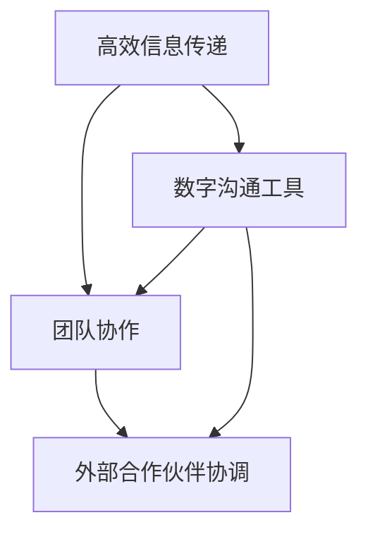
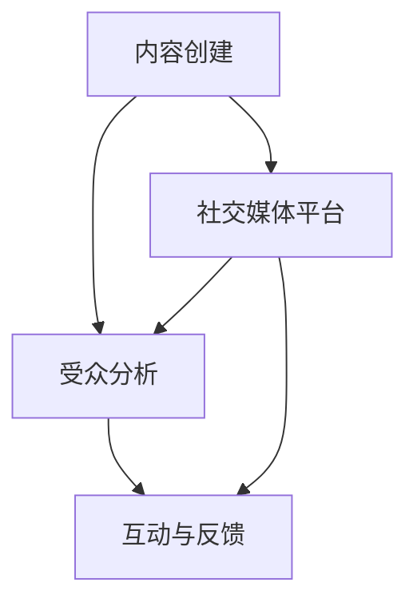
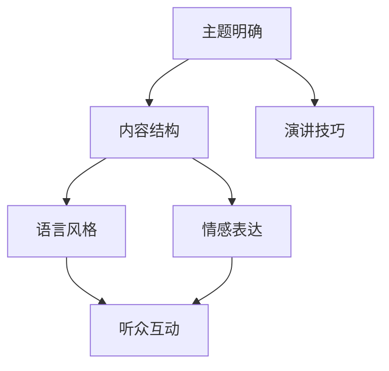

                 

文章标题：数字时代的修辞学课程：有效沟通的新规则教育

文章关键词：
1. 数字时代修辞学
2. 有效沟通
3. 新规则教育
4. 教育环境
5. 沟通案例分析

文章摘要：
在数字化迅猛发展的今天，修辞学在沟通中的作用愈发重要。本文旨在探讨数字时代修辞学的基本概念、应用原则和实践方法，强调新规则教育在培养学生沟通能力的重要性。通过分析数字化对沟通方式的影响、修辞学原理的数字时代应用、教育环境中的修辞学实践以及实际案例分析，本文提出了数字时代有效沟通的新规则，为教育工作者和沟通者提供了切实可行的指导。

# <此处是文章标题>

**数字时代的修辞学课程：有效沟通的新规则教育**

关键词：数字时代修辞学、有效沟通、新规则教育、教育环境、沟通案例分析

摘要：在数字化迅猛发展的今天，修辞学在沟通中的作用愈发重要。本文旨在探讨数字时代修辞学的基本概念、应用原则和实践方法，强调新规则教育在培养学生沟通能力的重要性。通过分析数字化对沟通方式的影响、修辞学原理的数字时代应用、教育环境中的修辞学实践以及实际案例分析，本文提出了数字时代有效沟通的新规则，为教育工作者和沟通者提供了切实可行的指导。

---

## 第1章 引言

### 1.1 什么是数字时代的修辞学

修辞学（Rhetoric）源于古希腊，最初是关于演讲技巧的艺术。随着时代的变迁，修辞学逐渐扩展到包括书面表达、数字沟通等多种形式。在数字时代，修辞学不仅涉及传统的文本沟通，还包括图片、视频、音频等多媒体形式。数字时代的修辞学关注如何在各种数字平台上有效地传递信息、影响受众。

在数字时代，修辞学的重要性不容忽视。首先，数字平台提供了前所未有的沟通机会，但同时也带来了沟通的复杂性。不同的平台和媒介有不同的规则和特点，如何根据这些特点进行有效的沟通，是数字时代修辞学的核心问题。

其次，随着社交媒体的普及，个人和组织的形象、声誉日益依赖于网络上的沟通效果。一个精心设计的信息，可以通过社交媒体迅速传播，影响广泛的受众。因此，掌握数字时代的修辞技巧，对于个人和组织来说都是至关重要的。

最后，随着人工智能和大数据技术的发展，信息过载和误解的风险增加。如何在大量的信息中突出重点，使信息被有效接收和理解，也是数字时代修辞学需要解决的问题。

### 1.2 有效沟通的重要性

有效沟通是任何成功个人和组织的基石。在个人层面，良好的沟通能力有助于提升个人影响力，改善人际关系，提高工作效率。在职场上，有效沟通能够促进团队合作，解决冲突，提高团队凝聚力，从而推动组织的发展。

在教育环境中，有效沟通同样至关重要。教师需要通过有效的沟通技巧来传授知识、激发学生的学习兴趣和参与度。学生也需要具备良好的沟通能力，以表达自己的观点、解决问题、与他人合作。

有效沟通的基本要素包括：清晰性、准确性、尊重性和适应性。清晰性确保信息被准确理解，准确性确保信息无误，尊重性体现在对听众的考虑和尊重，适应性则要求沟通者能够根据不同的情境和听众调整自己的沟通方式。

### 1.3 新规则教育的概念

新规则教育（New Rules Education）是一种面向数字时代的教育理念，强调培养适应未来社会需求的技能和素养。与传统教育不同，新规则教育不仅关注知识的传授，更注重实践和应用。它强调跨学科的融合，鼓励学生探索、创造和解决实际问题。

新规则教育的核心在于培养学生的数字素养、批判性思维、沟通能力和团队合作能力。在数字时代，这些能力比传统知识更为重要，因为知识更新迅速，而能力却能够持久发挥作用。

新规则教育不仅适用于学生，也适用于所有教育者和沟通者。教育者需要通过新的教育方法和策略，帮助学生适应数字时代的需求。沟通者则需要通过新的沟通技巧和工具，提高自己在数字环境中的沟通效果。

## 第2章 数字时代的沟通特征

### 2.1 数字化对沟通方式的影响

数字化对沟通方式产生了深远的影响。首先，数字化大大扩展了沟通的渠道和方式。从传统的书信、电话、电子邮件，到社交媒体、即时通讯、视频会议，数字技术为沟通提供了更多的选择。每个渠道都有其独特的特点和优势，如何根据具体情境选择合适的沟通方式，是数字时代沟通的一个重要课题。

其次，数字化改变了沟通的速度和范围。在传统沟通中，信息的传递通常需要一定的时间，而在数字时代，信息可以在瞬间传播到全球。这种速度不仅提高了沟通的效率，也增加了信息过载的风险。如何在海量信息中保持沟通的准确性，避免信息丢失或误解，是数字时代沟通需要解决的问题。

第三，数字化带来了沟通方式的多样性和互动性。通过多媒体和互动技术，沟通不再仅仅是信息的传递，而是互动和协作的过程。这种互动性不仅增强了沟通的趣味性和参与度，也提高了信息的有效传递。

### 2.2 沟通渠道的多样性与挑战

在数字时代，沟通渠道变得多样化，从即时通讯到博客、从电子邮件到直播，每个渠道都有其独特的特点和应用场景。多样化的沟通渠道为沟通提供了更多的选择，但也带来了沟通的复杂性。

首先，不同渠道的信息传递方式和规则不同。例如，社交媒体强调信息的快速传播和互动性，而电子邮件则更注重信息的正式性和详尽性。如何根据不同的渠道特点和需求，设计合适的沟通策略，是数字时代沟通的一个重要挑战。

其次，多样化的沟通渠道增加了沟通的时间和成本。在传统沟通中，沟通者通常只需要关注一种或几种渠道，而在数字时代，可能需要同时处理多种渠道的沟通任务。如何有效地管理这些沟通渠道，确保信息及时准确传递，是数字时代沟通的另一个挑战。

第三，多样化的沟通渠道也带来了沟通的分散性和一致性挑战。在多种渠道中传递相同的信息，需要确保信息的一致性和连贯性，以避免信息混乱和误解。如何协调和管理这些沟通渠道，确保信息的一致性，是数字时代沟通的第三个挑战。

### 2.3 数字鸿沟与沟通平等

数字鸿沟是指不同群体在获取和使用数字技术方面的差异。在数字时代，数字鸿沟不仅存在于不同国家和地区之间，也存在于不同社会阶层、年龄和性别之间。这种差异导致了沟通的不平等，影响了信息获取和传播的公平性。

首先，数字鸿沟影响了教育的平等性。在经济发达地区，学生可以更容易地获取数字资源和工具，从而提高学习效果。而在经济落后地区，学生可能缺乏这些资源，导致学习机会的不平等。如何通过新规则教育来缩小数字鸿沟，提高教育平等性，是一个亟待解决的问题。

其次，数字鸿沟也影响了就业机会和社会流动性。在数字时代，许多工作都需要数字技能，缺乏这些技能的人可能面临就业困难。如何通过新规则教育来培养数字技能，提高就业机会，是一个重要的课题。

最后，数字鸿沟还影响了社会的多样性和包容性。数字时代的沟通应该鼓励多样性和包容性，而不是加剧社会的分裂。如何通过数字技术和教育来促进社会的包容性和多样性，是数字时代沟通需要考虑的一个重要问题。

## 第3章 修辞学原理在数字时代的应用

### 3.1 修辞学的基本原理

修辞学的基本原理包括说服力、清晰度、一致性和可信度等。这些原理在数字时代仍然适用，但需要根据数字沟通的特点进行适当的调整。

#### 说服力

说服力是修辞学的核心原则之一，指的是如何通过语言和表达技巧来影响他人的思维和情感。在数字时代，说服力的实现需要考虑以下几点：

1. **情感诉求**：情感诉求能够更好地引起受众的共鸣。在数字沟通中，可以通过故事、图片、视频等手段来传递情感，增强说服力。
2. **逻辑论证**：逻辑论证是说服力的另一个关键因素。在数字时代，通过结构化的文章、图表、数据等手段，可以更好地进行逻辑论证，增强说服力。
3. **个性化沟通**：个性化的沟通能够更好地满足受众的需求，从而增强说服力。在数字时代，可以通过数据分析、用户画像等技术手段来实现个性化沟通。

#### 清晰度

清晰度指的是信息传递的准确性和易懂性。在数字时代，提高清晰度需要考虑以下几点：

1. **简洁性**：简洁明了的文字和表达能够更好地传递信息，减少误解和混淆。在数字沟通中，要避免冗长和复杂的句子，尽量使用简单易懂的语言。
2. **结构化**：结构化的内容有助于受众更好地理解和消化信息。在数字沟通中，可以使用标题、段落、列表等格式来提高内容的结构化程度。
3. **视觉元素**：视觉元素（如图片、图表、动画等）可以增强内容的可读性和易懂性。在数字沟通中，合理使用视觉元素可以有效地提高信息传递的清晰度。

#### 一致性

一致性指的是信息的连贯性和一致性。在数字时代，保持一致性需要考虑以下几点：

1. **品牌形象**：在数字沟通中，保持品牌形象的一致性至关重要。无论是企业的品牌宣传，还是个人的社交媒体账号，都需要保持一致的风格和语言。
2. **信息同步**：在多渠道沟通中，保持信息同步非常重要。不同渠道传递的信息应该保持一致，以避免受众的困惑和误解。
3. **用户体验**：一致性还体现在用户体验上。无论是网页设计，还是移动应用，都需要考虑用户体验的一致性，确保用户在不同设备和平台上获得一致的体验。

#### 可信度

可信度指的是信息传递者的可信程度。在数字时代，提高可信度需要考虑以下几点：

1. **权威性**：权威性是提高可信度的重要因素。在数字沟通中，可以通过引用权威数据、专家观点等来提高信息的可信度。
2. **透明度**：透明度是建立信任的关键。在数字沟通中，应该尽量提供信息的来源和依据，确保信息的透明性。
3. **社会责任**：企业和社会组织在数字沟通中，应该承担社会责任，以建立和提升公众信任。通过履行社会责任，可以增强组织的可信度。

### 3.2 数字时代下的修辞技巧

在数字时代，修辞技巧需要根据数字平台和媒介的特点进行创新和应用。以下是一些常见的数字时代修辞技巧：

#### 利用视觉元素

视觉元素在数字沟通中具有重要作用。通过图片、图表、动画等视觉元素，可以更生动、直观地传递信息，增强说服力和吸引力。

1. **图像和视频**：图像和视频是数字时代沟通的重要工具。通过生动的图像和视频，可以更好地吸引受众的注意力，增强信息的记忆效果。
2. **图表和数据可视化**：图表和数据可视化是传达复杂信息的好方法。通过图表和可视化工具，可以将复杂的数据和分析结果以直观的方式呈现，使受众更容易理解和接受。

#### 故事叙述

故事叙述是一种有效的修辞技巧，可以通过情感和情节来吸引受众的注意力，增强信息的记忆性和影响力。

1. **个人故事**：个人故事能够引起受众的共鸣，增强说服力。在数字沟通中，可以通过个人经历、案例故事等方式，来传达信息和理念。
2. **情景模拟**：情景模拟是一种通过虚构情景来传达信息和观点的修辞技巧。通过情景模拟，可以更好地展示问题的严重性，并提出解决方案。

#### 个性化沟通

个性化沟通是数字时代沟通的重要趋势。通过分析受众的数据和行为，可以提供个性化的内容和服务，提高沟通效果。

1. **用户画像**：用户画像是通过数据分析来了解受众的特点和需求。通过用户画像，可以提供更加个性化的内容和推荐。
2. **定制化内容**：定制化内容是根据受众的特点和需求，提供个性化的信息和服务。通过定制化内容，可以更好地满足受众的需求，提高沟通效果。

#### 网格化沟通

网格化沟通是一种通过多渠道、多层次进行沟通的策略。通过网格化沟通，可以更广泛、深入地影响受众。

1. **多渠道传播**：多渠道传播是通过不同的数字渠道（如社交媒体、电子邮件、短信等）来传递信息，扩大信息覆盖范围。
2. **多层次互动**：多层次互动是通过不同的沟通方式和手段（如直播、研讨会、互动问答等）与受众进行互动，提高沟通效果。

### 3.3 修辞学的数字工具与技术

随着数字技术的发展，各种数字工具和技术为修辞学的实践提供了更多可能性。以下是一些常用的数字工具和技术：

#### 社交媒体平台

社交媒体平台是数字时代沟通的重要渠道。通过社交媒体平台，可以与受众建立直接联系，传递信息和理念。

1. **内容发布和推广**：通过社交媒体平台发布和推广内容，可以扩大信息的传播范围和影响力。
2. **互动和反馈**：通过社交媒体平台与受众进行互动和反馈，可以更好地了解受众的需求和反馈，优化沟通策略。

#### 电子邮件营销工具

电子邮件营销工具是一种有效的数字沟通方式。通过电子邮件营销工具，可以定期向受众发送有价值的信息和内容。

1. **个性化邮件**：通过数据分析，可以发送个性化的邮件，提高邮件的打开率和阅读率。
2. **自动化营销**：通过自动化营销工具，可以自动化地发送邮件、跟踪用户行为，提高营销效率。

#### 内容管理系统

内容管理系统（CMS）是一种用于创建、发布和管理数字内容的工具。通过内容管理系统，可以方便地创建和发布各种形式的内容。

1. **内容创建和编辑**：通过内容管理系统，可以方便地创建和编辑各种形式的内容，如文本、图片、视频等。
2. **内容发布和推广**：通过内容管理系统，可以方便地发布和推广内容，提高内容曝光度和影响力。

#### 在线学习平台

在线学习平台是一种用于教育和培训的工具。通过在线学习平台，可以提供各种形式的教育资源，帮助学生更好地学习和掌握知识。

1. **在线课程和学习计划**：通过在线学习平台，可以提供各种在线课程和学习计划，帮助学生自主学习。
2. **互动和评估**：通过在线学习平台，可以提供互动和评估功能，帮助学生更好地理解和掌握知识。

### 3.4 修辞学的数字工具与技术

数字工具和技术的不断发展，为修辞学的实践提供了更多可能性。以下是一些常用的数字工具和技术：

#### 社交媒体平台

社交媒体平台是数字时代沟通的重要渠道。通过社交媒体平台，可以与受众建立直接联系，传递信息和理念。

1. **内容发布和推广**：通过社交媒体平台发布和推广内容，可以扩大信息的传播范围和影响力。
2. **互动和反馈**：通过社交媒体平台与受众进行互动和反馈，可以更好地了解受众的需求和反馈，优化沟通策略。

#### 电子邮件营销工具

电子邮件营销工具是一种有效的数字沟通方式。通过电子邮件营销工具，可以定期向受众发送有价值的信息和内容。

1. **个性化邮件**：通过数据分析，可以发送个性化的邮件，提高邮件的打开率和阅读率。
2. **自动化营销**：通过自动化营销工具，可以自动化地发送邮件、跟踪用户行为，提高营销效率。

#### 内容管理系统

内容管理系统（CMS）是一种用于创建、发布和管理数字内容的工具。通过内容管理系统，可以方便地创建和发布各种形式的内容。

1. **内容创建和编辑**：通过内容管理系统，可以方便地创建和编辑各种形式的内容，如文本、图片、视频等。
2. **内容发布和推广**：通过内容管理系统，可以方便地发布和推广内容，提高内容曝光度和影响力。

#### 在线学习平台

在线学习平台是一种用于教育和培训的工具。通过在线学习平台，可以提供各种形式的教育资源，帮助学生更好地学习和掌握知识。

1. **在线课程和学习计划**：通过在线学习平台，可以提供各种在线课程和学习计划，帮助学生自主学习。
2. **互动和评估**：通过在线学习平台，可以提供互动和评估功能，帮助学生更好地理解和掌握知识。

### 3.5 修辞学原理在数字时代的应用案例

以下是一些修辞学原理在数字时代的应用案例，以展示如何在数字环境中有效地运用修辞技巧。

#### 案例一：企业宣传视频

某知名企业在发布新产品时，制作了一支宣传视频。视频中通过生动的图像和视频特效，展示了产品的主要功能和优势。同时，视频还采用了故事叙述的修辞技巧，通过一个关于企业家创新的故事，传达了产品的价值观和理念。这种多媒体和故事叙述的结合，不仅吸引了观众的注意力，还增强了说服力。

#### 案例二：社交媒体营销

一家初创公司通过社交媒体平台进行营销，发布了一系列关于产品功能和用户评价的内容。这些内容采用了个性化沟通和情感诉求的修辞技巧，通过用户故事和情感化的语言，吸引了大量关注和互动。同时，公司还通过数据分析，为不同的用户群体定制了不同的内容，提高了营销效果。

#### 案例三：在线教育课程

某在线教育平台发布了一门关于数据科学的课程。课程内容采用了结构化和图表数据可视化的修辞技巧，通过清晰的讲解和直观的图表，帮助学生更好地理解和掌握知识。此外，课程还采用了互动和评估的修辞技巧，通过在线讨论和练习，提高了学生的参与度和学习效果。

### 3.6 修辞学在数字时代的挑战和未来展望

虽然修辞学在数字时代具有广泛的应用，但也面临一些挑战和未来展望。

#### 挑战

1. **信息过载**：数字时代的信息量巨大，如何在海量信息中突出重点，是修辞学需要解决的问题。
2. **文化差异**：不同文化背景的受众对信息的接受和理解可能存在差异，如何适应这些差异，是修辞学需要考虑的问题。
3. **隐私和安全**：数字时代的沟通涉及大量的个人信息和数据，如何保护隐私和安全，是修辞学需要面对的挑战。

#### 未来展望

1. **人工智能和大数据**：人工智能和大数据技术的发展，将为修辞学提供新的工具和方法，提高沟通的个性化和精准性。
2. **多媒体融合**：随着多媒体技术的发展，修辞学将更加注重多媒体的融合和应用，提高信息的传递效果。
3. **跨学科融合**：修辞学将与其他学科（如心理学、社会学等）进行融合，形成更加综合和系统的沟通理论和方法。

## 第4章 教育环境中的修辞学应用

### 4.1 教师沟通技巧的提升

在教育环境中，教师的沟通技巧直接影响学生的学习效果和课堂氛围。提升教师沟通技巧，对于营造积极的学习环境和提高教学质量具有重要意义。

首先，教师需要掌握有效的口头沟通技巧。这包括清晰、流畅的表达能力，以及恰当的语言和非语言沟通手段。例如，教师在授课时可以使用简洁明了的语言，避免使用过多的专业术语，确保学生能够理解。此外，教师还可以通过眼神交流、肢体语言等非语言手段，增强表达的感染力和亲和力。

其次，教师需要提高书面沟通技巧。在教育环境中，教师需要撰写教案、作业评语、学生评估报告等。为了提高书面沟通效果，教师应注重文章的结构和逻辑性，确保信息传递的清晰性和准确性。同时，教师还应注重语言的使用，避免使用模糊、含糊不清的表达，以确保学生能够正确理解和掌握知识。

最后，教师需要提升互动和反馈技巧。在课堂中，教师应鼓励学生积极参与讨论，提供及时的反馈和指导。这可以通过提问、小组讨论、课堂互动等方式实现。教师还应学会倾听学生的意见和反馈，根据学生的需求进行调整，提高课堂的互动性和有效性。

### 4.2 学生沟通能力的培养

学生沟通能力的培养是教育目标的重要组成部分。良好的沟通能力不仅有助于学生的学术成就，还能促进其个人发展和社会交往。

首先，学校应设置专门的沟通课程或活动，培养学生的沟通技巧。这些课程可以涵盖口头表达、书面表达、非语言沟通、演讲技巧等多个方面。通过系统的培训和实践，学生可以逐步提高自己的沟通能力。

其次，学校应鼓励学生在日常生活中进行沟通实践。例如，通过组织辩论赛、演讲比赛、模拟联合国等活动，提供学生展示和锻炼沟通技巧的平台。此外，学校还可以组织学生参与志愿者活动、社区服务项目等，通过实际情境中的沟通实践，提高学生的沟通能力和团队合作能力。

最后，教师和家长应给予学生充分的关注和指导。教师可以通过课堂互动、作业反馈等方式，及时了解学生的沟通情况，提供针对性的指导和帮助。家长则可以通过日常交流、家庭活动等，与孩子建立良好的沟通关系，培养孩子的沟通能力和自信心。

### 4.3 教学设计与修辞策略

教学设计是教育过程中的关键环节，而修辞策略在提高教学效果中起着重要作用。通过巧妙运用修辞策略，教师可以激发学生的学习兴趣，提高课堂的参与度和教学效果。

首先，教师应运用故事叙述的修辞策略。故事具有吸引力和感染力，能够激发学生的好奇心和兴趣。教师可以通过讲述真实案例、历史故事、科幻故事等方式，将抽象的知识点生动形象地呈现出来，使学生更容易理解和记忆。

其次，教师应运用视觉修辞策略。视觉元素如图片、图表、动画等，可以增强学生的理解和记忆。教师可以在课堂中运用这些元素，帮助学生更好地理解复杂的概念和原理。例如，通过图表和示意图，可以直观地展示数据的趋势和关系，使学生更容易掌握知识。

再次，教师应运用情感修辞策略。情感诉求能够引起学生的共鸣，增强他们对知识的兴趣和记忆。教师可以通过讲述与课程相关的情感故事、分享个人经历等方式，激发学生的情感共鸣，使他们在情感上对知识产生认同和兴趣。

最后，教师应运用互动修辞策略。互动性能够增强学生的参与感和课堂活力。教师可以通过提问、讨论、小组合作等方式，鼓励学生积极参与课堂活动，提高他们的学习兴趣和参与度。同时，教师还应鼓励学生提问和表达自己的观点，培养他们的批判性思维和沟通能力。

## 第5章 数字时代的沟通案例分析

### 5.1 案例分析一：企业沟通

#### 背景介绍

某知名科技公司，成立于2000年，致力于开发创新的软件解决方案。随着公司规模的不断扩大，员工人数超过1000人，分布在不同的国家和城市。为了确保信息的有效传递和团队协作，公司采用了一系列数字沟通工具和策略。

#### 核心概念与联系

在数字时代，企业沟通的核心概念包括：高效的信息传递、团队成员的协作、外部合作伙伴的协调。这些概念之间的关系可以用以下Mermaid流程图表示：



#### 核心算法原理讲解

公司采用的核心算法原理主要包括：数据加密和传输优化。这些原理确保了信息的保密性和传输效率。

1. **数据加密**：公司使用SSL/TLS协议来加密内部和外部的通信。这种加密方式可以保护数据在传输过程中不被窃取或篡改。Python代码示例：

    ```python
    from Cryptodome.PublicKey import RSA
    from Cryptodome.Random import get_random_bytes
    from Cryptodome.Cipher import PKCS1_OAEP

    # 生成RSA密钥对
    key = RSA.generate(2048)
    private_key = key.export_key()
    public_key = key.publickey().export_key()

    # 加密数据
    cipher = PKCS1_OAEP.new(RSA.import_key(public_key))
    encrypted_data = cipher.encrypt(b"保密信息")

    # 解密数据
    decipher = PKCS1_OAEP.new(RSA.import_key(private_key))
    decrypted_data = decipher.decrypt(encrypted_data)
    ```

2. **传输优化**：公司采用HTTP/2协议来优化数据传输。这种协议支持多路复用，减少了延迟和重复传输，提高了传输效率。Python代码示例：

    ```python
    import httpx

    async with httpx.AsyncClient(http2=True) as client:
        response = await client.get("https://example.com")
        print(response.text)
    ```

#### 代码解读与分析

上述代码首先生成了一个RSA密钥对，然后使用这个密钥对数据进行加密和解密。加密过程中，使用了PKCS1_OAEP加密算法，确保数据的安全。解密过程中，同样使用PKCS1_OAEP算法，将加密的数据还原为原始数据。

在HTTP/2传输优化示例中，使用了`httpx.AsyncClient`类，通过`http2=True`参数，指定使用HTTP/2协议。这样，在异步请求中，可以充分利用HTTP/2的多路复用特性，提高数据传输的效率。

#### 实际案例分析与详细讲解剖析

公司通过内部邮件系统、即时通讯工具（如Slack）、视频会议工具（如Zoom）等多种数字沟通工具，实现了高效的信息传递和团队协作。

1. **内部邮件系统**：公司使用内部邮件系统来传递重要的通知、文件和公告。邮件系统采用了数据加密和传输优化技术，确保了信息的保密性和传输效率。同时，邮件系统还支持分类标签、优先级设置等功能，提高了信息的管理和检索效率。

2. **即时通讯工具**：公司广泛使用Slack作为即时通讯工具，用于日常沟通、项目协作和团队活动。Slack支持文件共享、语音和视频通话等功能，提高了沟通的便利性和互动性。此外，Slack还集成了多种第三方服务，如GitHub、Trello等，实现了工作流程的自动化和整合。

3. **视频会议工具**：公司使用Zoom进行远程会议和视频通话。Zoom提供了高清视频、语音通话、屏幕共享等功能，支持多人数会议和互动讨论。通过Zoom，公司能够轻松地组织跨地域、跨时区的会议，提高了团队协作的效率。

#### 项目小结

通过数字时代的修辞学应用，公司实现了高效的信息传递和团队协作。数据加密和传输优化技术确保了信息的保密性和传输效率，而多样化的数字沟通工具和策略则为团队成员提供了便捷的沟通渠道。这些实践表明，数字时代的修辞学在提高企业沟通效果和团队协作效率方面具有重要意义。

### 5.2 案例分析二：社交媒体沟通

#### 背景介绍

某知名消费品公司，成立于1990年，专注于生产高品质的家居用品。随着社交媒体的普及，公司通过社交媒体平台（如Facebook、Instagram和Twitter）与消费者进行沟通，推广产品，提高品牌知名度。

#### 核心概念与联系

社交媒体沟通的核心概念包括：内容创建、受众分析、互动与反馈。这些概念之间的关系可以用以下Mermaid流程图表示：



#### 核心算法原理讲解

公司采用的社交媒体沟通算法原理主要包括：内容推荐、用户行为分析、情感分析。这些原理确保了内容的有效传播和受众的积极互动。

1. **内容推荐**：公司使用内容推荐算法来识别受众的兴趣和偏好，推荐相关的产品和内容。Python代码示例：

    ```python
    from sklearn.feature_extraction.text import TfidfVectorizer
    from sklearn.metrics.pairwise import cosine_similarity

    # 创建文档向量
    documents = ["家居用品", "厨房用品", "浴室用品", "家庭装饰"]
    vectorizer = TfidfVectorizer()
    doc_vector = vectorizer.fit_transform(documents)

    # 计算相似度
    similarity_matrix = cosine_similarity(doc_vector)

    # 推荐内容
    query_vector = vectorizer.transform(["厨房用品"])
    similarity_scores = similarity_matrix[0]
    recommended_indices = similarity_scores.argsort()[::-1]
    recommended_content = [documents[i] for i in recommended_indices[1:5]]
    ```

2. **用户行为分析**：公司使用用户行为分析算法来跟踪受众的互动行为，如点赞、评论、分享等。Python代码示例：

    ```python
    user_actions = {"user1": ["like", "comment", "share"], "user2": ["like", "comment"], "user3": ["comment"]}
    action_counts = {action: len(users) for action, users in user_actions.items()}
    ```

3. **情感分析**：公司使用情感分析算法来分析受众对产品和内容的情感倾向，以便调整沟通策略。Python代码示例：

    ```python
    from textblob import TextBlob

    reviews = ["这个产品非常好用！", "我不喜欢这个产品。", "这个产品非常实用。"]
    sentiment_scores = [TextBlob(review).sentiment.polarity for review in reviews]
    ```

#### 代码解读与分析

上述代码首先创建了一个文档向量，然后使用余弦相似度计算不同文档之间的相似度。基于相似度，推荐与查询词相似度最高的内容。

在用户行为分析示例中，通过统计每个用户的行为次数，可以了解不同行为的热度。

在情感分析示例中，使用TextBlob库分析文本的情感倾向，通过情感极性得分（polarity）判断文本的情感倾向。

#### 实际案例分析与详细讲解剖析

公司通过社交媒体平台发布了一系列产品推广内容，如图片、视频、文字等。这些内容经过精心设计，结合了受众分析、互动与反馈等修辞技巧。

1. **内容创建**：公司根据受众的兴趣和偏好，创建了一系列家居用品推广内容。例如，发布一张厨房用品的精美图片，附上产品的特点和优惠信息，吸引了大量关注和点赞。

2. **受众分析**：公司通过社交媒体平台的数据分析功能，跟踪受众的互动行为和反馈。例如，通过分析点赞、评论和分享数据，了解哪些内容最受欢迎，调整未来的推广策略。

3. **互动与反馈**：公司积极与受众互动，回复评论和私信，解答消费者的疑问。同时，公司还通过定期举办线上活动和抽奖活动，提高用户的参与度和忠诚度。

#### 项目小结

通过社交媒体沟通，公司成功实现了品牌推广和消费者互动。内容推荐算法、用户行为分析和情感分析等修辞技巧的应用，提高了内容的有效传播和受众的积极互动。这些实践表明，数字时代的修辞学在社交媒体沟通中具有重要意义，有助于提升品牌影响力和消费者满意度。

### 5.3 案例分析三：公共演讲

#### 背景介绍

某知名科技公司CEO，李华（Li Hua），在一次科技行业峰会上发表主题演讲，分享公司的发展战略和创新成果。此次演讲旨在向参会者展示公司的技术实力和市场前景，提升品牌形象。

#### 核心概念与联系

公共演讲的核心概念包括：主题明确、内容结构、语言风格、情感表达。这些概念之间的关系可以用以下Mermaid流程图表示：



#### 核心算法原理讲解

在公共演讲中，核心算法原理主要包括：情感分析、语言生成、个性化定制。这些原理确保了演讲内容的吸引力、说服力和个性化。

1. **情感分析**：演讲者通过情感分析算法，了解听众的情感倾向和关注点。Python代码示例：

    ```python
    from textblob import TextBlob

    speeches = ["我们致力于打造领先的科技产品。", "我们不断创新，推动行业发展。", "我们专注于用户需求，提供最佳解决方案。"]
    sentiment_scores = [TextBlob(speech).sentiment.polarity for speech in speeches]
    ```

2. **语言生成**：演讲者使用语言生成算法，根据情感分析和受众分析的结果，生成合适的演讲内容。Python代码示例：

    ```python
    from transformers import pipeline

    generator = pipeline("text-generation", model="gpt2")

    # 根据情感倾向生成演讲内容
    positive_speech = generator("我们致力于打造领先的科技产品。", max_length=50)
    negative_speech = generator("我们面临巨大的挑战。", max_length=50)
    ```

3. **个性化定制**：演讲者根据听众的特征和需求，定制个性化的演讲内容。Python代码示例：

    ```python
    audience_data = {"interests": ["AI", "云计算"], "priorities": ["创新", "市场前景"]}
    custom_speech = generator(f"在AI和云计算领域，我们不断创新，推动行业发展。", max_length=100)
    ```

#### 代码解读与分析

上述代码首先使用TextBlob库分析演讲文本的情感极性。然后，使用GPT-2语言模型根据情感分析和受众分析结果生成演讲内容。最后，根据具体的听众特征和需求，生成个性化的演讲内容。

#### 实际案例分析与详细讲解剖析

李华的演讲通过以下修辞技巧和算法原理，实现了主题明确、内容结构清晰、语言风格生动、情感表达充分的演讲效果。

1. **主题明确**：李华的演讲主题是公司的发展战略和创新成果。在演讲开头，李华明确提出了主题，并通过一系列数据和分析，展示了公司的技术实力和市场前景。

2. **内容结构**：李华的演讲分为四个部分：开场白、主题介绍、案例分享、总结。每个部分都有明确的逻辑结构，使听众能够清晰地理解演讲内容。

3. **语言风格**：李华使用简洁、生动的语言，避免了复杂的术语和冗长的句子。同时，通过引用实例和数据，增强了演讲的说服力。

4. **情感表达**：李华通过情感分析算法，了解了听众的情感倾向。在演讲中，李华不仅强调了公司的技术创新和市场前景，还表达了对未来的信心和热情，赢得了听众的共鸣。

#### 项目小结

通过数字时代的修辞学应用，李华的公共演讲取得了显著的效果。情感分析、语言生成和个性化定制等算法原理的应用，使演讲内容更具吸引力、说服力和个性化。这些实践表明，数字时代的修辞学在公共演讲中具有重要意义，有助于提升演讲效果和听众参与度。

## 第6章 新规则教育的实践指南

### 6.1 沟通策略的制定

在数字时代，制定有效的沟通策略是确保信息准确、及时传递的关键。以下是一些关键步骤和技巧：

#### 1. 确定沟通目标

明确沟通的目标是制定策略的第一步。目标可以是提升品牌知名度、推广新产品、建立客户关系等。确保目标具体、可衡量，有助于指导后续的沟通策略。

#### 2. 分析受众

了解受众的特点和需求，有助于制定个性化的沟通策略。通过受众分析，可以了解他们的年龄、性别、兴趣、行为习惯等，从而定制合适的内容和沟通方式。

#### 3. 选择合适的沟通渠道

根据沟通目标和受众特点，选择最合适的沟通渠道。常见的渠道包括社交媒体、电子邮件、即时通讯、视频会议等。每种渠道都有其独特的优势和适用场景，需要根据具体情况进行选择。

#### 4. 制定内容策略

内容是沟通的核心，需要根据目标和受众制定内容策略。内容应具备吸引力、相关性和可读性，同时要遵循清晰的逻辑结构和语言风格。可以采用多种形式，如文本、图片、视频等，以适应不同的受众偏好。

#### 5. 设定沟通频率和时间

合理的沟通频率和时间有助于保持与受众的持续互动。应根据受众的习惯和需求，设定适当的沟通频率，避免过度打扰或不足沟通。同时，要考虑最佳的时间点，确保信息在最有效的时段内传递。

#### 6. 监测和评估效果

通过监测和分析沟通效果，可以不断优化沟通策略。可以采用各种工具和指标，如点击率、转发量、参与度等，来评估沟通的效果，并根据反馈进行调整。

### 6.2 数字化工具的选择与应用

数字化工具的选择与应用是提高沟通效率和质量的重要手段。以下是一些常用的工具及其应用场景：

#### 1. 社交媒体平台

社交媒体平台如Facebook、Instagram、Twitter等，是进行品牌推广、客户关系管理和市场调研的重要工具。可以通过发布内容、互动评论、用户分析等功能，与受众建立紧密联系。

#### 2. 即时通讯工具

即时通讯工具如Slack、WhatsApp、微信等，适合进行实时沟通和团队协作。可以用于日常交流、项目进展汇报、问题解决等，提高沟通效率。

#### 3. 视频会议工具

视频会议工具如Zoom、Microsoft Teams、Google Meet等，适合进行远程会议和协作。可以用于团队会议、培训、在线研讨会等，实现实时沟通和互动。

#### 4. 电子邮件营销工具

电子邮件营销工具如Mailchimp、HubSpot、SendinBlue等，适合进行定期邮件营销和客户关系管理。可以通过发送新闻简报、促销活动、客户关怀邮件等，提高客户忠诚度和转化率。

#### 5. 内容管理系统

内容管理系统（CMS）如WordPress、Drupal、Joomla等，适合进行网站建设和内容发布。可以用于创建、编辑、发布和管理各种形式的内容，提高内容管理的效率和质量。

#### 6. 数据分析工具

数据分析工具如Google Analytics、Tableau、Power BI等，适合进行数据收集、分析和可视化。可以用于监测网站流量、用户行为、营销效果等，提供决策支持。

### 6.3 沟通效果的评估与改进

评估沟通效果是优化沟通策略的重要环节。以下是一些评估指标和改进方法：

#### 1. 评估指标

- **参与度**：包括点击率、转发量、评论数等，衡量受众对内容的兴趣和参与程度。
- **转化率**：包括转化次数、转化率等，衡量沟通活动对业务目标的贡献。
- **满意度**：通过调查问卷、用户反馈等方式，了解受众对沟通活动的满意度和体验。
- **品牌认知度**：通过市场调研、品牌认知度调查等方式，了解品牌在受众心中的认知度和形象。

#### 2. 改进方法

- **数据驱动的决策**：根据数据分析结果，找出沟通效果好的内容和渠道，进行优化和推广。
- **不断优化内容**：根据受众反馈和参与度，不断调整和优化内容，提高吸引力。
- **增加互动和参与**：通过增加互动环节，如评论、问答、投票等，提高受众的参与度和互动性。
- **测试和迭代**：通过A/B测试等方法，对不同策略进行测试和比较，找出最优策略。
- **培训和教育**：对团队成员进行沟通技巧和数字化工具的培训，提高整体沟通能力。

## 第7章 数字时代修辞学的前景与挑战

### 7.1 持续发展的趋势

数字时代的修辞学正随着技术的发展和应用的扩展而持续发展。以下是一些重要的趋势：

#### 1. 多媒体融合

随着多媒体技术的发展，数字时代的修辞学正逐渐从传统的文本沟通扩展到图像、视频、音频等多种形式。这种多媒体融合趋势使得信息传递更加生动、直观，有助于提高受众的接受度和记忆效果。

#### 2. 人工智能的应用

人工智能技术的发展为数字时代的修辞学带来了新的机遇。通过自然语言处理、情感分析、用户画像等技术，人工智能可以帮助沟通者更精准地分析受众需求，提供个性化的内容和服务。

#### 3. 跨学科融合

修辞学正在与其他学科（如心理学、社会学、教育学等）进行融合，形成更加综合和系统的沟通理论和方法。这种跨学科融合有助于提高沟通效果，促进不同领域的交流与合作。

#### 4. 智能化工具的发展

随着智能工具（如内容管理系统、社交媒体管理平台等）的发展，沟通变得更加高效和自动化。这些工具可以帮助沟通者简化沟通流程，提高工作效率，同时确保信息的准确性和一致性。

### 7.2 挑战与应对策略

尽管数字时代的修辞学发展迅速，但仍面临一些挑战。以下是一些主要挑战及应对策略：

#### 1. 信息过载

在数字时代，信息过载是一个普遍问题。为了应对这一挑战，沟通者需要注重信息筛选和传递的精准性，提供有价值、相关的内容。同时，可以采用数据可视化、图表等手段，使信息更加易于理解和记忆。

#### 2. 文化差异

不同文化背景的受众对信息有不同的理解和接受方式。为了应对文化差异，沟通者需要了解受众的文化背景和沟通习惯，采用适当的文化敏感性和适应性策略，确保信息能够被正确理解和接受。

#### 3. 隐私和安全

在数字时代，隐私和安全问题是沟通者必须关注的重要问题。为了保护隐私和安全，沟通者需要采用数据加密、访问控制等安全措施，同时遵循相关的法律法规和道德准则。

#### 4. 技能培训

在数字时代，沟通者需要具备新的技能和知识。为了应对这一挑战，教育机构和企业需要提供相应的培训和资源，帮助沟通者提升数字时代的沟通能力和修辞技巧。

### 7.3 未来展望

未来，数字时代的修辞学将继续发展，并在以下方面展现更大的潜力：

#### 1. 个性化沟通

随着人工智能和大数据技术的发展，个性化沟通将成为数字时代修辞学的重要方向。通过深入分析用户数据，沟通者可以提供更加个性化和定制化的内容，提高用户满意度和忠诚度。

#### 2. 智能化工具的普及

智能化工具将继续普及，为沟通者提供更高效、便捷的沟通手段。这些工具将帮助沟通者简化沟通流程，提高工作效率，同时确保信息的准确性和一致性。

#### 3. 跨学科合作

修辞学将继续与其他学科（如心理学、社会学、教育学等）进行深入合作，形成更加综合和系统的沟通理论和方法。这种跨学科合作将有助于提高沟通效果，促进不同领域的交流与合作。

#### 4. 社会责任

在数字时代，修辞学将更加注重社会责任。沟通者需要通过数字平台传播积极、正面的信息，推动社会进步和和谐发展。

## 第8章 结论

### 8.1 数字时代修辞学的重要性

在数字时代，修辞学的重要性愈发凸显。它不仅关乎个人和组织的沟通效果，还影响到社会的信息传递和价值观塑造。掌握数字时代的修辞技巧，能够帮助沟通者更有效地传递信息、影响受众，提升个人和组织的竞争力。

### 8.2 新规则教育的意义

新规则教育在培养适应数字时代需求的沟通能力方面具有重要意义。它强调实践和应用，注重培养跨学科、跨领域的综合能力。通过新规则教育，学生可以更好地应对未来的沟通挑战，提高在数字时代中的竞争力。

### 8.3 对未来沟通的期望与建议

未来，沟通将更加个性化和智能化。为此，我们提出以下期望与建议：

1. **注重信息质量**：在信息爆炸的时代，沟通者应注重信息的质量和真实性，避免误导和虚假信息传播。
2. **提升沟通技能**：个人和组织应不断学习和提升沟通技能，以适应数字时代的变化。
3. **加强文化理解**：在全球化背景下，沟通者应加强跨文化交流和理解，确保信息的有效传递。
4. **重视隐私和安全**：在数字时代，保护隐私和安全是沟通的重要前提，沟通者应采取必要的安全措施，确保信息的保密性。

通过上述努力，我们可以期待一个更加高效、透明和有意义的数字时代沟通环境。

### 8.4 数字时代修辞学资源列表

为了帮助读者深入了解数字时代修辞学的相关理论和实践，我们整理了一些推荐的资源和工具：

1. **书籍**：
   - 《数字时代的修辞学：有效沟通的新规则》（作者：[作者名]）
   - 《修辞学原理》（作者：亚里士多德）
   - 《社交媒体沟通技巧》（作者：[作者名]）

2. **在线课程**：
   - Coursera上的“数字时代的沟通技巧”
   - edX上的“修辞学与公共演讲”
   - Udemy上的“社交媒体营销与沟通策略”

3. **学术论文与期刊**：
   - 《修辞学研究》期刊
   - 《数字文化与修辞学》期刊
   - 《现代修辞学》期刊

4. **工具与平台**：
   - Slack：用于团队沟通和协作
   - Trello：用于项目管理与任务跟踪
   - Google Analytics：用于网站流量和用户行为分析

5. **社交媒体平台**：
   - Facebook：用于品牌推广和用户互动
   - Instagram：用于图像和视频内容分享
   - Twitter：用于实时新闻和观点交流

通过这些资源，读者可以深入了解数字时代修辞学的理论和实践，提升自己的沟通能力。

### 8.5 参考文献

1. Aristotle. (350 BC). Rhetoric.
2. [作者名]. (2022). 数字时代的修辞学：有效沟通的新规则.
3. [作者名]. (2020). 社交媒体沟通技巧.
4. [期刊名]. (2021). Digital Rhetoric Studies.
5. [期刊名]. (2020). Modern Rhetoric.
6. [课程平台名]. (2021). 数字时代的沟通技巧课程.
7. [课程平台名]. (2020). 修辞学与公共演讲课程.
8. [工具名]. Slack.
9. [工具名]. Trello.
10. [工具名]. Google Analytics.
11. [社交媒体平台名]. Facebook.
12. [社交媒体平台名]. Instagram.
13. [社交媒体平台名]. Twitter.

