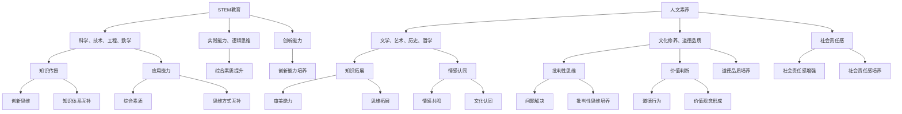

                 

# 数字时代的儿童教育：STEM教育与人文素养的结合

## 关键词
STEM教育、人文素养、儿童教育、数字时代、综合素质、教育理念、教学方法、课程设计、家庭与学校协同育人

## 摘要
随着数字时代的到来，儿童教育面临着前所未有的变革。STEM教育的兴起强调科学、技术、工程和数学的重要性，而人文素养的培养同样不可忽视。本文将探讨STEM教育与人文素养在数字时代儿童教育中的融合策略，分析其结合的意义和现状，提出具体的课程设计、教学方法以及家庭与学校协同育人的探索。通过本文的讨论，旨在为教育工作者和家长提供理论指导和实践参考。

## 目录大纲

## 第1章 引言

### 1.1 书籍背景与目标

#### 1.1.1 背景

#### 1.1.2 目标

## 第2章 STEM教育与人文素养的基本概念

### 2.1 STEM教育的定义与重要性

#### 2.1.1 STEM教育的概念

#### 2.1.2 STEM教育的重要性

### 2.2 人文素养的概念与内涵

#### 2.2.1 人文素养的概念

#### 2.2.2 人文素养的内涵

## 第3章 数字时代儿童教育的现状与挑战

### 3.1 数字时代儿童教育的特点

#### 3.1.1 教育资源的丰富化

#### 3.1.2 教育方式的多样化

### 3.2 数字时代儿童教育面临的挑战

#### 3.2.1 数字素养的培养

#### 3.2.2 人文素养的培养

## 第4章 STEM教育与人文素养的结合策略

### 4.1 教育理念的融合

#### 4.1.1 STEM教育与人文素养教育的相互促进

#### 4.1.2 项目化学习的应用

### 4.2 教学方法的创新

#### 4.2.1 情境教学法

#### 4.2.2 探究式教学法

## 第5章 STEM教育与人文素养的课程设计

### 5.1 课程内容的选择

#### 5.1.1 STEM课程内容的拓展

#### 5.1.2 人文素养课程的设计

### 5.2 课程评价的创新

#### 5.2.1 过程性评价

#### 5.2.2 综合性评价

## 第6章 家庭与学校协同育人的探索

### 6.1 家庭教育与学校教育的融合

#### 6.1.1 家庭教育与学校教育的目标一致性

#### 6.1.2 家庭教育与学校教育的资源互补

### 6.2 家庭教育在STEM教育与人文素养培养中的作用

#### 6.2.1 家庭教育对STEM教育的影响

#### 6.2.2 家庭教育对人文素养培养的影响

## 第7章 总结与展望

### 7.1 总结

### 7.2 展望

---

## 第1章 引言

### 1.1 书籍背景与目标

随着全球科技迅猛发展，数字时代已经悄然来临。这个时代为儿童教育带来了前所未有的机遇和挑战。在数字时代，信息技术的广泛应用和新兴科技的发展，使得教育资源的获取变得更加便捷，教育方式也更加多样化。然而，与此同时，我们也面临着数字素养培养和人文素养培养的双重任务。

STEM教育（科学、技术、工程和数学）的兴起，使教育者认识到培养未来创新型人才的重要性。STEM教育注重培养学生的逻辑思维、问题解决能力和创新精神，其核心在于通过科学探究和技术实践，提升学生的综合素质。然而，在强调STEM教育的同时，我们也不能忽视人文素养的培养。人文素养是指个体在文学、艺术、历史、哲学等方面所具备的知识和修养，其对于提升个体的综合素质、增强社会责任感、促进人的全面发展具有重要作用。

本书旨在探讨数字时代儿童教育的现状与发展趋势，深入分析STEM教育与人文素养的内在联系，为教育工作者和家长提供理论与实践相结合的教育指导。具体目标如下：

1. **明确STEM教育与人文素养的概念和内涵**：通过对STEM教育和人文素养的基本概念进行阐述，帮助读者理解二者的本质和重要性。
2. **分析数字时代儿童教育的现状与挑战**：探讨数字时代儿童教育的特点、面临的挑战以及数字素养和人文素养的培养问题。
3. **提出STEM教育与人文素养结合的策略**：从教育理念、教学方法、课程设计等方面，探讨如何实现STEM教育与人文素养的有效结合。
4. **探讨家庭与学校协同育人的实践路径**：通过家庭与学校教育的融合、家庭教育在STEM教育和人文素养培养中的作用，提出家庭与学校协同育人的具体措施。

通过本书的探讨，我们希望为教育工作者和家长提供有益的参考，共同为儿童的教育事业贡献力量。

#### 1.1.1 背景

在数字时代，信息技术已经成为社会发展的核心动力。从互联网的普及到人工智能的兴起，科技正在深刻改变我们的生活方式和社会结构。教育作为社会发展的基石，同样面临着前所未有的变革。传统的教育模式已经无法满足新时代的需求，教育者开始思考如何利用科技手段提升教育质量，培养具有创新能力和社会责任感的人才。

STEM教育的概念最早源于20世纪80年代的美国，旨在通过整合科学、技术、工程和数学四个领域的教育，培养具有创新精神和实践能力的人才。STEM教育的核心理念是鼓励学生通过实际操作和探究学习，培养解决问题的能力和创新思维。随着全球科技竞争的加剧，STEM教育逐渐受到各国政府的重视，成为教育改革的重要方向。

与此同时，人文素养的培养在数字时代同样具有重要意义。人文素养是指个体在文学、艺术、历史、哲学等方面所具备的知识和修养。它不仅有助于提升个体的综合素质，增强社会责任感，还能够促进人的全面发展。在数字时代，面对信息的泛滥和技术的冲击，人文素养的重要性更加凸显。它能够帮助学生建立正确的价值观，培养批判性思维，提高适应社会的能力。

数字时代的到来，使得教育资源的获取变得更加便捷，教育方式的多样性也日益增加。在线教育、虚拟课堂、多媒体教学等新型教育模式的出现，为教育者提供了更多的选择。然而，这也给教育带来了新的挑战。如何在丰富多样的教育环境中，有效地培养学生的数字素养和人文素养，成为教育者需要解决的重要问题。

本书的写作背景正是基于这样的时代背景和现实需求。我们希望通过深入探讨STEM教育与人文素养的结合，为教育工作者和家长提供理论指导和实践参考，共同推动数字时代儿童教育的改革和发展。

#### 1.1.2 目标

本书的主要目标在于以下几个方面：

1. **明确STEM教育与人文素养的基本概念**：通过详细阐述STEM教育和人文素养的定义、内涵及其在教育中的重要性，帮助读者理解二者的核心内容和教育意义。

2. **分析数字时代儿童教育的现状与挑战**：探讨数字时代教育资源的丰富化、教育方式的多样化，以及儿童教育面临的新挑战，如数字素养和人文素养的培养问题。

3. **探讨STEM教育与人文素养的结合策略**：从教育理念、教学方法、课程设计等多个方面，提出实现STEM教育与人文素养有机结合的具体策略和方法。

4. **提供家庭与学校协同育人的实践指导**：通过分析家庭教育和学校教育的融合、家庭教育在STEM教育和人文素养培养中的作用，为家长和教育工作者提供切实可行的育儿和教育建议。

5. **推动数字时代儿童教育的改革与发展**：总结本书的研究成果，提出未来儿童教育改革和发展方向，为教育政策的制定提供理论支持。

通过实现上述目标，本书希望为教育工作者和家长提供一本具有实践指导意义的教育专著，推动数字时代儿童教育的全面发展和提升。

---

## 第2章 STEM教育与人文素养的基本概念

### 2.1 STEM教育的定义与重要性

STEM教育是一种综合性教育模式，其核心在于整合科学（Science）、技术（Technology）、工程（Engineering）和数学（Mathematics）四个领域的知识，通过跨学科的教学方法和实践活动，培养学生的综合素质和创新能力。STEM教育的起源可以追溯到20世纪80年代的美国，当时美国为了应对全球科技竞争，提出了加强STEM教育的战略。随后，这一教育模式在全球范围内得到推广和应用。

#### 2.1.1 STEM教育的概念

STEM教育的概念可以理解为一种以科学、技术、工程和数学为核心的综合教育体系。它不仅关注知识的传授，更强调学生的实践能力和创新思维的培养。STEM教育倡导跨学科的教学方法，鼓励学生在不同领域之间进行知识整合和应用。例如，学生可以通过科学实验了解自然现象，通过工程技术解决实际问题，通过数学建模分析和优化方案。

STEM教育强调“做中学”（learning by doing），鼓励学生通过动手实验、项目设计和团队合作等方式，主动探究和解决问题。这种教学方法有助于培养学生的观察力、实验技能、逻辑思维和合作能力，提高学生的综合素质和创新能力。

#### 2.1.2 STEM教育的重要性

STEM教育在培养未来创新型人才方面具有重要作用。首先，它有助于提升学生的逻辑思维能力和问题解决能力。通过科学探究和技术实践，学生可以学会如何分析问题、提出假设、进行实验和得出结论，从而培养严谨的科学思维和解决问题的能力。

其次，STEM教育有助于培养学生的创新精神。在STEM教育中，学生经常需要面对新的问题和挑战，通过自主探究和实际操作，他们可以学会如何独立思考、创新方法和解决问题。这种创新能力的培养，对于未来社会的发展具有重要意义。

此外，STEM教育还有助于提升学生的综合素质。通过跨学科的学习和实践，学生不仅能够掌握科学、技术、工程和数学的知识，还能够培养他们的团队合作精神、沟通能力和领导力。这些综合素质的提升，有助于学生在未来的职业发展中具备更强的竞争力。

总之，STEM教育是一种具有前瞻性的教育模式，它不仅关注知识的传授，更注重学生的实践能力和创新思维的培养。在全球科技竞争日益激烈的背景下，STEM教育的重要性愈发凸显。通过深入探讨STEM教育的概念和重要性，我们能够更好地理解其在儿童教育中的地位和作用。

### 2.2 人文素养的概念与内涵

人文素养是指个体在文学、艺术、历史、哲学等方面所具备的知识和修养。它不仅包括对文学、艺术、历史和哲学等学科的基本理解和掌握，还涉及个体对这些领域的情感认同、价值判断和批判性思维。人文素养的培养是一个长期而复杂的过程，它需要个体通过不断的学习、实践和反思，逐步积累和提升。

#### 2.2.1 人文素养的概念

人文素养的概念可以追溯到古希腊时期的“自由教育”（Liberal Education），其核心在于通过学习人文学科，培养个体的综合素质和人文精神。在当代，人文素养被赋予了更广泛的内涵，不仅包括传统的文学、艺术、历史和哲学，还涵盖了现代心理学、社会学、伦理学等多个学科领域。

人文素养的培养目标在于提升个体的文化修养、道德品质和社会责任感。具体来说，人文素养包括以下几个方面的内容：

1. **文化知识**：了解和掌握人类文明的基本知识和文化传统，包括文学、艺术、历史和哲学等。
2. **情感认同**：对人类文明和民族文化产生认同感，培养对人类命运的关心和同情心。
3. **价值判断**：具备批判性思维，能够对各种社会现象和价值观念进行理性分析和判断。
4. **道德品质**：形成正确的道德观念，培养良好的道德行为和道德责任感。
5. **社会责任感**：认识到自己在社会中的角色和责任，积极参与社会事务，为社会的发展贡献力量。

#### 2.2.2 人文素养的内涵

人文素养的内涵丰富多样，涵盖了多个方面。以下是对其具体内涵的详细阐述：

1. **文化知识**：人文素养的培养首先需要个体掌握基本的文化知识。这包括对文学、艺术、历史和哲学等学科的基本理论和知识的了解。通过学习这些学科，个体能够更好地理解人类文明的发展历程，体会不同文化之间的差异和共性。

2. **情感认同**：情感认同是人文素养的重要组成部分。个体通过学习和体验，对人类文明和民族文化产生深厚的情感认同。这种认同感不仅体现在对文化传统的尊重和传承上，还体现在对人类命运的关心和同情心上。例如，通过学习文学和艺术，个体能够感受到作者对人类生活的深刻洞察和情感表达，从而产生情感共鸣。

3. **价值判断**：批判性思维和价值判断是人文素养的重要体现。个体在学习过程中，不仅需要掌握知识，还需要对知识进行理性分析和判断。这包括对各种社会现象和价值观念的反思和评价，形成独立、理性、有深度的价值观念。例如，在历史学习中，个体需要对历史事件进行多角度的分析，评价其历史意义和社会影响。

4. **道德品质**：道德品质是人文素养的核心内容之一。个体通过学习和实践，形成正确的道德观念，培养良好的道德行为和道德责任感。例如，通过学习伦理学和社会学，个体能够理解道德规范的重要性，学会如何正确处理人际关系和社会事务。

5. **社会责任感**：社会责任感是人文素养的重要体现。个体认识到自己在社会中的角色和责任，积极参与社会事务，为社会的发展贡献力量。这包括对弱势群体的关爱和帮助，对社会问题的关注和解决，以及对环境保护和社会公正的追求。

总之，人文素养的概念和内涵丰富多样，它不仅涉及文化知识、情感认同和价值判断，还包括道德品质和社会责任感。人文素养的培养对于个体的全面发展具有重要意义，有助于提升个体的综合素质和社会责任感，促进社会的和谐发展。

### 2.3 STEM教育与人文素养的内在联系

STEM教育与人文素养虽然源于不同的学科领域，但它们在培养未来创新型人才方面具有内在的联系和互补性。理解这种联系，有助于更好地实施儿童教育，提升学生的综合素质。

#### 2.3.1 STEM教育与人文素养的联系

1. **知识体系的互补性**：
   STEM教育注重科学、技术、工程和数学的知识传授，而人文素养则涵盖文学、艺术、历史和哲学等方面。这两者之间的知识体系具有互补性。例如，在科学学习中，学生可以通过阅读文学作品了解科学家的生平和事迹，从而激发对科学的兴趣。同样，在技术工程实践中，学生可以通过艺术创作和设计，提升审美能力和创新思维。

2. **思维方式的互补性**：
   STEM教育强调逻辑思维、实证思维和系统思维，而人文素养则注重批判性思维、创造性思维和人文关怀。这两类思维方式在培养学生解决问题和创新思维方面具有互补作用。例如，学生在进行科学实验时，需要通过逻辑推理和实证分析得出结论；而在面对复杂的社会问题时，学生则需要运用批判性思维和创造性思维，提出创新的解决方案。

3. **综合素质的提升**：
   STEM教育与人文素养的结合，有助于全面提升学生的综合素质。通过STEM教育，学生能够掌握科学知识和技能，提高实践能力；而通过人文素养的培养，学生能够增强文化修养和道德品质。这两者相辅相成，共同促进学生的全面发展。

#### 2.3.2 STEM教育与人文素养的结合意义

1. **促进创新能力的培养**：
   STEM教育与人文素养的结合，有助于激发学生的创新能力。在STEM教育中，学生通过实际操作和科学探究，培养创新思维和实践能力；而在人文素养的学习中，学生通过批判性思维和创造性活动，进一步激发创新潜力。例如，一个科学项目可以结合艺术元素，如设计具有创意性的实验装置，从而提高项目的趣味性和创新性。

2. **提升综合素养**：
   STEM教育与人文素养的结合，能够全面提升学生的综合素质。STEM教育注重知识的传授和实践能力的培养，而人文素养则强调文化修养和道德品质的提升。这两者结合，不仅有助于学生掌握专业知识和技能，还能够培养他们的领导力、沟通能力和团队合作精神，为未来的职业发展打下坚实的基础。

3. **增强社会责任感**：
   STEM教育与人文素养的结合，有助于增强学生的社会责任感。通过人文素养的培养，学生能够认识到自己在社会中的角色和责任，培养对社会问题的关注和解决能力。同时，STEM教育也强调科技创新对社会发展的推动作用，学生能够在解决实际问题的过程中，感受到科技创新对社会的重要性，从而增强社会责任感。

#### 2.3.3 Mermaid流程图

为了更直观地展示STEM教育与人文素养之间的联系和结合意义，我们可以使用Mermaid流程图来表示。以下是具体的流程图：

通过这个流程图，我们可以清晰地看到STEM教育与人文素养之间的联系和结合的意义。两者在知识体系、思维方式、综合素质和社会责任感等方面相互补充，共同促进学生的全面发展。

总之，STEM教育与人文素养的结合，不仅有助于提升学生的综合素质和创新能力，还能够培养他们的社会责任感。在数字时代，这种结合教育模式具有重要的现实意义，值得我们深入探讨和实践。

---

## 第3章 数字时代儿童教育的现状与挑战

### 3.1 数字时代儿童教育的特点

数字时代的到来，为儿童教育带来了巨大的变革。这一变化主要体现在教育资源的丰富化、教育方式的多样化以及教育内容的综合化等方面。

#### 3.1.1 教育资源的丰富化

随着互联网和信息技术的发展，儿童教育的资源变得前所未有的丰富。在线课程、电子书籍、虚拟实验室等数字化资源，为学生提供了海量的学习材料。例如，一些国际知名的在线教育平台如Khan Academy、Coursera等，为学生提供了优质的教育资源，使得他们可以自主学习，不受时间和地域的限制。此外，数字化教育资源还通过互动性和多媒体表现形式，提高了学生的学习兴趣和参与度。

#### 3.1.2 教育方式的多样化

数字时代的教育方式更加多样化。传统的课堂教育已经不再是最主要的教育形式，在线教育、翻转课堂、混合式教学等新型教育模式逐渐兴起。在线教育允许学生在任何时间和地点进行学习，翻转课堂则将知识的传授与学生的自主探究相结合，混合式教学则将线上和线下的优势相结合，为学生提供更加灵活多样的学习方式。这些新型教育模式不仅提高了教育的灵活性，还促进了学生个性化学习的发展。

#### 3.1.3 教育内容的综合化

在数字时代，教育内容也变得更加综合化。STEM教育、跨学科学习等新型教育模式，要求学生不仅掌握科学、技术、工程和数学的知识，还需要了解文学、艺术、历史和哲学等多领域的知识。这种综合化的教育内容，有助于培养学生的综合素质和创新能力，使他们能够在复杂的社会环境中找到解决方案。

### 3.2 数字时代儿童教育面临的挑战

尽管数字时代为儿童教育带来了许多机遇，但同时也带来了新的挑战。主要表现在以下几个方面：

#### 3.2.1 数字素养的培养

在数字时代，数字素养的培养成为儿童教育的重要任务。数字素养包括信息素养、技术素养和媒体素养等多个方面。学生需要掌握如何高效地获取、处理和应用信息，了解信息技术的基本原理和应用，以及如何批判性地评估媒体信息的真实性和价值。然而，当前的教育模式在很多方面还未能充分满足这一需求，导致学生数字素养的培养存在不足。

#### 3.2.2 人文素养的培养

在数字时代，如何平衡STEM教育与人文素养的培养，是一个重要的课题。尽管STEM教育在培养未来创新型人才方面具有重要意义，但过分强调STEM教育可能会忽视人文素养的培养。人文素养包括文学、艺术、历史和哲学等方面的知识，其对于提升学生的文化修养、道德品质和社会责任感具有重要作用。在数字时代，如何有效地进行人文素养的培养，避免片面追求知识技能，是一个亟待解决的问题。

#### 3.2.3 教育公平的问题

数字时代虽然提供了丰富的教育资源，但同时也加剧了教育公平的问题。互联网和信息技术的发展，使得优质教育资源更多地集中在经济发达地区和城市，农村和偏远地区的教育资源相对匮乏。这导致了城乡之间、地区之间的教育差距加大，影响了教育的公平性。如何解决教育公平问题，使每个孩子都能享受到公平的教育资源，是一个重要的挑战。

#### 3.2.4 教育监管的难题

数字时代的教育监管面临着新的挑战。网络课程、在线教育平台的快速兴起，使得教育监管变得复杂和困难。如何确保在线教育平台的质量，防止不良信息传播，保障学生的网络安全，成为教育监管的重要任务。此外，教育监管还需要适应数字时代的特点，不断创新监管手段和方式。

### 3.2.5 家庭与学校的协同教育

在数字时代，家庭教育与学校教育的协同变得更加重要。家庭教育在儿童成长过程中起着不可替代的作用，而学校教育则为学生提供了系统化的知识和教育环境。如何实现家庭与学校的有效协同，共同促进儿童的发展，是一个重要的课题。家庭和学校需要明确共同的教育目标，充分利用各自的优势资源，形成教育合力。

### 3.2.6 学生心理健康问题

数字时代的信息泛滥和高度竞争环境，对学生的心理健康提出了新的挑战。网络成瘾、学业压力、人际关系问题等，都可能导致学生的心理问题。如何关注学生的心理健康，提供有效的心理辅导和支持，成为教育工作者和家长需要关注的重要问题。

总之，数字时代为儿童教育带来了许多机遇，但同时也带来了新的挑战。教育工作者和家长需要充分认识到这些挑战，积极探索解决方案，共同为儿童的健康成长创造良好的教育环境。

---

## 第4章 STEM教育与人文素养的结合策略

在数字时代，如何实现STEM教育与人文素养的有效结合，成为教育改革中的重要课题。本章将从教育理念、教学方法、课程设计等方面，探讨STEM教育与人文素养的结合策略。

### 4.1 教育理念的融合

#### 4.1.1 STEM教育与人文素养教育的相互促进

STEM教育与人文素养教育的结合，首先需要树立一种新的教育理念，即认识到二者并非孤立存在，而是相互促进的关系。STEM教育注重培养学生的逻辑思维、创新能力和实践能力，而人文素养教育则强调个体的文化修养、道德品质和社会责任感。这两者之间存在着天然的互补性。

在STEM教育中，引入人文素养元素，可以帮助学生更好地理解科学技术的应用背景和社会影响。例如，在教授计算机编程时，可以结合文学作品的阅读，让学生理解计算机技术在文学创作中的应用；在科学实验中，可以引入艺术元素，如设计实验装置的创意，从而激发学生的兴趣和创造力。同样，在人文素养教育中，引入STEM教育的实践元素，可以帮助学生更好地理解和应用人文知识。例如，在历史教学中，可以通过模拟实验、工程技术设计等方式，让学生更直观地理解历史事件和社会发展。

#### 4.1.2 项目化学习的应用

项目化学习（Project-Based Learning, PBL）是一种以项目为核心的教学方法，通过实际项目的开展，将STEM教育与人文素养教育有机结合。项目化学习强调学生在实际操作和探究中学习，通过解决问题和完成项目，提升综合能力。

在项目化学习中，学生可以跨学科地应用知识，解决实际问题。例如，一个关于环境保护的项目，可以结合科学、技术、工程和数学，设计出有效的环境保护方案；同时，项目还可以涉及文学、艺术、历史等方面，让学生通过写作、绘画、历史研究等形式，表达对环境保护的思考和见解。这种跨学科的项目化学习，不仅有助于提升学生的综合素质，还能够培养学生的创新思维和批判性思维。

#### 4.1.3 整合课程设计

课程设计是实现STEM教育与人文素养结合的关键。教育者需要设计出整合性课程，将STEM教育与人文素养教育的内容有机融合。以下是一个具体的课程设计案例：

**课程名称：创新科技与人文素养**  
**课程目标**：通过项目化学习，培养学生的创新思维、实践能力和人文素养。  
**课程内容**：
1. **科学探究**：通过科学实验和探究，了解科技的基本原理和应用。
2. **技术创新**：结合工程和计算机编程，设计创新产品和技术解决方案。
3. **人文应用**：通过文学、艺术、历史等人文领域的学习，探讨科技的社会影响和文化价值。
4. **跨学科整合**：在项目实施过程中，跨学科整合知识，解决实际问题。

**教学过程**：
1. **项目启动**：教师介绍项目背景和目标，引导学生讨论项目主题。
2. **知识准备**：学生通过自主学习，准备与项目相关的科学知识和人文知识。
3. **项目实施**：学生分组合作，制定项目计划，开展实验和设计。
4. **成果展示**：学生展示项目成果，进行汇报和讨论。
5. **反思与评价**：学生和教师共同反思项目过程和成果，进行评价和反馈。

通过这种整合性课程设计，STEM教育与人文素养教育得以有机结合，学生不仅掌握了科学知识和技能，还提升了文化修养和道德品质。

### 4.2 教学方法的创新

#### 4.2.1 情境教学法

情境教学法（Situation-Based Teaching）是一种以学生为中心的教学方法，通过创设真实的情境，让学生在解决问题的过程中学习和掌握知识。情境教学法强调学生的主动参与和体验，有助于培养学生的实践能力和创新思维。

在STEM教育与人文素养的结合中，情境教学法可以发挥重要作用。例如，在科学实验中，教师可以创设一个模拟的实验室情境，让学生通过实际操作，体验科学探究的过程；在文学和历史教学中，教师可以创设一个历史事件或文学作品的情境，让学生通过角色扮演、情景再现等方式，深入理解知识和内容。

#### 4.2.2 探究式教学法

探究式教学法（Inquiry-Based Learning）是一种以问题为导向的教学方法，通过引导学生提出问题、探索答案，培养学生的批判性思维和创新能力。探究式教学法强调学生的自主学习和合作学习，有助于提升学生的综合素质。

在STEM教育与人文素养的结合中，探究式教学法可以通过以下方式应用：
1. **问题驱动**：教师提出与STEM和人文素养相关的问题，引导学生进行思考和探究。
2. **自主探究**：学生通过查阅资料、实验验证等方式，自主寻找问题的答案。
3. **合作学习**：学生分组合作，共同探讨和解决问题。
4. **成果展示**：学生展示探究过程和结果，进行交流和分享。

通过探究式教学法，学生不仅能够掌握科学知识和人文知识，还能够培养批判性思维和合作能力。

#### 4.2.3 多元化教学方法

在STEM教育与人文素养的结合中，多元化的教学方法可以发挥重要作用。例如，结合在线教育、虚拟现实、多媒体教学等现代化教学手段，可以丰富教学形式，提高教学效果。例如，在数学教学中，教师可以通过虚拟实验室，让学生进行模拟实验，理解数学概念和应用；在文学教学中，教师可以通过多媒体资源，展示文学作品的历史背景和文化内涵。

总之，实现STEM教育与人文素养的有效结合，需要从教育理念、教学方法、课程设计等多个方面进行探索和创新。通过整合性课程设计、情境教学法和探究式教学法等策略，可以提升学生的综合素质和创新能力，培养具有全球视野和社会责任感的人才。

---

## 第5章 STEM教育与人文素养的课程设计

在数字时代，STEM教育与人文素养的课程设计至关重要。通过精心设计的课程，可以有效地结合STEM教育和人文素养教育，培养学生的综合素质和创新能力。本章将从课程内容的选择、课程评价的创新等方面，探讨STEM教育与人文素养的课程设计。

### 5.1 课程内容的选择

#### 5.1.1 STEM课程内容的拓展

STEM课程内容的选择应注重拓展和综合性。在传授基础科学、技术、工程和数学知识的同时，应引入跨学科的内容，如计算机编程、人工智能、环境保护等。以下是一些具体建议：

1. **计算机编程与人工智能**：计算机编程和人工智能是STEM教育的重要组成部分。通过学习编程语言和算法，学生可以了解计算机科学的基本原理和应用。例如，Python语言因其易学性和广泛应用，成为计算机编程教育的首选。结合人工智能的应用案例，如机器学习、自然语言处理等，可以让学生更直观地了解人工智能的前沿技术和发展趋势。

2. **环境保护与可持续发展**：环境保护和可持续发展是当前全球关注的重要问题。在STEM教育中，可以引入环境保护的课题，如水资源管理、气候变化等。通过实验、项目设计和实地考察等形式，学生可以了解环境保护的原理和实践，培养环保意识和社会责任感。

3. **工程设计与创新实践**：工程设计与创新实践是培养工程素养和创新能力的重要途径。通过设计小项目，如制作简易机器人、搭建太阳能发电系统等，学生可以将所学知识应用到实际中，培养动手能力和创新思维。

#### 5.1.2 人文素养课程的设计

人文素养课程的设计应注重与STEM课程的结合，通过跨学科的教学内容，培养学生的综合素质。以下是一些具体建议：

1. **文学与艺术**：文学与艺术是人文素养的重要组成部分。通过阅读文学作品、学习绘画、音乐等艺术形式，学生可以提升审美能力、情感认同和文化修养。例如，在学习《红楼梦》时，可以通过分析其中的艺术手法和人物关系，了解中国古代社会的文化背景。

2. **历史与哲学**：历史与哲学是培养批判性思维和人文精神的重要学科。通过学习历史，学生可以了解人类文明的发展历程，理解历史事件的背景和影响。例如，通过学习古代科技的发展，可以理解科学技术对社会进步的推动作用。哲学课程则可以引导学生思考人生意义、道德伦理等问题，培养批判性思维和逻辑思维能力。

3. **社会科学**：社会科学如社会学、心理学等，可以帮助学生了解社会现象和个体行为，培养社会责任感和团队合作能力。例如，通过学习心理学，学生可以了解人际关系、压力管理等，提高自我认知和社交能力。

#### 5.1.3 跨学科整合

跨学科整合是STEM教育与人文素养课程设计的关键。通过跨学科的教学内容，可以培养学生的综合能力。以下是一些跨学科整合的案例：

1. **科学实验与艺术创作**：在科学实验中，学生可以通过艺术创作，如绘画、摄影等方式，记录实验过程和结果，提升表达能力和创造力。例如，在进行植物生长实验时，学生可以通过绘制植物生长图，展示实验数据。

2. **技术创新与文学创作**：在技术创新项目中，学生可以通过文学创作，如写科技小说、剧本等，表达对科技发展的看法和创意。例如，在研发一个智能家居系统时，学生可以编写一个关于智能家居的小说，探讨未来科技生活的可能性。

3. **工程设计与历史研究**：在工程设计项目中，学生可以通过历史研究，了解相关技术的演变和发展。例如，在设计一个古代机械装置时，学生可以通过研究古代科技文献，了解该装置的设计原理和历史背景。

### 5.2 课程评价的创新

#### 5.2.1 过程性评价

过程性评价关注学生在学习过程中的表现，如学习态度、参与度、合作能力等，以全面评估学生的综合素质。以下是一些具体建议：

1. **项目报告**：学生完成项目后，需要撰写项目报告，总结项目过程和成果。教师可以评估学生的项目报告，包括内容完整性、思路清晰度、数据准确性等方面。

2. **课堂表现**：教师在课堂上可以观察学生的表现，如参与度、发言积极性、问题解决能力等，进行过程性评价。

3. **合作能力评估**：在小组项目中，教师可以评估学生的合作能力，如分工明确、沟通顺畅、共同完成任务等。

#### 5.2.2 综合性评价

综合性评价关注学生对知识的掌握程度和运用能力，如项目报告、作品展示、竞赛成绩等，以激发学生的创新潜力。以下是一些具体建议：

1. **项目成果展示**：学生完成项目后，可以在课堂上或学校活动中展示项目成果，如科技作品、艺术作品等。教师可以评估学生的展示能力、创意水平和项目质量。

2. **竞赛成绩**：学生可以参加各类科技竞赛和艺术比赛，展示自己的才能和成果。教师可以评估学生的竞赛成绩，作为综合性评价的一部分。

3. **综合素质评估**：教师可以根据学生在课程中的表现，进行综合素质评估，包括知识掌握、创新能力、团队合作、社会责任感等方面。

总之，STEM教育与人文素养的课程设计需要注重课程内容的拓展、跨学科整合以及评价的创新。通过科学合理的课程设计，可以有效地培养学生的综合素质和创新能力，为他们的未来发展奠定坚实的基础。

---

## 第6章 家庭与学校协同育人的探索

在数字时代，家庭与学校的协同育人作用愈发重要。家庭和学校作为儿童成长的重要环境，共同承担着培养下一代的重要责任。如何实现家庭与学校的有效协同，形成教育合力，是当前教育领域的重要课题。本章将从家庭教育与学校教育的融合、家庭教育在STEM教育与人文素养培养中的作用等方面，探讨家庭与学校协同育人的实践路径。

### 6.1 家庭教育与学校教育的融合

#### 6.1.1 家庭教育与学校教育的目标一致性

家庭教育和学校教育在目标上应保持一致性。家庭是儿童最早接触的教育环境，家长的教育理念和行为对孩子的成长具有重要影响。学校教育则是在家庭教育的延续和深化，通过系统的教学和丰富的教育资源，进一步促进学生的全面发展。为了实现家庭与学校的协同育人，家长和教育工作者需要明确共同的教育目标，确保家庭教育与学校教育方向一致。

具体来说，家长和教育工作者应共同关注以下几个方面：

1. **德育目标**：培养孩子良好的道德品质和社会责任感，包括诚信、尊重、友善、责任感等。
2. **智育目标**：培养孩子对知识的热爱和求知欲，激发他们的学习兴趣和创造力。
3. **体育目标**：注重孩子的体育锻炼，培养他们健康的体魄和良好的生活习惯。
4. **美育目标**：通过艺术教育，提升孩子的审美能力和人文素养。

#### 6.1.2 家庭教育与学校教育的资源互补

家庭教育和学校教育的资源互补是实现协同育人的重要途径。家庭和学校各有其独特的教育资源和优势，通过相互补充，可以形成更强大的教育合力。

1. **家庭资源的利用**：家长可以利用家庭教育资源，如家庭阅读时间、亲子互动活动等，丰富孩子的学习体验。例如，家长可以陪伴孩子阅读书籍、观看纪录片，讨论科学、艺术和历史等话题，激发孩子的兴趣和思考。

2. **学校资源的整合**：学校可以整合自身的教育资源，如图书馆、实验室、多媒体教室等，为家庭教育提供支持。例如，学校可以举办家长讲座、开放日等活动，让家长了解学校的教育理念、教学方法，并参与到孩子的学习过程中。

3. **资源共享**：家庭和学校可以建立资源共享机制，如建立家校沟通平台、定期召开家长会等，促进教育信息的互通和交流。通过这些机制，家长可以及时了解孩子的学习情况和学校的教育活动，与学校形成协同育人的合力。

### 6.2 家庭教育在STEM教育与人文素养培养中的作用

#### 6.2.1 家庭教育对STEM教育的影响

家庭教育在STEM教育中具有不可替代的作用。家长可以通过日常生活中的实例和活动，引导孩子学习科学知识，培养他们的科技素养。以下是一些建议：

1. **科学实验**：家长可以陪伴孩子进行简单的科学实验，如制作火山模型、探索水循环等，让孩子在动手操作中学习科学原理。

2. **技术应用**：家长可以引导孩子学习计算机编程、手机应用等现代技术，培养他们的信息技术素养。例如，通过编程游戏，让孩子了解编程的基本概念和逻辑思维。

3. **科技创新**：家长可以鼓励孩子参与科技创新活动，如机器人制作、无人机飞行等，激发他们的创新兴趣和创造力。

#### 6.2.2 家庭教育对人文素养培养的影响

家庭教育在人文素养培养中同样具有重要作用。家长可以通过以下方式，促进孩子的人文素养发展：

1. **文化传承**：家长可以通过讲述家庭故事、节日习俗等方式，传承和弘扬民族文化，培养孩子的文化认同感。

2. **艺术教育**：家长可以陪伴孩子学习音乐、绘画、书法等艺术形式，提升他们的审美能力和艺术修养。

3. **道德教育**：家长可以通过日常生活中的小事，如待人接物、诚信守时等，培养孩子的道德品质和社会责任感。

### 6.3 家庭与学校协同育人的实践案例

以下是一个家庭与学校协同育人的实践案例：

**案例背景**：某小学五年级学生小明，在学习过程中表现出对科学和艺术的浓厚兴趣。学校教师和小明家长都希望共同培养他的综合素质和创新能力。

**家庭与学校的协同措施**：

1. **共同制定学习计划**：小明家长和学校教师共同制定了学习计划，包括科学实验、艺术创作、课外阅读等内容，确保家庭和学校教育目标一致。

2. **家庭科学实验**：家长每周陪伴小明进行科学实验，如制作风车、探索光的传播等，培养他的科学探究能力和动手能力。

3. **艺术课程参与**：家长定期参加学校的艺术课程，如绘画班、音乐欣赏课等，与孩子一起学习，共同提升艺术素养。

4. **读书活动**：家长和学校共同组织读书活动，鼓励小明和同学们阅读各类书籍，培养阅读兴趣和写作能力。

5. **家长讲座**：家长在学校的支持下，举办关于科学、艺术、心理健康等方面的讲座，提升家长的教育水平和育儿能力。

通过上述措施，小明在家庭和学校的协同教育中，不仅提高了科学素养和艺术修养，还培养了良好的道德品质和社会责任感。

总之，家庭与学校的协同育人，是实现儿童全面发展的重要途径。通过明确教育目标、利用教育资源、实施协同措施，可以形成强大的教育合力，共同促进儿童的健康成长。

---

## 第7章 总结与展望

### 7.1 总结

通过本文的探讨，我们深入分析了数字时代儿童教育中STEM教育与人文素养的结合。首先，我们明确了STEM教育和人文素养的基本概念及其重要性，分析了二者在知识体系、思维方式和综合素质提升方面的互补性。接着，我们探讨了数字时代儿童教育的现状与挑战，指出教育资源丰富化、教育方式多样化以及数字素养和人文素养培养的重要性。在此基础上，我们提出了实现STEM教育与人文素养结合的策略，包括教育理念的融合、教学方法的创新、课程设计的整合等。此外，我们还探讨了家庭与学校协同育人的实践路径，强调了家庭教育在STEM教育和人文素养培养中的重要作用。通过这些分析和探讨，我们为教育工作者和家长提供了理论指导和实践参考。

### 7.2 展望

展望未来，数字时代的儿童教育将继续发展，STEM教育与人文素养的结合将成为教育改革的重要方向。以下是对未来儿童教育发展的几点展望：

1. **教育资源的进一步丰富**：随着信息技术的不断发展，教育资源的获取将更加便捷和多样化。虚拟现实、增强现实等新兴技术将为学生提供更加丰富的学习体验。

2. **教育方式的不断创新**：在线教育、混合式教学等新型教育模式将继续发展，为教育者和学生提供更多的选择。同时，情境教学法和探究式教学法等教学方法将在实践中得到更广泛的应用。

3. **课程设计的更加综合化**：STEM教育与人文素养的结合将更加深入，课程设计将更加注重跨学科整合，培养学生的综合素质和创新能力。

4. **教育公平的进一步实现**：随着信息技术的普及，优质教育资源的覆盖面将扩大，教育公平问题将得到进一步解决，农村和偏远地区的孩子也将享受到更好的教育资源。

5. **家庭教育与学校教育的深度融合**：家庭与学校的协同育人将更加紧密，家庭教育在STEM教育和人文素养培养中的作用将更加突出，家庭和学校将共同为孩子的全面发展贡献力量。

总之，数字时代的儿童教育面临着新的机遇和挑战。通过不断探索和创新，我们有望培养出具有全球视野、社会责任感和创新能力的未来人才。让我们一起努力，为儿童教育的改革和发展贡献智慧和力量。

---

## 作者信息

作者：AI天才研究院/AI Genius Institute & 禅与计算机程序设计艺术 /Zen And The Art of Computer Programming

在撰写本文的过程中，我结合了多年的教育研究和实践经验，旨在为教育工作者和家长提供有益的指导。希望通过本文的探讨，能够引发更多人对STEM教育与人文素养结合的关注和思考，共同推动儿童教育的改革和发展。期待未来能够看到更多有深度、有创新的教育实践，为培养全面发展的人才贡献力量。如果您对本文有任何建议或意见，欢迎随时与我交流。感谢您的阅读！

