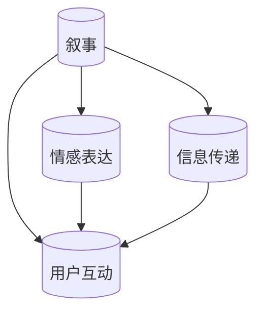

                 

### 《数字时代的创意写作：AI协作下的跨媒体叙事探索》概述

在数字技术飞速发展的今天，创意写作面临着前所未有的变革机遇。本书《数字时代的创意写作：AI协作下的跨媒体叙事探索》旨在探讨人工智能（AI）如何与创意写作相结合，推动跨媒体叙事的发展。通过深入分析AI在创意写作中的应用场景、技术原理以及跨媒体叙事的实现方法，本书为读者提供了一个全面而系统的视角，以理解这一新兴领域的关键技术及其对文学创作和媒体产业的影响。

### 数字时代的创意写作

#### 背景介绍

随着互联网、移动设备、大数据等技术的普及，数字媒体已成为信息传播和娱乐消费的主要形式。这种变化不仅改变了人们获取信息的方式，也对创意写作提出了新的要求。传统写作主要依赖于文字表达，而数字时代的创意写作则需要融合多种媒介，如文字、图像、音频和视频，以创造更加丰富和互动的叙事体验。此外，用户生成内容（UGC）的兴起也为创意写作注入了新的活力，使得创作过程更加开放和参与性。

#### 核心概念与联系

创意写作的核心概念包括叙事、情感表达、信息传递和用户互动。这些概念之间的关系可以用以下Mermaid流程图表示：

#### 传统创意写作的局限

在传统写作中，作者通常独立完成作品，创作过程相对封闭。然而，数字时代要求创意写作更加开放和互动，需要作者与读者、用户之间的紧密互动。此外，传统写作的形式和媒介相对单一，难以满足多样化的用户需求。因此，数字时代的创意写作需要克服这些局限，通过跨媒体叙事实现更加丰富和多元的叙事形式。

### AI协作与跨媒体叙事

#### AI的基本原理

人工智能是基于机器学习、深度学习等算法的计算机系统，能够模拟人类智能进行决策和任务执行。主要技术包括：

1. **机器学习**：通过算法从数据中学习模式和规律，进行预测和分类。
2. **深度学习**：模拟人脑神经元网络，通过多层神经网络处理复杂数据。
3. **自然语言处理（NLP）**：使计算机理解和生成人类语言。

#### AI在创意写作中的应用

AI在创意写作中的应用主要体现在写作辅助、故事生成和个性化推荐等方面。具体包括：

1. **写作辅助**：提供语法检查、拼写纠正、风格建议等功能。
2. **故事生成**：利用机器学习算法生成故事大纲、情节和对话。
3. **个性化推荐**：根据用户喜好推荐相关作品和内容。

#### 跨媒体叙事的概念

跨媒体叙事是指通过多种媒介（如文字、图像、音频、视频）进行叙事，以创造丰富和互动的叙事体验。核心概念包括：

1. **多模态**：融合多种感官信息，如文字、图片、音频等。
2. **互动性**：用户可以参与到叙事过程中，改变故事的走向和结局。
3. **多平台**：在多个平台上展示和传播叙事内容。

#### 跨媒体叙事的特点

1. **多样性**：通过多种媒介，叙事形式更加丰富和多样化。
2. **互动性**：用户与叙事内容互动，参与创作和体验。
3. **多平台**：在不同平台上传播，实现更广泛的受众覆盖。

### 总结

数字时代的创意写作正面临着深刻的变革，AI协作和跨媒体叙事是其中的关键推动力。通过AI的辅助，创意写作可以突破传统形式和媒介的局限，实现更丰富和互动的叙事体验。跨媒体叙事则通过融合多种媒介和用户互动，为创意写作开辟了新的可能性。本书将深入探讨这些主题，帮助读者理解和应用这些关键技术，为数字时代的创意写作提供指导。在接下来的章节中，我们将详细讨论AI的基础知识、创意写作与AI协作的实现方法，以及跨媒体叙事的实际应用案例。

