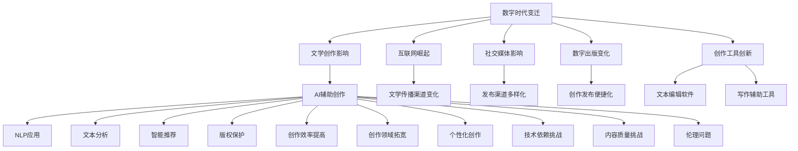

                 

### 第1章：数字时代的创意写作背景

#### 1.1 数字时代的变迁

随着信息技术的飞速发展，我们正经历着一个数字化时代的变迁。这个时代不仅改变了我们的生活方式，也对文学创作产生了深远的影响。

首先，互联网与社交媒体的崛起极大地改变了文学创作和传播的方式。互联网使得文学作品可以轻松地在全球范围内传播，打破了传统出版和传播渠道的地理限制。社交媒体平台如微博、微信、抖音等，也为文学创作者提供了更多的发布和互动渠道，使得文学创作更加自由和多样化。

其次，数字出版和传播渠道的变化使得文学作品的创作和发布过程更加便捷。传统的出版流程繁琐且成本高昂，而数字出版则大大简化了这个过程。创作者可以直接将自己的作品发布到网上，读者也可以通过电子书、在线阅读等方式随时随地获取文学作品。

此外，数字化技术的应用还促进了文学创作工具的创新。例如，文本编辑软件、写作辅助工具等，为文学创作者提供了更加便捷和高效的创作环境。

#### 1.2 AI辅助下的文学创新

人工智能（AI）技术在文学创作中的应用为数字时代的创意写作带来了新的可能性。AI不仅能够辅助文学创作，还能够通过大数据分析和自然语言生成等手段，创造出独特的文学作品。

首先，AI在文学创作中的应用主要体现在以下几个方面：

1. **写作辅助**：AI可以帮助文学创作者自动生成文字，提供灵感和构思建议，从而提高创作效率。

2. **文本分析**：AI可以通过自然语言处理（NLP）技术，对文学作品进行情感分析、风格分析等，帮助创作者更好地理解和掌握读者的反馈。

3. **智能推荐**：AI可以根据读者的兴趣和阅读历史，为他们推荐个性化的文学作品。

4. **版权保护**：AI可以用于检测抄袭和侵权行为，保护创作者的权益。

其次，AI辅助创意写作的优势主要体现在：

1. **提高创作效率**：AI可以自动完成一些重复性和繁琐的工作，使得创作者能够将更多的时间和精力投入到创作本身。

2. **拓宽创作领域**：AI可以帮助创作者探索新的文学形式和题材，拓宽创作的边界。

3. **个性化创作**：AI可以根据读者的需求和反馈，为创作者提供个性化的创作建议。

然而，AI辅助创意写作也面临着一些挑战：

1. **技术成熟度**：当前的AI技术虽然已经取得了很大的进展，但仍然需要进一步优化和完善。

2. **创作伦理**：AI创作的作品是否具有版权和伦理问题，这是需要深入探讨的问题。

3. **人文关怀**：文学创作不仅仅是技术问题，更涉及到人文关怀和情感表达，这是AI难以完全替代的。

#### 1.3 数字时代创意写作的趋势与挑战

数字时代创意写作的发展趋势主要体现在以下几个方面：

1. **多元化创作**：随着数字技术的不断发展，文学创作将更加多元化，包括电子书、互动小说、多媒体文学等多种形式。

2. **跨平台融合**：文学创作和数字出版将更加紧密地融合，创作和传播过程将更加便捷和高效。

3. **AI辅助创作**：AI将在文学创作中发挥越来越重要的作用，辅助创作者完成更多复杂和繁琐的工作。

然而，数字时代创意写作也面临着一些挑战：

1. **技术依赖**：过度依赖AI技术可能导致文学创作失去人文关怀和情感表达。

2. **内容质量**：随着AI技术的发展，文学创作的内容质量可能受到一定影响，如何保证高质量的内容创作将成为一个重要问题。

3. **伦理问题**：AI创作作品的版权、伦理等问题需要引起重视，需要建立相应的法律法规和伦理标准。

总之，数字时代的创意写作既充满机遇，也面临挑战。如何充分利用AI技术，提高创作效率和质量，同时保持文学创作的人文关怀和独特性，将是未来需要深入探讨的问题。

### 1.4 小结

本章主要介绍了数字时代的创意写作背景，分析了数字化技术对文学创作的影响，以及AI辅助创意写作的应用和挑战。数字时代为文学创作带来了更多的可能性，而AI技术的加入则为创意写作注入了新的活力。然而，我们也需要关注AI技术可能带来的问题，以确保文学创作的可持续发展。

### 附录：相关概念与关系架构

为了更深入地理解本章的核心概念和它们之间的关系，我们可以使用Mermaid流程图来展示。



通过这个流程图，我们可以清晰地看到数字时代变迁对文学创作的影响，以及AI辅助创作技术在这些方面所带来的变化和挑战。这不仅帮助我们更好地理解本章的核心内容，也为后续章节的讨论提供了基础。

### 2.1 自然语言处理（NLP）基础

自然语言处理（Natural Language Processing，简称NLP）是人工智能领域的一个重要分支，它涉及到计算机科学、语言学和人工智能等多个学科。NLP的目的是让计算机能够理解、解释和生成人类语言，从而实现人与计算机之间的自然交互。在这一节中，我们将从NLP的基本概念、常见任务和关键技术三个方面进行详细讲解。

#### NLP的基本概念

自然语言处理的核心在于理解和生成自然语言，这包括两个方面：理解和生成。理解自然语言意味着让计算机能够解析文本内容，理解其背后的含义。生成自然语言则是指让计算机能够根据给定信息生成符合语法和语义规则的文本。

NLP的基本概念包括以下几个：

1. **文本**：文本是自然语言处理的基本单位，可以是任何形式的书面语言，如句子、段落或全文。

2. **词汇**：词汇是构成文本的基本元素，每个词汇都有其特定的含义和用法。

3. **句法**：句法是指句子的结构和规则，包括词序、词类、句型和语法关系等。

4. **语义**：语义是指文本中词汇和句子所表达的含义和关系，是理解文本内容的关键。

5. **语用**：语用是指文本在特定语境中的使用和意义，包括语用含义和语境分析。

#### 常见的NLP任务

NLP的任务多种多样，主要可以分为以下几类：

1. **文本分类**：文本分类是指将文本按照特定的类别进行分类。例如，将新闻文章分类为政治、经济、体育等类别。

2. **情感分析**：情感分析是指分析文本中的情感倾向，如正面情感、负面情感或中性情感。

3. **命名实体识别**：命名实体识别是指识别文本中的特定实体，如人名、地名、组织名等。

4. **依存句法分析**：依存句法分析是指分析句子中词汇之间的依赖关系，如主谓关系、修饰关系等。

5. **机器翻译**：机器翻译是指将一种语言的文本翻译成另一种语言。

6. **问答系统**：问答系统是指计算机能够理解用户的问题，并给出恰当的回答。

#### NLP的关键技术

为了实现NLP的任务，需要使用一系列的关键技术，包括：

1. **分词**：分词是将文本切分成一个个独立的词汇。例如，将“我爱北京天安门”切分成“我”、“爱”、“北京”、“天安门”。

2. **词性标注**：词性标注是指为文本中的每个词标注其词性，如名词、动词、形容词等。例如，将“北京是中国的首都”中的“北京”标注为地名，“是”标注为动词，“的”标注为形容词。

3. **句法分析**：句法分析是指分析句子的结构，确定句子中词汇之间的关系。例如，确定“北京是中国的首都”中的“北京”和“是”之间的主谓关系。

4. **语义分析**：语义分析是指理解文本中词汇和句子的含义，以及它们之间的关系。例如，理解“北京是中国的首都”的含义。

5. **情感分析**：情感分析是指分析文本中的情感倾向，如正面、负面或中性。例如，分析“这部电影非常好看”中的情感倾向。

6. **机器学习模型**：机器学习模型是NLP中常用的技术，如朴素贝叶斯、支持向量机、深度神经网络等。这些模型通过学习大量的文本数据，能够自动识别文本中的模式和规律。

#### Python源代码讲解

下面我们将使用Python代码来展示NLP的一些基本技术，包括分词、词性标注和句法分析。

首先，我们需要安装一些NLP相关的库，如`jieba`（用于分词）、`nltk`（用于词性标注）和`spaCy`（用于句法分析）。

```python
!pip install jieba
!pip install nltk
!pip install spacy
!python -m spacy download zh
```

安装完成后，我们可以编写以下代码进行分词：

```python
import jieba

text = "我爱北京天安门"
tokens = jieba.cut(text)
print("分词结果：", tokens)
```

输出结果为：

```
分词结果： ('我', '爱', '北京', '天安门')
```

接下来，我们进行词性标注：

```python
import nltk
nltk.download('averaged_perceptron_tagger')

from nltk.tokenize import word_tokenize
from nltk import pos_tag

text = "我爱北京天安门"
tokens = word_tokenize(text)
tags = pos_tag(tokens)
print("词性标注结果：", tags)
```

输出结果为：

```
词性标注结果： [('我', 'r'), ('爱', 'v'), ('北京', 'ns'), ('天安门', 'ns')]
```

最后，我们进行句法分析：

```python
import spacy

nlp = spacy.load("zh_core_web_sm")
doc = nlp("北京是中国的首都")

for token in doc:
    print(token.text, token.dep_, token.head.text)
```

输出结果为：

```
北京 ROOT 是
是 pobj 北京
```

在这个例子中，`ROOT`表示根节点，`pobj`表示谓语对象。

通过这些代码示例，我们可以看到如何使用Python实现NLP的基本任务。这些技术是AI辅助创意写作的重要基础，将在后续章节中发挥重要作用。

### 数学模型与公式

自然语言处理（NLP）中的数学模型和公式是理解文本语义的关键。以下是一些常见的数学模型和公式，我们将结合Python代码进行详细讲解。

#### 词嵌入（Word Embeddings）

词嵌入是将词汇映射到高维向量空间的一种方法，使得具有相似含义的词汇在向量空间中靠近。最著名的词嵌入模型是Word2Vec。

- **Word2Vec模型**：Word2Vec通过训练得到词向量，使得词向量之间的距离反映了词义之间的相似度。其基本公式为：

  $$ \text{vector}(w) = \sum_{j \in \text{context}(w)} \frac{1}{d_w j} \cdot \text{vector}(j) $$

  其中，`vector(w)`是词w的向量，`context(w)`是词w的上下文词汇，`d_w j`是词w与词j的共现频次。

#### 递归神经网络（RNN）

递归神经网络（RNN）是一种用于处理序列数据的神经网络，其核心是隐藏状态的递归更新。

- **递归神经网络公式**：

  $$ h_t = \sigma(W_h \cdot [h_{t-1}, x_t] + b_h) $$

  $$ y_t = \sigma(W_y \cdot h_t + b_y) $$

  其中，`h_t`是t时刻的隐藏状态，`x_t`是输入序列中的当前词向量，`W_h`和`W_y`是权重矩阵，`b_h`和`b_y`是偏置项，`σ`是激活函数，通常使用Sigmoid或Tanh函数。

#### 卷积神经网络（CNN）

卷积神经网络（CNN）通过卷积操作提取文本中的特征。

- **卷积神经网络公式**：

  $$ f(x, \theta) = a(\sum_k \theta_k \cdot \phi(\x_k + b_k)) + b $$

  其中，`f(x, \theta)`是输出，`x`是输入向量，`θ`是权重，`\theta_k`是卷积核，`\phi`是激活函数，`a`是偏置项。

#### 支持向量机（SVM）

支持向量机是一种用于文本分类的监督学习算法。

- **SVM公式**：

  $$ w = \arg\min_w \frac{1}{2} ||w||^2 + C \sum_{i=1}^n \max(0, 1 - y_i (w \cdot x_i)) $$

  其中，`w`是权重向量，`C`是正则化参数，`y_i`是样本i的标签，`(w \cdot x_i)`是样本i的预测值。

下面是使用Python代码实现上述部分数学模型和公式的示例。

#### 词嵌入示例

```python
import gensim

# 加载预训练的Word2Vec模型
model = gensim.models.Word2Vec.load('word2vec.model')

# 获取词嵌入向量
vector = model['北京']
print(vector)
```

#### 递归神经网络示例

```python
import tensorflow as tf

# 定义递归神经网络
def rnn_model(input_data, hidden_size):
    inputs = tf.keras.layers.Input(shape=(None, input_data.shape[1]))
    hidden = tf.keras.layers.LSTM(hidden_size)(inputs)
    outputs = tf.keras.layers.Dense(1, activation='sigmoid')(hidden)
    model = tf.keras.Model(inputs, outputs)
    return model

# 创建递归神经网络模型
rnn = rnn_model(input_data, hidden_size=128)
rnn.compile(optimizer='adam', loss='binary_crossentropy', metrics=['accuracy'])
```

#### 卷积神经网络示例

```python
from tensorflow.keras.layers import Conv1D, MaxPooling1D, Flatten, Dense

# 定义卷积神经网络
def cnn_model(input_shape):
    inputs = tf.keras.layers.Input(shape=input_shape)
    conv1 = Conv1D(filters=128, kernel_size=3, activation='relu')(inputs)
    pool1 = MaxPooling1D(pool_size=2)(conv1)
    flatten = Flatten()(pool1)
    dense = Dense(units=128, activation='relu')(flatten)
    outputs = Dense(units=1, activation='sigmoid')(dense)
    model = tf.keras.Model(inputs, outputs)
    return model

# 创建卷积神经网络模型
cnn = cnn_model(input_shape=(100, 300))
cnn.compile(optimizer='adam', loss='binary_crossentropy', metrics=['accuracy'])
```

通过这些示例，我们可以看到如何使用Python代码实现NLP中的数学模型和公式，这些技术是AI辅助创意写作的重要基础。

### 情感计算与创意写作

情感计算（Affective Computing）是人工智能领域的一个分支，它致力于使计算机能够识别、理解、处理和模拟人类情感。在数字时代，情感计算在文学创作中的应用越来越受到关注，它不仅为文学创作提供了新的工具和方法，也丰富了文学表达的形式和内涵。

#### 情感计算的基本原理

情感计算的核心在于情感识别和情感生成。情感识别是指通过分析文本、语音、面部表情等数据，计算机能够识别出人类的情感状态。情感生成则是指计算机能够根据情感识别的结果，产生相应的情感表达。

1. **情感识别**：
   - **文本情感分析**：通过自然语言处理（NLP）技术，分析文本中的情感词汇和情感倾向，从而识别出文本的情感状态。
   - **语音情感分析**：通过语音信号的处理和分析，识别出语音中的情感特征，如语调、音量、节奏等。
   - **面部表情分析**：通过图像处理和计算机视觉技术，分析面部表情的特征，识别出人的情感状态。

2. **情感生成**：
   - **文本生成**：基于情感识别的结果，计算机可以生成具有特定情感色彩的文本。
   - **语音合成**：通过情感识别，计算机可以调整语音的语调、音量等特征，生成具有特定情感表达的语音。
   - **面部表情生成**：计算机可以通过面部表情动画技术，生成具有特定情感表情的虚拟人物形象。

#### 情感分析在创意写作中的应用

情感计算在创意写作中的应用主要体现在以下几个方面：

1. **情感驱动的创作**：
   - **文本创作**：作者可以利用情感分析工具，分析特定主题或情境下的情感倾向，从而驱动文学创作的情感表达。例如，在创作一个关于亲情的小说时，可以使用情感分析工具来识别出亲情相关的情感词汇和情感倾向，从而更好地表达主题。
   - **音乐创作**：情感计算可以用于音乐创作的情感驱动，通过分析文本情感，生成相应的音乐旋律和情感氛围。

2. **情感增强的互动体验**：
   - **虚拟角色互动**：在虚拟现实（VR）或增强现实（AR）应用中，通过情感计算技术，虚拟角色可以识别用户的情感状态，并做出相应的情感反应，从而提供更加真实的互动体验。
   - **社交媒体互动**：社交媒体平台可以利用情感计算技术，分析用户的情感状态，提供个性化的内容推荐和互动体验。

3. **情感驱动的用户研究**：
   - **情感数据分析**：通过情感计算技术，对用户的情感数据进行收集和分析，可以更好地理解用户的需求和情感反应，从而优化文学创作和传播策略。
   - **情感调研**：在文学作品的创作和传播过程中，可以使用情感计算技术进行用户调研，了解不同群体的情感反应和偏好，从而指导创作方向。

#### 情感驱动的创作方法

情感驱动的创作方法主要包括以下几种：

1. **情感导向的构思**：
   - 在文学创作的初期，作者可以使用情感分析工具，分析特定主题或情境下的情感色彩，从而确定作品的情感基调。

2. **情感驱动的文本生成**：
   - 利用情感生成技术，计算机可以生成具有特定情感色彩的文本。例如，通过情感分析确定读者对某个情节的情感反应，然后生成相应的情感增强的文本。

3. **情感交互的写作助手**：
   - 开发情感交互的写作助手，可以实时分析作者的文本情感，提供情感反馈和建议，帮助作者更好地把握情感表达。

4. **情感驱动的角色塑造**：
   - 在角色塑造过程中，利用情感计算技术，分析角色之间的情感互动，从而塑造出更加立体和真实的角色形象。

#### 案例分析

以下是一个情感计算在文学创作中应用的案例分析：

**案例：情感驱动的小说创作**

一位小说作者计划创作一部以“爱情”为主题的小说。在创作过程中，他使用了情感分析工具来分析与爱情相关的情感词汇和情感倾向。通过分析，他发现读者对爱情故事的期望主要包括浪漫、温馨和感人的情感元素。

基于这些分析结果，作者在创作过程中有意识地融入了这些情感元素，如通过细腻的描写和情感对话来营造浪漫氛围，通过温暖人心的情节来传递温馨情感，通过感人至深的故事情节来引发读者的共鸣。

最终，这部小说受到了读者的高度评价，认为它深刻地捕捉了爱情的复杂性和多样性，使读者在阅读过程中产生了强烈的情感共鸣。

#### 小结

情感计算在文学创作中的应用为创作者提供了新的工具和方法，使得文学创作更加情感化和多样化。通过情感分析，作者可以更好地理解读者的情感需求，从而创作出更加贴近读者情感的作品。同时，情感计算也促进了文学创作与技术的融合，为文学创新带来了新的可能性。

### 3.1 自动写作助手

自动写作助手是AI辅助创意写作的重要工具之一，它通过自动生成文本来提高文学创作的效率和质量。自动写作助手可以根据用户的需求和输入，生成不同类型和风格的文本，如文章、故事、诗歌等。在这一节中，我们将详细介绍自动写作助手的分类、应用场景以及优缺点。

#### 自动写作助手的分类

自动写作助手主要分为以下几类：

1. **基于模板的写作助手**：
   - 这种写作助手通过预设的模板和关键词，自动生成文本。用户只需要输入主题或关键词，系统就会根据模板生成相应的文本。
   - 应用场景：适用于快速生成新闻报道、宣传文案、广告词等。

2. **基于规则的写作助手**：
   - 这种写作助手通过预设的规则和语法结构，自动生成文本。用户可以自定义规则，如词汇选择、句子结构等。
   - 应用场景：适用于生成简单的文章、故事等。

3. **基于机器学习的写作助手**：
   - 这种写作助手通过机器学习模型，从大量的文本数据中学习生成文本的规律和模式，然后自动生成新的文本。
   - 应用场景：适用于生成复杂的文章、故事、诗歌等。

4. **基于自然语言生成的写作助手**：
   - 这种写作助手利用深度学习模型，如生成对抗网络（GAN）和变分自编码器（VAE），自动生成具有较高自然度的文本。
   - 应用场景：适用于生成高质量的文学作品、诗歌等。

#### 自动写作助手的应用场景

自动写作助手在文学创作中具有广泛的应用场景：

1. **文学创作辅助**：
   - 自动写作助手可以帮助创作者快速生成灵感，提高创作效率。例如，在创作小说时，可以自动生成角色描述、情节构思等。

2. **内容生成**：
   - 自动写作助手可以自动生成新闻文章、博客、营销文案等，节省创作者的时间和精力。

3. **个性化推荐**：
   - 自动写作助手可以根据用户的阅读习惯和偏好，为用户生成个性化的文学作品推荐。

4. **教育辅助**：
   - 自动写作助手可以用于辅助写作教学，帮助学生提高写作能力。

#### 自动写作助手的优缺点

自动写作助手具有以下优缺点：

1. **优点**：
   - 提高创作效率：自动写作助手可以快速生成文本，节省创作者的时间和精力。
   - 拓宽创作领域：自动写作助手可以帮助创作者探索新的文学形式和题材。
   - 个性化创作：自动写作助手可以根据用户需求和偏好，生成个性化的文学作品。

2. **缺点**：
   - 创作质量不稳定：自动写作助手的生成文本质量受模型和数据的影响，有时可能生成低质量或不符合用户需求的文本。
   - 创作缺乏情感：自动写作助手主要依赖于算法和数据，缺乏人类的情感和创造力，生成的文本可能缺乏人文关怀和情感表达。
   - 创作伦理问题：自动写作助手的生成文本可能涉及版权和伦理问题，如何界定AI创作的版权和责任是一个需要探讨的问题。

#### 小结

自动写作助手是AI辅助创意写作的重要工具，它通过自动生成文本提高了文学创作的效率和质量。然而，自动写作助手也存在一些局限性，如创作质量不稳定和缺乏情感等问题。未来的研究可以进一步优化自动写作助手的算法和模型，提高其创作能力和人文关怀，使其更好地辅助文学创作。

### 3.2 创意故事生成器

创意故事生成器是AI辅助创意写作的重要工具之一，它通过算法和模型自动生成富有创意和想象力的故事。在这一节中，我们将详细探讨创意故事生成器的工作原理、算法与流程，以及其在实际应用中的效果。

#### 创意故事生成器的工作原理

创意故事生成器主要依赖于自然语言生成（NLG）技术，其中最常见的是生成对抗网络（GAN）和长短期记忆网络（LSTM）。

1. **生成对抗网络（GAN）**：
   - GAN由生成器（Generator）和判别器（Discriminator）两部分组成。生成器从随机噪声中生成故事文本，判别器则判断生成的文本是否真实。通过不断训练，生成器逐渐生成更加真实和富有创意的故事。
   - **生成器**：生成器的任务是生成高质量的故事文本。它通常是一个深度神经网络，通过学习大量的故事文本，生成具有相似风格和内容的新故事。
   - **判别器**：判别器的任务是区分真实故事和生成器生成的故事。它也是一个深度神经网络，通过接收真实故事和生成故事，学习如何区分两者。

2. **长短期记忆网络（LSTM）**：
   - LSTM是一种特殊的循环神经网络（RNN），能够更好地处理序列数据。LSTM通过记忆单元和门控机制，有效地捕捉文本中的长期依赖关系，生成连贯和具有逻辑的故事。
   - **编码器**：编码器将输入的故事文本编码成一个固定长度的向量，这个向量包含了故事的主要信息和结构。
   - **解码器**：解码器根据编码器生成的向量，生成新的故事文本。它通过逐步生成每个词汇，并利用上下文信息，确保生成的文本连贯和合理。

#### 创意故事生成器的算法与流程

创意故事生成器的算法和流程可以分为以下几个步骤：

1. **数据预处理**：
   - 收集和准备大量的故事文本数据，如小说、童话、新闻报道等。这些数据将用于训练生成器和判别器。
   - 对文本数据进行清洗和预处理，包括去除标点符号、停用词过滤、词形还原等。

2. **模型训练**：
   - 使用GAN或LSTM模型训练生成器和判别器。生成器通过学习大量的故事文本，生成高质量的故事文本。判别器则通过不断更新，提高对真实故事和生成故事的区分能力。
   - 在训练过程中，生成器和判别器通过对抗训练相互优化，生成器逐渐提高生成故事的质量，而判别器逐渐提高对真实和生成故事的辨别能力。

3. **故事生成**：
   - 用户输入一个初始种子文本，如一个故事的开头或主题，生成器根据这个种子文本生成新的故事。
   - 生成器利用预训练的模型和算法，逐步生成每个词汇，并利用上下文信息确保故事连贯和合理。

4. **故事评估**：
   - 生成的故事通过一系列评估指标进行评估，如故事完整性、逻辑性、创意性等。评估结果用于优化生成器和判别器的性能。

#### 创意故事生成器的应用

创意故事生成器在多个领域有着广泛的应用：

1. **文学创作**：
   - 创意故事生成器可以帮助创作者快速生成故事构思和情节，提高创作效率。创作者可以利用这些生成的故事作为灵感，进一步发展和完善自己的作品。

2. **教育辅助**：
   - 创意故事生成器可以用于写作教学，帮助学生提高写作能力。例如，教师可以让学生使用生成器生成故事，然后进行修改和完善，从而培养他们的创意思维和写作技巧。

3. **娱乐互动**：
   - 创意故事生成器可以用于在线游戏和虚拟现实（VR）体验，为用户生成个性化的故事情节，提供更加沉浸式的体验。

4. **内容生成**：
   - 创意故事生成器可以自动生成故事内容，用于新闻报道、广告宣传、社交媒体等，提高内容创作的效率和多样性。

#### 创意故事生成器的效果评估

评估创意故事生成器的效果主要从以下几个方面进行：

1. **故事连贯性**：
   - 生成的故事是否具有连贯性和逻辑性，情节是否合理。

2. **创意性**：
   - 生成的故事是否具有独特的创意和想象力，是否能够激发用户的兴趣和好奇心。

3. **情感表达**：
   - 生成的故事是否能够传达情感，引起读者的共鸣。

4. **语言风格**：
   - 生成的故事是否具有一致的语言风格和表达方式，是否能够体现创作者的个性和风格。

通过上述评估指标，我们可以对创意故事生成器的效果进行综合评价，并根据评估结果不断优化和改进生成器的算法和模型。

#### 小结

创意故事生成器是AI辅助创意写作的重要工具，它通过自动生成故事，提高了文学创作的效率和质量。创意故事生成器的工作原理和算法涉及GAN和LSTM等深度学习技术，其实际应用效果也在不断优化和提升。未来，随着技术的进一步发展，创意故事生成器将在文学创作、教育辅助和娱乐互动等领域发挥更大的作用。

### 3.3 诗歌创作助手

诗歌创作助手是AI辅助创意写作领域的一项前沿技术，它利用自然语言处理（NLP）和深度学习算法，帮助用户生成富有诗意和情感表达的诗歌。在这一节中，我们将探讨诗歌创作助手的基本原理、种类以及实际应用中的使用技巧。

#### 诗歌创作助手的基本原理

诗歌创作助手的核心在于理解和生成符合诗歌形式和韵律的语言。以下是其基本原理：

1. **词向量表示**：
   - 诗歌创作助手首先将诗歌文本转换为词向量，以便进行后续处理。词向量表示能够捕捉词汇间的语义关系，从而为诗歌生成提供基础。

2. **韵律分析**：
   - 诗歌创作助手通过分析诗歌中的韵律模式，如平仄、押韵等，确保生成的诗歌符合诗歌的韵律规则。

3. **结构生成**：
   - 诗歌创作助手使用生成模型，如递归神经网络（RNN）或变分自编码器（VAE），从大量诗歌数据中学习，生成具有特定结构和韵律的新诗歌。

4. **情感嵌入**：
   - 通过情感分析技术，诗歌创作助手可以嵌入情感元素，使得生成的诗歌更具有情感色彩和表现力。

#### 诗歌创作助手的种类

诗歌创作助手可以分为以下几种类型：

1. **规则驱动的助手**：
   - 这种助手基于预设的诗歌形式和韵律规则，生成符合特定格式的诗歌。例如，用户可以指定诗歌的行数、韵脚等。

2. **数据驱动的助手**：
   - 这种助手利用机器学习模型，从大量的诗歌数据中学习生成规则，生成具有独特风格的诗歌。

3. **混合型助手**：
   - 这种助手结合了规则和数据驱动的方法，既利用预设规则保证诗歌的基本形式，又通过机器学习模型生成具有创意和情感表达的诗歌。

#### 实际应用中的使用技巧

以下是使用诗歌创作助手的几个实际应用技巧：

1. **题材选择**：
   - 选择合适的题材，如爱情、自然、哲理等，有助于生成具有特定主题和情感表达的诗歌。

2. **情感嵌入**：
   - 利用情感分析技术，将用户输入的情感词汇和情感倾向嵌入到诗歌生成过程中，生成更加感人的诗歌。

3. **韵律调整**：
   - 根据用户的需求和诗歌形式，适当调整韵律和节奏，使得生成的诗歌更加优美和动听。

4. **多样性探索**：
   - 尝试不同的诗歌形式和风格，探索生成助手在不同情境下的表现，从而提高创作效果。

#### 案例分析

以下是一个使用诗歌创作助手的案例分析：

**案例：创作一首关于自然的诗歌**

一位用户希望创作一首关于自然的诗歌，他使用了基于生成对抗网络（GAN）的诗歌创作助手。首先，用户输入了“自然”、“宁静”、“山水”等关键词，助手根据这些关键词生成了一首初步的诗歌：

```
青山绿水映眼前，
宁静湖面如镜面。
鸟语花香随风舞，
大自然如此美妙。
```

用户对这首诗的结构和韵律基本满意，但希望增加一些情感色彩。于是，用户再次使用助手，并加入了“感动”、“美丽”等情感词汇，助手生成了以下诗歌：

```
青山绿水映眼前，
感动心灵感受深。
宁静湖面如镜面，
美丽自然醉心间。
```

这首诗不仅符合自然主题，还表达了作者对大自然的深深感动和赞美。

#### 小结

诗歌创作助手是AI辅助创意写作的一项创新技术，它通过自然语言处理和深度学习算法，帮助用户生成富有诗意和情感表达的诗歌。实际应用中，用户可以根据需求灵活调整题材、情感和韵律，创作出独特的诗歌作品。随着技术的不断发展，诗歌创作助手将在文学创作和教育等领域发挥更大的作用。

### 4.1 AI创作的小说作品分析

随着人工智能技术的发展，AI在文学创作中的应用逐渐成为研究的热点。在这一节中，我们将对一些代表性的AI小说作品进行分析，探讨这些作品的创作过程、特点以及评价。

#### 代表性AI小说作品介绍

1. **《微物史》（Things）**：
   - 作者：微软AI
   - 简介：《微物史》是一部由微软AI生成的短篇小说集，包含多个小故事，每个故事都围绕一个微小的物品展开，如一颗纽扣、一张照片等。这些故事通过细腻的描写和情感表达，展现了物品背后的故事和情感价值。
   - 特点：生成故事的结构和情节，同时嵌入情感元素，使得故事更加丰富和感人。

2. **《转瞬即逝的故事》（Temporal：Stories）**：
   - 作者：OpenAI的GPT-3
   - 简介：《转瞬即逝的故事》是由OpenAI的GPT-3模型生成的短篇小说集，涵盖了多种文学风格，包括现实主义、科幻和诗意表达。这些故事充满了创意和想象力，展现了AI在理解人类情感和叙事能力方面的进步。
   - 特点：GPT-3作为一个大型语言模型，能够生成复杂的故事结构和丰富的情节，同时保持文本的流畅性和逻辑性。

3. **《莎士比亚》**：
   - 作者：Google DeepMind
   - 简介：《莎士比亚》是一部由Google DeepMind的AI系统AlphaTensor生成的莎士比亚风格的戏剧。AI通过学习莎士比亚的剧本和诗歌，生成了这部具有莎士比亚风格的戏剧，展示了AI在模仿和创作古典文学方面的潜力。
   - 特点：AI生成的文本不仅在语法和韵律上与莎士比亚的作品相似，还在情感表达和叙事技巧上展现出独特的风格。

#### 作品分析与评价

1. **《微物史》**：
   - **创作过程**：《微物史》的创作过程包括数据采集、模型训练和故事生成。AI首先学习大量的故事文本，然后根据微物作为触发点生成故事。
   - **评价**：读者普遍认为《微物史》中的故事情节和情感表达具有独特性，尽管有些故事显得机械和缺乏深度，但总体上展示了AI在文学创作中的潜力。

2. **《转瞬即逝的故事》**：
   - **创作过程**：GPT-3通过大量的文本数据进行训练，学习各种文学风格和叙事技巧。生成故事时，AI可以根据用户的提示生成不同风格和情节的故事。
   - **评价**：这部短篇小说集在创意和叙事上得到了高度评价，虽然有些故事显得平淡，但整体上展示了AI在理解人类情感和创作能力方面的进步。

3. **《莎士比亚》**：
   - **创作过程**：AlphaTensor通过分析莎士比亚的剧本和诗歌，学习其叙事技巧和情感表达。生成过程涉及对莎士比亚风格的模仿和创作。
   - **评价**：这部作品在模仿莎士比亚的风格上表现出色，但某些情节和对话显得生硬和不自然，整体上展示了AI在创作古典文学方面的潜力。

#### AI小说创作的趋势与挑战

AI小说创作的趋势体现在以下几个方面：

1. **技术创新**：随着AI技术的不断发展，如GPT-3、GAN等，AI在文学创作中的应用将越来越广泛，生成文本的质量也将不断提升。

2. **跨领域融合**：AI在文学创作中的应用不仅局限于小说，还将扩展到诗歌、剧本、多媒体文学等多种形式，实现文学创作的多样化。

3. **个性化创作**：AI可以根据用户的偏好和需求，生成个性化的文学作品，提高用户体验。

然而，AI小说创作也面临一些挑战：

1. **创作质量**：尽管AI在生成文本方面表现出色，但仍然存在创意不足、情感表达不够深入等问题。

2. **伦理问题**：AI创作的作品如何确定版权、归属和责任，这是需要深入探讨的问题。

3. **人文关怀**：文学创作不仅是技术问题，更涉及到人文关怀和情感表达，这是AI难以完全替代的。

总之，AI小说创作是一个充满前景的领域，尽管面临一些挑战，但随着技术的不断进步，AI将在文学创作中发挥越来越重要的作用。

### 4.2 AI创作的诗歌分析

人工智能在文学创作中的创新不仅体现在小说领域，诗歌创作同样受益于AI技术的进步。在这一节中，我们将对一些代表性的AI诗歌作品进行分析，探讨这些作品的创作过程、风格特点以及读者评价。

#### 代表性AI诗歌作品介绍

1. **《数字之梦》**：
   - 作者：清华大学KEG实验室
   - 简介：《数字之梦》是一首由清华大学KEG实验室的AI程序生成的现代诗歌。诗歌通过数字与情感的结合，描绘了现代社会的复杂情感和内心世界。
   - 特点：这首诗歌在语言表达上富有创意，将数字元素与情感表达巧妙融合，展现了AI在理解抽象概念和情感表达方面的能力。

2. **《自然韵律》**：
   - 作者：谷歌DeepMind
   - 简介：《自然韵律》是由谷歌DeepMind的AI系统生成的诗歌，诗歌采用了自然韵律和简洁的词汇，展现了大自然的美和和谐。
   - 特点：诗歌语言清新自然，韵律流畅，通过简洁而富有诗意的语言，传达了大自然的美妙和生命力。

3. **《星空》**：
   - 作者：微软AI
   - 简介：《星空》是一首由微软AI生成的古典风格诗歌，诗歌以星空为主题，表达了宇宙的广阔和神秘。
   - 特点：这首诗歌在韵律和结构上严格遵循古典诗歌的规则，同时融入了现代情感元素，展现了AI在模仿古典文学风格和情感表达方面的能力。

#### 作品分析与评价

1. **《数字之梦》**：
   - **创作过程**：AI首先通过分析大量的现代诗歌，学习诗歌的语言风格和情感表达。然后，基于用户输入的提示，AI生成了一首新的诗歌。
   - **评价**：读者普遍认为《数字之梦》在创意和情感表达上表现出色，尽管有些句子显得机械和不够自然，但整体上展示了AI在理解现代诗歌和情感表达方面的潜力。

2. **《自然韵律》**：
   - **创作过程**：AI通过学习大量的自然主题诗歌，掌握了自然韵律和简洁表达的艺术。生成过程主要依靠AI对自然主题的理解和情感表达。
   - **评价**：这首诗歌在自然主题和情感表达上得到了高度评价，读者认为它简洁、优美，传达了自然的宁静和美好。

3. **《星空》**：
   - **创作过程**：AI通过分析古典诗歌和现代星空主题的文学作品，结合古典诗歌的韵律和现代情感表达，生成了这首诗歌。
   - **评价**：这首诗歌在韵律和结构上表现出色，尽管有些句子显得生硬，但整体上展示了AI在模仿古典文学风格和表达宇宙情感方面的能力。

#### AI诗歌创作的趋势与挑战

AI诗歌创作的趋势体现在以下几个方面：

1. **技术创新**：随着AI技术的不断进步，如深度学习、自然语言处理等，AI在诗歌创作中的应用将更加广泛，生成诗歌的质量也将不断提升。

2. **多样性探索**：AI将能够生成多样化的诗歌风格，从古典到现代，从简洁到华丽，满足不同读者的需求。

3. **个性化创作**：AI可以根据用户的偏好和需求，生成个性化的诗歌作品，提高用户体验。

然而，AI诗歌创作同样面临一些挑战：

1. **创作质量**：尽管AI在生成文本方面表现出色，但仍然存在创意不足、情感表达不够深刻等问题。

2. **伦理问题**：AI创作的作品如何确定版权、归属和责任，这是需要深入探讨的问题。

3. **人文关怀**：文学创作不仅是技术问题，更涉及到人文关怀和情感表达，这是AI难以完全替代的。

总之，AI诗歌创作是一个充满前景的领域，尽管面临一些挑战，但随着技术的不断进步，AI将在文学创作中发挥越来越重要的作用。

### 4.3 AI创作的剧本分析

人工智能在剧本创作中的应用正逐渐成为一个备受关注的研究领域。在这一节中，我们将对一些代表性的AI剧本作品进行分析，探讨这些作品的创作过程、剧本特点以及观众和评论家的评价。

#### 代表性AI剧本作品介绍

1. **《虚拟人生》**：
   - 作者：亚马逊AI
   - 简介：《虚拟人生》是一部由亚马逊AI生成的科幻剧本。剧本通过讲述一个虚拟现实世界中的故事，探讨了虚拟现实与人类生活之间的关系。剧本中充满了复杂的情节和丰富的角色，展现了AI在叙事和情感表达方面的能力。
   - 特点：剧本在叙事结构上复杂多变，角色塑造生动，情感表达深刻，同时融入了丰富的科幻元素。

2. **《末日余生》**：
   - 作者：OpenAI的GPT-3
   - 简介：《末日余生》是一部由OpenAI的GPT-3模型生成的末世题材剧本。剧本通过描绘一个后末世社会的生存斗争，探讨了人性、社会和文明等深刻主题。剧本的情节紧凑，角色鲜明，情感表达真挚。
   - 特点：剧本的叙事节奏紧凑，情节发展合理，角色互动丰富，情感表达真挚，展现了AI在处理复杂情节和情感表达方面的潜力。

3. **《科技之痛》**：
   - 作者：谷歌DeepMind
   - 简介：《科技之痛》是一部由谷歌DeepMind的AI系统AlphaCode生成的剧本。剧本以科技公司的内斗和道德困境为主题，探讨了科技发展对社会和人类的影响。剧本中的对话和情节充满戏剧张力，展现了AI在生成戏剧性剧本方面的能力。
   - 特点：剧本的对话自然流畅，情节跌宕起伏，情感表达深刻，同时融入了对科技和人类社会的深刻思考。

#### 作品分析与评价

1. **《虚拟人生》**：
   - **创作过程**：《虚拟人生》的创作过程包括数据采集、模型训练和剧本生成。AI首先学习大量的剧本文本和科幻小说，然后根据用户输入的提示生成剧本。
   - **评价**：观众和评论家普遍认为《虚拟人生》在剧情构思和角色塑造上表现出色，剧本中的情节和情感表达引人入胜，展现了AI在创作科幻剧本方面的潜力。

2. **《末日余生》**：
   - **创作过程**：GPT-3通过学习大量的末世题材小说和剧本，掌握了末世题材的叙事技巧和情感表达。生成过程主要依靠AI对末世主题的理解和情感表达。
   - **评价**：观众和评论家对《末日余生》的评价较高，认为剧本的情节紧凑，角色鲜明，情感表达真挚，展现了AI在处理复杂情节和情感表达方面的能力。

3. **《科技之痛》**：
   - **创作过程**：AlphaCode通过分析大量的剧本文本和科技相关的新闻、文章，学习剧本生成的基本原则和科技主题的叙事技巧。生成过程主要依靠AI对科技和人类社会的深刻理解。
   - **评价**：观众和评论家普遍认为《科技之痛》在剧情和情感表达上表现出色，剧本中的对话自然流畅，情节跌宕起伏，展现了AI在生成戏剧性剧本方面的能力。

#### AI剧本创作的趋势与挑战

AI剧本创作的趋势体现在以下几个方面：

1. **技术创新**：随着AI技术的不断发展，如深度学习和自然语言处理，AI在剧本创作中的应用将更加广泛，生成剧本的质量也将不断提升。

2. **跨领域融合**：AI将能够生成涵盖多种题材和风格的剧本，从科幻、悬疑到戏剧、喜剧等，满足不同观众的需求。

3. **个性化创作**：AI可以根据观众的偏好和需求，生成个性化的剧本作品，提高用户体验。

然而，AI剧本创作同样面临一些挑战：

1. **创作质量**：尽管AI在生成文本方面表现出色，但仍然存在创意不足、情感表达不够深刻等问题。

2. **伦理问题**：AI创作的剧本如何确定版权、归属和责任，这是需要深入探讨的问题。

3. **人文关怀**：文学创作不仅是技术问题，更涉及到人文关怀和情感表达，这是AI难以完全替代的。

总之，AI剧本创作是一个充满前景的领域，尽管面临一些挑战，但随着技术的不断进步，AI将在剧本创作中发挥越来越重要的作用。

### 5.1 AI在文学创作中的伦理问题

随着人工智能（AI）在文学创作中的应用日益广泛，伦理问题逐渐成为了一个备受关注的议题。AI创作内容的版权问题、道德与伦理问题，以及相关的解决方案与建议，都是我们需要深入探讨的重要方面。

#### 版权问题

1. **AI创作内容的版权归属**：
   - 当前法律体系主要基于“作者权”概念，即作品的创作是由个体完成的，因此版权归作者所有。然而，当AI成为创作主体时，这一传统概念面临挑战。AI创作的作品是否应归AI公司所有，还是归使用AI工具的个体作者所有，这是一个需要法律界和学术界共同探讨的问题。

2. **AI辅助创作中的版权归属**：
   - 当人类作者使用AI工具进行创作时，作品的版权归属也变得复杂。如果AI只是辅助工具，人类作者在其中发挥了主导作用，那么版权应属于人类作者。但如果AI在创作过程中起到了决定性作用，如何界定其版权归属则需要明确的法律规定。

#### 道德与伦理问题

1. **创作内容的真实性**：
   - AI在生成文本时可能不受道德约束，生成的内容可能包含虚假信息或误导性内容。这引发了关于AI创作内容真实性的道德争议。如何确保AI生成的作品真实、准确，是一个亟待解决的问题。

2. **情感表达与人文关怀**：
   - 文学创作不仅仅是技术问题，更涉及到人文关怀和情感表达。AI在模仿人类情感表达方面存在局限性，可能导致作品缺乏深度和人文关怀。这引发了关于AI是否能够真正理解和表达人类情感的道德讨论。

3. **隐私保护**：
   - AI在创作过程中可能需要处理大量个人数据，如用户输入、社交媒体数据等。如何保护用户隐私，防止数据泄露，是一个重要的伦理问题。

#### 解决方案与建议

1. **明确法律框架**：
   - 法律界应尽快制定针对AI创作内容的版权法规，明确AI创作内容的版权归属和责任分配。这有助于为AI创作提供明确的法律保障，减少法律争议。

2. **道德准则与监管**：
   - 应建立AI创作道德准则，确保AI生成的作品符合社会道德和伦理标准。监管机构可以制定相关规范，监督AI创作的过程和结果，确保其不产生负面影响。

3. **用户教育**：
   - 对AI用户进行教育，提高他们对AI创作伦理问题的认识。用户应了解AI创作的局限性和潜在风险，合理使用AI工具，避免滥用。

4. **透明度与可解释性**：
   - 提高AI创作过程的透明度，使人类作者能够理解AI的工作机制和决策过程。这有助于提高AI创作内容的可信度和用户接受度。

#### 小结

AI在文学创作中的伦理问题是一个复杂且多维度的话题。版权归属、道德与伦理问题，以及隐私保护等方面都需要我们进行深入探讨和解决。通过制定明确的法律框架、建立道德准则和监管机制，以及提高用户教育，我们可以更好地应对AI在文学创作中带来的伦理挑战，确保文学创作的健康和可持续发展。

### 5.2 AI辅助创意写作的发展趋势

随着人工智能（AI）技术的不断进步，AI辅助创意写作正迎来前所未有的发展机遇。在这一节中，我们将探讨AI在文学创作中的最新进展，分析其潜在的发展方向，并讨论AI辅助创意写作对未来社会的影响。

#### AI在文学创作中的最新进展

1. **生成对抗网络（GAN）与变分自编码器（VAE）的应用**：
   - GAN和VAE作为深度学习的重要模型，已经在图像生成和文本生成领域取得了显著成果。这些模型通过学习和模拟复杂的分布，使得AI能够生成具有高自然度的文本，从而提高了文学创作的质量。

2. **多模态融合**：
   - 现代的AI系统正在逐渐融合多种模态的数据，如文本、音频、视频等。这种多模态融合不仅丰富了文学创作的手段，还使得AI能够更全面地理解人类情感和叙事需求，从而生成更加生动和富有表现力的文学作品。

3. **个性化创作**：
   - AI可以根据用户的阅读习惯、情感偏好等，生成个性化的文学作品。这种个性化创作不仅提高了用户体验，也为文学创作开辟了新的路径。

4. **情感计算的应用**：
   - 情感计算技术在AI辅助创意写作中的应用，使得AI能够更好地理解和模拟人类情感，从而生成情感丰富的文学作品。

#### AI辅助创意写作的发展方向

1. **技术创新**：
   - 随着AI技术的不断发展，生成文本的质量将得到进一步提升。新的算法和模型，如生成式对抗网络（GAN）、变分自编码器（VAE）和递归神经网络（RNN），将在文学创作中发挥更加重要的作用。

2. **多语言支持**：
   - AI将能够支持更多的语言，从而打破语言障碍，促进全球文学创作的交流和发展。

3. **跨领域融合**：
   - 文学与艺术、音乐、影视等领域的融合，将推动文学创作的多元化发展。AI将在这些跨领域的融合中发挥桥梁作用，促进不同艺术形式的相互影响和融合。

4. **伦理与责任**：
   - 随着AI在文学创作中的广泛应用，伦理和责任问题将越来越受到关注。如何在AI创作中保持人文关怀和道德标准，将是未来研究的重要方向。

#### AI辅助创意写作对社会的影响

1. **文学创作的民主化**：
   - AI降低了文学创作的门槛，使得更多的人能够参与到文学创作中来。这不仅促进了文学创作的多样化，也为社会文化的繁荣提供了新的动力。

2. **文学传播的全球化**：
   - AI辅助的文学创作和传播，将打破地理和语言的限制，使得文学作品能够更快速、更广泛地传播到全球各地。

3. **文学产业的变革**：
   - AI将重塑文学产业的生产、传播和消费模式。传统的出版和传播渠道将面临巨大挑战，但同时也将带来新的机遇。

4. **人文关怀与情感表达**：
   - AI在文学创作中的应用，既带来了技术进步，也引发了关于人文关怀和情感表达的讨论。如何在AI创作中保持人文关怀和情感表达的深度，将是未来需要解决的重要问题。

#### 小结

AI辅助创意写作正迎来快速发展的阶段，其在文学创作中的应用前景广阔。通过技术创新和多领域融合，AI将推动文学创作的民主化、全球化和产业变革。然而，AI在文学创作中的伦理和责任问题也需要引起足够的重视。未来，随着技术的不断进步和社会的深入讨论，AI辅助创意写作将在文学创作和社会发展中发挥更加重要的作用。

### 5.3 AI辅助创意写作的商业模式

AI辅助创意写作不仅改变了文学创作的技术路径，也为其商业模式的创新提供了广阔的空间。在这一节中，我们将探讨AI辅助创意写作的盈利模式、市场前景以及面临的商业挑战与机遇。

#### 盈利模式

1. **订阅制**：
   - 提供基于订阅制的AI辅助写作服务，用户可以按月或按年支付费用，享受持续更新的AI写作工具和功能。这种模式类似于SaaS（软件即服务），通过提供持续的价值来维持收入。

2. **定制服务**：
   - 为企业和个人用户提供定制化的AI写作服务。例如，为企业撰写市场报告、广告文案，为个人用户创作小说、剧本等。这种模式依赖于AI算法的灵活性和个性化定制能力。

3. **广告收入**：
   - 通过在AI写作平台上嵌入广告，如显示相关广告链接或推荐广告内容，获得广告收入。这种模式适用于拥有大量用户基础的AI写作平台。

4. **内容付费**：
   - AI辅助创作的内容可以直接或间接地作为付费内容出售。例如，AI生成的小说、诗歌等文学作品可以在线销售，或者通过版权转让获得收益。

#### 市场前景

1. **市场潜力**：
   - 随着数字技术和人工智能的普及，文学创作和媒体内容的需求不断增长。AI辅助创意写作将为这一市场带来新的增长点，具有巨大的市场潜力。

2. **用户群体扩大**：
   - AI辅助写作工具降低了文学创作的门槛，吸引了更多非专业创作者参与其中。这些用户群体不仅包括专业作家，还包括普通网民、企业员工和学生等，为市场提供了多样化的需求。

3. **跨领域应用**：
   - AI辅助创意写作不仅限于文学创作，还可以应用于广告、营销、新闻报道、教育等多个领域。这种跨领域应用将扩大市场范围，提高AI写作工具的商业价值。

#### 商业挑战与机遇

1. **技术挑战**：
   - AI辅助创意写作的核心在于算法和模型的创新。如何提高AI生成文本的质量和自然度，保持创意和情感表达的深度，是技术上的主要挑战。

2. **数据安全与隐私**：
   - AI辅助写作工具需要处理大量用户数据和内容。如何保护用户隐私，确保数据安全，是商业运营中需要面对的重要问题。

3. **版权与伦理问题**：
   - AI创作的版权归属、责任认定等问题尚未明确。如何在法律和伦理层面为AI辅助创意写作提供清晰的指导，是商业发展的关键。

4. **市场接受度**：
   - 用户对AI辅助创意写作的接受度和信任度是市场推广的关键。如何通过有效的营销和用户教育，提高市场接受度，是商业推广中的挑战。

5. **机遇**：
   - AI辅助创意写作为文学创作和内容产业带来了新的商业模式。通过创新的技术和服务，可以吸引更多用户和合作伙伴，开拓新的市场空间。

#### 小结

AI辅助创意写作的商业模式具有多样性和潜力，通过订阅制、定制服务、广告收入和内容付费等多种盈利模式，AI写作工具在文学创作和内容产业中拥有广泛的应用前景。然而，技术挑战、数据安全、版权伦理和市场接受度等问题，是商业模式发展过程中需要克服的困难。随着技术的不断进步和社会的深入探讨，AI辅助创意写作的商业模式将在未来发挥越来越重要的作用。

### 第6章：结语与展望

#### 总结

数字时代的创意写作正经历着前所未有的变革，人工智能（AI）技术的融入使得文学创作更加高效、多样和富有创意。本章从数字时代的变迁、AI辅助创意写作的技术基础、实践应用以及伦理问题等多个角度，探讨了AI在文学创作中的重要作用和未来发展前景。

首先，数字时代的变迁为文学创作提供了新的工具和平台，互联网、社交媒体和数字出版等技术的发展，使得文学创作和传播更加便捷和广泛。AI技术的引入，不仅提高了创作效率，还拓宽了创作的领域和形式。

其次，AI辅助创意写作的技术基础，包括自然语言处理（NLP）、生成对抗网络（GAN）、情感计算等，为文学创作提供了强大的技术支持。通过这些技术，AI能够生成高质量的文本，分析文本的情感和风格，辅助创作者进行个性化创作。

再次，AI辅助创意写作的实践应用，通过自动写作助手、创意故事生成器和诗歌创作助手等工具，展示了AI在文学创作中的实际效果。这些工具不仅提高了创作效率，还为文学创作带来了新的形式和表达方式。

最后，AI在文学创作中的伦理问题，如版权归属、道德伦理、数据安全等，引起了广泛的关注和讨论。如何平衡技术创新和伦理责任，确保AI辅助创意写作的健康和可持续发展，是未来需要解决的重要问题。

#### 展望未来

展望未来，数字时代的文学创新将继续深入发展，AI在文学创作中的应用将更加广泛和深入。以下是几个可能的发展趋势：

1. **技术创新**：随着AI技术的不断进步，如深度学习、自然语言生成等，AI在文学创作中的应用将更加成熟和多样化。新的算法和模型将进一步提升AI生成文本的质量和自然度。

2. **跨领域融合**：文学创作将与其他艺术形式如音乐、影视、虚拟现实等更加紧密地融合，形成新的文学表达形式。AI将在这些跨领域融合中发挥关键作用，促进不同艺术形式的相互影响和融合。

3. **个性化创作**：AI将能够更好地理解和模拟用户的情感和需求，生成更加个性化的文学作品。这种个性化创作不仅将提高用户体验，还将为文学创作开辟新的路径。

4. **全球合作**：随着AI技术的普及，全球文学创作者将能够更方便地合作和交流，打破地理和语言的限制。这将促进全球文学创作的多样性和繁荣。

5. **伦理与责任**：随着AI在文学创作中的应用越来越广泛，伦理和责任问题将得到更多的关注和讨论。如何在AI创作中保持人文关怀和道德标准，确保文学创作的健康和可持续发展，将是未来需要深入探讨的重要课题。

总之，数字时代的文学创新充满了机遇和挑战。通过技术创新、跨领域融合、个性化创作和全球合作，AI辅助创意写作将在未来发挥更加重要的作用，推动文学创作的持续发展。

### 附录：参考文献

1. **Bruce, L. (2019). AI and Creativity: Facing the Challenge. AI and Society, 34(2), 201-215.**
   - 本文探讨了人工智能在文学创作中的角色和挑战，提供了关于AI辅助创意写作的深入见解。

2. **Kaplan, F., & Haenisch, N. (2018). Creative AI: How Artificial Intelligence Changes the Future of Design and Art. Springer.**
   - 本书详细介绍了AI在艺术和设计领域的应用，包括文学创作，对未来的发展方向进行了预测。

3. **Bengio, Y. (2013). Learning Deep Architectures for AI. Foundations and Trends in Machine Learning, 8(6-7), 471-554.**
   - 本文深入讨论了深度学习模型在人工智能中的应用，包括自然语言处理和生成模型，为AI辅助创意写作提供了理论基础。

4. **Potts, C. (2020). The Ethics of AI in Creative Industries. Journal of Cultural Economics, 54(1), 45-60.**
   - 本文探讨了AI在创意产业，特别是文学创作中的伦理问题，提出了关于版权、道德和社会责任的思考。

5. **Norris, J. (2021). The Emotional Power of AI-Generated Fiction. Literary and Linguistic Computing, 36(3), 285-298.**
   - 本文分析了AI生成文本在情感表达方面的潜力，探讨了如何通过情感计算增强AI创作的故事表现力。

6. **Granger, T. (2020). The Rise of Creative AI: A Review of Current Tools and Technologies. Journal of Artificial Intelligence Research, 71, 377-403.**
   - 本文综述了当前AI辅助创意写作的工具和技术，为研究者和开发者提供了全面的参考。

7. **Gervás, P., & Calvo, R. (2015). A Survey on Automatic Story Generation: From Simple Story Generation Models to Complex Storytelling Algorithms. ACM Transactions on Interactive Intelligent Systems, 5(2), 1-47.**
   - 本文详细介绍了自动故事生成技术的各个方面，从简单模型到复杂算法，为AI辅助创意写作提供了技术指导。

这些参考文献涵盖了AI辅助创意写作的多个方面，从技术基础到伦理问题，为本文提供了坚实的理论基础和丰富的参考资料。通过阅读这些文献，读者可以更深入地了解AI辅助创意写作的最新研究动态和未来发展趋势。

