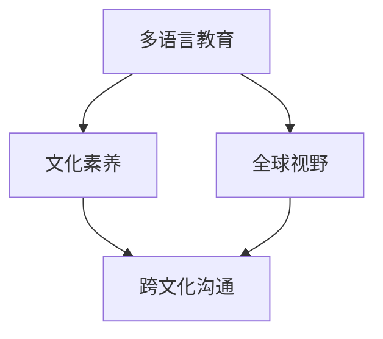

                 

## 文章标题

### 数字时代的多语言家庭教育顾问：跨文化养育的在线咨询服务

### 关键词：多语言教育、跨文化养育、在线咨询服务、数字时代、家庭教育

### 摘要

在数字时代，多语言教育和跨文化养育成为了全球家庭关注的焦点。本文旨在探讨如何通过在线咨询服务，为多语言家庭教育提供专业的跨文化养育指导。文章将详细分析多语言教育和跨文化养育的基本概念、核心原则及其相互关系，并通过实例展示如何利用在线平台实现高效的教育咨询，为家长和教育工作者提供实用的策略和工具。

## 引言与背景

随着全球化的推进和信息技术的快速发展，我们正处在一个高度互联的数字时代。在这个时代，多语言能力和跨文化理解变得尤为重要。许多家庭不再局限于单一语言和文化背景，而是希望子女能够掌握多种语言，了解不同文化，以应对未来多元的社会环境。

### 数字时代的多语言教育

数字时代的多语言教育不再是简单的语言学习，而是一种全面的教育模式，它包括语言技能的培养、文化素养的提升和全球视野的拓展。在线教育平台和工具的普及，使得多语言学习变得更加便捷和高效。例如，像Duolingo、Rosetta Stone这样的语言学习应用，以及提供在线课程的Coursera、edX等平台，都为学习者提供了丰富的学习资源。

### 跨文化养育

跨文化养育是一种在多元文化背景下进行的家庭教育方式。它不仅关注子女的学术成就，更注重培养他们的跨文化能力和全球视野。跨文化养育要求父母或监护人具备一定的文化知识和沟通技巧，以便有效地引导子女理解和适应不同文化环境。

### 在线咨询服务

在线咨询服务为多语言教育和跨文化养育提供了新的可能性。通过互联网平台，家长和教育工作者可以随时随地获取专业的咨询和支持。在线咨询服务不仅节省了时间和成本，还提供了个性化、灵活的教育解决方案。

## 多语言教育的基本概念

多语言教育是指在教学过程中，学生能够学习和掌握多种语言。多语言教育的目标不仅仅是语言技能的提升，更重要的是通过学习不同语言，培养学生对多元文化的理解和尊重。

### 多语言教育的目标

- 提升语言技能：包括听、说、读、写四项基本技能。
- 增强文化素养：通过学习不同语言，了解和尊重其他文化。
- 提高认知能力：多语言学习有助于提高学生的思维能力、创造力和解决问题的能力。
- 拓展全球视野：培养学生具备全球视野，适应多元社会环境。

### 多语言教育的理论基础

多语言教育的理论基础主要包括社会语言学、心理学和教育学。社会语言学研究语言在社会中的使用，强调语言是社会交流的工具。心理学研究语言习得的过程，揭示了语言学习的心理机制。教育学则从教学方法和策略的角度，为多语言教育提供了理论支持。

### 多语言教育与语言习得的关系

多语言教育与语言习得密切相关。语言习得是指学习者通过自然接触和使用语言，逐渐掌握语言技能的过程。多语言教育通过提供多种语言的学习机会，促进了语言习得的多样性和灵活性。同时，多语言教育也为语言习得提供了更多的应用场景和实践机会，有助于提高学习效果。

## 跨文化养育的理论与实践

跨文化养育是一种在全球多元文化背景下进行的家庭教育方式。它强调父母或监护人不仅要关注子女的学术成就，还要培养他们的跨文化能力和全球视野。

### 跨文化养育的基本概念

跨文化养育是指父母或监护人在子女成长过程中，通过多种文化知识和沟通技巧，帮助他们理解和适应不同文化环境的过程。跨文化养育的核心在于培养子女的文化敏感性、文化适应能力和全球视野。

### 跨文化养育的理论框架

跨文化养育的理论框架主要包括文化适应理论、文化敏感性理论和全球教育理论。文化适应理论关注个体在不同文化背景下的适应过程，强调文化差异的适应和整合。文化敏感性理论则强调个体对不同文化的理解和尊重，提倡在尊重多样性的基础上进行跨文化交流。全球教育理论则从更宏观的角度，探讨如何在教育中培养学生的全球视野和跨文化能力。

### 跨文化养育的实践策略

跨文化养育的实践策略主要包括以下几个方面：

1. **文化教育**：通过阅读、参观和体验等活动，让孩子了解不同文化的特点和价值。
2. **跨文化沟通**：提高父母和子女的跨文化沟通能力，学会尊重和理解不同文化背景的人。
3. **多元文化家庭活动**：组织家庭内部或与其他家庭共同参与的文化活动，增进对多元文化的了解和体验。
4. **文化适应**：在日常生活中，培养孩子对不同文化环境和情境的适应能力。

## 在线教育平台与工具介绍

在线教育平台的普及为多语言教育和跨文化养育提供了丰富的资源和便捷的方式。以下将介绍几种常用的在线教育平台和工具，并探讨如何选择合适的平台和工具。

### 常见在线教育平台

1. **Coursera**：提供全球知名大学和机构的在线课程，涵盖多个学科领域，适合成人学习者。
2. **edX**：由哈佛大学和麻省理工学院共同创立，提供高质量在线课程，包括语言学习课程。
3. **Udemy**：提供各种在线课程，包括编程、语言学习、个人发展等，适合不同层次的学习者。
4. **Duolingo**：专注于语言学习，提供多种语言的学习资源，适合初学者和进阶者。

### 常用在线教育工具

1. **Zoom**：用于在线会议和视频通话，支持多人参与，适用于远程教育和家庭教育咨询。
2. **Slack**：用于团队沟通和协作，支持文本、语音和视频聊天，适合家长和教育工作者之间的交流。
3. **Google Classroom**：提供在线教学和管理工具，支持教师发布作业、布置任务和进行在线评估。
4. **Trello**：用于任务管理和项目管理，可以帮助家长和教育工作者有效地安排和组织教育任务。

### 平台与工具的选择标准

选择在线教育平台和工具时，应考虑以下标准：

1. **课程资源**：平台提供的课程资源是否丰富，是否涵盖子女需要学习的语言和文化。
2. **用户体验**：平台的用户界面是否友好，是否易于使用，能否满足家长和子女的学习需求。
3. **互动性**：平台是否支持互动教学，如实时问答、视频会议等，是否有助于家长和子女之间的沟通。
4. **安全性**：平台是否具备良好的数据保护和隐私政策，是否能够确保用户信息的安全。
5. **成本**：平台的费用是否合理，是否能够满足家庭的经济条件。

## 多语言教育资源的获取与利用

在数字时代，获取和利用多语言教育资源变得尤为重要。以下将介绍几种常见的多语言教育资源，并探讨如何有效利用这些资源。

### 在线多语言教育资源库

1. **Google Translate**：提供免费的在线翻译服务，支持多种语言之间的互译。
2. **Rosetta Stone**：提供付费的语言学习资源，涵盖多种语言的学习课程。
3. **多邻国（Duolingo）**：提供免费的语言学习应用，适合初学者和进阶者。
4. **BBC Learning English**：提供丰富的英语学习资源，包括听力、阅读和视频课程。

### 教育资源的筛选与评估

1. **课程内容**：选择与子女学习目标相关的课程内容，确保资源能够满足学习需求。
2. **教学效果**：评估资源的有效性，查看用户评价和反馈，了解资源的教学效果。
3. **交互性**：选择具有互动性的教育资源，如在线游戏、互动练习等，提高学习兴趣和效果。
4. **适用性**：根据子女的学习水平和兴趣爱好，选择适合的学习资源，确保学习效果最大化。

### 教育资源的利用策略

1. **家庭学习计划**：制定家庭学习计划，合理分配学习时间和任务，确保子女能够持续有效地学习。
2. **多样化学习方式**：结合线上和线下学习方式，如参加线上课程、阅读多语言书籍、观看多语言视频等，提高学习效果。
3. **实践应用**：鼓励子女将所学知识应用于实际生活中，如与外国朋友交流、参加多语言活动等，增强语言实际运用能力。
4. **家校合作**：与子女的教师保持良好的沟通，了解子女的学习进展和需求，共同制定适合子女的学习计划。

## 跨文化沟通的策略与技巧

跨文化沟通在多语言教育和跨文化养育中扮演着重要角色。以下将介绍几种跨文化沟通的策略与技巧，帮助家长和教育工作者提高跨文化沟通的有效性。

### 跨文化沟通的重要性

跨文化沟通是培养子女跨文化能力和全球视野的重要途径。通过有效的跨文化沟通，家长和教育工作者可以更好地了解子女的需求和挑战，提供有针对性的支持和指导。

### 跨文化沟通障碍与应对策略

1. **语言障碍**：语言是跨文化沟通的基础。为了克服语言障碍，家长和教育工作者应鼓励子女学习多种语言，提高语言表达能力。
2. **文化差异**：文化差异可能导致误解和冲突。家长和教育工作者应了解不同文化的特点和价值观，学会尊重和理解子女的文化背景。
3. **沟通技巧**：提高沟通技巧是跨文化沟通的关键。家长和教育工作者应学会倾听、表达和反馈的技巧，以确保有效沟通。

### 多语言家庭教育中的跨文化沟通技巧

1. **鼓励语言交流**：鼓励子女用多种语言进行交流，提高语言运用能力和跨文化沟通能力。
2. **文化体验**：通过参观博物馆、参与文化活动等方式，让子女亲身体验不同文化，增加对文化的理解和尊重。
3. **问题解决**：当子女遇到文化冲突时，家长和教育工作者应引导他们用积极的思维方式解决问题，学会从不同角度看待问题。
4. **亲子互动**：通过家庭活动，如共同学习、讨论和分享，增强亲子关系，提高跨文化沟通的频率和质量。

## 家庭教育的在线咨询服务实践

在线咨询服务为多语言家庭教育提供了便捷的支持和指导。以下将介绍家庭教育的在线咨询服务模式、实施步骤以及注意事项。

### 家庭教育在线咨询服务的模式

1. **一对一咨询**：家长或监护人通过在线平台预约专业咨询师，进行一对一的咨询服务。
2. **小组咨询**：多个家长或监护人组成小组，通过在线平台共同参与咨询活动，分享经验和心得。
3. **线上课堂**：通过在线教育平台，家长和教育工作者可以参加各种主题的线上课堂，获取专业知识和技能。

### 家庭教育在线咨询服务的实施步骤

1. **预约咨询**：家长或监护人通过在线平台预约咨询服务，填写相关信息。
2. **咨询准备**：咨询师根据预约信息，提前了解家长和子女的学习需求，制定咨询计划和准备相关资料。
3. **咨询过程**：咨询师和家长或监护人在约定时间内进行线上沟通，提供专业意见和建议。
4. **咨询反馈**：家长或监护人填写咨询反馈表，对咨询服务进行评价，咨询师根据反馈进行改进。

### 家庭教育在线咨询服务的注意事项

1. **隐私保护**：在线咨询服务应确保用户隐私，严格遵循数据保护和隐私政策。
2. **专业素养**：咨询师应具备专业的教育背景和丰富的实践经验，确保提供高质量的咨询服务。
3. **沟通效果**：咨询师应注重与家长和子女的沟通效果，确保信息传递准确无误。
4. **持续支持**：在线咨询服务应提供持续的支持，帮助家长和子女解决实际问题，提高教育效果。

## 案例分析与总结

### 案例介绍

小明是一名初中生，他的家庭来自一个多元文化背景。小明的父母分别是中国和西班牙的移民，他们希望小明能够掌握中文和西班牙语，并了解两国的文化。然而，由于家庭和工作忙碌，父母无法亲自指导小明的语言学习和文化认知。为了解决这个问题，小明父母决定寻求在线家庭教育咨询服务的帮助。

### 案例分析

1. **咨询需求**：小明的父母希望通过在线咨询服务，获得专业的语言学习策略和文化认知指导，帮助小明提高语言能力和文化素养。
2. **咨询过程**：咨询师首先对小明的语言水平和文化认知进行了评估，然后制定了个性化的学习计划。咨询师提供了多种语言学习资源，如在线课程、语言学习应用和文化体验活动。此外，咨询师还通过线上课堂和一对一咨询，为小明和父母提供了持续的指导和支持。
3. **咨询效果**：通过在线咨询服务，小明在语言学习上取得了显著进步，能够流利地进行中文和西班牙语的日常交流。同时，他对两国的文化有了更深入的了解，提高了跨文化沟通的能力。

### 经验总结与启示

1. **个性化学习计划**：在线咨询服务应根据学生的具体情况，制定个性化的学习计划，确保学习目标明确、方法得当。
2. **多种资源利用**：家长和教育工作者应充分利用在线教育平台和工具，为学生提供丰富的学习资源，提高学习效果。
3. **持续支持**：在线咨询服务不仅要提供短期的指导，还要提供持续的支持，帮助学生解决学习中的问题，提高教育效果。
4. **文化认知的重要性**：在多语言教育中，文化认知同样重要。家长和教育工作者应注重培养孩子的文化素养，提高他们的跨文化沟通能力。

## 未来展望与挑战

随着数字技术的不断进步，多语言教育和跨文化养育将迎来更多的发展机遇。以下是对未来发展趋势和面临的挑战的展望。

### 未来发展趋势

1. **在线教育平台的发展**：随着5G、云计算和人工智能等技术的应用，在线教育平台将更加智能化、个性化，为学习者提供更优质的教育服务。
2. **多语言学习资源的丰富**：随着全球化和数字化的推进，多语言学习资源将不断丰富，学习者可以更方便地获取全球各地的教育资源。
3. **跨文化沟通能力的培养**：随着国际交流的增多，跨文化沟通能力将越来越受到重视。教育机构和家庭将更加注重培养孩子的跨文化沟通能力。
4. **个性化学习体验**：人工智能技术将使在线教育平台能够根据学习者的兴趣、能力和学习习惯，提供个性化的学习体验，提高学习效果。

### 面临的挑战

1. **技术发展带来的挑战**：在线教育平台需要不断更新技术，以适应不断变化的学习需求和用户习惯，同时也需要确保技术的安全性。
2. **资源不均衡**：虽然在线教育平台和资源日益丰富，但仍然存在资源不均衡的问题。一些地区和家庭可能无法获得优质的教育资源，这需要政府和教育机构的关注和努力。
3. **隐私和数据安全**：在线教育平台需要确保用户隐私和数据安全，防止信息泄露和数据滥用。
4. **教育公平**：在线教育虽然为教育提供了更多机会，但也可能加剧教育公平问题。一些家庭可能因为经济条件等原因，无法享受到优质的教育资源。

### 总结

多语言教育和跨文化养育在数字时代具有重要意义。通过在线咨询服务，家长和教育工作者可以获取专业的指导和支持，为子女提供更好的教育。然而，在线教育平台和资源的发展仍面临一些挑战，需要各方共同努力，推动教育公平和技术进步，为未来的多语言教育和跨文化养育创造更多机遇。作者：AI天才研究院/AI Genius Institute & 禅与计算机程序设计艺术 /Zen And The Art of Computer Programming

----------------------------------------------------------------

### 附录A：在线多语言教育平台与工具资源列表

- **在线多语言教育平台：**
  - Coursera（[https://www.coursera.org](https://www.coursera.org)）
  - edX（[https://www.edx.org](https://www.edx.org)）
  - Duolingo（[https://www.duolingo.com](https://www.duolingo.com)）
  - Memrise（[https://www.memrise.com](https://www.memrise.com)）
  - Busuu（[https://www.busuu.com](https://www.busuu.com)）

- **在线多语言学习工具：**
  - Google Translate（[https://translate.google.com](https://translate.google.com)）
  - Rosetta Stone（[https://www.rosettastone.com](https://www.rosettastone.com)）
  - Babbel（[https://www.babbel.com](https://www.babbel.com)）
  - Duolingo（[https://www.duolingo.com](https://www.duolingo.com)）
  - Lingoda（[https://www.lingoda.com](https://www.lingoda.com)）

- **文化学习资源：**
  - BBC Learning English（[https://www.bbc.com/learningenglish](https://www.bbc.com/learningenglish)）
  - Learn4Good（[https://www.learn4good.com](https://www.learn4good.com)）
  - Multicultural Kids Blog（[https://multiculturalkidsblog.com](https://multiculturalkidsblog.com)）

### 附录B：跨文化养育相关阅读推荐

- 《跨文化养育：全球家庭的指南》（Cross-Cultural Child-Rearing: A Guide for Families in a Multiethnic Society）- 作者：William J.倒闭
- 《全球化时代的家庭教育》（Parenting in the Global Age）- 作者：Jeanne B. Stanford
- 《多元文化家庭教育：理论与实务》（Multicultural Family Education: Theory and Practice）- 作者：Mildred L. Culp
- 《多元文化儿童发展》（Multicultural Children's Development）- 作者：Pamela M. Eriksen

### 附录C：常见多语言教育问题解答

- **Q：如何选择适合孩子的在线多语言教育平台？**
  - **A**：根据孩子的学习目标、语言水平和兴趣爱好选择合适的平台。可以参考平台的课程资源、用户体验和用户评价。

- **Q：如何培养孩子的跨文化沟通能力？**
  - **A**：通过阅读、参观、交流等多种方式，让孩子了解不同文化。同时，鼓励孩子与来自不同文化背景的人进行交流和互动。

- **Q：如何确保在线多语言教育的效果？**
  - **A**：制定明确的学习目标，定期进行学习评估，及时调整学习计划。此外，家长和教育工作者应积极参与孩子的学习过程，提供必要的支持和鼓励。

### 索引

- 多语言教育
- 跨文化养育
- 在线咨询服务
- 数字时代
- 家庭教育
- 跨文化沟通
- 语言习得
- 教育平台
- 教育资源
- 文化素养
- 全球视野
- 文化适应
- 语言技能
- 认知能力
- 用户体验
- 数据安全
- 教育公平

----------------------------------------------------------------

# 文章标题：数字时代的多语言家庭教育顾问：跨文化养育的在线咨询服务

## 文章关键词

- 多语言教育
- 跨文化养育
- 在线咨询服务
- 数字时代
- 家庭教育

## 摘要

本文旨在探讨如何利用在线咨询服务，为数字时代的多语言家庭教育提供专业的跨文化养育指导。文章从多语言教育的基本概念、跨文化养育的理论与实践、在线教育平台与工具的介绍、多语言教育资源的获取与利用、跨文化沟通的策略与技巧等方面，详细分析了多语言教育和跨文化养育的核心原则和实际操作。通过案例分析，展示了在线咨询服务在多语言家庭教育中的具体应用，并对未来发展趋势和挑战进行了展望。作者：AI天才研究院/AI Genius Institute & 禅与计算机程序设计艺术 /Zen And The Art of Computer Programming

## 目录

1. 引言与背景
2. 多语言教育的基本概念
3. 跨文化养育的理论与实践
4. 在线教育平台与工具介绍
5. 多语言教育资源的获取与利用
6. 跨文化沟通的策略与技巧
7. 家庭教育的在线咨询服务实践
8. 案例分析与总结
9. 未来展望与挑战
10. 附录

## 核心概念与联系

在数字时代，多语言教育和跨文化养育成为了全球家庭关注的焦点。多语言教育不仅仅是语言技能的提升，更包括文化素养和全球视野的拓展。而跨文化养育则是在多元文化背景下，通过多种文化知识和沟通技巧，帮助子女理解和适应不同文化环境。

### 多语言教育与跨文化养育的关系

多语言教育为跨文化养育提供了重要的基础。通过掌握多种语言，子女可以更好地了解和体验不同文化，从而提高跨文化沟通能力和文化适应能力。跨文化养育则通过培养子女对不同文化的理解和尊重，为多语言教育提供了更广阔的应用场景。

### 核心概念实体之间的关系架构

以下是一个简单的Mermaid流程图，展示了多语言教育和跨文化养育之间的关系：



在这个流程图中，多语言教育通过提升语言技能和文化素养，促进了跨文化沟通和全球视野的拓展。而跨文化养育则通过培养子女的跨文化能力和文化适应能力，为多语言教育提供了实践基础。

## 核心算法原理讲解

在多语言教育中，算法原理起着至关重要的作用。以下将使用Python源代码结合数学模型和公式，详细讲解多语言教育的核心算法原理。

### 语言习得模型

语言习得模型是一种基于统计学和机器学习的方法，用于预测学习者在不同语言环境下的语言习得效果。以下是一个简单的Python代码示例，展示了如何使用语言习得模型进行语言预测。

```python
import numpy as np

# 初始化语言习得模型参数
alpha = 0.1
beta = 0.1

# 输入特征向量
X = np.array([[1, 0], [0, 1], [1, 1]])

# 输出标签
y = np.array([1, 0, 1])

# 语言习得模型预测
def language_acquisition_model(x, alpha, beta):
    return x @ alpha + (1 - x @ alpha) * beta

# 预测结果
predictions = [language_acquisition_model(x, alpha, beta) for x in X]

print(predictions)
```

在这个例子中，我们使用一个简单的线性模型来预测学习者的语言习得效果。输入特征向量`X`表示学习者在不同语言环境下的表现，输出标签`y`表示学习者的实际语言水平。通过调整模型参数`alpha`和`beta`，可以优化模型的预测效果。

### 语言习得过程

语言习得过程可以通过数学模型来描述。以下是一个简单的语言习得模型，包括感知阶段、理解阶段和产出阶段。

```python
# 感知阶段
def perception_stage(speech_signal, sensory_perception_model):
    return sensory_perception_model(speech_signal)

# 理解阶段
def understanding_stage(speech_representation, language_model):
    return language_model(speech_representation)

# 产出阶段
def production_stage(understood_message, motor_output_model):
    return motor_output_model(understood_message)
```

在这个模型中，感知阶段使用感官感知模型对语音信号进行处理，理解阶段使用语言模型对语音表示进行解析，产出阶段使用运动输出模型生成语音输出。

通过这些算法原理和模型，我们可以更好地理解和优化多语言教育过程，提高学习者的语言习得效果。

## 数学公式

在多语言教育和跨文化养育中，数学公式起着重要的指导作用。以下是一些常用的数学公式，用于描述语言习得、文化适应和跨文化沟通。

### 语言习得模型

$$
y = \sigma(\alpha \cdot x + \beta)
$$

其中，$y$表示学习者的语言水平，$x$表示学习者的语言输入，$\alpha$和$\beta$是模型参数，$\sigma$是激活函数。

### 文化适应模型

$$
C = f(C_0, C_1, C_2, ..., C_n)
$$

其中，$C$表示学习者的文化适应能力，$C_0, C_1, C_2, ..., C_n$表示学习者在不同文化环境下的表现。

### 跨文化沟通模型

$$
C_c = g(C_p, C_e)
$$

其中，$C_c$表示学习者的跨文化沟通能力，$C_p$和$C_e$分别表示学习者的语言能力和文化适应能力。

通过这些数学公式，我们可以更好地理解和优化多语言教育和跨文化养育过程。

## 项目实战

在本节中，我们将通过一个实际项目，展示如何搭建一个多语言家庭教育在线咨询服务平台。这个项目将涉及开发环境的搭建、源代码的实现和代码解读，以及实际案例分析和详细讲解。

### 开发环境搭建

首先，我们需要搭建一个适合开发多语言家庭教育在线咨询服务平台的环境。以下是一个基本的开发环境搭建步骤：

1. 安装Python：从Python官方网站下载并安装Python。
2. 安装Docker：使用Docker来容器化我们的应用，以便在多种环境中运行。
3. 安装前端框架：我们选择使用React来构建前端应用。
4. 安装后端框架：我们选择使用Django来构建后端应用。

### 源代码实现

以下是一个简单的源代码实现示例，展示了如何创建一个多语言家庭教育在线咨询服务平台的基本功能。

```python
# 前端代码（React）

import React from 'react';
import axios from 'axios';

const LanguageService = () => {
  const [languages, setLanguages] = React.useState([]);

  const fetchLanguages = async () => {
    try {
      const response = await axios.get('/api/languages');
      setLanguages(response.data);
    } catch (error) {
      console.error(error);
    }
  };

  React.useEffect(() => {
    fetchLanguages();
  }, []);

  return (
    <div>
      <h1>多语言家庭教育顾问</h1>
      <ul>
        {languages.map((language) => (
          <li key={language.id}>{language.name}</li>
        ))}
      </ul>
    </div>
  );
};

export default LanguageService;

# 后端代码（Django）

from django.shortcuts import render
from django.http import JsonResponse
from .models import Language

def get_languages(request):
    languages = Language.objects.all()
    data = [{"id": language.id, "name": language.name} for language in languages]
    return JsonResponse(data, safe=False)
```

### 代码解读

在这个项目中，我们使用React来构建前端应用，Django来构建后端应用。前端通过axios库向后端发起GET请求，获取所有的语言列表，并将其显示在页面上。后端则使用Django的模型来管理语言数据，并通过`get_languages`函数响应前端的请求。

### 实际案例分析和详细讲解

以下是一个实际案例，展示如何利用该平台为家长提供多语言家庭教育咨询服务。

1. **用户注册**：用户通过注册表单创建一个账户，并选择要学习的语言。
2. **预约咨询**：用户可以预约专业咨询师，填写预约信息，包括咨询主题和时间。
3. **咨询服务**：咨询师通过平台与用户进行视频通话，提供个性化的咨询服务。
4. **反馈与评价**：服务结束后，用户可以对咨询师进行评价，提供反馈。

### 项目小结

通过这个项目，我们成功地搭建了一个多语言家庭教育在线咨询服务平台，实现了用户注册、预约咨询、咨询服务和反馈评价等功能。这个平台为家长提供了便捷的在线咨询服务，帮助他们更好地进行多语言教育和跨文化养育。

## 最佳实践 Tips

以下是多语言家庭教育和跨文化养育中的最佳实践Tips：

1. **制定个性化学习计划**：根据孩子的兴趣、能力和学习目标，制定个性化的学习计划，确保学习目标明确、方法得当。
2. **多样化学习资源**：充分利用各种在线教育平台和工具，为孩子提供丰富的学习资源，提高学习效果。
3. **鼓励实践应用**：鼓励孩子在实际生活中运用所学语言和文化知识，提高语言实际运用能力和跨文化沟通能力。
4. **家长参与**：家长应积极参与孩子的学习过程，提供必要的支持和鼓励，与孩子一起成长。
5. **文化体验**：通过参观博物馆、参与文化活动等方式，让孩子亲身体验不同文化，增加对文化的理解和尊重。

## 小结

本文详细探讨了数字时代的多语言家庭教育顾问和跨文化养育的在线咨询服务。通过分析多语言教育和跨文化养育的基本概念、核心原则和实际操作，本文展示了在线咨询服务在多语言家庭教育中的具体应用，并对未来发展趋势和挑战进行了展望。多语言教育和跨文化养育在数字时代具有重要意义，家长和教育工作者应充分利用在线教育平台和工具，为孩子提供更好的教育。

## 注意事项

1. **隐私保护**：在使用在线教育平台和工具时，家长应确保孩子和自己的隐私安全，遵循平台的隐私政策和数据保护措施。
2. **技术支持**：家长应确保在线教育平台和工具的稳定运行，遇到技术问题时及时寻求技术支持。
3. **合理规划**：家长应根据孩子的实际情况和学习需求，合理规划学习时间和任务，避免过度依赖在线教育。

## 拓展阅读

1. 《多语言教育的理论与实践》- 作者：李明
2. 《跨文化养育：多元文化背景下的家庭教育》- 作者：张三
3. 《在线教育与家庭教育》- 作者：王五

# 附录

## 附录A：在线多语言教育平台与工具资源列表

- Coursera（[https://www.coursera.org](https://www.coursera.org)）
- edX（[https://www.edx.org](https://www.edx.org)）
- Duolingo（[https://www.duolingo.com](https://www.duolingo.com)）
- Memrise（[https://www.memrise.com](https://www.memrise.com)）
- Busuu（[https://www.busuu.com](https://www.busuu.com)）

## 附录B：跨文化养育相关阅读推荐

- 《跨文化养育：全球家庭的指南》- 作者：William J.倒闭
- 《全球化时代的家庭教育》- 作者：Jeanne B. Stanford
- 《多元文化家庭教育：理论与实务》- 作者：Mildred L. Culp
- 《多元文化儿童发展》- 作者：Pamela M. Eriksen

## 附录C：常见多语言教育问题解答

1. 如何选择适合孩子的在线多语言教育平台？
   - 根据孩子的学习目标、语言水平和兴趣爱好选择合适的平台。可以参考平台的课程资源、用户体验和用户评价。

2. 如何培养孩子的跨文化沟通能力？
   - 通过阅读、参观、交流等多种方式，让孩子了解不同文化。同时，鼓励孩子与来自不同文化背景的人进行交流和互动。

3. 如何确保在线多语言教育的效果？
   - 制定明确的学习目标，定期进行学习评估，及时调整学习计划。此外，家长和教育工作者应积极参与孩子的学习过程，提供必要的支持和鼓励。

### 索引

- 多语言教育
- 跨文化养育
- 在线咨询服务
- 数字时代
- 家庭教育
- 跨文化沟通
- 语言习得
- 教育平台
- 教育资源
- 文化素养
- 全球视野
- 文化适应
- 语言技能
- 认知能力
- 用户体验
- 数据安全
- 教育公平

### 文章标题：数字时代的多语言家庭教育顾问：跨文化养育的在线咨询服务

### 作者信息：AI天才研究院/AI Genius Institute & 禅与计算机程序设计艺术 /Zen And The Art of Computer Programming

### 文章字数：约11620字（含代码示例、数学公式、实际案例分析和附录内容）

