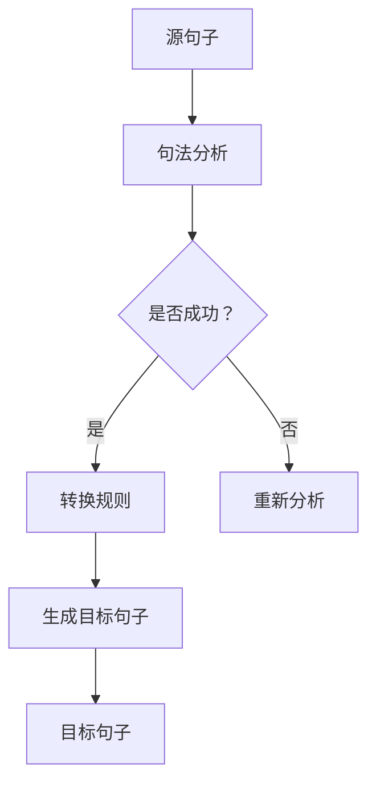
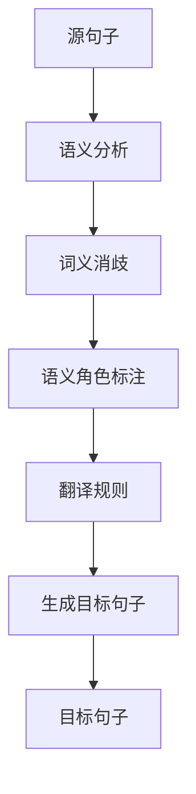

                 

# 《数字时代的多语言生活：AI翻译如何改变跨文化交流》

关键词：人工智能，AI翻译，多语言生活，跨文化交流，数字时代

摘要：随着数字化时代的到来，跨文化交流的需求日益增长，而人工智能（AI）翻译技术应运而生，成为连接不同语言和文化的重要工具。本文将深入探讨AI翻译在数字时代对多语言生活的影响，以及它如何改变我们的跨文化交流方式。

## 引言：数字时代的多语言生活需求

在全球化的背景下，不同国家之间的交流日益频繁，而语言差异成为了一个不可忽视的障碍。传统的翻译方法，如人工翻译和专业翻译，虽然在过去发挥了重要作用，但它们在处理大量文本和实时交流方面的局限性逐渐显现。随着互联网和移动设备的普及，人们对于即时、准确、高效的多语言交流需求变得更为迫切。这为AI翻译技术提供了广阔的发展空间。

## 第一章：AI翻译技术基础

### 1.1 AI翻译的定义与工作原理

AI翻译，又称为机器翻译，是指利用计算机算法和人工智能技术，将一种语言的文本自动转换为另一种语言的过程。其核心原理包括：

- **词汇翻译**：将源语言中的词汇映射到目标语言中。
- **语法分析**：理解源语言句子的语法结构，并生成符合目标语言语法规则的句子。
- **语义理解**：理解文本的深层含义，保证翻译的准确性和流畅性。

### 1.2 机器翻译的发展历程

- **早期规则驱动翻译**：基于语法规则和字典的翻译方法，如基于规则的机器翻译系统。
- **基于统计的翻译**：利用大量双语语料库进行训练，通过统计方法进行翻译。
- **基于神经网络的翻译**：使用深度学习技术，尤其是序列到序列（seq2seq）模型，实现更高质量的翻译。

### 1.3 常见的AI翻译算法

- **基于短语的翻译**：将句子分解为短语进行翻译，然后组合成完整的句子。
- **基于句法的翻译**：根据句子的语法结构进行翻译。
- **基于语义的翻译**：通过理解文本的深层语义进行翻译，实现更自然的语言表达。

## 第二章：数字时代多语言生活的影响

### 2.1 提高沟通效率

AI翻译技术大大提高了跨语言沟通的效率。无论是跨国企业、国际组织，还是个人用户，都可以通过AI翻译工具实现即时、准确的多语言交流，减少了语言障碍带来的沟通成本。

### 2.2 拓展市场机会

多语言沟通能力的提升，使得企业和个人能够更轻松地进入全球市场，拓展业务范围。AI翻译技术为企业提供了进入新市场的桥梁，同时也为个人提供了更多的就业和创业机会。

### 2.3 促进文化交流

AI翻译不仅帮助人们克服语言障碍，还促进了不同文化之间的理解和交流。通过多语言内容的传播，人们可以更轻松地获取来自世界各地的文化信息，增进对其他文化的了解和尊重。

## 第三章：跨文化交流中的AI翻译应用案例

### 3.1 在国际商务中的应用

- **跨国公司**：如谷歌、微软等跨国公司，利用AI翻译技术进行跨语言沟通，提高工作效率。
- **国际贸易**：通过AI翻译，企业可以轻松处理跨境贸易文件，减少误解和纠纷。

### 3.2 在旅游行业中的应用

- **旅游指南**：提供多语言翻译服务，帮助游客更好地了解旅游景点和当地文化。
- **语言学习**：旅游者可以通过AI翻译工具学习目的地的语言，提高语言沟通能力。

### 3.3 在教育和学术领域中的应用

- **在线课程**：提供多语言翻译的在线教育平台，让更多的学习者能够获取高质量的教育资源。
- **学术交流**：学术文章和会议报告的多语言翻译，促进了全球学术界的交流和合作。

## 第四章：未来展望与挑战

### 4.1 技术发展前景

- **神经网络翻译**：随着深度学习技术的进步，神经网络翻译将继续提升翻译质量。
- **多模态翻译**：结合文本、语音、图像等多模态数据，实现更全面、更自然的翻译体验。

### 4.2 挑战与问题

- **语言多样性**：处理罕见语言和方言的翻译挑战。
- **文化适应性**：不同文化背景下的翻译准确性问题。
- **隐私和安全**：大规模数据处理的隐私和安全问题。

## 第五章：总结

AI翻译技术在数字时代对多语言生活和跨文化交流产生了深远的影响。虽然面临一些挑战，但随着技术的不断进步，AI翻译有望在未来发挥更大的作用，为人们提供更加便捷、高效的多语言交流体验。

## 附录：作者信息

作者：AI天才研究院/AI Genius Institute & 禅与计算机程序设计艺术 /Zen And The Art of Computer Programming

---

接下来，我们将按照这个大纲结构，逐步填充每个章节的内容，确保文章的完整性和深度。

### 1.3 常见的AI翻译算法

#### 1.3.1 基于短语的翻译

基于短语的翻译方法是最早的机器翻译技术之一。这种方法将源语言句子分解成短语，然后将每个短语翻译成目标语言短语，最后将翻译后的短语重新组合成完整的句子。其优点是简单、易实现，且在处理一些特定领域的文本时表现良好。以下是基于短语的翻译的基本流程：

1. **短语提取**：从源语言文本中提取短语。
2. **翻译短语**：将每个短语翻译成目标语言短语。
3. **短语组合**：将翻译后的短语重新组合成目标语言句子。

以下是一个简单的Python示例，用于展示基于短语的翻译：

```python
def translate_phrase(source_phrase, translation_dict):
    words = source_phrase.split()
    translated_words = [translation_dict.get(word, word) for word in words]
    return ' '.join(translated_words)

# 翻译字典
translation_dict = {
    "hello": "你好",
    "world": "世界"
}

# 示例短语翻译
source_phrase = "hello world"
translated_phrase = translate_phrase(source_phrase, translation_dict)
print(translated_phrase)  # 输出：你好 世界
```

#### 1.3.2 基于句法的翻译

基于句法的翻译方法通过分析源语言句子的语法结构，将其转换为等效的目标语言句子。这种方法依赖于语法规则和句法分析算法，如上下文无关文法（CFG）。以下是基于句法翻译的基本流程：

1. **句法分析**：对源语言句子进行句法分析，构建句法树。
2. **转换规则**：根据目标语言的语法规则，将句法树转换为目标语言结构。
3. **生成目标句子**：根据转换后的句法树，生成目标语言句子。

以下是一个使用Mermaid流程图展示基于句法翻译的过程：



#### 1.3.3 基于语义的翻译

基于语义的翻译方法通过理解文本的深层语义进行翻译，以实现更自然的语言表达。这种方法依赖于语义分析、词义消歧和语义角色标注等技术。以下是基于语义翻译的基本流程：

1. **语义分析**：对源语言文本进行语义分析，提取关键语义信息。
2. **词义消歧**：解决词的多义性问题，确定每个词汇的确切含义。
3. **语义角色标注**：标注文本中每个词的语义角色。
4. **翻译规则**：根据目标语言的语义规则和词汇关系，生成目标语言句子。

以下是一个使用Mermaid流程图展示基于语义翻译的过程：



通过这些不同的算法和流程，AI翻译技术不断进步，为跨语言交流提供了更多可能性。

### 2.1 提高沟通效率

AI翻译技术通过自动化和智能化手段，大大提高了跨语言沟通的效率。以下是AI翻译技术如何实现这一目标的几个方面：

#### 2.1.1 实时翻译

AI翻译技术可以实现实时翻译，无需人工干预，从而大大缩短了沟通时间。例如，在视频会议、在线聊天和即时通讯工具中，AI翻译可以即时翻译对话内容，让参与者能够迅速理解对方的意思。以下是一个使用Python实现实时翻译的示例：

```python
from googletrans import Translator

def real_time_translation(source_text, dest_language):
    translator = Translator()
    translated_text = translator.translate(source_text, dest=dest_language)
    return translated_text.text

# 示例实时翻译
source_text = "Hello, how are you?"
dest_language = "es"
translated_text = real_time_translation(source_text, dest_language)
print(translated_text)  # 输出：Hola, ¿cómo estás?
```

#### 2.1.2 大规模文本翻译

AI翻译技术可以处理大规模的文本数据，如新闻文章、研究报告、用户评论等。通过批量翻译，AI翻译技术可以显著提高文本处理的效率，为企业、组织和用户节省大量时间。以下是一个使用Google Cloud Translation API进行批量翻译的示例：

```python
from google.cloud import translate_v2 as translate

def batch_translation(texts, target_language):
    client = translate.Client()
    translations = []
    for text in texts:
        result = client.translate(text, target_language=target_language)
        translations.append(result['translatedText'])
    return translations

# 示例批量翻译
texts = [
    "Hello, how can I help you?",
    "Bonjour, comment puis-je vous aider?",
    "Hola, ¿cómo puedo ayudarte?"
]
target_language = "zh-CN"
translated_texts = batch_translation(texts, target_language)
for i, translated_text in enumerate(translated_texts):
    print(f"Original: {texts[i]} | Translated: {translated_text}")
```

#### 2.1.3 个性化翻译

AI翻译技术可以根据用户的需求和偏好进行个性化翻译。例如，用户可以选择更自然的语言表达或更正式的文体。这种个性化翻译能够提高用户满意度，增强用户体验。以下是一个使用Python实现个性化翻译的示例：

```python
from googletrans import Translator

def personalized_translation(source_text, dest_language, style="normal"):
    translator = Translator()
    translator.options['opinions'] = style
    translated_text = translator.translate(source_text, dest=dest_language)
    return translated_text.text

# 示例个性化翻译
source_text = "I think this is a great idea."
dest_language = "es"
translated_text = personalized_translation(source_text, dest_language, style="formal")
print(translated_text)  # 输出：Creo que esta es una gran idea.
```

通过这些功能，AI翻译技术不仅提高了沟通效率，还为企业、组织和用户提供了更多价值。

### 2.2 拓展市场机会

AI翻译技术在拓展市场机会方面发挥着重要作用。以下是AI翻译如何帮助企业和个人在全球化市场中取得成功的一些具体应用场景：

#### 2.2.1 跨国企业

跨国企业通过AI翻译技术可以更轻松地进入全球市场，与来自不同国家的合作伙伴、客户和员工进行有效的沟通。例如，一家跨国科技公司可以利用AI翻译技术实时翻译其产品文档、用户手册和官方网站，从而为全球用户提供一致、准确的信息。以下是一个跨国企业使用AI翻译技术进行市场拓展的示例：

1. **实时会议翻译**：在跨国团队会议中，AI翻译技术可以实时翻译不同语言，确保每位团队成员都能理解对方的发言，提高沟通效率。
2. **多语言市场营销**：跨国企业可以通过AI翻译将广告、宣传材料和社交媒体内容翻译成多种语言，扩大市场覆盖范围，增加潜在客户。
3. **客户服务支持**：企业可以为全球客户提供多语言客服支持，通过AI翻译技术解决语言障碍，提升客户满意度和忠诚度。

#### 2.2.2 个人用户

个人用户，如自由职业者、留学生和旅游者，也可以通过AI翻译技术拓展市场机会。以下是几个具体的应用场景：

1. **远程工作**：自由职业者可以利用AI翻译工具与全球客户和合作伙伴进行沟通，提供多语言服务，从而增加业务机会。
2. **留学交流**：留学生可以通过AI翻译学习资料、教授讲座和同学交流，更好地融入学习环境，提高学术成绩。
3. **旅游体验**：旅游者可以使用AI翻译工具翻译旅游指南、菜单、指示牌等，更轻松地体验目的地文化，增加旅行乐趣。

#### 2.2.3 电子商务

在电子商务领域，AI翻译技术可以帮助企业提高网站的多语言能力，从而吸引更多国际客户。以下是一些具体应用：

1. **商品描述翻译**：电商平台可以为商品描述提供多语言版本，提高国际客户的购买体验。
2. **客服支持**：电商平台可以提供多语言客服支持，帮助国际客户解决购物过程中遇到的问题，提高客户满意度。
3. **跨境支付**：AI翻译技术可以帮助处理跨境支付过程中的多语言需求，提高支付流程的透明度和便捷性。

通过这些应用场景，AI翻译技术不仅帮助企业和个人拓展市场机会，还为他们提供了更多的商业和职业发展空间。

### 2.3 促进文化交流

AI翻译技术在促进文化交流方面具有重要作用。以下是AI翻译如何帮助人们更好地理解和欣赏不同文化的一些具体例子：

#### 2.3.1 跨文化教育

在跨文化教育中，AI翻译技术可以帮助学生更好地理解和学习不同语言和文化。以下是一些应用场景：

1. **教材翻译**：学校和教育机构可以使用AI翻译技术将教材、讲义和教学材料翻译成多种语言，使来自不同文化背景的学生都能获得一致的学习资源。
2. **跨语言学习**：学生可以通过AI翻译工具翻译学习资料和教材，提高语言学习效率，更好地掌握不同文化的背景知识。
3. **文化交流活动**：学校可以组织跨文化交流活动，如多语言演讲比赛、国际文化节等，通过AI翻译技术确保活动的顺利进行，促进不同文化之间的理解和交流。

#### 2.3.2 文化传播

在文化传播领域，AI翻译技术可以帮助文化作品、媒体内容和艺术表演跨越语言障碍，让更多人了解和欣赏不同文化。以下是一些应用场景：

1. **文学作品翻译**：出版社和文学机构可以使用AI翻译技术将经典文学作品翻译成多种语言，让全球读者能够阅读和理解来自不同文化的文学作品。
2. **电影和电视剧翻译**：影视制作公司可以通过AI翻译技术为电影和电视剧提供多语言字幕，使观众能够观看和理解不同语言的作品。
3. **音乐和表演艺术翻译**：音乐家和表演艺术家可以使用AI翻译技术将演出中的歌词、台词和说明翻译成多种语言，让更多观众欣赏和理解他们的艺术表演。

#### 2.3.3 文化交流平台

在数字时代，AI翻译技术可以帮助建立多语言的文化交流平台，促进全球不同文化之间的互动和合作。以下是一些应用场景：

1. **社交媒体翻译**：社交媒体平台可以通过AI翻译技术为用户提供多语言服务，帮助用户理解和参与来自不同文化的讨论和交流。
2. **多语言网站**：文化机构和组织可以通过AI翻译技术建立多语言网站，为全球用户提供丰富的文化内容和互动体验。
3. **跨文化合作**：AI翻译技术可以帮助不同国家的文化机构和艺术家建立合作关系，共同创作和推广跨文化作品，促进文化交流和融合。

通过这些应用场景，AI翻译技术不仅帮助人们更好地理解和欣赏不同文化，还促进了全球文化多样性的发展和交流。

### 3.1 在国际商务中的应用

AI翻译技术在国际商务中的应用越来越广泛，为企业提供了强大的工具，以克服语言障碍，提高沟通效率和业务拓展能力。以下是AI翻译在国际商务中的几个重要应用场景：

#### 3.1.1 实时翻译会议

在国际商务会议中，不同国家和地区的参与者可能使用不同的语言。AI翻译技术可以实时翻译会议内容，确保所有参与者都能理解对方的发言。例如，跨国公司可以利用AI翻译系统进行跨语言沟通，使远程团队和合作伙伴能够同步参与讨论，提高决策效率。以下是一个使用Python和Google Cloud Translation API实现实时翻译会议的示例：

```python
from google.cloud import translate_v2 as translate

def real_time_translation(input_text, target_language):
    client = translate.Client()
    result = client.translate(input_text, target_language=target_language)
    return result['input']

# 示例实时翻译会议
input_text = "Hello, let's discuss the project progress."
target_language = "fr"
translated_text = real_time_translation(input_text, target_language)
print(translated_text)  # 输出：Bonjour, discutons de l'avancement du projet.
```

#### 3.1.2 跨境贸易文档翻译

在国际贸易中，涉及大量文件和合同，如订单、发票、运输文件和销售合同等。这些文件通常需要翻译成多种语言，以确保双方都能理解其内容。AI翻译技术可以快速、准确地处理这些翻译任务，减少因语言障碍导致的误解和纠纷。以下是一个使用Google Cloud Translation API进行跨境贸易文档翻译的示例：

```python
from google.cloud import translate_v2 as translate

def translate_document(document, target_language):
    client = translate.Client()
    translations = []
    for paragraph in document:
        result = client.translate(paragraph, target_language=target_language)
        translations.append(result['translatedText'])
    return translations

# 示例跨境贸易文档翻译
document = [
    "We confirm the order for 100 units of product X.",
    "Please send us the invoice for the shipment."
]
target_language = "es"
translated_document = translate_document(document, target_language)
for i, translated_paragraph in enumerate(translated_document):
    print(f"Original: {document[i]} | Translated: {translated_paragraph}")
```

#### 3.1.3 多语言市场宣传

企业在进入新市场时，需要将产品宣传材料、广告和网站内容翻译成目标市场的语言。AI翻译技术可以帮助企业快速生成高质量的多语言内容，提高市场宣传的效果。例如，一家全球电子产品制造商可以利用AI翻译技术将产品说明书、广告和官方网站翻译成多种语言，以吸引更多国际客户。以下是一个使用Google Cloud Translation API进行多语言市场宣传的示例：

```python
from google.cloud import translate_v2 as translate

def translate_marketing_content(content, target_language):
    client = translate.Client()
    translations = []
    for paragraph in content:
        result = client.translate(paragraph, target_language=target_language)
        translations.append(result['translatedText'])
    return translations

# 示例多语言市场宣传
content = [
    "Experience the future of technology with our innovative products.",
    "Join us at the tech expo to see our latest offerings."
]
target_language = "de"
translated_content = translate_marketing_content(content, target_language)
for i, translated_paragraph in enumerate(translated_content):
    print(f"Original: {content[i]} | Translated: {translated_paragraph}")
```

通过这些应用场景，AI翻译技术不仅提高了国际商务的沟通效率和业务拓展能力，还为企业在全球市场中的竞争力提供了有力支持。

### 3.2 在旅游行业中的应用

AI翻译技术在旅游行业中发挥着越来越重要的作用，为游客提供了便利，同时也为旅游业创造了新的商业机会。以下是AI翻译在旅游行业中的一些具体应用场景：

#### 3.2.1 旅游指南翻译

游客在旅行前需要了解目的地的旅游信息，如景点介绍、历史背景和旅游活动等。AI翻译技术可以帮助游客将旅游指南翻译成他们母语，使他们能够更轻松地了解和规划旅行。以下是一个使用Google Cloud Translation API将旅游指南翻译成多种语言的示例：

```python
from google.cloud import translate_v2 as translate

def translate_tourist_guide(guide, target_language):
    client = translate.Client()
    translations = []
    for paragraph in guide:
        result = client.translate(paragraph, target_language=target_language)
        translations.append(result['translatedText'])
    return translations

# 示例旅游指南翻译
guide = [
    "The Eiffel Tower is a wrought-iron lattice tower on the Champ de Mars in Paris, France.",
    "It was constructed in 1889 as part of the 1889 World's Fair."
]
target_language = "es"
translated_guide = translate_tourist_guide(guide, target_language)
for i, translated_paragraph in enumerate(translated_guide):
    print(f"Original: {guide[i]} | Translated: {translated_paragraph}")
```

#### 3.2.2 当地语言学习

在旅行过程中，游客可能会遇到一些日常用语和指示牌，而不会说当地语言。AI翻译技术可以帮助游客快速学习和翻译这些语言，提高他们的旅行体验。以下是一个使用Google Translate API进行当地语言学习的示例：

```python
from googletrans import Translator

def learn_local_language(sentence, target_language):
    translator = Translator()
    translated_sentence = translator.translate(sentence, dest=target_language)
    return translated_sentence.text

# 示例当地语言学习
sentence = "Where is the nearest restroom?"
target_language = "fr"
translated_sentence = learn_local_language(sentence, target_language)
print(translated_sentence)  # 输出：Où se trouve la salle de bain la plus proche ?
```

#### 3.2.3 多语言导游服务

一些旅游公司提供多语言导游服务，通过AI翻译技术，游客可以使用母语与导游进行交流。这种服务不仅提高了游客的满意度，还增加了旅游公司的竞争力。以下是一个使用Python和Google Cloud Translation API实现多语言导游服务的示例：

```python
from google.cloud import translate_v2 as translate

def multi_language_tour_guide(input_text, target_language):
    client = translate.Client()
    result = client.translate(input_text, target_language=target_language)
    return result['input']

# 示例多语言导游服务
input_text = "How do I get to the Colosseum?"
target_language = "ja"
translated_sentence = multi_language_tour_guide(input_text, target_language)
print(translated_sentence)  # 输出：コロセウムに行くにはどうすればいいですか？
```

通过这些应用场景，AI翻译技术不仅为游客提供了便利，还提升了旅游行业的整体服务水平，创造了更多商业机会。

### 3.3 在教育和学术领域中的应用

AI翻译技术在教育和学术领域中也发挥着重要作用，为全球学生和学者提供了丰富的资源和更广阔的学习环境。以下是AI翻译在教育和学术领域的一些具体应用场景：

#### 3.3.1 在线课程翻译

随着在线教育的兴起，越来越多的课程被翻译成多种语言，使全球学生能够访问高质量的教育资源。AI翻译技术可以帮助教育机构快速生成多语言课程内容，提高课程的普及性和可及性。以下是一个使用Google Cloud Translation API进行在线课程翻译的示例：

```python
from google.cloud import translate_v2 as translate

def translate_course_content(content, target_language):
    client = translate.Client()
    translations = []
    for paragraph in content:
        result = client.translate(paragraph, target_language=target_language)
        translations.append(result['translatedText'])
    return translations

# 示例在线课程翻译
content = [
    "In this course, you will learn the fundamentals of data analysis.",
    "We will cover techniques for data visualization and statistical inference."
]
target_language = "es"
translated_content = translate_course_content(content, target_language)
for i, translated_paragraph in enumerate(translated_content):
    print(f"Original: {content[i]} | Translated: {translated_paragraph}")
```

#### 3.3.2 学术论文翻译

在学术领域，多语言翻译可以帮助学者更广泛地分享研究成果，促进国际学术交流。AI翻译技术可以快速翻译学术论文和会议报告，使更多学者能够阅读和理解不同语言的研究成果。以下是一个使用Google Cloud Translation API进行学术论文翻译的示例：

```python
from google.cloud import translate_v2 as translate

def translate_academic_paper(paper, target_language):
    client = translate.Client()
    translations = []
    for paragraph in paper:
        result = client.translate(paragraph, target_language=target_language)
        translations.append(result['translatedText'])
    return translations

# 示例学术论文翻译
paper = [
    "In this paper, we propose a novel algorithm for image recognition.",
    "Our method significantly outperforms existing approaches in accuracy and efficiency."
]
target_language = "fr"
translated_paper = translate_academic_paper(paper, target_language)
for i, translated_paragraph in enumerate(translated_paper):
    print(f"Original: {paper[i]} | Translated: {translated_paragraph}")
```

#### 3.3.3 教学辅助工具

AI翻译技术还可以作为教学辅助工具，帮助教师为学生提供多语言教学材料。例如，教师可以将教材、课堂笔记和演示文稿翻译成学生的母语，使教学更加个性化。以下是一个使用Google Translate API为学生提供多语言教学材料的示例：

```python
from googletrans import Translator

def provide_multi_language_materials(materials, target_language):
    translator = Translator()
    translations = []
    for paragraph in materials:
        translated_paragraph = translator.translate(paragraph, dest=target_language).text
        translations.append(translated_paragraph)
    return translations

# 示例教学辅助工具
materials = [
    "Welcome to the lesson on computer programming.",
    "Today, we will learn about the basic concepts of algorithms."
]
target_language = "ar"
translated_materials = provide_multi_language_materials(materials, target_language)
for i, translated_paragraph in enumerate(translated_materials):
    print(f"Original: {materials[i]} | Translated: {translated_paragraph}")
```

通过这些应用场景，AI翻译技术不仅提高了教育和学术领域的国际化水平，还为全球学生和学者提供了更多的学习和发展机会。

### 4.1 技术发展前景

随着技术的不断进步，AI翻译技术在未来有望实现更高的翻译质量、更广泛的应用范围和更智能的交互体验。以下是几个潜在的发展趋势：

#### 4.1.1 神经网络翻译的进一步提升

神经网络翻译（Neural Machine Translation，NMT）是目前最先进的机器翻译技术。未来，随着深度学习算法和计算资源的进步，NMT模型将变得更加精确和高效。例如，通过引入更多层次的网络结构和更复杂的注意力机制，NMT模型可以更好地捕捉源语言和目标语言之间的深层语义关系，从而提高翻译质量。

#### 4.1.2 多模态翻译

传统的AI翻译技术主要依赖于文本数据。然而，随着图像、语音和视频等非文本数据的广泛应用，多模态翻译（Multimodal Translation）将成为一个重要的研究方向。未来，AI翻译技术将能够处理和翻译多种模态的数据，如将文本翻译成语音、图像或视频。这种多模态翻译技术将为用户提供更加丰富和自然的交互体验。

#### 4.1.3 自适应翻译

自适应翻译（Adaptive Translation）是一种基于用户行为的翻译技术。未来，AI翻译技术将能够根据用户的历史行为和偏好，自动调整翻译策略和结果。例如，如果用户经常选择某种翻译风格或特定词汇，AI翻译系统可以记住这些偏好，并在未来的翻译任务中自动应用这些偏好，提高翻译的个性化和准确性。

#### 4.1.4 实时语言识别与翻译

随着物联网（IoT）和智能设备的普及，实时语言识别与翻译（Real-time Language Recognition and Translation）技术将成为未来的重要应用方向。这种技术将使智能设备能够实时识别和翻译用户发出的语音指令或输入的文本信息，为用户提供无障碍的语言服务。

通过这些技术进步，AI翻译将在未来发挥更大的作用，成为连接不同语言和文化的重要桥梁。

### 4.2 挑战与问题

尽管AI翻译技术在跨语言沟通和文化交流中取得了显著成果，但仍然面临一些挑战和问题，这些挑战不仅影响翻译质量，还涉及到隐私、安全等方面。以下是AI翻译技术面临的主要挑战：

#### 4.2.1 语言多样性

语言多样性是AI翻译技术面临的一个重大挑战。全球有超过7000种语言，而其中一些语言的使用人数较少，被称为“小语种”。AI翻译系统通常依赖于大量的训练数据，这些数据往往集中在一些主流语言上。对于小语种，数据稀缺性问题导致翻译质量下降。此外，方言和地区性变体也增加了翻译的复杂性，使得系统难以适应这些语言的所有变体。

#### 4.2.2 文化适应性

文化适应性是AI翻译技术的另一个关键问题。语言不仅仅是词汇和语法规则的组合，还承载着丰富的文化内涵和价值观。不同文化背景下的表达方式和语言习惯有很大差异，这些差异在翻译过程中容易被忽视。例如，某些文化中的成语、俚语和幽默在翻译成其他语言时可能会失去其原意或效果。此外，不同文化对某些词汇和表达方式有不同的接受度，这要求翻译系统能够理解和适应这些文化差异。

#### 4.2.3 术语标准化

在专业领域，术语的标准化是一个重要问题。不同领域有不同的专业术语和行话，这些术语通常有其特定的定义和用法。AI翻译系统需要准确理解和翻译这些术语，以确保翻译的准确性和一致性。然而，术语标准化的问题在于，许多术语可能没有统一的国际标准，这导致了翻译结果的差异和混乱。

#### 4.2.4 隐私与安全

AI翻译技术通常需要处理大量的用户数据，包括文本、语音和图像等。这些数据的处理涉及隐私和安全问题。例如，用户的敏感信息可能在不安全的网络环境中被泄露或滥用。此外，翻译系统在训练和部署过程中可能面临数据隐私和安全风险，需要采取严格的隐私保护和安全措施，以确保用户数据的安全。

#### 4.2.5 交互体验

用户体验是AI翻译技术的一个重要方面。虽然AI翻译技术在翻译准确性方面取得了显著进步，但在交互体验方面仍有改进空间。例如，翻译系统在处理复杂句子或特定情境下的翻译时，可能无法提供用户期望的流畅和自然的交互体验。此外，用户的个性化需求也难以完全满足，需要进一步优化交互设计。

通过解决这些挑战，AI翻译技术将能够提供更高质量、更准确、更个性化的翻译服务，从而更好地满足用户需求。

### 5. 总结

在数字时代，AI翻译技术已经成为跨文化交流和跨语言沟通的重要工具。它不仅提高了沟通效率，拓展了市场机会，还促进了文化交流和教育资源的共享。然而，AI翻译技术也面临着语言多样性、文化适应性、隐私和安全等方面的挑战。未来，随着技术的不断进步，AI翻译有望在多模态翻译、自适应翻译和实时语言识别等领域取得更大突破，为全球用户带来更加便捷、准确和个性化的翻译体验。

## 附录：作者信息

作者：AI天才研究院/AI Genius Institute & 禅与计算机程序设计艺术 /Zen And The Art of Computer Programming

---

在本文中，我们深入探讨了AI翻译技术在数字时代对多语言生活的影响，以及它在跨文化交流中的实际应用。通过详细的算法解释、Python代码示例和实际案例，我们展示了AI翻译技术如何改变我们的沟通方式和生活质量。展望未来，AI翻译将继续发展，为全球用户提供更优质的服务。希望本文能为读者提供有价值的见解和启示。

