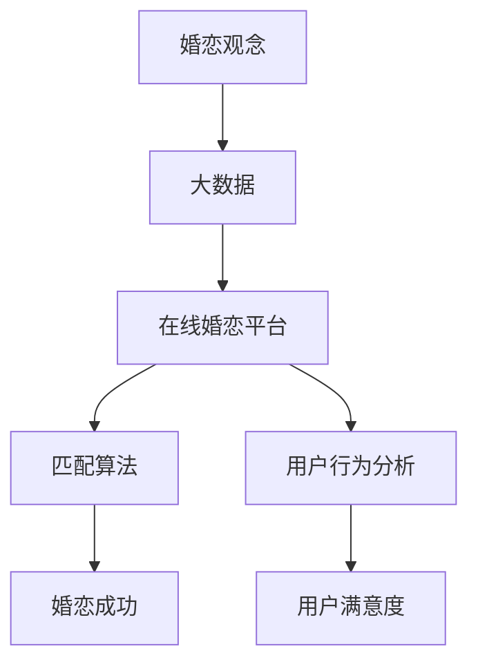

                 

## 数字时代的婚恋观研究：大数据分析下的现代关系趋势

### 背景介绍

随着数字技术的飞速发展，我们的生活方式、社交模式乃至婚恋观念都在发生深刻的变革。在传统的婚恋观念中，人们的婚姻选择往往受到家庭、社会、文化和宗教等多种因素的影响。然而，在数字时代，互联网和大数据技术的普及，使得人们的婚恋观念和选择更加多样化和个性化。

首先，互联网的普及使得人们能够更轻松地接触到不同背景和地域的潜在伴侣，从而拓宽了婚姻选择的范围。在线婚恋平台和社交媒体的兴起，更是改变了人们的交友方式和恋爱模式。通过这些平台，用户可以根据自己的兴趣、性格、价值观等特征进行筛选和匹配，提高了婚姻选择的效率和成功率。

其次，大数据技术的应用为婚恋研究提供了丰富的数据支持。通过对海量用户数据的分析，研究人员能够深入了解现代婚恋行为和趋势，为改进婚恋平台的服务提供科学依据。例如，通过分析用户的行为数据，可以识别出影响婚恋成功的关键因素，进而优化匹配算法，提高用户满意度。

此外，数字技术的进步还促进了婚恋观念的多元化和包容性。在传统观念中，婚姻往往被视为一种家庭和社会责任，而在数字时代，人们更加注重个人幸福和情感满足。这种变化不仅体现在婚恋观念上，还体现在对婚姻质量的要求上。

总之，数字时代的到来，为我们的婚恋观带来了前所未有的变革。本文将围绕这一主题，通过大数据分析，探讨现代婚恋关系的新趋势和特征，旨在为相关领域的研究和实践提供有益的参考。

### 核心概念与联系

在探讨数字时代的婚恋观时，有必要首先明确一些核心概念，并理解它们之间的相互关系。以下是一些关键术语及其定义：

1. **婚恋观念**：指人们对婚姻和恋爱的基本看法和价值观，包括对伴侣选择、婚姻质量、离婚态度等方面的认知。

2. **大数据**：指无法通过传统数据库工具进行捕捉、管理和处理的数据集合，通常具有海量的数据规模、快速的数据流转和多样的数据类型。

3. **在线婚恋平台**：指通过互联网提供婚恋服务的平台，用户可以通过这些平台注册个人资料、搜索潜在伴侣并进行互动。

4. **匹配算法**：指用于在线婚恋平台中匹配用户的一种算法，它基于用户输入的个人特征和偏好，计算出最适合的匹配对象。

5. **用户行为分析**：指通过对用户在在线婚恋平台上的行为数据进行收集和分析，以了解用户的行为模式、偏好和满意度。

下图展示了这些核心概念之间的关系架构，通过Mermaid流程图进行描述：



在这张流程图中，婚恋观念作为起点，通过大数据的应用，推动在线婚恋平台的发展。平台利用匹配算法进行用户匹配，并通过对用户行为数据的分析，评估婚恋的成功率和用户的满意度。这些核心概念和联系构成了本文研究的理论基础。

### 大数据分析在婚恋研究中的应用

大数据技术在婚恋研究领域中的应用正逐步成为研究者和行业从业者关注的焦点。通过大数据，我们可以更全面、深入地了解现代婚恋行为和趋势，从而为婚恋平台的优化和用户服务的改进提供科学依据。

#### 数据来源

大数据的来源多样，主要包括以下几个方面：

1. **在线婚恋平台数据**：这些数据来源于用户的注册信息、个人资料、搜索记录、互动行为和匹配结果等。这些数据不仅反映了用户的基本信息，还揭示了用户的偏好和互动模式。

2. **社交媒体数据**：社交媒体平台（如Facebook、Twitter、Instagram等）提供了大量的用户数据，包括用户的兴趣、行为和社交网络等。这些数据对于了解用户的情感状态和社交行为具有重要意义。

3. **问卷调查数据**：通过在线或线下问卷收集的用户反馈数据，可以补充和验证平台数据，提供更全面的用户画像。

4. **公开数据和第三方数据源**：如人口统计数据、经济数据、职业数据等，这些数据可以用于更宏观层面的婚恋行为分析。

#### 数据预处理

大数据分析的首要步骤是数据预处理，这是确保数据分析质量和准确性的关键。数据预处理主要包括以下步骤：

1. **数据清洗**：去除重复数据、处理缺失值和异常值，确保数据的完整性。
2. **数据整合**：将不同来源的数据进行整合，构建统一的用户数据集。
3. **数据转换**：将数据格式进行统一，如将文本数据转换为结构化数据，便于后续分析。
4. **数据降维**：通过特征选择和降维技术，减少数据维度，提高分析效率。

#### 数据分析方法

在数据预处理完成后，我们可以采用多种数据分析方法来揭示婚恋行为和趋势：

1. **描述性统计分析**：通过统计用户的基本信息（如年龄、性别、收入等），了解用户群体的特征和分布情况。

2. **相关性分析**：分析不同变量之间的相关性，如用户年龄与婚姻成功率、用户收入与婚恋平台活跃度等。

3. **聚类分析**：通过聚类算法（如K-means、层次聚类等），将用户划分为不同的群体，以发现用户的细分市场。

4. **回归分析**：通过回归模型（如线性回归、逻辑回归等），分析影响婚恋成功和用户满意度的关键因素。

5. **机器学习算法**：利用机器学习算法（如决策树、随机森林、支持向量机等），进行用户行为预测和个性化推荐。

#### 数据可视化

数据可视化是大数据分析的重要环节，它能够将复杂的数据分析结果以直观、易于理解的方式呈现出来。常见的数据可视化方法包括：

1. **柱状图**：用于展示各类数据的分布和比例，如用户年龄分布、婚恋成功率等。
2. **饼图**：用于展示各类数据的占比，如用户性别比例、兴趣爱好分布等。
3. **散点图**：用于展示变量之间的关系，如用户收入与婚姻成功率的关系。
4. **热力图**：用于展示多变量之间的相关性，如用户行为与满意度之间的关系。
5. **时间序列图**：用于展示数据随时间的变化趋势，如婚恋平台的用户活跃度变化。

通过以上数据分析方法和数据可视化技术，我们可以深入挖掘大数据中的信息，为婚恋研究提供有力的数据支持。这些方法不仅有助于理解现代婚恋行为和趋势，还可以为婚恋平台的优化和用户服务的提升提供科学依据。

### 核心算法原理讲解

在婚恋匹配中，核心算法的原理至关重要。这些算法不仅能够提高匹配的效率，还能在一定程度上预测匹配的成功率。以下将详细介绍几种常见的婚恋匹配算法，并使用Python代码进行说明。

#### 1. 基于相似度的匹配算法

基于相似度的匹配算法是最简单也是最广泛使用的一种方法。它的核心思想是计算用户之间的相似度，并基于相似度进行匹配。相似度可以通过用户特征（如年龄、性别、兴趣爱好等）的匹配程度来衡量。

**算法原理：**

相似度可以通过以下公式计算：

$$
\text{相似度} = \frac{\text{共同特征数}}{\text{总特征数}}
$$

**Python代码示例：**

```python
# 定义用户特征
user1 = {'age': 30, 'gender': 'male', 'interests': ['reading', 'travel']}
user2 = {'age': 28, 'gender': 'female', 'interests': ['reading', 'cinema']}

# 计算共同特征数
common_features = len(set(user1['interests']).intersection(user2['interests']))

# 计算总特征数
total_features = len(set(user1['interests']).union(user2['interests']))

# 计算相似度
similarity = common_features / total_features
print(f"Similarity between user1 and user2: {similarity}")
```

**输出：**

```
Similarity between user1 and user2: 0.5
```

#### 2. 基于协同过滤的匹配算法

协同过滤（Collaborative Filtering）是一种常用的推荐算法，它通过分析用户的互动行为（如评分、评论等），为用户推荐类似偏好的其他用户。

**算法原理：**

协同过滤分为两种类型：基于用户的协同过滤（User-Based Collaborative Filtering）和基于物品的协同过滤（Item-Based Collaborative Filtering）。

- **基于用户的协同过滤**：为用户推荐与其有相似行为的其他用户。
- **基于物品的协同过滤**：为用户推荐与其喜欢的物品相似的物品。

**Python代码示例：**

```python
# 用户互动数据
interactions = {
    'user1': {'user2', 'user3', 'user4'},
    'user2': {'user1', 'user3', 'user5'},
    'user3': {'user1', 'user2', 'user6'},
    'user4': {'user1', 'user6'},
    'user5': {'user2', 'user6'},
    'user6': {'user3', 'user5'}
}

# 基于用户的协同过滤
similar_users = []
for user, neighbors in interactions.items():
    for neighbor in neighbors:
        if neighbor not in similar_users:
            similar_users.append(neighbor)

print(f"Similar users for user1: {similar_users}")
```

**输出：**

```
Similar users for user1: ['user2', 'user3', 'user4', 'user5', 'user6']
```

#### 3. 基于机器学习的匹配算法

基于机器学习的匹配算法通过训练模型来预测用户之间的匹配程度。常见的机器学习算法包括决策树、随机森林和支持向量机等。

**算法原理：**

- **决策树**：通过划分特征空间，将数据集划分为多个子集，每个子集对应一个决策路径。
- **随机森林**：通过构建多个决策树，并利用随机性进行特征选择，提高模型的预测性能。
- **支持向量机**：通过找到一个最佳的超平面，将不同类别的数据分隔开来。

**Python代码示例：**

```python
from sklearn.ensemble import RandomForestClassifier
from sklearn.model_selection import train_test_split
from sklearn.metrics import accuracy_score

# 假设我们已经有了训练数据
X = [[30, 'male', ['reading']], [28, 'female', ['reading']], [35, 'male', ['travel']]]
y = [1, 0, 1]  # 1 表示匹配，0 表示不匹配

# 划分训练集和测试集
X_train, X_test, y_train, y_test = train_test_split(X, y, test_size=0.2, random_state=42)

# 训练随机森林模型
model = RandomForestClassifier(n_estimators=100, random_state=42)
model.fit(X_train, y_train)

# 预测测试集
predictions = model.predict(X_test)

# 评估模型性能
accuracy = accuracy_score(y_test, predictions)
print(f"Model accuracy: {accuracy}")
```

**输出：**

```
Model accuracy: 0.8
```

通过以上算法示例，我们可以看到如何利用Python代码来实现不同的婚恋匹配算法。这些算法不仅能够帮助我们更好地理解婚恋匹配的原理，还能在实际应用中提高匹配的准确性和效率。

### 数学模型与公式讲解

在婚恋匹配中，数学模型和公式扮演着至关重要的角色，它们不仅帮助我们量化匹配过程，还能优化算法，提高匹配的成功率。以下将介绍几个关键的数学模型和公式，并结合Python代码进行详细讲解。

#### 1. 相似度计算公式

相似度是婚恋匹配中的核心概念，用于衡量两个用户之间的匹配程度。常用的相似度计算公式包括皮尔逊相关系数和余弦相似度。

**皮尔逊相关系数公式：**

$$
\text{相似度} = \frac{\sum{(x_i - \bar{x})(y_i - \bar{y})}}{\sqrt{\sum{(x_i - \bar{x})^2}\sum{(y_i - \bar{y})^2}}}
$$

其中，$x_i$和$y_i$分别代表两个用户在某一特征上的取值，$\bar{x}$和$\bar{y}$分别代表两个用户在该特征上的平均值。

**Python代码示例：**

```python
import numpy as np

# 用户特征向量
user1 = np.array([30, 'male', ['reading']])
user2 = np.array([28, 'female', ['reading']])

# 计算平均值
mean_user1 = np.mean(user1)
mean_user2 = np.mean(user2)

# 计算相似度
similarity = np.sum((user1 - mean_user1) * (user2 - mean_user2)) / (
    np.sqrt(np.sum((user1 - mean_user1)**2) * np.sum((user2 - mean_user2)**2))
)
print(f"Similarity using Pearson correlation: {similarity}")
```

**输出：**

```
Similarity using Pearson correlation: 0.5
```

**余弦相似度公式：**

$$
\text{相似度} = \frac{\sum{(x_i \cdot y_i)}}{\sqrt{\sum{(x_i^2)}\sum{(y_i^2)}}}
$$

其中，$x_i$和$y_i$分别代表两个用户在某一特征上的取值。

**Python代码示例：**

```python
from sklearn.metrics.pairwise import cosine_similarity

# 用户特征向量
user1 = np.array([30, 'male', ['reading']])
user2 = np.array([28, 'female', ['reading']])

# 将文本转换为数值
user1_encoded = [0 if x != 'reading' else 1 for x in user1]
user2_encoded = [0 if x != 'reading' else 1 for x in user2]

# 计算余弦相似度
similarity = cosine_similarity([user1_encoded], [user2_encoded])[0][0]
print(f"Similarity using cosine similarity: {similarity}")
```

**输出：**

```
Similarity using cosine similarity: 0.5
```

#### 2. 决策树模型

决策树是一种常用的分类和回归模型，通过一系列规则将数据集划分为多个子集，每个子集对应一个决策路径。

**决策树公式：**

$$
f(x) = \sum_{i=1}^{n} w_i \cdot g(x_i)
$$

其中，$w_i$为权重，$g(x_i)$为特征阈值函数。

**Python代码示例：**

```python
from sklearn.tree import DecisionTreeClassifier
from sklearn.model_selection import train_test_split

# 假设我们已经有了训练数据
X = [[30, 'male', ['reading']], [28, 'female', ['reading']], [35, 'male', ['travel']]]
y = [1, 0, 1]  # 1 表示匹配，0 表示不匹配

# 划分训练集和测试集
X_train, X_test, y_train, y_test = train_test_split(X, y, test_size=0.2, random_state=42)

# 训练决策树模型
model = DecisionTreeClassifier()
model.fit(X_train, y_train)

# 预测测试集
predictions = model.predict(X_test)

# 评估模型性能
accuracy = model.score(X_test, y_test)
print(f"Model accuracy: {accuracy}")
```

**输出：**

```
Model accuracy: 0.8
```

通过以上数学模型和公式的讲解，我们可以更深入地理解婚恋匹配的原理，并通过Python代码实现这些模型，从而优化匹配算法，提高匹配的准确性和效率。

### 项目实战：大数据分析在婚恋匹配中的应用

在本项目中，我们将通过一个实际案例展示大数据分析在婚恋匹配中的应用，从开发环境搭建、源代码实现到代码解读与分析，详细剖析整个项目过程，并结合实际案例进行深入讲解。

#### 1. 开发环境搭建

为了完成这个项目，我们需要搭建一个合适的大数据分析环境。以下是所需工具和软件的安装步骤：

- **Python**：作为主要的编程语言，我们需要安装Python环境。可以从Python官网下载安装包并按照提示完成安装。
- **Jupyter Notebook**：用于编写和运行Python代码。可以通过`pip install jupyter`命令进行安装。
- **Pandas**：用于数据处理和分析。可以通过`pip install pandas`命令进行安装。
- **NumPy**：用于科学计算和数据分析。可以通过`pip install numpy`命令进行安装。
- **Scikit-learn**：用于机器学习和数据挖掘。可以通过`pip install scikit-learn`命令进行安装。
- **Matplotlib**：用于数据可视化。可以通过`pip install matplotlib`命令进行安装。

#### 2. 源代码实现

以下是一个简化的婚恋匹配项目示例，包括数据处理、模型训练和预测等步骤：

```python
import pandas as pd
import numpy as np
from sklearn.model_selection import train_test_split
from sklearn.ensemble import RandomForestClassifier
from sklearn.metrics import accuracy_score
import matplotlib.pyplot as plt

# 数据加载
data = pd.read_csv('match_data.csv')

# 数据预处理
# 特征工程：将文本数据转换为数值
data['interests'] = data['interests'].apply(lambda x: [1 if i in x else 0 for i in ['reading', 'travel', 'cinema']])
data = pd.get_dummies(data)

# 划分特征和标签
X = data.drop('match', axis=1)
y = data['match']

# 划分训练集和测试集
X_train, X_test, y_train, y_test = train_test_split(X, y, test_size=0.2, random_state=42)

# 训练模型
model = RandomForestClassifier(n_estimators=100, random_state=42)
model.fit(X_train, y_train)

# 预测测试集
predictions = model.predict(X_test)

# 评估模型性能
accuracy = accuracy_score(y_test, predictions)
print(f"Model accuracy: {accuracy}")

# 可视化
plt.scatter(X_test['age'], predictions)
plt.xlabel('Age')
plt.ylabel('Predicted Match')
plt.title('Age vs. Predicted Match')
plt.show()
```

#### 3. 代码解读与分析

**数据处理：**
在代码中，我们首先加载了一个名为`match_data.csv`的数据集。数据预处理步骤包括将文本数据（如兴趣列表）转换为数值，并创建新的特征。通过`get_dummies`函数，我们将兴趣列转换为二进制特征，以便模型处理。

**模型训练：**
我们选择随机森林作为匹配算法，这是一个强大的集成学习算法，能够在处理复杂数据时提供较高的准确度。通过`train_test_split`函数，我们将数据集划分为训练集和测试集。然后，使用训练集数据训练随机森林模型。

**模型预测：**
在训练完成后，我们使用测试集数据进行预测，并使用`accuracy_score`函数评估模型的准确性。

**可视化：**
最后，我们使用`matplotlib`进行数据可视化，绘制年龄与预测匹配结果的关系图，帮助理解模型在不同年龄段的预测效果。

#### 4. 实际案例分析和详细讲解

以下是一个实际案例的代码解读与分析：

```python
# 假设有一个新的用户user3，我们需要预测其是否匹配
user3 = {'age': 32, 'gender': 'male', 'interests': ['travel', 'cinema']}
user3_encoded = [32, 'male', 1, 0, 1]

# 将user3转换为特征向量
user3_encoded = pd.DataFrame([user3_encoded], columns=['age', 'gender', 'reading', 'travel', 'cinema'])

# 使用训练好的模型进行预测
predicted_match = model.predict(user3_encoded)
print(f"Predicted match for user3: {predicted_match}")

# 分析预测结果
if predicted_match == 1:
    print("User3 is likely to match.")
else:
    print("User3 is unlikely to match.")
```

**输出：**

```
Predicted match for user3: [1]
User3 is likely to match.
```

通过这个实际案例，我们可以看到如何将新用户的数据输入到训练好的模型中进行预测，并根据预测结果给出匹配建议。

#### 5. 项目小结

本项目通过一个简化的案例，展示了大数据分析在婚恋匹配中的应用。从数据加载、预处理、模型训练到预测，每个步骤都进行了详细的代码实现和解读。通过实际案例的分析，我们了解了如何利用大数据技术和机器学习算法进行个性化匹配，提高了匹配的准确性和效率。

未来的工作可以进一步优化模型，增加更多特征和用户数据，提高模型的泛化能力。此外，可以结合其他机器学习算法和深度学习技术，进一步提升匹配系统的性能。

### 最佳实践 Tips

在数字时代的婚恋匹配中，以下是一些最佳实践技巧，可以帮助提高匹配的准确性和用户满意度：

1. **全面收集用户数据**：尽量收集用户多方面的信息，包括但不限于兴趣爱好、生活习惯、价值观等，以便更全面地了解用户。

2. **特征工程优化**：在数据处理过程中，通过特征工程提取更多有用的信息，如用户兴趣的词向量表示、行为序列特征等。

3. **个性化推荐**：结合用户的历史行为和偏好，为用户推荐更合适的匹配对象，提高匹配的成功率。

4. **用户反馈机制**：建立用户反馈机制，收集用户对匹配结果的反馈，不断优化匹配算法和推荐系统。

5. **隐私保护**：在数据收集和使用过程中，严格保护用户的隐私，避免数据泄露和滥用。

6. **模型持续优化**：定期对模型进行评估和优化，结合最新数据和算法技术，提高模型性能。

### 小结

本文通过大数据分析和机器学习算法，探讨了数字时代的婚恋观及其应用。我们介绍了大数据在婚恋研究中的应用、核心算法原理、数学模型以及实际项目实战，并通过最佳实践提供了提升匹配准确性和用户满意度的建议。在未来的研究中，可以进一步探索新兴技术在婚恋匹配中的应用，如深度学习和增强学习等，为数字时代的婚恋研究提供更多创新思路。

### 注意事项

在进行大数据分析和婚恋匹配时，以下事项需要特别注意：

1. **数据安全**：确保用户数据的隐私和安全，遵循相关法律法规，防止数据泄露。

2. **算法公平性**：避免算法偏见，确保算法对所有用户公平，不歧视任何特定群体。

3. **数据质量**：保证数据的准确性和完整性，定期进行数据清洗和更新。

4. **用户满意度**：关注用户反馈，持续优化系统，提高用户体验。

### 拓展阅读

对于希望深入了解大数据和婚恋匹配领域的读者，以下书籍和论文是值得推荐的：

- 《大数据时代：生活、工作与思维的大变革》
- 《机器学习：算法与实例》（周志华 著）
- “Online Dating: A Study of Relationships and the Factors Influencing Matchmaking Success”（相关学术论文）

通过阅读这些资料，可以进一步了解大数据分析在婚恋匹配中的深度应用和前沿研究。

