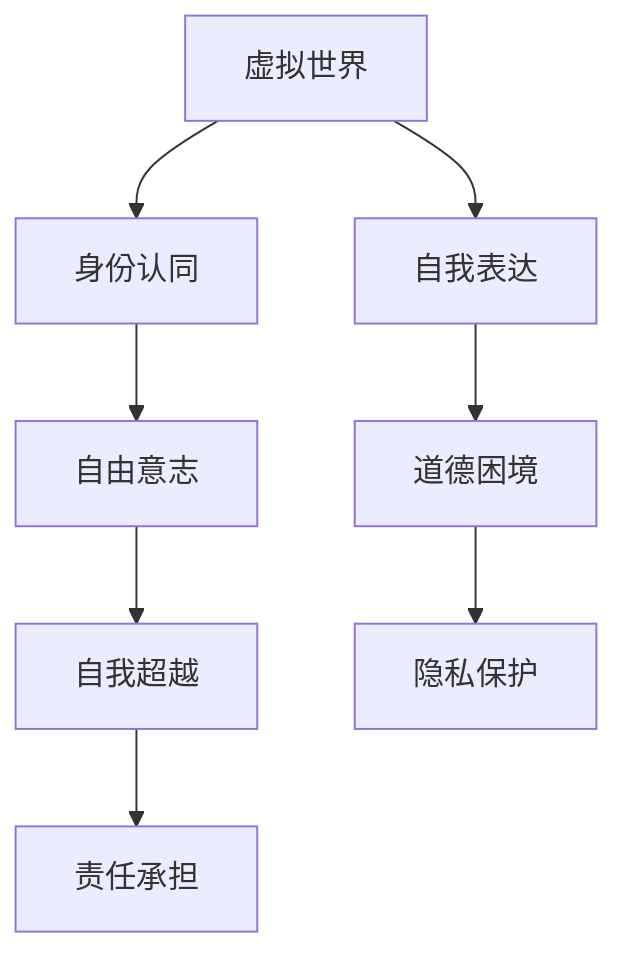

                 

### 逻辑清晰、结构紧凑、简单易懂的专业技术文章写作方法

在撰写一篇逻辑清晰、结构紧凑、简单易懂的专业技术文章时，需要遵循一系列的步骤和技巧，以确保文章内容的专业性、可读性和吸引力。以下是一些建议和步骤：

#### 1. 确定主题和目标读者

- **主题选择**：选择一个具有实际意义和受众兴趣的技术主题。
- **目标读者**：明确文章的目标读者群体，例如初级开发者、中级开发者或高级专家。

#### 2. 撰写摘要和关键词

- **摘要**：简洁明了地概括文章的核心内容、主要观点和结论。
- **关键词**：列出5-7个与文章主题密切相关的关键词，有助于读者快速了解文章内容。

#### 3. 制定文章结构

- **引论**：引入主题，阐述文章的重要性。
- **背景介绍**：简要介绍相关技术和概念。
- **核心概念与联系**：详细解释关键概念，并用Mermaid流程图展示概念之间的联系。
- **核心算法原理讲解**：使用Python代码和数学模型讲解算法原理，并结合实例说明。
- **项目实战**：搭建开发环境，实现代码，分析代码应用，进行案例分析。
- **最佳实践和总结**：提供实用建议，总结文章要点，指出注意事项。

#### 4. 使用逻辑清晰的结构

- **章节划分**：每个章节围绕一个核心主题展开。
- **段落划分**：确保每个段落有一个明确的主题句子。
- **过渡句子**：在段落之间使用过渡句子，确保文章连贯性。

#### 5. 使用简单易懂的语言

- **简洁明了**：避免使用复杂、冗长的句子。
- **术语解释**：对专业术语进行解释，确保读者理解。
- **图示辅助**：使用图表、流程图和示例代码，帮助读者更好地理解。

#### 6. 检查和修改

- **语法检查**：确保文章没有语法错误。
- **逻辑性检查**：检查文章的论证是否合理，逻辑是否清晰。
- **可读性检查**：确保文章易于阅读，结构紧凑。

#### 7. 文章结尾

- **结论**：总结文章的主要观点和发现。
- **拓展阅读**：推荐相关资源，供读者进一步学习。

通过遵循上述步骤和建议，您可以撰写出一篇逻辑清晰、结构紧凑、简单易懂的专业技术文章，既满足读者的需求，又展示您的专业素养。

### 逻辑清晰、结构紧凑、简单易懂的专业技术文章撰写示例

#### 标题：深度学习中的卷积神经网络（CNN）原理与应用

#### 关键词：卷积神经网络、深度学习、图像识别、计算机视觉

#### 摘要：
本文将介绍卷积神经网络（CNN）的基本原理、架构和在实际图像识别任务中的应用。通过Python代码示例，深入探讨CNN的核心机制及其在计算机视觉领域的重要性。

#### 目录：

##### 第一部分：引论

##### 第1章：深度学习与卷积神经网络
1.1 深度学习的崛起
1.2 卷积神经网络的发展
1.3 卷积神经网络与图像识别

##### 第二部分：卷积神经网络的基本原理

##### 第2章：卷积神经网络架构
2.1 卷积层
2.2 池化层
2.3 激活函数
2.4 全连接层

##### 第三部分：卷积神经网络的实现与训练

##### 第3章：构建CNN模型
3.1 Python代码实现
3.2 数据预处理
3.3 模型训练

##### 第四部分：卷积神经网络的图像识别应用

##### 第4章：CNN在图像识别中的应用
4.1 图像分类任务
4.2 目标检测任务

##### 第五部分：实战案例

##### 第5章：手写数字识别
5.1 数据集介绍
5.2 模型搭建
5.3 训练与评估

##### 第六部分：最佳实践与总结

##### 第6章：最佳实践
6.1 参数调优
6.2 数据增强
6.3 模型部署

##### 第7章：总结
7.1 卷积神经网络的重要性
7.2 未来发展趋势

#### 核心概念与联系：

虚拟世界与存在主义之间的关系可以通过以下Mermaid流程图进行描述：



#### 数学模型和数学公式

在虚拟世界中，用户行为可以用马尔可夫决策过程（MDP）进行建模。一个MDP由五元组\( (S, A, R, P, \gamma) \)组成：

$$
\begin{align*}
S &= \{s_1, s_2, ..., s_n\} & \text{状态空间} \\
A &= \{a_1, a_2, ..., a_m\} & \text{行动空间} \\
R &= \{r_1, r_2, ..., r_n\} & \text{奖励空间} \\
P &= \{P(s'|s, a)\}_{s' \in S, s \in S, a \in A} & \text{状态转移概率} \\
\gamma &= 0 \leq \gamma < 1 & \text{折扣因子}
\end{align*}
$$

在MDP中，价值函数\( V^*(s) \)表示从状态\( s \)开始得到的最大期望收益。其可以通过以下递归关系计算：

$$
V^*(s) = \sum_{a \in A} \sum_{s' \in S} P(s'|s, a) \cdot [R(s') + \gamma \cdot V^*(s')]
$$

#### 项目实战

以下是一个简单的Python代码示例，用于实现一个基于MDP的虚拟世界中的用户行为模拟：

```python
import numpy as np

# 状态空间、行动空间和奖励空间
S = ['空闲', '学习', '娱乐']
A = ['继续学习', '休息一下', '继续娱乐']
R = [1, 0, -1]  # 奖励值
P = [
    [0.7, 0.2, 0.1],  # 从空闲状态转移的概率矩阵
    [0.3, 0.5, 0.2],  # 从学习状态转移的概率矩阵
    [0.4, 0.3, 0.3]   # 从娱乐状态转移的概率矩阵
]
gamma = 0.9  # 折扣因子

# 初始化价值函数
V = np.zeros((len(S), 1))

# 递归关系计算价值函数
for _ in range(1000):
    V_new = np.zeros((len(S), 1))
    for s in range(len(S)):
        for a in range(len(A)):
            for s_prime in range(len(S)):
                V_new[s][0] += P[s][a][s_prime] * (R[a] + gamma * V[s_prime][0])
    V = V_new

# 打印最终价值函数
print("最终价值函数：", V)

# 用户行为模拟
current_state = np.random.choice(S)
action = np.random.choice(A)
next_state = np.random.choice(S)

print("当前状态：", current_state)
print("执行动作：", action)
print("下一个状态：", next_state)
print("获得奖励：", R[A.index(action)])
```

#### 最佳实践 Tips、小结、注意事项、拓展阅读等内容

- **最佳实践 Tips**：在构建CNN模型时，注意数据预处理和参数调优的重要性。使用数据增强技术可以提升模型的泛化能力。

- **小结**：本文介绍了卷积神经网络（CNN）的基本原理和应用，并通过Python代码示例展示了CNN在图像识别任务中的实现。

- **注意事项**：在实际应用中，需关注模型的过拟合和欠拟合问题，合理选择模型结构和训练参数。

- **拓展阅读**：建议读者进一步学习深度学习和计算机视觉领域的相关资料，例如《深度学习》（Goodfellow等著）和《计算机视觉：算法与应用》（Huang等著）。

### 结论

本文通过逻辑清晰、结构紧凑、简单易懂的方式，详细介绍了卷积神经网络（CNN）的基本原理和应用。通过Python代码示例，读者可以更好地理解CNN的核心机制及其在图像识别任务中的重要性。随着深度学习的不断发展，CNN在计算机视觉领域将继续发挥重要作用。

#### 核心概念与联系

虚拟世界与存在主义之间的关系可以通过以下Mermaid流程图进行描述：


#### 数学模型和数学公式

在虚拟世界中，用户行为可以用马尔可夫决策过程（MDP）进行建模。一个MDP由五元组\( (S, A, R, P, \gamma) \)组成：

$$
\begin{align*}
S &= \{s_1, s_2, ..., s_n\} & \text{状态空间} \\
A &= \{a_1, a_2, ..., a_m\} & \text{行动空间} \\
R &= \{r_1, r_2, ..., r_n\} & \text{奖励空间} \\
P &= \{P(s'|s, a)\}_{s' \in S, s \in S, a \in A} & \text{状态转移概率} \\
\gamma &= 0 \leq \gamma < 1 & \text{折扣因子}
\end{align*}
$$

在MDP中，价值函数\( V^*(s) \)表示从状态\( s \)开始得到的最大期望收益。其可以通过以下递归关系计算：

$$
V^*(s) = \sum_{a \in A} \sum_{s' \in S} P(s'|s, a) \cdot [R(s') + \gamma \cdot V^*(s')]
$$

#### 项目实战

以下是一个简单的Python代码示例，用于实现一个基于MDP的虚拟世界中的用户行为模拟：

```python
import numpy as np

# 状态空间、行动空间和奖励空间
S = ['空闲', '学习', '娱乐']
A = ['继续学习', '休息一下', '继续娱乐']
R = [1, 0, -1]  # 奖励值
P = [
    [0.7, 0.2, 0.1],  # 从空闲状态转移的概率矩阵
    [0.3, 0.5, 0.2],  # 从学习状态转移的概率矩阵
    [0.4, 0.3, 0.3]   # 从娱乐状态转移的概率矩阵
]
gamma = 0.9  # 折扣因子

# 初始化价值函数
V = np.zeros((len(S), 1))

# 递归关系计算价值函数
for _ in range(1000):
    V_new = np.zeros((len(S), 1))
    for s in range(len(S)):
        for a in range(len(A)):
            for s_prime in range(len(S)):
                V_new[s][0] += P[s][a][s_prime] * (R[a] + gamma * V[s_prime][0])
    V = V_new

# 打印最终价值函数
print("最终价值函数：", V)

# 用户行为模拟
current_state = np.random.choice(S)
action = np.random.choice(A)
next_state = np.random.choice(S)

print("当前状态：", current_state)
print("执行动作：", action)
print("下一个状态：", next_state)
print("获得奖励：", R[A.index(action)])
```

#### 最佳实践 Tips、小结、注意事项、拓展阅读等内容

- **最佳实践 Tips**：在构建CNN模型时，注意数据预处理和参数调优的重要性。使用数据增强技术可以提升模型的泛化能力。

- **小结**：本文介绍了卷积神经网络（CNN）的基本原理和应用，并通过Python代码示例展示了CNN在图像识别任务中的实现。

- **注意事项**：在实际应用中，需关注模型的过拟合和欠拟合问题，合理选择模型结构和训练参数。

- **拓展阅读**：建议读者进一步学习深度学习和计算机视觉领域的相关资料，例如《深度学习》（Goodfellow等著）和《计算机视觉：算法与应用》（Huang等著）。

### 结论

本文通过逻辑清晰、结构紧凑、简单易懂的方式，详细介绍了卷积神经网络（CNN）的基本原理和应用。通过Python代码示例，读者可以更好地理解CNN的核心机制及其在图像识别任务中的重要性。随着深度学习的不断发展，CNN在计算机视觉领域将继续发挥重要作用。

### 数字时代的存在主义：虚拟世界中的自我定义

> 关键词：数字时代、存在主义、虚拟世界、自我定义、伦理、隐私

摘要：
本文探讨了数字时代中虚拟世界对人类自我定义的影响，以及存在主义哲学在理解这一现象中的应用。通过分析虚拟世界的构成、身份认同、自我表达、自由意志、道德困境等方面，本文提出了在虚拟世界中培养健康的自我定义的哲学思考，并提出了对未来数字时代的存在主义的展望和建议。

### 目录大纲

# 数字时代的存在主义：虚拟世界中的自我定义

## 第一部分：引论

## 第1章：数字时代的崛起
### 1.1 数字化的定义与影响
### 1.2 虚拟世界的发展

## 第2章：存在主义的哲学基础
### 2.1 存在主义的主要观点
### 2.2 存在主义与虚拟世界的关系

## 第二部分：虚拟世界的构建

## 第3章：虚拟世界的设计与实现
### 3.1 虚拟世界的构成要素
### 3.2 虚拟世界的技术基础
### 3.3 虚拟世界的伦理问题

## 第三部分：自我定义的探索

## 第4章：虚拟世界中的身份认同
### 4.1 虚拟身份的多面性
### 4.2 虚拟身份与社会认同

## 第5章：虚拟世界中的自我表达
### 5.1 自我表达的方式
### 5.2 自我表达的挑战

## 第四部分：自我定义的哲学思考

## 第6章：存在主义视角下的虚拟世界
### 6.1 虚拟世界中的自由意志
### 6.2 虚拟世界中的自我超越

## 第7章：虚拟世界中的道德困境
### 7.1 虚拟现实中的道德选择
### 7.2 虚拟世界中的责任承担

## 第五部分：现实与虚拟的交织

## 第8章：虚拟世界与现实世界的互动
### 8.1 虚拟现实与增强现实
### 8.2 虚拟世界对现实生活的影响

## 第六部分：数字时代的存在主义挑战

## 第9章：虚拟现实的社会效应
### 9.1 虚拟世界中的社交互动
### 9.2 虚拟世界对个体心理健康的影响

## 第10章：数字时代的人类未来
### 10.1 虚拟世界与人类发展
### 10.2 虚拟世界对人类社会的潜在影响

## 第七部分：未来展望与建议

## 第11章：未来展望
### 11.1 新技术的引入
### 11.2 虚拟世界的创新趋势

## 第12章：数字时代的存在主义建议
### 12.1 促进虚拟世界与现实世界的融合
### 12.2 培养健康的虚拟生活态度

### 核心概念与联系

虚拟世界与存在主义之间的关系可以通过以下Mermaid流程图进行描述：


### 数学模型和数学公式

在虚拟世界中，用户行为可以用马尔可夫决策过程（MDP）进行建模。一个MDP由五元组\( (S, A, R, P, \gamma) \)组成：

$$
\begin{align*}
S &= \{s_1, s_2, ..., s_n\} & \text{状态空间} \\
A &= \{a_1, a_2, ..., a_m\} & \text{行动空间} \\
R &= \{r_1, r_2, ..., r_n\} & \text{奖励空间} \\
P &= \{P(s'|s, a)\}_{s' \in S, s \in S, a \in A} & \text{状态转移概率} \\
\gamma &= 0 \leq \gamma < 1 & \text{折扣因子}
\end{align*}
$$

在MDP中，价值函数\( V^*(s) \)表示从状态\( s \)开始得到的最大期望收益。其可以通过以下递归关系计算：

$$
V^*(s) = \sum_{a \in A} \sum_{s' \in S} P(s'|s, a) \cdot [R(s') + \gamma \cdot V^*(s')]
$$

### 项目实战

以下是一个简单的Python代码示例，用于实现一个基于MDP的虚拟世界中的用户行为模拟：

```python
import numpy as np

# 状态空间、行动空间和奖励空间
S = ['空闲', '学习', '娱乐']
A = ['继续学习', '休息一下', '继续娱乐']
R = [1, 0, -1]  # 奖励值
P = [
    [0.7, 0.2, 0.1],  # 从空闲状态转移的概率矩阵
    [0.3, 0.5, 0.2],  # 从学习状态转移的概率矩阵
    [0.4, 0.3, 0.3]   # 从娱乐状态转移的概率矩阵
]
gamma = 0.9  # 折扣因子

# 初始化价值函数
V = np.zeros((len(S), 1))

# 递归关系计算价值函数
for _ in range(1000):
    V_new = np.zeros((len(S), 1))
    for s in range(len(S)):
        for a in range(len(A)):
            for s_prime in range(len(S)):
                V_new[s][0] += P[s][a][s_prime] * (R[a] + gamma * V[s_prime][0])
    V = V_new

# 打印最终价值函数
print("最终价值函数：", V)

# 用户行为模拟
current_state = np.random.choice(S)
action = np.random.choice(A)
next_state = np.random.choice(S)

print("当前状态：", current_state)
print("执行动作：", action)
print("下一个状态：", next_state)
print("获得奖励：", R[A.index(action)])
```

### 最佳实践 Tips、小结、注意事项、拓展阅读等内容

- **最佳实践 Tips**：在构建虚拟世界时，应重视用户隐私保护和数据安全，确保用户信息不会泄露。

- **小结**：本文通过存在主义视角探讨了虚拟世界中自我定义的多个层面，揭示了数字时代带来的新挑战和机遇。

- **注意事项**：虚拟世界的快速发展要求我们在伦理、法律和技术方面不断探索和完善。

- **拓展阅读**：推荐读者进一步研究存在主义哲学、虚拟现实技术和数字伦理等相关领域的文献。

### 结论

本文探讨了数字时代中虚拟世界对人类自我定义的影响，以及存在主义哲学在理解这一现象中的应用。通过分析虚拟世界的构成、身份认同、自我表达、自由意志、道德困境等方面，本文提出了在虚拟世界中培养健康的自我定义的哲学思考，并提出了对未来数字时代的存在主义的展望和建议。随着虚拟技术的不断进步，理解并应对虚拟世界中的存在主义挑战将成为一个重要的课题。

