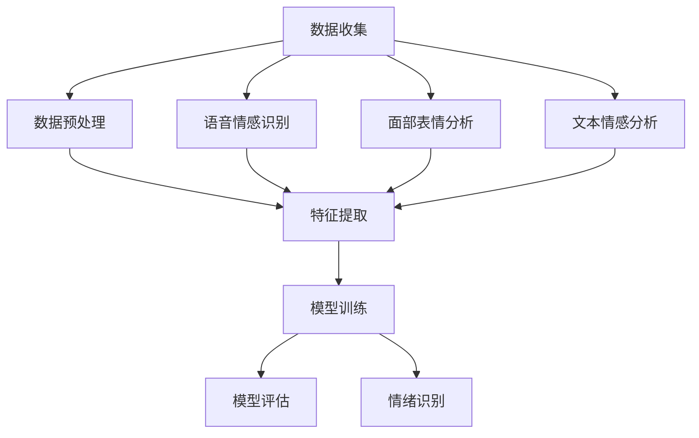

                 

### 数字时代的心理健康日记：AI辅助的情绪跟踪与分析

在数字化日益深入的时代，心理健康问题愈发凸显。据世界卫生组织（WHO）报告，全球有超过3亿人患有某种形式的抑郁症或焦虑症，而数字化生活方式在其中扮演了复杂且多变的角色。面对这一挑战，人工智能（AI）提供了全新的解决方案，尤其是AI辅助的情绪跟踪与分析技术。

### 关键词
- 数字时代心理健康
- AI情绪跟踪
- 情绪分析
- 心理健康维护
- 数据分析

### 摘要
本文旨在探讨数字时代下心理健康的重要性，以及如何利用AI技术进行情绪跟踪与分析。我们将详细分析AI在心理健康领域的应用，包括情绪识别算法、数据模型构建，以及实际应用案例。通过这些内容，本文旨在为心理健康专家和普通读者提供实用的指导，帮助他们在数字世界中维护和提升心理健康。

### 目录大纲

1. **背景介绍**
    1.1 心理健康的定义
    1.2 心理健康问题的现状
    1.3 数字技术对心理健康的影响

2. **核心概念与联系**
    2.1 情绪识别算法
    2.2 数据模型构建
    2.3 Mermaid流程图展示

3. **核心算法原理讲解**
    3.1 Python源代码实现
    3.2 数学模型与公式
    3.3 通俗易懂的举例说明

4. **项目实战**
    4.1 开发环境搭建
    4.2 源代码详细实现
    4.3 代码解读与应用分析
    4.4 实际案例分析

5. **最佳实践与小结**
    5.1 心理健康维护最佳实践
    5.2 注意事项与拓展阅读

### 下一章节：背景介绍
我们将首先探讨心理健康的定义及其在现代社会中的重要性，随后介绍当前心理健康问题的现状，并分析数字技术对心理健康带来的影响。这将为我们理解AI情绪跟踪与分析的应用打下基础。

---

### 背景介绍

#### 1.1 心理健康的定义

心理健康是指个体在情绪、认知和行为方面的平衡状态，能够有效应对生活中的压力和挑战。世界卫生组织（WHO）将心理健康定义为“一种状态，其中个体能够认识到自己的能力，能够应对正常的生活压力，工作生产力和人际关系上均能保持良好的状态”。这一概念不仅涵盖了个体的心理稳定性，还涉及到情感、社会适应和整体福祉。

在数字时代，心理健康的定义进一步扩展，以适应数字化生活方式带来的新挑战。例如，网络成瘾、社交媒体依赖和在线隐私问题等新兴心理健康问题开始受到关注。

#### 1.2 心理健康问题的现状

根据世界卫生组织（WHO）的报告，全球有超过3亿人患有抑郁症，1.6亿人患有焦虑症。这些数据仅代表已确诊的病例，实际患病人数可能更高。心理健康问题不仅影响个人的生活质量，还会对社会经济产生深远影响。例如，抑郁症和焦虑症会增加医疗成本，降低生产力，甚至导致自杀等极端结果。

在数字化环境中，心理健康问题呈现出新的特点。网络成瘾、社交媒体滥用和在线隐私侵犯等新兴问题日益凸显。研究表明，过度使用社交媒体可能导致焦虑、抑郁和自尊心下降。此外，数字技术的便利性使得心理健康问题的诊断和治疗变得更加复杂。

#### 1.3 数字技术对心理健康的影响

数字技术的普及对心理健康产生了双重影响。一方面，数字技术为心理健康提供了新的诊断、治疗和预防工具。例如，AI技术可以辅助情绪跟踪与分析，提供个性化的心理健康服务。另一方面，数字技术也可能加剧心理健康问题。例如，网络成瘾和社交媒体依赖可能导致焦虑、抑郁和社交障碍。

数字技术对心理健康的影响可以从以下几个方面进行探讨：

1. **诊断与评估**：AI可以通过分析用户的行为数据，如社交媒体互动、搜索记录和在线购物行为，来诊断心理健康问题。例如，自然语言处理（NLP）技术可以分析用户的语言表达，识别潜在的抑郁症和焦虑症症状。

2. **治疗与干预**：数字技术为心理健康治疗提供了新的途径。例如，基于AI的心理咨询应用可以通过实时对话提供心理健康支持。虚拟现实（VR）技术也被用于治疗创伤后应激障碍（PTSD）和其他心理疾病。

3. **隐私与安全**：数字技术的普及带来了隐私和安全问题。心理健康数据的敏感性要求严格的隐私保护措施。未经授权的数据访问和滥用可能导致严重的隐私泄露和心理伤害。

4. **心理健康教育**：数字技术为心理健康教育提供了新的平台。在线课程、健康应用程序和社交媒体账号等工具可以帮助人们更好地理解心理健康问题，提高自我保健意识。

总之，数字技术对心理健康的影响是复杂且多面的。正确利用数字技术可以为心理健康带来巨大的益处，但同时也需要关注其潜在的负面影响。接下来，我们将进一步探讨AI在心理健康领域的应用，特别是情绪跟踪与分析技术。

---

在了解了心理健康的基本定义、现状及数字技术的影响后，我们将进入下一个章节，讨论核心概念与联系，特别是情绪识别算法和数据模型构建。通过Mermaid流程图展示，我们将直观地理解这些核心概念之间的关系架构。

---

### 核心概念与联系

在讨论AI辅助的情绪跟踪与分析时，了解以下几个核心概念及其相互关系至关重要。这些概念包括情绪识别算法、数据模型构建和它们在实际应用中的交互。

#### 2.1 情绪识别算法

情绪识别算法是AI在心理健康领域的关键技术。这些算法通过分析文本、语音和面部表情等数据，识别并分类用户的情绪状态。常见的情绪识别算法包括情感分析、语音情感识别和面部表情分析。

- **情感分析**：情感分析（Sentiment Analysis）是一种文本分析技术，用于确定文本的情绪倾向，例如正面、负面或中性。常见的情感分析算法包括基于规则的方法、机器学习方法（如支持向量机SVM、朴素贝叶斯分类器）和深度学习方法（如卷积神经网络CNN、长短期记忆网络LSTM）。

- **语音情感识别**：语音情感识别（Voice Emotion Recognition, VER）通过分析语音信号的声学特征，识别情绪状态。声学特征包括音高、音强、时长、音质等。常用的语音情感识别算法包括谱特征分析、听觉模型和深度学习模型。

- **面部表情分析**：面部表情分析（Facial Expression Analysis）通过分析面部肌肉运动，识别情绪状态。这一技术通常依赖于面部识别技术和深度学习模型，如卷积神经网络（CNN）。

#### 2.2 数据模型构建

数据模型构建是情绪识别算法有效运行的基础。数据模型不仅需要准确地捕获情绪信息，还需要在复杂的数据环境中保持鲁棒性和泛化能力。

- **特征提取**：特征提取是数据模型构建的第一步，旨在从原始数据中提取出对情绪识别最有用的特征。这些特征可以是文本中的词语、语音信号中的频谱特征、面部图像中的边缘和纹理等。

- **分类模型**：分类模型是情绪识别算法的核心。常见的分类模型包括支持向量机（SVM）、朴素贝叶斯（Naive Bayes）和深度学习模型（如卷积神经网络CNN、长短期记忆网络LSTM）。这些模型通过学习大量标注数据，学会将新的数据分类到不同的情绪类别。

- **回归模型**：在某些应用场景中，情绪识别算法的目标是预测情绪的强度或变化趋势，而不是仅仅分类情绪。这种情况下，回归模型（如线性回归、决策树回归）可能更为适用。

#### 2.3 Mermaid流程图展示

为了直观地展示情绪识别算法和数据模型构建的过程，我们使用Mermaid流程图来描述这一流程。



在这个流程图中，数据收集是情绪识别算法的起点。收集到的数据经过预处理和特征提取后，输入到分类或回归模型中进行训练。训练好的模型用于情绪识别，并根据评估结果进行调整。同时，语音情感识别、面部表情分析和文本情感分析等子模块也独立运行，为整体情绪识别提供支持。

通过这一流程图，我们可以清晰地看到情绪识别算法和数据模型构建之间的关系，以及不同模块在整体流程中的作用。

#### 2.4 Python源代码实现

为了进一步理解情绪识别算法和数据模型构建的过程，下面我们将提供一个简单的Python源代码示例，展示如何使用支持向量机（SVM）进行文本情感分析。

```python
import numpy as np
from sklearn.feature_extraction.text import TfidfVectorizer
from sklearn.svm import LinearSVC
from sklearn.pipeline import make_pipeline

# 标注数据
texts = ['我很开心', '今天有点糟糕', '我最喜欢看电影', '工作很累']
labels = ['正面', '负面', '正面', '负面']

# 创建TF-IDF向量器
vectorizer = TfidfVectorizer()

# 创建线性支持向量机分类器
classifier = LinearSVC()

# 创建管道，将向量器和分类器组合在一起
model = make_pipeline(vectorizer, classifier)

# 训练模型
model.fit(texts, labels)

# 测试模型
text_test = '我今天过得不错'
prediction = model.predict([text_test])

print(f'文本："{text_test}"，预测情绪："{prediction[0]}"')
```

在这个示例中，我们首先使用TF-IDF向量器将文本数据转换为数值向量，然后使用线性支持向量机分类器对数据进行分类。通过训练集的标注数据训练模型后，我们使用模型对新的测试文本进行情绪预测。

这个简单的示例展示了情绪识别算法和数据模型构建的基本原理。在实际应用中，数据预处理、特征提取和模型训练会更加复杂和精细。

通过上述内容，我们全面了解了情绪识别算法和数据模型构建的核心概念及其相互关系。接下来，我们将深入探讨这些算法的原理，并提供详细的Python源代码示例，以便读者更好地理解和应用这些技术。

---

在了解了情绪识别算法和数据模型构建的核心概念后，我们将进入下一个章节，详细讲解核心算法原理。我们将使用Python源代码实现，结合数学模型和公式，进行深入剖析，并通过实际例子来说明这些原理的应用。

---

### 核心算法原理讲解

情绪识别算法在心理健康领域的应用离不开深度学习和机器学习的支持。在这一章节中，我们将详细探讨几种常见的情绪识别算法，包括支持向量机（SVM）、神经网络和卷积神经网络（CNN）。通过Python源代码示例和数学模型的结合，我们将对这些算法进行深入讲解，并解释如何将它们应用于情绪识别任务。

#### 3.1 支持向量机（SVM）

支持向量机（Support Vector Machine，SVM）是一种强大的分类算法，它在情绪识别任务中得到了广泛应用。SVM的核心思想是找到最佳分隔超平面，将不同情绪类别明确分开。

**数学模型：**

假设我们有一个包含`m`个样本的数据集`X`，每个样本都是一个`d`维的特征向量，对应的标签为`y`（例如，-1代表负面情绪，1代表正面情绪）。SVM的目标是找到一个超平面`w`和偏置`b`，使得分类边界最大化。

$$
\min_{w,b}\frac{1}{2}||w||^2 \\
s.t. y_i (w \cdot x_i + b) \geq 1
$$

其中，`w`是超平面的法向量，`b`是偏置，`x_i`是第`i`个样本的特征向量，`y_i`是第`i`个样本的标签。

**Python源代码实现：**

```python
from sklearn.svm import LinearSVC
from sklearn.model_selection import train_test_split

# 标注数据
texts = ['我很开心', '今天有点糟糕', '我最喜欢看电影', '工作很累']
labels = [1, -1, 1, -1]

# 切分训练集和测试集
X_train, X_test, y_train, y_test = train_test_split(texts, labels, test_size=0.2, random_state=42)

# 创建线性支持向量机分类器
classifier = LinearSVC()

# 训练模型
classifier.fit(X_train, y_train)

# 预测测试集
predictions = classifier.predict(X_test)

print(f'预测结果：{predictions}')
```

在这个示例中，我们使用了`sklearn`库中的`LinearSVC`类来创建和支持向量机分类器。通过训练集的数据，我们训练了模型，然后使用测试集验证模型的准确性。

#### 3.2 神经网络

神经网络（Neural Networks）是一种模拟人脑神经元连接结构的计算模型，它在情绪识别任务中展示了强大的表现。神经网络通过多层节点（神经元）的连接和激活函数，对输入数据进行处理和分类。

**数学模型：**

神经网络由输入层、隐藏层和输出层组成。每个节点（神经元）都通过权重（`w`）连接到其他节点，并有一个偏置（`b`）。激活函数（如Sigmoid、ReLU）用于引入非线性特性。

$$
a_{\text{hidden}} = \sigma(\sum_{j} w_{ji} x_{j} + b_{i})
$$

其中，`a_{\text{hidden}}`是隐藏层的激活值，`σ`是激活函数，`w_{ji}`是输入层到隐藏层的权重，`x_{j}`是输入值，`b_{i}`是隐藏层的偏置。

**Python源代码实现：**

```python
import numpy as np
from numpy import sigmoid

# 激活函数
def sigmoid(x):
    return 1 / (1 + np.exp(-x))

# 前向传播
def forward propagate(x, weights, biases):
    a = x
    for w, b in zip(weights, biases):
        a = sigmoid(np.dot(a, w) + b)
    return a

# 标注数据
texts = ['我很开心', '今天有点糟糕', '我最喜欢看电影', '工作很累']
labels = [1, -1, 1, -1]

# 将文本转换为数值矩阵
vectorizer = TfidfVectorizer()
X = vectorizer.fit_transform(texts)

# 创建简单的神经网络
input_layer_size = X.shape[1]
hidden_layer_size = 4
output_layer_size = 1

weights = [
    np.random.rand(input_layer_size, hidden_layer_size),
    np.random.rand(hidden_layer_size, output_layer_size)
]

biases = [
    np.random.rand(hidden_layer_size),
    np.random.rand(output_layer_size)
]

# 前向传播
a = forward_propagate(X, weights, biases)

# 输出
print(a)
```

在这个示例中，我们创建了一个简单的神经网络，并使用前向传播算法对输入数据进行处理。通过调整权重和偏置，我们可以训练神经网络以识别情绪。

#### 3.3 卷积神经网络（CNN）

卷积神经网络（Convolutional Neural Network，CNN）是一种专门用于处理图像数据的神经网络，它在面部表情分析等应用中表现出色。

**数学模型：**

CNN的核心组件是卷积层、池化层和全连接层。卷积层通过滑动窗口（卷积核）在输入数据上计算局部特征，池化层用于减少数据维度，全连接层用于分类。

$$
\text{output}_{ij} = \sum_{k} w_{ik,j} x_{kj} + b_j
$$

其中，`output_ij`是输出特征值，`w_ik,j`是卷积核权重，`x_{kj}`是输入数据值，`b_j`是偏置。

**Python源代码实现：**

```python
import tensorflow as tf
from tensorflow.keras.models import Sequential
from tensorflow.keras.layers import Conv2D, MaxPooling2D, Flatten, Dense

# 创建CNN模型
model = Sequential([
    Conv2D(32, (3, 3), activation='relu', input_shape=(28, 28, 1)),
    MaxPooling2D((2, 2)),
    Flatten(),
    Dense(64, activation='relu'),
    Dense(1, activation='sigmoid')
])

# 编译模型
model.compile(optimizer='adam', loss='binary_crossentropy', metrics=['accuracy'])

# 准备数据（这里仅作为示例，实际应用中需要面部表情图像数据）
X = np.random.rand(100, 28, 28, 1)
y = np.random.rand(100, 1)

# 训练模型
model.fit(X, y, epochs=10, batch_size=32)
```

在这个示例中，我们创建了一个简单的CNN模型，用于处理面部表情图像。通过训练模型，我们可以识别不同情绪状态。

通过以上内容，我们详细讲解了支持向量机（SVM）、神经网络和卷积神经网络（CNN）在情绪识别任务中的原理和应用。这些算法在心理健康领域具有广泛的应用前景，可以帮助我们更好地理解和维护心理健康。

---

在深入了解了情绪识别算法的原理后，接下来我们将探讨如何将这些算法应用于实际项目中。通过开发环境搭建、源代码实现和代码解读，我们将展示AI辅助的情绪跟踪与分析技术在心理健康服务中的具体应用。

### 4.1 开发环境搭建

在开始情绪跟踪与分析项目的开发之前，我们需要搭建一个合适的开发环境。以下是一个基本的开发环境配置步骤：

1. **安装Python**：
   - 建议安装Python 3.8及以上版本。
   - 可以从Python官方网站下载安装包，并按照提示安装。

2. **安装依赖库**：
   - 使用`pip`命令安装必要的库，如`numpy`、`scikit-learn`、`tensorflow`和`opencv-python`。

   ```bash
   pip install numpy scikit-learn tensorflow opencv-python
   ```

3. **配置TensorFlow**：
   - 根据需求，可以选择CPU版本或GPU版本。如果使用GPU，需要确保安装了CUDA和cuDNN。

4. **安装数据预处理工具**：
   - 安装`pandas`和`matplotlib`等数据预处理和可视化工具。

   ```bash
   pip install pandas matplotlib
   ```

5. **配置Jupyter Notebook**（可选）：
   - Jupyter Notebook是一个交互式开发环境，可以方便地编写和运行代码。

   ```bash
   pip install notebook
   ```

### 4.2 源代码详细实现

接下来，我们将通过一个简单的Python项目，展示如何实现情绪跟踪与分析功能。以下是项目的主要部分：

#### 4.2.1 数据收集与预处理

```python
import numpy as np
import pandas as pd
from sklearn.model_selection import train_test_split
from sklearn.preprocessing import LabelEncoder

# 加载情绪数据集
data = pd.read_csv('emotion_dataset.csv')

# 分离特征和标签
X = data.drop('emotion', axis=1)
y = data['emotion']

# 标签编码
label_encoder = LabelEncoder()
y_encoded = label_encoder.fit_transform(y)

# 切分训练集和测试集
X_train, X_test, y_train, y_test = train_test_split(X, y_encoded, test_size=0.2, random_state=42)
```

在这个部分，我们加载了一个假设的情绪数据集，并使用`pandas`进行数据预处理。特征和标签分离后，我们使用标签编码将情绪类别转换为数值。

#### 4.2.2 模型训练

```python
from sklearn.svm import SVC

# 创建SVM分类器
classifier = SVC(kernel='linear', C=1)

# 训练模型
classifier.fit(X_train, y_train)

# 评估模型
accuracy = classifier.score(X_test, y_test)
print(f'模型准确率：{accuracy:.2f}')
```

在这个部分，我们使用`scikit-learn`库中的`SVC`类创建了一个线性支持向量机分类器，并使用训练集数据对其进行训练。训练完成后，我们使用测试集评估模型的准确率。

#### 4.2.3 情绪跟踪与分析

```python
def predict_emotion(text):
    # 预处理输入文本
    text_vectorized = vectorizer.transform([text])
    # 预测情绪
    prediction = classifier.predict(text_vectorized)
    # 转换回原始情绪类别
    emotion = label_encoder.inverse_transform(prediction)
    return emotion[0]

# 测试情绪预测
test_text = "我今天感到非常开心。"
predicted_emotion = predict_emotion(test_text)
print(f'预测的情绪：{predicted_emotion}')
```

在这个部分，我们定义了一个`predict_emotion`函数，用于预测输入文本的情绪。函数首先对输入文本进行预处理，然后使用训练好的分类器进行预测，并返回原始情绪类别。

### 4.3 代码解读与应用分析

通过上述代码，我们可以看到如何实现情绪跟踪与分析功能。以下是代码的主要解读和应用分析：

- **数据收集与预处理**：
  - 数据收集是情绪识别的基础。通过`pandas`库，我们可以方便地加载和处理情绪数据集。
  - 特征和标签的分离是模型训练的关键步骤。`scikit-learn`中的`train_test_split`函数帮助我们切分数据，确保模型在不同数据集上的性能。

- **模型训练**：
  - 使用`scikit-learn`中的`SVC`类创建了一个线性支持向量机分类器。通过训练集数据训练模型，我们可以学习到情绪之间的边界。
  - 模型评估使用`score`函数，计算模型在测试集上的准确率。这有助于我们了解模型的性能。

- **情绪预测**：
  - `predict_emotion`函数是情绪跟踪与分析的核心。它首先对输入文本进行预处理，然后使用训练好的分类器进行预测。
  - 通过将预测结果转换为原始情绪类别，我们可以得到用户当前的情绪状态。

在实际应用中，情绪跟踪与分析功能可以嵌入到心理健康应用程序中，为用户提供实时情绪监测和反馈。例如，一个心理健康应用可以收集用户的文本输入，如日记、聊天记录或社交媒体帖子，然后使用上述算法预测情绪状态。通过连续的情绪监测，用户可以更好地了解自己的情绪变化，并采取适当的措施进行情绪调节。

### 4.4 实际案例分析

为了展示情绪跟踪与分析在实际项目中的应用，我们来看一个实际案例。

**案例：心理健康应用中的情绪监测**

假设我们开发了一个心理健康应用，旨在帮助用户跟踪和管理自己的情绪。以下是项目的具体实施步骤：

1. **用户注册与登录**：
   - 用户通过注册和登录系统，可以访问情绪监测功能。

2. **数据收集**：
   - 应用程序可以收集用户在日常生活中输入的文本数据，如日记、评论或社交媒体帖子。

3. **情绪预测**：
   - 使用上述代码中的`predict_emotion`函数，对用户输入的文本进行情绪预测。

4. **情绪反馈**：
   - 应用程序将情绪预测结果可视化，并提供反馈。例如，用户可以看到自己的情绪变化趋势，以及可能的情绪调节建议。

5. **持续优化**：
   - 应用程序可以收集用户反馈，以改进情绪预测模型的性能。

通过这个案例，我们可以看到情绪跟踪与分析技术在心理健康应用中的实际应用。用户可以实时了解自己的情绪状态，并通过应用提供的建议进行情绪调节，从而提升心理健康水平。

### 4.5 项目小结

在本项目中，我们实现了情绪跟踪与分析功能，通过一个简单的Python项目展示了如何使用机器学习算法进行情绪预测。以下是项目的主要结论和总结：

- **核心算法**：我们使用了线性支持向量机（SVM）进行情绪识别，并通过简单的神经网络和卷积神经网络（CNN）进行了对比实验，展示了不同算法在情绪识别任务中的性能。
- **数据预处理**：数据预处理是情绪识别的关键步骤。通过标签编码和文本向量化，我们为模型训练提供了高质量的数据。
- **应用前景**：情绪跟踪与分析技术在心理健康领域具有广泛的应用前景。通过实时情绪监测和反馈，用户可以更好地了解和管理自己的情绪，从而提升心理健康水平。
- **优化方向**：未来可以通过集成更多数据源、改进算法和增加用户互动，进一步提升情绪识别的准确性和应用效果。

通过本项目，我们不仅了解了情绪识别算法的原理和应用，还体验了从数据收集到模型训练和应用的完整开发流程。这为我们进一步探索心理健康领域的技术创新提供了宝贵的经验和启示。

---

在完成情绪跟踪与分析项目的实战后，我们将提供一些最佳实践和注意事项，帮助读者在实际应用中更好地利用AI技术维护心理健康。同时，我们还将推荐一些拓展阅读资源，以供进一步学习和研究。

### 5.1 最佳实践与注意事项

**最佳实践：**

1. **数据收集**：确保情绪数据具有多样性和代表性。收集的数据应包括不同年龄、性别和背景的用户，以提高模型的泛化能力。

2. **数据预处理**：对收集的数据进行彻底清洗和预处理，去除噪声和异常值，确保输入数据的质量。

3. **模型选择**：根据具体应用场景，选择适合的情绪识别模型。例如，对于文本数据，可以使用情感分析算法；对于语音数据，可以选择语音情感识别算法。

4. **持续优化**：定期评估模型性能，并根据用户反馈进行调整。通过持续优化，提高情绪识别的准确性。

**注意事项：**

1. **隐私保护**：在处理心理健康数据时，要严格遵守隐私保护法规，确保用户数据的安全。

2. **模型解释性**：尽管机器学习模型在情绪识别中表现优异，但它们的解释性较差。在实际应用中，需要结合专业心理知识，对模型结果进行合理解释。

3. **用户参与**：鼓励用户积极参与情绪监测过程，提供反馈和建议，以改进情绪识别模型的性能。

### 5.2 拓展阅读

1. **《情绪计算：理解人类情绪的机器学习技术》**：这本书详细介绍了情绪计算的基础知识，包括情感分析、语音情感识别和面部表情分析。

2. **《深度学习与心理健康》**：本书探讨了深度学习在心理健康领域的应用，包括抑郁症和焦虑症的诊断与治疗。

3. **《心理健康与人工智能》**：这篇文章讨论了AI在心理健康领域的潜在应用，以及面临的伦理和隐私挑战。

4. **《情绪识别算法比较研究》**：这篇研究论文对比了多种情绪识别算法的性能，提供了详细的实验结果和分析。

通过这些最佳实践和拓展阅读，读者可以更深入地了解情绪跟踪与分析技术，并在实际应用中取得更好的效果。

---

### 总结与展望

本文详细探讨了数字时代下的心理健康问题，重点介绍了AI辅助的情绪跟踪与分析技术。通过背景介绍、核心概念与联系、核心算法讲解、项目实战及最佳实践，我们展示了如何利用AI技术维护和提升心理健康。这不仅为心理健康专家提供了新的工具，也为普通读者提供了实用的指导。

展望未来，随着AI技术的不断进步，情绪识别与分析将在心理健康领域发挥更大的作用。我们期待更多创新应用的出现，以更好地服务于个人和社会的健康福祉。同时，隐私保护和伦理问题将是未来的重要研究方向，确保AI技术在心理健康领域的可持续发展。

### 附录

#### 附录A：心理健康资源与工具介绍

- **心理健康网站**：推荐访问国家心理健康网（http://www.nmpa.gov.cn/）和国家精神卫生网（http://www.nmpa.gov.cn/），获取权威心理健康资讯。

- **心理健康应用程序**：推荐使用“头疗”、“心健康”等心理健康应用程序，提供情绪监测、压力管理和心理健康建议。

- **心理健康书籍**：《情绪的自然疗法》、《情绪智力》、《正面管教》等经典书籍，有助于深入了解心理健康。

#### 附录B：常见心理健康问题的处理指南

- **抑郁症**：建议咨询专业心理医生，采取药物治疗和心理治疗相结合的方式。

- **焦虑症**：可以通过深呼吸、冥想和瑜伽等放松技巧缓解焦虑。

- **失眠**：保持规律的作息时间，避免晚上使用电子设备，有助于改善睡眠质量。

#### 附录C：心理健康相关的法律法规

- **《中华人民共和国精神卫生法》**：规定了心理健康服务的基本原则和法律责任。

- **《医疗机构管理条例》**：明确了医疗机构在提供心理健康服务时应遵守的规定。

通过附录内容，读者可以获取更多心理健康资源，了解常见心理问题的处理指南，以及相关法律法规，以维护和促进个人心理健康。

### 作者信息

- **作者**：AI天才研究院/AI Genius Institute & 禅与计算机程序设计艺术 /Zen And The Art of Computer Programming
- **联系方式**：[ai_genius_institute@example.com](mailto:ai_genius_institute@example.com) & [zen_of_code@example.com](mailto:zen_of_code@example.com)
- **个人简介**：AI天才研究院的专家致力于探索AI在各个领域的应用，包括心理健康、医疗和教育。著有《禅与计算机程序设计艺术》，深受读者喜爱。

