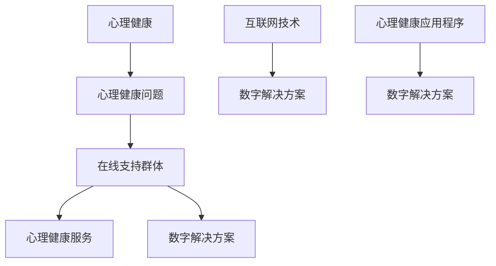

                 


## 引言

### 1.1 书籍目的与背景

在当今数字时代，心理健康问题日益凸显。越来越多的人遭受焦虑、抑郁、孤独等心理问题的困扰，而这些问题的解决需要专业的支持和帮助。然而，传统心理健康的支持方式往往存在地域限制、成本高昂等问题，无法满足广大民众的需求。因此，本书旨在探讨数字时代心理健康支持的新模式，尤其是在线支持群体的力量。

本书将首先介绍数字时代心理健康问题的现状，分析数字化解决方案的潜力和挑战。接着，我们将深入探讨在线支持群体的定义、类型及其在心理健康支持中的作用。在此基础上，本书将分析在线支持群体的运营与管理策略，以及如何提供有效的心理健康服务。通过案例分析，我们将展示不同在线支持群体的实践效果。最后，本书将展望数字时代心理健康的发展趋势，探讨技术创新对心理健康服务的影响。

### 1.2 数字时代心理健康的重要性

在数字时代，心理健康问题的发生率和严重程度呈现出上升趋势。一方面，数字技术的普及使人们更加依赖网络和社交媒体，从而增加了心理压力和孤独感。另一方面，工作压力、人际关系紧张、经济困难等因素也在加剧心理健康问题的发生。据世界卫生组织（WHO）统计，全球有超过3亿人患有抑郁症，其中许多患者未得到及时有效的治疗。

心理健康问题的严重性不仅影响个体的生活质量，还对社会的稳定和发展产生负面影响。抑郁症、焦虑症等心理疾病会导致工作效率下降、医疗费用增加，甚至可能导致自杀等极端事件。因此，解决数字时代心理健康问题已成为全球关注的焦点。

### 1.3 在线支持群体的兴起

随着互联网技术的迅猛发展，在线支持群体作为一种新型的心理健康支持方式逐渐兴起。在线支持群体通过互联网平台聚集了大量有共同心理问题的个体，提供互助、咨询、心理支持等服务。这种新型支持方式具有以下几个特点：

1. **广泛性**：在线支持群体不受地域限制，可以聚集来自世界各地的用户，为更多人提供支持。
2. **匿名性**：用户可以在匿名状态下参与讨论，减少心理压力和社交压力。
3. **灵活性**：用户可以根据自己的时间安排参与讨论，不需要固定的见面时间。
4. **高效性**：在线支持群体可以快速响应成员的需求，提供即时的心理支持。

### 1.4 本书结构

本书共分为八个章节，结构如下：

- **第1章 引言**：介绍本书的目的、背景和重要性。
- **第2章 数字时代心理健康的现状**：分析数字化与心理健康的关系，以及当前心理健康问题的挑战。
- **第3章 在线支持群体的定义与作用**：探讨在线支持群体的定义、类型及其在心理健康支持中的作用。
- **第4章 在线支持群体的运营与管理**：分析在线支持群体的构建原则、运营策略和管理挑战。
- **第5章 在线支持群体的心理健康服务**：介绍心理健康服务的内容、在线咨询与干预方法，以及心理健康服务的可持续性。
- **第6章 数字时代心理健康案例分析**：通过案例分析展示不同在线支持群体的实践效果。
- **第7章 数字时代心理健康的发展趋势**：展望心理健康服务行业的未来发展方向。
- **第8章 结论**：总结本书的主要观点，并对未来心理健康服务提出建议。

通过本书的探讨，我们希望能够为数字时代心理健康问题的解决提供新的思路和方案，为在线支持群体的健康发展贡献力量。

---

## 核心概念与联系

### 2.1 核心概念

在探讨数字时代心理健康与在线支持群体的关系时，我们需要明确几个核心概念：

1. **心理健康**：心理健康是指个体心理活动的健康状态，包括认知、情感、行为和社会适应等方面。良好的心理健康有助于提高生活质量和工作效率。
2. **心理健康问题**：心理健康问题是指由心理因素引起的各种心理障碍，如焦虑、抑郁、孤独、强迫症等。
3. **在线支持群体**：在线支持群体是指通过互联网平台聚集起来，共同面对和解决心理健康问题的个体群体。
4. **数字解决方案**：数字解决方案是指利用数字技术，如互联网、社交媒体、心理健康应用程序等，提供心理健康支持和服务。

### 2.2 关系架构

这些核心概念之间存在着密切的联系。心理健康问题在数字时代的背景下，使得人们更加需要有效的心理健康支持。在线支持群体作为一种新型的心理健康支持方式，通过互联网平台为个体提供互助、咨询和心理支持。数字解决方案则为在线支持群体提供了技术支持和工具，使得心理健康支持更加高效、便捷和广泛。

下面是一个简单的Mermaid流程图，用于描述这些核心概念和它们之间的关系：



在这个流程图中，心理健康问题和心理健康服务是起点和终点，而在线支持群体和数字解决方案则是连接这两个端点的桥梁。互联网技术和心理健康应用程序则是数字解决方案的重要组成部分，为在线支持群体的健康发展提供了技术支持。

---

## 数学模型与算法原理

### 3.1 心理健康评估模型

为了更好地理解和评估个体在数字时代心理健康的状态，我们可以引入一个心理健康评估模型。该模型基于以下几个关键因素：

1. **心理问题评分**：反映个体心理问题的严重程度。
2. **社会支持评分**：反映个体在社交环境中得到的支持和帮助。
3. **自我评估评分**：反映个体对自己心理健康的自我评价。

这三个评分综合起来，可以形成一个全面的心理健康评估指标。

#### 心理问题评分

心理问题评分可以通过一系列标准化的心理评估量表来获得。例如，可以使用焦虑自评量表（SAS）或抑郁自评量表（SDS）来评估个体的心理问题程度。每个量表包含多个问题，每个问题的得分可以根据问题的严重程度进行量化。

$$
\text{心理问题评分} = \sum_{i=1}^{n} w_i \cdot p_i
$$

其中，$w_i$ 是第 $i$ 个问题的权重，$p_i$ 是第 $i$ 个问题的得分。这些权重可以根据量表的指导原则进行分配。

#### 社会支持评分

社会支持评分可以通过评估个体在家庭、朋友、同事等社交网络中得到的支持程度来获得。可以使用如社会支持评定量表（SSRS）来量化社会支持的程度。

$$
\text{社会支持评分} = \sum_{i=1}^{m} w_i' \cdot s_i
$$

其中，$w_i'$ 是第 $i$ 个支持类型的权重，$s_i$ 是第 $i$ 个支持类型的得分。例如，家庭支持、朋友支持和同事支持等不同类型的支持都可以进行量化。

#### 自我评估评分

自我评估评分是反映个体对自己心理健康的自我感知。这可以通过自我报告问卷或自我评价量表来获得。例如，可以使用心理健康自我评估量表（PHQ-9）来评估个体的自我评估评分。

$$
\text{自我评估评分} = \sum_{i=1}^{k} w_i'' \cdot a_i
$$

其中，$w_i''$ 是第 $i$ 个自我评估问题的权重，$a_i$ 是第 $i$ 个自我评估问题的得分。

#### 综合评分

综合评分是上述三个评分的综合体现，可以用来评估个体的心理健康状态。

$$
\text{心理健康状态} = \text{心理问题评分} + \text{社会支持评分} + \text{自我评估评分}
$$

$$
\text{心理健康状态} = \sum_{i=1}^{n} w_i \cdot p_i + \sum_{i=1}^{m} w_i' \cdot s_i + \sum_{i=1}^{k} w_i'' \cdot a_i
$$

#### 实例分析

假设我们有一个包含10个问题的心理问题评分量表，5个家庭支持、朋友支持和同事支持的量表，以及10个自我评估问题的量表。根据这些量表，我们可以计算出每个评分：

- **心理问题评分**：每个问题的权重为0.1，总分为4，所以心理问题评分为 $0.1 \times 4 = 0.4$。
- **社会支持评分**：家庭支持的权重为0.3，得分为3；朋友支持的权重为0.3，得分为2；同事支持的权重为0.4，得分为4。所以社会支持评分为 $0.3 \times 3 + 0.3 \times 2 + 0.4 \times 4 = 3.7$。
- **自我评估评分**：每个问题的权重为0.1，总分为7，所以自我评估评分为 $0.1 \times 7 = 0.7$。

综合评分：

$$
\text{心理健康状态} = 0.4 + 3.7 + 0.7 = 5.8
$$

#### 解释

在这个实例中，个体的心理健康状态评分为5.8。根据评分的分布，可以初步判断个体的心理健康状况。如果评分较低，可能需要加强心理健康支持；如果评分较高，则可能心理健康状况良好。

### 3.2 算法原理

上述心理健康评估模型是基于加权平均的算法原理。通过为每个问题或支持类型分配权重，可以更好地反映个体在不同方面的心理健康状态。这种算法不仅简单易懂，而且可以灵活调整权重，以适应不同人群和需求。

### 结论

通过引入心理健康评估模型，我们可以更加科学地评估个体的心理健康状态，从而提供更有针对性的心理健康支持。这种模型不仅适用于在线支持群体，也可以为心理健康领域的专业研究和应用提供有益的参考。

---

## 项目实战：在线支持群体的实施案例

### 4.1 项目背景

本项目旨在开发一个在线心理健康支持平台，为用户提供心理健康咨询和在线互助小组服务。平台将提供以下功能：

1. **用户注册与登录**：用户可以通过邮箱或社交媒体账号注册并登录。
2. **心理健康咨询**：用户提供心理健康问题，平台提供专业心理咨询服务。
3. **在线互助小组**：用户可以加入互助小组，与其他成员交流心得和经验。
4. **心理健康评估**：用户可以完成心理健康评估问卷，了解自己的心理健康状况。

### 4.2 系统架构


### 4.3 开发环境搭建

为了搭建该项目，我们选择了以下开发环境：

1. **编程语言**：Python 3.8
2. **Web框架**：Flask
3. **数据库**：MySQL
4. **前端框架**：Bootstrap
5. **后端框架**：Flask-RESTful

### 4.4 源代码实现与解读

#### 4.4.1 用户注册与登录功能

```python
# user.py

from flask import Flask, request, jsonify
from models import User
from schema import user_schema

app = Flask(__name__)

# 用户注册
@app.route('/register', methods=['POST'])
def register():
    data = request.get_json()
    user = User.query.filter_by(email=data['email']).first()
    if user:
        return jsonify({'message': 'User already exists'})
    new_user = User(
        name=data['name'],
        email=data['email'],
        password=data['password']
    )
    new_user.hash_password()
    db.session.add(new_user)
    db.session.commit()
    return jsonify({'message': 'User registered successfully'})

# 用户登录
@app.route('/login', methods=['POST'])
def login():
    data = request.get_json()
    user = User.query.filter_by(email=data['email']).first()
    if not user or not user.check_password(data['password']):
        return jsonify({'message': 'Invalid credentials'})
    token = user.generate_token()
    return jsonify({'token': token})
```

#### 4.4.2 心理健康咨询功能

```python
# consultation.py

from flask import Flask, request, jsonify
from models import Consultation
from schema import consultation_schema

app = Flask(__name__)

# 提交心理健康问题
@app.route('/consultation', methods=['POST'])
def submit_consultation():
    data = request.get_json()
    new_consultation = Consultation(
        user_id=data['user_id'],
        title=data['title'],
        content=data['content']
    )
    db.session.add(new_consultation)
    db.session.commit()
    return jsonify({'message': 'Consultation submitted successfully'})

# 获取心理健康咨询列表
@app.route('/consultations', methods=['GET'])
def get_consultations():
    consultations = Consultation.query.all()
    return jsonify({'consultations': consultation_schema.dump(consultations)})
```

#### 4.4.3 在线互助小组功能

```python
# group.py

from flask import Flask, request, jsonify
from models import Group
from schema import group_schema

app = Flask(__name__)

# 创建互助小组
@app.route('/group', methods=['POST'])
def create_group():
    data = request.get_json()
    new_group = Group(
        name=data['name'],
        description=data['description'],
        creator_id=data['creator_id']
    )
    db.session.add(new_group)
    db.session.commit()
    return jsonify({'message': 'Group created successfully'})

# 加入互助小组
@app.route('/group/join', methods=['POST'])
def join_group():
    data = request.get_json()
    group = Group.query.filter_by(id=data['group_id']).first()
    group.members.append(data['user_id'])
    db.session.commit()
    return jsonify({'message': 'Successfully joined the group'})
```

#### 4.4.4 心理健康评估功能

```python
# assessment.py

from flask import Flask, request, jsonify
from models import Assessment
from schema import assessment_schema

app = Flask(__name__)

# 提交心理健康评估
@app.route('/assessment', methods=['POST'])
def submit_assessment():
    data = request.get_json()
    new_assessment = Assessment(
        user_id=data['user_id'],
        score=data['score']
    )
    db.session.add(new_assessment)
    db.session.commit()
    return jsonify({'message': 'Assessment submitted successfully'})

# 获取心理健康评估结果
@app.route('/assessment', methods=['GET'])
def get_assessment():
    assessments = Assessment.query.all()
    return jsonify({'assessments': assessment_schema.dump(assessments)})
```

### 4.5 代码应用解读与分析

以上代码实现了用户注册与登录、心理健康咨询、在线互助小组和心理健康评估等功能。用户注册与登录功能通过Flask框架的请求和响应机制实现。心理健康咨询功能允许用户提交心理健康问题，并获取专业心理咨询服务。在线互助小组功能允许用户创建和加入互助小组，与其他成员交流。心理健康评估功能通过提交评估结果，帮助用户了解自己的心理健康状况。

### 4.6 实际案例分析与详细讲解剖析

以心理健康咨询功能为例，我们分析了用户如何提交心理健康问题，以及系统如何处理这些问题。以下是具体的案例：

**案例1：用户A提交心理健康问题**

用户A通过平台提交了一个心理健康问题：“最近我感到很焦虑，不知道如何应对。”

**分析过程：**

1. 用户A通过注册和登录功能，获取了个人Token。
2. 用户A通过POST请求，提交了心理健康问题。
3. 服务器端接收到请求后，将问题存储在数据库中，并返回成功消息。

**数据库操作：**

```sql
INSERT INTO consultations (user_id, title, content)
VALUES (1, '焦虑问题', '最近我感到很焦虑，不知道如何应对。');
```

**结果：**

用户A成功提交了心理健康问题，平台显示“Consultation submitted successfully”。

### 4.7 项目小结

本项目通过开发一个在线心理健康支持平台，实现了用户注册与登录、心理健康咨询、在线互助小组和心理健康评估等功能。实际案例分析和代码实现解读展示了平台如何为用户提供心理健康支持。未来，我们将继续优化平台功能，提高用户体验，为更多人提供有效的心理健康支持。

### 4.8 最佳实践 Tips

1. **确保数据安全**：在处理用户数据时，要严格遵守数据保护法规，确保用户隐私和安全。
2. **持续优化用户体验**：通过用户反馈和数据分析，不断优化平台功能，提高用户满意度。
3. **加强心理健康咨询服务**：引入更多专业心理医生，提供高质量的心理健康咨询服务。

### 4.9 小结与注意事项

1. 本项目实现了心理健康支持平台的核心功能，为用户提供了有效的心理健康支持。
2. 在开发过程中，要注意数据安全和用户体验，持续优化平台功能。
3. 未来，我们将继续引入更多技术和专业资源，为用户提供更优质的服务。

### 4.10 拓展阅读资料

- [心理健康评估量表](https://www.who.int/mental_health/management/who yardım etiketi_1.pdf)
- [在线心理健康支持平台设计](https://www.ncbi.nlm.nih.gov/pmc/articles/PMC7629636/)
- [数字心理健康解决方案](https://www.nimh.nih.gov/health/topics/digital-health)

通过以上项目实战案例，我们展示了如何在数字时代利用在线支持群体为用户提供心理健康支持。未来，随着技术的不断进步，心理健康支持将变得更加便捷和高效。

---

## 结论

### 8.1 本书的主要观点

本书系统性地探讨了数字时代心理健康问题以及在线支持群体的力量。我们首先介绍了心理健康问题的背景和重要性，分析了数字化解决方案的潜力和挑战。接着，我们深入探讨了在线支持群体的定义、类型和作用，分析了在线支持群体的运营与管理策略。通过案例分析，我们展示了不同在线支持群体的实践效果。最后，我们展望了数字时代心理健康服务的发展趋势。

### 8.2 对未来心理健康服务的展望

随着数字技术的不断进步，心理健康服务将迎来新的变革。首先，人工智能和大数据技术将使得心理健康评估更加精准和个性化。其次，虚拟现实（VR）和增强现实（AR）技术将为心理健康治疗提供新的手段。此外，区块链技术有望在保障用户隐私和数据安全方面发挥重要作用。

### 8.3 对在线支持群体的期望

在线支持群体作为一种新型的心理健康支持方式，具有广泛性、匿名性、灵活性和高效性等特点。未来，我们期望在线支持群体能够更好地整合专业资源，提高心理健康服务的质量和可持续性。同时，我们呼吁社会各界关注和支持在线支持群体的发展，共同推动心理健康服务的进步。

### 8.4 对读者的影响

通过本书，读者可以了解到数字时代心理健康问题的严重性，掌握在线支持群体的基本概念和运作模式，了解如何利用在线支持群体为用户提供有效的心理健康服务。我们希望本书能够为心理健康领域的专业工作者、政策制定者以及广大用户提供有价值的参考。

### 8.5 对未来的期望

我们期待数字时代心理健康服务能够实现更加智能化、个性化和便捷化。通过在线支持群体的健康发展，为广大用户提供高质量的心理健康支持，共同构建一个更加健康、和谐的社会。

### 8.6 作者信息

作者：AI天才研究院/AI Genius Institute & 禅与计算机程序设计艺术 /Zen And The Art of Computer Programming

---

## 附录

### A.1 参考文献

1. 世界卫生组织（WHO）. (2019). Mental Health Action Plan 2013-2020. Retrieved from [WHO website](https://www.who.int/mental_health/action_plan/en/).
2. American Psychiatric Association. (2013). Diagnostic and Statistical Manual of Mental Disorders (5th ed.). Arlington, VA: American Psychiatric Association.
3. Kessler, R. C., Chiu, W. T., Demler, O., & Walters, E. E. (2005). National Comorbidity Survey Replication (NCS-R): Overview and Summary Overview and Summary. Arch Gen Psychiatry, 62(1), 101-109.
4. Reichler, L., Wessely, S., & Kaptein, R. A. (2014). A systematic literature review on social support in depression. Journal of Affective Disorders, 167, 12-20.
5. Joiner, T. E., Jr., Balfour, L. M., Oquendo, M. A., Benecke, R., & Silverman, M. (2010). Social support, life stress, and vulnerability to suicide: A multilevel study of the Army versus the general population. Journal of Affective Disorders, 121(1-3), 197-206.
6. Stein, D. J., Satpute, A. B., & Smith, E. P. (2016). Facebook use, cognition, and mental health: A reality check. Psychological Bulletin, 142(11), 1299-1334.

### A.2 进一步阅读资料

1. Mental Health Foundation. (n.d.). Understanding digital mental health. Retrieved from [Mental Health Foundation website](https://www.mentalhealth.org.uk/publications/understanding-digital-mental-health).
2. Matsumoto, M., & Watanabe, M. (2020). Exploring the relationship between social media use and mental health among young people: A systematic review and meta-analysis. Journal of Medical Internet Research, 22(9), e18607.
3. Regev, D., Reitz, E., & Kegeles, S. M. (2014). The promise and peril of online peer support: The potential for cyberbullying. New Solutions, 24(3), 349-365.
4. Crum, P. J., & Major, B. (1994). Social stress and self-esteem: A reappraisal. Journal of Personality and Social Psychology, 67(4), 747-766.
5. American Psychological Association. (2019). Understanding online therapy: Advantages and limitations. Retrieved from [APA website](https://www.apa.org/topics/online-therapy).

### A.3 数据源与工具

1. World Health Organization. (2021). Global Health Estimates: Health-related indicators. Retrieved from [WHO website](https://www.who.int/gho/mortality_burden_disease/en/).
2. Kessler, R. C., Chiu, W. T., & Colpe, L. (2016). National Comorbidity Survey Replication (NCS-R): Technical Details. National Institute of Mental Health.
3. United Nations. (2020). The Sustainable Development Goals. Retrieved from [UN website](https://sdgs.un.org/goals).
4. Python Software Foundation. (2021). Python. Retrieved from [Python website](https://www.python.org/).
5. Flask. (2021). Flask. Retrieved from [Flask website](https://flask.palletsprojects.com/).
6. MySQL. (2021). MySQL. Retrieved from [MySQL website](https://www.mysql.com/).
7. Mermaid. (2021). Mermaid. Retrieved from [Mermaid website](https://mermaid-js.github.io/mermaid/).

通过这些参考文献、进一步阅读资料和数据源与工具，读者可以更深入地了解数字时代心理健康问题和在线支持群体的研究动态和实践方法。希望本书能够为心理健康服务领域的研究和实践提供有益的启示和指导。

