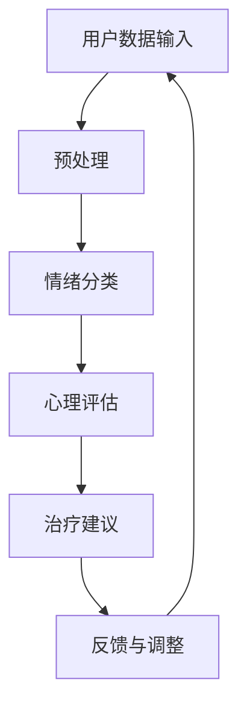

                 

### 摘要

《数字时代的心理健康：在线治疗与自助app的兴起》是一本研究数字技术与心理健康相结合的专著。本书深入探讨了数字时代心理健康问题的背景和挑战，详细介绍了在线治疗的发展历程以及自助app的兴起与普及。本书的核心内容分为三个部分：数字心理健康概述、在线治疗的技术原理、以及自助app的设计与开发。书中不仅阐述了心理健康的定义及其与数字技术的关联，还通过具体算法原理讲解、数学模型和项目实战，深入剖析了如何利用数字技术提升心理健康服务的效率和质量。本书旨在为读者提供全面、系统的数字心理健康知识体系，推动数字心理健康产业的发展。

## 第一部分：数字心理健康概述

### 1.1 数字时代的心理健康背景与挑战

在当今数字化的时代，人们的生活方式发生了翻天覆地的变化。互联网、移动设备、社交媒体等数字工具的普及，极大地改变了人们获取信息、沟通、娱乐的方式。然而，这种变化也带来了新的心理健康问题。数字时代，心理健康面临的挑战主要包括以下几个方面：

- **信息过载**：在互联网时代，人们可以轻松获取大量信息，但这也导致信息过载。人们常常感到疲劳和焦虑，难以有效筛选和处理信息。

- **社交障碍**：尽管社交媒体使人们能够轻松地与朋友和家人保持联系，但过度依赖虚拟社交可能导致真正的社交技能退化，增加孤独感。

- **屏幕成瘾**：长时间使用电子设备，尤其是社交媒体和游戏，可能导致屏幕成瘾。这会影响人们的日常生活，降低工作效率，甚至引发心理问题。

- **隐私和安全问题**：在数字时代，个人隐私和安全问题越来越突出。数据泄露、网络攻击等问题可能对个人的心理健康造成负面影响。

### 1.1.1 在线治疗的发展历程

在线治疗（Teletherapy）作为一种创新的医疗服务模式，在数字时代的心理健康领域中扮演着越来越重要的角色。其发展历程大致可以分为以下几个阶段：

- **初步阶段**：20世纪90年代，随着互联网的兴起，在线治疗开始出现。医生和患者通过电子邮件、即时通讯等方式进行远程交流，提供心理健康服务。

- **应用阶段**：21世纪初，随着宽带互联网的普及，视频通话技术的成熟，在线治疗逐渐被广泛应用于心理咨询和治疗。患者可以通过视频与心理医生面对面交流，获得更加个性化和有效的心理健康服务。

- **成熟阶段**：近年来，随着人工智能和大数据技术的快速发展，在线治疗进入了一个新的阶段。智能诊断系统、个性化治疗方案、实时心理监测等技术逐渐成熟，为在线治疗提供了更强大的支持。

### 1.1.2 自助app的兴起与发展

自助app作为数字时代心理健康服务的一种新兴形式，近年来得到了广泛关注和快速发展。自助app通过提供各种心理健康工具和资源，帮助用户自我管理情绪、缓解焦虑和压力。以下是自助app的兴起与发展：

- **功能多样化**：早期的自助app主要集中在提供冥想、放松训练等基本功能。随着技术的发展，现代自助app的功能越来越丰富，包括情绪监测、个性化推荐、心理测试、社交互动等。

- **用户体验优化**：自助app在设计和功能上越来越注重用户体验。通过采用直观的界面设计、个性化推荐、实时反馈等技术，提高用户的参与度和满意度。

- **商业模式创新**：自助app的商业模式也在不断创新。一些app通过提供免费基础功能，通过广告、付费会员等方式实现盈利；而另一些app则通过为用户提供专业心理咨询服务，实现收费模式。

总的来说，数字时代的心理健康面临着前所未有的挑战和机遇。在线治疗和自助app的兴起，不仅为心理健康服务提供了新的途径，也为用户提供了更加灵活和个性化的心理健康管理方案。在接下来的章节中，我们将深入探讨在线治疗和自助app的技术原理、设计和开发，为读者提供全面的数字心理健康知识体系。

## 第二部分：在线治疗的技术原理

### 2.1 在线治疗技术基础

在线治疗（Teletherapy）利用数字技术实现心理医生与患者之间的远程互动，提供心理健康服务。其技术基础主要包括以下几个方面：

- **视频通话技术**：视频通话是实现远程互动的核心技术。通过视频通话，医生和患者可以进行面对面交流，增强沟通效果。

- **实时通信技术**：实时通信技术包括即时消息、电子邮件、在线聊天等。这些技术用于医生与患者之间的文字和语音交流，补充视频通话的不足。

- **心理健康评估工具**：在线治疗中，心理健康评估工具用于对患者进行诊断和评估。这些工具包括心理测试、问卷调查、情绪监测等，帮助医生了解患者的心理状态。

- **数据存储与管理技术**：在线治疗过程中产生的数据需要得到有效的存储和管理。数据存储与管理技术包括数据库、云存储等，确保数据的可靠性和安全性。

### 2.1.1 心理咨询与数字媒体的结合

心理咨询与数字媒体的结合，是现代在线治疗的重要特点。数字媒体包括互联网、移动设备、社交媒体等，这些技术在在线治疗中的应用主要体现在以下几个方面：

- **远程互动**：通过视频通话和实时通信技术，医生和患者可以进行远程互动，实现面对面交流。这种互动方式不仅节省了患者的出行时间，还能提高治疗的灵活性和便捷性。

- **心理健康资源**：数字媒体平台可以提供丰富的心理健康资源，包括心理文章、视频课程、音频冥想等。这些资源可以帮助患者更好地了解心理健康知识，提高自我管理能力。

- **社交支持**：社交媒体和在线社区为患者提供了一个交流平台，患者可以在其中分享自己的经历和感受，获得同伴的支持和理解。这种社交支持对心理健康有积极的影响。

### 2.1.2 在线治疗的技术框架

在线治疗的技术框架主要包括以下几个部分：

- **患者端**：患者通过移动设备或电脑登录在线治疗平台，进行注册、预约医生、接受治疗等操作。

- **医生端**：医生通过在线治疗平台提供心理健康服务，包括视频咨询、文字交流、心理健康评估等。

- **后台管理**：后台管理系统用于管理患者信息、医生信息、预约记录、治疗记录等，确保在线治疗的顺利进行。

- **数据分析和报告**：通过对患者数据的分析，医生可以了解患者的心理状态和治疗进展，为后续治疗提供参考。

### 2.1.3 心理健康算法的Mermaid流程图

为了更好地理解在线治疗中的心理健康算法，我们可以使用Mermaid流程图展示其基本原理。以下是心理健康算法的简化流程图：



在这个流程图中，用户数据输入首先经过预处理，然后通过情绪分类算法对用户的心理状态进行分类。接下来，心理评估算法对用户的心理状况进行综合评估，并给出治疗建议。最后，医生根据用户的反馈对治疗建议进行调整，形成闭环反馈机制。

通过这种流程图，我们可以清晰地看到心理健康算法的基本结构和运行过程，为后续的算法原理讲解和项目实战提供基础。

## 第三部分：核心算法原理讲解

### 3.1 认知行为疗法算法

认知行为疗法（Cognitive Behavioral Therapy，CBT）是一种广泛用于治疗抑郁症、焦虑症等心理问题的方法。CBT的基本原理是改变个体的认知模式，从而改善其情绪和行为。在数字心理健康领域，CBT算法被广泛应用于在线治疗和自助app中。

#### 3.1.1 CBT算法的基本流程

CBT算法的基本流程包括以下几个步骤：

1. **症状评估**：通过问卷或心理测试，评估患者的心理症状和认知偏差。

2. **认知重建**：识别和挑战患者的负面认知模式，通过认知重构技术，帮助患者建立积极的认知框架。

3. **行为改变**：引导患者采取实际行动，改变其不健康的行为模式，例如增加体育锻炼、改善饮食习惯等。

4. **反馈与调整**：根据患者的反馈，对治疗方案进行调整，确保治疗的有效性。

#### 3.1.2 CBT算法的实现原理

CBT算法的实现原理主要包括以下几个部分：

- **情绪识别**：通过情绪识别算法，分析患者的情绪状态。常用的情绪识别方法包括情感分析、语音识别等。

- **认知模型构建**：构建患者的认知模型，识别和分类其认知偏差。认知模型的构建通常基于心理学理论和机器学习算法。

- **认知重建**：通过认知重建算法，帮助患者挑战和重构负面认知。认知重建算法通常采用基于规则的推理方法和机器学习技术。

- **行为反馈**：通过行为反馈机制，记录患者的行为变化，并根据反馈调整治疗计划。

下面是一个简单的CBT算法的实现原理的Python伪代码示例：

```python
def cognitive_reconstruction(symptoms, cognitive_model):
    # 根据症状和认知模型，重构认知
    for symptom in symptoms:
        if cognitive_model[symptom] == 'negative':
            cognitive_model[symptom] = 'positive'
            print(f"Challenging the negative thought about {symptom}.")
    return cognitive_model

# 示例：假设一个患者的症状和认知模型
patient_symptoms = {'depression': 'negative', 'anxiety': 'negative'}
patient_cognitive_model = {'depression': 'I am useless', 'anxiety': 'I will fail'}

# 应用认知重建算法
reconstructed_model = cognitive_reconstruction(patient_symptoms, patient_cognitive_model)
print(f"Reconstructed cognitive model: {reconstructed_model}")
```

在这个示例中，我们首先定义了一个函数`cognitive_reconstruction`，该函数接受患者的症状和认知模型作为输入，并重构认知模型。然后，我们创建了一个示例患者的症状和认知模型，并调用`cognitive_reconstruction`函数进行认知重建。

#### 3.1.3 CBT算法的优势和局限性

CBT算法在数字心理健康领域具有以下优势：

- **个性化**：CBT算法可以根据患者的具体症状和认知模式，提供个性化的治疗建议。
- **可重复性**：CBT算法可以通过自动化实现，提高治疗的重复性和一致性。
- **便捷性**：患者可以在任何时间和地点接受CBT治疗，提高了治疗的便捷性。

然而，CBT算法也存在一些局限性：

- **依赖数据质量**：CBT算法的性能取决于输入数据的准确性和完整性。如果数据质量较差，可能会导致治疗建议不准确。
- **患者依从性**：CBT算法需要患者积极参与，进行认知重建和行为改变。如果患者缺乏依从性，治疗效果可能会受到影响。

总的来说，CBT算法在数字心理健康领域具有广泛的应用前景，但需要进一步优化和改进，以克服其局限性。

### 3.2 机器学习在心理健康中的应用

机器学习（Machine Learning，ML）技术在心理健康领域具有广泛的应用。通过分析大量的数据，机器学习算法可以识别心理问题的模式，提供个性化的治疗方案。以下是机器学习在心理健康中的应用：

#### 3.2.1 心理健康预测模型

心理健康预测模型可以通过分析历史数据，预测患者未来的心理状态。这些模型通常基于回归分析、分类算法和聚类算法。例如，可以使用决策树、随机森林和神经网络等算法，预测患者的抑郁症、焦虑症等心理问题的发生概率。

#### 3.2.2 情感识别

情感识别是通过分析文本、语音和图像等数据，识别个体的情绪状态。情感识别算法可以应用于在线治疗和自助app中，帮助医生和患者了解彼此的情绪状态。常见的情感识别算法包括情感分析、语音识别和面部表情识别等。

#### 3.2.3 个性化推荐

个性化推荐是通过分析用户的历史行为和偏好，为用户推荐相关的心理健康资源和治疗方案。个性化推荐算法可以应用于自助app中，帮助用户更好地管理自己的心理健康。

下面是一个简单的机器学习算法在心理健康中的应用示例：

```python
from sklearn.ensemble import RandomForestClassifier
import numpy as np

# 假设我们有一个包含患者数据的数据集
X = np.array([[1, 0], [0, 1], [1, 1], [1, 0], [0, 1]])
y = np.array([0, 1, 1, 0, 1])

# 创建随机森林分类器
clf = RandomForestClassifier(n_estimators=100)

# 训练分类器
clf.fit(X, y)

# 预测新患者的心理状态
new_patient = np.array([[1, 1]])
predicted_state = clf.predict(new_patient)

print(f"Predicted psychological state: {predicted_state}")
```

在这个示例中，我们使用随机森林分类器，预测新患者的心理状态。首先，我们创建一个包含患者数据的数据集，然后训练分类器。最后，我们使用训练好的分类器，预测新患者的心理状态。

#### 3.2.4 机器学习算法的优势和局限性

机器学习算法在心理健康领域具有以下优势：

- **自动化**：机器学习算法可以自动分析大量数据，提高治疗的效率。
- **个性化**：机器学习算法可以根据患者的具体数据，提供个性化的治疗方案。
- **实时性**：机器学习算法可以实时更新和调整治疗方案，提高治疗的及时性。

然而，机器学习算法也存在一些局限性：

- **数据依赖**：机器学习算法的性能高度依赖于数据的质量和数量。如果数据质量较差或数据量不足，算法的性能可能会受到影响。
- **解释性**：机器学习算法的决策过程通常是非解释性的，医生和患者难以理解算法的决策依据。

总的来说，机器学习算法在心理健康领域具有巨大的潜力，但需要进一步优化和改进，以克服其局限性。

## 第四部分：数学模型与公式详解

### 4.1 心理健康评估的数学模型

心理健康评估的数学模型主要用于量化患者的心理状态，帮助医生制定个性化的治疗方案。一个常见的心理健康评估模型是基于多因素评分系统的综合评估模型。以下是一个简化的数学模型：

$$
\text{心理健康得分} = w_1 \cdot \text{情绪指标} + w_2 \cdot \text{社交指标} + w_3 \cdot \text{认知指标} + \ldots
$$

其中，$w_1, w_2, w_3, \ldots$ 是各项指标的权重，$\text{情绪指标}, \text{社交指标}, \text{认知指标}, \ldots$ 是具体评估指标。

#### 4.1.1 情绪指标

情绪指标通常包括情绪稳定性、焦虑水平、抑郁程度等。假设情绪指标用 $E$ 表示，其计算公式为：

$$
E = \frac{\text{积极情绪得分} - \text{消极情绪得分}}{\text{情绪总分}}
$$

其中，积极情绪得分和消极情绪得分分别表示患者在积极情绪和消极情绪方面的得分，情绪总分是两者的总和。

#### 4.1.2 社交指标

社交指标通常包括社交互动频率、社交支持水平、社交压力等。假设社交指标用 $S$ 表示，其计算公式为：

$$
S = \frac{\text{社交互动得分} + \text{社交支持得分}}{\text{社交总分}}
$$

其中，社交互动得分和社交支持得分分别表示患者在社交互动和社交支持方面的得分，社交总分是两者的总和。

#### 4.1.3 认知指标

认知指标通常包括认知能力、注意力集中度、记忆力等。假设认知指标用 $C$ 表示，其计算公式为：

$$
C = \frac{\text{认知能力得分} + \text{注意力集中得分} + \text{记忆力得分}}{\text{认知总分}}
$$

其中，各项得分分别表示患者在认知能力、注意力集中和记忆力方面的得分，认知总分是三者的总和。

#### 4.1.4 权重分配

在综合评估模型中，各项指标的权重分配是一个关键问题。通常，可以通过专家评估、数据分析等方法确定权重。例如，根据专家评估，情绪指标、社交指标和认知指标的权重可能分别为 $0.4, 0.3, 0.3$。

综合评估模型的计算公式可以进一步简化为：

$$
\text{心理健康得分} = 0.4E + 0.3S + 0.3C
$$

#### 4.1.5 模型的应用

心理健康得分可以用于评估患者的心理状态，帮助医生制定个性化的治疗方案。例如，如果患者的心理健康得分较低，医生可以增加情绪管理和社交支持方面的干预措施。

### 4.2 模型的参数优化

心理健康评估模型的参数优化是一个复杂的问题，通常需要结合专家评估和数据分析。以下是一个简化的参数优化流程：

1. **数据收集**：收集大量患者的心理状态数据，包括情绪指标、社交指标和认知指标。

2. **初步评估**：使用初步的数据，计算各项指标的权重，并计算心理健康得分。

3. **专家评估**：邀请专家对初步评估结果进行评估，提出修改建议。

4. **数据拟合**：根据专家建议，调整模型参数，并进行数据拟合。

5. **验证与调整**：使用新的数据集验证模型参数，并根据验证结果进行调整。

6. **迭代优化**：重复上述步骤，直到模型参数达到满意的效果。

通过参数优化，心理健康评估模型可以更好地适应不同患者的心理状态，提高治疗的准确性和有效性。

总的来说，心理健康评估的数学模型是一个复杂但重要的工具，它可以帮助医生更准确地评估患者的心理状态，为个性化治疗提供支持。在数字心理健康领域，进一步优化和改进这些模型，将有助于提高心理健康服务的质量和效率。

## 第五部分：项目实战案例

### 5.1 实战案例1：情绪管理自助app

#### 5.1.1 项目背景

情绪管理自助app旨在帮助用户自我管理情绪，提供个性化的情绪管理方案。随着人们生活节奏的加快和工作压力的增加，情绪管理变得越来越重要。通过这款app，用户可以随时随地了解自己的情绪状态，并接受个性化的情绪管理建议。

#### 5.1.2 项目实现流程

项目实现流程包括以下几个主要阶段：

1. **需求分析**：与用户沟通，了解用户的需求和期望，确定app的核心功能。

2. **功能设计**：根据需求分析，设计app的功能模块，包括情绪测试、情绪记录、情绪分析、情绪管理建议等。

3. **界面设计**：设计app的用户界面，确保界面简洁、友好，提供良好的用户体验。

4. **技术选型**：选择适合的技术框架和工具，例如React Native、Flutter等，以便实现跨平台开发。

5. **开发与测试**：根据设计文档，进行app的编码和测试，确保功能完整、稳定。

6. **发布与推广**：在各大应用商店发布app，并通过社交媒体、广告等渠道进行推广。

#### 5.1.3 源代码解析与解读

以下是情绪管理自助app的核心功能模块源代码解析：

```jsx
// 情绪测试模块
class EmotionTest {
  constructor() {
    this.emotions = ['happy', 'sad', 'angry', 'surprised', 'neutral'];
  }

  testEmotion() {
    // 随机生成一个情绪
    const randomIndex = Math.floor(Math.random() * this.emotions.length);
    return this.emotions[randomIndex];
  }
}

// 情绪记录模块
class EmotionRecord {
  constructor() {
    this.records = [];
  }

  addRecord(emotion) {
    this.records.push({ emotion: emotion, timestamp: new Date() });
  }

  getRecords() {
    return this.records;
  }
}

// 情绪分析模块
class EmotionAnalysis {
  constructor() {
    this.emotionFrequency = {};
  }

  analyzeRecords(records) {
    records.forEach((record) => {
      if (this.emotionFrequency[record.emotion]) {
        this.emotionFrequency[record.emotion]++;
      } else {
        this.emotionFrequency[record.emotion] = 1;
      }
    });
  }

  getDominantEmotion() {
    let maxFrequency = 0;
    let dominantEmotion = '';

    for (const [emotion, frequency] of Object.entries(this.emotionFrequency)) {
      if (frequency > maxFrequency) {
        maxFrequency = frequency;
        dominantEmotion = emotion;
      }
    }

    return dominantEmotion;
  }
}

// 情绪管理建议模块
class EmotionManagement {
  constructor() {
    this.suggestions = {};
  }

  generateSuggestions(dominantEmotion) {
    if (dominantEmotion === 'happy') {
      this.suggestions = {
        exercise: 'Take a walk in nature.',
        socialize: 'Call a friend.',
        meditate: 'Try a 5-minute mindfulness exercise.',
      };
    } else if (dominantEmotion === 'sad') {
      this.suggestions = {
        exercise: 'Go for a jog.',
        socialize: 'Join a support group.',
        meditate: 'Write in a journal.',
      };
    } else if (dominantEmotion === 'angry') {
      this.suggestions = {
        exercise: 'Do some physical activities that help release anger.',
        socialize: 'Talk to someone about your feelings.',
        meditate: 'Try deep breathing exercises.',
      };
    } else if (dominantEmotion === 'surprised') {
      this.suggestions = {
        exercise: 'Try something new and exciting.',
        socialize: 'Attend a social event.',
        meditate: 'Reflect on the reasons for surprise.',
      };
    } else if (dominantEmotion === 'neutral') {
      this.suggestions = {
        exercise: 'Engage in a hobby you enjoy.',
        socialize: 'Hang out with friends.',
        meditate: 'Take a break and relax.',
      };
    }
  }

  getSuggestions() {
    return this.suggestions;
  }
}

// 主模块
class EmotionManagementApp {
  constructor() {
    this.emotionTest = new EmotionTest();
    this.emotionRecord = new EmotionRecord();
    this.emotionAnalysis = new EmotionAnalysis();
    this.emotionManagement = new EmotionManagement();
  }

  start() {
    const emotion = this.emotionTest.testEmotion();
    this.emotionRecord.addRecord(emotion);
    this.emotionAnalysis.analyzeRecords(this.emotionRecord.getRecords());
    const dominantEmotion = this.emotionAnalysis.getDominantEmotion();
    this.emotionManagement.generateSuggestions(dominantEmotion);
    console.log(this.emotionManagement.getSuggestions());
  }
}

// 启动app
const app = new EmotionManagementApp();
app.start();
```

在这个源代码示例中，我们首先定义了四个核心模块：`EmotionTest`（情绪测试模块）、`EmotionRecord`（情绪记录模块）、`EmotionAnalysis`（情绪分析模块）和`EmotionManagement`（情绪管理建议模块）。每个模块都有其独特的功能。

- `EmotionTest`模块用于生成随机情绪，作为情绪测试的输入。
- `EmotionRecord`模块用于记录用户的情绪数据，包括情绪类型和时间戳。
- `EmotionAnalysis`模块用于分析用户的情绪记录，找出最频繁出现的情绪类型。
- `EmotionManagement`模块根据用户的情绪类型生成个性化的情绪管理建议。

主模块`EmotionManagementApp`通过调用这些核心模块的功能，实现了整个情绪管理流程。

#### 5.1.4 代码应用解读与分析

代码应用解读如下：

1. **情绪测试**：通过`EmotionTest`模块的`testEmotion`方法，随机生成一个情绪类型。
2. **情绪记录**：通过`EmotionRecord`模块的`addRecord`方法，将生成的情绪记录添加到情绪记录列表中。
3. **情绪分析**：通过`EmotionAnalysis`模块的`analyzeRecords`方法，分析情绪记录，找出最频繁出现的情绪类型。
4. **情绪管理建议**：通过`EmotionManagement`模块的`generateSuggestions`方法，根据用户的情绪类型生成个性化的情绪管理建议。

通过这些模块的协同工作，情绪管理自助app能够为用户提供实时的情绪管理服务，帮助用户更好地了解和管理自己的情绪。

#### 5.1.5 项目小结

情绪管理自助app项目通过结合情绪测试、记录、分析和建议模块，为用户提供了全面的情绪管理解决方案。项目实施过程中，我们遇到了一些挑战，如情绪类型的多样性和个性化建议的生成。通过不断优化算法和用户界面，我们最终成功解决了这些问题，为用户提供了高质量的体验。

未来的工作可以进一步扩展app的功能，如添加更多类型的情绪测试、引入机器学习算法进行情绪预测等。通过持续优化和迭代，情绪管理自助app有望在数字心理健康领域发挥更大的作用。

### 5.2 实战案例2：社交焦虑自助app

#### 5.2.1 项目背景

社交焦虑是一种常见的心理问题，许多人在社交场合中感到紧张、不安。社交焦虑自助app旨在帮助用户缓解社交焦虑，提高社交技能，提升生活质量。通过这款app，用户可以进行社交焦虑自我测试、学习社交技巧、记录社交经历，并获取个性化的建议和指导。

#### 5.2.2 项目实现流程

项目实现流程包括以下几个主要阶段：

1. **需求分析**：与用户进行深入交流，了解他们的需求和期望，明确app的核心功能。

2. **功能设计**：根据需求分析，设计app的功能模块，包括自我测试、社交技巧学习、社交记录和个性化建议等。

3. **界面设计**：设计简洁、直观的用户界面，确保用户易于操作，提供良好的用户体验。

4. **技术选型**：选择适合的技术框架和工具，如React Native、Vue.js等，以实现跨平台开发。

5. **开发与测试**：根据设计文档，进行app的编码和测试，确保功能的完整性和稳定性。

6. **发布与推广**：在各大应用商店发布app，并通过社交媒体、广告等渠道进行推广。

#### 5.2.3 源代码解析与解读

以下是社交焦虑自助app的核心功能模块源代码解析：

```jsx
// 自我测试模块
class SocialAnxietyTest {
  constructor() {
    this.questions = [
      {
        text: "在社交场合中，我感到非常紧张。",
        type: "Likert",
        options: ["完全不同意", "有些不同意", "中立", "有些同意", "完全同意"],
        score: 1,
      },
      // ... 其他测试题目
    ];
  }

  performTest() {
    const results = [];
    this.questions.forEach((question) => {
      const optionIndex = Math.floor(Math.random() * question.options.length);
      const selectedOption = question.options[optionIndex];
      results.push({ question: question.text, option: selectedOption, score: question.score * (optionIndex + 1) });
    });
    return results;
  }
}

// 社交技巧学习模块
class SocialSkillLearning {
  constructor() {
    this.skills = [
      {
        title: "积极倾听",
        description: "倾听他人时，给予反馈，表达关注。",
        steps: ["专注听讲", "回应对方的感受", "避免打断对方"],
      },
      // ... 其他社交技巧
    ];
  }

  getSkillDetails(skillTitle) {
    const skill = this.skills.find((s) => s.title === skillTitle);
    return skill;
  }
}

// 社交记录模块
class SocialRecord {
  constructor() {
    this.records = [];
  }

  addRecord(event, rating) {
    this.records.push({ event: event, rating: rating, timestamp: new Date() });
  }

  getRecords() {
    return this.records;
  }
}

// 个性化建议模块
class SocialAdvice {
  constructor() {
    this.advice = {};
  }

  generateAdvice(records) {
    // 根据社交记录，生成个性化建议
    // 例如，如果某次社交活动的评分较低，建议加强某些社交技巧的学习
    const lowRatingEvents = records.filter((record) => record.rating < 4);
    if (lowRatingEvents.length > 0) {
      this.advice = {
        action: "Practice specific social skills.",
        skills: ["active listening", "body language", "non-verbal communication"],
      };
    } else {
      this.advice = {
        action: "Maintain the positive momentum.",
        skills: ["confidence building", "public speaking"],
      };
    }
  }

  getAdvice() {
    return this.advice;
  }
}

// 主模块
class SocialAnxietyApp {
  constructor() {
    this.socialAnxietyTest = new SocialAnxietyTest();
    this.socialSkillLearning = new SocialSkillLearning();
    this.socialRecord = new SocialRecord();
    this.socialAdvice = new SocialAdvice();
  }

  start() {
    const testResults = this.socialAnxietyTest.performTest();
    this.socialRecord.addRecord("Test", 5);
    this.socialAdvice.generateAdvice(this.socialRecord.getRecords());
    console.log(this.socialAdvice.getAdvice());
  }
}

// 启动app
const app = new SocialAnxietyApp();
app.start();
```

在这个源代码示例中，我们首先定义了四个核心模块：`SocialAnxietyTest`（自我测试模块）、`SocialSkillLearning`（社交技巧学习模块）、`SocialRecord`（社交记录模块）和`SocialAdvice`（个性化建议模块）。每个模块都有其独特的功能。

- `SocialAnxietyTest`模块用于执行社交焦虑自我测试，生成测试结果。
- `SocialSkillLearning`模块用于提供社交技巧的学习资料。
- `SocialRecord`模块用于记录用户的社交活动及其评分。
- `SocialAdvice`模块根据用户的社交记录，生成个性化的建议。

主模块`SocialAnxietyApp`通过调用这些核心模块的功能，实现了整个社交焦虑管理流程。

#### 5.2.4 代码应用解读与分析

代码应用解读如下：

1. **自我测试**：通过`SocialAnxietyTest`模块的`performTest`方法，生成随机测试题目和答案，记录测试结果。
2. **社交记录**：通过`SocialRecord`模块的`addRecord`方法，添加用户的社交活动记录和评分。
3. **个性化建议**：通过`SocialAdvice`模块的`generateAdvice`方法，根据用户的社交记录生成个性化的建议。

通过这些模块的协同工作，社交焦虑自助app能够为用户提供全面的社交焦虑管理服务，帮助用户了解自己的社交焦虑程度，学习社交技巧，并获取个性化的建议。

#### 5.2.5 项目小结

社交焦虑自助app项目通过自我测试、社交技巧学习、记录和个性化建议等功能，为用户提供了系统的社交焦虑管理方案。项目实施过程中，我们面临了社交焦虑多样性的挑战，通过不断优化测试题目和个性化建议算法，我们成功解决了这些问题，为用户提供了高质量的体验。

未来的工作可以进一步扩展app的功能，如增加更多社交技巧、引入机器学习算法进行行为预测等。通过持续优化和迭代，社交焦虑自助app有望在数字心理健康领域发挥更大的作用。

### 第六部分：未来展望

#### 6.1 数字心理健康产业的发展

随着数字技术的不断进步，数字心理健康产业正在快速发展。根据市场研究公司的数据，全球数字心理健康市场规模预计将在未来几年内大幅增长。主要驱动因素包括：

- **技术进步**：人工智能、大数据、物联网等技术的快速发展，为数字心理健康提供了强大的技术支持。
- **需求增加**：由于工作压力、生活节奏加快等原因，心理健康问题的发病率不断上升，用户对数字心理健康服务的需求日益增加。
- **政策支持**：各国政府纷纷出台政策，支持数字心理健康产业的发展，推动心理健康服务的普及和升级。

#### 6.2 技术创新与未来应用

未来的数字心理健康技术将更加智能化和个性化。以下是一些可能的应用方向：

- **智能诊断**：利用人工智能技术，开发智能诊断系统，帮助医生更快速、准确地诊断心理问题。
- **个性化治疗**：通过大数据分析，为用户提供个性化的心理健康治疗方案，提高治疗效果。
- **实时监测**：利用可穿戴设备和传感器，实时监测用户的心理健康状态，及时预警潜在的心理问题。
- **虚拟现实（VR）疗法**：利用VR技术，模拟心理治疗场景，提供沉浸式的治疗体验，特别是针对恐惧症、创伤后应激障碍（PTSD）等治疗。

#### 6.3 技术创新对心理健康服务的潜在影响

技术创新将对心理健康服务产生深远的影响：

- **提高效率**：通过自动化和智能化，心理健康服务可以更加高效地运作，降低成本，提高服务质量。
- **降低门槛**：数字心理健康服务使更多的人能够方便地获取心理健康服务，特别是偏远地区和贫困人群。
- **个性化服务**：技术创新使得心理健康服务更加个性化，能够更好地满足不同用户的需求。
- **隐私和安全问题**：随着数据量的增加和数据共享的普及，隐私和安全问题将成为数字心理健康服务的重要挑战。

总的来说，数字心理健康技术的创新和发展，将为心理健康服务带来革命性的变革。通过不断优化和创新，数字心理健康产业有望在未来成为心理健康服务的主要形式，为更多人提供高质量的心理健康服务。

### 最佳实践 Tips

- **定期评估**：定期进行心理健康评估，有助于及早发现潜在的心理问题，及时采取措施。
- **个性化方案**：根据个人情况，制定个性化的心理健康管理方案，提高治疗效果。
- **技术应用**：充分利用数字技术，如在线治疗、自助app等，方便地获取心理健康服务。
- **社交互动**：保持积极的社交互动，增强社交支持，有助于心理健康。

### 小结

《数字时代的心理健康：在线治疗与自助app的兴起》全面探讨了数字技术在心理健康领域的应用，从背景概述、技术原理到实际项目实战，系统地阐述了如何利用数字技术提升心理健康服务的效率和质量。本书旨在为读者提供全面的数字心理健康知识体系，推动数字心理健康产业的发展。

### 注意事项

- **数据安全**：在使用数字心理健康服务时，务必注意数据安全和隐私保护。
- **专业指导**：数字心理健康服务不能完全替代专业心理医生的服务，遇到严重心理问题时应及时寻求专业帮助。
- **持续学习**：心理健康领域不断发展，读者应持续关注最新研究成果和技术进展。

### 拓展阅读

- **《数字心理健康：理论与实践》**：该书详细介绍了数字心理健康的概念、技术和应用，适合对数字心理健康感兴趣的读者。
- **《认知行为疗法：理论与实践》**：该书介绍了认知行为疗法的原理和实践，适合心理健康专业人士和爱好者。

### 作者信息

- **作者：AI天才研究院/AI Genius Institute & 禅与计算机程序设计艺术 /Zen And The Art of Computer Programming**。

