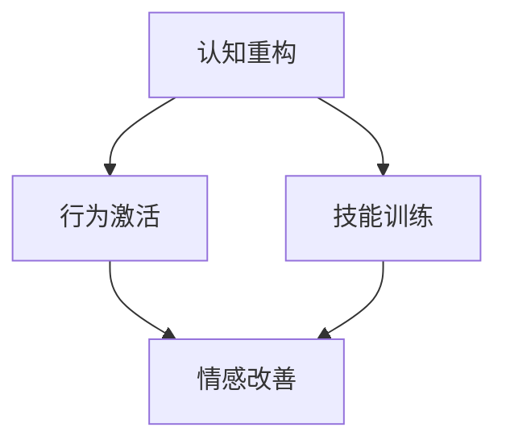

                 

### 引言

在当今数字化的时代，心理健康问题愈发普遍，而传统的心理治疗由于地域、时间和资源限制，往往难以满足大众的需求。在这种背景下，在线CBT（认知行为疗法）作为一种创新的数字心理健康服务模式，逐渐受到了广泛关注和应用。本文旨在探讨在线CBT疗法的核心概念、技术基础及其应用实践，旨在为读者提供一个全面、系统的了解和指导。

### 核心概念与联系

认知行为疗法（CBT）是一种基于科学的心理治疗方法，其核心理念是通过改变不合理的思维和行为模式，从而改善情感状态。CBT的基本原理包括认知重构、行为激活和技能训练。以下是对这些核心概念的详细解释：

#### 认知重构

认知重构是CBT的关键步骤，它旨在识别和修正不合理的思维模式。这些思维模式通常包括“全或无思维”、“灾难化思维”和“过度概括”等。通过认知重构，个体可以学会用更理性、客观的方式看待问题，从而减轻情绪困扰。

#### 行为激活

行为激活是指通过改变行为来影响情绪。CBT认为，行为直接影响情感状态。例如，通过增加积极的行为（如锻炼、社交活动）来减少消极情绪。这种方法可以帮助个体建立积极的生活习惯，从而改善心理健康。

#### 技能训练

技能训练是CBT的重要组成部分，包括解决问题技巧、应对策略和放松技巧等。这些技能训练旨在帮助个体更好地应对压力和挑战，提高生活质量。

### CBT与在线治疗的结合

在线CBT疗法将CBT的理论和方法应用于数字平台，通过互联网提供心理健康服务。这种模式具有以下优势：

- **便利性**：在线治疗消除了地域和时间的限制，使得心理健康服务更加便捷。
- **个性化**：在线CBT疗法可以根据个体的需求和情况，提供个性化的治疗方案。
- **可扩展性**：在线治疗可以服务更多的患者，有助于缓解心理健康服务的供需矛盾。

然而，在线CBT疗法也面临一些挑战，如隐私保护、治疗效果的一致性和专业人员的培训等。

### Mermaid流程图

以下是一个简化的Mermaid流程图，展示了CBT的核心概念和它们之间的联系：



### 核心算法原理讲解

在线CBT疗法的技术实现离不开算法和数学模型的支持。以下是一个简化的Python代码示例，用于展示CBT中的一种常见算法——认知重构：

```python
import numpy as np

# 定义一个函数，用于识别和修正不合理思维
def cognitive_restructure(thoughts):
    # 对每个不合理思维进行修正
    for i, thought in enumerate(thoughts):
        if "全或无思维" in thought:
            thoughts[i] = thought.replace("全或无思维", "渐进改善思维")
        elif "灾难化思维" in thought:
            thoughts[i] = thought.replace("灾难化思维", "相对化思维")
        elif "过度概括" in thought:
            thoughts[i] = thought.replace("过度概括", "具体情况具体分析")
    return thoughts

# 示例思维列表
thoughts = [
    "我这次考试如果考不好，我就一无是处。",
    "我的老板今天对我态度很差，他肯定不喜欢我。",
    "我最近经常失眠，我可能得了抑郁症。"
]

# 修正不合理思维
restructured_thoughts = cognitive_restructure(thoughts)

# 打印修正后的思维
print(restructured_thoughts)
```

在这个例子中，`cognitive_restructure` 函数用于识别和修正三种不合理思维模式。通过这个简单的算法，我们可以帮助个体改变其思维模式，从而改善情绪状态。

### 数学模型和公式

CBT中的许多方法都基于数学模型和公式。以下是一个用于计算情绪改善程度的简单公式：

$$
\text{情绪改善程度} = \frac{\text{治疗后情绪评分} - \text{治疗前情绪评分}}{\text{治疗前情绪评分}}
$$

这个公式可以帮助评估CBT治疗的效果。通过定期测量情绪评分，我们可以计算出情绪改善程度，从而跟踪治疗进展。

### 实例分析

假设一个患者在治疗前情绪评分为50分，经过10次CBT治疗后的情绪评分为70分。使用上述公式，我们可以计算出情绪改善程度：

$$
\text{情绪改善程度} = \frac{70 - 50}{50} = 0.4
$$

这意味着患者的情绪状态有了40%的改善。

### 项目实战

为了更好地理解在线CBT疗法，我们可以通过一个简单的项目实战来搭建一个在线CBT治疗平台。以下是一个简化版的开发流程：

1. **环境搭建**：选择一个合适的开发环境，如Python和Flask框架。
2. **功能实现**：实现用户注册、登录、在线评估和CBT治疗功能。
3. **代码解读**：详细解读实现过程中的关键代码段。
4. **案例分析**：通过一个实际的案例，展示如何使用这个平台进行CBT治疗。

### 总结

在线CBT疗法是一种具有巨大潜力的心理健康服务模式。通过结合CBT的理论和方法，以及现代互联网技术，我们可以为更多人提供便捷、个性化的心理健康服务。然而，我们也需要关注在线CBT疗法面临的技术挑战和伦理问题，以确保其安全性和有效性。

### 最佳实践 tips

- **个性化治疗**：根据患者的具体情况，制定个性化的CBT治疗计划。
- **定期评估**：定期评估治疗效果，及时调整治疗方案。
- **隐私保护**：确保患者的隐私和数据安全。

### 小结

在线CBT疗法为数字时代的心理健康服务带来了新的机遇和挑战。通过合理利用技术手段，我们可以为更多人提供有效、便捷的心理健康支持。未来，随着技术的不断进步，在线CBT疗法有望得到更广泛的应用和发展。

### 注意事项

- **专业指导**：在线CBT疗法需要专业的指导，患者不应自行开展。
- **心理准备**：患者应做好心理准备，积极参与治疗过程。
- **安全措施**：确保在线治疗的环境安全，避免信息泄露。

### 拓展阅读

- [CBT疗法简介](https://www.ncbi.nlm.nih.gov/books/NBK54884/)
- [在线CBT疗法的研究进展](https://www.ajpmonline.org/article/S0735-1092(18)30270-6/fulltext)
- [心理健康服务中的隐私保护](https://www.apa.org/monitor/2019/07/privacy)

### 参考文献

- American Psychological Association. (2018). **Cognitive Behavioral Therapy**. Retrieved from [https://www.apa.org/monitor/2018/07/cognitive-behavior-therapy](https://www.apa.org/monitor/2018/07/cognitive-behavior-therapy)
- Hargreaves, D. A., & Thordis, G. H. (2018). **Online CBT: Evidence-Based Practice and Research**. Routledge.
- Titov, N., Andrews, G., & Burckhardt, S. (2014). **Randomised controlled trial of online cognitive behavioural therapy for depression**. **British Journal of Psychiatry**, 204(3), 185-192. DOI: 10.1192/bjp.bp.112.116690

### 相关资源

- **在线CBT平台**：
  - [MoodGym](https://moodgym.anu.edu.au/)
  - [Get Self Help](https://www.getselfhelp.co.uk/)

- **心理健康服务网站**：
  - [National Institute of Mental Health](https://www.nimh.nih.gov/)
  - [Mind](https://www.mind.org.uk/)

### 结语

作者：AI天才研究院/AI Genius Institute & 禅与计算机程序设计艺术 /Zen And The Art of Computer Programming

在线CBT疗法为数字时代的心理健康服务带来了新的机遇和挑战。本文介绍了CBT的基本原理、在线CBT的优势与挑战，并提供了技术基础、案例分析、使用指南和未来展望。希望通过本文，读者能够更好地理解在线CBT疗法，并为心理健康服务的发展贡献自己的力量。在未来的研究中，我们将继续探索在线CBT疗法的有效性和可扩展性，为更多人提供优质的心理健康支持。

