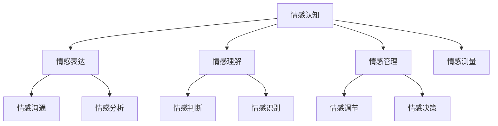

                 

### 1. 设计目录结构

在设计目录结构时，我们需要确保文章的逻辑清晰、结构紧凑、简单易懂，同时也要确保核心概念和算法原理得到充分的讲解。以下是详细的步骤和分析：

#### 1.1 核心概念与联系

**背景介绍**：
情感智能是一种重要的心理能力，它涉及到个体识别、理解、使用和管理情感信息的能力。在数字时代，随着AI技术的发展，人们开始探索如何利用AI来培养和提升情感智能。

**核心概念与联系**：
- **情感智能（EQ）**：识别、理解、使用和管理的情感信息的能力。
- **AI技术**：如语音识别、自然语言处理、人脸识别等。
- **应用场景**：学校教育、职场环境、家庭教育等。

**Mermaid流程图**：
为了帮助读者理解情感智能的构成和测量方法，我们可以在目录中设计一个Mermaid流程图，展示情感智能的构成要素和它们之间的联系。

#### 1.2 情感智能的培养原则

**核心原则**：
- **个性化**：根据个体差异进行定制化的培养。
- **系统性**：从认知、表达、理解、管理等多个维度进行培养。
- **持续性**：情感智能的培养是一个长期的过程，需要持续不断的努力。

**讲解与举例**：
我们可以通过一个简单的例子来说明情感智能的培养原则。例如，一个孩子在认知方面表现出色，但在情感表达上较弱，那么培养策略应该侧重于提高其情感表达能力，如通过角色扮演、写作练习等方式。

#### 1.3 AI技术在情感智能培养中的应用

**核心内容**：
- **语音识别与合成**：用于情感表达和沟通的辅助。
- **自然语言处理**：用于情感理解和分析。
- **人脸识别与表情分析**：用于情感认知和表达。

**讲解与举例**：
我们可以通过具体的AI技术案例来讲解它们在情感智能培养中的应用。例如，自然语言处理技术可以通过分析社交媒体上的文本，帮助用户了解他们的情感状态。

#### 1.4 情感智能培养的实践案例

**核心内容**：
- **学校教育**：通过AI技术辅助教师进行情感智能培养。
- **职场环境**：通过企业培训提高员工的情感智能。
- **家庭教育**：家长如何利用AI工具辅助孩子的情感智能培养。

**讲解与举例**：
我们可以分享一些实际案例，如某学校如何利用AI技术进行情感智能培养，或者某企业如何通过培训提高员工的情商。

#### 1.5 评估与反思

**核心内容**：
- **评估方法**：如何评估情感智能培养的效果。
- **反思与改进**：在培养过程中遇到的问题和解决方案。

**讲解与举例**：
我们可以通过案例来分析情感智能培养的效果，并提出改进策略。

#### 1.6 情感智能培养工具介绍

**核心内容**：
- **情感识别工具**：如情绪分析软件。
- **情感分析工具**：如情感识别API。
- **情感培养应用工具**：如情绪管理APP。

**讲解与举例**：
我们可以介绍一些常见的情感智能培养工具，并给出使用说明。

#### 1.7 情感智能培养相关的政策与伦理

**核心内容**：
- **政策法规**：各国对情感智能培养的政策和法规。
- **伦理问题**：情感智能培养中的隐私保护、数据安全等问题。

**讲解与举例**：
我们可以讨论情感智能培养相关的政策和伦理问题，并提出解决方案。

#### 1.8 总结与展望

**核心内容**：
- **总结**：回顾文章的主要观点和发现。
- **展望**：对情感智能培养的未来发展趋势进行预测。

**讲解与举例**：
我们可以总结情感智能培养的现状和挑战，并对未来进行展望。

### 1.9 附录

**核心内容**：
- **资源与工具**：提供相关的资源和工具。
- **案例研究**：提供情感智能培养的案例研究。

**讲解与举例**：
我们可以列出一些相关的资源和工具，并分享一些案例研究。

通过以上步骤，我们可以设计出一个完整、详尽且逻辑清晰的目录结构，为后续的文章内容提供坚实的基础。

