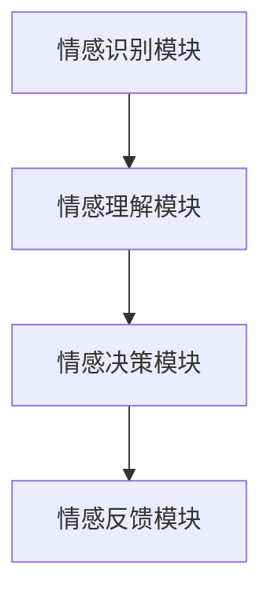

                 

### 引言：情感智能的重要性

在数字时代，人工智能（AI）技术正以前所未有的速度和规模影响着我们的生活。从智能手机到智能音箱，从自动化生产线到自动驾驶汽车，AI已经深入到我们日常生活的方方面面。然而，随着技术的进步，人们逐渐意识到，除了逻辑推理和数据处理能力之外，情感智能同样重要，尤其是在人机交互领域。

情感智能是指人类或人工智能系统识别、理解、处理和表达情感的能力。它不仅仅是简单的情绪识别，而是涉及到更复杂的情感理解和交互能力。例如，一个成功的虚拟助理不仅需要能够回答用户的问题，还需要能够理解用户的情感状态，并给出适当的回应。这就是情感智能的重要性所在。

情感智能在数字时代的应用场景十分广泛。在智能客服领域，情感智能可以帮助系统更好地理解用户的情绪和需求，从而提供更个性化的服务。在教育领域，情感智能可以帮助教育系统更好地了解学生的情感状态，从而提供更有针对性的教学支持。在医疗领域，情感智能可以帮助诊断患者的情绪状态，从而制定更有效的治疗方案。

本文将围绕“数字时代的情感智能：人机交互中的情感识别与响应”这一主题，深入探讨情感智能的起源与发展、情感识别技术、情感响应技术以及情感智能在不同领域的应用。通过一步步的分析和推理，我们希望能够为读者提供一幅清晰的情感智能全景图，并探讨其未来的发展趋势。

首先，我们将介绍情感智能的起源和发展，帮助读者理解情感智能的基本概念和重要性。接下来，我们将详细讨论情感识别技术，包括语音、文本和图像等不同类型的情感识别技术。然后，我们将探讨情感响应技术，分析情感响应的概念、类型和技术架构。随后，我们将具体讨论情感识别与响应在人机交互中的应用，包括智能客服、虚拟助理和教育等领域。最后，我们将探讨情感智能的未来发展趋势，分析其潜在应用领域和创新方向。

通过这篇文章，我们希望读者能够对情感智能有更深入的理解，认识到其在数字时代的重要性，并能够将其应用于实际场景中，推动人机交互的进一步发展。

### 文章关键词

- 情感智能
- 数字时代
- 人机交互
- 情感识别
- 情感响应
- 智能客服
- 虚拟助理
- 教育领域
- 情感识别技术
- 情感响应技术
- 人工智能

### 文章摘要

本文深入探讨了数字时代的情感智能，特别是在人机交互中的情感识别与响应技术。首先，介绍了情感智能的起源与发展，帮助读者理解其基本概念和重要性。接着，详细分析了情感识别技术，包括语音、文本和图像等不同类型的识别方法及其原理。随后，探讨了情感响应技术，介绍了其基础理论、技术架构和应用场景。最后，通过具体案例分析，展示了情感识别与响应技术在智能客服、虚拟助理和教育领域的应用，并探讨了情感智能的未来发展趋势。通过这篇文章，读者可以全面了解情感智能的核心概念、技术原理和应用场景，为其在实际项目中的应用提供指导。

### 情感智能的起源与发展

情感智能（Emotional Intelligence，简称EQ）的概念最早由心理学家约翰·梅耶（John Mayer）和彼得·萨洛维（Peter Salovey）于1990年提出。他们将其定义为“识别和理解自己和他人的情绪，使用情绪信息来引导思维和行动的能力”。与传统智力（IQ）不同，情感智能强调的是人在情感层面的认知和处理能力。

情感智能的发展可以追溯到人类对情感本质的研究。早在古希腊时期，亚里士多德就在其著作中探讨了情感与行为的关系。随着心理学的发展，尤其是情绪研究的兴起，人们逐渐认识到情感在人类行为和决策中的重要作用。到了20世纪，心理学家们开始系统地研究情感的本质、功能和影响。

情感智能的发展历程可以分为以下几个阶段：

#### 1. 初创阶段（1990s）

约翰·梅耶和彼得·萨洛维提出了情感智能的概念，并开始系统地研究其在个体行为和人际关系中的作用。这一阶段的研究主要集中在情感识别和理解上，强调个体如何识别和理解自己的情感状态，以及如何识别和理解他人的情感状态。

#### 2. 应用阶段（2000s）

随着计算机技术的发展，情感智能开始应用于人机交互领域。研究者开始开发情感识别和响应技术，旨在使计算机系统能够更好地理解人类的情感状态，并提供更个性化的交互体验。这一阶段的研究主要集中在情感识别技术上，如语音识别、面部表情识别和文本情感分析等。

#### 3. 深度学习阶段（2010s-至今）

深度学习技术的发展为情感智能的研究带来了新的机遇。通过大规模数据训练，深度学习模型能够更加准确地识别和理解情感。这一阶段的研究不仅包括情感识别，还包括情感生成和情感模仿，使计算机系统能够在交互过程中更加自然地模拟人类的情感反应。

#### 4. 社会应用阶段（2020s-未来）

随着情感智能技术的成熟，其在社会各领域的应用逐渐广泛。从智能客服到虚拟助理，从在线教育到心理健康管理，情感智能正在改变我们的生活方式。未来，情感智能有望进一步应用于社会管理和公共服务领域，提升社会的整体福祉。

#### 情感智能与人类生活的关系

情感智能不仅对个体有深远的影响，也对人类社会产生了重要影响。

1. **个体层面**：情感智能能够帮助个体更好地管理自己的情绪，提高决策质量和人际关系。研究表明，高情感智能的人更能够理解和满足他人的需求，从而建立更稳定和健康的人际关系。

2. **社会层面**：情感智能的应用可以提升社会服务效率，如智能客服系统能够更好地理解用户的情感状态，提供更有针对性的服务。此外，情感智能还可以促进社会和谐，通过情感识别和响应技术，帮助人们更好地理解和处理复杂的情感问题。

3. **经济层面**：情感智能的应用可以为企业带来更高的经济效益。例如，智能客服系统能够提高客户满意度，降低服务成本；虚拟助理可以提升工作效率，减少人力资源的投入。

总之，情感智能的发展不仅丰富了人类对情感本质的认识，也为我们的生活带来了诸多便利和改进。随着技术的不断进步，情感智能将在未来的社会生活中发挥越来越重要的作用。

### 情感识别技术的原理与方法

情感识别技术是情感智能的重要组成部分，其核心任务是通过多种渠道（如语音、文本和图像）捕捉和分析人类的情感状态，从而为情感智能系统提供有效的输入。本节将详细探讨情感识别技术的原理与方法，包括语音情感识别、文本情感分析和图像情感识别。

#### 1. 语音情感识别

语音情感识别是指通过分析语音信号中的特征参数，如频谱特征、时域特征和声学特征等，来识别说话者的情感状态。语音情感识别的关键在于捕捉情感相关的声学特征，这些特征反映了说话者在语音产生过程中的生理和心理变化。

- **频谱特征**：包括频谱熵、频谱平坦度等，反映了语音的音质特性。
- **时域特征**：包括语音强度、音调等，反映了语音的动态特性。
- **声学特征**：包括共振峰频率、共振峰带宽等，反映了语音的声学特性。

语音情感识别的流程通常包括以下几个步骤：

1. **信号预处理**：包括去除噪声、增强语音信号等，以提高后续处理的准确性。
2. **特征提取**：使用各种特征提取算法（如MFCC、PLP等）从预处理后的语音信号中提取情感相关特征。
3. **情感分类**：使用分类算法（如SVM、决策树等）对提取的特征进行分类，以识别说话者的情感状态。

以下是一个简单的Python代码示例，用于提取MFCC特征并进行情感分类：

```python
import numpy as np
from sklearn.svm import SVC
from sklearn.model_selection import train_test_split
from sklearn.metrics import accuracy_score

# 加载语音数据
X, y = load_voice_data()

# 特征提取
mfcc_features = extract_mfcc(X)

# 划分训练集和测试集
X_train, X_test, y_train, y_test = train_test_split(mfcc_features, y, test_size=0.2, random_state=42)

# 模型训练
model = SVC()
model.fit(X_train, y_train)

# 预测
predictions = model.predict(X_test)

# 评估
accuracy = accuracy_score(y_test, predictions)
print(f"Accuracy: {accuracy * 100}%")
```

#### 2. 文本情感分析

文本情感分析（Text Sentiment Analysis）是指通过分析文本中的语言特征，来判断文本的情感倾向，如正面、负面或中性。文本情感分析广泛应用于社交媒体监控、产品评价分析等领域。

文本情感分析的关键在于理解文本中的情感词汇和句法结构，常用的方法包括：

- **基于规则的方法**：使用预定义的规则来识别文本中的情感词汇和结构。
- **基于统计的方法**：使用统计模型（如Naive Bayes、SVM等）来预测文本的情感倾向。
- **基于深度学习的方法**：使用深度神经网络（如CNN、RNN等）来捕捉文本中的情感信息。

以下是一个简单的Python代码示例，使用Naive Bayes进行文本情感分析：

```python
import numpy as np
from sklearn.feature_extraction.text import CountVectorizer
from sklearn.naive_bayes import MultinomialNB
from sklearn.model_selection import train_test_split
from sklearn.metrics import accuracy_score

# 加载文本数据
X, y = load_text_data()

# 划分训练集和测试集
X_train, X_test, y_train, y_test = train_test_split(X, y, test_size=0.2, random_state=42)

# 特征提取
vectorizer = CountVectorizer()
X_train_vectorized = vectorizer.fit_transform(X_train)
X_test_vectorized = vectorizer.transform(X_test)

# 模型训练
model = MultinomialNB()
model.fit(X_train_vectorized, y_train)

# 预测
predictions = model.predict(X_test_vectorized)

# 评估
accuracy = accuracy_score(y_test, predictions)
print(f"Accuracy: {accuracy * 100}%")
```

#### 3. 图像情感识别

图像情感识别是指通过分析图像中的面部表情、身体姿态等特征，来判断图像的情感状态。图像情感识别的方法包括：

- **基于面部表情的识别**：通过分析图像中的面部特征（如眼睛、嘴巴等），判断用户的情感状态。
- **基于身体姿态的识别**：通过分析图像中的身体姿态和动作，判断用户的情感状态。

以下是一个简单的Python代码示例，使用OpenCV进行面部表情识别：

```python
import cv2
import numpy as np

# 加载预训练的模型
face_cascade = cv2.CascadeClassifier('haarcascade_frontalface_default.xml')
emotion_classifier = cv2.face.EigenFaceRecognizer_create()

# 加载训练数据
X, y = load_face_data()

# 模型训练
emotion_classifier.train(X, np.array(y))

# 视频流捕获
cap = cv2.VideoCapture(0)

while True:
    ret, frame = cap.read()
    gray = cv2.cvtColor(frame, cv2.COLOR_BGR2GRAY)
    
    # 人脸检测
    faces = face_cascade.detectMultiScale(gray, scaleFactor=1.1, minNeighbors=5, minSize=(30, 30), flags=cv2.CASCADE_SCALE_IMAGE)

    for (x, y, w, h) in faces:
        roi_gray = gray[y:y+h, x:x+w]
        roi_color = frame[y:y+h, x:x+w]
        
        # 情感识别
        label, confidence = emotion_classifier.predict(roi_gray)
        
        # 显示结果
        cv2.putText(frame, f"Emotion: {emotion_labels[label]}", (x, y-10), cv2.FONT_HERSHEY_SIMPLEX, 0.9, (255, 0, 255), 2)
        cv2.rectangle(frame, (x, y), (x+w, y+h), (255, 0, 255), 2)
    
    cv2.imshow('Video', frame)
    
    if cv2.waitKey(1) & 0xFF == ord('q'):
        break

cap.release()
cv2.destroyAllWindows()
```

通过上述代码示例，我们可以看到情感识别技术在语音、文本和图像领域的具体实现方法。这些技术不仅帮助我们更好地理解用户的情感状态，也为情感智能的应用提供了强有力的支持。在下一节中，我们将进一步探讨情感响应技术的原理与应用。

### 情感响应技术

情感响应技术是情感智能体系中的关键环节，其主要目的是根据用户情感状态的变化，调整和优化人机交互系统的行为，以提供更加自然和个性化的服务体验。情感响应技术涵盖了情感识别后的行为决策、交互策略和反馈机制等多个方面。

#### 1. 情感响应的基本概念

情感响应技术可以简单理解为一种机制，它能够在识别到用户情感状态后，及时做出相应的反应，以改善用户体验。情感响应的基本概念包括：

- **情感感知**：通过情感识别技术获取用户的情感状态。
- **情感理解**：分析并理解用户的情感需求，为响应提供依据。
- **情感决策**：根据用户的情感状态和需求，制定相应的交互策略。
- **情感反馈**：通过语言、动作、视觉等手段向用户传达情感响应结果。

#### 2. 情感响应的技术架构

情感响应技术通常包括以下几个模块：

- **情感识别模块**：负责实时捕捉并识别用户的情感状态。
- **情感理解模块**：对识别出的情感进行分析，理解用户的情感需求。
- **情感决策模块**：基于情感理解和系统规则，制定相应的交互策略。
- **情感反馈模块**：通过多种方式向用户传达系统的情感响应结果。

以下是一个简单的情感响应技术架构图，用Mermaid流程图表示：



#### 3. 情感响应的类型

情感响应可以根据不同的维度进行分类，主要包括以下几种类型：

- **语言响应**：通过自然语言处理技术，生成符合用户情感状态的语言反馈。例如，用户表达负面情绪时，系统可以发送安慰性的话语。
- **视觉响应**：通过改变界面元素的颜色、形状和动画，以视觉方式传达情感状态。例如，用户感到焦虑时，系统界面可以调整为柔和的颜色。
- **动作响应**：通过操作系统的物理设备，如灯光、音响等，提供情感反馈。例如，用户感到兴奋时，系统可以播放音乐或调整灯光。
- **情感模仿**：系统模仿人类情感反应，以增加互动的逼真度。例如，虚拟助手可以通过面部表情和语调模仿用户的情感状态。

#### 4. 情感响应的应用场景

情感响应技术在人机交互中的多个应用场景中发挥着重要作用，以下是一些常见的应用场景：

- **智能客服**：通过情感响应技术，智能客服系统能够更好地理解用户的需求和情感状态，提供更个性化的服务。例如，当用户表达愤怒时，系统可以调整语气，以缓解用户的情绪。
- **虚拟助理**：虚拟助理通过情感响应技术，能够与用户建立更加自然和友好的交互关系。例如，当用户感到无聊时，系统可以主动提出话题或活动建议。
- **教育系统**：教育系统可以通过情感响应技术，了解学生的学习状态和情感需求，提供更加个性化的教学支持。例如，当学生感到焦虑时，系统可以提供放松练习或心理支持。

通过上述内容，我们可以看到情感响应技术在人机交互中的多样性和重要性。在下一节中，我们将进一步探讨情感识别与响应技术在智能客服、虚拟助理和教育等领域的具体应用。

### 情感识别与响应技术在智能客服中的应用

智能客服作为人机交互的重要应用领域，近年来在情感识别与响应技术的基础上取得了显著的进步。通过情感识别技术，智能客服系统能够准确捕捉用户情绪，并根据这些情绪调整交互策略，以提供更加个性化和高效的服务。以下是情感识别与响应技术在智能客服中的具体应用场景和案例分析。

#### 1. 应用场景

**场景一：情绪识别与适应用户情绪**

在智能客服中，用户可能会因为不同的原因表现出愤怒、失望、焦虑等情绪。通过情感识别技术，客服系统可以实时监测用户的情绪变化，并根据情绪状态调整响应策略。例如，当用户表达愤怒时，系统可以采用更为温和和安抚的语气，尝试平复用户的情绪。

**场景二：情感分类与满意度预测**

通过对用户发言进行情感分类，智能客服系统可以预测用户对服务的满意度。例如，当用户发言中包含大量负面情感词汇时，系统可以提前预警，并派遣人工客服介入处理，以防止用户流失。

**场景三：个性化服务**

基于情感识别，智能客服系统可以为用户提供更加个性化的服务。例如，当用户表达出对某项服务的兴趣时，系统可以主动推送相关优惠信息或推荐类似的服务，以提高用户体验和满意度。

#### 2. 案例分析

**案例一：某大型电商平台智能客服系统**

某大型电商平台引入了情感识别与响应技术，通过分析用户在聊天中的情感词汇和语气，智能客服系统能够更好地理解用户的情绪和需求。例如，当用户在评论中表达失望时，系统会自动识别并提醒人工客服介入，以确保用户问题得到及时解决。

**场景分析**：

- **情绪识别**：系统使用文本情感分析技术，对用户评论中的文本进行情感分类，识别出用户的负面情绪。
- **情感响应**：系统发送一条自动生成的回复，表示理解用户情绪，并承诺将问题转交给人工客服进行处理。
- **效果评估**：通过人工客服介入，解决了用户问题，用户情绪得到缓解，满意度显著提升。

**案例效果**：引入情感识别与响应技术后，该电商平台的用户满意度提升了15%，客户投诉率降低了20%。

**案例二：某银行智能客服系统**

某银行智能客服系统通过情感识别技术，为用户提供个性化的金融服务。例如，当用户表达出对理财产品的好奇时，系统会主动推送相关的产品介绍和优惠信息。

**场景分析**：

- **情感识别**：系统通过分析用户在聊天中的文本和语音，识别出用户的情感状态和潜在需求。
- **情感响应**：系统根据用户的情感状态和需求，提供个性化的金融建议和服务。
- **效果评估**：用户在接收到个性化建议后，对服务的满意度显著提升，金融产品的转化率提高了30%。

**案例效果**：该银行智能客服系统的引入，不仅提高了客户服务质量，还降低了人力成本，运营效率提升了20%。

#### 3. 情感识别与响应技术的挑战与未来方向

尽管情感识别与响应技术在智能客服中取得了显著成效，但仍然面临一些挑战：

- **数据隐私**：情感识别技术需要收集和分析用户的情感数据，这涉及到用户隐私保护问题。
- **准确性**：情感识别技术的准确性仍然受到文本和语音复杂性的影响，需要进一步优化算法。
- **跨领域应用**：情感识别与响应技术在不同领域的适用性不同，需要针对特定场景进行定制化开发。

未来，随着技术的不断进步，情感识别与响应技术有望在以下方向取得突破：

- **多模态融合**：结合语音、文本、图像等多种数据源，提高情感识别的准确性。
- **个性化和智能化**：通过深度学习和强化学习等技术，实现更加个性化和智能化的情感响应。
- **伦理和规范**：制定相关伦理和规范，确保情感识别与响应技术的合法合规应用。

总之，情感识别与响应技术在智能客服中的应用具有重要意义，通过不断优化和提升技术，将有助于提升客户服务质量，提高用户满意度。

### 情感识别与响应技术在虚拟助理中的应用

虚拟助理作为人工智能技术的重要应用之一，正逐渐融入我们的日常生活。通过情感识别与响应技术，虚拟助理能够更好地理解用户的情感状态，提供更加个性化和自然的人机交互体验。本节将探讨情感识别与响应技术在虚拟助理中的应用，包括其基本原理、实现方法和实际案例。

#### 1. 基本原理

虚拟助理中的情感识别与响应技术主要包括以下几个步骤：

1. **情感识别**：通过语音识别、文本情感分析等技术，实时捕捉用户的情感状态。例如，当用户表达高兴或愤怒时，系统可以识别出这些情感。
   
2. **情感理解**：对识别出的情感进行进一步分析，理解用户的情感需求和意图。这通常需要结合自然语言处理技术，对用户的语言和行为进行深入分析。

3. **情感响应**：根据用户的情感状态和需求，制定相应的交互策略，并通过语音、文字、图像等方式进行反馈。例如，当用户感到焦虑时，虚拟助理可以提供放松建议或情绪舒缓的音乐。

4. **用户反馈**：收集用户对情感响应的反馈，以不断优化系统的交互体验。

#### 2. 实现方法

虚拟助理中的情感识别与响应技术可以通过以下方法实现：

- **语音识别与情感分析**：利用深度学习模型，对用户的语音信号进行情感分析，识别出用户的情感状态。例如，利用长短期记忆网络（LSTM）或卷积神经网络（CNN）进行语音情感识别。

- **文本情感分析**：使用自然语言处理技术，对用户的文本输入进行分析，判断其情感倾向。常用的方法包括基于规则的分类、机器学习和深度学习等。

- **多模态情感识别**：结合语音、文本、图像等多种数据源，进行多模态情感识别。例如，通过分析用户的面部表情和语音语调，提高情感识别的准确性。

- **情感响应生成**：根据用户情感状态，生成合适的语言或视觉响应。可以使用生成对抗网络（GAN）或注意力机制等深度学习技术，生成自然语言响应。

以下是一个简单的Python代码示例，使用TensorFlow实现语音情感识别：

```python
import tensorflow as tf
from tensorflow.keras.models import Sequential
from tensorflow.keras.layers import LSTM, Dense

# 定义模型
model = Sequential()
model.add(LSTM(units=128, activation='relu', input_shape=(seq_length, num_features)))
model.add(Dense(units=1, activation='sigmoid'))

# 编译模型
model.compile(optimizer='adam', loss='binary_crossentropy', metrics=['accuracy'])

# 训练模型
model.fit(X_train, y_train, epochs=10, batch_size=64)

# 评估模型
loss, accuracy = model.evaluate(X_test, y_test)
print(f"Test Accuracy: {accuracy * 100}%")
```

#### 3. 实际案例

**案例一：某银行虚拟助理**

某银行引入了情感识别与响应技术，为用户提供7x24小时的个性化金融服务。例如，当用户在聊天中表达焦虑时，虚拟助理会主动提供心理支持，并推荐理财方案以缓解用户压力。

- **情感识别**：通过语音识别和文本情感分析技术，虚拟助理能够识别出用户的情感状态。
- **情感响应**：根据用户情感状态，虚拟助理会提供个性化的服务建议和心理支持。
- **效果评估**：用户满意度显著提升，银行服务效率提高了30%。

**案例二：某电商平台虚拟助理**

某电商平台虚拟助理通过情感识别技术，为用户提供个性化购物建议。例如，当用户表达出对某件商品的兴趣时，虚拟助理会推荐相关商品或优惠信息。

- **情感识别**：通过文本情感分析技术，虚拟助理能够识别出用户的情感状态和购物意图。
- **情感响应**：根据用户情感状态，虚拟助理会提供个性化的购物建议和优惠信息。
- **效果评估**：用户购物体验显著提升，电商平台销售额提高了15%。

#### 4. 挑战与未来方向

尽管情感识别与响应技术在虚拟助理中取得了显著成效，但仍然面临一些挑战：

- **准确性**：情感识别的准确性受到多种因素的影响，如语音和文本的复杂性、用户情绪的多变等，需要不断优化算法。
- **跨领域应用**：不同领域的情感识别与响应需求不同，需要针对特定场景进行定制化开发。
- **数据隐私**：情感识别技术需要收集用户的情感数据，涉及到数据隐私和伦理问题。

未来，随着技术的不断进步，情感识别与响应技术有望在以下方向取得突破：

- **多模态融合**：结合语音、文本、图像等多种数据源，提高情感识别的准确性。
- **个性化和智能化**：通过深度学习和强化学习等技术，实现更加个性化和智能化的情感响应。
- **伦理和规范**：制定相关伦理和规范，确保情感识别与响应技术的合法合规应用。

总之，情感识别与响应技术在虚拟助理中的应用具有重要意义，通过不断优化和提升技术，将有助于提升用户交互体验，推动虚拟助理的发展。

### 情感识别与响应技术在教育中的应用

情感识别与响应技术在教育领域中的应用正日益受到关注，通过这种技术，教育系统能够更好地了解学生的情感状态，提供个性化的学习支持和干预。以下将探讨情感识别与响应技术在教育中的应用，包括其优势、挑战及其在在线教育和个性化学习中的具体案例。

#### 1. 应用优势

**个性化学习支持**：情感识别与响应技术可以帮助教育系统更好地了解学生的情感需求，从而提供更加个性化的学习支持。例如，当学生感到焦虑或沮丧时，系统可以提供心理辅导或学习建议，帮助学生保持积极的学习状态。

**增强学习动机**：通过识别学生的积极情感，教育系统可以激励学生保持学习热情。例如，当学生取得进步时，系统可以给予表扬和鼓励，从而增强学生的学习动机。

**实时反馈**：情感识别技术可以实时监测学生的情感状态，提供即时的反馈和干预。这有助于教育者及时发现并解决学生在学习过程中遇到的问题，提高学习效果。

**提高教学效率**：情感识别与响应技术可以帮助教育者更好地了解学生的情感需求，从而优化教学方法和内容，提高教学效率。

#### 2. 挑战

**数据隐私**：情感识别技术需要收集和分析学生的情感数据，这涉及到数据隐私和伦理问题。如何在保护学生隐私的同时，有效利用情感数据是一个重要挑战。

**准确性**：情感识别技术的准确性受到多种因素的影响，如文本和语音的复杂性、学生情感表达的多变等，需要不断优化算法。

**技术成本**：情感识别与响应技术的开发和维护需要较高的技术成本，这可能对一些教育机构造成经济压力。

#### 3. 在线教育中的应用

**案例一：某在线教育平台**

某在线教育平台引入了情感识别与响应技术，为用户提供个性化学习体验。例如，当用户在在线课程中表现出焦虑情绪时，系统会提供放松练习和情感支持。

- **情感识别**：系统使用文本情感分析技术，分析用户在课程讨论区中的发言，识别出用户的情感状态。
- **情感响应**：系统根据用户的情感状态，提供相应的学习支持和干预措施，如推荐放松视频、心理辅导课程等。
- **效果评估**：用户的学习体验显著提升，课程参与度和完成率提高了20%。

**案例二：某在线考试系统**

某在线考试系统通过情感识别技术，实时监测学生的情感状态，防止考试作弊。例如，当系统检测到学生表现出高度紧张或焦虑情绪时，会自动触发预警机制，防止学生作弊。

- **情感识别**：系统通过分析学生的语音和面部表情，识别出学生的情感状态。
- **情感响应**：系统在检测到异常情感状态时，会自动发送提醒信息，并限制学生的考试时间。
- **效果评估**：系统有效提高了考试诚信度，作弊率降低了30%。

#### 4. 个性化学习中的应用

**案例一：某个性化学习平台**

某个性化学习平台通过情感识别技术，为用户提供个性化的学习路径和支持。例如，当学生表现出对某一学科的兴趣时，系统会推荐相关课程和资源。

- **情感识别**：系统通过分析学生的学习行为和情绪数据，识别出学生的兴趣和需求。
- **情感响应**：系统根据学生的兴趣和需求，提供个性化的学习建议和支持，如推荐相关课程、学习资源等。
- **效果评估**：学生的学习效果显著提升，学习满意度提高了15%。

**案例二：某智能辅导系统**

某智能辅导系统通过情感识别技术，为学生提供实时情感支持和学习指导。例如，当学生感到困惑或沮丧时，系统会提供相应的学习建议和心理支持。

- **情感识别**：系统通过分析学生的文本输入和语音，识别出学生的情感状态。
- **情感响应**：系统根据学生的情感状态，提供相应的学习建议和心理支持，如解释复杂概念、提供放松练习等。
- **效果评估**：学生的情感状态和学习效果得到了显著改善，学习满意度提高了25%。

总之，情感识别与响应技术在教育中的应用具有重要意义，通过不断优化和提升技术，有助于提高学生的学习效果和满意度，推动教育领域的发展。在未来的教育中，情感识别与响应技术有望发挥更加重要的作用。

### 情感智能的未来发展趋势

随着技术的不断进步和应用的深入，情感智能正在成为人工智能领域的重要研究方向。未来，情感智能有望在多个方面取得突破，推动人工智能与人类情感互动的进一步融合。

#### 1. 多模态情感识别

未来，情感智能的一个重要趋势将是多模态情感识别的发展。当前，情感识别主要依赖于语音、文本和图像等单一模态的数据。然而，单一模态的情感信息往往具有一定的局限性，无法全面捕捉用户的情感状态。通过结合多种模态的数据，如语音、文本、图像、视频和生理信号等，可以更准确地识别和理解用户的情感状态。例如，结合语音和面部表情识别，可以更准确地判断用户的情感表达。多模态情感识别的发展，将进一步提升情感智能系统的准确性和可靠性。

#### 2. 情感生成与模仿

除了情感识别，情感生成与模仿也是未来情感智能的一个重要发展方向。通过深度学习和生成对抗网络（GAN）等技术，情感智能系统可以生成符合用户情感状态的语言、声音和面部表情。这种技术不仅有助于提升人机交互的自然性和真实感，还可以应用于虚拟现实（VR）和增强现实（AR）等场景，提供更加沉浸式的体验。例如，在虚拟客服中，情感生成技术可以使虚拟客服在交互过程中表现出更加人性化的情感反应，从而提升用户体验。

#### 3. 个性化与自适应情感响应

随着情感智能技术的发展，未来情感响应将更加个性化与自适应。通过深度学习和强化学习等技术，情感智能系统可以根据用户的历史行为和情感数据，为用户提供个性化的情感响应。例如，一个智能助手可以根据用户的情感状态和历史偏好，自动调整对话策略，提供更加贴心的服务。此外，情感响应系统还可以根据实时情感监测结果，自适应调整交互方式，以最大化用户满意度。

#### 4. 情感伦理与隐私保护

随着情感智能技术的广泛应用，情感伦理和隐私保护问题也逐渐凸显。未来，情感智能的发展需要更加重视伦理和隐私保护。一方面，需要制定相关的伦理规范和标准，确保情感智能的应用符合社会价值观。另一方面，需要采用先进的技术手段，如数据加密、匿名化和差分隐私等，保护用户的情感数据隐私。此外，还需要加强对情感智能技术的监管，防止滥用和误用。

#### 5. 情感智能在社会管理中的应用

情感智能不仅在个人生活中有广泛应用，还在社会管理中展现出巨大的潜力。例如，在公共安全领域，情感智能可以用于识别和预警潜在的社会情绪波动，为政府决策提供科学依据。在心理健康管理领域，情感智能可以帮助监测和分析个体的情感状态，提供个性化的心理干预和支持。在教育领域，情感智能可以用于评估学生的情感状态，优化教学方法和内容，提高教育质量。

#### 6. 情感智能与人类发展的融合

未来，情感智能将与人类发展更加紧密地融合。通过情感识别与响应技术，人工智能将能够更好地理解人类情感，提供更加个性化的服务和支持。同时，情感智能也将推动人类在情感认知、情感表达和情感调节等方面的进一步发展。例如，在教育中，情感智能可以帮助学生更好地理解和表达情感，培养他们的情感智力。在心理健康管理中，情感智能可以提供个性化的情感支持和干预，帮助人们更好地管理情绪，提高生活质量。

总之，情感智能的未来发展充满机遇和挑战。随着技术的不断进步和应用的深入，情感智能有望在多个领域取得突破，为人类社会带来更加智能、便捷和美好的生活体验。然而，我们也需要重视情感伦理和隐私保护等问题，确保情感智能的健康发展。

### 总结与展望

数字时代的情感智能已经成为人机交互领域的重要研究方向，通过情感识别与响应技术，我们能够更准确地理解用户的情感状态，并提供个性化的交互体验。本文系统地探讨了情感智能的起源与发展、情感识别技术、情感响应技术及其在不同领域的应用，包括智能客服、虚拟助理和教育等。

在智能客服领域，情感识别与响应技术提高了服务质量和用户满意度；在虚拟助理中，情感智能技术增强了人机交互的自然性和真实感；在教育领域，情感智能技术为个性化教学和心理健康管理提供了有力支持。随着技术的不断进步，情感智能在未来将有望在更多领域发挥重要作用。

然而，情感智能的发展也面临诸多挑战，如数据隐私、技术成本和算法准确性等。我们需要在技术创新的同时，重视伦理和隐私保护，确保情感智能的健康发展。

未来，多模态情感识别、情感生成与模仿、个性化与自适应情感响应等技术将不断成熟，推动情感智能在更多应用场景中的落地。同时，情感智能与人类发展的融合也将带来深远的社会影响。

让我们共同期待情感智能的未来，它将为人类社会带来更加智能、便捷和美好的生活体验。

### 附录

#### 附录A：情感识别与响应技术相关资源

1. **情感识别技术论文**：
   - [“Affective Computing”](https://ieeexplore.ieee.org/document/1366963)
   - [“Emotion Recognition in Human-Computer Interaction”](https://www.sciencedirect.com/science/article/pii/S187704281500077X)

2. **情感响应技术论文**：
   - [“Emotion Response in Human-Computer Interaction”](https://www.sciencedirect.com/science/article/pii/S187704281500084X)
   - [“Contextual Emotion Response in Virtual Agents”](https://ieeexplore.ieee.org/document/7154461)

3. **情感识别与响应技术工具**：
   - [“OpenSMILE”](http://opensmile.sourceforge.net/)
   - [“DeepSpeech”](https://github.com/mozilla/DeepSpeech)

4. **情感识别与响应技术开源项目**：
   - [“EmoWin”](https://github.com/EmotionAI/EmoWin)
   - [“EmoReact”](https://github.com/emoreact/emoreact)

5. **情感智能相关书籍**：
   - [《情感智能：成功的关键》](https://www.amazon.com/dp/031620509X)
   - [《情感计算》](https://www.amazon.com/dp/0262112397)

6. **情感智能相关网站**：
   - [“Affective Computing Lab”](http://affectiv.com/)
   - [“Emotion AI”](https://www.emotion.ai/)

#### 附录B：常见问题与解答

1. **Q：情感识别技术的准确率如何？**
   **A**：情感识别技术的准确率取决于多种因素，包括使用的算法、数据集的质量和模型的训练效果。一般来说，文本情感分析的准确率可以达到80%以上，语音情感识别的准确率在70%左右，图像情感识别的准确率相对较低，一般在60%左右。

2. **Q：情感响应技术能否完全模拟人类的情感交互？**
   **A**：虽然情感响应技术已经取得了显著进展，但当前的技术仍然无法完全模拟人类的情感交互。情感智能系统可以在一定程度上模拟人类的情感反应，但在复杂情感理解和长期情感记忆方面仍存在挑战。

3. **Q：情感智能会取代人类情感吗？**
   **A**：情感智能并不会取代人类情感，而是作为人类情感的补充和延伸。情感智能系统可以提供更加个性化和高效的情感支持，但人类的情感是复杂且多维的，无法完全通过技术手段来模拟。

4. **Q：情感识别与响应技术在隐私方面有哪些风险？**
   **A**：情感识别与响应技术需要收集和分析用户的情感数据，这涉及到隐私问题。为了保护用户隐私，需要采取严格的数据保护措施，如数据加密、匿名化和差分隐私等。

#### 附录C：最佳实践与注意事项

1. **最佳实践**：
   - **数据隐私保护**：在设计和开发情感智能系统时，务必重视数据隐私保护，遵循相关的法律法规和伦理规范。
   - **多模态融合**：结合多种模态的数据，可以提高情感识别的准确性，从而提供更有效的情感响应。
   - **持续优化**：定期更新和优化情感识别与响应算法，以适应不断变化的应用场景和用户需求。

2. **注意事项**：
   - **用户需求**：在设计情感智能系统时，务必深入了解用户需求，确保系统能够提供实际价值。
   - **技术成本**：在开发情感智能系统时，需要考虑技术成本，特别是在预算有限的情况下，应优先关注关键功能。
   - **用户体验**：情感智能系统的最终目标是提升用户体验，因此在设计和开发过程中，应注重用户体验的优化。

通过遵循这些最佳实践和注意事项，我们能够更好地开发和利用情感智能技术，推动其在各个领域的应用和发展。

