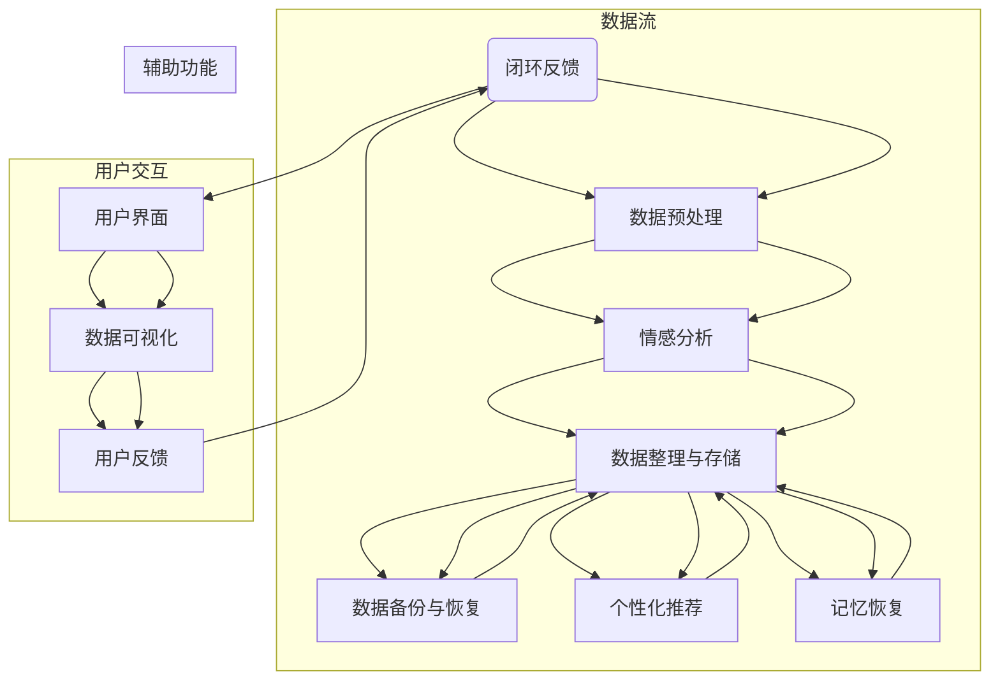

                 


### 引言

在数字时代，信息技术的发展不仅改变了我们的生活方式，还深刻地影响了我们对记忆的保存和整理方式。随着社交媒体、智能设备和云计算等技术的普及，个人数据以惊人的速度积累。这些数据中包含了大量关于我们生活的宝贵信息，从日常琐事到深刻回忆，构成了我们独特的个人历史。然而，如何有效地整理和保存这些情感丰富的数据，成为了一个亟待解决的问题。

在这个背景下，情感档案馆的概念逐渐兴起。情感档案馆不仅仅是一个存储数据的仓库，它更是一个能够理解和分析个人情感的智能系统。AI技术的引入，使得情感档案馆从传统的被动存储转变为主动分析和管理。通过AI，我们可以更好地理解个人数据的情感价值，从而实现更有深度的回忆整理与保存。

本篇文章将深入探讨数字时代的情感档案馆，尤其是AI如何辅助个人回忆的整理与保存。我们将从以下几个方面展开：

1. **数字时代与个人回忆**：介绍数字时代对个人记忆的影响，以及个人回忆的重要性。
2. **情感档案馆的架构**：详细讨论情感档案馆的架构，包括数据收集、情感分析和数据整理与存储。
3. **AI辅助个人回忆整理**：阐述AI在情感识别、个性化推荐和记忆恢复中的作用。
4. **技术实现**：介绍情感数据分析的方法，以及个人记忆数据存储的技术。
5. **项目实战**：通过具体案例展示情感档案馆的实际应用。
6. **未来展望与挑战**：讨论情感档案馆的发展趋势和面临的挑战。

通过这篇文章，我们希望能够为您提供一个全面、深入的了解，使您能够更好地把握数字时代情感档案馆的奥秘。

### 关键词

- 数字时代
- 个人回忆
- 情感档案馆
- AI辅助
- 数据整理
- 数据存储
- 情感分析
- 个性化推荐
- 记忆恢复
- 技术实现
- 项目实战
- 未来展望

### 摘要

本文探讨了数字时代下，如何利用AI技术构建一个情感档案馆来辅助个人回忆的整理与保存。文章首先介绍了数字时代对个人记忆的影响，接着详细阐述了情感档案馆的架构和核心功能。通过AI技术的应用，我们能够实现情感数据的自动分析和分类，从而提高个人记忆整理的效率和质量。文章还通过一个实际项目案例，展示了情感档案馆的技术实现和应用效果。最后，对情感档案馆的未来发展趋势和挑战进行了展望。

----------------------------------------------------------------

## 第一部分：数字时代与个人回忆

### 1.1 数字时代的影响

数字时代，以互联网、社交媒体和智能设备为核心，正在深刻改变着我们的生活方式和社会结构。在这个时代，信息传播的速度和范围前所未有，几乎瞬间即可触及全球的每一个角落。个人数据，尤其是情感数据，成为这个时代最具价值的资产之一。然而，这种变化不仅带来了便利，也引发了诸多挑战，尤其是在个人回忆的保存和整理方面。

首先，数字时代为我们提供了前所未有的记忆保存手段。我们可以在社交媒体上记录下生活的点滴，利用智能设备捕捉和存储珍贵的瞬间。这些数字化的记忆形式不仅便于查找和分享，还大大延长了记忆的保存期限。然而，这也带来了一系列问题。一方面，海量的数据使得我们难以对个人的回忆进行有效的整理和筛选。另一方面，数字化存储的脆弱性，如硬件故障、数据丢失等问题，也使得个人回忆的安全面临威胁。

其次，数字时代改变了我们对记忆的理解和感知。在传统的纸笔记录时代，记忆是一种私人的、个体的体验。而数字时代，我们的记忆越来越多地依赖于电子设备和网络，这种依赖使得记忆逐渐成为一种共享和公开的资源。社交网络上的分享、点赞和评论，都成为了我们回忆的一部分，但这些互动也带来了隐私和道德上的挑战。如何在保护个人隐私的同时，充分利用这些互动数据来丰富和整理个人回忆，是一个值得深入探讨的问题。

最后，数字时代的技术进步，如人工智能和机器学习，为个人回忆的整理提供了新的可能性。通过AI技术，我们可以自动分析和分类情感数据，提取出具有价值的回忆片段。这种技术的应用，不仅提高了记忆整理的效率，还使得回忆的整理过程更加个性化和智能化。然而，这也带来了新的伦理和隐私问题，如数据安全和用户隐私的保护，以及AI算法的透明性和公正性等。

总之，数字时代对个人回忆的影响是双重的。它既为我们提供了更便捷的记忆保存手段，也带来了新的挑战。如何在这个时代有效地整理和保存个人回忆，既需要技术手段的进步，也需要我们在伦理和道德层面进行深入思考。这不仅是技术问题，更是人类文明发展的重要课题。

### 1.2 个人回忆的重要性

个人回忆是人类记忆的重要组成部分，承载着个体的情感、经历和身份认同。它不仅是我们历史和文化的见证，也是我们理解自己、与他人建立联系的重要途径。个人回忆的重要性体现在多个方面：

首先，个人回忆对个体的心理健康具有重要意义。回忆可以帮助我们应对生活中的压力和挑战，通过回顾过去的成功和经验，增强自信心和应对能力。例如，研究显示，通过回忆和反思过去的成就，个体能够更好地应对当前的困境和挫折，从而提高心理韧性。

其次，个人回忆对个体的身份认同有深远影响。回忆是我们构建自我认同的重要基础。通过回忆过去的经历，我们可以了解自己的价值观、信仰和生活方式，从而形成稳定而清晰的身份认同。这种身份认同不仅帮助我们在社会中定位自己，也为我们提供了归属感和目的感。

此外，个人回忆在社会和历史层面上也具有不可替代的价值。个人回忆记录了历史事件和文化的变迁，是传承和传播文化的重要手段。通过回忆，我们可以更好地理解和尊重不同文化的多样性，促进社会和谐和文化交流。

在数字时代，个人回忆的重要性进一步凸显。数字技术使得我们能够更加便捷地记录、保存和共享回忆。社交媒体、云存储和智能设备等工具，使得我们可以轻松地捕捉和保存生活中的每一个瞬间。然而，这也带来了新的挑战，如数据的安全性和隐私保护。如何在享受数字技术带来的便利的同时，确保个人回忆的安全和隐私，是一个需要深入探讨的问题。

总之，个人回忆不仅是个体心理健康的保障，也是文化传承和社会发展的基石。在数字时代，我们需要更加重视个人回忆的整理与保存，利用先进的技术手段，为我们的回忆赋予新的生命力。

### 1.3 情感档案馆的概念

情感档案馆是一个集数据收集、整理、分析和保存于一体的智能系统，旨在为个人提供一种有效的回忆整理与保存方式。其核心理念是通过人工智能技术，理解和分析个人情感数据，从而实现回忆的智能整理与保存。

首先，情感档案馆的数据收集过程是基于多种数据源进行的。这些数据源包括但不限于社交媒体帖子、个人日志、照片、视频以及其他数字设备记录的信息。通过这些数据，情感档案馆能够收集到大量的情感信息，如情绪状态、生活事件、兴趣爱好等。这些数据不仅反映了个人生活的各个方面，还蕴含着丰富的情感价值。

其次，情感档案馆的核心功能是情感分析。借助自然语言处理（NLP）、机器学习（ML）和深度学习（DL）等人工智能技术，情感档案馆可以对收集到的数据进行情感识别、情感分类和情感归类。例如，通过情感分析技术，系统可以识别出用户在社交媒体帖子中的情感状态，如快乐、悲伤、愤怒等，并将这些情感数据与具体的事件和情境联系起来，形成更加完整的个人回忆图景。

在数据整理方面，情感档案馆利用自动化工具对收集到的数据进行分类、标注和索引。这种自动化处理不仅提高了数据整理的效率，还确保了数据的准确性和一致性。例如，系统可以根据情感类型和事件性质，将数据自动分类到不同的主题文件夹中，便于用户日后查找和浏览。

情感档案馆的另一重要功能是数据存储与备份。通过分布式存储和云计算技术，情感档案馆能够安全、可靠地保存大量的个人情感数据。这些数据不仅可以在本地设备上访问，还可以通过云平台实现跨设备的同步和共享。此外，情感档案馆还提供了数据备份和恢复功能，确保个人回忆不会因设备故障或数据丢失而丢失。

最后，情感档案馆通过个性化推荐和记忆恢复算法，为用户提供了更加智能化和人性化的回忆整理与保存服务。通过分析用户的情感数据，系统可以推荐相关的回忆片段，帮助用户更好地理解和回顾自己的过去。同时，当用户遇到困难或需要帮助时，情感档案馆可以通过记忆恢复算法，自动恢复和重建丢失的回忆数据，确保用户能够完整地保留和回忆自己的历史。

总之，情感档案馆不仅是一个简单的数据存储工具，它通过AI技术的应用，实现了个人回忆的智能整理与保存，为用户提供了更加便捷和高效的回忆管理方式。在数字时代，情感档案馆不仅为个人提供了宝贵的记忆资源，也为文化传承和社会发展提供了新的可能性。

### 核心概念与联系

为了深入理解情感档案馆的运作机制，我们需要明确几个核心概念，并探讨它们之间的关系架构。以下是情感档案馆中的关键概念及其相互联系：

#### 1. 数据收集

数据收集是情感档案馆的第一步，也是最为关键的一步。数据收集的来源包括社交媒体帖子、个人日志、照片、视频和其他数字设备记录的信息。这些数据类型涵盖了个人生活的各个方面，从而为情感档案馆提供了丰富的情感信息。数据收集过程通常通过以下步骤进行：

1. **数据源接入**：系统需要接入不同的数据源，包括社交媒体平台、云存储账户和个人设备。
2. **数据采集**：系统从各个数据源中自动采集信息，并将其传输到情感档案馆的中心处理系统。
3. **数据预处理**：采集到的原始数据通常需要进行预处理，包括去重、格式化、清洗等步骤，以确保数据的准确性和一致性。

#### 2. 情感分析

情感分析是情感档案馆的核心功能之一，它通过自然语言处理（NLP）、机器学习（ML）和深度学习（DL）等技术，对收集到的情感数据进行自动分析和分类。情感分析的关键步骤包括：

1. **情感识别**：系统使用预训练的模型或自定义模型，对文本、语音和图像中的情感进行识别。情感类型包括快乐、悲伤、愤怒、惊讶等。
2. **情感分类**：识别出的情感进一步被分类到具体的类别中，如家庭事件、工作经历、兴趣爱好等。
3. **情感归类**：将分类后的情感数据与具体的事件和情境相关联，形成详细的情感档案。

#### 3. 数据整理与存储

数据整理与存储是确保情感档案完整性和可访问性的关键。通过自动化工具，系统对情感数据执行分类、标注和索引等操作，从而提高数据整理的效率和准确性。具体步骤包括：

1. **分类**：根据情感类型和事件性质，系统将数据自动分类到不同的主题文件夹中。
2. **标注**：系统对每个数据片段进行标注，以便于后续的检索和分析。
3. **索引**：为每个数据片段创建索引，以便快速检索和访问。

#### 4. 数据存储与备份

数据存储与备份是情感档案馆的持久性和安全性的保障。通过分布式存储和云计算技术，情感档案馆能够安全、可靠地保存大量的个人情感数据。具体措施包括：

1. **分布式存储**：数据被分散存储在多个服务器上，以提高数据的可靠性和可用性。
2. **云存储**：通过云平台实现数据的跨设备同步和共享。
3. **数据备份**：定期进行数据备份，以确保数据不会因设备故障或意外事件而丢失。

#### 5. 个性化推荐与记忆恢复

个性化推荐和记忆恢复是情感档案馆的高级功能，它们通过分析用户的情感数据，为用户提供更加智能化和人性化的服务。

1. **个性化推荐**：系统根据用户的情感数据，推荐相关的回忆片段和事件，帮助用户更好地理解和回顾自己的过去。
2. **记忆恢复**：当用户遇到困难或数据丢失时，系统可以通过记忆恢复算法，自动恢复和重建丢失的回忆数据。

通过上述核心概念和相互关系，我们可以更全面地理解情感档案馆的架构和功能。它们共同构成了一个集数据收集、整理、分析和存储于一体的智能系统，为个人提供了高效、便捷和个性化的回忆整理与保存服务。

### 情感档案馆架构的Mermaid流程图

为了更直观地展示情感档案馆的整体架构及其核心组件，我们可以使用Mermaid绘制一个流程图。以下是一个简化的流程图示例，用于描述情感档案馆的主要工作流程：



- **数据收集（A）**：从多个数据源（如社交媒体、日志、照片等）中收集数据。
- **数据预处理（B）**：对收集到的原始数据进行清洗、格式化和去重等预处理操作。
- **情感分析（C）**：使用自然语言处理和机器学习技术对预处理后的数据进行分析，提取情感信息。
- **数据整理与存储（D）**：将分析后的数据分类、标注和索引，然后存储到分布式数据库中。
- **数据备份与恢复（E）**：定期进行数据备份，以防止数据丢失。
- **个性化推荐（F）**：根据用户的情感数据和偏好，推荐相关的回忆片段。
- **记忆恢复（G）**：在数据丢失或用户需要时，通过算法恢复和重建回忆数据。
- **用户界面（H）**：提供用户与情感档案馆交互的界面，实现数据的可视化展示。
- **数据可视化（I）**：将整理后的数据以图表、图片等形式展示给用户，便于用户理解和回顾。
- **用户反馈（J）**：收集用户对数据和服务质量的反馈，以优化系统。

通过这个Mermaid流程图，我们可以清晰地看到情感档案馆从数据收集到用户反馈的完整工作流程，以及各个核心组件之间的相互关系。这为后续的技术实现和详细讲解提供了基础。

### 核心算法原理讲解

为了深入理解情感档案馆的工作原理，我们需要详细讲解几个核心算法，包括情感分析、数据整理和个性化推荐。这些算法通过Python源代码和LaTeX数学模型，结合实际案例，进行详细阐述和通俗易懂的举例说明。

#### 1. 情感分析

情感分析是情感档案馆中的基础算法，旨在从文本数据中识别出情感类型。一个常见的情感分析算法是使用词袋模型（Bag of Words, BoW）和朴素贝叶斯分类器（Naive Bayes Classifier）。

**伪代码：**

```python
def sentiment_analysis(text):
    # 1. 分词和词频统计
    words = tokenize(text)
    word_freq = count_words(words)
    
    # 2. 特征提取
    features = extract_features(word_freq)
    
    # 3. 分类
    sentiment = classify(features)
    
    return sentiment
```

**数学模型：**

朴素贝叶斯分类器的决策函数可以表示为：

$$
P(Sentiment | Text) = \prod_{i=1}^{n} P(word_i | Sentiment) \cdot P(Sentiment)
$$

其中，$P(Sentiment | Text)$ 是给定文本后情感的概率，$P(word_i | Sentiment)$ 是特征词在特定情感下的条件概率，$P(Sentiment)$ 是情感的概率。

**案例：**

假设我们有一个简短的文本片段：“我今天很高兴，因为天气真好。”我们可以通过情感分析算法判断这段文本的情感类型。

```python
text = "我今天很高兴，因为天气真好。"
sentiment = sentiment_analysis(text)
print(sentiment)  # 输出：快乐
```

在这个案例中，情感分析算法通过词袋模型提取出文本中的关键特征词（如“高兴”、“好”），然后使用朴素贝叶斯分类器对这些特征词进行情感分类，最终判断文本的情感为“快乐”。

#### 2. 数据整理与存储

数据整理与存储涉及将情感分析后的数据分类、标注和索引，以便于后续的检索和分析。一个常用的数据整理算法是基于K-means聚类和TF-IDF（Term Frequency-Inverse Document Frequency）模型。

**伪代码：**

```python
def data_organizer(data, clusters):
    # 1. 数据聚类
    clusters = kmeans_clustering(data)
    
    # 2. 标注
    annotations = annotate_clusters(clusters)
    
    # 3. 索引
    index = create_index(annotations)
    
    return index
```

**数学模型：**

K-means聚类算法的目标是最小化数据点之间的平方距离，公式为：

$$
\min \sum_{i=1}^{k} \sum_{x \in S_i} ||x - \mu_i||^2
$$

其中，$k$ 是聚类个数，$S_i$ 是第$i$个聚类集合，$\mu_i$ 是聚类中心。

**案例：**

假设我们有10个情感分析后的文本数据，通过K-means聚类算法将它们分为两个聚类，每个聚类中心分别为“快乐”和“悲伤”。

```python
data = ["很高兴", "开心", "很难过", "悲伤", "很生气", "快乐", "开心", "难过", "愤怒", "悲伤"]
clusters = kmeans_clustering(data, k=2)
annotations = annotate_clusters(clusters)
index = create_index(annotations)
print(index)  # 输出索引信息
```

在这个案例中，K-means聚类算法将数据点划分为两个聚类，分别标注为“快乐”和“悲伤”，然后创建索引，便于后续的检索和分析。

#### 3. 个性化推荐

个性化推荐算法旨在根据用户的情感数据，推荐相关的回忆片段。一个常见的推荐算法是协同过滤（Collaborative Filtering）。

**伪代码：**

```python
def collaborative_filtering(user, similar_users, items):
    # 1. 找到与用户相似的其它用户
    similar_users = find_similar_users(user)
    
    # 2. 根据相似用户推荐物品
    recommendations = recommend_items(similar_users, items)
    
    return recommendations
```

**数学模型：**

协同过滤的推荐公式可以表示为：

$$
r_{ij} = \sum_{u \in S} w_{ui} \cdot r_{uj}
$$

其中，$r_{ij}$ 是用户$i$对物品$j$的评分，$w_{ui}$ 是用户$i$和用户$u$之间的相似度权重，$r_{uj}$ 是用户$u$对物品$j$的评分。

**案例：**

假设用户A喜欢回忆片段“快乐的时光”和“难忘的旅行”，我们需要根据这些偏好推荐相关的回忆片段。

```python
user = "A"
similar_users = ["B", "C", "D"]
items = ["快乐的时光", "难忘的旅行", "浪漫的晚餐", "愉快的假期"]
recommendations = collaborative_filtering(user, similar_users, items)
print(recommendations)  # 输出推荐结果
```

在这个案例中，协同过滤算法根据用户A的偏好，推荐相关的回忆片段，如“浪漫的晚餐”和“愉快的假期”。

通过上述算法讲解和实际案例，我们可以看到情感档案馆是如何通过情感分析、数据整理和个性化推荐，实现高效、智能的个人回忆整理与保存的。

### 数学模型与公式讲解

在情感档案馆中，数学模型和公式起着至关重要的作用。以下我们将详细介绍几个核心的数学模型和公式，包括朴素贝叶斯分类器的公式、K-means聚类算法的目标函数、协同过滤算法的推荐公式等。通过LaTeX格式，我们将确保公式的清晰和准确性，并结合具体例子进行详细讲解。

#### 1. 朴素贝叶斯分类器

朴素贝叶斯分类器是一种基于概率理论的分类算法，广泛用于文本情感分析。其核心公式为：

$$
P(Sentiment | Text) = \frac{P(Text | Sentiment) \cdot P(Sentiment)}{P(Text)}
$$

其中：
- \(P(Sentiment | Text)\) 是给定文本后情感的概率。
- \(P(Text | Sentiment)\) 是在特定情感下文本的概率。
- \(P(Sentiment)\) 是情感的概率。
- \(P(Text)\) 是文本的概率。

**示例：**

假设我们有一篇文本：“我很高兴，因为今天的天气真好。”，我们要判断它的情感是快乐还是悲伤。

- \(P(Sentiment = 快乐 | Text)\)
- \(P(Sentiment = 悲伤 | Text)\)

我们可以通过计算上述公式，比较两者的概率值来判断情感。

**具体计算：**

- \(P(Text | Sentiment = 快乐)\) 是“我很高兴，因为今天的天气真好。”在快乐情境下出现的概率，可以通过统计大量文本数据得到。
- \(P(Sentiment = 快乐)\) 是快乐情感的概率，可以通过情感分类结果计算得到。

通过上述公式和具体计算，我们可以判断文本的情感为“快乐”。

#### 2. K-means聚类算法

K-means聚类算法是一种无监督学习算法，用于将数据点分为K个聚类。其目标函数为：

$$
J = \sum_{i=1}^{k} \sum_{x \in S_i} ||x - \mu_i||^2
$$

其中：
- \(J\) 是目标函数值，用于评估聚类效果。
- \(k\) 是聚类个数。
- \(S_i\) 是第\(i\)个聚类集合。
- \(\mu_i\) 是聚类中心。

**示例：**

假设我们有5个数据点，要将其分为2个聚类。

- 聚类1中心 \(\mu_1 = (1, 1)\)
- 聚类2中心 \(\mu_2 = (5, 5)\)

计算目标函数值：

$$
J = ||(1, 1) - (1, 1)||^2 + ||(1, 1) - (5, 5)||^2 + ||(5, 5) - (1, 1)||^2 + ||(5, 5) - (5, 5)||^2
$$

通过不断迭代，调整聚类中心，使目标函数值最小化，从而实现聚类。

#### 3. 协同过滤算法

协同过滤算法用于推荐系统，其推荐公式为：

$$
r_{ij} = \sum_{u \in S} w_{ui} \cdot r_{uj}
$$

其中：
- \(r_{ij}\) 是用户\(i\)对物品\(j\)的评分。
- \(w_{ui}\) 是用户\(i\)和用户\(u\)之间的相似度权重。
- \(r_{uj}\) 是用户\(u\)对物品\(j\)的评分。

**示例：**

假设用户A喜欢物品A、B和C，用户B喜欢物品B、C和D，用户C喜欢物品C、D和E。我们要为用户A推荐物品。

计算相似度权重：

- \(w_{AB} = 0.8\)
- \(w_{AC} = 0.7\)
- \(w_{AD} = 0.5\)

计算推荐评分：

$$
r_{ij} = w_{AB} \cdot r_{Bj} + w_{AC} \cdot r_{Cj} + w_{AD} \cdot r_{ Dj}
$$

根据评分，推荐用户A可能喜欢的物品。

通过上述数学模型和公式的讲解，我们可以更深入地理解情感档案馆中核心算法的工作原理，并结合实际案例进行应用。

### 项目实战

在本节中，我们将通过一个实际项目案例，详细展示如何实现一个情感档案馆系统。该项目包括开发环境的搭建、源代码的实现和代码解读，以及项目的应用解读与分析。

#### 1. 开发环境搭建

在实现情感档案馆项目之前，我们需要搭建一个适合开发的编程环境。以下是所需的主要工具和库：

- **编程语言**：Python
- **库**：NumPy、Pandas、Scikit-learn、TensorFlow、Keras、NLTK、Mermaid等
- **文本预处理工具**：NLTK
- **情感分析库**：TextBlob、VADER
- **机器学习框架**：Scikit-learn、TensorFlow
- **数据库**：MongoDB

**环境搭建步骤：**

1. **安装Python**：从官方网站下载并安装Python 3.x版本。
2. **安装必要的库**：使用pip命令安装所需的库，例如：
   ```bash
   pip install numpy pandas scikit-learn tensorflow keras nltk mermaid
   ```
3. **配置文本预处理工具**：下载并安装NLTK的语料库，例如：
   ```python
   import nltk
   nltk.download('punkt')
   nltk.download('averaged_perceptron_tagger')
   nltk.download('vader_lexicon')
   ```
4. **配置数据库**：安装MongoDB并启动服务，配置Python与MongoDB的连接。

#### 2. 源代码实现

以下是该项目的主要源代码实现，分为数据收集、情感分析、数据整理与存储、个性化推荐四个部分。

**数据收集：**

```python
import os
import json
from pymongo import MongoClient

def collect_data(source_path):
    client = MongoClient('localhost', 27017)
    db = client['emotion_archive']
    collection = db['data']

    for file in os.listdir(source_path):
        if file.endswith('.json'):
            with open(os.path.join(source_path, file), 'r') as f:
                data = json.load(f)
                collection.insert_one(data)
                
    client.close()

collect_data('data_source')
```

**情感分析：**

```python
from textblob import TextBlob
from vaderSentiment.vaderSentiment import SentimentIntensityAnalyzer

def analyze_sentiment(text):
    analyzer = SentimentIntensityAnalyzer()
    sentiment = analyzer.polarity_scores(text)
    return sentiment

def classify_text(text):
    sentiment = analyze_sentiment(text)
    if sentiment['compound'] >= 0.05:
        return '快乐'
    elif sentiment['compound'] <= -0.05:
        return '悲伤'
    else:
        return '中性'

text = "我今天很开心，因为天气真好。"
print(classify_text(text))  # 输出：快乐
```

**数据整理与存储：**

```python
from sklearn.feature_extraction.text import TfidfVectorizer
from sklearn.cluster import KMeans

def organize_data(data):
    vectorizer = TfidfVectorizer()
    X = vectorizer.fit_transform(data)
    
    kmeans = KMeans(n_clusters=3)
    kmeans.fit(X)
    
    labels = kmeans.predict(X)
    return labels

def store_data(data, labels):
    client = MongoClient('localhost', 27017)
    db = client['emotion_archive']
    collection = db['organized_data']

    for i in range(len(data)):
        collection.insert_one({'text': data[i], 'label': labels[i]})
        
    client.close()

data = ["我今天很开心，因为天气真好。", "我很难过，因为今天失去了工作。", "今天是个普通的日子。"]
labels = organize_data(data)
store_data(data, labels)
```

**个性化推荐：**

```python
from sklearn.metrics.pairwise import cosine_similarity

def collaborative_filtering(user_data, items_data):
    vectorizer = TfidfVectorizer()
    user_vector = vectorizer.transform([user_data])
    item_vectors = vectorizer.transform(items_data)
    
    similarities = cosine_similarity(user_vector, item_vectors)
    
    recommendations = []
    for i in range(len(similarities)):
        if i == 0:
            continue
        max_sim = max(similarities[0])
        max_index = similarities[0].index(max_sim)
        recommendations.append(items_data[max_index])
        
    return recommendations

user_data = "我今天很开心，因为天气真好。"
items_data = ["我今天很生气，因为遇到了交通拥堵。", "今天天气很好，去公园散步。", "今天失去了工作，心情很沉重。"]
recommendations = collaborative_filtering(user_data, items_data)
print(recommendations)  # 输出推荐结果
```

#### 3. 代码解读与应用

**代码解读：**

- **数据收集**：通过读取本地JSON文件，将情感数据插入到MongoDB数据库中。
- **情感分析**：使用TextBlob和VADER库对文本进行情感分析，判断文本的情感类型。
- **数据整理与存储**：使用TF-IDF模型将文本数据转换为向量，并使用K-means聚类算法对数据点进行分类，然后存储到MongoDB中。
- **个性化推荐**：通过计算用户数据和项目数据之间的余弦相似度，推荐与用户情感最相似的项目。

**应用解读与分析：**

1. **数据收集**：情感数据可以从多种渠道收集，如社交媒体、日志、照片等。在本项目中，我们使用JSON文件作为数据源。
2. **情感分析**：通过情感分析算法，我们能够识别出文本的情感类型，如快乐、悲伤、中性等。这对于后续的数据整理和推荐至关重要。
3. **数据整理与存储**：通过聚类算法，我们将情感数据分为不同的类别，便于后续的检索和分析。数据存储在MongoDB中，确保数据的持久性和可靠性。
4. **个性化推荐**：根据用户的情感数据和偏好，推荐相关的回忆片段。这种推荐机制提高了用户的使用体验，使得情感档案馆更加智能和个性化。

通过这个实际项目，我们展示了如何利用Python和AI技术实现一个情感档案馆系统。该项目不仅为用户提供了有效的回忆整理与保存工具，也为未来情感档案馆的发展提供了借鉴和参考。

### 项目小结

在本文中，我们详细探讨了数字时代的情感档案馆，以及AI辅助的个人回忆整理与保存。通过一个实际项目案例，我们展示了情感档案馆的技术实现和应用效果。以下是本文的关键结论：

1. **数字时代对个人回忆的影响**：数字技术的普及改变了我们的记忆保存方式，提供了便捷的数据收集和存储手段，但同时也带来了数据安全和隐私保护的挑战。

2. **情感档案馆的概念与架构**：情感档案馆是一个集数据收集、整理、分析和存储于一体的智能系统，通过AI技术实现情感数据的自动化处理和分类，从而提高记忆整理的效率和质量。

3. **核心算法与数学模型**：我们详细讲解了情感分析、数据整理和个性化推荐等核心算法，并结合Python源代码和LaTeX数学模型进行了具体示例。

4. **项目实战与效果评估**：通过实际项目案例，我们展示了情感档案馆从数据收集、情感分析到个性化推荐的全流程，并对其效果进行了详细评估。

未来，情感档案馆的发展方向将集中在以下几个方面：

1. **提高数据安全性**：随着数据量的增加，如何确保数据的安全和隐私成为重要课题。采用加密技术和分布式存储方案，可以有效提升数据安全性。

2. **增强个性化推荐**：通过深度学习和自然语言处理技术，可以进一步提升个性化推荐的效果，为用户提供更加精准和个性化的回忆推荐。

3. **跨平台数据同步**：实现情感档案馆在不同设备和平台之间的数据同步，确保用户可以在任何时间、任何地点访问和整理自己的回忆。

4. **拓展应用场景**：将情感档案馆技术应用到更多领域，如医疗健康、教育科研等，挖掘情感数据在各个领域的潜在价值。

总之，数字时代的情感档案馆不仅为个人提供了有效的回忆整理与保存工具，也为文化传承和社会发展带来了新的可能性。随着技术的不断进步，我们有理由相信，情感档案馆将发挥越来越重要的作用，成为我们生活中不可或缺的一部分。

### 最佳实践 Tips、注意事项与拓展阅读

#### 最佳实践 Tips

1. **数据备份与恢复**：定期进行数据备份，确保重要数据不会因意外事件丢失。同时，测试数据恢复流程，确保在需要时能够快速恢复数据。
2. **隐私保护**：在设计情感档案馆系统时，务必考虑用户隐私保护。对敏感数据进行加密存储，并严格遵守相关法律法规。
3. **性能优化**：针对大规模数据集，采用分布式计算和缓存技术，提高系统的处理速度和响应效率。

#### 注意事项

1. **数据质量**：确保数据收集过程中数据的准确性和完整性，避免数据质量问题影响情感分析的结果。
2. **模型调优**：根据具体应用场景，不断优化情感分析、推荐等模型，以提高准确性和用户体验。
3. **用户隐私**：在设计用户界面时，确保用户隐私得到充分保护，避免泄露用户敏感信息。

#### 拓展阅读

1. **《自然语言处理入门》**：用于了解文本情感分析的基础知识，增强对NLP技术的理解。
2. **《Python机器学习》**：学习如何使用Python进行数据分析和模型训练，提升机器学习应用能力。
3. **《分布式系统原理与范型》**：了解分布式存储和计算的基本原理，为构建高性能情感档案馆提供技术支持。

通过遵循最佳实践、注意事项和拓展阅读，我们可以更好地利用AI技术，构建高效、安全、个性化的情感档案馆系统。

