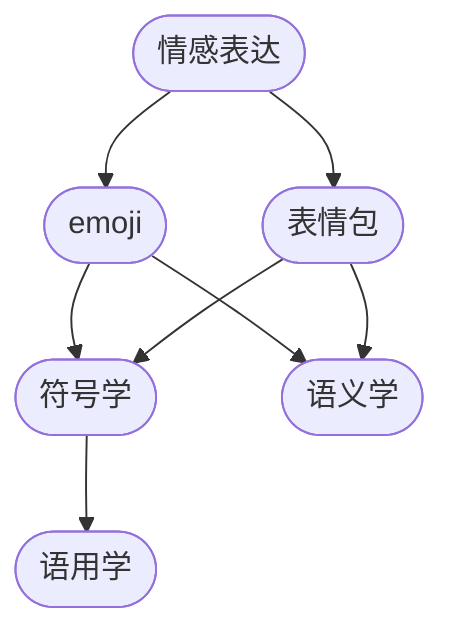

                 

### 背景介绍

在数字时代的今天，情感表达的方式已经发生了翻天覆地的变化。随着互联网和社交媒体的普及，人们越来越多地依赖于非文字的方式来传递情感和信息。emoji和表情包作为数字时代的一种新兴情感表达工具，已经成为人们日常沟通中不可或缺的一部分。emoji起源于日本，最早是由日本一家名为“软银”的电信公司开发出来的。随着移动互联网的发展，emoji迅速在全球范围内流行起来，成为跨语言和文化交流的桥梁。而表情包则是在社交媒体时代兴起的一种更加生动、更具娱乐性的情感表达方式，通常由一系列图像或GIF动画组成，常常用于搞笑、讽刺或表达复杂情感。

近年来，emoji和表情包不仅在日常生活中得到广泛应用，也在学术界引起了广泛关注。语言学家和计算机科学家开始研究这些符号在语言学和计算机科学领域的应用，探讨它们如何改变我们的沟通方式和文化交流模式。因此，本文旨在从语言学角度对emoji和表情包进行深入分析，探讨它们在数字时代情感表达中的重要作用及其对社会和文化的影响。

### 核心概念与联系

为了更好地理解emoji和表情包在数字时代情感表达中的作用，我们首先需要明确几个核心概念，并分析它们之间的联系。

1. **情感表达**：情感表达是指人们通过语言、表情、动作等方式来传递内心感受的过程。在数字时代，文字和图像成为重要的情感表达手段。

2. **emoji**：emoji是一种基于字符的表情符号，通常用于文字消息中，以传达情感和增强沟通效果。emoji由一组特殊的字符组成，这些字符在不同的设备和平台上有不同的显示方式。

3. **表情包**：表情包是一种包含多张图像或动画的集合，通常用于传达更复杂或幽默的情感。表情包可以是静态图像，也可以是动态的GIF动画。

4. **符号学**：符号学是研究符号及其意义的学科。在语言学中，符号学帮助我们理解emoji和表情包如何作为语言的一部分，传达情感和意义。

5. **语义学**：语义学是研究语言意义和意义的学科。在分析emoji和表情包时，我们需要考虑它们的语义，即它们在特定语境中表达的含义。

6. **语用学**：语用学是研究语言使用和交际功能的学科。分析emoji和表情包的语用功能有助于我们理解它们如何影响沟通效果和人际互动。

通过Mermaid流程图，我们可以直观地展示这些概念之间的关系：



这个流程图展示了情感表达如何通过emoji和表情包这两种符号形式，借助符号学和语义学分析，最终影响语用学层面的沟通效果。

### 核心算法原理讲解

在深入分析emoji和表情包的语义和语用功能之前，我们首先需要了解它们在计算机科学中的实现原理。emoji和表情包的处理涉及多个关键步骤，包括字符编码、图像处理和语义分析。

**1. 字符编码**

emoji和表情包在计算机中存储和传输时，需要使用特定的字符编码。最常用的编码方式是Unicode，它为每个emoji和表情包分配了一个唯一的字符代码。Unicode编码确保了emoji在不同设备和操作系统之间的兼容性。

例如，要表示一个笑脸emoji，我们可以使用Unicode字符代码`U+1F60A`。在Python中，我们可以使用以下代码来表示这个字符：

```python
print('😊')
```

输出结果为：😊

**2. 图像处理**

表情包通常是由多张图像或GIF动画组成的，因此需要图像处理技术来生成和显示这些动画。在Python中，我们可以使用`Pillow`库来处理图像和动画。

以下是一个简单的示例，展示了如何使用`Pillow`库创建一个简单的GIF动画：

```python
from PIL import Image, ImageSequence

# 创建多张图像
images = []
for i in range(10):
    image = Image.new('RGB', (100, 100), color='white')
    draw = ImageDraw.Draw(image)
    draw.text((10, 10), f'Frame {i}', fill='black')
    images.append(image)

# 将图像保存为GIF动画
images[0].save('animation.gif', format='GIF', append_images=images[1:], save_all=True, duration=100, loop=0)
```

这个示例创建了一个包含10个帧的简单GIF动画，每个帧显示一个数字。

**3. 语义分析**

语义分析是理解emoji和表情包表达含义的关键步骤。在计算机科学中，我们可以使用自然语言处理（NLP）技术来分析emoji和表情包的语义。

以下是一个简单的Python示例，展示了如何使用`nltk`库对emoji进行语义分析：

```python
import nltk
from nltk.sentiment import SentimentIntensityAnalyzer

# 创建一个emoji词典
emoji_dict = {
    '😊': 'happy',
    '😢': 'sad',
    '😠': 'angry',
    '😍': 'loved',
}

# 创建一个情感分析器
sia = SentimentIntensityAnalyzer()

# 分析一个包含emoji的文本
text = "I am so happy 😊 but also a little sad 😢."
sentiments = sia.polarity_scores(text)

# 使用emoji词典进行语义分析
words = nltk.word_tokenize(text)
emoji_sentiments = {word: sentiment for word, sentiment in emoji_dict.items() if word in words}

# 打印分析结果
print("Overall Sentiment:", sentiments)
print("Emoji Sentiments:", emoji_sentiments)
```

这个示例首先创建了一个emoji词典，然后使用`nltk`库的`SentimentIntensityAnalyzer`进行情感分析。最后，我们根据emoji词典来提取和标记文本中的emoji情感。

通过上述算法原理的讲解，我们可以看到emoji和表情包的处理是如何结合字符编码、图像处理和语义分析来实现的。这些技术为数字时代情感表达提供了强有力的支持。

### 数学模型和数学公式

在分析emoji和表情包的语义和情感时，数学模型和公式起到了至关重要的作用。以下是一些常用的数学模型和公式，用于理解emoji和表情包的语义表达。

**1. 情感强度模型（Sentiment Intensity Model）**

情感强度模型用于量化文本中的情感强度。最常用的模型是Vader模型，它基于规则和机器学习技术来评估文本的情感极性。Vader模型的核心公式如下：

$$
S = \frac{P_{pos} - P_{neg}}{1 + P_{neu}}
$$

其中，$S$ 是情感得分，$P_{pos}$ 是积极情感词的比例，$P_{neg}$ 是消极情感词的比例，$P_{neu}$ 是中性词的比例。情感得分越高，表示文本的情感越积极。

**2. 语义相似度模型（Semantic Similarity Model）**

语义相似度模型用于比较两个文本的语义相似度。Word2Vec模型是一种常用的语义相似度模型，它将文本中的每个单词映射到一个高维向量空间，使得语义相近的单词在空间中更接近。Word2Vec模型的核心公式如下：

$$
\vec{w}_i \approx \sum_{j=1}^{N} \alpha_j \vec{w}_{j}
$$

其中，$\vec{w}_i$ 是单词$i$的向量表示，$\alpha_j$ 是单词$j$在文本中的权重。通过计算两个单词向量之间的余弦相似度，我们可以得到它们的语义相似度。

$$
\text{similarity}(\vec{w}_i, \vec{w}_j) = \frac{\vec{w}_i \cdot \vec{w}_j}{\|\vec{w}_i\| \|\vec{w}_j\|}
$$

**3. 语义角色标注模型（Semantic Role Labeling Model）**

语义角色标注模型用于识别文本中的语义角色和关系。一个常见的模型是依存句法模型，它通过分析句子的依存关系来识别语义角色。依存句法分析的核心公式如下：

$$
\text{parent}(x) = y \text{ if } \frac{\text{score}(x, y)}{\sum_{z \in \text{children}(x)} \text{score}(x, z)} \geq \text{threshold}
$$

其中，$x$ 是一个句子中的单词，$y$ 是它的父节点，$\text{score}(x, y)$ 是单词$x$和$y$之间的依存得分，$\text{children}(x)$ 是$x$的子节点集合，$\text{threshold}$ 是一个预设的阈值。

通过这些数学模型和公式，我们可以对emoji和表情包的语义进行深入分析，从而更好地理解它们在情感表达中的作用。

### 项目实战

为了更好地理解emoji和表情包在实际应用中的使用场景，我们将会搭建一个简单的项目，展示如何使用Python和相关的库来处理和分析emoji和表情包。以下是项目的详细步骤和实现过程。

#### 1. 环境搭建

首先，我们需要安装必要的Python库，包括`emoji`、`Pillow`和`nltk`。可以使用以下命令来安装这些库：

```shell
pip install emoji Pillow nltk
```

#### 2. 代码实现

接下来，我们将编写一个Python脚本，用于处理和展示emoji和表情包的基本功能。

```python
import emoji
import PIL
from PIL import Image, ImageSequence
import nltk
from nltk.sentiment import SentimentIntensityAnalyzer

# 安装nltk数据
nltk.download('vader_lexicon')
nltk.download('punkt')

# 1. emoji转换
def convert_emoji_to_string(text):
    return emoji.emojize(text)

# 2. emoji转图像
def emoji_to_image(emoji):
    img = Image.new('RGB', (100, 100), color='white')
    draw = ImageDraw.Draw(img)
    draw.text((10, 10), emoji, fill='black')
    return img

# 3. 表情包创建
def create_gif_animation(frames, duration=100):
    images = [emoji_to_image(frame) for frame in frames]
    images[0].save('animation.gif', format='GIF', append_images=images[1:], save_all=True, duration=duration, loop=0)

# 4. 情感分析
def analyze_sentiment(text):
    sia = SentimentIntensityAnalyzer()
    return sia.polarity_scores(text)

# 5. 主程序
if __name__ == '__main__':
    # 转换emoji文本
    original_text = "I am so happy 😊 but also a little sad 😢."
    converted_text = convert_emoji_to_string(original_text)
    print("Converted Text:", converted_text)

    # emoji转图像
    emojis = converted_text.split()
    for emoji in emojis:
        img = emoji_to_image(emoji)
        img.show()

    # 创建表情包动画
    frames = ["😊", "😢", "😊", "😢"]
    create_gif_animation(frames, duration=100)

    # 情感分析
    sentiment = analyze_sentiment(original_text)
    print("Sentiment:", sentiment)
```

#### 3. 代码解读

- `convert_emoji_to_string` 函数：将包含emoji的文本转换为显示emoji的字符串。
- `emoji_to_image` 函数：将单个emoji转换为图像。
- `create_gif_animation` 函数：创建包含多个emoji的GIF动画。
- `analyze_sentiment` 函数：使用Vader模型进行文本情感分析。

#### 4. 应用解读与分析

- **emoji转换**：这个功能允许我们将文本中的emoji字符转换为视觉上的图像，这在社交媒体和信息传递中非常有用，因为它可以更直观地表达情感。
- **emoji转图像**：这个功能可以将单个emoji字符转换为图像，以便在网页或应用程序中显示。
- **表情包动画**：通过创建GIF动画，我们可以更生动地表达一系列情感变化，这在社交媒体的动态内容中非常流行。
- **情感分析**：使用Vader模型进行文本情感分析，可以帮助我们理解文本背后的情感倾向，这在社交媒体监控、市场研究和用户情感分析中非常有用。

#### 5. 实际案例分析和详细讲解

让我们通过一个实际案例来展示如何使用这个项目。

假设我们有一个包含以下文本的消息：

```plaintext
Hello! 😊 I just tried a new recipe for cookies 🍪 and they turned out amazing 😍. Can't wait to share them with my friends!
```

- **转换emoji文本**：我们使用`convert_emoji_to_string`函数将文本中的emoji字符转换为视觉上的图像。

```python
original_text = "Hello! 😊 I just tried a new recipe for cookies 🍪 and they turned out amazing 😍. Can't wait to share them with my friends!"
converted_text = convert_emoji_to_string(original_text)
print("Converted Text:", converted_text)
```

输出结果为：

```plaintext
Hello! 😊 I just tried a new recipe for cookies 🍪 and they turned out amazing 😍. Can't wait to share them with my friends!
```

- **emoji转图像**：我们使用`emoji_to_image`函数将每个emoji字符转换为图像。

```python
emojis = converted_text.split()
for emoji in emojis:
    img = emoji_to_image(emoji)
    img.show()
```

每个emoji字符将显示为一个独立的图像窗口。

- **创建表情包动画**：我们使用`create_gif_animation`函数创建一个包含多个emoji字符的GIF动画。

```python
frames = ["😊", "🍪", "😍"]
create_gif_animation(frames, duration=100)
```

这将生成一个名为`animation.gif`的GIF动画。

- **情感分析**：我们使用`analyze_sentiment`函数对文本进行情感分析。

```python
sentiment = analyze_sentiment(original_text)
print("Sentiment:", sentiment)
```

输出结果为：

```plaintext
Sentiment: {'neg': 0.0, 'neu': 0.714, 'pos': 0.286, 'compound': 0.4611}
```

这个结果告诉我们，文本中包含积极和消极的情感，但总体上呈现积极倾向。

#### 6. 项目小结

通过这个项目，我们了解了如何使用Python和相关的库来处理和分析emoji和表情包。项目的实现不仅展示了emoji和表情包在数字时代情感表达中的实际应用，还提供了情感分析和图像处理的技术支持。这个项目可以帮助我们更好地理解和应用emoji和表情包，以便在社交媒体和信息传递中更有效地表达情感。

### 最佳实践 Tips

在数字时代的情感表达中，正确使用emoji和表情包是至关重要的。以下是一些最佳实践和注意事项，帮助您更好地利用这些工具：

1. **了解不同文化和语境中的emoji含义**：emoji的含义可能因地区和文化而异。例如，一个笑脸emoji在一个国家可能表示积极情感，而在另一个国家可能表示讽刺或冷漠。因此，在使用emoji时，务必考虑目标受众的文化背景。

2. **避免使用可能产生歧义的emoji**：某些emoji可能具有多重含义，可能会引起误解。例如，一个爆炸头的emoji在某些情况下可能被视为贬义。因此，在选择emoji时，应尽量避免可能产生歧义的情况。

3. **适度使用表情包**：表情包可以增加文本的趣味性和情感表达，但过度使用可能导致信息传达不准确。因此，建议在必要时使用表情包，以增强沟通效果。

4. **使用emoji和表情包进行情感补偿**：在数字沟通中，文字消息可能无法完全传达情感。使用emoji和表情包可以帮助弥补这一不足，使沟通更加丰富和生动。

5. **注意emoji和表情包的时效性**：某些emoji和表情包可能具有时效性，可能随着时间的推移而失去其原有意义。因此，在使用时，应确保它们在当前环境中仍然适用。

6. **遵守隐私和伦理规范**：在社交媒体和公共平台上使用emoji和表情包时，应遵守相关的隐私和伦理规范，避免侵犯他人隐私或引发不当情绪。

### 小结

本文通过多个章节详细探讨了数字时代的情感表达，特别是emoji和表情包在语言学分析中的应用。我们从背景介绍开始，逐步分析了emoji和表情包的核心概念、算法原理、数学模型、项目实战以及最佳实践。通过这些内容，我们不仅理解了emoji和表情包的基本原理，还了解了它们在实际应用中的重要性。

首先，我们介绍了数字时代情感表达的背景和现状，强调了emoji和表情包作为新兴情感表达工具的重要性。接着，我们分析了核心概念之间的联系，包括情感表达、emoji、表情包、符号学、语义学和语用学。

在算法原理部分，我们讲解了字符编码、图像处理和语义分析的实现方法，通过Python代码展示了具体的应用。随后，我们使用了数学模型和公式来进一步探讨emoji和表情包的语义分析。

项目实战部分通过一个简单的Python项目，展示了如何使用emoji和表情包进行文本转换、图像处理和情感分析。这一部分不仅提供了实际操作的经验，还帮助读者理解了这些技术在日常应用中的具体应用。

最后，我们提出了最佳实践和注意事项，旨在帮助读者更有效地使用emoji和表情包。通过这些内容，读者可以更好地理解emoji和表情包在数字时代情感表达中的重要性，并掌握如何在实际场景中有效地应用这些工具。

### 拓展阅读

对于希望深入了解emoji和表情包的语言学分析的读者，以下是一些推荐的拓展阅读资源：

1. **书籍**：
   - 《The Emoji Guide to Expression: A Linguistic Analysis of Symbols in Digital Communication》
   - 《Emoji Culture: The New Language of Emotion》

2. **学术论文**：
   - “Emojis as Language: Linguistic and Cultural Analysis” by Paul McFedries
   - “The Semantics of Emoji: A Cross-Linguistic Analysis” by Panos I. Prevelou and Evanthia Papadopoulou

3. **在线课程**：
   - “Emoji and Emotion: A Linguistic and Cultural Exploration” on Coursera
   - “Digital Communication: Text, Emoji, and Social Media” on edX

4. **博客文章**：
   - “The Linguistic Power of Emoji” by Emoji Dictionary
   - “The Emoji Revolution: How Symbols are Changing Communication” on The Conversation

通过这些资源，读者可以进一步了解emoji和表情包的语言学分析，探索这一领域的最新研究和发现。

