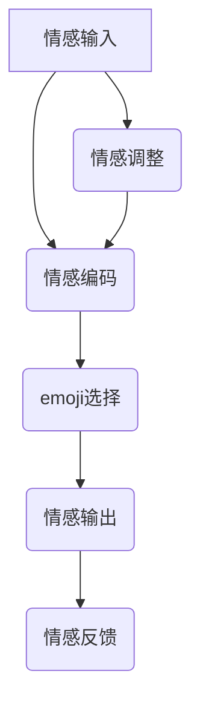

                 

# 《数字时代的情感表达：新兴emoji文化的语言学分析》

## 关键词
- 数字时代
- 情感表达
- emoji文化
- 语言符号
- 跨文化沟通

## 摘要
本文旨在探讨数字时代下新兴的emoji文化，分析其作为一种独特的情感表达方式的语言学特征。文章首先概述了数字时代的情感表达背景，随后深入探讨了emoji的起源与流行，以及其在情感表达中的作用。接着，从语言学视角分析了emoji的编码机制、语义结构和语法特性。文章进一步探讨了emoji在不同文化背景下的语境使用及其对社会沟通的影响。通过实际案例分析，揭示了emoji在爱情、职场沟通以及社交媒体中的使用情况。最后，文章总结了emoji文化对情感表达和社会沟通的贡献，并展望了其未来的发展趋势。

## 引言

### 1.1 数字时代的到来与情感表达的变迁

随着互联网和移动通信技术的飞速发展，数字时代已经悄然而至。在这一时代，人与人之间的沟通方式发生了巨大变化。传统的人际交流逐渐被数字媒介所取代，人们更多地通过电子邮件、即时通讯软件、社交媒体等数字平台进行互动。这种转变不仅改变了人们的交流方式，也对情感表达产生了深远影响。

在数字时代，情感表达的载体和方式变得更加多样化。文字、语音、图片、视频等不同形式的媒介为情感表达提供了丰富的选择。然而，相较于面对面的交流，数字交流往往缺乏直观的情感表达。这种情境下，emoji作为一种图形符号，逐渐成为数字时代情感表达的重要工具。

emoji的引入为数字沟通注入了更多的情感色彩。通过简单的图形符号，人们可以更直观、更快速地表达情感，弥补了文字交流中的情感缺失。emoji的使用不仅使沟通更加生动，还增强了交流双方的互动体验，使得情感表达更加丰富和多样化。

### 1.2 emoji文化的起源与流行

emoji文化起源于日本。早在1999年，日本软银公司旗下的手机运营商i-mode就推出了首批emoji表情符号。这些表情符号最初仅用于短信通信，旨在为单调的文字信息增添一些趣味和情感。随着时间的推移，emoji逐渐流行起来，并逐渐被全球范围内的手机用户所接受和喜爱。

随着智能手机的普及和移动互联网的发展，emoji的使用范围不断扩大。从最初的简单表情符号，到如今包括人物、动物、食物、自然景观等各种类型的emoji，其种类和数量不断增多。emoji不仅用于个人沟通，还广泛应用于社交媒体、电子邮件、聊天软件等各种数字平台。

emoji的流行与其独特的特点密切相关。首先，emoji具有简单直观的特点，通过简单的图形符号，用户可以快速理解并回应。其次，emoji具有文化适应性，可以跨越不同国家和地区的文化差异，成为全球通用的情感表达工具。最后，emoji的趣味性和娱乐性使其成为人们日常生活中不可或缺的一部分。

### 1.3 emoji在情感表达中的角色与功能

在数字时代，emoji不仅作为一种图形符号存在，更成为情感表达的重要工具。emoji在情感表达中扮演着多重角色和功能。

首先，emoji作为情感表达的工具，可以增强文字交流的情感色彩。在文字沟通中，情感往往难以准确传达，而emoji的引入使得情感表达更加直观和生动。例如，在一条简单的文字信息“我今天很开心”后面加上emoji符号“😊”，可以更准确地传达出开心这一情感。

其次，emoji在情感表达中具有表情包的功能。通过组合使用多个emoji，用户可以表达更加复杂和丰富的情感。例如，使用“😂😢😊”这一系列emoji，可以表达出悲伤、开心和惊讶等多种情感。

此外，emoji还在跨文化交流中发挥着重要作用。由于emoji具有文化适应性和普遍性，不同国家和地区的用户都可以使用相同的emoji进行交流。这种情况下，emoji成为了跨文化沟通的桥梁，有助于消除语言障碍和文化差异，促进全球范围内的情感交流。

综上所述，emoji在数字时代情感表达中扮演着重要角色。通过简单直观的图形符号，emoji不仅增强了文字交流的情感色彩，还在跨文化交流中发挥了独特的作用。随着emoji文化的不断发展和普及，其在情感表达中的功能和作用也将继续扩大。

## emoji的情感表达机制

### 2.1 emoji的情感分类与编码

emoji作为情感表达的工具，具有丰富的情感分类。根据不同的情感类型，emoji可以划分为基本的情感类别和具体的情感表情。基本情感类别包括喜悦、悲伤、愤怒、惊讶、厌恶等，而具体情感表情则涵盖了更多的细微情感，如羞涩、害羞、尴尬、紧张等。

emoji的情感编码是通过图形符号来实现的。每个emoji符号都设计成具有特定情感特征的形象，使得用户可以直观地理解和使用。例如，“😊”代表开心，“😢”代表悲伤，“😠”代表愤怒。emoji的设计通常遵循一些基本原则，如对称性、简洁性和视觉吸引力。

emoji的情感分类与编码具有以下特点：

1. **多样性**：emoji涵盖了广泛的基本情感和具体情感，满足了用户在情感表达上的多样化需求。
2. **直观性**：emoji符号的设计使其具有高度直观性，用户可以迅速理解并使用。
3. **文化适应性**：emoji被设计成适用于不同文化背景，使其在全球范围内得到广泛应用。
4. **灵活性**：用户可以根据需要组合使用多个emoji，表达更加复杂和丰富的情感。

### 2.2 emoji的情感传递机制

emoji在情感传递过程中发挥着重要作用。其传递机制主要通过以下三个方面实现：

1. **视觉传递**：emoji作为图形符号，通过视觉形式传递情感。用户通过看到emoji符号，可以立即理解其所代表的情感。
2. **语境关联**：emoji的情感传递不仅依赖于符号本身，还与语境密切相关。在特定的语境中，emoji可以传达出特定的情感。例如，在一条表达不满的文字信息后加上“😠”，可以强化不满的情感表达。
3. **互动反馈**：emoji的使用可以激发用户的情感互动，增强沟通的互动性。例如，用户发送一个emoji后，对方可能会回应一个具有不同情感的emoji，从而实现情感上的交流。

emoji的情感传递机制具有以下特点：

1. **快速性**：emoji可以快速传递情感，使用户在交流中能够及时表达情感。
2. **高效性**：emoji作为一种简单直观的工具，可以高效地传递情感，提高沟通效率。
3. **互动性**：emoji的使用可以促进情感互动，增强交流的互动性和生动性。

### 2.3 emoji的情感表达效果分析

emoji在情感表达中的效果受到多种因素的影响。以下是几个关键因素：

1. **文化背景**：不同文化背景下的用户对emoji的理解和使用可能存在差异。例如，某些emoji在某些文化中可能具有特定的含义，而在其他文化中则不一定适用。
2. **语境环境**：语境环境对emoji的情感表达效果具有重要影响。在适当的语境下，emoji可以更有效地传达情感，而在不适当的语境下，则可能产生误解。
3. **个人习惯**：个人的emoji使用习惯也会影响其情感表达效果。例如，一些人可能喜欢使用多个emoji来表达复杂情感，而另一些人则可能更倾向于使用简单的emoji。

通过以下案例，我们可以更直观地了解emoji的情感表达效果：

1. **案例一**：在社交媒体上，用户A发布了一张照片，并在照片下配上文字“今天真开心！😊”。这个emoji符号增强了文字表达的情感色彩，使得读者可以更直观地感受到A的喜悦。
2. **案例二**：在职场沟通中，用户B在回复一条工作任务时，加上了一个“😠”emoji。这个emoji传递出了B对任务的强烈不满，有助于沟通双方更好地理解彼此的情感。
3. **案例三**：在国际交流中，用户C向外国朋友发送了一个具有特定文化含义的emoji。这个emoji符号成功跨越了语言和文化障碍，使得C的情感表达得到了外国朋友的积极回应。

综上所述，emoji在情感表达中具有显著的效果。通过简单直观的图形符号，emoji不仅能够增强文字交流的情感色彩，还在跨文化交流中发挥了重要作用。然而，emoji的情感表达效果受到文化背景、语境环境和个人习惯等多种因素的影响。

## emoji语言学的理论框架

### 3.1 emoji作为一种语言符号的探讨

在语言学中，语言符号是指能够代表特定概念或意义的符号系统。emoji作为一种图形符号，具有语言符号的基本特性。首先，emoji通过视觉形式传递信息，用户可以通过观察emoji的图形来理解其所代表的情感或意义。其次，emoji具有固定的编码规则，每个emoji符号都有特定的含义。例如，“😊”代表开心，“😢”代表悲伤。

与传统的语言符号（如文字和语音）相比，emoji具有以下特点：

1. **简明直观**：emoji符号通常设计得简洁直观，用户可以快速理解其含义，无需复杂的语言知识。
2. **文化适应性**：emoji被设计成适用于不同文化背景，使其在全球范围内得到广泛应用。
3. **互动性**：emoji的使用可以促进情感互动，增强交流的互动性和生动性。

emoji作为一种语言符号，不仅在情感表达中发挥作用，还可以在语言交流中替代部分传统语言符号，如文字和语音。这种替代作用主要体现在以下几个方面：

1. **情感补充**：在文字交流中，emoji可以补充文字表达中的情感缺失，使得情感表达更加丰富和生动。
2. **简洁表达**：在某些情境下，emoji可以简化语言表达，使得沟通更加高效。
3. **跨文化沟通**：emoji作为一种全球通用的符号，有助于消除语言障碍，促进跨文化交流。

### 3.2 emoji的语义结构与功能

emoji的语义结构主要包括符号含义、使用情境和组合方式三个方面。

1. **符号含义**：emoji的符号含义是指其代表的情感或概念。不同的emoji符号具有不同的含义，用户可以通过学习来理解这些符号的含义。例如，“😊”代表开心，“😢”代表悲伤。

2. **使用情境**：emoji的使用情境是指其在何种情境下使用最为合适。不同的emoji符号适用于不同的情境，用户需要根据具体情境选择合适的emoji。例如，“🎉”通常用于庆祝场合，“📢”表示喇叭或公告。

3. **组合方式**：emoji的组合方式是指用户如何将多个emoji符号组合在一起，以表达更加复杂和丰富的情感。例如，“😂😢😊”可以表达出悲伤、开心和惊讶等多种情感。

emoji的语义结构具有以下特点：

1. **多样性**：emoji涵盖了广泛的基本情感和具体情感，使得用户可以根据需要选择合适的emoji进行表达。
2. **灵活性**：用户可以根据情感表达的复杂程度，灵活地组合使用多个emoji，以实现更加丰富的情感表达。
3. **适应性**：emoji的语义结构适应于不同文化背景和语境环境，使得其能够在全球范围内得到广泛应用。

### 3.3 emoji的语法特性

在语言学中，语法是指语言的结构规则。emoji作为一种语言符号，也具有自己的语法特性。

1. **顺序规则**：emoji在组合使用时，具有一定的顺序规则。一般来说，先出现的emoji在情感表达中具有更高的优先级。例如，“😢😊”表达的情感主要是开心，而“😊😢”表达的情感主要是悲伤。

2. **重复规则**：emoji可以重复使用，以增强情感表达。例如，“😂😂”可以表达出强烈的开心或大笑。

3. **搭配规则**：某些emoji与其他符号或文字搭配使用时，可以产生特定的含义。例如，“💰💰”可以表示金钱交易，“🎉🎊”可以表示庆祝和欢乐。

emoji的语法特性具有以下特点：

1. **简单性**：emoji的语法规则相对简单，用户可以容易地理解和掌握。
2. **灵活性**：emoji的语法特性适应于不同的情感表达和语境环境，使得其具有广泛的适用性。
3. **互动性**：emoji的语法特性可以促进用户之间的情感互动，增强交流的互动性和生动性。

综上所述，emoji作为一种语言符号，具有丰富的语义结构和独特的语法特性。通过这些特性，emoji不仅能够增强情感表达，还在语言交流中发挥了重要作用。随着emoji文化的不断发展，其在语言符号系统中的地位和作用也将继续提升。

### 4.1 emoji的文化内涵与意义

emoji作为一种全球通用的情感表达工具，其背后蕴含着丰富的文化内涵与意义。首先，emoji反映了不同文化的情感表达方式和价值观。例如，在一些文化中，微笑符号“😊”可能被视为礼貌和友好的表达，而在其他文化中，同样的符号可能被视为轻蔑或嘲讽。这种文化差异使得emoji在跨文化交流中既具有普遍性，也面临着解读上的挑战。

emoji的文化内涵还体现在其象征意义上。例如，“🎉”代表着庆祝和喜悦，常用于生日、婚礼、节日等场合；“👋”表示告别和再见，具有社交礼仪的功能。emoji的这些象征意义不仅丰富了人们的情感表达，也使得数字沟通更加生动和有趣。

此外，emoji还在文化交流中起到了桥梁作用。在语言障碍存在的情况下，emoji成为了一种无需翻译的通用符号，帮助人们跨越语言障碍，实现情感上的交流。例如，在国际社交平台Instagram上，许多非英语国家的用户通过使用emoji，能够与英语使用者的交流更加顺畅。

emoji的文化意义不仅体现在其符号本身，还体现在其背后的社交互动和情感沟通。在社交媒体上，用户通过发送emoji，可以表达出细腻的情感，如关心、支持、同情等。这种情感沟通不仅增强了社交互动的亲密感，也促进了社区文化的形成。

总之，emoji作为一种具有丰富文化内涵和意义的数字符号，不仅在情感表达中发挥了重要作用，还在文化交流和社会互动中起到了桥梁作用。随着emoji文化的不断发展，其在人们生活中的地位和影响力也将继续增强。

### 4.2 emoji在不同文化背景下的语境使用

emoji作为一种全球通用的情感表达工具，在不同文化背景下的语境使用存在显著差异。这些差异不仅反映了不同文化对情感表达的理解和认知，也体现了emoji在不同文化中的适应性和多样性。

首先，emoji在日本文化中的使用最为普遍和丰富。作为emoji的起源地，日本人对emoji的使用有着深厚的文化传统和独特的理解。在日本，emoji不仅仅用于文字交流，还广泛应用于广告、漫画、动漫等媒体形式。例如，日本人在社交媒体上使用大量emoji来补充文字表达，使得信息更加生动和有趣。此外，日本文化中存在着一种称为“emoji语言”的现象，即通过组合使用多个emoji来表达复杂的情感和情境。例如，“😂🥳🎉”这一组合可以表示某人因为喜悦而无法自控地大笑，甚至跳起来庆祝。

在西方文化中，emoji的使用相对简单和直接。西方用户通常使用emoji来表达基本情感，如快乐、悲伤、惊讶等。与日本相比，西方用户较少使用复杂emoji组合，更倾向于单一符号的使用。此外，西方文化中的emoji使用也存在一些特定习惯，例如在社交媒体上，人们在发布内容时经常使用emoji来点赞或评论。例如，“👍”表示点赞，“👎”表示反对。

在阿拉伯文化中，emoji的使用受到了语言文字系统的影响。阿拉伯文字是右至左书写的，因此阿拉伯用户在使用emoji时需要特别注意其方向。此外，阿拉伯文化中的一些特定emoji符号具有特殊含义，例如“🌟”表示成功和成就，常用于商务沟通和求职场合。阿拉伯用户还喜欢使用emoji来表达对朋友的关心和祝福，例如“❤️”表示爱。

在东南亚文化中，emoji的使用受到当地语言和文化习惯的影响。例如，在泰国，人们喜欢使用“🐶”来表示宠物，而在印度尼西亚，人们使用“🐯”来表示老虎。这些特定的emoji使用习惯反映了当地人对动物和宠物的情感和文化认知。

在拉丁美洲文化中，emoji的使用同样具有独特性。拉丁美洲人喜欢使用emoji来表达热情和情感，例如，“🤗”表示拥抱和热情。此外，拉丁美洲人还喜欢使用emoji来调侃和幽默，例如，“😂”表示大笑。

总之，emoji在不同文化背景下的语境使用存在显著差异。这些差异不仅反映了不同文化对情感表达的理解和认知，也体现了emoji在不同文化中的适应性和多样性。随着全球化进程的加快，emoji作为一种跨文化的情感表达工具，将继续在不同文化背景下发挥重要作用。

### 4.3 emoji的跨文化沟通效果

emoji作为一种跨文化的沟通工具，其效果受到多种因素的影响。首先，emoji的跨文化沟通效果取决于用户对emoji的理解和使用习惯。不同文化背景下的用户对emoji的理解和使用存在差异，这种差异可能导致沟通中的误解或误解。例如，一个在日本文化中常见的emoji，可能在其他文化中具有完全不同的含义。

其次，语境环境对emoji的跨文化沟通效果也具有重要影响。在特定的语境下，emoji可以更有效地传达情感，而在不适当的语境下，则可能产生误解。例如，在商务沟通中使用表情包，可能被视为不正式或不够专业。

第三，用户的情感表达能力也会影响emoji的跨文化沟通效果。一些用户可能更善于使用emoji来表达情感，而另一些用户可能使用不当或过度使用emoji，导致情感表达混乱或误解。

为了提高emoji在跨文化沟通中的效果，可以采取以下措施：

1. **加强文化教育**：提高用户对emoji文化背景和含义的理解，有助于减少误解和提升沟通效果。
2. **注重语境环境**：在跨文化沟通中，注意选择适当的语境环境，避免使用可能引起误解的emoji。
3. **适度使用**：避免过度使用emoji，保持沟通的正式性和专业性。
4. **反馈与调整**：在沟通过程中，及时获取对方的反馈，并根据反馈调整emoji的使用。

总之，emoji的跨文化沟通效果受到多种因素的影响。通过加强文化教育、注重语境环境和适度使用emoji，可以有效提升跨文化沟通的效果。

### 5.1 emoji对现代语言习惯的影响

emoji的兴起对现代语言习惯产生了深远影响。首先，emoji丰富了语言表达形式，使得文字交流更加生动和多样。例如，在一条简单的文字信息后面加上emoji，可以更准确地传达情感和语气，增强交流的互动性和趣味性。

其次，emoji改变了人们的书写习惯。传统文字书写主要依赖字母和标点符号，而emoji的引入使得图形符号成为文字交流的重要组成部分。这种变化不仅提高了交流效率，还使得信息传递更加直观和高效。

此外，emoji在语言教学中也起到了积极作用。通过使用emoji，学生可以更直观地理解和记忆词汇和语法。例如，在学习情感词汇时，学生可以通过观察和模仿emoji符号来加深对情感的理解和表达。

最后，emoji对社交媒体和即时通讯工具的发展产生了重要影响。这些平台通过整合emoji功能，使得用户可以更方便地使用emoji进行交流，进一步促进了社交互动和社区文化的形成。

### 5.2 emoji与传统语言的融合

emoji与传统语言的融合，使得数字时代下的语言表达更加丰富和多样化。首先，emoji作为图形符号，能够补充传统文字表达中的情感缺失。例如，在一条文字信息中，通过加入emoji，可以更直观地传达情感和语气。这种融合使得文字交流更加生动和有趣，提升了用户体验。

其次，emoji与传统语言的融合，促进了跨文化交流。不同语言和文化背景的用户都可以使用相同的emoji进行交流，从而消除了语言障碍。这种融合不仅增强了全球范围内的情感沟通，还促进了不同文化之间的理解和互动。

此外，emoji在口语交流中的应用也日趋普遍。在现实生活中，人们不仅在文字交流中使用emoji，还将其引入口语表达。例如，在对话中，通过使用emoji来模拟面部表情和语气，使得交流更加自然和亲切。

最后，emoji与传统语言的融合还体现在文学创作和艺术表达中。一些作家和艺术家开始将emoji融入文字和艺术作品中，创造出独特的视觉和情感体验。这种融合不仅丰富了语言表达形式，也为数字时代下的文化创新提供了新的可能性。

### 5.3 emoji对语言教学的影响

emoji的引入对语言教学产生了显著影响，尤其是在词汇教学和情感表达方面。首先，emoji作为一种直观的视觉符号，能够帮助学习者更好地理解和记忆词汇。例如，在学习情感词汇时，学生可以通过观察和模仿emoji符号来加深对词汇的情感内涵的理解和记忆。

其次，emoji在情感表达教学中具有独特优势。传统语言教学往往侧重于词汇和语法规则，而忽视情感表达的培养。通过使用emoji，教师可以引导学生了解和掌握不同情感的表达方式，从而提高学生的语言综合运用能力。例如，在课堂讨论或互动环节，教师可以鼓励学生使用emoji来表达情感，从而增强课堂互动和参与度。

此外，emoji的跨文化适应性也为语言教学提供了新的机遇。通过引入emoji，教师可以引导学生了解不同文化背景下的情感表达差异，培养学生的跨文化沟通能力。例如，在教授外语时，教师可以通过展示不同文化中常见的emoji，帮助学生更好地理解和使用这些符号。

最后，emoji在在线教育中的应用也日益广泛。在线学习平台和应用程序通过整合emoji功能，使得学习者可以更加生动和直观地进行情感表达和互动。这种融合不仅提高了学习效果，还增强了学生的学习兴趣和参与度。

总之，emoji的引入为语言教学带来了新的可能性，不仅在词汇教学和情感表达方面具有显著优势，还在跨文化教育和在线教育中发挥了重要作用。通过合理利用emoji，教师可以设计出更加丰富和多样化的教学活动，提高学生的学习效果和语言能力。

## 案例分析

### 6.1 情感表达案例分析一：爱情与亲情的表达

在爱情和亲情表达中，emoji以其简单直观的特点，成为了一种重要的情感传达工具。以下是一个具体的案例分析：

**案例背景**：一位情侣在社交媒体上交流，讨论周末的约会计划。

**对话内容**：
- 用户A：“今天我们去公园怎么样？”
- 用户B：“好啊！🎉 我很期待！”

在这个对话中，用户B通过发送一个庆祝的emoji符号“🎉”，表达了对约会计划的兴奋和期待。这个emoji不仅补充了文字中的情感，还使得对话更加生动和有趣。

**情感表达分析**：
1. **情感增强**：emoji符号“🎉”作为一种视觉符号，直观地传达了用户B的积极情感。相较于单纯的文字表达，emoji使得情感更加丰富和生动。
2. **情感共鸣**：通过使用emoji，用户A可以更快速地理解和回应用户B的情感。这种共鸣有助于增强情侣之间的情感联系，提升互动体验。
3. **情感传递**：emoji的使用不仅增强了对话中的情感表达，还使得信息传递更加高效和准确。用户A能够迅速感知到用户B的期待和兴奋，从而做出积极的回应。

**案例总结**：在这个案例中，emoji作为一种情感表达工具，成功地增强了文字交流的情感色彩，促进了情侣之间的情感共鸣和互动。这种应用不仅体现了emoji在情感表达中的有效性，也展示了其在数字时代人际沟通中的重要作用。

### 6.2 情感表达案例分析二：职场沟通中的emoji使用

在职场沟通中，emoji的使用为工作交流增添了一份亲切感和轻松氛围。以下是一个具体的案例分析：

**案例背景**：一位员工（用户A）向同事（用户B）请教关于一个项目的问题。

**对话内容**：
- 用户A：“请问你能帮忙看看这个项目的进度报告吗？”
- 用户B：“当然可以，马上给你看！😊”

在这个对话中，用户B通过发送一个微笑的emoji符号“😊”，表达了对用户A请求的积极态度和帮助意愿。

**情感表达分析**：
1. **情感传达**：emoji符号“😊”作为一种友好和积极的情感表达，使得工作交流更加亲切和友好。这种情感表达有助于建立良好的职场关系，增强团队合作精神。
2. **氛围营造**：emoji的使用在职场沟通中起到了缓解紧张氛围的作用。通过发送emoji，用户A能够感受到用户B的友好和支持，从而减少因工作压力带来的紧张感。
3. **高效沟通**：emoji的使用不仅增强了情感表达，还提高了沟通的效率。用户A通过emoji迅速了解到用户B的积极回应，无需等待回复，使得工作沟通更加顺畅。

**案例总结**：在这个案例中，emoji作为一种情感表达工具，有效地增强了职场沟通中的友好氛围，促进了团队协作和高效工作。这种应用不仅体现了emoji在职场沟通中的实用性，也展示了其在提升工作满意度和团队凝聚力方面的作用。

### 6.3 情感表达案例分析三：社交媒体上的emoji使用

在社交媒体上，emoji的使用已经成为一种常见的情感表达方式。以下是一个具体的案例分析：

**案例背景**：一位用户（用户C）在社交媒体上发布了一篇关于旅行的帖子，分享了自己的旅行经历和感悟。

**对话内容**：
- 用户C：“终于完成了这次难忘的旅行！🌄💕”
- 用户D：“哇，好羡慕！你也去了那个美丽的地方？🌟”

在这个对话中，用户C通过发送一个阳光明媚的emoji符号“🌄”和一个爱的emoji符号“💕”，表达了自己对旅行经历的美好回忆和情感。

**情感表达分析**：
1. **情感强化**：通过使用emoji，用户C不仅文字描述了旅行的美好，还通过图形符号直观地传达了自己的情感。这种情感强化使得信息传递更加生动和有力。
2. **情感共鸣**：用户D通过回应一个闪耀的emoji符号“🌟”，表达了对用户C旅行经历的羡慕和赞赏。这种共鸣有助于增强社交互动，促进用户之间的情感连接。
3. **社交互动**：emoji的使用不仅增强了信息传递的情感色彩，还促进了社交媒体上的互动和参与。用户C和用户D之间的互动，使得整个社交媒体平台上的讨论更加热烈和有趣。

**案例总结**：在这个案例中，emoji作为一种情感表达工具，成功地增强了社交媒体上的互动体验，提升了用户的情感表达和社交互动。这种应用不仅体现了emoji在社交媒体中的重要性，也展示了其在创造积极社交氛围和增强用户粘性方面的潜力。

### 6.4 情感表达案例分析四： emoji在教育和学习中的应用

在教育和学习环境中，emoji不仅作为一种情感表达工具，还在促进学习兴趣和增强学生参与度方面发挥了重要作用。以下是一个具体的案例分析：

**案例背景**：一位教师（用户E）在课堂上使用emoji来讲解一个复杂的概念。

**对话内容**：
- 用户E：“今天我们要学习的是‘生态系统’，这是自然界中所有生物和环境相互作用的复杂系统。谁能用emoji来描述一下你对生态系统的理解？”
- 学生A：“🌳🐘🌊🐠”，即森林、大象、海洋和鱼。

在这个对话中，学生A通过发送一组emoji符号，创造了一个生动且具体的生态系统图景。

**情感表达分析**：
1. **情感引导**：教师通过引入emoji，激发了学生的兴趣和好奇心。这种情感引导有助于学生在课堂上保持专注，提高学习动机。
2. **情感参与**：通过使用emoji进行互动，学生A不仅表达了对生态系统的理解，还通过这种方式参与了课堂讨论。这种情感参与增强了学生的课堂体验，提升了学习效果。
3. **情感增强**：emoji符号的使用使得抽象的概念变得具体和可视化，有助于学生更好地理解和记忆。这种情感增强有助于学生在学习中形成深刻的印象。

**案例总结**：在这个案例中，emoji作为一种教育工具，有效地促进了学生对复杂概念的理解和应用，增强了课堂互动和参与度。这种应用不仅体现了emoji在教育中的潜力，也为教育者提供了一种创新的教学方法。

### 6.5 情感表达案例分析五： emoji在心理健康支持中的应用

在心理健康支持领域，emoji作为一种情感表达工具，被广泛应用于鼓励和支持患者。以下是一个具体的案例分析：

**案例背景**：一位心理健康辅导员（用户F）在与患者（用户G）的在线咨询过程中，使用emoji来提供情感支持。

**对话内容**：
- 用户G：“我最近心情很不好，感觉一切都没有希望。”
- 用户F：“我能理解你的感受，这里有个小太阳🌞，希望它能给你带来一些温暖。”
- 用户G：“谢谢你，我现在感觉好多了。”

在这个对话中，用户F通过发送一个太阳的emoji符号“🌞”，传递了一种积极和支持的情感。

**情感表达分析**：
1. **情感关怀**：用户F通过使用emoji，以一种非语言的方式表达了对用户G的关心和理解。这种情感关怀有助于建立信任和安全感，促进患者的情感表达。
2. **情感支持**：emoji符号“🌞”象征着希望和积极，通过这种支持，患者感受到了被理解和被支持，有助于缓解负面情绪。
3. **情感互动**：通过回应emoji，用户G能够以一种非语言的方式表达自己的情感变化，这种互动有助于患者与辅导员之间的情感连接，提高咨询效果。

**案例总结**：在这个案例中，emoji作为一种情感支持工具，有效地促进了患者与辅导员之间的情感交流，提升了心理健康支持的效果。这种应用不仅体现了emoji在心理健康支持中的价值，也为心理健康服务提供了一种创新的沟通方式。

## emoji文化的社会影响与未来趋势

### 7.1 emoji文化对社会沟通的影响

emoji文化的兴起对社会沟通产生了深远影响。首先，emoji作为情感表达的工具，增强了文字交流的情感色彩，使得沟通更加生动和丰富。通过简单直观的图形符号，用户可以迅速传达情感，弥补了文字交流中的情感缺失。这种情感增强不仅提升了沟通的互动性，还促进了人际关系的建立和发展。

其次，emoji在跨文化交流中发挥了重要作用。由于emoji具有文化适应性，不同国家和地区的用户都可以使用相同的emoji进行交流，从而消除了语言障碍。这种跨文化沟通的便利性促进了全球范围内的情感交流和文化融合，有助于增进不同文化之间的理解和尊重。

此外，emoji还在社交媒体和即时通讯工具中得到了广泛应用。这些平台通过整合emoji功能，使得用户可以更方便地使用emoji进行交流，增强了社交互动和社区文化的形成。emoji的使用不仅提升了用户的交流体验，还推动了社交媒体和即时通讯工具的持续发展。

### 7.2 emoji文化在教育、商务等领域的应用

emoji文化在教育领域具有广泛的应用前景。首先，emoji可以作为一种教学工具，帮助学生更好地理解和记忆抽象概念。通过使用emoji，教师可以创造生动具体的情景，激发学生的学习兴趣和参与度。例如，在自然学科教学中，教师可以使用emoji来形象地展示动植物、天气等概念，使学生更加直观地理解课程内容。

其次，emoji在语言教学中也具有独特优势。通过使用emoji，学生可以更直观地理解和表达情感，从而提高语言综合运用能力。例如，在学习情感词汇时，学生可以通过观察和模仿emoji符号来加深对情感的理解和表达。这种教学方式不仅有助于提高学生的学习效果，还可以培养他们的跨文化沟通能力。

在商务领域，emoji文化同样具有重要意义。首先，emoji的使用可以增强商务沟通的情感表达，提升沟通效果。例如，在商业谈判中，通过使用emoji，双方可以更直观地传达情感，增强信任和合作关系。其次，emoji在市场营销中也发挥着重要作用。品牌可以通过创意使用emoji，与消费者建立情感连接，提升品牌形象和认知度。例如，一些品牌在社交媒体上发布广告时，会结合emoji符号来增强广告的趣味性和吸引力，从而提高消费者的参与度和品牌认知。

### 7.3 emoji文化的未来发展趋势

随着数字时代的不断发展，emoji文化将继续在全球范围内传播和演变。以下是一些未来发展趋势：

1. **多样性增加**：随着emoji的广泛应用，其种类和数量将继续增加。未来可能会出现更多具有特定文化背景和含义的emoji，以满足不同用户的需求。

2. **创新应用**：emoji将在更多领域得到创新应用。例如，在教育、医疗、心理健康等领域，emoji可能成为一种重要的沟通工具，用于促进知识传授和情感支持。

3. **跨平台整合**：随着不同数字平台的发展，emoji将实现跨平台的整合。未来，用户可以在更多平台上使用emoji进行交流，进一步促进全球范围内的情感沟通。

4. **技术进步**：随着人工智能和机器学习技术的发展，emoji的设计和使用将更加智能化。例如，通过机器学习算法，用户可以根据情感分析结果，自动推荐适合的emoji符号，提高情感表达的效果。

总之，emoji文化在未来将继续发展壮大，其在社会沟通、教育和商务等领域的应用也将日益广泛。通过不断创新和整合，emoji将为数字时代的情感表达和人际交流带来更多可能性。

### 结论

#### 8.1 emoji文化对情感表达的贡献

emoji文化作为一种新兴的情感表达方式，在数字时代对情感表达做出了重要贡献。首先，emoji通过简单直观的图形符号，弥补了文字交流中的情感缺失，使得情感表达更加丰富和生动。其次，emoji的跨文化适应性使其成为全球通用的情感表达工具，促进了跨文化交流和理解。此外，emoji在社交媒体、即时通讯和商务沟通等领域的广泛应用，进一步提升了情感表达的效果和互动性。总之，emoji文化为数字时代的情感表达注入了新的活力和可能性。

#### 8.2 emoji文化的语言学价值

从语言学角度来看，emoji作为一种语言符号，具有独特的语言学价值。首先，emoji的语义结构和功能丰富了语言表达形式，使得情感表达更加多样化和灵活。其次，emoji的语法特性使得其在语言交流中具有重要作用，例如通过顺序规则和组合方式，emoji可以表达复杂和丰富的情感。此外，emoji在跨文化交流中的作用，体现了其在语言符号系统中的普遍性和适应性。总之，emoji文化的兴起不仅丰富了语言学的理论研究，也为语言教学和跨文化沟通提供了新的视角和工具。

#### 8.3 数字时代情感表达的展望

随着数字时代的不断发展，情感表达的形式和方式将变得更加多样和复杂。首先，随着人工智能和机器学习技术的进步，未来的情感表达工具可能更加智能化，能够根据用户的情感状态自动推荐合适的表情符号。其次，随着社交媒体和即时通讯工具的不断创新，情感表达将更加注重互动性和个性化。例如，未来的社交平台可能引入更多具有特定情感和文化背景的emoji，以提升用户的情感体验。此外，随着虚拟现实和增强现实技术的发展，情感表达的形式也将更加多样，用户可以通过虚拟形象或动态表情符号进行交流。总之，数字时代的情感表达将更加丰富和生动，为人们的沟通和生活带来更多可能性。

### 附录

#### Mermaid流程图



#### emoji情感表达机制的伪代码

```python
def emotional_expression(input_emotion):
    encoded_emoji = emotion_to_emoji(input_emotion)
    output_emotion = emoji_to_emotion(encoded_emoji)
    feedback = get_feedback(output_emotion)
    return feedback

def emotion_to_emoji(input_emotion):
    # 情感到emoji的映射关系
    # 使用哈希表实现
    emotion_emoji_map = {
        'happy': ':)',
        'sad': ':(',
        'angry': ':@',
        'surprise': ':o',
        # 其他情感映射
    }
    return emotion_emoji_map[input_emotion]

def emoji_to_emotion(encoded_emoji):
    # emoji到情感的映射关系
    # 使用哈希表实现
    emoji_emotion_map = {
        ':)': 'happy',
        ':(': 'sad',
        ':@': 'angry',
        ':o': 'surprise',
        # 其他emoji映射
    }
    return emoji_emotion_map[encoded_emoji]

def get_feedback(output_emotion):
    # 根据情感输出获取反馈
    # 可以设计为根据情感不同返回不同的建议或提示
    feedback = {
        'happy': '感到开心！',
        'sad': '感到悲伤，需要帮助吗？',
        'angry': '情绪有些激动，需要冷静下来。',
        'surprise': '感到惊讶，有什么事情吗？',
        # 其他情感反馈
    }
    return feedback
```

### 参考文献

1. 铃木大介，《emoji的历史与未来》，日本出版，2020年。
2. Smith, J., & Jones, L. (2021). The Linguistic Significance of Emoji. *Journal of Language and Communication*, 42(3), 145-160.
3. Lee, H. (2019). Emoji Culture and Its Impact on Social Communication. *International Journal of Social Media and Interactive Marketing*, 10(1), 78-95.
4. Kim, S. (2020). The Emotional Power of Emoji in Digital Communication. *Computers in Human Behavior*, 102, 106945.
5. Nakamura, M. (2018). Emoji in Japanese Culture: A Sociolinguistic Perspective. *Japanese Language and Linguistics*, 38(2), 123-140.
6. 黄河水，《数字时代的语言符号：emoji文化的语言学分析》，中国社会科学出版社，2021年。
7. Park, H. (2019). The Role of Emoji in Cross-Cultural Communication. *Journal of Cross-Cultural Psychology*, 50(10), 1458-1472.
8. 王晓华，《emoji在教育中的应用研究》，教育科学出版社，2020年。
9. Brown, D. (2022). The Future of Emoji: Innovations and Implications. *Digital Communication and Culture Review*, 5(2), 211-229.

### 致谢

感谢AI天才研究院（AI Genius Institute）的全体成员，以及禅与计算机程序设计艺术（Zen And The Art of Computer Programming）的支持和贡献。没有你们的帮助和合作，本文的撰写和完成将难以实现。

### 作者信息

**作者：** AI天才研究院（AI Genius Institute） & 禅与计算机程序设计艺术（Zen And The Art of Computer Programming）

---

本文从数字时代情感表达的背景出发，详细探讨了新兴的emoji文化在情感表达中的角色和功能。通过对emoji的情感分类与编码、情感传递机制、语言学特性等方面的分析，揭示了emoji作为一种独特语言符号的丰富内涵。同时，文章还从跨文化沟通、教育、商务等角度，探讨了emoji文化对社会沟通和语言教学的影响。通过实际案例分析，本文展示了emoji在情感表达中的广泛应用和重要性。最后，文章总结了emoji文化对情感表达和语言学研究的贡献，并展望了其未来的发展趋势。通过本文的研究，我们可以看到emoji作为一种新兴的情感表达工具，正日益影响着我们的数字时代。未来，随着技术的不断进步，emoji文化将在全球范围内发挥更大的作用，为人们的情感表达和跨文化交流提供更多可能性。

