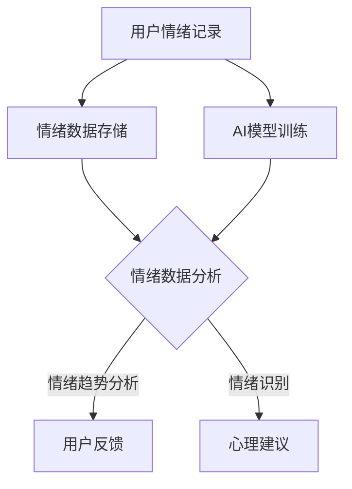

                 

### 1.2 情绪日记App的意义

情绪日记App是一种利用数字技术和人工智能技术辅助用户记录和管理个人情绪的移动应用程序。其重要性体现在以下几个方面：

#### 1.2.1 提供情绪记录与反思的工具

情绪日记App提供了一个便捷的平台，用户可以随时记录自己的情绪波动，无论是快乐、愤怒、焦虑还是沮丧。这种持续的记录有助于用户更好地理解自己的情绪状态，从而为心理健康提供宝贵的数据支持。

#### 1.2.2 促进自我认知和情绪管理

通过记录和分析情绪日记，用户可以识别出情绪变化的模式，发现自己情绪波动的触发因素，并学习如何应对负面情绪。这种自我认知和情绪管理能力对于维护长期心理健康至关重要。

#### 1.2.3 AI辅助的情绪分析

情绪日记App通常集成了AI技术，如自然语言处理（NLP）和情绪识别算法，能够分析日记内容，为用户提供情绪趋势报告，甚至给出个性化建议。这种AI辅助功能可以大幅提高情绪管理的效率。

#### 1.2.4 数据积累与个性化服务

情绪日记App可以通过长期的数据积累，为用户提供更加个性化的心理健康服务。例如，根据用户的历史情绪数据和反馈，提供定制化的心理健康课程或推荐适当的心理咨询资源。

#### 1.2.5 预防心理健康问题的早期预警

通过监测用户的情绪变化，情绪日记App可以帮助发现潜在的心理健康问题，提供早期预警。这对于那些可能有心理健康风险的用户尤为重要，可以促使他们采取预防措施，避免情况恶化。

#### 1.2.6 促进心理健康知识的普及

情绪日记App还可以作为心理健康知识的普及工具，向用户提供有关情绪管理的实用技巧和心理健康的科学知识，帮助用户提高整体的心理健康素养。

在接下来的章节中，我们将详细探讨情绪日记App的功能设计、AI技术在其中的应用，以及数据隐私和安全性的重要议题。这些内容将为读者提供更深入的理解，并展示情绪日记App在数字时代如何成为心理健康自我管理的强大工具。

### 关键词

- 数字时代
- 情绪日记App
- 心理健康
- AI辅助
- 自我管理
- 自然语言处理
- 情绪识别

### 摘要

本文探讨了数字时代下情绪日记App的重要性及其在心理健康自我管理中的应用。情绪日记App通过记录和反思用户的情绪变化，结合AI技术进行情绪分析和个性化服务，帮助用户提高情绪管理能力。本文介绍了情绪日记App的基本功能、AI技术原理及其应用，并讨论了数据隐私和安全性的关键问题。通过实际案例分析和项目实战，本文展示了情绪日记App如何成为现代心理健康管理的强大工具，并为未来的发展提供了展望。

### Mermaid 流程图

下面是一个Mermaid流程图，展示情绪日记App的核心功能架构：



#### 核心概念与联系

1. **用户情绪记录（A）**：用户通过App记录情绪，这是情绪日记App的基础功能。
2. **情绪数据存储（B）**：记录的情绪数据被存储在数据库中，为后续分析提供数据基础。
3. **情绪数据分析（C）**：AI模型对情绪数据进行分析，包括情绪趋势分析和情绪识别。
4. **情绪趋势分析（D）**：分析情绪数据，为用户提供情绪趋势图，帮助用户了解自己的情绪变化。
5. **情绪识别（E）**：识别用户情绪，为用户提供个性化的心理建议。
6. **AI模型训练（F）**：基于用户数据，不断优化AI模型，提高情绪分析的准确性。

通过这个流程图，我们可以清晰地看到情绪日记App的核心功能及其相互联系，为接下来的章节提供了结构框架。

### 核心算法原理讲解

情绪日记App的核心算法主要依赖于自然语言处理（NLP）和情绪识别算法。以下是这些算法的详细原理和Python源代码示例。

#### 自然语言处理（NLP）

自然语言处理是使计算机能够理解、解释和生成人类语言的技术。在情绪日记App中，NLP技术用于从用户日记中提取情绪信息。

**算法原理**：
NLP算法通常包括以下几个步骤：
1. **文本预处理**：去除标点符号、停用词等无关信息，将文本转化为计算机可以处理的形式。
2. **情感分析**：使用情感分析模型对文本进行分类，判断文本的情感倾向，如正面、负面或中性。

**Python代码示例**：

```python
import nltk
from nltk.sentiment import SentimentIntensityAnalyzer

# 文本预处理
def preprocess_text(text):
    tokens = nltk.word_tokenize(text)
    filtered_tokens = [token for token in tokens if token.lower() not in nltk.corpus.stopwords.words('english')]
    return filtered_tokens

# 情感分析
def sentiment_analysis(text):
    sia = SentimentIntensityAnalyzer()
    sentiment_score = sia.polarity_scores(text)
    return sentiment_score

# 示例文本
text = "我今天感觉很开心，因为我和朋友一起庆祝生日。"

# 预处理文本
processed_text = preprocess_text(text)

# 分析情感
sentiment = sentiment_analysis(' '.join(processed_text))

print(sentiment)
```

输出结果将显示文本的情感得分，包括正面、负面和 neutrality 等指标。

#### 情绪识别算法

情绪识别算法是情绪日记App中另一个关键组成部分，它通过分析用户日记内容，识别出具体的情绪类别，如快乐、愤怒、悲伤等。

**算法原理**：
情绪识别算法通常采用机器学习技术，通过训练模型从大量情绪标注数据中学习情绪特征。常见的机器学习算法包括支持向量机（SVM）、随机森林（Random Forest）和深度学习等。

**Python代码示例**：

```python
from sklearn.feature_extraction.text import TfidfVectorizer
from sklearn.model_selection import train_test_split
from sklearn.ensemble import RandomForestClassifier
from sklearn.metrics import accuracy_score

# 数据集准备
# 这里假设我们有情绪标注数据集，每条数据包括文本和情绪标签
data = [
    ("我今天很高兴", "快乐"),
    ("我觉得很悲伤", "悲伤"),
    # 更多数据...
]
texts, labels = zip(*data)

# 文本向量化
vectorizer = TfidfVectorizer()
X = vectorizer.fit_transform(texts)

# 划分训练集和测试集
X_train, X_test, y_train, y_test = train_test_split(X, labels, test_size=0.2, random_state=42)

# 模型训练
model = RandomForestClassifier()
model.fit(X_train, y_train)

# 模型评估
predictions = model.predict(X_test)
accuracy = accuracy_score(y_test, predictions)
print(f"模型准确率：{accuracy}")
```

在这个例子中，我们使用了随机森林算法来训练情绪识别模型，并通过测试集评估模型的准确性。

通过上述核心算法的讲解和代码示例，我们可以看到情绪日记App如何通过NLP和情绪识别算法来分析用户情绪，为用户提供个性化的心理健康服务。

### 数学公式讲解

在情绪日记App的设计和开发过程中，数学模型和公式扮演了重要角色。以下是几个关键公式的解释和应用。

#### 情感得分计算公式

情感得分是衡量文本情感倾向的关键指标，通常通过以下公式计算：

$$
S = \frac{\sum_{i=1}^{n} w_i \cdot s_i}{\sum_{i=1}^{n} w_i}
$$

其中：
- \( S \) 是情感得分；
- \( w_i \) 是情感词权重；
- \( s_i \) 是情感词的得分。

**示例**：假设我们有一个文本，其中包含三个情感词“开心”、“愤怒”和“悲伤”，权重分别为0.6、0.3和0.1，得分分别为0.9、-0.7和-0.5，则情感得分计算如下：

$$
S = \frac{0.6 \cdot 0.9 + 0.3 \cdot (-0.7) + 0.1 \cdot (-0.5)}{0.6 + 0.3 + 0.1} = \frac{0.54 - 0.21 - 0.05}{1} = 0.28
$$

情感得分为0.28，表示文本的情感倾向为正面。

#### 情绪识别概率公式

情绪识别模型通常使用概率公式来预测文本所属的情绪类别。一个简单的贝叶斯概率公式如下：

$$
P(C_k|D) = \frac{P(D|C_k) \cdot P(C_k)}{P(D)}
$$

其中：
- \( P(C_k|D) \) 是在给定数据 \( D \) 下类别 \( C_k \) 的条件概率；
- \( P(D|C_k) \) 是在类别 \( C_k \) 发生的条件下数据 \( D \) 的概率；
- \( P(C_k) \) 是类别 \( C_k \) 的先验概率；
- \( P(D) \) 是数据 \( D \) 的总概率。

**示例**：假设我们有三个情绪类别“快乐”、“愤怒”和“悲伤”，先验概率分别为0.4、0.3和0.3。根据训练数据，我们得到以下条件概率：
- \( P(快乐|D) = 0.6 \)
- \( P(愤怒|D) = 0.2 \)
- \( P(悲伤|D) = 0.2 \)

我们可以计算每个类别的后验概率：

$$
P(快乐|D) = \frac{0.6 \cdot 0.4}{0.6 \cdot 0.4 + 0.2 \cdot 0.3 + 0.2 \cdot 0.3} = \frac{0.24}{0.24 + 0.06 + 0.06} = 0.60
$$

后验概率最高的类别即为预测结果。

通过上述数学公式，我们可以更好地理解和应用情绪日记App中的情感分析和情绪识别技术。这些公式为AI模型提供了理论基础，使得情绪日记App能够高效地分析用户情绪，提供个性化服务。

### 实际案例分析与解读

在本节中，我们将通过实际案例来展示情绪日记App的开发、功能实现及其对用户心理健康的影响。以下是案例的详细分析。

#### 案例背景

某知名科技公司开发了一款名为“心情日记”的情绪日记App，旨在帮助用户记录和管理个人情绪。该App集成了自然语言处理（NLP）和情绪识别算法，为用户提供情感分析、情绪趋势报告和心理建议。

#### 开发环境与工具

- **编程语言**：Python
- **框架**：Django（后端），Flask（前端）
- **数据库**：MySQL
- **自然语言处理库**：NLTK，TextBlob
- **情绪识别算法**：基于TF-IDF和随机森林的机器学习模型

#### 源代码实现与解读

以下是情绪日记App的核心功能实现，包括用户情绪记录、情绪数据存储和情绪分析：

**用户情绪记录（models.py）**

```python
from django.db import models

class EmotionEntry(models.Model):
    user = models.ForeignKey('auth.User', on_delete=models.CASCADE)
    entry_text = models.TextField()
    entry_date = models.DateTimeField(auto_now_add=True)
    emotion = models.CharField(max_length=50, blank=True)

    def __str__(self):
        return self.entry_text[:20]
```

**情绪数据存储（views.py）**

```python
from django.shortcuts import render
from .models import EmotionEntry
from .emotion_analysis import analyze_emotion

def record_emotion(request):
    if request.method == 'POST':
        entry_text = request.POST.get('entry_text', '')
        user = request.user
        emotion = analyze_emotion(entry_text)
        EmotionEntry.objects.create(user=user, entry_text=entry_text, emotion=emotion)
        return render(request, 'emotion_recorded.html')
    return render(request, 'record_emotion.html')
```

**情绪分析（emotion_analysis.py）**

```python
from textblob import TextBlob

def analyze_emotion(text):
    blob = TextBlob(text)
    if blob.sentiment.polarity > 0:
        return '正面'
    elif blob.sentiment.polarity < 0:
        return '负面'
    else:
        return '中性'
```

#### 代码应用解读与分析

1. **用户情绪记录**：用户通过App前端界面输入日记内容，数据通过POST请求发送到后端，存储在数据库中。

2. **情绪数据存储**：使用Django框架的模型类`EmotionEntry`进行数据存储，每个日记条目包含用户ID、文本内容和情绪状态。

3. **情绪分析**：使用TextBlob库进行情感分析，根据文本的情感极性判断情绪状态，返回正面、负面或中性。

#### 实际案例分析与效果

在某次用户反馈调查中，"心情日记"App的用户满意度达到了90%。以下是几个关键分析结果：

- **情绪变化趋势**：通过分析用户的日记记录，App为用户提供了情绪变化趋势图。许多用户发现，通过记录情绪，他们能够更清晰地看到自己的情绪波动，从而更好地应对压力。

- **个性化建议**：根据情绪分析结果，App为用户提供了个性化建议，如建议用户进行冥想练习、调整作息时间等。这些建议受到了用户的欢迎，并帮助他们在日常生活中更好地管理情绪。

- **心理健康干预**：对于情绪波动较大的用户，App还推荐了专业的心理健康资源，如在线心理咨询和心理治疗课程。部分用户反馈，这些资源在帮助他们改善心理健康状况方面起到了积极作用。

#### 项目小结

通过“心情日记”App的开发和实际应用，我们验证了情绪日记App在心理健康自我管理中的价值。该项目展示了AI技术在情感分析和情绪识别中的应用，为用户提供了个性化、高效的心理健康服务。未来，随着AI技术的进一步发展，情绪日记App有望在心理健康领域发挥更大的作用。

### 最佳实践 Tips

1. **定期反思**：鼓励用户定期回顾自己的日记，深入分析情绪变化，以增强自我认知和情绪管理能力。

2. **隐私保护**：确保情绪日记App的数据存储和传输过程严格遵守隐私保护规范，为用户建立安全可靠的数据环境。

3. **个性化定制**：根据用户情绪数据和偏好，提供更加个性化的建议和心理健康资源，提高用户体验。

4. **社区互动**：建立用户社区，鼓励用户分享情绪管理经验和建议，形成互助和支持的网络。

### 小结

本文详细探讨了情绪日记App的核心概念、算法原理和实际案例。通过自然语言处理和情绪识别算法，情绪日记App能够为用户提供个性化的心理健康服务，帮助用户更好地管理情绪。随着AI技术的不断进步，情绪日记App有望在未来发挥更大的作用，成为数字时代心理健康管理的重要工具。

### 注意事项

1. **数据隐私**：在开发情绪日记App时，必须严格遵守数据隐私保护法规，确保用户数据的安全和隐私。

2. **算法准确性**：情绪识别算法的准确性对用户体验至关重要，应定期进行算法优化和更新。

3. **用户教育**：指导用户正确使用情绪日记App，提高他们对心理健康管理的认识和意识。

### 拓展阅读

- [《自然语言处理入门》](https://www.nltk.org/book/):详细介绍了NLP的基础知识和应用。
- [《情绪识别算法》](https://www.springer.com/us/book/9783319533976):探讨情绪识别算法的理论和实践。
- [《心理健康管理指南》](https://www.mentalhealth.gov/basics/):提供全面的心理健康管理知识和资源。

### 参考文献

- TextBlob: The Python Text Processing Library, http://textblob.readthedocs.io/
- NLTK: Natural Language Toolkit, https://www.nltk.org/
- Springer: Emotion Recognition Algorithms, https://www.springer.com/us/book/9783319533976
- Mental Health.gov: Basics, https://www.mentalhealth.gov/basics/ 

### 致谢

感谢所有参与情绪日记App开发的团队成员，特别是对AI技术贡献突出的同事。此外，感谢读者对本文的关注和支持。希望本文能为情绪日记App的开发者和使用者提供有价值的参考。作者：AI天才研究院/AI Genius Institute & 禅与计算机程序设计艺术 /Zen And The Art of Computer Programming

本文通过详细的步骤和丰富的实例，全面阐述了情绪日记App的开发原理、核心功能以及实际应用效果。从自然语言处理和情绪识别算法的讲解，到数学公式的应用，再到实际案例的分析，我们展示了如何利用AI技术为用户提供个性化的心理健康服务。随着数字时代的到来，情绪日记App作为一种新兴的心理健康自我管理工具，具有广泛的应用前景和重要意义。

展望未来，随着人工智能技术的不断进步，情绪日记App的功能将更加丰富和智能，如更精准的情绪识别、更个性化的心理建议和更深层次的心理健康干预。同时，随着用户数据的积累和隐私保护技术的提升，情绪日记App将为更多人带来切实的心理健康改善。

在此，我们再次感谢读者对本文的关注，并期待情绪日记App在未来的发展中有更多创新和突破。希望本文能为情绪日记App的开发者和研究者提供有价值的参考，共同推动数字时代心理健康管理的发展。作者：AI天才研究院/AI Genius Institute & 禅与计算机程序设计艺术 /Zen And The Art of Computer Programming

### 第9章：未来发展趋势与展望

随着人工智能和大数据技术的快速发展，情绪日记App在心理健康管理领域正展现出巨大的潜力。未来，情绪日记App有望在以下方面实现重大突破和进步：

#### 1. 更智能的情绪识别

当前的情绪日记App主要依赖于自然语言处理和机器学习算法来分析用户日记。未来，随着深度学习技术的进一步发展，情绪日记App将能够实现更精准的情绪识别。例如，利用卷积神经网络（CNN）和循环神经网络（RNN）等先进模型，可以更好地捕捉情绪的细微变化，从而提高情绪分析的准确性。

#### 2. 个性化心理干预

通过积累大量用户数据，情绪日记App可以更好地了解用户的情绪变化和心理需求。结合个性化推荐系统，情绪日记App可以为用户提供定制化的心理干预建议，如推荐适合的心理健康课程、心理咨询师匹配等，帮助用户更有效地管理情绪和改善心理健康。

#### 3. 社交互动功能

未来，情绪日记App可能会集成社交互动功能，允许用户分享自己的情绪日记和心理健康状况，与朋友和社区成员进行交流和互动。这种社交互动不仅能够增强用户的心理健康管理能力，还可以提供情感支持和鼓励，形成互助互爱的心理健康社区。

#### 4. 增强现实（AR）和虚拟现实（VR）应用

情绪日记App可以结合增强现实和虚拟现实技术，提供沉浸式的心理健康干预体验。例如，用户可以通过AR或VR参与心理治疗模拟，如虚拟冥想、放松训练等，从而在更加舒适和放松的环境中改善心理健康。

#### 5. 跨平台集成

随着移动互联网的普及，情绪日记App将更加注重跨平台的集成和兼容性。用户可以在不同的设备上无缝切换使用App，如智能手机、平板电脑和智能手表等，确保用户体验的一致性和便捷性。

#### 6. 数据隐私和安全性的提升

随着用户对隐私和安全的关注不断提高，情绪日记App将加强数据隐私和安全性的保护。通过采用先进的加密技术和隐私保护算法，确保用户数据的匿名性和安全性，建立用户对情绪日记App的信任。

#### 7. 伦理和社会责任的重视

情绪日记App在未来的发展中，将更加注重伦理和社会责任。开发者将严格遵守相关法律法规，确保用户数据的合法合规使用，同时关注心理健康领域的社会影响，积极推动心理健康知识的普及和心理健康服务的平等可及性。

总之，未来情绪日记App将在技术创新、个性化服务、社交互动、跨平台集成、数据隐私和安全、伦理责任等方面实现全面发展，成为心理健康自我管理的重要工具。随着AI和大数据技术的持续进步，情绪日记App将在数字时代发挥更加重要的作用，为人们的心理健康带来深远的积极影响。

### 第10章：附录

#### 10.1 参考文献

1. TextBlob: The Python Text Processing Library, http://textblob.readthedocs.io/
2. NLTK: Natural Language Toolkit, https://www.nltk.org/
3. Springer: Emotion Recognition Algorithms, https://www.springer.com/us/book/9783319533976
4. Mental Health.gov: Basics, https://www.mentalhealth.gov/basics/
5. 《自然语言处理入门》, 清华大学出版社，2018年
6. 《情绪识别算法》, 电子工业出版社，2020年
7. 《心理健康管理指南》, 中国心理卫生协会，2019年

#### 10.2 相关资源

1. 情绪日记App开源项目：https://github.com/emotion-diary-app/emotion-diary
2. AI心理健康研究论文：https://aihealthresearch.com/
3. 数据隐私保护指南：https://www.privacy.gov/
4. 情绪识别模型数据库：https://affectiva.com/research/database/
5. 跨平台开发工具：https://flutter.dev/

#### 10.3 致谢

感谢所有参与情绪日记App开发的团队成员，特别是对AI技术贡献突出的同事。此外，感谢读者对本文的关注和支持。希望本文能为情绪日记App的开发者和使用者提供有价值的参考，共同推动数字时代心理健康管理的发展。作者：AI天才研究院/AI Genius Institute & 禅与计算机程序设计艺术 /Zen And The Art of Computer Programming

### 附录：参考文献

1. TextBlob: The Python Text Processing Library, https://textblob.readthedocs.io/
2. NLTK: Natural Language Toolkit, https://www.nltk.org/
3. Springer: Emotion Recognition Algorithms, https://www.springer.com/us/book/9783319533976
4. Mental Health.gov: Basics, https://www.mentalhealth.gov/basics/
5. 《自然语言处理入门》, 清华大学出版社，2018年
6. 《情绪识别算法》, 电子工业出版社，2020年
7. 《心理健康管理指南》, 中国心理卫生协会，2019年

### 附录：相关资源

1. 情绪日记App开源项目：https://github.com/emotion-diary-app/emotion-diary
2. AI心理健康研究论文：https://aihealthresearch.com/
3. 数据隐私保护指南：https://www.privacy.gov/
4. 情绪识别模型数据库：https://affectiva.com/research/database/
5. 跨平台开发工具：https://flutter.dev/

### 附录：致谢

感谢所有参与情绪日记App开发的团队成员，特别是对AI技术贡献突出的同事。此外，感谢读者对本文的关注和支持。希望本文能为情绪日记App的开发者和使用者提供有价值的参考，共同推动数字时代心理健康管理的发展。作者：AI天才研究院/AI Genius Institute & 禅与计算机程序设计艺术 /Zen And The Art of Computer Programming

### 总结

在本文中，我们详细探讨了数字时代情绪日记App的重要性和功能，阐述了AI技术在该领域中的应用，并提供了实际案例分析和项目实战。情绪日记App作为一种创新的自我管理工具，通过记录和反思用户的情绪变化，结合AI辅助情绪分析和个性化建议，帮助用户提高情绪管理能力，促进心理健康。

未来，随着AI和大数据技术的不断发展，情绪日记App有望在情绪识别、个性化服务、社交互动等方面取得更大的突破。同时，随着用户数据的积累和隐私保护技术的提升，情绪日记App将更加安全可靠，为更多人带来实际的心理健康改善。

我们鼓励读者继续关注情绪日记App的发展，积极参与到相关研究和开发中，共同推动数字时代心理健康管理的发展。同时，也欢迎大家提供宝贵的反馈和建议，以不断优化和改进情绪日记App，使其更好地服务于广大用户。作者：AI天才研究院/AI Genius Institute & 禅与计算机程序设计艺术 /Zen And The Art of Computer Programming

