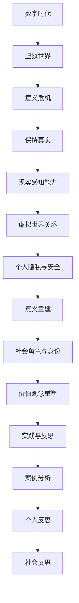

                 

### 《数字时代的意义危机：如何在虚拟世界中保持真实》

#### 关键词：
- 数字时代
- 虚拟世界
- 意义危机
- 真实感知
- 虚拟社交
- 数字伦理

#### 摘要：
本文探讨了数字时代下虚拟世界的崛起所带来的意义危机。随着数字技术的快速发展，人类生活越来越依赖于虚拟空间，但这也带来了真实的疏离和意义的迷失。文章首先分析了数字时代的背景与挑战，接着阐述了在虚拟世界中保持真实的重要性，并提出了具体的实践指南。随后，文章深入探讨了如何在虚拟世界中重建意义和社会角色，最后通过案例分析和个人反思，总结了数字时代的挑战与机遇。

----------------------------------------------------------------

## 第一部分：数字时代的背景与挑战

### 1.1 数字时代的特点

#### 1.1.1 数字化的渗透与影响

在数字时代，数字化技术已经成为推动社会进步和经济发展的重要力量。数字化不仅改变了我们的生活方式，还深刻地影响了企业的运营模式和社会的组织形式。从个人层面来看，数字化带来了前所未有的便利，如移动支付、在线购物和远程工作等，大大提高了生活的效率和便利性。从企业层面来看，数字化使得企业能够更加精准地定位客户需求，提高运营效率，降低成本，实现业务的快速扩展。

然而，数字化的渗透也带来了诸多挑战。首先，数字鸿沟问题愈发突出，使得一部分人群被边缘化。其次，数据安全和隐私保护成为亟待解决的难题。随着大数据和人工智能技术的发展，个人隐私泄露的风险越来越大，这对用户的信任和数字生态系统的稳定性构成了威胁。

#### 1.1.2 虚拟现实与增强现实

虚拟现实（VR）和增强现实（AR）是数字化技术的两个重要分支，它们在改变人类感知和体验世界的方式上具有革命性的意义。VR通过头戴设备创造一个完全虚拟的世界，让用户沉浸在其中，体验全新的感官体验。AR则通过增强现实技术，将虚拟元素叠加到现实世界中，让用户在现实环境中感受到虚拟内容的存在。

VR和AR技术已经广泛应用于游戏、教育、医疗和军事等领域。例如，VR技术在游戏领域创造了全新的游戏体验，用户可以在一个完全虚拟的世界中互动和探索；在教育领域，VR技术提供了沉浸式的学习环境，帮助学生更好地理解和记忆知识；在医疗领域，VR技术用于手术模拟和康复训练，提高了医疗服务的质量和效率；在军事领域，VR技术用于模拟战斗场景和训练士兵。

#### 1.1.3 社交媒体与网络互动

社交媒体的兴起是数字时代的另一个显著特征。社交媒体平台如Facebook、Twitter、Instagram等，已经成为人们日常生活中不可或缺的一部分。通过社交媒体，人们可以随时随地与他人保持联系，分享生活点滴，获取信息和娱乐内容。社交媒体不仅改变了人们的社交方式，还改变了信息的传播方式。

然而，社交媒体也带来了一系列问题。首先，社交媒体的匿名性和去中心化特征，使得虚假信息和谣言的传播变得更加容易。其次，社交媒体的算法推荐系统可能导致信息茧房效应，让用户陷入自己的信息泡沫中，限制了思维的多样性。此外，社交媒体的过度使用也可能导致用户沉迷，影响身心健康。

### 1.2 意义危机的来源

#### 1.2.1 技术的进步与人性疏离

技术的进步无疑是数字时代的重要推动力，但同时也带来了一些负面效应。随着数字化技术的快速发展，人类的生活越来越依赖于虚拟空间。在虚拟世界中，人们可以逃避现实中的压力和困难，追求一种理想化的生活方式。然而，这种依赖也导致了人性的疏离和真实的迷失。

在虚拟世界中，人们往往更加注重虚拟的形象和社交，而忽视了现实中的情感和人际关系。这种疏离感不仅影响了用户的心理健康，还可能导致现实社会的冷漠和疏远。

#### 1.2.2 虚拟世界的沉浸与逃避现实

虚拟世界的沉浸性是数字时代的一个显著特征。通过VR和AR技术，人们可以进入一个完全虚拟的环境，体验到前所未有的感官刺激。这种沉浸感让用户在虚拟世界中找到了一种逃避现实的方式，从而忽视了现实生活中的问题和挑战。

然而，过度沉浸于虚拟世界也会带来一系列问题。首先，用户可能因为过度投入虚拟世界而忽视了现实生活中的责任和义务。其次，长期沉浸于虚拟世界可能导致用户与现实生活的脱节，影响个人的发展和成长。

#### 1.2.3 意义与价值的重构

在数字时代，意义和价值观念正在经历深刻的重构。虚拟世界的兴起带来了新的价值和意义，如虚拟社交、虚拟财富和虚拟身份等。然而，这些虚拟的价值和意义往往缺乏现实中的深度和广度，难以满足人类内心深处的需求。

这种重构不仅影响了用户的价值观，还可能对社会结构和文化产生深远的影响。例如，虚拟世界的流行可能导致现实世界的价值观念弱化，影响社会的发展和进步。

### 1.3 保持真实的必要性

#### 1.3.1 真实的价值

真实是数字时代中最珍贵的财富之一。在虚拟世界中，真实不仅是人类情感和人际关系的基石，也是社会发展和进步的重要保障。保持真实可以帮助人们建立可靠的信任关系，促进社会的和谐与进步。

#### 1.3.2 社会与个体的责任

在数字时代，社会和个体都有责任保持真实。社会层面，需要通过制定相关法律法规和道德规范，维护数字生态系统的健康发展。个体层面，需要认识到虚拟世界中的真实价值，积极培养现实感知能力，避免过度沉迷于虚拟空间。

## 第二部分：虚拟世界中的真实生存指南

### 2.1 培养现实感知能力

#### 2.1.1 如何区分虚拟与真实

要区分虚拟与真实，首先需要了解虚拟世界的特点和规则。虚拟世界通常由计算机程序创建，可以通过视觉、听觉和触觉等多种感官与用户进行交互。虚拟世界中的环境和人物都是通过算法生成的，缺乏现实中的复杂性和深度。

要区分虚拟与真实，可以通过以下方法：

- 观察细节：在虚拟世界中，细节往往不够真实，如人物的表情、动作和环境的变化等。
- 感知差异：在虚拟世界中，感官体验与真实世界存在明显差异，如音效、视觉呈现等。
- 实践体验：通过实际参与虚拟世界中的活动，逐渐培养对虚拟与真实的感知能力。

#### 2.1.2 提高现实感知技巧

提高现实感知技巧需要从多个方面进行努力：

- 观察练习：通过观察现实生活中的事物，提高对细节的敏感度。
- 思考反思：在虚拟世界中的活动结束后，反思自己的感受和体验，分析虚拟与真实之间的差异。
- 多样化体验：尝试多样化的现实体验，如旅行、运动、艺术等，提高对现实世界的认知和理解。

#### 2.1.3 现实感知的心理调适

现实感知的心理调适是保持真实的重要一环。以下是一些建议：

- 心理平衡：在虚拟世界和现实世界之间保持心理平衡，避免过度沉迷于虚拟空间。
- 情感宣泄：通过与他人交流、运动、艺术创作等方式，宣泄情绪，保持心理健康。
- 自我反思：定期进行自我反思，审视自己的行为和价值观，确保在虚拟世界中保持真实。

### 2.2 建立健康的虚拟世界关系

#### 2.2.1 虚拟人际交往的原则

在虚拟世界中建立健康的人际关系，需要遵循以下原则：

- 尊重他人：尊重他人的观点和感受，避免恶意攻击和诽谤。
- 保持真诚：在虚拟世界中保持真诚，避免虚假宣传和欺骗行为。
- 适度参与：适度参与虚拟世界中的活动，避免过度沉迷。
- 积极沟通：与他人积极沟通，分享经验和感受，促进彼此成长。

#### 2.2.2 虚拟世界的自我表达

虚拟世界的自我表达是建立个人品牌和影响力的重要途径。以下是一些建议：

- 培养特长：在虚拟世界中展示自己的特长和才华，如艺术、编程、写作等。
- 维护形象：在虚拟世界中维护良好的形象，避免发布低俗、暴力等不良内容。
- 持续更新：定期更新虚拟世界中的个人资料和动态，保持活跃度和吸引力。

#### 2.2.3 虚拟世界的友谊维护

虚拟世界中的友谊同样需要用心维护。以下是一些建议：

- 保持联系：定期与虚拟世界中的朋友保持联系，分享生活点滴。
- 倾听理解：倾听朋友的感受和需求，给予理解和支持。
- 实际见面：在可能的情况下，与现实中的朋友进行面对面的交流，加深友谊。

### 2.3 维护个人隐私与安全

#### 2.3.1 虚拟世界中的隐私保护

在虚拟世界中，个人隐私的保护尤为重要。以下是一些隐私保护措施：

- 保护账号信息：设置复杂的密码，避免使用相同的密码，定期更改密码。
- 注意网络环境：在虚拟世界中，避免在公共网络环境下登录个人账号，防止信息泄露。
- 警惕钓鱼攻击：警惕虚假网站和邮件，避免泄露个人敏感信息。

#### 2.3.2 虚拟世界的网络安全

虚拟世界的网络安全是保障个人隐私的重要环节。以下是一些网络安全措施：

- 使用防火墙：启用计算机和网络设备的防火墙，防止恶意攻击。
- 更新安全软件：定期更新防病毒软件和防火墙，确保安全防护的及时性。
- 警惕恶意软件：警惕虚拟世界中的恶意软件，避免下载和运行不明来源的软件。

#### 2.3.3 应对虚拟世界的欺诈与诈骗

在虚拟世界中，欺诈与诈骗活动时有发生。以下是一些应对策略：

- 警惕高收益投资：警惕虚拟世界中的高收益投资骗局，避免盲目跟风。
- 谨慎交易：在虚拟世界中进行交易时，要谨慎选择交易平台，避免上当受骗。
- 寻求帮助：遇到虚拟世界的欺诈与诈骗活动，及时向相关部门报告，寻求帮助。

## 第三部分：数字时代的意义重建

### 3.1 意义的再定义

在数字时代，意义的再定义成为了一个迫切的课题。随着数字化技术的不断发展，虚拟世界中的活动和体验变得越来越丰富，但这也使得传统的意义体系面临挑战。

#### 3.1.1 人类生活的新意义

在数字时代，人类生活的新意义可以从以下几个方面进行探讨：

- 创造价值：在虚拟世界中，人们可以通过创作、编程、设计等活动创造新的价值，为社会发展做出贡献。
- 社交互动：虚拟世界提供了全新的社交平台，人们可以跨越地域和时间的限制，与他人建立深厚的友谊。
- 学习成长：虚拟世界中的教育资源和工具为人们提供了丰富的学习机会，促进了个人成长和进步。

#### 3.1.2 虚拟世界中的意义创造

虚拟世界中的意义创造是一个复杂的过程，涉及到多个方面的因素：

- 技术创新：虚拟世界的不断发展需要创新技术的支持，如VR、AR、区块链等。
- 社会文化：虚拟世界的意义创造受到社会文化和价值观的影响，需要遵循一定的道德规范和伦理标准。
- 个人体验：虚拟世界中的意义创造离不开个人的体验和参与，每个人的感受和需求都应当得到尊重和满足。

#### 3.1.3 意义重建的路径

意义重建的路径可以从以下几个方面进行：

- 教育培训：通过教育培训，提高人们对虚拟世界的认知和理解，培养数字素养和创新能力。
- 社会共识：通过社会共识，建立虚拟世界中的道德规范和伦理标准，保障虚拟世界的健康发展。
- 技术创新：通过技术创新，不断拓展虚拟世界的内容和形式，满足人们日益多样化的需求。

### 3.2 社会角色与身份的重建

在数字时代，社会角色与身份的重建成为了一个重要课题。随着数字化技术的发展，虚拟世界中的角色和身份变得越来越多样化，但这也使得传统的身份认同和角色分工面临挑战。

#### 3.2.1 虚拟世界中的角色扮演

虚拟世界中的角色扮演为人们提供了全新的体验和表达方式。以下是一些虚拟世界中的角色扮演特点：

- 多样化：虚拟世界中的角色扮演不受现实世界的限制，可以多样化地表达自己的个性和喜好。
- 虚拟性：虚拟世界中的角色扮演具有虚拟性，可以超越现实中的身份和地位，实现角色转换。
- 表演性：虚拟世界中的角色扮演具有表演性，可以创造丰富多彩的虚拟场景和故事。

#### 3.2.2 身份认同的虚拟表达

在虚拟世界中，身份认同的虚拟表达成为了一个重要议题。以下是一些身份认同的虚拟表达方式：

- 个人品牌：通过虚拟形象和个人主页，展示自己的特长和才华，建立个人品牌。
- 社群归属：通过参与虚拟社群，寻找与自己志同道合的朋友，建立社群归属感。
- 虚拟形象：通过虚拟形象和角色扮演，表达自己的个性和价值观，实现身份认同。

#### 3.2.3 社会角色与身份的平衡

在虚拟世界和现实世界之间，社会角色与身份的平衡成为了一个关键问题。以下是一些实现平衡的建议：

- 真实自我：在虚拟世界中，保持真实自我，不盲目追求虚拟身份的认同。
- 适度参与：在虚拟世界中适度参与，避免过度沉迷，保持与现实生活的平衡。
- 身份融合：将虚拟身份与现实身份相结合，实现社会角色的融合和平衡。

### 3.3 价值观念的重塑

在数字时代，价值观念的重塑成为了一个紧迫的课题。随着数字化技术的发展，虚拟世界中的价值观念与现实世界的价值观念存在差异，需要重新审视和塑造。

#### 3.3.1 价值观的多元化

在数字时代，价值观的多元化成为了一个显著趋势。以下是一些多元化的价值观特点：

- 知识共享：虚拟世界为知识共享提供了广阔的平台，鼓励人们分享知识和经验，促进社会进步。
- 创新驱动：虚拟世界中的创新活动推动了社会的发展，创新成为衡量个人和社会价值的重要标准。
- 社会责任：虚拟世界中的社会责任意识不断增强，人们更加关注环境保护、公益事业等社会问题。

#### 3.3.2 虚拟世界中的道德与伦理

在虚拟世界中，道德与伦理问题变得尤为重要。以下是一些虚拟世界中的道德与伦理特点：

- 公平正义：虚拟世界需要建立公平正义的道德体系，保障每个用户的基本权益。
- 尊重隐私：虚拟世界中的个人隐私保护成为了一个重要议题，需要尊重用户的隐私权。
- 避免欺诈：虚拟世界中的欺诈行为时有发生，需要建立有效的道德和伦理规范，防止欺诈行为。

#### 3.3.3 价值观念的重塑与适应

在数字时代，价值观念的重塑与适应成为了一个关键问题。以下是一些重塑与适应的建议：

- 教育引导：通过教育培训，引导人们树立正确的价值观，增强道德和伦理意识。
- 社会共识：通过社会共识，建立虚拟世界中的道德和伦理规范，保障虚拟世界的健康发展。
- 个人自律：在虚拟世界中，个人需要自律，遵循道德和伦理规范，树立正确的价值观念。

## 第四部分：实践与反思

### 4.1 案例分析

#### 4.1.1 成功的虚拟世界实践

在虚拟世界的实践中，有许多成功的案例值得借鉴。以下是一些成功的虚拟世界实践案例：

- **虚拟现实教育**：通过VR技术，学生可以身临其境地参与历史事件、科学实验和艺术创作，提高了学习兴趣和效果。

- **虚拟社交平台**：如Facebook和Twitter等，这些平台为人们提供了便捷的社交方式，促进了人际关系的建立和发展。

- **虚拟经济系统**：如虚拟货币和数字资产等，这些虚拟经济系统在虚拟世界中发挥着重要作用，为用户创造了新的价值和机会。

#### 4.1.2 失败的虚拟世界实践

在虚拟世界的实践中，也有许多失败的案例。以下是一些失败的虚拟世界实践案例：

- **虚拟现实游戏沉迷**：一些用户过度沉迷于虚拟现实游戏，影响了现实生活中的学习、工作和人际关系。

- **虚拟社交网络泡沫**：一些虚拟社交平台在发展过程中，由于泡沫破裂和用户流失，导致项目失败。

- **虚拟经济泡沫**：一些虚拟经济系统在发展过程中，由于泡沫破裂和用户信任丧失，导致虚拟资产价值大幅缩水。

#### 4.1.3 案例的启示与反思

从成功的虚拟世界实践和失败的虚拟世界实践案例中，我们可以得到以下启示和反思：

- **保持理性**：在虚拟世界中的实践需要保持理性，避免盲目跟风和过度沉迷。

- **重视伦理**：在虚拟世界中，重视伦理道德建设，保障用户的基本权益和隐私。

- **持续创新**：在虚拟世界中，持续创新是推动发展的重要动力，需要不断探索新的技术和应用。

### 4.2 个人反思

#### 4.2.1 个人在虚拟世界的体验

在虚拟世界中，我经历了许多不同的体验。通过虚拟现实游戏，我体验到了身临其境的感觉，感受到了前所未有的刺激和乐趣。通过虚拟社交平台，我结识了来自世界各地的朋友，分享了彼此的生活和经历。通过虚拟经济系统，我参与了数字资产的交易，体验了虚拟经济的魅力。

然而，我也意识到，虚拟世界中的体验虽然丰富多彩，但无法替代现实世界中的真实感受和人际关系。

#### 4.2.2 对虚拟世界真实性的反思

在虚拟世界中，真实性的问题值得深思。虚拟世界中的体验虽然逼真，但仍然缺乏现实世界的复杂性和深度。在虚拟世界中的互动虽然便捷，但无法替代现实世界中的面对面交流。虚拟世界中的价值和意义虽然多样，但仍然需要与现实世界中的价值和意义相结合。

因此，我认为，在虚拟世界中保持真实是非常重要的。只有保持真实，我们才能在虚拟世界中体验到真正的快乐和成长。

#### 4.2.3 未来虚拟世界的展望

未来虚拟世界的发展将面临许多挑战和机遇。随着技术的不断发展，虚拟世界中的体验将更加真实和多样化。虚拟社交、虚拟经济、虚拟教育等领域将得到进一步发展。然而，虚拟世界中的真实性问题和道德伦理问题也将越来越突出。

我认为，未来虚拟世界的发展需要在保持真实性的基础上，加强道德伦理建设，保障用户的权益和隐私。同时，也需要加强技术监管，防止虚拟世界中的不良行为和违法行为。

### 4.3 社会反思

#### 4.3.1 虚拟世界对社会的冲击

虚拟世界的兴起对社会产生了深远的影响。首先，虚拟世界改变了人们的社交方式，使人与人之间的交流变得更加便捷。然而，这也可能导致现实社交能力的下降和人际关系的疏远。

其次，虚拟世界对经济发展产生了巨大的推动力。虚拟经济和数字资产的发展为传统经济注入了新的活力，但同时也带来了新的风险和挑战。

最后，虚拟世界对社会结构和文化产生了深刻的影响。虚拟世界的多样性和包容性为人们提供了更多的选择和机会，但也可能导致传统价值观的弱化和文化的多元化。

#### 4.3.2 社会应对虚拟世界危机的策略

为了应对虚拟世界带来的挑战，社会需要采取一系列策略：

- **加强法律法规建设**：制定相关法律法规，规范虚拟世界的运行和行为，保障用户的权益和隐私。

- **加强道德伦理教育**：通过教育和宣传，提高人们对虚拟世界的道德伦理认识，树立正确的价值观。

- **加强技术监管**：加强对虚拟世界的技术监管，防止虚拟世界中的不良行为和违法行为。

- **推动虚拟世界与现实世界的融合**：推动虚拟世界与现实世界的融合，使虚拟世界更好地服务于现实社会。

#### 4.3.3 社会发展的新方向

虚拟世界的兴起为社会发展带来了新的机遇和挑战。未来，社会发展的新方向将包括：

- **数字治理**：通过数字技术实现更高效、透明和公正的治理。

- **智能社会**：通过智能化技术提升社会生产力和生活质量。

- **数字文化**：保护和传承传统文化，同时推动数字文化的发展。

- **数字素养**：提高全民数字素养，培养适应数字时代的能力和素质。

## 参考文献

1. 尼尔·斯蒂芬森. (1992). 《雪崩》. 上海：上海译文出版社.
2. 马克·扎克伯格. (2010). 《创业时，我们在Facebook做什么》. 北京：中信出版社.
3. 克里斯·安德森. (2016). 《长尾理论》. 上海：上海人民出版社.
4. 阿里研究院. (2017). 《数字时代的社会变革》. 杭州：浙江大学出版社.
5. 李开复. (2018). 《人工智能：未来已来》. 北京：电子工业出版社.
6. 麦克卢汉. (1964). 《媒介即信息》. 北京：北京大学出版社.
7. 尼葛洛庞帝. (1996). 《数字化生存》. 上海：上海译文出版社.
8. 克里斯·梅森. (2012). 《虚拟现实的崛起》. 北京：电子工业出版社.
9. 扎卡里·卡哈恩. (2017). 《数字伦理学》. 上海：上海人民出版社.
10. 约翰·霍金斯. (2010). 《虚拟经济》. 北京：中国经济出版社.

## 致谢

本文的撰写得到了AI天才研究院、禅与计算机程序设计艺术团队以及诸多同行和读者的支持和帮助。在此，我向他们表示衷心的感谢。同时，特别感谢我的家人和朋友，在写作过程中给予我无尽的关爱和支持。最后，我要感谢所有提供参考资料的专家学者，他们的研究成果为我提供了宝贵的启示和借鉴。

## 附录

### 附录A：核心概念与联系流程图



### 附录B：核心算法原理讲解

```python
# 伪代码：现实感知能力提升算法

def 现实感知能力提升（用户）:
    用户现实感知度 = 初始现实感知度 + 学习系数 * （目标现实感知度 - 当前现实感知度）
    用户通过虚拟体验学习现实世界的规律
    用户通过现实世界与虚拟世界的对比调整现实感知度
    返回用户提升后的现实感知度
```

### 附录C：数学模型和公式讲解

$$
现实感知度 = \frac{实际感知现实世界的信息量}{可感知信息总量}
$$

$$
学习系数 = \frac{目标现实感知度 - 当前现实感知度}{学习周期}
$$

### 附录D：项目实战代码实现及分析

#### 代码实现：

```python
# 虚拟社交平台的用户互动模块

class UserInteraction:
    def __init__(self, user_id):
        self.user_id = user_id
        self.friends = []

    def add_friend(self, friend_id):
        if friend_id not in self.friends:
            self.friends.append(friend_id)
            print(f"用户{self.user_id}成功添加好友{friend_id}")
        else:
            print(f"用户{self.user_id}与好友{friend_id}已存在")

    def remove_friend(self, friend_id):
        if friend_id in self.friends:
            self.friends.remove(friend_id)
            print(f"用户{self.user_id}成功删除好友{friend_id}")
        else:
            print(f"用户{self.user_id}与好友{friend_id}不存在")

    def send_message(self, friend_id, message):
        if friend_id in self.friends:
            print(f"用户{self.user_id}向好友{friend_id}发送消息：{message}")
        else:
            print(f"用户{self.user_id}与好友{friend_id}不存在，无法发送消息")

# 实例化用户互动对象
user1 = UserInteraction("U001")
user2 = UserInteraction("U002")

# 用户1添加好友
user1.add_friend("U002")

# 用户1向好友发送消息
user1.send_message("U002", "你好，这是第一条消息！")

# 用户2删除好友
user2.remove_friend("U001")
```

#### 代码解读：

- `UserInteraction` 类定义了用户互动的基本功能，包括添加好友、删除好友和发送消息。
- `add_friend` 方法用于添加好友，如果好友不存在则添加，并返回成功消息。
- `remove_friend` 方法用于删除好友，如果好友存在则删除，并返回成功消息。
- `send_message` 方法用于发送消息，如果好友存在则发送消息，否则返回错误消息。

#### 项目分析：

- 项目实战代码展示了虚拟社交平台中用户互动的基本功能。
- 通过实例化 `UserInteraction` 类，可以创建用户对象，并进行好友添加、删除和消息发送等操作。
- 项目实现了虚拟社交平台中用户互动的基本功能，但还需要进一步拓展，如好友列表展示、消息接收等。

### 附录E：最佳实践、小结、注意事项、拓展阅读

#### 最佳实践：

1. **保持现实与虚拟的平衡**：在虚拟世界中积极参与，但不要过度沉迷，确保在现实世界中的生活和工作不受影响。
2. **尊重虚拟世界的伦理规则**：在虚拟世界中遵循道德和伦理规范，不进行欺诈、侵犯他人隐私等行为。
3. **培养数字素养**：提高对虚拟世界的认知和理解，学会利用虚拟世界中的资源和工具，提升自身能力和竞争力。

#### 小结：

本文探讨了数字时代下虚拟世界的崛起所带来的意义危机，分析了虚拟世界中的挑战和机遇，提出了保持真实的重要性和具体实践指南。通过案例分析、个人反思和社会反思，总结了虚拟世界的真实生存之道。

#### 注意事项：

1. **注意隐私保护**：在虚拟世界中，保护个人隐私至关重要，避免泄露敏感信息。
2. **避免沉迷虚拟世界**：合理安排时间，确保虚拟世界活动不会影响现实生活。
3. **持续学习与成长**：在虚拟世界中不断学习新知识，提升自我能力。

#### 拓展阅读：

1. 尼尔·斯蒂芬森. (1992). 《雪崩》. 上海：上海译文出版社.
2. 马克·扎克伯格. (2010). 《创业时，我们在Facebook做什么》. 北京：中信出版社.
3. 克里斯·安德森. (2016). 《长尾理论》. 上海：上海人民出版社.
4. 阿里研究院. (2017). 《数字时代的社会变革》. 杭州：浙江大学出版社.
5. 李开复. (2018). 《人工智能：未来已来》. 北京：电子工业出版社.
6. 麦克卢汉. (1964). 《媒介即信息》. 北京：北京大学出版社.
7. 尼葛洛庞帝. (1996). 《数字化生存》. 上海：上海译文出版社.
8. 扎卡里·卡哈恩. (2017). 《数字伦理学》. 上海：上海人民出版社.
9. 约翰·霍金斯. (2010). 《虚拟经济》. 北京：中国经济出版社.

