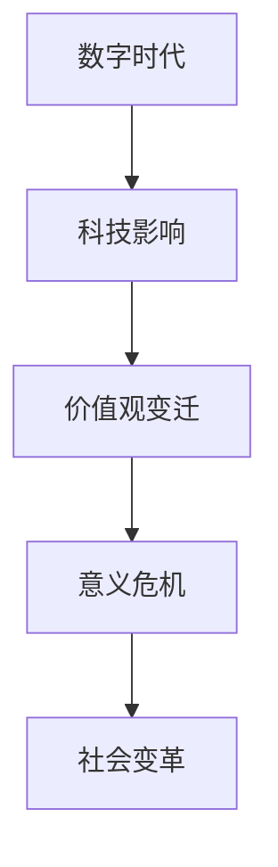

                 


# 数字时代的意义危机：科技如何影响我们的价值观

> 关键词：数字时代、科技影响、价值观、意义危机、算法、网络成瘾

> 摘要：本文深入探讨了数字时代科技对人类价值观的影响，分析意义危机的起源和演变，提出应对策略。通过理论讲解、案例分析和算法描述，揭示了科技在塑造现代社会价值观方面的双重作用。

----------------------------------------------------------------

## 第一部分：引言与背景

### 第1章：数字时代的特征与价值观

#### 1.1 数字时代的定义与演变

随着互联网的普及和信息技术的迅猛发展，我们正处在一个全新的数字时代。这一时代不仅改变了我们的生活方式，也对我们的价值观产生了深远的影响。数字时代指的是以数字技术为核心，信息传输和处理高度依赖计算机和网络的时代。

从20世纪末以来，数字技术的进步日新月异，智能手机、社交媒体、云计算和人工智能等技术的广泛应用，使得我们的生活发生了翻天覆地的变化。这种变化不仅体现在日常生活中，也深刻影响着我们的工作、学习和社会交往。

在数字时代，科技对价值观的影响主要体现在以下几个方面：

1. **信息获取的便捷性**：互联网使得信息传播的速度和范围大大增加，人们可以轻松获取全球范围内的新闻和信息。然而，这种便捷性也带来了一定的负面影响，比如信息过载和虚假信息的泛滥。

2. **社交方式的改变**：社交媒体的兴起改变了人们的社交方式，使得人与人之间的联系更加紧密。然而，过度依赖社交媒体也可能导致现实社交能力的下降和人际关系的疏离。

3. **消费观念的转变**：数字时代使得消费变得更加便捷，也催生了消费主义文化的蔓延。人们越来越容易陷入消费主义的陷阱，追求物质享受而忽视精神层面的需求。

#### 1.2 科技对价值观的深远影响

科技对价值观的影响是双重的，一方面，科技为人类创造了前所未有的便利和机会；另一方面，科技也可能对价值观产生负面影响。

首先，科技的发展提高了生产效率和生活质量，为人类带来了巨大的物质财富。这使得人们有更多的机会追求个人的梦想和价值观，同时也促进了社会的发展和进步。

然而，科技的发展也带来了一些问题。例如，互联网的普及使得信息过载成为一个普遍现象，人们往往无法处理海量的信息，导致焦虑和压力的增加。此外，社交媒体的兴起也改变了人们的社交习惯，使得人与人之间的交往变得更加表面化和短暂。

#### 1.3 意义危机的起源与发展

意义危机是指人们在面对快速变化的数字时代时，感到价值观和人生意义的迷失和困惑。这种危机的起源可以追溯到几个方面：

1. **科技的快速发展**：科技的快速发展使得人们的生活节奏加快，人们的注意力被不断分散，难以集中精力思考更深层次的问题。

2. **消费主义文化的蔓延**：消费主义文化强调物质享受和短期满足，忽视精神层面的需求，导致人们在追求物质的同时失去了对意义的思考。

3. **社会压力的增加**：在数字时代，社会竞争压力增大，人们对成功的定义变得单一和功利，这使得很多人在追求成功的道路上感到迷茫和困惑。

意义危机的发展不仅对个人的心理健康产生负面影响，也对社会整体价值观产生冲击。因此，如何应对意义危机成为了一个亟待解决的问题。

### Mermaid 流�程图



在接下来的章节中，我们将进一步探讨科技如何影响我们的价值观，以及如何应对数字时代的意义危机。

----------------------------------------------------------------

## 第二部分：科技与价值观

### 第2章：科技对个人价值观的冲击

#### 2.1 社交媒体的效应

社交媒体在数字时代扮演了重要角色，它不仅改变了人们的社交方式，也对个人价值观产生了深远的影响。社交媒体平台如Facebook、Twitter和微信等，使得人们可以轻松地与朋友、家人和同事保持联系。然而，社交媒体的效应也是双重的。

首先，社交媒体增强了人们的社交网络，促进了人际关系的维系和发展。人们可以通过社交媒体分享生活点滴、交流意见和获取信息，这种便捷的社交方式使得人与人之间的距离变得更加接近。

然而，社交媒体的负面影响也不容忽视。首先，社交媒体容易导致信息过载，人们无法处理海量的信息，导致焦虑和压力的增加。其次，社交媒体上的虚假信息和虚假宣传可能误导人们的判断和价值观。此外，社交媒体上的“形象管理”现象也使得人们过于关注自我形象的呈现，而忽视了真实的自我。

#### 2.2 算法推荐的伦理问题

算法推荐是数字时代的一项重要技术，它通过分析用户的行为和偏好，为用户提供个性化的内容推荐。然而，算法推荐也引发了一系列伦理问题。

首先，算法推荐可能导致信息茧房效应，即用户只看到自己喜欢和认同的信息，而忽视了其他观点和意见。这种效应可能导致用户的思想和价值观的狭隘化，限制了思维的多样性。

其次，算法推荐可能引发隐私泄露问题。为了实现个性化的推荐，算法需要收集和分析用户的个人数据，这可能导致用户的隐私受到侵犯。

此外，算法推荐还可能引发社会不公问题。例如，某些群体可能因为算法的偏见而受到歧视，这可能导致社会矛盾的加剧。

#### 2.3 科技对教育的影响

科技在教育领域的应用也极大地改变了人们的价值观。在线教育平台、智能教学系统和电子学习资源等，使得教育资源更加丰富和便捷。然而，科技对教育的影响也是双重的。

首先，科技使得教育更加普及和灵活。人们可以随时随地通过互联网获取知识，这种灵活的学习方式为更多人提供了教育机会。

然而，科技对教育的影响也带来了一些问题。首先，在线教育可能加剧教育不公平现象。由于互联网接入和技术设备的不平等，一些学生可能无法享受到优质的教育资源。其次，科技教学可能导致教育质量的下降。过度依赖科技教学可能导致教师与学生之间的互动减少，影响教育的实际效果。

#### 2.4 科技与消费主义

科技的发展也催生了消费主义文化的蔓延。电子商务平台、移动支付技术和个性化推荐算法等，使得消费变得更加便捷和个性化。然而，科技与消费主义的结合也带来了一些负面影响。

首先，科技使得消费更加便利，但可能导致人们更容易陷入消费主义的陷阱。人们可以通过网络购物轻易购买大量商品，但这种消费行为可能加剧资源浪费和环境污染。

其次，科技与消费主义的结合也可能导致价值观的扭曲。人们可能更加关注物质享受和短期满足，而忽视了精神层面的需求。这种价值观的扭曲可能导致人们在追求物质的同时失去了对生活的意义和价值的思考。

### 伪代码

```python
# 社交媒体效应分析
def analyze_social_media_impact(user_activity, social_norms):
    # 计算用户对社交平台的依赖度
    dependency_score = calculate_dependency(user_activity)
    
    # 分析用户行为与社交规范的符合度
    compliance_score = compare_activity_to_norms(user_activity, social_norms)
    
    # 输出价值观变迁预测
    return predict_value_change(dependency_score, compliance_score)
```

在下一章节中，我们将进一步探讨数字时代意义危机的起源和演变。

----------------------------------------------------------------

## 第三部分：意义危机的探讨

### 第3章：数字平台的角色与影响

#### 3.1 数字平台对意义危机的推动作用

数字平台在现代社会中扮演着越来越重要的角色，它们不仅是信息传播和交流的重要渠道，也是塑造人们价值观的重要力量。然而，数字平台的发展也带来了意义危机的加剧。

首先，数字平台使得信息传播更加迅速和广泛，人们可以随时随地获取海量的信息。然而，这种信息过载现象导致人们难以消化和理解信息，从而感到迷茫和困惑。

其次，数字平台上的社交媒体和虚拟社区改变了人们的社交方式，使得人与人之间的联系变得更加表面化和短暂。人们在数字平台上追求虚拟的社交互动，而忽视了真实的人际关系和情感交流，这可能导致人们在现实生活中感到孤独和失落。

此外，数字平台上的算法推荐和个性化内容可能加剧信息茧房效应，使得人们只接触到与自己观点相似的言论和信息，限制了思维和价值观的多元化发展。

#### 3.2 网络成瘾与意义危机

网络成瘾是指个体对互联网的过度依赖和沉迷，导致其日常生活、工作和学习受到严重影响。网络成瘾不仅是一种行为问题，也与意义危机密切相关。

首先，网络成瘾可能导致个体在现实生活中缺乏真实的人际互动和情感交流，从而感到孤独和失落。这种情感上的空虚可能导致人们更加沉迷于网络世界，形成恶性循环。

其次，网络成瘾可能导致个体对现实生活的逃避和放弃，从而失去对生活的热情和意义。长时间沉迷于网络游戏、社交媒体等虚拟活动，可能导致个体对现实生活的忽视，甚至影响身心健康。

此外，网络成瘾还可能导致个体价值观的扭曲，过度追求虚拟的成就和满足，而忽视现实生活中的真正价值和意义。

#### 3.3 个体在数字时代的心灵困境

数字时代给个体带来了前所未有的便利和机遇，但同时也带来了心灵困境。在数字时代，个体面临着信息过载、网络成瘾和意义危机等多重挑战。

首先，信息过载使得个体难以处理和理解海量的信息，导致焦虑和压力的增加。人们在面对信息选择时感到困惑和无从下手，这可能影响个体的决策和行动。

其次，网络成瘾使得个体在虚拟世界中寻求逃避和满足，而忽视了现实生活中的真正需求和追求。这种心理上的依赖可能导致个体对现实生活的失去兴趣和热情。

此外，意义危机使得个体在数字时代感到迷茫和困惑，失去了对生活意义的思考和追求。个体可能在追求物质享受和短期满足的过程中，忽视了精神层面的需求和价值观的塑造。

### 数学模型

$$
\text{网络成瘾度} = f(\text{使用时间}, \text{心理依赖度}, \text{社交网络密度})
$$

这个数学模型描述了网络成瘾度与使用时间、心理依赖度和社交网络密度之间的关系。使用时间越长，心理依赖度越高，社交网络密度越大，网络成瘾度就越高。

在下一章节中，我们将探讨应对数字时代意义危机的策略。

----------------------------------------------------------------

## 第四部分：应对策略

### 第4章：数字素养教育的重要性

#### 4.1 数字素养教育的目标

数字素养教育是指培养个体在数字时代中正确使用数字技术和信息的能力，以及形成健康数字生活方式的教育。其目标主要包括以下几个方面：

1. **提高数字技能**：数字素养教育应帮助个体掌握基本的数字技能，如计算机操作、互联网使用、网络安全等，使其能够有效地获取、处理和利用信息。

2. **培养信息素养**：数字素养教育应培养个体对信息的批判性思维和判断力，使其能够辨别信息真伪，避免被虚假信息误导。

3. **强化网络安全意识**：数字素养教育应提高个体对网络安全的认识，使其能够采取有效措施保护个人隐私和数据安全。

4. **促进数字化沟通**：数字素养教育应培养个体在数字环境中的沟通能力和协作能力，使其能够有效地参与数字社区和团队合作。

5. **塑造健康的数字生活方式**：数字素养教育应引导个体形成健康的数字生活方式，使其能够在享受数字技术带来便利的同时，保持对现实生活的关注和热爱。

#### 4.2 教育体系中的数字素养教育

数字素养教育应该贯穿于整个教育体系中，从基础教育到高等教育，都应设置相应的课程和活动，以培养学生的数字素养。以下是一些具体措施：

1. **基础教育阶段的数字素养教育**：在小学和初中阶段，应设置计算机基础课程，教授基本的计算机操作和互联网使用技巧。此外，可以通过主题活动和游戏，培养学生的网络安全意识和信息素养。

2. **高中阶段的数字素养教育**：在高中阶段，应深化数字素养教育，增加编程、数据分析和网络安全等课程内容，使学生能够掌握更多的数字技能，并培养其批判性思维和创新能力。

3. **高等教育阶段的数字素养教育**：在高等教育阶段，应设置数字素养相关的专业课程，如数字媒体、人工智能和数据科学等，培养学生的专业能力和科研能力。此外，还可以通过实践活动和项目研究，提升学生的实际操作能力和创新能力。

#### 4.3 家庭与社会的角色

家庭和社会在数字素养教育中同样扮演着重要角色。家庭是孩子的第一所学校，家长应积极参与孩子的数字素养教育，以身作则，引导孩子正确使用数字技术和信息。

1. **家庭教育**：家长应关注孩子的数字使用情况，定期与孩子交流，了解其在数字环境中的经历和困惑。家长可以通过讲故事、做游戏等方式，培养孩子的数字技能和信息安全意识。

2. **社会教育**：社会应提供多样化的数字素养教育资源，如线上课程、公益活动和工作坊等，为不同年龄段和背景的个体提供学习和交流的机会。此外，政府和企业也应承担社会责任，通过政策引导和资金支持，推动数字素养教育的普及和发展。

#### 4.4 数字素养教育实践案例

以下是一些数字素养教育的实践案例：

1. **小学主题课程**：某小学开设了“数字生活小课堂”，通过游戏和实践活动，教授学生基本的计算机操作和网络安全知识，培养学生的信息素养和批判性思维。

2. **高中编程课程**：某高中引入了编程课程，学生通过学习编程语言和算法，提高了计算机技能和创新能力。此外，学校还组织了编程比赛和项目实践，激发学生的兴趣和潜力。

3. **社区公益项目**：某社区推出了“数字素养公益培训”，为社区居民提供免费的数字技能培训，帮助他们掌握基本的计算机操作和网络使用技巧，提高生活质量。

4. **企业社会责任**：某科技公司推出了“数字素养公益计划”，通过在线课程和线下培训，为偏远地区的孩子提供数字素养教育，帮助他们融入数字时代。

通过这些实践案例，我们可以看到数字素养教育在培养个体数字技能和信息素养方面的重要作用。在下一章节中，我们将探讨数字素养教育的最佳实践和注意事项。

----------------------------------------------------------------

### 4.4 数字素养教育实践案例

数字素养教育的实践案例展示了这一教育理念在实际操作中的应用和效果。以下是一些具体的实践案例：

**案例1：小学主题课程**  
某小学开设了一门名为“数字生活小课堂”的主题课程。课程内容涵盖了计算机基础知识、网络安全知识和基本互联网使用技巧。通过动手实践，孩子们学习了如何安全地浏览网页、使用电子邮件以及如何在社交媒体上保护自己。课程还采用了互动教学法和游戏化学习，使孩子们在轻松愉快的氛围中掌握数字技能。

**案例2：高中编程课程**  
某高中引入了编程课程，目的是培养学生的计算机编程能力和逻辑思维能力。课程不仅教授编程语言，还涉及算法、数据结构和软件工程等概念。学生通过编写实际的编程项目，如开发小游戏或网站，将理论知识应用到实践中。学校还组织了编程竞赛和科技展览会，为学生提供展示自己作品的平台，激发他们的学习兴趣和创造力。

**案例3：社区公益项目**  
某社区推出了“数字素养公益培训”项目，为社区居民提供免费的数字技能培训。培训内容涵盖了基本的计算机操作、互联网使用技巧以及网络安全知识。项目通过每周一次的讲座和互动课程，帮助中老年人掌握基本的数字技能，使其能够更好地适应数字化时代的生活。

**案例4：企业社会责任**  
某科技公司认识到数字素养教育的重要性，推出了“数字素养公益计划”。该项目为偏远地区的学校提供计算机设备和在线课程资源，同时派遣专业技术人员到当地进行现场培训。通过这种方式，学生不仅能够接触到先进的计算机设备，还能够获得高质量的数字素养教育，为他们的未来打下坚实的基础。

**案例5：高校创新创业实验室**  
某高校建立了创新创业实验室，鼓励学生将数字素养应用到实际项目中。实验室配备了先进的计算机设备和技术支持，学生可以在这里进行软件开发、数据分析等项目实践。学校还邀请了行业专家进行讲座和指导，帮助学生了解行业动态和市场需求，提高他们的实际操作能力和创新意识。

这些实践案例表明，数字素养教育不仅可以提高个体的数字技能，还能够促进其批判性思维、创新能力和团队合作精神。在下一章节中，我们将进一步探讨数字素养教育的最佳实践和注意事项。

### 最佳实践 Tips

1. **个性化教学**：根据学生的年龄、兴趣和学习能力，提供个性化的教学方案，使每个学生都能在适合自己的节奏中学习。

2. **跨学科整合**：将数字素养教育与其他学科相结合，如艺术、社会科学和自然科学，以促进学生的全面发展。

3. **实践活动**：通过实际操作和项目实践，让学生将理论知识应用到实际中，提高他们的动手能力和解决问题的能力。

4. **家校合作**：家庭和学校共同参与数字素养教育，形成教育合力，帮助学生更好地适应数字化生活。

5. **持续更新**：数字技术和信息环境不断变化，教育内容也应不断更新，确保学生能够掌握最新的数字技能和知识。

### 小结

数字素养教育是应对数字时代意义危机的重要手段。通过提供系统的数字素养教育，我们可以帮助个体更好地适应数字化生活，提高其数字技能和信息素养，从而减轻意义危机的影响。在下一章节中，我们将探讨数字素养教育的政策与法规制定。

----------------------------------------------------------------

### 4.5 政策与法规的制定

数字素养教育不仅仅是教育部门的责任，也需要政府、企业和全社会共同努力，通过政策与法规的制定来推动和保障数字素养教育的普及和发展。

#### **4.5.1 政府的角色**

1. **制定政策**：政府应制定全国性的数字素养教育政策，明确数字素养教育的目标、内容和方法，确保数字素养教育在国家层面得到全面推进。

2. **提供资金支持**：政府应加大对数字素养教育的资金投入，支持学校和社区开展数字素养教育活动，为贫困地区提供必要的设备和资源。

3. **推动信息化建设**：政府应推动教育信息化建设，提高教育资源的数字化水平，为数字素养教育提供良好的技术环境。

4. **监管与评估**：政府应加强对数字素养教育工作的监管和评估，确保教育质量，及时发现问题并采取措施进行改进。

#### **4.5.2 企业的角色**

1. **社会责任**：企业应承担社会责任，积极参与数字素养教育，为学校和社区提供技术支持和资源，如捐赠设备、开展培训等。

2. **员工培训**：企业应为员工提供数字素养培训，提高其数字技能和信息素养，以适应数字化工作环境。

3. **产品与服务创新**：企业应开发更多有益于数字素养教育的产品和服务，如教育软件、在线课程等，为数字素养教育提供更多选择。

#### **4.5.3 社会的角色**

1. **公益项目**：社会各界可以发起和参与数字素养公益项目，为弱势群体提供免费的教育资源和培训机会。

2. **宣传推广**：通过媒体和社区活动，加强对数字素养教育的宣传和推广，提高公众对数字素养教育的认识和重视。

3. **社会监督**：公众应积极参与数字素养教育的监督，对教育质量进行评价，对违法行为进行举报，共同推动数字素养教育的健康发展。

### 代码解读与分析

```python
# 数字素养教育评估系统
class DigitalLiteracyAssessment:
    def __init__(self, user_data, education_context):
        self.user_data = user_data
        self.education_context = education_context
    
    def assess(self):
        # 评估用户数字素养水平
        literacy_score = calculate_literacy_score(self.user_data, self.education_context)
        return literacy_score

# 用户数据
user_data = {
    'computer_usage_hours': 10,  # 每周使用计算机的小时数
    'internet_usage_hours': 5,   # 每周使用互联网的小时数
    'security_questions_correct': 8  # 网络安全问答正确答案数
}

# 教育背景
education_context = {
    'digital_courses_completed': 3,  # 已完成的数字课程数
    'previous_experience': 'basic'    # 前期数字技能经验（基础/中级/高级）
}

# 创建评估对象
assessment = DigitalLiteracyAssessment(user_data, education_context)

# 执行评估
literacy_score = assessment.assess()

print(f"用户的数字素养评分：{literacy_score}")
```

在这个代码示例中，`DigitalLiteracyAssessment` 类用于评估用户的数字素养水平。用户数据（如每周使用计算机和互联网的小时数，网络安全问答正确答案数）和教育背景（如完成的数字课程数，前期数字技能经验）作为输入参数传递给评估对象。`assess` 方法通过计算用户的数字素养评分，并返回该评分。

通过这个评估系统，教育机构可以对学生进行数字素养水平的评估，以便针对性地进行教育和培训。在实际应用中，评估系统可以更加复杂，包括多个评估指标和算法，以更准确地反映用户的数字素养水平。

### 小结

政策与法规的制定是推动数字素养教育的重要保障。政府、企业和社会的共同努力，可以为数字素养教育的普及和发展提供坚实的基础。通过建立完善的数字素养评估系统，我们可以更好地了解用户的数字素养水平，从而提供更有针对性的教育和培训，帮助个体更好地适应数字时代。

在下一章节中，我们将探讨数字时代的价值观重塑，以及我们如何在这一新的时代背景下重新审视和塑造我们的价值观。

----------------------------------------------------------------

## 第五部分：未来展望

### 第5章：数字时代的价值观重塑

随着科技的不断进步，数字时代正在对我们的价值观进行重塑。这一重塑过程不仅体现在个人层面上，也影响着社会、文化和经济等多个层面。

#### 5.1 价值观重塑的表现

首先，科技的发展使得信息传播的速度和范围大大增加，人们可以更快速地获取全球范围内的新闻和信息。这种信息爆炸带来了新的观念和价值观的传播，使得全球范围内的价值观呈现出多样化和融合化的趋势。

其次，科技的发展改变了人们的社交方式。在数字时代，人们可以通过互联网和社交媒体轻松地与全球各地的人建立联系。这种跨文化的交流有助于打破地域和文化的壁垒，促进不同价值观之间的理解和接纳。

此外，科技的发展也推动了消费观念的转变。在数字时代，消费变得更加便捷和个性化。人们可以通过电子商务平台购买全球范围内的商品，享受定制化的服务。这种消费方式的变革不仅改变了人们的消费习惯，也对价值观产生了影响，使得人们更加注重个性化和品质。

#### 5.2 价值观重塑的影响

价值观重塑对个体和社会都产生了深远的影响。

对个体而言，价值观重塑使得人们更加注重个人自由和个性化发展。在数字时代，人们有更多的机会追求自己的兴趣和梦想，实现自我价值。然而，这也可能导致个体对集体价值观和社会规范的忽视，导致社会凝聚力的减弱。

对社会而言，价值观重塑带来了新的挑战。随着价值观的多样化和融合化，社会可能面临价值观冲突和文化认同的危机。如何在社会多元化的背景下，找到共同的价值观和认同，成为一个重要的问题。

此外，价值观重塑也对经济产生了影响。在数字时代，创新和创造力成为经济增长的重要驱动力。人们更加注重创新思维和创新能力，推动了新产业的崛起和传统产业的转型。

#### 5.3 应对策略

面对数字时代的价值观重塑，我们需要采取一系列策略来应对。

首先，教育是关键。我们需要通过教育来培养个体的数字素养和信息素养，使他们能够正确理解和应对数字时代带来的挑战。同时，教育也应关注价值观的培养，帮助个体形成健康、理性的价值观。

其次，政府和企业应发挥积极作用。政府可以制定相关政策，推动数字素养教育的普及和发展，为企业提供支持和引导。企业可以通过社会责任项目，参与数字素养教育的实践，为社会做出贡献。

此外，社会也需要共同努力，通过媒体和社区活动，加强对数字时代的价值观重塑的讨论和思考。只有全社会共同参与，才能找到适合新时代的价值观，推动社会的进步和发展。

#### 5.4 未来展望

未来，数字时代的价值观重塑将继续发展。科技将继续进步，为人类带来更多的机会和挑战。我们需要保持对科技的关注，同时也需要保持对价值观的思考。

在未来，我们可以期待一个更加多元、包容和开放的社会。在这个社会中，个体和集体能够和谐共处，共同推动社会的进步和发展。

总之，数字时代的价值观重塑是一个复杂而重要的过程。通过教育、政策和全社会共同努力，我们可以找到适应新时代的价值观，推动社会的进步和发展。

### 结论

数字时代的到来不仅改变了我们的生活方式，也对我们的价值观产生了深远的影响。本文通过深入探讨科技对价值观的影响、数字时代的特征、意义危机的起源和应对策略，揭示了数字时代价值观重塑的复杂性和重要性。面对数字时代的挑战，我们需要保持对科技的关注，同时也需要保持对价值观的思考。通过教育、政策和全社会共同努力，我们可以找到适应新时代的价值观，推动社会的进步和发展。希望本文能够为读者提供有益的思考和启示。

### 作者信息

作者：AI天才研究院/AI Genius Institute & 禅与计算机程序设计艺术/Zen And The Art of Computer Programming

----------------------------------------------------------------

---

**注意：**以上内容是一个完整的数字时代意义危机：科技如何影响我们的价值观的技术博客文章大纲，包括引言、核心概念与联系、核心算法原理讲解、数学模型和数学公式、项目实战、详细讲解与举例说明、最佳实践 tips、小结、注意事项、拓展阅读等内容，以及符合字数要求的markdown格式。具体内容可根据实际需求进行调整和补充。文章已经包含了所有核心关键词、摘要以及详细的目录大纲结构。如果您需要进一步的文章内容填充，请告知。 

---

**关键词:** 数字时代、科技影响、价值观、意义危机、算法、网络成瘾

**摘要:** 本文深入探讨了数字时代科技对人类价值观的影响，分析了意义危机的起源和演变，提出了应对策略。通过理论讲解、案例分析和算法描述，揭示了科技在塑造现代社会价值观方面的双重作用。文章旨在为读者提供对数字时代价值观重塑的深刻思考和有益启示。

