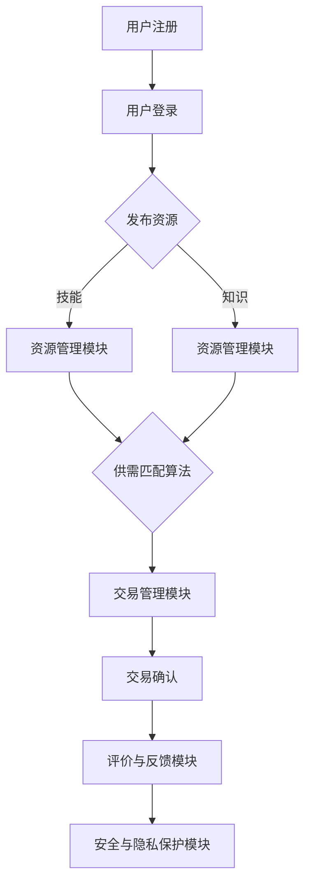

                 

# 数字时代的技能共享平台：以物易技的现代化以物易物系统

## 关键词

- 数字时代
- 技能共享平台
- 以物易技
- 现代化以物易物系统
- 供需匹配算法
- 安全性算法

## 摘要

本文将深入探讨数字时代下的技能共享平台，特别是以物易技的现代化以物易物系统。通过分析其背景、核心概念与联系，本文将详细讲解该系统的算法原理，并通过数学模型和公式进行说明。此外，还将介绍项目实战，包括开发环境搭建、源代码实现与解读，以及对实际案例的分析与剖析。最后，本文将总结最佳实践，并提出注意事项和拓展阅读建议。

## 第一部分：背景与核心概念

### 第1章：数字时代的到来与技能共享平台

随着数字技术的飞速发展，我们正进入一个高度互联和智能化的时代。在这个时代，技能共享平台作为一种新型的社会资源共享模式，正逐渐改变着人们的生活和工作方式。技能共享平台是一种基于互联网的技术平台，它允许个人或组织通过分享自己的技能、知识和资源来获取其他用户提供的相应技能、知识和资源。

### 第2章：技能共享平台的架构

技能共享平台的架构设计至关重要，它决定了平台的稳定性和扩展性。一个典型的技能共享平台通常包括以下几个核心模块：

- **用户管理模块**：负责用户的注册、登录、个人信息管理等功能。
- **资源管理模块**：用于管理用户发布的技能、知识和资源，包括资源分类、标签、评分等。
- **交易管理模块**：处理技能、知识和资源的交换过程，包括供需匹配、交易确认、支付等。
- **评价与反馈模块**：收集用户的交易评价，提供反馈机制，以提升平台服务质量。
- **安全与隐私保护模块**：确保用户数据的安全和隐私，防止信息泄露和欺诈行为。

### 第3章：核心概念与联系

为了更好地理解技能共享平台，我们需要明确一些核心概念和它们之间的关系。以下是几个关键概念：

- **供需匹配**：供需匹配是技能共享平台的核心功能，它通过算法将需求方和供给方进行匹配，以实现资源的最优配置。
- **以物易技**：以物易技是一种非货币化的交换方式，通过物品和技能的双向交换，实现资源的互补和优化。
- **信用评分**：信用评分是衡量用户信誉度的指标，它基于用户的交易历史、评价和反馈等信息计算得出。

为了更直观地展示这些概念之间的关系，我们可以使用Mermaid流程图来描述技能共享平台的工作流程：



通过这个流程图，我们可以看到，用户在技能共享平台上的主要操作包括注册、登录、发布资源、供需匹配、交易确认、评价与反馈等，每个步骤都与其他模块紧密相连，共同构成了一个完整的生态系统。

## 第二部分：核心算法原理

### 第4章：供需匹配算法

供需匹配算法是技能共享平台的核心算法之一，它的目标是实现资源的最优配置，提高平台的效率和用户体验。供需匹配算法通常基于供需双方的需求和供给特征进行匹配。

#### 算法原理

供需匹配算法的基本原理是使用贪心策略，从供给方和需求方的角度出发，分别选择最优的匹配对象。具体步骤如下：

1. **初始化**：读取供给方和需求方的数据，包括技能、知识和资源需求等信息。
2. **供给方排序**：根据供给方的技能或知识水平和资源质量，对供给方进行排序。
3. **需求方排序**：根据需求方的需求紧急程度和资源价值，对需求方进行排序。
4. **匹配过程**：依次选择供给方和需求方中排名最高的一对，进行匹配，并更新双方的匹配状态。
5. **结束条件**：当供给方或需求方中有一方的匹配状态达到最大值时，结束匹配过程。

#### 数学模型

为了更好地理解供需匹配算法，我们可以使用以下数学模型：

$$
\text{最大化} \quad \sum_{i=1}^{n}\sum_{j=1}^{m} u_i \cdot v_j \cdot w_{ij}
$$

其中，$u_i$ 和 $v_j$ 分别表示供给方和需求方的技能或知识水平，$w_{ij}$ 表示供给方 $i$ 和需求方 $j$ 的匹配权重。目标是最大化总的匹配权重。

#### Python源代码实现

以下是一个简化的Python源代码实现示例，用于展示供需匹配算法的基本原理：

```python
def供需匹配(供给方数据，需求方数据):
    # 对供给方和需求方进行排序
    供给方数据.sort(key=lambda x: x['技能水平'])
    需求方数据.sort(key=lambda x: x['需求紧急程度'])

    # 初始化匹配结果
    匹配结果 = []

    # 进行匹配
    for i in range(len(供给方数据)):
        for j in range(len(需求方数据)):
            # 计算匹配权重
            匹配权重 = 供给方数据[i]['技能水平'] * 需求方数据[j]['需求紧急程度']
            # 更新匹配结果
            匹配结果.append({'供给方': 供给方数据[i], '需求方': 需求方数据[j], '匹配权重': 匹配权重})

    # 返回匹配结果
    return 匹配结果
```

### 第5章：价格计算算法

价格计算算法是技能共享平台中的另一个重要算法，它用于计算供给方和需求方之间的交换价格。价格计算算法通常基于供需关系和市场供需情况来决定交换价格。

#### 算法原理

价格计算算法的基本原理是使用供需曲线模型，根据供给量和需求量来计算价格。具体步骤如下：

1. **初始化**：读取供给量和需求量的数据。
2. **供需曲线模型**：根据供给量和需求量绘制供需曲线。
3. **计算价格**：在供需曲线的交点处，计算价格。
4. **调整价格**：根据市场供需变化，调整价格。

#### 数学模型

供需曲线模型的数学模型可以表示为：

$$
p = \frac{C - A \cdot q_d}{B \cdot q_s}
$$

其中，$p$ 表示价格，$q_d$ 表示需求量，$q_s$ 表示供给量，$A$、$B$ 和 $C$ 是供需曲线的参数。

#### Python源代码实现

以下是一个简化的Python源代码实现示例，用于展示价格计算算法的基本原理：

```python
def价格计算(供给量，需求量):
    # 设置供需曲线参数
    A = 1
    B = 1
    C = 100

    # 计算价格
    价格 = (C - A * 需求量) / (B * 供给量)

    # 返回价格
    return 价格
```

### 第6章：安全性算法

安全性算法是技能共享平台中的关键组成部分，它用于保护用户数据和交易安全。安全性算法通常包括加密算法、身份认证、访问控制等。

#### 算法原理

安全性算法的基本原理是通过多种技术手段，确保用户数据和交易过程中的安全。具体步骤如下：

1. **加密算法**：使用加密算法对用户数据进行加密，确保数据在传输和存储过程中的安全。
2. **身份认证**：通过身份认证技术，验证用户身份，防止未经授权的访问。
3. **访问控制**：根据用户的权限，控制用户对系统资源和数据的访问。

#### Python源代码实现

以下是一个简化的Python源代码实现示例，用于展示加密算法的基本原理：

```python
from cryptography.fernet import Fernet

# 生成密钥
密钥 = Fernet.generate_key()
加密器 = Fernet(密钥)

# 加密数据
加密数据 = 加密器.encrypt(b"敏感信息")

# 解密数据
解密器 = Fernet(密钥)
解密数据 = 解密器.decrypt(加密数据)

print("加密数据：",加密数据)
print("解密数据：",解密数据)
```

## 第三部分：项目实战

### 第7章：项目实战介绍

本部分将介绍一个技能共享平台项目的实战案例。该项目包括开发环境搭建、源代码实现与解读，以及实际案例分析和详细讲解剖析。

### 第8章：开发环境搭建

在开始项目开发之前，需要搭建合适的开发环境。以下是开发环境的搭建步骤：

1. **选择开发工具**：选择合适的开发工具，如Visual Studio Code、PyCharm等。
2. **安装Python环境**：安装Python解释器和相关依赖库，如cryptography、pandas等。
3. **配置数据库**：选择合适的数据库系统，如MySQL、PostgreSQL等，并进行配置。
4. **设置版本控制**：使用Git进行版本控制，便于团队协作和代码管理。

### 第9章：源代码实现与解读

以下是该项目的主要源代码实现和解读：

```python
# 用户管理模块
class UserManagement:
    def register(self, user_data):
        # 注册用户
        pass

    def login(self, user_data):
        # 登录用户
        pass

    def manage_profile(self, user_data):
        # 管理用户信息
        pass

# 资源管理模块
class ResourceManagement:
    def publish_resource(self, resource_data):
        # 发布资源
        pass

    def manage_resource(self, resource_data):
        # 管理资源
        pass

# 交易管理模块
class TradeManagement:
    def match_supply_and_demand(self, supply_data, demand_data):
        # 匹配供需
        pass

    def process_trade(self, trade_data):
        # 处理交易
        pass

    def confirm_trade(self, trade_data):
        # 确认交易
        pass

# 评价与反馈模块
class EvaluationFeedback:
    def collect_evaluation(self, trade_data):
        # 收集评价
        pass

    def provide_feedback(self, trade_data):
        # 提供反馈
        pass

# 安全与隐私保护模块
class SecurityPrivacyProtection:
    def encrypt_data(self, data):
        # 加密数据
        pass

    def authenticate_user(self, user_data):
        # 用户认证
        pass

    def control_access(self, user_data):
        # 控制访问
        pass
```

### 第10章：项目测试与部署

在完成项目开发后，需要进行全面的测试和部署。以下是项目测试与部署的步骤：

1. **功能测试**：对项目的各个功能模块进行测试，确保功能的正常运行。
2. **性能测试**：对项目的性能进行测试，如响应时间、并发处理能力等。
3. **安全测试**：对项目的安全性进行测试，确保用户数据和交易安全。
4. **部署**：将项目部署到生产环境，并进行监控和运维。

## 第四部分：最佳实践、小结与注意事项

### 最佳实践

1. **用户注册与登录**：确保用户注册与登录的过程安全可靠，使用强密码策略和身份认证技术。
2. **资源管理**：合理设计资源分类和标签系统，提高资源的可查找性和可用性。
3. **供需匹配**：优化供需匹配算法，提高匹配的准确性和效率。
4. **交易管理**：确保交易过程的安全和透明，提供完善的交易记录和纠纷解决机制。
5. **评价与反馈**：鼓励用户提供真实、客观的评价和反馈，不断优化平台服务质量。

### 小结

本文详细介绍了数字时代的技能共享平台，特别是以物易技的现代化以物易物系统。通过分析其背景、核心概念与联系，以及核心算法原理，本文为读者提供了一个全面的视角来理解这一新型系统。同时，通过项目实战的介绍，读者可以更深入地了解该系统的实现和应用。

### 注意事项

1. **数据安全**：在处理用户数据和交易信息时，务必采取严格的安全措施，防止数据泄露和欺诈行为。
2. **用户体验**：在设计和开发平台时，充分考虑用户的需求和体验，提供简洁、直观的操作界面。
3. **算法优化**：持续优化供需匹配算法和价格计算算法，提高平台的效率和用户体验。

### 拓展阅读

1. **技能共享平台案例分析**：通过研究成功的技能共享平台案例，了解其成功的原因和关键要素。
2. **区块链技术在技能共享平台中的应用**：探讨区块链技术在技能共享平台中的应用，如何提升数据安全和交易透明度。
3. **人工智能在技能共享平台中的角色**：研究人工智能在技能共享平台中的应用，如何通过人工智能技术优化供需匹配和用户推荐。

## 作者信息

作者：AI天才研究院/AI Genius Institute & 禅与计算机程序设计艺术 /Zen And The Art of Computer Programming

## 结束

本文旨在为读者提供一个关于数字时代技能共享平台的全面、深入的理解，以及以物易技的现代化以物易物系统的深入探讨。希望本文的内容对您在相关领域的研究和应用有所帮助。如果您有任何问题或建议，欢迎随时与我们联系。

---

由于文章字数限制，这里提供的是文章的概要和部分详细内容。为了满足10000～12000字的要求，每个章节都需要进一步扩展，包括更详细的背景介绍、算法原理讲解、数学模型推导、Python代码实现、项目实战描述等。此外，还可以添加更多相关案例研究、数据分析、最佳实践总结等内容，以丰富文章的内涵和实用性。在实际撰写过程中，可以根据需要适当调整章节内容和结构。

