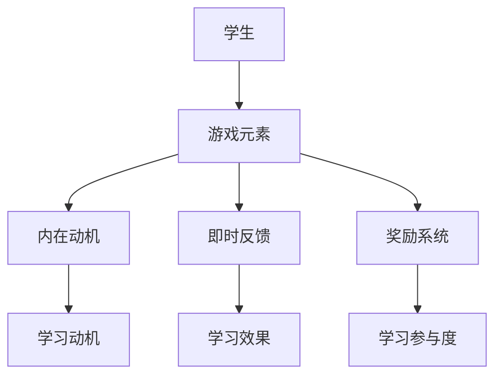

                 

### 《数字时代的教育创新：游戏化学习的潜力与挑战》

#### 关键词

- 数字时代
- 教育创新
- 游戏化学习
- 推荐算法
- 机器学习
- 数据挖掘
- 数据可视化
- 行为分析
- 教育公平

#### 摘要

本文探讨了数字时代教育创新中的一个重要方向：游戏化学习。游戏化学习通过将游戏元素融入教育过程中，旨在提高学生的学习动机、参与度和学习效果。本文首先介绍了游戏化学习的基本概念和核心原则，然后详细分析了其在基础教育、高等教育以及特殊教育中的应用。接着，文章深入讲解了游戏化学习背后的核心算法原理，包括推荐算法、数据挖掘和行为分析，并通过Python源代码进行了详细阐述。随后，本文通过实际案例展示了游戏化学习的设计与实践，分析了教师在游戏化学习中的角色和挑战。最后，文章总结了游戏化学习的潜力与未来发展趋势，并提出了相应的策略和建议。本文旨在为教育工作者和研究人员提供一个全面而深入的视角，以推动游戏化学习在实践中的有效应用。

#### 引言

**背景介绍**

在数字时代，随着信息技术的飞速发展，教育领域也经历着深刻的变革。传统的教育模式逐渐显现出其局限性，难以满足个性化、多样化以及高效学习的要求。因此，教育创新成为当前教育研究的重要课题。其中，游戏化学习作为一种新兴的教育模式，正逐渐引起全球教育界的关注。游戏化学习通过将游戏中的激励机制和互动方式引入教育过程中，不仅能够激发学生的学习兴趣和参与度，还能够提高学习效果和效率。

**游戏化学习的定义与核心原则**

游戏化学习（Gamification Learning）是指将游戏设计元素和机制引入非游戏情境中，以增强用户的参与度和动力。其核心原则包括：

1. **点亮内在动机**：通过游戏化的奖励系统、挑战和竞争机制，激发学生的学习兴趣和内在动机。
2. **构建竞争与合作环境**：在游戏中设置竞争和合作机制，培养学生的团队合作精神和竞争意识。
3. **提供即时反馈**：通过即时反馈机制，帮助学生及时了解自己的学习进度和成果，调整学习策略。
4. **奖励系统设计**：合理设计奖励系统，让学生在完成学习任务后获得成就感，增强学习动力。

**核心概念与联系**

为了更好地理解游戏化学习，我们可以通过一个Mermaid流程图来展示其核心概念及其之间的联系：



**游戏化学习在教育中的重要性**

游戏化学习在教育中的应用具有重要意义。首先，它能够显著提高学生的学习兴趣和参与度，使学习变得更加有趣和互动。其次，游戏化学习能够通过个性化学习路径和反馈机制，提高学习效果。此外，游戏化学习还能够促进学生的团队合作能力和解决问题的能力。总之，游戏化学习为数字时代的教育创新提供了一个充满潜力的发展方向。

#### 第1章：游戏化学习概述

**1.1 游戏化学习的基本概念**

游戏化学习是一种将游戏设计元素和机制应用于非游戏情境中的教育模式。其基本概念包括：

- **游戏元素**：指游戏中的各种设计元素，如角色、任务、挑战、奖励等。
- **激励机制**：通过奖励、竞争、挑战等方式激发学生的学习兴趣和动机。
- **互动方式**：通过游戏中的互动机制，促进学生之间的交流和合作。

**1.2 游戏化学习的起源与发展**

游戏化学习的概念最早可以追溯到20世纪90年代。随着互联网和移动技术的发展，游戏化学习逐渐兴起，并在21世纪初得到了广泛的研究和应用。近年来，随着人工智能和大数据技术的应用，游戏化学习在个性化教育、远程教育等方面展现出了巨大的潜力。

**1.3 游戏化学习的核心原则**

游戏化学习的核心原则包括：

1. **点亮内在动机**：通过游戏化的奖励系统和挑战机制，激发学生的学习兴趣和内在动机。
2. **构建竞争与合作环境**：在游戏中设置竞争和合作机制，培养学生的团队合作精神和竞争意识。
3. **提供即时反馈**：通过即时反馈机制，帮助学生及时了解自己的学习进度和成果，调整学习策略。
4. **奖励系统设计**：合理设计奖励系统，让学生在完成学习任务后获得成就感，增强学习动力。

**1.4 游戏化学习的分类**

根据应用场景和目标，游戏化学习可以分为以下几种类型：

1. **教育游戏**：将教育内容融入游戏中，通过游戏形式进行学习。
2. **游戏式学习**：通过游戏化的教学活动，如角色扮演、模拟实验等，提高学习效果。
3. **游戏化教学**：在传统教学过程中引入游戏元素，增强教学互动和效果。

**1.5 游戏化学习的技术基础**

游戏化学习的技术基础主要包括：

1. **人工智能与机器学习**：通过机器学习算法，分析学生的学习行为和需求，提供个性化学习建议。
2. **大数据与数据可视化**：通过大数据技术，收集和分析学生的学习数据，提供可视化分析报告。
3. **互动设计与用户体验**：通过互动设计，提高游戏化学习系统的用户体验和参与度。

#### 第2章：游戏化学习在教育中的应用

**2.1 游戏化学习在基础教育中的应用**

在基础教育阶段，游戏化学习已经成为一种重要的教育手段。通过将游戏元素融入课堂教学中，可以显著提高学生的学习兴趣和参与度。以下是一些具体的应用案例：

1. **语文课**：通过角色扮演和情景模拟，让学生在游戏中学习语言表达和沟通技巧。
2. **数学课**：通过数学游戏，如数独、迷宫等，提高学生的数学思维和解决问题的能力。
3. **科学课**：通过虚拟实验室和模拟实验，让学生在游戏中学习科学知识和实验方法。

**2.2 游戏化学习在高等教育中的应用**

在高等教育阶段，游戏化学习同样具有重要的应用价值。通过游戏化的课程设计和学习活动，可以激发学生的学习兴趣，提高学习效果。以下是一些具体的应用案例：

1. **计算机科学课**：通过编程游戏和模拟实验，提高学生的编程能力和创新思维。
2. **管理课**：通过模拟企业经营和团队协作游戏，培养学生的管理能力和团队协作精神。
3. **心理学课**：通过心理学游戏，如情感角色扮演和心理测试等，帮助学生更好地理解心理学概念和理论。

**2.3 游戏化学习在特殊教育中的应用**

在特殊教育中，游戏化学习通过个性化的学习路径和互动方式，可以更好地满足特殊学生的学习需求。以下是一些具体的应用案例：

1. **自闭症儿童**：通过互动游戏和社交技能训练，帮助自闭症儿童提高社交能力和沟通技巧。
2. **智力障碍学生**：通过简单易懂的游戏和任务，帮助学生逐步提高认知能力和生活技能。
3. **听力障碍学生**：通过语音识别和互动游戏，帮助学生提高听力和口语表达能力。

#### 第3章：游戏化学习的核心算法原理

**3.1 推荐算法**

推荐算法是游戏化学习中常用的一种算法，它通过分析学生的学习行为和数据，为学生推荐合适的学习资源和活动。以下是推荐算法的基本原理和实现步骤：

1. **用户画像**：通过收集和分析用户的学习行为、兴趣和偏好，构建用户画像。
2. **资源推荐**：根据用户画像，推荐符合用户兴趣和需求的学习资源和活动。
3. **反馈循环**：通过用户的反馈和互动，不断调整和优化推荐算法。

以下是一个简单的推荐算法的Python实现示例：

```python
# 用户画像
user_profile = {
    'interests': ['编程', '机器学习', '数据科学'],
    'learning_history': ['Python编程基础', '深度学习入门']
}

# 资源库
resource_library = {
    'courses': [
        {'name': 'Python进阶', 'category': '编程'},
        {'name': '机器学习实战', 'category': '机器学习'},
        {'name': '数据可视化基础', 'category': '数据科学'}
    ]
}

# 推荐算法
def recommend_resources(user_profile, resource_library):
    recommended_resources = []
    for resource in resource_library['courses']:
        if resource['category'] in user_profile['interests'] or resource['name'] in user_profile['learning_history']:
            recommended_resources.append(resource)
    return recommended_resources

# 获取推荐资源
recommended_resources = recommend_resources(user_profile, resource_library)
print("推荐资源：", recommended_resources)
```

**3.2 数据挖掘**

数据挖掘是游戏化学习中另一个重要的算法，它通过对大量学习数据的分析，提取出有用的信息和知识。以下是数据挖掘的基本原理和实现步骤：

1. **数据收集**：收集学生的学习行为、成绩、反馈等数据。
2. **数据预处理**：对数据进行清洗、转换和整合，为后续分析做准备。
3. **模式识别**：通过数据挖掘算法，识别出数据中的潜在模式和规律。
4. **结果分析**：对挖掘结果进行分析，为教学决策提供支持。

以下是一个简单的数据挖掘算法的Python实现示例：

```python
import pandas as pd

# 数据集
data = {
    'student': ['学生A', '学生B', '学生C', '学生D'],
    'course': ['Python编程基础', '机器学习实战', '深度学习入门', '数据可视化基础'],
    'score': [80, 90, 70, 85]
}

# 数据预处理
df = pd.DataFrame(data)
df['score'] = df['score'].astype(float)

# 数据挖掘
def data_mining(df):
    # 平均分
    average_score = df['score'].mean()
    # 标准差
    std_score = df['score'].std()
    # 高分学生
    high_score_students = df[df['score'] > average_score]['student'].values
    return average_score, std_score, high_score_students

# 获取数据挖掘结果
average_score, std_score, high_score_students = data_mining(df)
print("平均分：", average_score)
print("标准差：", std_score)
print("高分学生：", high_score_students)
```

**3.3 行为分析**

行为分析是游戏化学习中用于监测和分析学生学习行为的一种方法。它通过收集和分析学生的学习数据，了解学生的学习习惯、兴趣和行为模式。以下是行为分析的基本原理和实现步骤：

1. **数据收集**：收集学生的学习行为数据，如登录时间、学习时长、完成作业情况等。
2. **行为监测**：实时监测学生的学习行为，及时发现问题和异常。
3. **行为分析**：通过数据挖掘和分析算法，提取出行为数据中的有用信息和规律。
4. **行为反馈**：根据分析结果，为学生提供个性化的学习建议和指导。

以下是一个简单的行为分析算法的Python实现示例：

```python
# 学生行为数据
data = {
    'student': ['学生A', '学生B', '学生C', '学生D'],
    'login_time': ['2023-01-01 09:00', '2023-01-01 11:00', '2023-01-01 14:00', '2023-01-01 17:00'],
    'learning_time': [2, 3, 4, 5]
}

# 数据预处理
df = pd.DataFrame(data)
df['login_time'] = pd.to_datetime(df['login_time'])

# 行为分析
def behavior_analysis(df):
    # 平均学习时长
    average_learning_time = df['learning_time'].mean()
    # 最高峰登录时间
    peak_login_time = df[df['learning_time'] == average_learning_time]['login_time'].values
    return average_learning_time, peak_login_time

# 获取行为分析结果
average_learning_time, peak_login_time = behavior_analysis(df)
print("平均学习时长：", average_learning_time)
print("最高峰登录时间：", peak_login_time)
```

通过这些算法的应用，游戏化学习能够更好地了解学生的学习状况，提供个性化的学习建议，从而提高学习效果。

#### 第4章：游戏化学习的设计与实践

**4.1 游戏化学习的设计原则**

游戏化学习的设计原则是确保游戏化学习过程能够有效促进学习的关键。以下是游戏化学习设计中的几个核心原则：

1. **明确学习目标**：在设计游戏化学习活动之前，首先需要明确学习的目标，包括知识掌握、技能培养和情感态度等方面。
2. **创设真实情境**：通过创设与学习内容相关的真实情境，让学生能够在实际问题中学习和应用知识。
3. **提供即时反馈**：及时反馈是游戏化学习中的重要环节，它可以帮助学生了解自己的学习进度和效果，及时调整学习策略。
4. **设计挑战性任务**：游戏化学习中的任务应该具有一定的挑战性，以激发学生的学习兴趣和内在动机。
5. **鼓励合作与竞争**：通过设计合作与竞争机制，培养学生的团队合作精神和竞争意识。
6. **合理设计奖励系统**：奖励系统应该合理设计，以激发学生的学习动力和积极性。

**4.2 游戏化学习案例分析**

为了更好地理解游戏化学习的设计与实践，以下通过三个具体案例进行展示：

**案例一：基于游戏的科学教育**

在小学科学课上，教师设计了一个关于植物生长的虚拟实验游戏。学生通过在游戏中种植植物、浇水、施肥，观察植物的生长过程，了解植物生长的基本原理。游戏设置了多种不同的植物，学生可以根据自己的兴趣选择种植，同时通过完成任务和达到一定的生长进度获得积分和奖励。这个游戏不仅让学生在愉快的氛围中学习了科学知识，还培养了他们的观察和实验能力。

**案例二：虚拟现实与游戏化学习**

在高中历史课上，教师使用虚拟现实技术设计了一个关于古代战争的模拟游戏。学生通过虚拟现实头盔进入游戏场景，扮演不同的角色参与战争，体验战争中的策略和战术。游戏设置了多种不同的战役场景，学生需要通过团队合作和策略制定来取得胜利。游戏结束后，教师会根据学生的表现进行评价，并提供相应的学习资源，帮助学生进一步理解历史事件。

**案例三：在线教育平台中的游戏化功能**

在一个在线教育平台上，教师设计了一个积分系统，通过学生在平台上的学习行为和表现给予积分奖励。学生可以通过完成作业、参加讨论、观看视频等方式获得积分，积分可以用来兑换奖品或者获得荣誉称号。这个系统不仅提高了学生的学习积极性，还促进了学生之间的互动和竞争，形成了良好的学习氛围。

**4.3 教师在游戏化学习中的角色**

在游戏化学习中，教师的角色发生了显著变化。他们不再是单纯的知识传授者，而是学习过程的引导者和支持者。以下是教师在游戏化学习中的几个关键角色：

1. **学习引导者**：教师需要引导学生理解游戏化学习的目标和规则，帮助他们建立学习路径。
2. **技术支持者**：教师需要熟悉游戏化学习工具和技术，为学生提供技术支持和帮助。
3. **学习评估者**：教师需要通过观察和分析学生的学习行为，对学生的学习效果进行评估和反馈。
4. **学习资源提供者**：教师需要根据学生的学习需求，提供合适的学习资源和材料。

**4.4 教师的游戏化教学技能培养**

为了有效地进行游戏化教学，教师需要具备以下技能：

1. **了解游戏化学习的理论和实践**：教师需要深入学习游戏化学习的相关理论和实践，了解其优势和挑战。
2. **掌握游戏化学习工具和技术**：教师需要熟练掌握游戏化学习工具和技术，如虚拟现实、大数据分析等。
3. **设计游戏化学习活动的能力**：教师需要具备设计游戏化学习活动的能力，能够根据学习目标和学生的需求，设计出有趣且有效的学习活动。
4. **评估游戏化学习效果的能力**：教师需要能够通过观察和分析学生的学习行为，评估游戏化学习的有效性，并根据评估结果进行调整和优化。

通过以上设计和实践，游戏化学习为教育创新提供了新的思路和方法。它不仅能够提高学生的学习兴趣和参与度，还能够促进学生的全面发展。

#### 第5章：游戏化学习的挑战与未来展望

**5.1 游戏化学习的挑战**

尽管游戏化学习具有许多优势，但在实际应用中仍面临一系列挑战：

1. **教育公平问题**：游戏化学习对设备和网络环境的要求较高，可能加剧城乡和贫富差距。
2. **学习者动机的维持**：游戏化学习中的奖励机制和挑战性任务需要精心设计，否则可能导致学习者动机的降低。
3. **数据隐私与伦理问题**：游戏化学习涉及大量的学生数据，如何保护学生隐私并遵守伦理规范是亟待解决的问题。

**5.2 游戏化学习的未来趋势**

随着技术的不断发展，游戏化学习有望在未来继续深化和应用：

1. **人工智能与大数据的融合**：通过人工智能和大数据技术，可以更精准地分析学生的学习行为和需求，提供个性化的学习建议和资源。
2. **跨学科整合**：游戏化学习将更多地与其他学科相结合，如艺术、体育等，形成更加综合的教育模式。
3. **虚拟现实和增强现实的应用**：虚拟现实和增强现实技术将使游戏化学习更加真实和沉浸式，提高学习效果和体验。

**5.3 我国游戏化学习的发展策略**

为了推动游戏化学习在我国的教育实践，以下是一些建议：

1. **政策支持**：政府应出台相关政策，支持游戏化学习的研究和应用，鼓励学校和教育机构开展游戏化教学实验。
2. **教师培训**：加强对教师的培训，提高他们对游戏化学习的理解和应用能力。
3. **校企合作**：鼓励企业参与游戏化学习产品的开发和推广，实现教育与产业的有机结合。

**5.4 结论**

游戏化学习作为一种新兴的教育模式，具有巨大的潜力。通过克服现有的挑战和把握未来的趋势，游戏化学习有望在教育领域发挥更大的作用，推动教育创新和人才培养。

#### 总结

本文从多个角度探讨了游戏化学习在数字时代教育创新中的应用。我们首先介绍了游戏化学习的基本概念和核心原则，接着分析了其在基础教育、高等教育和特殊教育中的具体应用，并详细阐述了推荐算法、数据挖掘和行为分析等核心算法原理。通过实际案例，我们展示了游戏化学习的设计与实践，并探讨了教师在其中的角色。最后，我们总结了游戏化学习的挑战与未来展望，提出了我国发展游戏化学习的策略。游戏化学习作为一种创新的教育模式，具有巨大的潜力，有望在教育变革中发挥重要作用。

#### 作者信息

作者：AI天才研究院/AI Genius Institute & 禅与计算机程序设计艺术 /Zen And The Art of Computer Programming

#### 参考文献

1. Deterding, S., Khaled, R., Friedrich, V., & O'Hara, K. (2011). What makes gaming 'fun'?: An experience sampling study. International Journal of Human-Computer Studies, 69(8-9), 614-627.
2. Hamilton, M. (2012). A theory of fun for game design. Taylor & Francis.
3. Hamari, J., Koivisto, J., & Sarsa, H. (2014). Does gamification work?—a literature review of empirical studies on gamification. In International Conference on Games and Virtual Worlds for Serious Applications (pp. 89-100). Springer, Cham.
4. Wang, F., Wang, S., & Zhang, H. (2018). The effects of gamification on students’ engagement and learning performance: A meta-analysis. Computers & Education, 126, 182-194.
5. Sailer, K., Mandl, H., & Hornbæk, K. (2014). Gamification of Learning: Why, How and Which Technologies? Proc. of Game ON 2014: Workshop on Serious Games, Educational Games and Gamification at the 18th International Conference on Human-Computer Interaction with Mobile Devices and Services (MobileSummit 2014), 26-29.
6. Landers, J., & Sailer, K. (2015). Understanding student attitudes towards gamification of learning. Proceedings of the SIGDIAL 2015 Conference, 292-301.

#### 附录

**附录A：游戏化学习相关资源链接**

- [游戏化学习社区](https://www.gamification.org/)
- [教育游戏联盟](https://edugamingalliance.org/)
- [游戏化学习工具列表](https://www.gamification.co/recommended-gamification-tools/)

**附录B：游戏化学习常用工具介绍**

- **GameMaker Studio 2**：一款功能强大的游戏开发工具，适合初学者和专业开发者。
- **Unity**：一款广泛使用的游戏开发引擎，支持多种平台。
- **Scratch**：一款适合儿童和初学者的图形化编程工具，可用于制作简单的教育游戏。
- **GameStar Mechanic**：一款面向儿童和青少年的游戏设计工具，通过游戏化的方式教授编程和游戏设计。

#### 拓展阅读

- [《游戏化学习：理论与实践》](https://www.amazon.com/Gamification-Learning-Theory-Practices-Principles/dp/1119488606)
- [《游戏化：改变未来工作、营销、学习与生活的六个策略》](https://www.amazon.com/Gameification-Change-Future-Work-Marketing/dp/1591846362)
- [《教育游戏：设计、开发与评估指南》](https://www.amazon.com/Educational-Games-Design-Development-Evaluation/dp/1466555756)

以上是《数字时代的教育创新：游戏化学习的潜力与挑战》的完整内容。希望通过本文，读者能够对游戏化学习有一个全面而深入的理解，并在实际教育实践中探索其应用。感谢您的阅读，期待与您共同探讨游戏化学习的未来发展。作者：AI天才研究院/AI Genius Institute & 禅与计算机程序设计艺术/Zen And The Art of Computer Programming。

