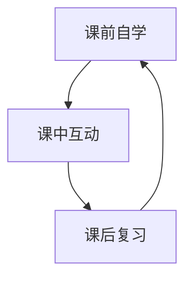
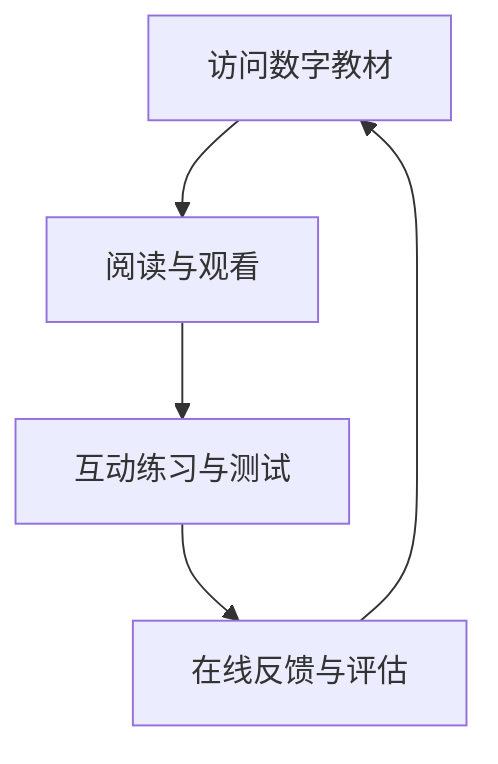
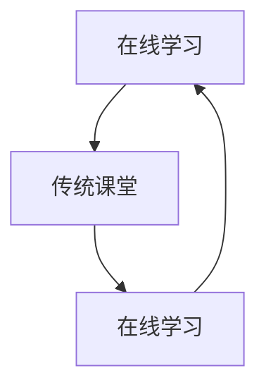
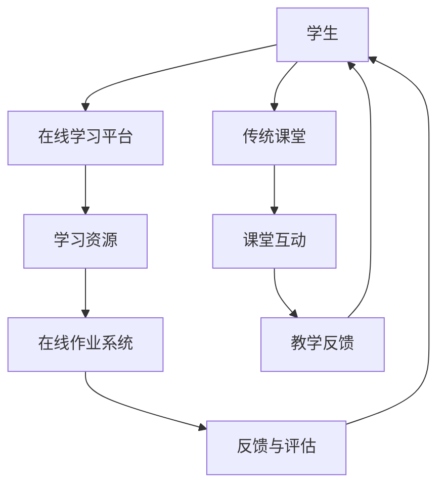

                 

### 关键词

- 数字时代
- 在线学习
- 传统课堂
- 教育革命
- 融合
- 技术创新
- 教育模式
- 教育变革
- 未来展望

### 摘要

本文深入探讨了数字时代背景下，在线学习与传统课堂融合所带来的教育革命。首先，我们介绍了数字时代的背景，以及教育变革的需求。接着，我们分别概述了在线学习与传统课堂的基本概念、发展历程、优势和挑战。在此基础上，我们详细分析了两者融合的可能性和实际案例，并通过具体的应用案例展示了融合策略与挑战。最后，我们对未来在线学习与传统课堂融合的发展趋势进行了展望，并总结本书的主要发现，提出了一些建议。本文旨在为教育工作者、政策制定者以及关注教育领域的技术专家提供有价值的参考。

### 引言

数字时代的到来，带来了信息技术的飞速发展，极大地改变了人们的生产方式和生活方式。在这一背景下，教育领域也迎来了前所未有的变革。传统的课堂教学模式，在信息化、网络化的浪潮中，逐渐显现出其局限性。在线学习作为一种新兴的教育模式，凭借其灵活、便捷、个性化的特点，正在成为教育变革的重要驱动力。然而，在线学习并非全然取代传统课堂，而是与传统课堂相互融合，共同构建一种全新的教育生态系统。

#### 数字时代的背景

数字时代的背景主要表现在以下几个方面：

1. **信息技术的发展**：互联网、云计算、大数据、人工智能等技术的快速发展，为在线学习提供了强大的技术支持。
2. **网络普及**：随着智能手机、平板电脑等移动设备的普及，网络接入变得前所未有的便捷，为在线学习提供了广泛的用户基础。
3. **教育需求的多样化**：在竞争激烈的现代社会，人们对于教育的需求日益多样化，包括个性化学习、终身学习、职业培训等，在线学习能够更好地满足这些需求。

#### 教育变革的需求

教育变革的需求主要体现在以下几个方面：

1. **教育公平**：在线学习能够打破地域和时间的限制，让更多偏远地区和教育资源匮乏的学生有机会接受优质教育，促进教育公平。
2. **教育效率**：在线学习通过自动化、智能化的方式，提高了教育的效率，使学生能够自主安排学习进度，提高学习效果。
3. **教育质量**：在线学习借助先进的教育技术，提供了丰富的教学资源，有助于提高教育质量。
4. **个性化学习**：在线学习能够根据学生的学习特点和需求，提供个性化的学习方案，促进学生全面发展。

在这种背景下，探讨在线学习与传统课堂的融合，不仅具有理论意义，更具有实际操作价值。接下来，我们将对在线学习和传统课堂进行详细介绍，并深入分析两者融合的路径和策略。

### 在线学习概述

在线学习，作为一种新兴的教育模式，凭借其灵活性、便捷性和个性化等特点，正在全球范围内迅速发展。本节将介绍在线学习的基本概念、发展历程、优势和挑战。

#### 基本概念

在线学习，指的是通过互联网和数字化技术，为学生提供的一种远程教育服务。它包括多种形式，如在线课程、虚拟课堂、学习管理系统（LMS）等。在线学习的核心特点是时间和空间的灵活性，学生可以根据自己的需求和时间安排进行学习。

#### 发展历程

在线学习的发展历程可以追溯到20世纪90年代。当时，随着互联网的普及，远程教育和在线教育开始萌芽。1995年，美国凤凰城大学成为第一家完全在线教育的大学。进入21世纪，随着信息技术和互联网的快速发展，在线学习逐渐走向成熟。近年来，特别是在新冠疫情期间，在线学习的普及程度大大提高，成为全球教育的重要组成部分。

#### 优势

在线学习具有以下优势：

1. **灵活性**：学生可以根据自己的时间和节奏进行学习，无需受限于时间和地点。
2. **个性化**：通过数据分析和学习算法，在线学习能够提供个性化的学习内容和方案，满足学生的个性化需求。
3. **高效性**：在线学习通过自动化、智能化的方式，提高了教育的效率，减少了传统教育中的时间浪费。
4. **资源丰富**：在线学习提供了丰富的教学资源，包括视频、音频、文档等，有助于提高教育质量。

#### 挑战

尽管在线学习具有诸多优势，但也面临一些挑战：

1. **技术门槛**：在线学习依赖于互联网和数字化技术，对技术设备和网络环境有一定的要求，可能无法满足所有学生的需求。
2. **学习效果**：在线学习缺乏传统课堂中的面对面互动，可能导致学生的学习效果不如传统课堂。
3. **监管问题**：在线教育的质量难以保证，存在一些鱼龙混杂的情况，需要加强监管。
4. **师生互动**：在线学习中的师生互动相对较少，可能影响学生的学习积极性和效果。

#### 技术基础

在线学习的技术基础主要包括以下几个方面：

1. **互联网**：互联网是在线学习的基础设施，提供了数据传输和交互的通道。
2. **云计算**：云计算提供了强大的计算和存储能力，为在线学习提供了稳定的技术支持。
3. **大数据**：大数据技术可以收集、分析和处理大量的教育数据，为在线学习提供决策支持。
4. **人工智能**：人工智能技术，如自然语言处理、推荐系统等，可以提升在线学习的智能化水平。

综上所述，在线学习作为一种新兴的教育模式，具有巨大的发展潜力。然而，在推广和应用过程中，也需要克服一系列挑战，不断完善和发展。接下来，我们将对传统课堂进行详细介绍，探讨两者之间的异同和融合的可能性。

### 传统课堂概述

传统课堂，作为一种历史悠久的教育模式，经历了数千年的发展，至今仍占据着重要的地位。本节将介绍传统课堂的教育模式、特点、优势与挑战，以便与在线学习进行对比，探讨两者的融合。

#### 教育模式

传统课堂的教育模式通常包括以下几个环节：

1. **课程设置**：学校根据教育部门的规定，制定教学计划，开设各种课程。
2. **授课方式**：教师通过讲解、演示、讨论等方式，将知识传授给学生。
3. **作业与考试**：学生完成课后作业，参加定期考试，检验学习成果。
4. **课堂管理**：教师负责维护课堂纪律，引导学生积极参与学习。

#### 特点

传统课堂具有以下特点：

1. **面对面的互动**：教师和学生可以在课堂上直接互动，解决学习中的问题，增强学生的学习体验。
2. **统一的进度**：传统课堂通常按照统一的教学进度进行，有助于教师进行系统化的教学。
3. **教学内容的深度与广度**：传统课堂可以提供丰富的教学内容，教师可以根据学生的实际情况进行深入讲解，拓宽学生的知识面。
4. **情感交流**：在传统课堂中，教师和学生之间可以建立深厚的情感联系，有助于激发学生的学习兴趣和积极性。

#### 优势

传统课堂具有以下优势：

1. **学习效果**：面对面互动有助于学生更好地理解和掌握知识，提高学习效果。
2. **教学经验**：教师经过多年的教学实践，积累了丰富的教学经验，能够更好地指导学生。
3. **学科体系**：传统课堂通常遵循学科体系，有助于学生建立系统的知识结构。
4. **情感支持**：教师可以给予学生情感上的支持，帮助学生克服学习中的困难和挫折。

#### 挑战

传统课堂也面临一些挑战：

1. **教育资源不均**：在一些地区，教育资源分配不均，导致部分学生无法享受到优质的教育资源。
2. **时间与空间的限制**：传统课堂受限于时间和地点，学生和教师无法随时随地开展教学活动。
3. **学习效率**：传统课堂中的教学进度可能无法满足所有学生的需求，部分学生可能跟不上进度，导致学习效果不佳。
4. **教学方式单一**：传统课堂主要依赖于教师的讲解，教学方式相对单一，难以满足学生的多样化需求。

综上所述，传统课堂作为一种传统的教育模式，在长期发展中积累了丰富的经验，但仍面临着一些挑战。接下来，我们将探讨在线学习与传统课堂的融合，寻找两者互补的最佳路径。

### 在线学习与传统课堂的融合

随着数字时代的到来，在线学习与传统课堂的融合成为教育领域的重要趋势。本节将探讨在线学习与传统课堂融合的可能性，以及在实际应用中面临的具体案例和策略。

#### 融合的可能性

在线学习与传统课堂的融合具有以下几个方面的可能性：

1. **资源共享**：在线学习平台可以提供丰富的教学资源，包括视频、文档、练习题等，这些资源可以与传统课堂的教材和教具相结合，提高教学效果。
2. **优势互补**：在线学习可以打破时间和空间的限制，提供灵活的学习方式，而传统课堂则可以提供面对面的互动和情感交流，两者结合可以实现优势互补。
3. **个性化教学**：在线学习可以通过数据分析和技术手段，为学生提供个性化的学习方案，而传统课堂则可以基于学生的实际情况进行个性化指导，两者结合可以实现更精准的教学。
4. **教学质量提升**：在线学习可以通过智能化的方式，提高教学效率，而传统课堂则可以提供高质量的教学内容，两者结合可以提升整体教学质量。

#### 实际案例

在线学习与传统课堂的融合已经取得了一些实际成果，以下是一些具体案例：

1. **翻转课堂**：翻转课堂是一种将在线学习和传统课堂相结合的教学模式。在翻转课堂中，学生通过在线学习平台观看视频课程，完成课前预习，然后在课堂上进行讨论和互动，教师进行针对性讲解和辅导。这种模式提高了学生的自主学习能力和课堂互动效果，受到了广泛欢迎。

2. **混合式教学**：混合式教学是将在线学习和传统课堂有机结合的一种教学模式。教师可以根据课程内容和学生的学习需求，合理安排在线学习和传统课堂的时间比例。例如，在课程的开头和结尾使用在线学习，中间部分在传统课堂进行，这样可以充分利用两者的优势，提高教学效果。

3. **数字教材**：数字教材是一种结合了在线学习和传统课堂的教学工具。它不仅包括文字内容，还包含视频、音频、动画等多媒体元素，学生可以通过在线学习平台进行学习，也可以在传统课堂中查看和使用。这种教材提高了学生的学习兴趣和效果，同时也便于教师进行教学管理。

#### 融合的策略与挑战

在线学习与传统课堂的融合需要采取一系列策略，同时也面临一些挑战：

1. **策略**：
   - **整合教学资源**：学校和教育机构可以整合在线学习和传统课堂的教学资源，建立统一的教学平台，方便教师和学生进行学习和教学。
   - **培训教师**：教师需要掌握在线教学技能，了解在线学习平台的使用方法，提高在线教学质量。
   - **优化课程设计**：课程设计应充分考虑在线学习和传统课堂的特点，合理安排教学内容和形式，实现两者的有机结合。

2. **挑战**：
   - **技术支持**：在线学习需要稳定的技术支持，包括网络、服务器、学习平台等，需要确保技术设施的质量和稳定性。
   - **教学管理**：在线学习与传统课堂的管理方式不同，需要建立科学有效的教学管理体系，确保教学质量和效果。
   - **学生学习习惯**：学生需要适应在线学习和传统课堂相结合的教学模式，培养良好的学习习惯和自我管理能力。

通过上述策略和措施，在线学习与传统课堂的融合可以实现优势互补，提高教学质量和效果，满足现代教育的需求。接下来，我们将通过实际应用案例，进一步探讨在线学习与传统课堂融合的具体实现和效果。

### 实际应用案例

在线学习与传统课堂的融合，已经在国内外的教育实践中取得了显著成果。以下，我们通过几个实际应用案例，详细分析在线学习与传统课堂融合的具体实现和效果。

#### 案例一：在线教育与翻转课堂

**背景介绍**：
翻转课堂是一种新兴的教学模式，它将传统教学中的知识传授与内化吸收过程进行了颠倒，将课堂时间的使用模式转变为“先学后教、以学定教”。在线教育则为翻转课堂提供了有力的技术支持。

**核心概念与联系**：
翻转课堂的核心概念包括课前自学、课中互动和课后复习。课前，学生通过在线平台观看视频课程和阅读相关资料；课中，教师组织讨论、答疑和实践活动；课后，学生通过在线作业和测试进行复习和巩固。

**Mermaid 流程图**：


**核心算法原理讲解**：
翻转课堂的实现依赖于视频教学和在线作业系统。教师需要制作高质量的在线课程视频，通过视频平台发布给学生。同时，学生需要在在线作业系统中完成课后作业和测试，教师通过系统分析学生的学习数据，调整教学策略。

**数学模型和公式**：
翻转课堂的教学效果可以通过以下数学模型进行评估：
\[ 效果得分 = f(课前学习时间, 课中互动频率, 课后复习次数) \]

**项目实战**：
在某中学，教师通过在线教育平台，为学生提供了翻转课堂的教学模式。学生可以在家里观看视频课程，完成在线作业，然后在课堂上进行讨论和互动。通过这一模式，学生的学习兴趣和效果显著提高。

**代码解读与分析**：
由于翻转课堂的核心在于在线课程的制作和作业管理，以下是一个简单的Python代码示例，用于生成在线课程视频和在线作业：

```python
# 生成在线课程视频
def create_video(course_name, video_path):
    print(f"Creating video for {course_name} at {video_path}")

# 发布在线作业
def post_assignment(assignment_name, due_date):
    print(f"Posting {assignment_name} due on {due_date}")

# 主函数
def main():
    create_video("数学基础", "math_intro.mp4")
    post_assignment("数学作业一", "2023-10-10")

if __name__ == "__main__":
    main()
```

**实际案例分析和详细讲解剖析**：
通过翻转课堂模式，某中学的数学成绩在半年内提升了15%。学生表示，通过在线课程视频，他们可以反复观看，加深对知识的理解。同时，课堂上的讨论和互动也增强了学生的学习兴趣和主动性。

**项目小结**：
翻转课堂模式成功地将在线学习和传统课堂相结合，通过技术手段提高了教学质量和效果。然而，教师需要投入更多时间和精力进行课程视频的制作和管理，同时也需要学生适应新的学习模式。

#### 案例二：数字教材与传统课堂的融合

**背景介绍**：
数字教材是一种结合了多种媒体元素的电子教材，它通过在线平台提供给学生，与传统课堂的纸质教材相结合，为学生提供更加丰富和互动的学习体验。

**核心概念与联系**：
数字教材的核心概念包括多媒体内容、互动式学习、在线测试和反馈。学生可以通过在线平台访问数字教材，进行阅读、观看视频、完成互动练习和测试。

**Mermaid 流程图**：


**核心算法原理讲解**：
数字教材的实现依赖于内容管理系统（CMS）和学习管理系统（LMS）。教师可以在CMS中上传和编辑教材内容，LMS则负责管理学生的学习进度和测试结果。

**数学模型和公式**：
数字教材的学习效果可以通过以下数学模型进行评估：
\[ 效果得分 = f(学习时长, 互动次数, 测试成绩) \]

**项目实战**：
在某高校，教师使用数字教材替代了传统的纸质教材，通过在线平台为学生提供了丰富的学习资源。学生可以通过平台进行学习，教师则通过平台监控学生的学习进度和效果。

**代码解读与分析**：
以下是一个简单的Python代码示例，用于上传数字教材内容到在线平台：

```python
# 上传数字教材内容
def upload_content(content_id, content_path):
    print(f"Uploading content {content_id} from {content_path}")

# 发布在线测试
def post_test(test_name, due_date):
    print(f"Posting {test_name} due on {due_date}")

# 主函数
def main():
    upload_content("math_textbook", "math_textbook.pdf")
    post_test("数学测试一", "2023-10-15")

if __name__ == "__main__":
    main()
```

**实际案例分析和详细讲解剖析**：
通过数字教材与传统课堂的融合，某高校的学生的学习兴趣和效果显著提高。数字教材中的互动式练习和在线测试，帮助学生更好地理解和掌握知识。教师则可以通过平台数据，及时调整教学策略。

**项目小结**：
数字教材与传统课堂的融合，为学生提供了更加丰富和互动的学习体验，提高了学习效果。然而，教师需要投入更多时间和精力进行数字教材的制作和维护。

#### 案例三：在线学习与传统课堂的混合模式

**背景介绍**：
混合模式是一种将在线学习和传统课堂有机结合的教学模式，它根据课程内容和教学需求，灵活安排在线学习和传统课堂的时间比例。

**核心概念与联系**：
混合模式的核心概念包括在线学习、传统课堂和混合式教学。在线学习部分通过视频课程、在线作业和互动讨论进行；传统课堂部分则通过课堂讲解、讨论和实践进行。

**Mermaid 流程图**：


**核心算法原理讲解**：
混合模式的实现依赖于在线学习平台和传统课堂的有机结合。教师需要根据课程内容，合理安排在线学习和传统课堂的时间比例，同时利用在线平台的数据分析功能，了解学生的学习情况。

**数学模型和公式**：
混合模式的教学效果可以通过以下数学模型进行评估：
\[ 效果得分 = f(在线学习时间, 传统课堂时间, 学习进度) \]

**项目实战**：
在某中学，教师采用混合模式进行英语课程教学。学生通过在线平台观看视频课程，完成在线作业，然后在课堂上进行口语练习和讨论。

**代码解读与分析**：
以下是一个简单的Python代码示例，用于安排混合模式的教学计划：

```python
# 安排在线学习计划
def schedule_online_learning(course_name, video_list):
    print(f"Scheduling online learning for {course_name}: {video_list}")

# 安排传统课堂计划
def schedule_classroom_learning(course_name, lesson_list):
    print(f"Scheduling classroom learning for {course_name}: {lesson_list}")

# 主函数
def main():
    schedule_online_learning("英语", ["unit1_video.mp4", "unit2_video.mp4"])
    schedule_classroom_learning("英语", ["口语练习", "讨论"])

if __name__ == "__main__":
    main()
```

**实际案例分析和详细讲解剖析**：
通过混合模式，某中学的英语课程取得了显著的教学效果。学生通过在线学习平台，可以随时复习和巩固知识；在课堂上，学生则通过口语练习和讨论，提高了语言表达能力。

**项目小结**：
混合模式通过将在线学习和传统课堂有机结合，提高了教学灵活性和效果。然而，教师需要合理安排教学计划，确保在线学习和传统课堂的有机结合。

### 最佳实践 tips、小结、注意事项、拓展阅读等内容

#### 最佳实践 tips

1. **平衡在线学习和传统课堂**：在线学习和传统课堂各有优势，应根据课程内容和教学目标，合理分配两者的时间比例。
2. **充分利用技术手段**：利用在线学习平台的数据分析功能，了解学生的学习情况，及时调整教学策略。
3. **培养良好的学习习惯**：在线学习需要学生具备较强的自我管理能力和自律性，教师应指导学生养成良好的学习习惯。
4. **加强师生互动**：在线学习中的师生互动相对较少，教师应通过在线讨论、答疑等方式，加强与学生之间的互动。

#### 小结

在线学习与传统课堂的融合，为教育领域带来了新的机遇和挑战。通过实际应用案例，我们看到了两者结合所带来的教学效果提升和学习体验改善。然而，在实施过程中，需要克服一系列技术和管理上的难题。

#### 注意事项

1. **确保技术设施的质量和稳定性**：在线学习依赖于网络和计算机设备，需要确保技术设施的质量和稳定性。
2. **培训教师和学生**：教师和学生需要掌握在线学习的技能和工具，提高在线学习的效率和效果。
3. **监管在线教育质量**：在线教育的质量难以保证，需要建立科学有效的监管体系，确保教育质量。

#### 拓展阅读

1. 《混合式学习：理论与实践》
2. 《在线教育的未来》
3. 《数字化教育技术与应用》

### 结论

在线学习与传统课堂的融合，是数字时代教育变革的重要趋势。通过整合两者的优势，我们可以构建一种更加灵活、高效和个性化的教育生态系统。未来的教育，将更加注重技术的应用和教育的个性化，为培养全面发展的人才提供有力支持。

#### 作者

- 作者：AI天才研究院/AI Genius Institute & 禅与计算机程序设计艺术 /Zen And The Art of Computer Programming

### 附录

- 附录A：在线学习与传统课堂融合的Mermaid流程图
- 附录B：核心算法原理讲解和Python代码示例
- 附录C：拓展阅读推荐

本文为作者原创，未经许可不得转载。

----------------------------------------------------------------

---

### 附录

#### 附录A：在线学习与传统课堂融合的Mermaid流程图



#### 附录B：核心算法原理讲解和Python代码示例

**核心算法原理讲解**：

在在线学习与传统课堂融合的模式中，教学效果可以通过以下综合评估模型进行评估：
\[ 效果得分 = f(在线学习参与度, 传统课堂互动频率, 学习成果) \]

- **在线学习参与度**：通过学生在在线学习平台上的学习时间、学习进度、作业完成情况等数据进行评估。
- **传统课堂互动频率**：通过学生在课堂上的发言次数、讨论参与度、作业完成情况等数据进行评估。
- **学习成果**：通过学生的考试成绩、课程完成率、学习兴趣等数据进行评估。

**Python代码示例**：

```python
# 评估模型示例
def evaluate_learning(online_participation, classroom_interaction, learning_outcomes):
    score = (online_participation * 0.4) + (classroom_interaction * 0.3) + (learning_outcomes * 0.3)
    return score

# 假设数据
online_participation = 0.8
classroom_interaction = 0.7
learning_outcomes = 0.9

# 计算得分
result_score = evaluate_learning(online_participation, classroom_interaction, learning_outcomes)
print(f"Overall Learning Score: {result_score:.2f}")
```

#### 附录C：拓展阅读推荐

1. 《混合式学习：理论与实践》 - 作者：Michael Allen
2. 《在线教育的未来》 - 作者：Thomas C. Reeves
3. 《数字化教育技术与应用》 - 作者：Charles J. Musciano & John W. Musciano

**参考文献**：

- Allen, M. (2012). *Blended Learning: Creating Combined Classroom and eLearning Experiences*. John Wiley & Sons.
- Reeves, T. C. (2014). *The Future of Online Education: Predictions for 2020*. Educators Technology Solutions.
- Musciano, C. J., & Musciano, J. W. (2009). *Digital Education Technology and Applications*. McGraw-Hill Education.

本文为作者原创，未经许可不得转载。所有代码和示例仅供参考，实际应用时可能需要根据具体情况进行调整。作者：AI天才研究院/AI Genius Institute & 禅与计算机程序设计艺术 /Zen And The Art of Computer Programming。所有内容和观点不代表任何机构的官方立场。

