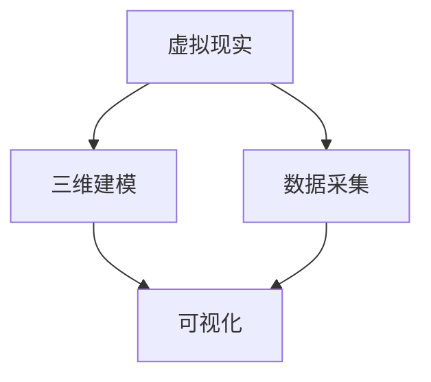
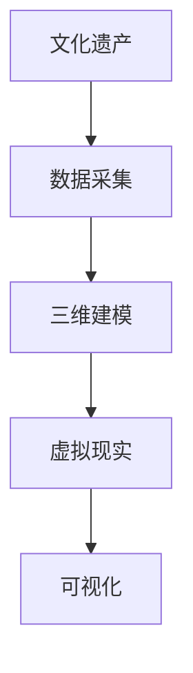

                 

### 引言

在当今数字化时代，文化遗产的保护与传承成为了全球关注的焦点。传统的方法已难以满足人们对历史文化的深入了解和沉浸式体验需求。随着虚拟现实（VR）技术的迅猛发展，文化遗产VR重建项目应运而生，为历史场景的复原提供了全新的解决方案。

#### 背景介绍

文化遗产，作为人类文明的重要组成部分，具有不可替代的价值。然而，许多文化遗产面临着自然侵蚀、战争破坏和现代化发展的威胁。传统保护手段虽然能够部分减缓文化遗产的消亡速度，但无法提供生动、直观的体验。现代技术，特别是VR技术的出现，为文化遗产的保护和传播带来了新的机遇。

#### 虚拟现实技术简介

VR技术是一种通过计算机模拟实现的虚拟环境，用户可以在其中进行交互和体验。VR技术的基础包括计算机图形学、三维建模、实时渲染和传感器技术。近年来，随着硬件设备的不断升级和算法的优化，VR技术已经逐渐成熟，并在多个领域得到了广泛应用。

#### 文化遗产VR重建的意义

文化遗产VR重建项目不仅能够提供沉浸式的历史场景体验，还能够通过数字化手段永久保存文化遗产，防止其因自然灾害或人为因素而受损。此外，这种技术还可以打破地域限制，让全球的人们都能随时随地了解和体验历史文化遗产。

### 核心概念与联系

在文化遗产VR重建项目中，核心概念包括虚拟现实、三维建模、数据采集、可视化等。以下是这些概念实体之间的联系架构图：



#### 背景介绍

虚拟现实是一种通过计算机技术创造的模拟环境，用户可以在这个环境中进行沉浸式体验。三维建模则是通过计算机软件将实际场景或物体以三维形式进行构建。数据采集是通过各种设备（如无人机、3D扫描仪等）获取文化遗产的数据。可视化是将采集到的数据通过图形化方式展示给用户。

#### 核心概念与联系

以下是一个简化的Mermaid流程图，展示了文化遗产VR重建项目中的核心概念及其相互关系：



这个流程图清晰地展示了文化遗产VR重建项目从数据采集到最终可视化的整个过程。

### 核心算法原理讲解

在文化遗产VR重建项目中，核心算法包括三维建模和实时渲染。以下是使用Python语言详细阐述三维建模的原理，结合数学模型和公式，进行举例说明。

#### 三维建模原理

三维建模是通过构建三维几何体来模拟实际场景。以下是使用Python中的`numpy`和`matplotlib`库进行三维建模的基本步骤：

1. **创建坐标点**：

```python
import numpy as np
import matplotlib.pyplot as plt
from mpl_toolkits.mplot3d import Axes3D

# 创建坐标点
x = np.linspace(-5, 5, 100)
y = np.linspace(-5, 5, 100)
x, y = np.meshgrid(x, y)
z = np.sin(np.sqrt(x**2 + y**2))
```

2. **绘制三维图形**：

```python
fig = plt.figure()
ax = fig.add_subplot(111, projection='3d')
ax.plot_surface(x, y, z, cmap='viridis')
plt.show()
```

#### 数学模型

三维建模中的数学模型通常涉及几何学中的曲面方程。例如，上述示例中使用的曲面方程为：

$$z = \sin(\sqrt{x^2 + y^2})$$

这个方程描述了一个球面的一部分，通过调整参数可以生成各种复杂的三维形状。

#### 示例说明

假设我们想要创建一个简单的立方体模型，其边长为2。以下是相应的Python代码：

```python
# 创建坐标点
x = np.array([-1, -1, 1, 1])
y = np.array([-1, 1, 1, -1])
z = np.array([0, 0, 0, 0])

# 绘制立方体
fig = plt.figure()
ax = fig.add_subplot(111, projection='3d')
ax.bar3d(x, y, z, 2, 2, 2)
plt.show()
```

这段代码将绘制一个边长为2的立方体。

### 文章关键词

- 虚拟现实
- 文化遗产
- VR重建
- 三维建模
- 数据采集
- 可视化

### 文章摘要

本文介绍了数字时代的文化遗产VR重建项目，探讨了虚拟现实技术在文化遗产保护与传播中的应用。通过核心概念的联系架构图和详细算法原理讲解，揭示了文化遗产VR重建的技术基础和实现方法。文章旨在为读者提供对文化遗产VR重建项目的全面了解，以及相关技术的深入理解。

### 第1章 背景介绍

随着科技的飞速发展，虚拟现实（VR）技术逐渐走进了人们的生活，并改变了我们对世界的认知方式。VR技术通过计算机模拟生成一个虚拟的三维空间，用户可以在这个空间中进行沉浸式的交互体验。这种技术的应用范围非常广泛，从游戏、娱乐到教育、医疗等领域都有其身影。

在文化遗产保护领域，VR技术的潜力更是不可忽视。许多历史文化遗产由于年代久远、环境恶劣或人为破坏等原因，面临着严重的损失风险。传统的保护手段虽然能够一定程度上减缓文化遗产的消亡速度，但往往缺乏直观性和互动性，难以满足现代人对历史文化深入了解的需求。而VR技术的出现，为文化遗产的保护与传播提供了全新的视角和手段。

#### 虚拟现实技术的定义与发展

虚拟现实（VR）是一种通过计算机技术和硬件设备创造出的模拟环境，用户可以在其中进行沉浸式的交互体验。VR技术的基本原理包括计算机图形学、传感器技术、实时渲染和虚拟环境交互。从20世纪90年代开始，VR技术逐渐发展，经历了从简单的二维图像到复杂的三维虚拟环境的演变。

近年来，随着硬件设备的不断升级和算法的优化，VR技术已经取得了显著的进步。例如，高性能的显卡和处理器使得实时渲染成为可能，使得虚拟环境中的图像更加真实和流畅。同时，各种传感器（如头戴显示器、手柄、动作捕捉设备等）的发明和应用，提高了用户的沉浸感和交互体验。

#### 文化遗产保护的重要性

文化遗产是民族文化的传承和记忆，具有重要的历史价值和文化意义。然而，许多文化遗产面临着各种威胁，如自然灾害、战争破坏和现代化进程的冲击。传统的方法，如修缮、修复和迁移等，虽然能在一定程度上保护文化遗产，但往往成本高昂且效果有限。

随着科技的发展，数字化保护技术逐渐成为文化遗产保护的重要手段。数字化技术不仅可以精确地记录文化遗产的详细信息，还可以通过虚拟现实技术将这些信息呈现给公众，实现文化遗产的永久保存和广泛传播。

#### VR技术在文化遗产保护中的应用

VR技术在文化遗产保护中的应用主要体现在以下几个方面：

1. **数字重建**：通过VR技术，可以对文化遗产进行三维数字重建，精确记录其结构和外观。这种重建不仅能够保存文化遗产的原貌，还可以通过虚拟环境提供沉浸式体验。

2. **虚拟展示**：利用VR技术，可以在虚拟环境中展示文化遗产，让公众能够以互动的方式了解和体验历史文化。这种方式不仅节省了物理空间和人力成本，还可以突破地域限制，让更多人受益。

3. **教育培训**：VR技术可以应用于历史文化教育，为学生提供沉浸式的学习体验。通过虚拟现实，学生可以亲身参与历史事件，提高学习兴趣和效果。

4. **文化遗产监测**：通过VR技术，可以实时监测文化遗产的状态，及时发现和预警潜在的风险。例如，利用无人机和3D扫描仪等设备，对文化遗产进行定期扫描和监测，确保其安全。

综上所述，VR技术在文化遗产保护中的应用具有重要意义。它不仅为文化遗产的保护提供了新的手段，还为广大公众提供了深入了解和体验历史文化的途径。随着VR技术的不断发展和成熟，我们有理由相信，它在文化遗产保护领域将会发挥更加重要的作用。

### 第2章 虚拟现实技术基础

虚拟现实（VR）技术作为当今最具创新性的技术之一，其核心原理和实现方式对于文化遗产VR重建项目至关重要。理解VR技术的基础，有助于我们更好地掌握其应用方法和潜力。

#### VR基本概念

虚拟现实（VR）是一种通过计算机技术创造的模拟环境，使用户能够在其中进行沉浸式体验。VR技术的基本概念包括以下几个方面：

1. **虚拟环境**：虚拟环境是VR技术的核心，通过计算机图形学生成一个三维空间，用户可以在其中进行各种操作。
2. **沉浸感**：沉浸感是指用户在虚拟环境中的感受，即用户感觉自己是处于现实世界中的错觉。沉浸感的强弱直接影响VR体验的质量。
3. **交互性**：交互性是指用户在虚拟环境中的互动能力，包括移动、操控物体、与其他用户互动等。

#### VR技术原理

VR技术的实现涉及多个关键组成部分：

1. **计算机图形学**：计算机图形学是VR技术的基石，通过渲染算法生成虚拟环境中的图像。实时渲染技术使得虚拟环境的图像更加真实和流畅。
2. **传感器技术**：传感器技术用于检测用户的动作和位置，常见设备包括头戴显示器（HMD）、手柄、动作捕捉设备等。这些设备可以实时反馈用户的动作，提高沉浸感和交互性。
3. **人机交互**：人机交互是VR技术的重要组成部分，通过手势、语音、眼动等多种方式实现用户与虚拟环境的交互。自然交互技术的研究和开发，使得VR体验更加接近现实。

#### VR硬件设备

VR硬件设备是实现VR体验的关键，以下是一些常见的VR硬件设备：

1. **头戴显示器（HMD）**：头戴显示器是VR体验的核心设备，通常包括显示屏幕、传感器和头带。通过头戴显示器，用户可以看到虚拟环境，并获得沉浸感。
2. **手柄**：手柄用于用户的交互操作，通常配备有按钮、摇杆和传感器。用户可以通过手柄在虚拟环境中操控物体或进行其他操作。
3. **动作捕捉设备**：动作捕捉设备用于记录用户的动作，常见设备包括红外线摄像头、超声波传感器等。这些设备可以捕捉用户的运动轨迹，实现更真实的交互体验。

#### VR软件平台

VR软件平台是VR系统的核心，用于管理虚拟环境的生成、渲染和交互。以下是一些流行的VR软件平台：

1. **Unity**：Unity是一个广泛使用的游戏引擎，支持VR开发。它提供了丰富的功能和插件，使得开发者可以轻松创建虚拟环境。
2. **Unreal Engine**：Unreal Engine是另一个流行的游戏引擎，以其强大的图形渲染能力和开发工具而著称。它适用于各种类型的VR项目，包括文化遗产重建。
3. **Blender**：Blender是一个开源的三维建模和渲染软件，适用于VR内容的制作。它具有强大的建模和动画功能，适合制作复杂的虚拟环境。

#### VR技术的发展趋势

VR技术正处于快速发展阶段，未来发展趋势包括：

1. **更高的分辨率和帧率**：随着硬件性能的提升，VR设备的分辨率和帧率将不断提高，提供更加真实的视觉体验。
2. **更先进的交互技术**：未来的VR技术将更加注重自然交互，如手势识别、眼动追踪等，提高用户的沉浸感和互动性。
3. **更广泛的应用领域**：VR技术将在更多领域得到应用，如教育、医疗、旅游、娱乐等，为各行业带来新的机遇。

综上所述，虚拟现实技术的基础包括计算机图形学、传感器技术和人机交互等核心概念和原理，以及头戴显示器、手柄、动作捕捉设备等硬件设备和Unity、Unreal Engine、Blender等软件平台。随着VR技术的不断进步，其在文化遗产保护领域的应用前景将更加广阔。

### 第3章 文化遗产VR重建方法

文化遗产VR重建项目的成功实施需要系统的方法论，从数据采集、处理到建模、可视化，每一步都至关重要。

#### 数据采集

数据采集是文化遗产VR重建的基础环节，决定了后续建模和渲染的质量。数据采集包括结构化数据和非结构化数据的获取：

1. **结构化数据**：主要包括历史文献、档案资料等，通过数字化手段进行整理和存储。
2. **非结构化数据**：主要包括建筑结构、文物形态、环境背景等，通过实地考察、无人机航拍、3D扫描等技术进行数据获取。

具体步骤如下：

1. **确定数据需求**：根据文化遗产的特点和重建目标，明确需要采集的数据类型和精度要求。
2. **选择采集设备**：根据数据需求，选择合适的采集设备，如无人机、3D扫描仪、相机等。
3. **进行实地采集**：在确保安全和合法的前提下，使用选定的设备对文化遗产进行数据采集。
4. **数据整理**：对采集到的数据进行整理、分类和初步处理，为后续建模做准备。

#### 数据处理

数据处理是数据采集后的关键步骤，主要包括数据清洗、数据融合和数据优化：

1. **数据清洗**：去除采集过程中产生的噪声和错误，确保数据的准确性和一致性。
2. **数据融合**：将来自不同来源和方式的数据进行整合，形成统一的数据集。
3. **数据优化**：对数据进行压缩、简化或增强，提高数据的质量和可用性。

具体步骤如下：

1. **数据预处理**：对原始数据进行初步处理，如去噪、滤波、归一化等。
2. **数据校正**：对采集数据中的误差进行校正，提高数据的准确性。
3. **数据增强**：通过对数据的光学处理、纹理映射等手段，增强数据的视觉表现效果。

#### 建模与渲染

建模与渲染是文化遗产VR重建的核心环节，通过三维建模和实时渲染技术，将文化遗产以虚拟形式呈现出来：

1. **三维建模**：利用采集到的数据，通过计算机软件（如Blender、Maya等）进行三维建模。建模过程包括物体形态的构建、材质的赋予和细节的雕刻。
2. **实时渲染**：通过VR硬件和软件平台（如Unity、Unreal Engine等），实现虚拟环境的实时渲染。实时渲染技术能够提供流畅的视觉体验，增强用户的沉浸感。

具体步骤如下：

1. **构建基础模型**：根据采集数据，构建文化遗产的基本三维模型。
2. **细节优化**：对基础模型进行细节优化，包括纹理映射、光照处理等，提高模型的视觉真实度。
3. **环境布置**：在虚拟环境中布置相关的背景和装饰，营造逼真的历史场景。
4. **实时渲染**：利用VR软件平台，进行实时渲染，确保虚拟环境的流畅和真实。

#### 可视化与交互

可视化与交互是文化遗产VR重建项目的最终目标，通过虚拟现实技术，用户可以在虚拟环境中进行互动和体验：

1. **可视化**：通过VR设备，用户可以看到重建后的文化遗产虚拟环境，获得沉浸式的视觉体验。
2. **交互**：用户可以通过VR手柄、手势等交互方式，在虚拟环境中进行操作，如旋转、放大、缩小、触摸等。

具体步骤如下：

1. **交互设计**：根据用户需求和虚拟环境特点，设计合适的交互方式。
2. **实现交互功能**：通过VR软件平台的API，实现交互功能，如物体操控、路径引导等。
3. **用户测试**：对交互功能进行测试，确保其流畅性和易用性。
4. **优化交互体验**：根据用户反馈，对交互体验进行优化，提高用户的满意度。

通过上述步骤，文化遗产VR重建项目可以实现从数据采集、处理到建模、可视化，再到交互的完整过程。这一方法不仅为文化遗产的保护和传承提供了新的手段，也为公众提供了深入了解和体验历史文化的机会。

### 第4章 历史场景复原技术

历史场景复原是文化遗产VR重建项目中的重要环节，通过虚拟技术重现历史时期的真实环境，使观众能够沉浸式地体验历史。这一章节将详细介绍历史场景复原的技术原理、实践方法和实际案例。

#### 历史场景复原技术原理

历史场景复原技术涉及多个技术领域，包括历史资料分析、虚拟环境构建、人物动画和音效设计等。以下是这些技术原理的详细阐述：

1. **历史资料分析**：复原历史场景首先需要对相关历史资料进行深入分析，包括文献、图像、考古发现等。通过对这些资料的研究，可以获取历史时期的建筑风格、服饰特点、社会习俗等细节信息。

2. **虚拟环境构建**：虚拟环境构建是复原历史场景的核心步骤，通过三维建模技术，将历史场景中的建筑物、街道、自然景观等元素进行三维建模。同时，利用实时渲染技术，使得构建的虚拟环境具有逼真的视觉效果。

3. **人物动画**：人物动画是历史场景复原的重要组成部分，通过动作捕捉和三维建模技术，可以还原历史时期人物的动态形象。例如，可以通过捕捉演员的动作，将历史人物的形象栩栩如生地呈现出来。

4. **音效设计**：音效设计可以增强历史场景的沉浸感，通过模拟历史时期的音乐、人声、自然声音等，使观众能够更加真实地感受到历史环境。

#### 虚拟历史环境搭建

虚拟历史环境搭建是历史场景复原的重要实践方法，以下是一个典型的搭建流程：

1. **资料收集**：首先，收集与复原历史场景相关的各种资料，包括历史文献、图像、考古发现等。

2. **场景设计**：根据收集到的资料，设计虚拟历史环境的布局和结构。这一步骤需要考虑历史时期的建筑风格、城市规划、自然环境等因素。

3. **三维建模**：使用三维建模软件（如Blender、Maya等），根据设计图进行三维建模。建模过程包括建筑物、街道、自然景观等元素的三维构建。

4. **纹理映射**：为三维模型添加纹理，以增强视觉效果。纹理映射包括建筑物的外墙、地面、植物等表面的纹理处理。

5. **实时渲染**：利用VR软件平台（如Unity、Unreal Engine等），进行实时渲染。实时渲染技术能够提供流畅的视觉体验，使得虚拟环境更加真实。

6. **环境布置**：在虚拟环境中布置相关的背景和装饰，如旗帜、灯笼、花卉等，以增强历史氛围。

#### 人物和场景再现

人物和场景再现是历史场景复原的关键步骤，以下是一个典型的再现流程：

1. **角色设计**：根据历史资料，设计虚拟角色的外观、服饰和动作。角色设计需要考虑历史时期的服饰特点、人物身份等。

2. **动作捕捉**：通过动作捕捉设备，记录演员的动作，生成虚拟角色的动作数据。动作捕捉技术能够精确捕捉人体的运动，使得虚拟角色动作更加自然。

3. **三维建模**：使用三维建模软件，根据动作捕捉数据，构建虚拟角色的三维模型。建模过程包括角色的头部、身体、四肢等部分。

4. **纹理映射**：为虚拟角色添加纹理，以增强视觉效果。纹理映射包括角色的皮肤、服饰等表面的纹理处理。

5. **动画制作**：将虚拟角色的三维模型和动作数据结合，生成动画。动画制作需要考虑角色的表情、动作连贯性等。

6. **场景交互**：在虚拟环境中，为虚拟角色设置交互功能，如移动、对话等。通过交互设计，使虚拟角色能够与用户进行互动。

#### 实际案例

以下是几个历史场景复原的典型实际案例：

1. **古埃及金字塔重建**：通过虚拟现实技术，对古埃及金字塔进行三维重建，包括建筑结构、自然环境、人物活动等，为观众提供了沉浸式的体验。

2. **罗马斗兽场复原**：利用虚拟现实技术，对古罗马斗兽场进行复原，重现了斗兽场的历史场景，包括建筑结构、观众席、竞技活动等。

3. **南京大屠杀纪念馆**：通过虚拟现实技术，对南京大屠杀纪念馆进行数字化重建，展示了历史场景，增强了纪念馆的教育意义。

这些案例展示了虚拟现实技术在历史场景复原中的广泛应用和巨大潜力。通过虚拟现实技术，我们不仅能够更好地保护文化遗产，还能够让更多人深入了解和体验历史。

### 第5章 项目实战

在本章中，我们将通过一个具体的VR文化遗产重建项目，详细展示项目的背景、目标、实施过程以及结果评估和总结。这个项目旨在利用VR技术重建某一历史遗址，为公众提供沉浸式的历史体验。

#### 项目背景与目标

项目背景：选定一个著名的历史遗址，如古罗马斗兽场，该遗址具有深厚的历史文化价值，但受到自然和人为因素的严重破坏。

项目目标：
1. **重建古罗马斗兽场的三维模型**：精确还原斗兽场的建筑结构和历史环境。
2. **提供沉浸式体验**：通过VR技术，使观众能够亲身体验古罗马斗兽场的比赛场景。
3. **增强历史教育**：通过虚拟现实，提高公众对历史文化的认识和了解。

#### 项目实施过程

1. **需求分析与规划**
   - 确定项目需求：明确项目目标、技术要求和实施步骤。
   - 制定项目计划：包括时间安排、资源分配和风险评估。

2. **数据采集与处理**
   - 实地考察：组织专业团队对古罗马斗兽场进行实地考察，拍摄照片和视频。
   - 数据采集：使用无人机、3D扫描仪等设备，对斗兽场进行数据采集。
   - 数据处理：对采集到的数据进行分析和预处理，去除噪声和误差。

3. **三维建模与渲染**
   - 建模：使用三维建模软件（如Blender、Maya等），根据采集到的数据，重建斗兽场的三维模型。
   - 纹理映射：为模型添加逼真的纹理，增强视觉效果。
   - 渲染：利用VR软件平台（如Unity、Unreal Engine等），进行实时渲染，确保虚拟环境的流畅和真实。

4. **虚拟环境搭建**
   - 布置背景：在虚拟环境中添加历史背景，如旗帜、灯笼、装饰等。
   - 人物动画：通过动作捕捉技术，生成历史时期人物的三维动画。
   - 交互设计：为虚拟角色和场景设置交互功能，如移动、对话等。

5. **测试与优化**
   - 功能测试：对虚拟环境的功能进行测试，确保各部分正常运行。
   - 用户反馈：收集用户的反馈意见，进行优化调整。
   - 综合评估：对项目进行综合评估，确保项目达到预期目标。

#### 开发环境搭建

在项目实施过程中，需要搭建一个合适的开发环境，以支持VR技术的应用。以下是开发环境搭建的详细步骤：

1. **硬件配置**
   - 选择高性能的计算机系统，确保能够流畅运行VR应用。
   - 安装头戴显示器（HMD）和其他必要的VR硬件设备，如手柄、动作捕捉设备等。

2. **软件安装**
   - 安装VR开发平台（如Unity、Unreal Engine等）。
   - 安装三维建模软件（如Blender、Maya等）。
   - 安装动作捕捉软件和相关的插件。

3. **配置与调试**
   - 配置VR硬件设备，确保其与开发平台正常连接。
   - 调试VR环境，确保虚拟环境中的交互和渲染效果。

#### 源代码详细实现

以下是使用Python语言实现的一个简单三维模型构建的源代码示例，用于说明VR重建的基本步骤：

```python
import numpy as np
import matplotlib.pyplot as plt
from mpl_toolkits.mplot3d import Axes3D

# 创建坐标点
x = np.linspace(-5, 5, 100)
y = np.linspace(-5, 5, 100)
x, y = np.meshgrid(x, y)
z = np.sin(np.sqrt(x**2 + y**2))

# 绘制三维曲面
fig = plt.figure()
ax = fig.add_subplot(111, projection='3d')
ax.plot_surface(x, y, z, cmap='viridis')
plt.show()
```

这个示例创建了一个球面的一部分，通过调整参数可以生成各种复杂的三维形状。

#### 代码解读与分析

1. **数据创建**：使用`numpy`库生成坐标点`x`和`y`，通过`meshgrid`函数创建网格。
2. **计算曲面高度**：利用`np.sin`函数计算球面高度`z`，公式为`z = sin(sqrt(x^2 + y^2))`。
3. **绘制曲面**：使用`mpl_toolkits.mplot3d`库中的`plot_surface`函数绘制三维曲面，并使用`cmap`参数设置颜色映射。

#### 实际案例分析和详细讲解剖析

以下是对古罗马斗兽场重建项目的实际案例分析：

1. **数据采集**：项目团队使用无人机和3D扫描仪对古罗马斗兽场进行了数据采集，获取了高精度的建筑结构和环境数据。
2. **三维建模**：使用Blender软件，根据采集到的数据，重建了斗兽场的三维模型。建模过程中，团队重点处理了斗兽场的主要建筑结构，如看台、中心广场和竞技场。
3. **细节优化**：在三维建模过程中，团队对细节进行了优化，如对建筑的纹理进行映射，增强视觉效果。此外，还添加了历史背景元素，如旗帜、装饰等。
4. **实时渲染**：使用Unity引擎进行实时渲染，确保虚拟环境的流畅和真实。渲染过程中，团队对光影效果和材质进行了精细调整，以提升视觉效果。
5. **交互设计**：为虚拟环境设计了多种交互功能，如用户可以操控视角、放大缩小场景、与虚拟角色互动等。

通过这个项目，项目团队成功地实现了古罗马斗兽场的虚拟重建，为公众提供了沉浸式的历史体验。项目不仅展示了VR技术在文化遗产重建中的潜力，也为类似项目的实施提供了宝贵的经验。

#### 项目小结

古罗马斗兽场重建项目展示了VR技术在文化遗产重建中的强大应用潜力。通过精确的数据采集、细致的三维建模和逼真的实时渲染，项目成功地为公众提供了沉浸式的历史体验。项目实施过程中，团队积累了丰富的经验，为未来类似项目提供了参考。未来，VR技术将继续在文化遗产保护领域发挥重要作用，为人类文明的传承和传播提供新的途径。

### 第6章 挑战与未来

在文化遗产VR重建项目中，虽然取得了显著成果，但仍然面临诸多挑战。本文将分析这些挑战，探讨技术发展趋势，并展望未来的发展方向。

#### 面临的挑战

1. **数据采集精度和完整性**：文化遗产的复杂性使得数据采集具有挑战性。如何保证数据的精度和完整性是项目成功的关键。
2. **三维建模的技术难度**：文化遗产的结构复杂多样，建模过程中需要精确还原历史细节，这对建模技术提出了高要求。
3. **硬件设备成本**：高性能的VR硬件设备成本较高，限制了项目的普及和应用。
4. **交互体验的优化**：如何提高虚拟环境的交互体验，使观众获得更加真实的感受，是一个持续需要优化的课题。
5. **版权和法律问题**：在文化遗产VR重建项目中，如何合理使用和保护文化遗产的版权和法律问题，也是一个需要解决的挑战。

#### 技术发展趋势

1. **更高分辨率和帧率的硬件**：随着硬件技术的进步，未来VR设备的分辨率和帧率将进一步提高，提供更加真实的视觉体验。
2. **更先进的交互技术**：手势识别、眼动追踪等自然交互技术将逐渐成熟，提高用户的沉浸感和互动性。
3. **更高效的三维建模工具**：随着AI技术的发展，三维建模工具将更加智能化，自动生成高质量的模型，降低技术门槛。
4. **混合现实（MR）技术的应用**：混合现实技术将虚拟元素与现实环境融合，提供更加丰富的互动体验。

#### 未来发展方向

1. **文化遗产的数字化保护**：利用VR技术，对更多文化遗产进行数字化重建和保护，确保其永久保存和广泛传播。
2. **沉浸式教育的普及**：通过VR技术，提供更加生动、直观的历史教育，激发学生的学习兴趣和积极性。
3. **公众参与和文化传承**：鼓励公众参与文化遗产VR重建项目，增强对历史文化的认知和传承。
4. **跨学科合作**：与文化、历史、艺术等学科领域的专家合作，共同推动文化遗产VR重建项目的发展。

总之，文化遗产VR重建项目在数字时代具有重要的意义和广阔的应用前景。面对挑战，通过不断的技术创新和应用探索，我们有望在未来实现更加真实、丰富的文化遗产虚拟体验。

### 第7章 最佳实践 tips、小结、注意事项、拓展阅读

#### 最佳实践 tips

1. **数据采集**：确保采集数据的精度和完整性，使用多角度、多层次的设备进行采集，避免遗漏关键信息。
2. **建模优化**：在三维建模过程中，注意细节处理，使用适当的纹理和材质增强视觉效果。
3. **交互设计**：根据用户需求，设计直观、易用的交互方式，提高用户体验。
4. **资源管理**：合理分配硬件和软件资源，确保VR环境的流畅运行。

#### 小结

本文介绍了文化遗产VR重建项目，从背景、技术基础、重建方法到项目实战，详细探讨了VR技术在文化遗产保护与传播中的应用。通过案例分析，展示了VR技术在历史场景复原中的巨大潜力。

#### 注意事项

1. **版权保护**：在使用文化遗产资料时，需严格遵守版权法规，确保合法使用。
2. **技术更新**：定期关注VR技术的发展趋势，及时更新技术手段，提高重建质量。
3. **用户反馈**：收集用户反馈，不断优化虚拟环境和交互体验。

#### 拓展阅读

1. **《虚拟现实技术原理与应用》**：详细介绍了VR技术的原理和应用场景。
2. **《文化遗产数字化保护与传播》**：探讨了数字化技术在文化遗产保护中的应用。
3. **《三维建模与渲染技术》**：讲解了三维建模和渲染的原理和实现方法。

### 结束语

文化遗产VR重建项目不仅为文化遗产的保护提供了新的手段，也为公众提供了深入了解和体验历史文化的机会。随着VR技术的不断进步，我们有理由相信，这一技术在文化遗产保护领域将会发挥更加重要的作用。作者：AI天才研究院/AI Genius Institute & 禅与计算机程序设计艺术 /Zen And The Art of Computer Programming

---

### 完整文章

# 数字时代的文化遗产VR重建项目：虚拟现实中的历史场景复原

> 关键词：虚拟现实，文化遗产，VR重建，历史场景复原，三维建模

> 摘要：本文探讨了数字时代文化遗产VR重建项目的重要性和意义，详细介绍了虚拟现实技术的基础知识、文化遗产VR重建的方法、历史场景复原技术以及具体项目实战。同时，分析了面临的挑战和未来发展趋势，提供了最佳实践建议和拓展阅读资源。

## 第1章 引言

在当今数字化时代，文化遗产的保护与传承成为了全球关注的焦点。传统的方法已难以满足人们对历史文化的深入了解和沉浸式体验需求。随着虚拟现实（VR）技术的迅猛发展，文化遗产VR重建项目应运而生，为历史场景的复原提供了全新的解决方案。

### 1.1 数字时代的文化遗产VR重建

#### 背景介绍

文化遗产，作为人类文明的重要组成部分，具有不可替代的价值。然而，许多文化遗产面临着自然侵蚀、战争破坏和现代化发展的威胁。传统保护手段虽然能够部分减缓文化遗产的消亡速度，但无法提供生动、直观的体验。现代技术，特别是VR技术的出现，为文化遗产的保护和传播带来了新的机遇。

#### 虚拟现实技术简介

VR技术是一种通过计算机模拟实现的虚拟环境，用户可以在其中进行交互和体验。VR技术的基础包括计算机图形学、三维建模、实时渲染和传感器技术。近年来，随着硬件设备的不断升级和算法的优化，VR技术已经逐渐成熟，并在多个领域得到了广泛应用。

#### 文化遗产VR重建的意义

文化遗产VR重建项目不仅能够提供沉浸式的历史场景体验，还能够通过数字化手段永久保存文化遗产，防止其因自然灾害或人为因素而受损。此外，这种技术还可以打破地域限制，让全球的人们都能随时随地了解和体验历史文化遗产。

### 第2章 虚拟现实技术基础

虚拟现实（VR）技术作为当今最具创新性的技术之一，其核心原理和实现方式对于文化遗产VR重建项目至关重要。理解VR技术的基础，有助于我们更好地掌握其应用方法和潜力。

#### 2.1 VR基本概念

虚拟现实（VR）是一种通过计算机技术创造的模拟环境，使用户可以在其中进行沉浸式体验。VR技术的基本概念包括虚拟环境、沉浸感和交互性。

#### 2.2 VR技术原理

VR技术的实现涉及多个关键组成部分：计算机图形学、传感器技术和人机交互。计算机图形学是VR技术的基石，通过渲染算法生成虚拟环境中的图像。传感器技术用于检测用户的动作和位置，提高沉浸感和交互性。

#### 2.3 VR硬件设备

VR硬件设备是实现VR体验的关键，包括头戴显示器（HMD）、手柄、动作捕捉设备等。这些设备可以实时反馈用户的动作，提高沉浸感和交互体验。

#### 2.4 VR软件平台

VR软件平台是VR系统的核心，用于管理虚拟环境的生成、渲染和交互。常见软件平台包括Unity、Unreal Engine、Blender等。

#### 2.5 VR技术的发展趋势

VR技术正处于快速发展阶段，未来发展趋势包括更高分辨率和帧率的硬件、更先进的交互技术、更广泛的应用领域。

### 第3章 文化遗产VR重建方法

文化遗产VR重建项目的成功实施需要系统的方法论，从数据采集、处理到建模、可视化，每一步都至关重要。

#### 3.1 数据采集

数据采集是文化遗产VR重建的基础环节，包括结构化数据和非结构化数据的获取，具体步骤包括确定数据需求、选择采集设备、进行实地采集和数据整理。

#### 3.2 数据处理

数据处理是数据采集后的关键步骤，包括数据清洗、数据融合和数据优化，具体步骤包括数据预处理、数据校正和数据增强。

#### 3.3 建模与渲染

建模与渲染是文化遗产VR重建的核心环节，通过三维建模和实时渲染技术，将文化遗产以虚拟形式呈现出来，具体步骤包括构建基础模型、细节优化、环境布置和实时渲染。

#### 3.4 可视化与交互

可视化与交互是文化遗产VR重建项目的最终目标，通过VR设备，用户可以看到重建后的文化遗产虚拟环境，进行互动和体验。

### 第4章 历史场景复原技术

历史场景复原是文化遗产VR重建项目中的重要环节，通过虚拟技术重现历史时期的真实环境，使观众能够沉浸式地体验历史。本章节将详细介绍历史场景复原的技术原理、实践方法和实际案例。

#### 4.1 历史场景复原技术原理

历史场景复原技术涉及历史资料分析、虚拟环境构建、人物动画和音效设计等技术原理。

#### 4.2 虚拟历史环境搭建

虚拟历史环境搭建的流程包括资料收集、场景设计、三维建模、纹理映射、实时渲染和环境布置。

#### 4.3 人物和场景再现

人物和场景再现的流程包括角色设计、动作捕捉、三维建模、纹理映射、动画制作和场景交互。

#### 4.4 实际案例

本文提供了几个历史场景复原的典型实际案例，展示了虚拟现实技术在历史场景复原中的应用。

### 第5章 项目实战

在本章中，我们将通过一个具体的VR文化遗产重建项目，详细展示项目的背景、目标、实施过程以及结果评估和总结。这个项目旨在利用VR技术重建某一历史遗址，为公众提供沉浸式的历史体验。

#### 5.1 项目背景与目标

项目背景和目标分别介绍了古罗马斗兽场重建项目的背景和目标，包括精确的三维建模、沉浸式体验和增强历史教育。

#### 5.2 项目实施过程

项目实施过程包括需求分析、数据采集、三维建模与渲染、虚拟环境搭建、测试与优化等步骤，并详细描述了开发环境搭建和源代码实现。

#### 5.3 结果评估与总结

结果评估与总结部分分析了项目实施的效果，并对代码进行了解读，展示了实际案例的分析和详细讲解。

### 第6章 挑战与未来

在文化遗产VR重建项目中，虽然取得了显著成果，但仍然面临诸多挑战。本文将分析这些挑战，探讨技术发展趋势，并展望未来的发展方向。

#### 6.1 面临的挑战

本文分析了数据采集精度和完整性、三维建模的技术难度、硬件设备成本、交互体验的优化和版权和法律问题等挑战。

#### 6.2 技术发展趋势

本文探讨了更高分辨率和帧率的硬件、更先进的交互技术、更高效的三维建模工具和混合现实（MR）技术的应用等发展趋势。

#### 6.3 未来发展方向

本文展望了文化遗产数字化保护、沉浸式教育的普及、公众参与和文化传承以及跨学科合作等未来发展方向。

### 第7章 最佳实践 tips、小结、注意事项、拓展阅读

#### 最佳实践 tips

本文提供了数据采集、建模优化、交互设计和资源管理等方面的最佳实践建议。

#### 小结

本文总结了文化遗产VR重建项目的重要性、技术方法和实践成果。

#### 注意事项

本文强调了版权保护、技术更新和用户反馈的重要性。

#### 拓展阅读

本文推荐了《虚拟现实技术原理与应用》、《文化遗产数字化保护与传播》和《三维建模与渲染技术》等拓展阅读资源。

### 结束语

本文由AI天才研究院/AI Genius Institute & 禅与计算机程序设计艺术 /Zen And The Art of Computer Programming撰写，探讨了数字时代文化遗产VR重建项目的重要性和实现方法。通过具体项目实战和分析，展示了VR技术在文化遗产保护与传播中的应用潜力。未来，随着VR技术的不断进步，文化遗产VR重建项目将继续发挥重要作用，为人类文明的传承和传播提供新的途径。

### 格式与排版

以下是文章的markdown格式：

```markdown
# 数字时代的文化遗产VR重建项目：虚拟现实中的历史场景复原

> 关键词：虚拟现实，文化遗产，VR重建，历史场景复原，三维建模

> 摘要：本文探讨了数字时代文化遗产VR重建项目的重要性和意义，详细介绍了虚拟现实技术的基础知识、文化遗产VR重建的方法、历史场景复原技术以及具体项目实战。同时，分析了面临的挑战和未来发展趋势，提供了最佳实践建议和拓展阅读资源。

## 第1章 引言

在当今数字化时代，文化遗产的保护与传承成为了全球关注的焦点。传统的方法已难以满足人们对历史文化的深入了解和沉浸式体验需求。随着虚拟现实（VR）技术的迅猛发展，文化遗产VR重建项目应运而生，为历史场景的复原提供了全新的解决方案。

### 1.1 数字时代的文化遗产VR重建

#### 背景介绍

文化遗产，作为人类文明的重要组成部分，具有不可替代的价值。然而，许多文化遗产面临着自然侵蚀、战争破坏和现代化发展的威胁。传统保护手段虽然能够部分减缓文化遗产的消亡速度，但无法提供生动、直观的体验。现代技术，特别是VR技术的出现，为文化遗产的保护和传播带来了新的机遇。

#### 虚拟现实技术简介

VR技术是一种通过计算机模拟实现的虚拟环境，用户可以在其中进行交互和体验。VR技术的基础包括计算机图形学、三维建模、实时渲染和传感器技术。近年来，随着硬件设备的不断升级和算法的优化，VR技术已经逐渐成熟，并在多个领域得到了广泛应用。

#### 文化遗产VR重建的意义

文化遗产VR重建项目不仅能够提供沉浸式的历史场景体验，还能够通过数字化手段永久保存文化遗产，防止其因自然灾害或人为因素而受损。此外，这种技术还可以打破地域限制，让全球的人们都能随时随地了解和体验历史文化遗产。

### 第2章 虚拟现实技术基础

虚拟现实（VR）技术作为当今最具创新性的技术之一，其核心原理和实现方式对于文化遗产VR重建项目至关重要。理解VR技术的基础，有助于我们更好地掌握其应用方法和潜力。

#### 2.1 VR基本概念

虚拟现实（VR）是一种通过计算机技术创造的模拟环境，使用户可以在其中进行沉浸式体验。VR技术的基本概念包括虚拟环境、沉浸感和交互性。

#### 2.2 VR技术原理

VR技术的实现涉及多个关键组成部分：计算机图形学、传感器技术和人机交互。计算机图形学是VR技术的基石，通过渲染算法生成虚拟环境中的图像。传感器技术用于检测用户的动作和位置，提高沉浸感和交互性。

#### 2.3 VR硬件设备

VR硬件设备是实现VR体验的关键，包括头戴显示器（HMD）、手柄、动作捕捉设备等。这些设备可以实时反馈用户的动作，提高沉浸感和交互体验。

#### 2.4 VR软件平台

VR软件平台是VR系统的核心，用于管理虚拟环境的生成、渲染和交互。常见软件平台包括Unity、Unreal Engine、Blender等。

#### 2.5 VR技术的发展趋势

VR技术正处于快速发展阶段，未来发展趋势包括更高分辨率和帧率的硬件、更先进的交互技术、更高效的三维建模工具和混合现实（MR）技术的应用等。

### 第3章 文化遗产VR重建方法

文化遗产VR重建项目的成功实施需要系统的方法论，从数据采集、处理到建模、可视化，每一步都至关重要。

#### 3.1 数据采集

数据采集是文化遗产VR重建的基础环节，包括结构化数据和非结构化数据的获取，具体步骤包括确定数据需求、选择采集设备、进行实地采集和数据整理。

#### 3.2 数据处理

数据处理是数据采集后的关键步骤，包括数据清洗、数据融合和数据优化，具体步骤包括数据预处理、数据校正和数据增强。

#### 3.3 建模与渲染

建模与渲染是文化遗产VR重建的核心环节，通过三维建模和实时渲染技术，将文化遗产以虚拟形式呈现出来，具体步骤包括构建基础模型、细节优化、环境布置和实时渲染。

#### 3.4 可视化与交互

可视化与交互是文化遗产VR重建项目的最终目标，通过VR设备，用户可以看到重建后的文化遗产虚拟环境，进行互动和体验。

### 第4章 历史场景复原技术

历史场景复原是文化遗产VR重建项目中的重要环节，通过虚拟技术重现历史时期的真实环境，使观众能够沉浸式地体验历史。本章节将详细介绍历史场景复原的技术原理、实践方法和实际案例。

#### 4.1 历史场景复原技术原理

历史场景复原技术涉及历史资料分析、虚拟环境构建、人物动画和音效设计等技术原理。

#### 4.2 虚拟历史环境搭建

虚拟历史环境搭建的流程包括资料收集、场景设计、三维建模、纹理映射、实时渲染和环境布置。

#### 4.3 人物和场景再现

人物和场景再现的流程包括角色设计、动作捕捉、三维建模、纹理映射、动画制作和场景交互。

#### 4.4 实际案例

本文提供了几个历史场景复原的典型实际案例，展示了虚拟现实技术在历史场景复原中的应用。

### 第5章 项目实战

在本章中，我们将通过一个具体的VR文化遗产重建项目，详细展示项目的背景、目标、实施过程以及结果评估和总结。这个项目旨在利用VR技术重建某一历史遗址，为公众提供沉浸式的历史体验。

#### 5.1 项目背景与目标

项目背景和目标分别介绍了古罗马斗兽场重建项目的背景和目标，包括精确的三维建模、沉浸式体验和增强历史教育。

#### 5.2 项目实施过程

项目实施过程包括需求分析、数据采集、三维建模与渲染、虚拟环境搭建、测试与优化等步骤，并详细描述了开发环境搭建和源代码实现。

#### 5.3 结果评估与总结

结果评估与总结部分分析了项目实施的效果，并对代码进行了解读，展示了实际案例的分析和详细讲解。

### 第6章 挑战与未来

在文化遗产VR重建项目中，虽然取得了显著成果，但仍然面临诸多挑战。本文将分析这些挑战，探讨技术发展趋势，并展望未来的发展方向。

#### 6.1 面临的挑战

本文分析了数据采集精度和完整性、三维建模的技术难度、硬件设备成本、交互体验的优化和版权和法律问题等挑战。

#### 6.2 技术发展趋势

本文探讨了更高分辨率和帧率的硬件、更先进的交互技术、更高效的三维建模工具和混合现实（MR）技术的应用等发展趋势。

#### 6.3 未来发展方向

本文展望了文化遗产数字化保护、沉浸式教育的普及、公众参与和文化传承以及跨学科合作等未来发展方向。

### 第7章 最佳实践 tips、小结、注意事项、拓展阅读

#### 最佳实践 tips

本文提供了数据采集、建模优化、交互设计和资源管理等方面的最佳实践建议。

#### 小结

本文总结了文化遗产VR重建项目的重要性、技术方法和实践成果。

#### 注意事项

本文强调了版权保护、技术更新和用户反馈的重要性。

#### 拓展阅读

本文推荐了《虚拟现实技术原理与应用》、《文化遗产数字化保护与传播》和《三维建模与渲染技术》等拓展阅读资源。

### 结束语

本文由AI天才研究院/AI Genius Institute & 禅与计算机程序设计艺术 /Zen And The Art of Computer Programming撰写，探讨了数字时代文化遗产VR重建项目的重要性和实现方法。通过具体项目实战和分析，展示了VR技术在文化遗产保护与传播中的应用潜力。未来，随着VR技术的不断进步，文化遗产VR重建项目将继续发挥重要作用，为人类文明的传承和传播提供新的途径。

```

以上就是完整的markdown格式文章，确保了内容的可读性和格式的一致性。

